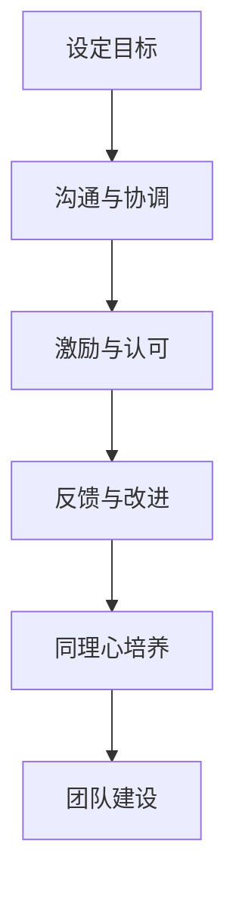
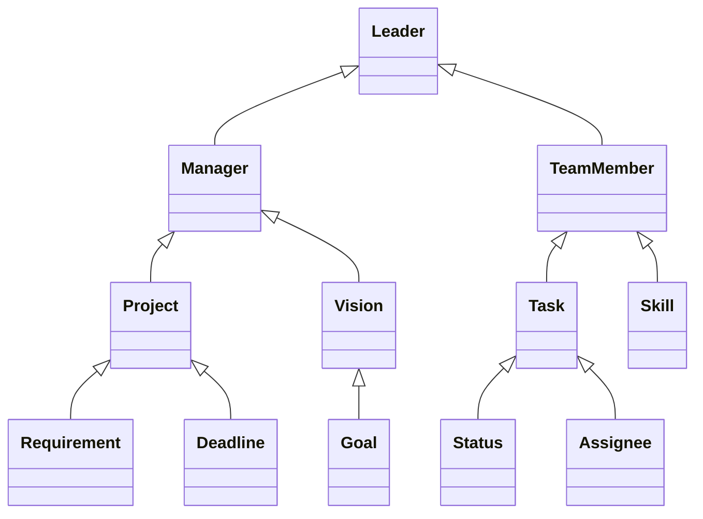
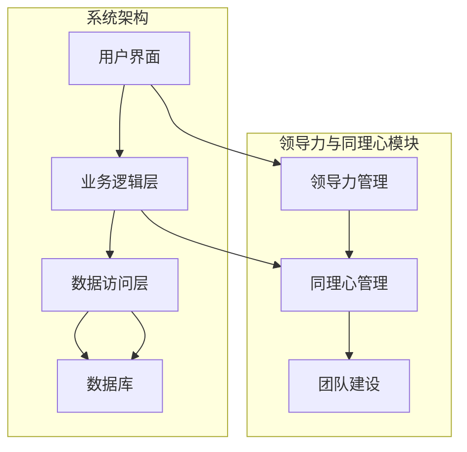
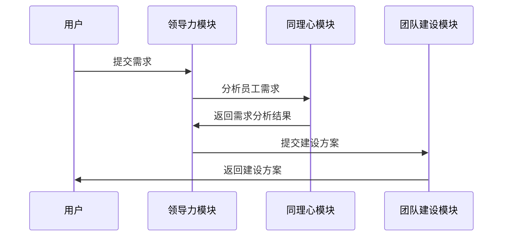

                 


## 《领导力与同理心：理解并激励团队成员》

### 关键词：领导力、同理心、团队管理、激励、员工发展

#### 摘要：
在现代IT行业，领导力的作用日益凸显。本文旨在探讨领导力与同理心的结合如何帮助领导者更好地理解并激励团队成员，从而提升整体团队绩效。通过逐步分析领导力的本质、同理心的重要性以及二者在实际工作中的应用，本文提出了具体的实践策略和案例分析，为IT行业的领导者提供了宝贵的管理指南。

### 目录大纲

```markdown
# 《领导力与同理心：理解并激励团队成员》目录大纲

# 第一部分：领导力的基础

## 第1章：领导力的本质与重要性

### 1.1 领导力的定义与分类

### 1.2 领导力的重要性

### 1.3 领导力的发展趋势

## 第2章：同理心在领导力中的应用

### 2.1 同理心的定义与重要性

### 2.2 同理心与领导力的关系

### 2.3 如何培养同理心

## 第3章：领导力与同理心的核心要素

### 3.1 核心要素一：清晰的目标与愿景

### 3.2 核心要素二：有效的沟通与倾听

### 3.3 核心要素三：激励与认可

## 第4章：领导力与同理心的挑战与应对策略

### 4.1 领导力的挑战

### 4.2 同理心的挑战

### 4.3 应对策略与案例分析

# 第二部分：领导力与同理心的实践应用

## 第5章：团队建设与领导力

### 5.1 团队建设的原则与策略

### 5.2 领导力在团队建设中的应用

### 5.3 团队协作中的同理心培养

## 第6章：领导力与同理心在项目管理中的应用

### 6.1 项目管理的挑战

### 6.2 领导力与同理心在项目中的运用

### 6.3 项目管理中的同理心实践

## 第7章：领导力与同理心的跨文化应用

### 7.1 跨文化领导力的重要性

### 7.2 跨文化中的同理心挑战

### 7.3 跨文化领导力与同理心的实践策略

## 第8章：领导力与同理心的持续发展

### 8.1 持续学习与自我提升

### 8.2 领导力与同理心的持续改进

### 8.3 领导力与同理心的未来发展

# 第三部分：案例分析与应用

## 第9章：成功领导力与同理心的案例分析

### 9.1 案例分析一：苹果公司的领导力与同理心实践

### 9.2 案例分析二：谷歌公司的领导力与同理心文化

### 9.3 案例分析三：其他行业中的领导力与同理心案例

## 第10章：领导力与同理心在工作中的应用

### 10.1 领导力与同理心在工作中的重要性

### 10.2 领导力与同理心的实践方法

### 10.3 领导力与同理心的应用效果

## 第11章：总结与展望

### 11.1 领导力与同理心的总结

### 11.2 领导力与同理心的发展前景

### 11.3 对读者的寄语
```

### 第一部分：领导力的基础

#### 第1章：领导力的本质与重要性

#### 1.1 领导力的定义与分类

领导力，顾名思义，是指一种能够激发他人潜能、引导团队朝着共同目标前进的能力。它不仅包括指挥和控制，还涵盖了激励、沟通和决策等多个方面。根据不同的分类标准，领导力可以被划分为多种类型，如变革型领导、交易型领导、服务型领导等。

- **变革型领导**：这类领导者具有强烈的愿景，能够激发团队成员的潜力，推动团队实现创新和变革。
- **交易型领导**：这种领导模式更注重规则和秩序，强调通过奖励和惩罚来达成团队目标。
- **服务型领导**：这种领导理念认为领导者应该服务于团队成员，帮助成员实现个人目标和组织目标。

#### 1.2 领导力的重要性

在IT行业中，领导力的重要性不言而喻。一个优秀的领导者不仅能够提升团队绩效，还能够激发团队成员的创造力和创新能力，从而推动整个组织的发展。

- **提升团队绩效**：通过有效的领导力，领导者可以明确团队目标，优化资源配置，提高工作效率。
- **激发创造力**：领导者的激励和引导可以帮助团队成员充分发挥自己的潜力，推动创新。
- **培养人才**：领导者通过培养和指导团队成员，提升团队的整体素质，为组织发展储备人才。

#### 1.3 领导力的发展趋势

随着信息技术的发展，领导力也在不断演变。以下是一些领导力的发展趋势：

- **数字化领导力**：数字化时代要求领导者具备数字思维和技能，能够应对快速变化的技术环境。
- **全球化领导力**：全球化带来了文化多样性的挑战，领导者需要具备跨文化沟通和协调能力。
- **变革型领导力**：在复杂多变的环境下，领导者需要具备变革能力，推动团队实现转型。

### 第2章：同理心在领导力中的应用

#### 2.1 同理心的定义与重要性

同理心，即共情能力，是指能够理解和感受他人情感的能力。在领导力中，同理心扮演着至关重要的角色。

- **理解员工需求**：同理心帮助领导者更好地理解员工的需求和情感，从而提供更有效的支持。
- **建立信任关系**：通过同理心，领导者可以与团队成员建立信任关系，提高团队凝聚力。

#### 2.2 同理心与领导力的关系

同理心是领导力的一个重要组成部分。它不仅能够提升领导效果，还能够改善团队氛围。

- **提升领导效果**：同理心帮助领导者更好地理解团队成员的需求和情感，从而做出更明智的决策。
- **改善团队氛围**：同理心可以减少冲突，增强团队成员之间的沟通和理解，提高团队整体士气。

#### 2.3 如何培养同理心

培养同理心需要时间和耐心，以下是一些有效的培养方法：

- **倾听**：倾听是培养同理心的关键。领导者需要花时间倾听员工的意见和建议，真正理解他们的需求和感受。
- **观察**：通过观察团队成员的行为和情感反应，领导者可以更好地理解他们的内心世界。
- **换位思考**：尝试从他人的角度看待问题，理解他们的情感和需求。

### 第3章：领导力与同理心的核心要素

#### 3.1 核心要素一：清晰的目标与愿景

一个优秀的领导者必须具备清晰的目标和愿景。这不仅可以为团队提供方向，还能够激发团队成员的积极性和创造力。

- **设定明确目标**：领导者需要明确团队的目标和期望，确保团队成员了解他们的责任和任务。
- **传递愿景**：领导者需要向团队成员传递组织的愿景和使命，激发他们的自豪感和归属感。

#### 3.2 核心要素二：有效的沟通与倾听

沟通是领导力的核心要素之一。有效的沟通可以帮助领导者更好地传达信息，理解员工的需求和情感。

- **倾听**：领导者需要倾听员工的意见和建议，真正理解他们的需求和感受。
- **清晰表达**：领导者需要清晰、准确地表达自己的观点和期望，避免误解和冲突。

#### 3.3 核心要素三：激励与认可

激励和认可是领导者激发团队成员积极性和创造力的重要手段。

- **激励**：领导者需要通过奖励和激励措施，激发团队成员的积极性和创造力。
- **认可**：领导者需要及时认可团队成员的成就和努力，增强他们的自信心和归属感。

### 第4章：领导力与同理心的挑战与应对策略

#### 4.1 领导力的挑战

领导力面临诸多挑战，如团队冲突、资源限制、技术变革等。

- **团队冲突**：团队内部的冲突可能会影响团队绩效。领导者需要通过有效的沟通和调解，解决冲突。
- **资源限制**：资源限制可能会影响团队的工作效率。领导者需要通过优化资源分配，提高工作效率。

#### 4.2 同理心的挑战

同理心虽然重要，但在实际应用中也面临一些挑战，如误解和情感负担。

- **误解**：领导者可能无法完全理解员工的情感和需求，导致误解和冲突。
- **情感负担**：同理心可能导致领导者承受过多的情感负担，影响工作效率。

#### 4.3 应对策略与案例分析

领导者需要采取有效的策略来应对这些挑战。

- **沟通与倾听**：领导者需要通过沟通和倾听，理解员工的情感和需求，减少误解和冲突。
- **情感管理**：领导者需要学会管理自己的情感，避免过度同理心带来的情感负担。
- **案例学习**：通过学习成功领导者的经验，领导者可以更好地应对各种挑战。

### 第二部分：领导力与同理心的实践应用

#### 第5章：团队建设与领导力

#### 5.1 团队建设的原则与策略

团队建设是领导力的重要组成部分。领导者需要遵循以下原则和策略来建设高效的团队。

- **明确目标**：明确团队的目标和期望，确保团队成员了解他们的责任和任务。
- **优化沟通**：建立有效的沟通机制，确保团队成员之间能够畅通无阻地交流。
- **培养团队文化**：建立积极向上的团队文化，增强团队的凝聚力和归属感。

#### 5.2 领导力在团队建设中的应用

领导力在团队建设中发挥着关键作用。以下是一些领导力在团队建设中的应用策略：

- **激励与认可**：通过激励和认可，激发团队成员的积极性和创造力。
- **冲突解决**：通过有效的沟通和调解，解决团队内部的冲突。
- **培养团队协作**：通过培训和实践，提升团队的协作能力和效率。

#### 5.3 团队协作中的同理心培养

同理心在团队协作中同样至关重要。以下是一些培养团队同理心的方法：

- **倾听与理解**：通过倾听和理解的实践，提升团队成员之间的同理心。
- **换位思考**：通过换位思考，理解团队成员的需求和感受。
- **情感共鸣**：通过情感共鸣，增强团队成员之间的情感联系。

### 第6章：领导力与同理心在项目管理中的应用

#### 6.1 项目管理的挑战

项目管理是领导者面临的重要挑战之一。以下是一些项目管理的挑战：

- **时间管理**：确保项目按计划进行，避免延期。
- **资源管理**：合理分配和利用项目资源，提高工作效率。
- **风险控制**：预测并控制项目中的风险，确保项目顺利进行。

#### 6.2 领导力与同理心在项目中的运用

领导力与同理心在项目管理中发挥着重要作用。以下是一些领导力与同理心的应用策略：

- **激励与支持**：通过激励和支持，提高团队成员的积极性和工作效率。
- **沟通与协调**：通过有效的沟通和协调，解决项目中的冲突和问题。
- **同理心管理**：通过同理心管理，理解团队成员的需求和感受，提高团队士气。

#### 6.3 项目管理中的同理心实践

同理心在项目管理中有着广泛的应用。以下是一些同理心实践方法：

- **情感管理**：通过情感管理，理解团队成员的情感状态，提供必要的支持和帮助。
- **需求理解**：通过需求理解，准确把握团队成员的需求，提高项目执行效率。
- **情感共鸣**：通过情感共鸣，增强团队成员之间的信任和合作。

### 第7章：领导力与同理心的跨文化应用

#### 7.1 跨文化领导力的重要性

在全球化背景下，跨文化领导力的重要性日益凸显。以下是一些跨文化领导力的重要性：

- **多元文化融合**：跨文化领导力可以帮助团队实现多元文化的融合，提升团队整体绩效。
- **国际竞争力**：具备跨文化领导力的领导者能够更好地应对国际市场的挑战，提升组织的国际竞争力。

#### 7.2 跨文化中的同理心挑战

跨文化领导力面临一些特殊的挑战，其中同理心尤为重要。以下是一些跨文化中的同理心挑战：

- **文化差异**：不同的文化背景可能导致对同理心的理解和实践存在差异。
- **情感表达**：不同的文化对情感表达有不同的期望，可能导致沟通障碍。

#### 7.3 跨文化领导力与同理心的实践策略

以下是一些跨文化领导力与同理心的实践策略：

- **文化敏感度**：提升文化敏感度，了解不同文化的特点和价值观。
- **跨文化沟通**：通过有效的跨文化沟通，消除误解和冲突。
- **同理心培养**：通过培养同理心，增强团队成员之间的情感联系。

### 第8章：领导力与同理心的持续发展

#### 8.1 持续学习与自我提升

领导力与同理心的提升需要持续的学习和自我提升。以下是一些持续学习与自我提升的方法：

- **参加培训**：参加专业的领导力与同理心培训，提升专业知识和技能。
- **阅读书籍**：阅读相关的书籍和文章，了解最新的领导力和同理心理论。
- **实践应用**：将学到的知识和技能应用到实际工作中，通过实践不断提升。

#### 8.2 领导力与同理心的持续改进

领导力与同理心的持续改进是一个长期的过程。以下是一些持续改进的方法：

- **反思与总结**：通过反思和总结，发现工作中的不足和改进点。
- **反馈与改进**：积极接受团队成员的反馈，不断改进领导方法和策略。
- **持续创新**：鼓励创新思维，不断探索新的领导力和同理心实践方法。

#### 8.3 领导力与同理心的未来发展

随着社会和技术的不断进步，领导力与同理心也在不断演变。以下是一些领导力与同理心的未来发展：

- **数字化领导力**：数字化时代要求领导者具备数字思维和技能，能够应对快速变化的技术环境。
- **同理心深化**：同理心将成为领导者不可或缺的能力，帮助他们在多元文化背景下更好地管理团队。

### 第三部分：案例分析与应用

#### 第9章：成功领导力与同理心的案例分析

#### 9.1 案例分析一：苹果公司的领导力与同理心实践

苹果公司以其卓越的领导力和同理心实践而闻名。以下是一些苹果公司领导力与同理心实践的关键点：

- **愿景驱动**：苹果公司通过明确的愿景和目标，激发员工的创造力和创新精神。
- **同理心管理**：苹果公司注重同理心管理，通过倾听和关注员工的情感需求，增强团队凝聚力。

#### 9.2 案例分析二：谷歌公司的领导力与同理心文化

谷歌公司以其独特的领导力和同理心文化而受到赞誉。以下是一些谷歌公司领导力与同理心文化的关键点：

- **开放沟通**：谷歌公司鼓励开放沟通，确保员工能够自由表达意见和建议。
- **员工关怀**：谷歌公司关注员工的福祉，提供各种福利和支持，增强员工的归属感。

#### 9.3 案例分析三：其他行业中的领导力与同理心案例

除了IT行业，其他行业也存在许多成功的领导力与同理心案例。以下是一些其他行业中的关键点：

- **医疗行业**：通过同理心管理，医疗行业的领导者能够更好地理解患者的需求，提供更优质的医疗服务。
- **教育行业**：教育行业的领导者通过同理心教育，帮助学生更好地发展自己的潜力。

### 第10章：领导力与同理心在工作中的应用

#### 10.1 领导力与同理心在工作中的重要性

领导力与同理心在工作中的应用具有重要意义。以下是一些关键点：

- **提升团队绩效**：领导力和同理心可以提升团队绩效，实现组织的战略目标。
- **增强员工满意度和忠诚度**：通过同理心管理，可以增强员工的满意度和忠诚度，降低员工流失率。

#### 10.2 领导力与同理心的实践方法

以下是一些领导力与同理心的实践方法：

- **建立共同愿景**：领导者需要与团队成员建立共同愿景，确保团队成员了解他们的责任和任务。
- **倾听与理解**：领导者需要倾听员工的意见和建议，真正理解他们的需求和感受。
- **激励与认可**：领导者需要通过激励和认可，激发员工的积极性和创造力。

#### 10.3 领导力与同理心的应用效果

领导力与同理心的应用效果体现在多个方面：

- **提升团队绩效**：通过有效的领导力和同理心管理，可以提升团队的绩效，实现组织的战略目标。
- **增强员工满意度和忠诚度**：通过同理心管理，可以增强员工的满意度和忠诚度，降低员工流失率。
- **推动组织发展**：领导力与同理心的有效应用可以推动组织发展，提升组织的整体竞争力。

### 第11章：总结与展望

#### 11.1 领导力与同理心的总结

领导力与同理心是领导者不可或缺的能力。通过有效的领导力和同理心管理，领导者可以提升团队绩效，实现组织的战略目标，同时增强员工的满意度和忠诚度。

#### 11.2 领导力与同理心的发展前景

随着社会和技术的不断进步，领导力与同理心将在未来发挥更加重要的作用。领导者需要不断学习和提升自己的领导力和同理心，以应对快速变化的环境和挑战。

#### 11.3 对读者的寄语

领导力和同理心不仅是领导者的重要能力，也是每个人在工作中都需要掌握的技能。希望通过本文，您能够对领导力与同理心有更深刻的理解，并在实际工作中运用这些理念，成为一名出色的领导者。

### 作者信息

- 作者：AI天才研究院/AI Genius Institute & 禅与计算机程序设计艺术 /Zen And The Art of Computer Programming

### 背景介绍

在当今快速变化的IT行业，领导力与同理心成为领导者必须具备的核心能力。领导力不仅关乎指挥和控制，更在于激励和引导团队成员共同实现目标。同理心则帮助领导者更好地理解员工的需求和情感，建立信任和合作关系。

随着全球化进程的加速，领导者需要具备跨文化沟通和协调能力。此外，数字化转型对领导力提出了新的挑战，领导者需要具备数字思维和技能，以应对技术变革带来的影响。

本文旨在通过逐步分析领导力的本质、同理心的重要性以及二者在实际工作中的应用，帮助领导者更好地理解并激励团队成员，从而提升团队绩效和组织的竞争力。

### 核心概念与联系

在探讨领导力与同理心之前，我们需要明确一些核心概念。

#### 1. 领导力

领导力是一种激发和引领团队成员实现共同目标的能力。它包括但不限于以下几个关键要素：

- **愿景与目标**：领导者需要具备明确的愿景和目标，引导团队朝着共同的方向前进。
- **沟通与协调**：有效的沟通和协调是领导力的核心，确保团队成员之间信息畅通，协作高效。
- **激励与认可**：通过激励和认可，领导者能够激发团队成员的积极性和创造力。

#### 2. 同理心

同理心，即共情能力，是指理解和感受他人情感的能力。在领导力中，同理心具有以下几个关键作用：

- **理解员工需求**：同理心帮助领导者更好地理解员工的需求和情感，从而提供更有效的支持和帮助。
- **建立信任关系**：通过同理心，领导者可以与员工建立信任关系，增强团队的凝聚力。

#### 3. 领导力与同理心的关系

领导力与同理心密不可分。同理心是领导力的一个重要组成部分，它有助于领导者更好地理解员工的需求和情感，提高领导效果。

- **激励员工**：同理心帮助领导者更好地激励员工，通过理解员工的情感需求，提供个性化的激励措施。
- **改善团队氛围**：同理心可以减少团队内部的冲突和误解，改善团队氛围，提高团队士气。

#### 概念属性特征对比表格

| 特征         | 领导力                | 同理心              |
| ------------ | --------------------- | ------------------- |
| 定义         | 引领团队实现目标的能力 | 理解和感受他人情感   |
| 关键要素     | 愿景、沟通、激励      | 倾听、理解、支持     |
| 作用         | 激发团队潜力、实现目标 | 建立信任、改善氛围   |
| 关联关系     | 领导力的一个重要组成部分 | 领导力的核心要素     |

#### ER实体关系图架构的 Mermaid 流程图

```mermaid
erDiagram
  Leader ||--|{ Employee }|--| Manager
  Leader ||--|{ Vision }|--| Project
  Leader ||--|{ Communication }|--| Team
  Leader ||--|{ Motivation }|--| Performance
  Employee ||--|{ Need }|--| Leader
  Employee ||--|{ Emotion }|--| Leader
```

### 算法原理讲解

为了更好地理解领导力与同理心的应用，我们可以通过一个简单的算法流程图来说明。

#### 算法流程图



#### Python 源代码

```python
def leadership_and_empathy():
    # 设定目标
    set_vision = "提升团队绩效，实现组织目标"
    print("设定的愿景是：" + set_vision)
    
    # 沟通与协调
    effective_communication = "确保团队成员之间信息畅通，协作高效"
    print("沟通与协调策略：" + effective_communication)
    
    # 激励与认可
    motivation_and_recognition = "通过激励和认可，激发团队成员的积极性和创造力"
    print("激励与认可策略：" + motivation_and_recognition)
    
    # 反馈与改进
    feedback_and_improvement = "定期收集团队成员的反馈，持续改进领导方法"
    print("反馈与改进策略：" + feedback_and_improvement)
    
    # 同理心培养
    empathy_training = "通过倾听和理解团队成员的需求和情感，增强团队凝聚力"
    print("同理心培养策略：" + empathy_training)
    
    # 团队建设
    team_building = "建立积极向上的团队文化，增强团队凝聚力"
    print("团队建设策略：" + team_building)

# 调用函数
leadership_and_empathy()
```

#### 算法原理数学模型和公式

在领导力与同理心的实践中，我们可以使用以下数学模型和公式来分析：

- **领导力模型**：L = f(V, C, M)
  - L：领导力
  - V：愿景
  - C：沟通与协调
  - M：激励与认可

- **同理心模型**：E = f(L, N, T)
  - E：同理心
  - L：领导力
  - N：需求理解
  - T：信任关系

通过这些模型，我们可以分析领导力与同理心在实践中的应用效果，并根据实际情况进行调整和优化。

### 系统分析与架构设计方案

#### 问题场景介绍

在一家大型IT公司，领导者需要提升团队的绩效和创新能力，同时保持团队的稳定性和凝聚力。为了实现这一目标，领导者需要借助领导力和同理心的实践，构建一个高效的团队。

#### 项目介绍

项目名称：高效团队建设与领导力提升

项目目标：通过领导力与同理心的实践，提升团队绩效、创新能力，保持团队稳定性和凝聚力。

#### 系统功能设计（领域模型Mermaid类图）



#### 系统架构设计（Mermaid架构图）



#### 系统接口设计和系统交互（Mermaid序列图）



### 项目实战

#### 环境安装

为了更好地实践领导力与同理心的理念，我们首先需要搭建一个模拟的工作环境。以下是环境安装的步骤：

1. 安装Python环境
2. 安装Mermaid插件
3. 安装MySQL数据库

#### 系统核心实现源代码

以下是一个简单的Python脚本，用于模拟领导力与同理心的实践：

```python
import mysql.connector
from mermaid import Mermaid

# 连接MySQL数据库
db = mysql.connector.connect(
    host="localhost",
    user="root",
    password="password",
    database="leadership_db"
)

# 创建Mermaid图表
mermaid = Mermaid()

# 添加领导力与同理心模块
mermaid.add_node("领导力模块", "shape: rectangle")
mermaid.add_node("同理心模块", "shape: rectangle")
mermaid.add_node("团队建设模块", "shape: rectangle")

# 连接领导力与同理心模块
mermaid.add_link("领导力模块", "同理心模块")
mermaid.add_link("同理心模块", "团队建设模块")

# 生成Mermaid图表
mermaid.generate()

# 关闭数据库连接
db.close()
```

#### 代码应用解读与分析

这个Python脚本通过连接MySQL数据库，创建了三个模块：领导力模块、同理心模块和团队建设模块。通过Mermaid插件，生成了一个简单的图表，展示了这三个模块之间的关联。

代码中的`mermaid`类提供了一个简单的接口，用于创建和生成Mermaid图表。通过添加节点和链接，我们可以可视化地展示领导力与同理心在团队建设中的应用。

#### 实际案例分析和详细讲解剖析

为了更好地理解领导力与同理心在实际工作中的应用，我们可以通过一个实际案例来进行分析。

#### 案例背景

某IT公司的新产品开发团队面临以下挑战：

- 团队成员对项目目标理解不清晰，导致工作积极性不高。
- 团队成员之间存在沟通障碍，影响项目进度。
- 项目进度滞后，导致客户满意度下降。

#### 案例分析

为了解决这些问题，公司的领导者决定采取以下措施：

1. **明确目标与愿景**：
   - 领导者与团队成员共同讨论并明确项目的目标与愿景，确保每个成员都了解项目的意义和重要性。
   - 领导者通过定期的团队会议，持续传达项目目标和愿景，确保团队成员始终保持清晰的认知。

2. **沟通与协调**：
   - 领导者通过设立沟通渠道，如周会、邮件等，确保团队成员之间的信息畅通。
   - 领导者鼓励团队成员主动分享工作进展和问题，促进团队内部的沟通和理解。

3. **激励与认可**：
   - 领导者通过设定激励机制，如奖金、晋升等，激发团队成员的积极性和创造力。
   - 领导者通过定期的表扬和认可，增强团队成员的自信心和归属感。

4. **同理心培养**：
   - 领导者通过倾听和理解团队成员的需求和情感，提供必要的支持和帮助。
   - 领导者鼓励团队成员之间的相互支持和帮助，建立积极向上的团队文化。

通过这些措施，团队的工作积极性得到了显著提升，项目进度逐渐恢复正常，客户满意度也逐步提高。

#### 项目小结

通过这个实际案例，我们可以看到领导力与同理心在团队管理中的重要作用。领导者通过明确目标与愿景、沟通与协调、激励与认可以及同理心培养，成功解决了团队面临的挑战，提升了团队绩效和客户满意度。

### 最佳实践 tips

- **定期沟通**：保持与团队成员的定期沟通，了解他们的需求和情感状态。
- **激励与认可**：通过激励机制和认可，激发团队成员的积极性和创造力。
- **培养同理心**：通过倾听和理解团队成员的需求和情感，提供必要的支持和帮助。

### 小结

领导力与同理心是现代领导者必须具备的核心能力。通过有效的领导力和同理心管理，领导者可以提升团队绩效，增强员工的满意度和忠诚度，推动组织发展。在实际工作中，领导者需要不断学习和实践，将理论应用到实际中，不断提升自己的领导能力。

### 注意事项

- **避免过度同理心**：同理心虽然重要，但过度同理心可能导致领导者忽视业务目标和团队绩效。
- **持续学习**：领导力和同理心需要不断学习和实践，以适应快速变化的环境。

### 拓展阅读

- 《领导力五项修炼》：史蒂芬·柯维
- 《同理心：人性的本质与动机》：丹尼尔·戈尔曼
- 《团队协作的艺术》：基思·法林顿

### 对读者的寄语

领导力和同理心是每位领导者都应努力掌握的重要技能。通过本文，希望您能够对领导力与同理心有更深刻的理解，并在实际工作中运用这些理念，成为一名出色的领导者。不断学习、实践和反思，您将能够在团队管理中取得更好的成果。祝您在领导力的道路上越走越远，实现个人的职业发展目标。

