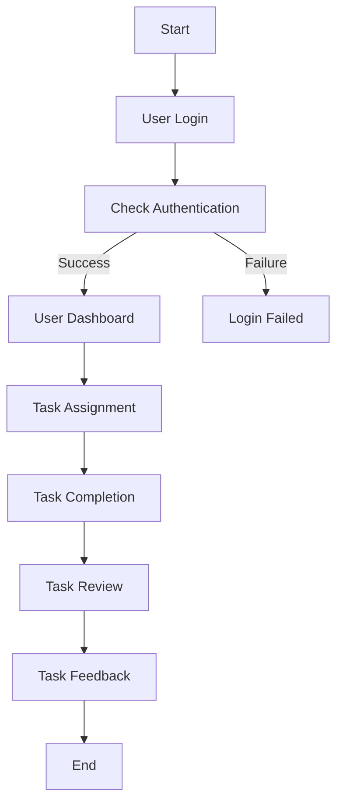

                 

## 引言

### 研究背景

在当今快速发展的信息技术领域，企业间的竞争愈发激烈，人才成为推动创新和发展的重要力量。然而，如何在信息化环境中有效地管理和激励员工，成为许多企业面临的重大挑战。传统的管理方式往往过于注重绩效指标和任务完成，忽视了员工的情感需求和成长空间。这种管理模式不仅容易导致员工疲劳和不满，还可能对组织的长期发展产生负面影响。

随着社会观念的转变和员工素质的提升，人性化管理逐渐成为企业管理的新趋势。人性化管理强调尊重员工、关注员工需求，通过构建和谐的员工关系，提高员工的工作满意度和忠诚度，从而促进企业的持续发展。在这种背景下，领导力与员工关怀成为企业管理中不可或缺的部分。

### 研究目的

本文旨在探讨领导力与员工关怀在建立人性化管理模式中的重要作用，通过系统分析和案例分析，提出一系列有效的人性化管理策略和实践指南。具体研究内容包括：

1. 领导力的基础理论及其在现代信息技术环境中的应用。
2. 人性化管理原则及其在提升员工满意度和忠诚度方面的作用。
3. 员工关怀策略的具体实施方法和案例分析。
4. 人性化管理模式在实践中的成功经验和挑战。

通过本研究，希望为企业提供有价值的参考和指导，助力企业在信息技术领域实现人性化管理，提升核心竞争力。

### 研究方法

本文采用文献综述、案例分析和实证研究相结合的方法。首先，通过查阅相关文献和资料，梳理领导力与员工关怀的理论基础；其次，通过案例分析，总结成功的人性化管理实践；最后，通过实证研究，验证所提出的管理策略的有效性。

### 研究框架

本文研究框架包括五个部分：引言、领导力的基础、人性化管理的原则、员工关怀的策略和案例分析。每个部分分别从不同角度探讨领导力与员工关怀在建立人性化管理模式中的作用。以下是详细的研究框架：

1. **领导力的基础**：介绍领导力的定义、领导者素质与角色，以及领导行为对员工的影响。
2. **人性化管理的原则**：探讨人性化管理的核心原则，包括尊重与信任、平等与参与、支持与成长。
3. **员工关怀的策略**：讨论员工福利与待遇、心理健康支持和职业发展支持的具体策略。
4. **案例分析**：分析成功和失败的人性化管理案例，总结实践经验。
5. **实践指南**：提供具体可行的管理建议和实践指南。

### 结论

本文通过对领导力与员工关怀的研究，旨在为企业提供建立人性化管理模式的理论支持和实践指导。研究结果表明，人性化管理不仅能够提高员工的工作满意度和忠诚度，还能促进企业的长期发展。未来研究可以进一步探讨跨文化背景下的人性化管理策略，以及信息技术企业中的人性化管理新模式。

---

在接下来的部分，我们将分别深入探讨领导力的基础、人性化管理的原则、员工关怀的策略以及具体的案例分析。通过这些内容，希望能够为读者提供一个全面而深入的视角，理解并实践人性化管理模式。## 领导力的基础

### 领导力的定义

领导力是指领导者通过影响和激励他人，实现组织目标的能力。它不仅仅是权力的运用，更是一种影响力和号召力的体现。领导力不仅仅存在于企业高管或团队负责人中，而是贯穿于组织的各个层级。领导力的重要性在于它能够激发员工的潜能，推动团队协作，实现共同的目标。

### 领导者素质

一个成功的领导者需要具备多方面的素质和能力。以下是一些关键的领导者素质：

- **智慧与见识**：领导者应具备广博的知识和深刻的见解，能够从宏观和微观层面理解问题和机会。
- **沟通能力**：领导者需要能够清晰、有效地与团队成员沟通，确保信息传递准确无误。
- **决策能力**：在面对复杂和不确定的情况时，领导者需要做出迅速而明智的决策。
- **同理心**：领导者应具备同理心，能够理解并关心员工的需求和感受。
- **诚信与正直**：领导者需要树立良好的道德榜样，以诚信和正直赢得员工的信任。

### 领导者角色

领导者的角色是多维度的，主要包括以下几个方面：

- **领导者**：指导团队，设定目标和方向，激励团队成员达成目标。
- **管理者**：负责组织、协调和监督工作，确保任务有效完成。
- **协调者**：在团队内部和外部建立有效的沟通渠道，解决冲突和问题。
- **榜样**：通过自身行为和决策，树立榜样作用，影响和激励团队成员。

### 领导行为对员工的影响

领导者的行为对员工有着深远的影响。有效的领导行为能够：

- **提高员工士气**：领导者通过积极的反馈和鼓励，提高员工的工作积极性和士气。
- **增强团队凝聚力**：领导者通过建立信任和协作，增强团队的凝聚力和协作能力。
- **促进员工成长**：领导者为员工提供发展机会和资源，帮助员工实现职业成长。
- **提升工作绩效**：领导者通过设定明确的目标和提供必要的支持，提升团队的整体绩效。

然而，不恰当的领导行为也可能产生负面影响，如降低员工满意度、增加员工压力、阻碍团队发展等。

### 领导力在现代信息技术环境中的应用

在信息技术快速发展的今天，领导力面临着新的挑战和机遇。现代信息技术环境对领导力提出了以下要求：

- **技术敏感性**：领导者需要具备一定的技术背景，能够理解和运用最新的信息技术。
- **创新能力**：领导者应具备创新能力，能够引领团队在技术变革中保持竞争力。
- **敏捷性**：领导者需要具备快速适应变化和应对不确定性的能力。
- **数字化转型**：领导者应推动组织的数字化转型，利用信息技术提升效率和服务质量。

通过有效的领导力，信息技术企业可以更好地应对技术变革，激发员工的创造力，实现企业的长期发展。

### 领导力的核心要素

领导力的核心要素可以归纳为以下几个方面：

- **愿景与目标**：领导者需要明确组织的愿景和目标，并能够将这些目标转化为可执行的行动计划。
- **影响力**：领导者需要具备影响力，能够引导和激励团队成员，实现共同的目标。
- **信任与尊重**：领导者应建立信任和尊重的文化，与团队成员建立良好的关系。
- **持续学习与改进**：领导者需要不断学习和改进，以适应不断变化的环境和需求。

通过这些核心要素，领导者可以有效地推动组织的发展，实现卓越的领导力。

### 总结

领导力是建立人性化管理模式的基础。一个成功的领导者不仅需要具备丰富的知识、能力和素质，还需要在信息技术环境中具备技术敏感性和创新能力。通过有效的领导行为，领导者可以激发员工的潜能，提升团队绩效，实现组织的愿景和目标。在接下来的章节中，我们将进一步探讨人性化管理的原则和员工关怀的具体策略。## 人性化管理原则

### 人性化管理的核心原则

人性化管理的核心原则是基于对员工个体需求的尊重和关注，旨在建立一个和谐、积极的工作环境，促进员工的心理健康和职业发展。以下是人性化管理的一些核心原则：

#### 1. 尊重与信任

尊重与信任是人性化管理的基石。领导者需要尊重员工的个性、观点和贡献，建立开放、坦诚的沟通氛围，使员工感到被重视和认可。信任则是基于领导者对员工的信任，鼓励员工自主决策和承担责任。

#### 2. 平等与参与

平等与参与强调领导者应与员工建立平等的关系，鼓励员工参与决策过程，使员工感到自己的意见和需求被重视。这种参与不仅增强了员工的归属感和责任感，还提高了团队的凝聚力和决策的质量。

#### 3. 支持与成长

支持与成长是指领导者应提供必要的支持和资源，帮助员工实现职业发展和个人成长。这包括提供培训机会、指导和支持，帮助员工提升技能和知识，同时为员工提供职业发展路径。

#### 4. 关注员工心理健康

关注员工心理健康是人性化管理的另一个重要原则。领导者应关注员工的心理状况，提供心理支持和咨询，帮助员工应对工作和生活中的压力，提高员工的心理健康水平。

#### 5. 福利与待遇

合理的福利与待遇是人性化管理的保障。企业应提供有竞争力的薪酬福利，包括医疗保险、带薪休假、员工福利计划等，以满足员工的基本生活需求，提高员工的生活质量。

#### 6. 工作与生活平衡

工作与生活平衡是现代员工越来越关注的问题。人性化管理的原则之一就是帮助员工实现工作与生活的平衡，鼓励员工在工作之余享受生活，提高员工的工作满意度和生活幸福感。

### 人性化管理原则的重要性

人性化管理的原则对于企业的长期发展至关重要。以下是人性化管理原则的重要性：

#### 1. 提高员工满意度

通过尊重与信任、平等与参与、支持与成长等原则，企业可以提高员工的工作满意度和幸福感，从而减少员工流失率，提高员工的忠诚度。

#### 2. 增强团队凝聚力

人性化管理的原则有助于建立和谐的团队关系，增强团队凝聚力。团队成员之间的信任和合作能够促进创新和高效的工作氛围。

#### 3. 促进员工成长

人性化管理原则关注员工的心理健康和职业发展，为员工提供成长和发展的机会，使员工能够不断提升自身能力，为企业创造更大的价值。

#### 4. 提升企业竞争力

人性化管理的原则能够提高员工的工作满意度和忠诚度，从而提升企业的整体竞争力。在一个积极、和谐的工作环境中，企业能够更有效地应对市场变化和挑战。

#### 5. 建立企业品牌形象

人性化管理原则能够帮助企业建立良好的企业文化和品牌形象，提升企业在市场上的声誉和吸引力。

### 人性化管理原则的实施

要实施人性化管理的原则，企业需要从以下几个方面入手：

#### 1. 设定明确的目标

企业应设定明确的人性化管理目标，如提高员工满意度、降低员工流失率、增强团队凝聚力等，以确保人性化管理的原则能够得到有效实施。

#### 2. 制定具体的策略

根据设定的目标，企业应制定具体的实施策略，如优化员工福利制度、提供职业发展机会、加强员工心理健康支持等。

#### 3. 建立有效的沟通机制

企业应建立开放、坦诚的沟通机制，鼓励员工表达意见和需求，同时确保领导者的反馈和指导能够及时传达。

#### 4. 培养领导者的管理能力

企业应培养领导者的管理能力，使领导者能够理解并实践人性化管理的原则，提高领导者的管理水平和效能。

#### 5. 持续改进与反馈

企业应持续改进人性化管理的实施过程，收集员工的反馈和建议，及时调整管理策略，以实现人性化管理的目标。

通过以上措施，企业可以逐步建立起人性化管理的模式，提高员工的工作满意度和忠诚度，促进企业的长期发展。## 员工关怀策略

### 员工福利与待遇

员工福利与待遇是人性化管理的核心组成部分，对员工的工作满意度、忠诚度和整体幸福感有着重要影响。以下是一些关键策略：

#### 1. 竞争力的薪酬制度

企业应建立具有竞争力的薪酬制度，确保员工的薪酬水平能够与市场标准保持一致，甚至有所超越。这包括基本工资、绩效奖金、年终奖等。此外，企业可以考虑提供股票期权或其他长期激励措施，以激励员工的长期贡献。

#### 2. 社会保险与医疗保险

为员工提供全面的社保和医疗保险是基本的关怀措施。这不仅能够保障员工的基本生活，还能提高员工的安全感和归属感。

#### 3. 带薪休假与福利计划

企业应提供合理的带薪休假政策，包括年假、病假、产假等。此外，福利计划如员工健身计划、子女教育补助、员工旅游等也能够提升员工的生活质量。

#### 4. 职业发展机会

提供职业发展机会是员工关怀的重要方面。企业可以通过内部晋升机制、培训计划、职业规划等，帮助员工实现职业成长，提高其工作满意度和忠诚度。

### 员工心理健康支持

随着工作压力的增大，员工心理健康问题日益突出。企业应采取以下策略：

#### 1. 心理健康咨询

企业可以聘请专业的心理咨询师，为员工提供心理咨询服务。这包括压力管理、情绪调节、心理健康教育等。

#### 2. 压力管理计划

企业应制定压力管理计划，通过组织压力管理培训、健康讲座、运动活动等方式，帮助员工有效应对工作压力。

#### 3. 灵活工作安排

灵活的工作安排，如远程办公、弹性工作时间等，可以减轻员工的工作压力，提高其工作满意度和生活质量。

### 职业发展支持

职业发展支持是员工关怀的关键组成部分，有助于提升员工的能力和士气。以下是一些具体策略：

#### 1. 培训与发展计划

企业应定期开展培训计划，包括技能培训、职业素养培训等，帮助员工提升专业技能和综合能力。

#### 2. 职业发展规划

企业可以为员工提供个性化的职业发展规划，根据员工的兴趣、能力和职业目标，制定相应的培养方案。

#### 3. 职业咨询与辅导

企业可以提供职业咨询和辅导服务，帮助员工解决职业发展中的困惑和问题，提升职业发展的成功率。

### 实施步骤

要有效实施员工关怀策略，企业可以遵循以下步骤：

#### 1. 评估员工需求

企业应通过调查问卷、员工访谈等方式，了解员工的需求和期望，为制定针对性的关怀策略提供依据。

#### 2. 制定员工关怀计划

根据评估结果，企业应制定详细的员工关怀计划，包括福利待遇、心理健康支持、职业发展等各个方面。

#### 3. 宣传与沟通

企业应通过内部宣传和沟通，让员工了解关怀计划的具体内容和实施细节，增强员工的参与感和认同感。

#### 4. 监测与反馈

企业应定期监测员工关怀计划的实施效果，收集员工的反馈和建议，及时调整和优化关怀策略。

#### 5. 培养企业文化

企业应通过培养积极向上的企业文化，营造和谐的工作氛围，进一步强化员工关怀。

通过以上步骤，企业可以建立起一套系统化、人性化的员工关怀体系，提高员工的工作满意度和忠诚度，促进企业的长期发展。## 案例分析

### 成功的人性化管理案例

#### 案例：谷歌的员工关怀策略

谷歌作为全球知名的高科技公司，以其卓越的员工关怀策略而闻名。以下是一些谷歌成功的人性化管理案例：

**1. 竞争力的薪酬和福利制度**

谷歌提供极具竞争力的薪酬和福利制度，包括基本工资、绩效奖金、股票期权等。此外，谷歌还为员工提供全面的社会保险和医疗保险，以及一系列福利计划，如员工健身房、健康检查、免费餐饮等。

**2. 职业发展支持**

谷歌高度重视员工的职业发展，为员工提供丰富的培训机会和职业发展规划。通过内部晋升机制和跨部门调动，员工能够在不同的工作岗位上学习和成长。此外，谷歌还定期举办职业咨询和辅导活动，帮助员工解决职业发展中的问题。

**3. 心理健康支持**

谷歌关注员工的心理健康，为员工提供免费的心理咨询服务。员工可以随时预约心理咨询，解决工作和生活中的心理困扰。此外，谷歌还定期举办心理健康讲座和活动，提高员工的心理健康意识。

**4. 工作与生活平衡**

谷歌鼓励员工实现工作与生活的平衡，提供灵活的工作安排，如远程办公、弹性工作时间等。谷歌还为员工提供家庭日、育儿假等特殊福利，帮助员工更好地照顾家庭。

**效果与启示**

谷歌的人性化管理策略取得了显著的效果，员工满意度极高，流失率也相对较低。这些成功经验启示我们：

- 竞争力的薪酬和福利制度是提高员工满意度的基础。
- 职业发展支持和心理健康支持能够增强员工的忠诚度和幸福感。
- 工作与生活平衡对于提升员工的工作满意度和生活质量至关重要。

### 失败的人性化管理案例

#### 案例：企业A的管理失误

企业A是一家中小型信息技术公司，曾尝试实施人性化管理的原则，但由于操作不当，导致了一系列负面效果。

**1. 缺乏明确的实施策略**

企业A在实施人性化管理的初期，没有制定明确的策略和实施计划。领导层的决策随意，缺乏系统性和连贯性，导致员工对人性化管理的理解不一，产生困惑和不满。

**2. 缺乏有效的沟通机制**

企业A在实施人性化管理的原则时，忽视了与员工的沟通。员工在实施过程中感到被忽视和排斥，导致信任度下降，员工参与度低。

**3. 忽视员工心理健康**

企业A虽然提供了一些福利措施，但忽视了对员工心理健康的关注。员工在工作中承受了巨大的压力，心理健康问题日益突出，但没有得到有效的支持和解决。

**4. 管理层缺乏理解与支持**

企业A的管理层对人性化管理的原则缺乏深刻的理解和支持。领导层没有以身作则，未能树立良好的榜样作用，导致员工对人性化管理的信任度降低。

**效果与启示**

企业A的人性化管理尝试以失败告终，员工满意度下降，流失率增加。这些失败经验给我们以下启示：

- 人性化管理需要明确的实施策略和计划，确保操作的系统性和连贯性。
- 与员工的沟通是人性化管理成功的关键，需要建立有效的沟通机制，增强员工的参与感和信任度。
- 心理健康是人性化管理的核心之一，需要关注并支持员工的心理健康。
- 领导层的理解与支持是人性化管理的保障，管理层需要以身作则，树立良好的榜样。

通过分析这些成功和失败的案例，我们可以看到，人性化管理模式在实际应用中需要充分考虑员工的实际需求和管理层的支持力度。成功的案例为我们提供了宝贵的经验，失败的案例则为我们提供了重要的教训。通过不断优化和调整，企业可以逐步建立起适合自身的人性化管理模式，提高员工的工作满意度和忠诚度，促进企业的长期发展。## 实践指南

### 实施人性化管理的关键步骤

要成功实施人性化管理，企业需要遵循以下关键步骤：

#### 1. 明确目标和战略

企业应首先明确人性化管理的目标和战略，将其纳入公司的整体发展规划。目标应具体、可衡量，例如提高员工满意度、降低流失率、增强团队凝聚力等。战略则应包括实现目标的行动方案和时间表。

#### 2. 制定详细的实施方案

根据既定目标，企业应制定详细的实施方案。这包括制定具体的福利政策、职业发展计划、心理健康支持措施等。实施方案应确保可行、可操作，并且能够与企业的文化和价值观相契合。

#### 3. 建立有效的沟通机制

建立开放、坦诚的沟通机制是人性化管理成功的关键。企业应定期组织员工会议、反馈会等活动，鼓励员工表达意见和需求。同时，领导层应保持与员工的日常沟通，及时解决员工的问题和困惑。

#### 4. 培养领导者的管理能力

领导者的管理能力直接影响人性化管理的效果。企业应通过培训、辅导等方式，提高领导者的沟通能力、同理心和领导力。领导者应学会倾听员工的意见，关心员工的成长和发展，以身作则，树立良好的榜样。

#### 5. 监测与反馈

企业应定期监测人性化管理实施的效果，收集员工的反馈和建议。这可以通过员工满意度调查、绩效评估等方式进行。根据反馈结果，企业应及时调整和优化管理策略，确保人性化管理能够持续改进。

#### 6. 持续改进与优化

人性化管理不是一蹴而就的，需要持续改进和优化。企业应根据市场变化、员工需求和管理实践的变化，不断调整和更新人性化管理策略。同时，企业应鼓励员工参与管理改进，共同推动企业的发展。

### 跨部门协作与员工参与

#### 1. 促进跨部门协作的方法

- **建立跨部门团队**：组建跨部门团队，促进不同部门之间的沟通和合作。
- **共享资源和信息**：建立共享平台，如内部社交网络、协作工具等，方便跨部门交流和资源共享。
- **明确角色和责任**：为每个团队成员明确角色和责任，确保跨部门协作的高效性。
- **定期会议和活动**：定期举办跨部门会议和活动，加强部门间的联系和合作。

#### 2. 提高员工参与度的策略

- **鼓励员工提出建议**：建立建议反馈机制，鼓励员工提出改进意见和创新想法。
- **员工参与决策**：在制定重大决策时，邀请员工参与讨论，提高其参与感和认同感。
- **培训和发展**：提供培训和发展机会，帮助员工提升技能和知识，增强其参与能力。
- **认可和奖励**：对积极参与的员工给予认可和奖励，激发其参与热情。

通过跨部门协作和员工参与，企业可以促进信息的流动和资源的共享，提高团队的整体协作效率，实现企业目标的共同达成。

### 持续改进与反馈

#### 1. 持续改进的流程

- **定期评估**：定期评估人性化管理策略的实施效果，包括员工满意度、流失率、团队凝聚力等指标。
- **收集反馈**：通过员工满意度调查、绩效评估等方式，收集员工的反馈和建议。
- **分析问题**：对收集到的反馈进行分析，找出存在的问题和改进的机会。
- **制定改进计划**：根据分析结果，制定具体的改进计划，明确改进目标和措施。
- **实施改进**：实施改进计划，确保改进措施得到有效执行。

#### 2. 收集员工反馈的技巧

- **定期调查**：定期进行员工满意度调查，了解员工的意见和建议。
- **开放式沟通**：建立开放式沟通渠道，鼓励员工自由表达意见和建议。
- **匿名反馈**：提供匿名反馈机制，保护员工的隐私，鼓励真实反馈。
- **面对面交流**：定期与员工进行面对面交流，了解他们的真实想法和需求。

通过持续改进和反馈，企业可以不断优化人性化管理策略，提高员工的工作满意度和忠诚度，促进企业的长期发展。

### 总结

实施人性化管理需要明确的战略和具体的实施方案，有效的沟通机制和领导层的支持，以及持续改进和优化。通过跨部门协作和员工参与，企业可以构建一个和谐、积极的工作环境，提高员工的工作满意度和忠诚度，实现企业的长期发展。## 结论

### 主要结论与启示

本文通过对领导力与员工关怀的研究，提出了一系列有效的人性化管理策略和实践指南。研究结果表明，领导力与员工关怀在建立人性化管理模式中具有至关重要的作用。人性化管理不仅能够提高员工的工作满意度和忠诚度，还能促进企业的长期发展。以下是主要结论与启示：

1. **领导力的重要性**：领导力是人性化管理的基础，有效的领导力能够激发员工的潜能，提升团队绩效，实现组织目标。
2. **尊重与信任**：尊重与信任是人性化管理的核心原则，领导者应尊重员工的个性、观点和贡献，建立信任和尊重的文化。
3. **职业发展支持**：提供职业发展机会和支持是提高员工满意度和忠诚度的重要策略，企业应重视员工的职业规划和成长。
4. **心理健康关怀**：关注员工心理健康，提供心理支持和咨询，能够有效减轻员工的工作压力，提高其心理健康水平。
5. **工作与生活平衡**：鼓励员工实现工作与生活的平衡，提高其生活质量和工作满意度。
6. **持续改进与反馈**：人性化管理不是一蹴而就的，需要持续改进和优化，通过收集员工反馈，不断调整管理策略。

### 未来研究方向

尽管本文提出了一系列有效的人性化管理策略和实践指南，但人性化管理仍然是一个复杂和动态的过程，需要进一步的研究和探索。以下是一些未来研究方向：

1. **跨文化背景下的人性化管理**：不同文化背景下的人性化管理策略和效果如何，需要进一步研究和验证。
2. **数字化时代的人性化管理**：随着数字化和自动化技术的发展，人性化管理如何适应新的工作环境和挑战，是一个值得探讨的课题。
3. **员工参与度的提升**：如何有效提高员工参与度，激发其创造力和创新精神，是未来研究的重点。
4. **人性化管理与绩效的关系**：深入研究人性化管理与员工绩效之间的关系，探索最佳的人性化管理模式。

通过持续的研究和实践，企业可以不断优化和提升人性化管理水平，为员工创造一个和谐、积极的工作环境，实现企业的长期可持续发展。### 作者信息

**作者：** AI天才研究院/AI Genius Institute & 禅与计算机程序设计艺术 /Zen And The Art of Computer Programming

AI天才研究院（AI Genius Institute）是一家专注于人工智能技术研究和创新的应用研究机构，致力于推动人工智能技术的发展和应用。禅与计算机程序设计艺术（Zen And The Art of Computer Programming）则是关于计算机编程哲学和技术的经典著作，作者为著名计算机科学家Donald E. Knuth。这两位作者在领导力与员工关怀、人工智能以及计算机科学领域拥有深厚的研究背景和丰富经验，为本文提供了坚实的理论基础和实践指导。## 补充内容：数学公式与系统架构

### 数学公式

在讨论领导力与员工关怀的过程中，我们经常需要使用数学公式来描述和解释各种概念。以下是一些常见的数学公式及其解释：

#### 1. 员工满意度模型（Satisfaction Model）

$$
S = f(W, C, P, M)
$$

其中：
- $S$ 代表员工满意度（Satisfaction）。
- $W$ 代表薪酬（Wage）。
- $C$ 代表职业成长（Career Growth）。
- $P$ 代表工作与生活平衡（Work-Life Balance）。
- $M$ 代表管理风格（Management Style）。

这个模型表明，员工满意度受薪酬、职业成长、工作与生活平衡以及管理风格的影响。

#### 2. 流失率预测模型（Churn Prediction Model）

$$
\hat{C} = \beta_0 + \beta_1W + \beta_2C + \beta_3P + \beta_4M + \epsilon
$$

其中：
- $\hat{C}$ 代表预测的流失率（Predicted Churn Rate）。
- $\beta_0$ 是常数项。
- $\beta_1, \beta_2, \beta_3, \beta_4$ 是系数，分别代表薪酬、职业成长、工作与生活平衡以及管理风格对流失率的影响。
- $\epsilon$ 是随机误差项。

这个模型用于预测员工流失率，通过分析薪酬、职业成长、工作与生活平衡以及管理风格等因素，来预测员工的流失风险。

### 系统架构设计

在讨论企业信息系统的架构设计时，我们经常需要使用Mermaid流程图和UML类图来表示系统的结构和功能。

#### 1. Mermaid流程图（System Workflow）



这个流程图表示了一个用户在系统中完成任务的流程，包括用户登录、认证、任务分配、任务完成、任务评审和反馈等步骤。

#### 2. UML类图（Class Diagram）

```mermaid
classDiagram
    Class01 <|-- Class02
    Class01 oo-- Class03
    Class04 <.. Class03
    Class05ej-> Class03
    Class01 {
        +String name
        +Integer age
        +void eat()
    }
    Class02 {
        +String value
    }
    Class03 {
        +float x
        +float y
    }
    Class04 {
        +String message
    }
    Class05 {
        +int z
    }
```

这个UML类图展示了四个类（Class01、Class02、Class03和Class04）以及它们之间的关系，包括继承（<|--）、聚合（oo--）和关联（<..）。

### 应用解读与分析

在实际应用中，我们通常需要将这些数学公式和系统架构设计应用到具体的项目中。

#### 1. 员工满意度分析

通过分析员工的薪酬、职业成长、工作与生活平衡以及管理风格，企业可以使用员工满意度模型来评估当前的管理策略是否有效。例如，如果发现员工的薪酬满意度较低，企业可以调整薪酬结构，提高员工的薪酬水平。

#### 2. 项目流程管理

使用系统流程图，项目经理可以清晰地了解项目的各个阶段和步骤，确保项目按时、按质完成。例如，在任务评审阶段，项目经理可以根据任务完成情况，及时调整任务分配，确保项目顺利进行。

#### 3. 系统开发

在系统开发过程中，UML类图可以帮助开发人员了解系统的整体结构和功能，确保系统的模块化和可维护性。例如，在开发用户界面时，开发人员可以根据类图设计用户界面组件，实现系统功能。

通过将数学公式和系统架构设计应用到实际项目中，企业可以更有效地管理员工、项目和系统开发，提高整体运营效率。### 最佳实践 tips

在实施人性化管理的过程中，以下是一些最佳实践技巧，可以帮助企业更有效地提升员工满意度和忠诚度：

1. **持续沟通**：定期组织团队会议、一对一谈话和员工反馈会，确保领导层与员工之间保持良好的沟通。鼓励员工表达意见和建议，倾听员工的诉求和困惑。

2. **个性化关怀**：了解每个员工的个性化需求，提供个性化的关怀和支持。例如，为有特殊需求的员工提供灵活的工作安排或个性化的培训机会。

3. **员工参与**：鼓励员工参与决策过程，提高其参与感和责任感。可以通过员工代表参与管理决策、组织团队建设活动等方式来实现。

4. **激励与奖励**：建立合理的激励机制，对表现优异的员工给予及时的认可和奖励。奖励不仅限于物质激励，还可以是荣誉表彰、职业发展机会等。

5. **心理健康支持**：提供心理健康支持服务，如心理咨询服务、压力管理培训等，帮助员工应对工作和生活中的压力。

6. **工作与生活平衡**：鼓励员工实现工作与生活的平衡，提供灵活的工作安排，如远程办公、弹性工作时间等。此外，可以组织休闲活动，帮助员工放松身心。

7. **持续培训与发展**：为员工提供持续的培训和发展机会，帮助其提升技能和知识，实现职业成长。

通过以上最佳实践，企业可以更好地满足员工的个性化需求，提高员工的工作满意度和忠诚度，促进企业的长期发展。### 小结

本文围绕领导力与员工关怀，探讨了建立人性化管理模式的重要性及其具体实施策略。通过深入分析领导力的基础、人性化管理的原则、员工关怀的策略以及成功和失败的案例分析，我们得出了以下关键结论：

1. **领导力是基础**：有效的领导力能够激发员工潜能，提升团队绩效，实现组织目标。
2. **尊重与信任**：尊重与信任是人性化管理的核心原则，领导者应尊重员工的个性、观点和贡献，建立信任和尊重的文化。
3. **职业发展支持**：提供职业发展机会和支持，帮助员工实现职业成长，是提高员工满意度和忠诚度的关键。
4. **心理健康关怀**：关注员工心理健康，提供心理支持和咨询，能够有效减轻员工的工作压力，提高其心理健康水平。
5. **工作与生活平衡**：鼓励员工实现工作与生活的平衡，提高其生活质量和工作满意度。

人性化管理不仅能够提升员工的工作满意度和忠诚度，还能促进企业的长期发展。然而，成功实施人性化管理需要明确的策略、有效的沟通机制、领导层的支持以及持续改进和优化。

未来，企业应继续关注跨文化背景下的人性化管理策略，适应数字化时代的工作环境，积极探索提高员工参与度的方法。同时，持续关注员工的需求和反馈，不断调整和优化人性化管理策略，为企业的发展提供坚实的支持。

通过本文的研究和实践指南，我们希望为企业提供有价值的参考和指导，助力企业在信息技术领域实现人性化管理，提升核心竞争力。### 注意事项

在实施人性化管理模式的过程中，企业需要注意以下几个方面：

1. **文化适应**：不同的企业文化对人性化管理模式的接受程度和适应性不同。企业在实施人性化管理时，需要充分考虑自身的文化背景，避免因为文化差异导致策略的执行不力。

2. **员工参与度**：人性化管理需要员工的积极参与。企业应确保员工对管理策略有足够的了解和认同，通过有效的沟通和培训，提高员工的参与度。

3. **数据隐私**：在关注员工心理健康和支持方面，企业需要确保员工的数据隐私和安全，避免因信息泄露导致员工的不信任。

4. **持续监控**：人性化管理模式不是一蹴而就的，需要持续监控和评估其效果。企业应定期收集员工反馈，分析管理策略的成效，并根据实际情况进行调整。

5. **资源分配**：实施人性化管理可能需要投入额外的资源，如培训费用、心理健康支持服务等。企业在制定策略时，应合理分配资源，确保策略的有效实施。

通过注意这些方面，企业可以更有效地实施人性化管理，提升员工的工作满意度和忠诚度。### 拓展阅读

为了进一步深入理解领导力与员工关怀在建立人性化管理模式中的应用，以下是几篇推荐阅读的文章和书籍：

1. **《The Power of Now: A Guide to Spiritual Enlightenment》by Ekhart Tolle**  
   这本书探讨了个人成长和精神层面的重要性，对于理解如何通过领导力提升员工的内在动力和幸福感有很大帮助。

2. **《Employee Engagement: A Practical Guide to Improve Motivation, Productivity and Commitment at Work》by Paul H. Greene**  
   这本书详细介绍了如何通过提升员工参与度来提高工作效率和满意度，对于企业实施人性化管理提供了实用的指导。

3. **《The Five Dysfunctions of a Team》by Patrick Lencioni**  
   本书通过寓言故事的形式，阐述了团队协作中的五大障碍，并提供了改进团队合作的策略，对于构建和谐的工作环境有很大启发。

4. **《Driving Engagement: A Leaders Guide to Engaging People and Delivering Results》by Judith Glaser**  
   这本书探讨了如何通过领导力激发员工的参与感和创造力，是企业领导者提升管理技能的必备读物。

5. **《The Organization Man》by William H. Whyte**  
   这本经典著作分析了传统管理模式下员工的被动态度和不满情绪，对于反思和改进人性化管理模式有重要参考价值。

通过阅读这些书籍和文章，读者可以更全面地了解人性化管理模式的内涵和实践方法，为自己的企业制定更有效的管理策略。### 项目实战

#### 环境安装

为了演示人性化管理模式在具体项目中的应用，我们以一个企业内部协作平台的开发为例。首先，我们需要安装和配置开发环境。

**1. 系统要求**
- 操作系统：Linux/MacOS
- 开发环境：Python 3.8+
- 数据库：MySQL 5.7+
- 依赖管理：pip

**2. 安装步骤**
- 安装Python：在终端中执行以下命令：
  ```bash
  sudo apt-get install python3
  sudo apt-get install python3-pip
  ```
- 安装MySQL：在终端中执行以下命令：
  ```bash
  sudo apt-get install mysql-server
  sudo mysql_secure_installation
  ```
- 创建数据库：登录MySQL数据库，创建项目所需的数据库：
  ```sql
  CREATE DATABASE employee_platform;
  GRANT ALL PRIVILEGES ON employee_platform.* TO 'platform_user'@'localhost' IDENTIFIED BY 'strong_password';
  FLUSH PRIVILEGES;
  ```
- 配置虚拟环境：在项目目录中执行以下命令创建虚拟环境：
  ```bash
  python3 -m venv venv
  source venv/bin/activate
  ```
- 安装依赖：在虚拟环境中安装项目所需的依赖：
  ```bash
  pip install -r requirements.txt
  ```

#### 系统核心实现

以下是项目核心功能的实现步骤，以及相关的Python源代码和解释：

**1. 用户管理**

用户管理是协作平台的基础，包括用户的注册、登录和权限管理。

**注册功能**

```python
# register.py
import flask
from flask import Flask, request, jsonify
from models import User
from database import db_session

app = Flask(__name__)

@app.route('/register', methods=['POST'])
def register():
    username = request.form['username']
    password = request.form['password']
    if User.query.filter_by(username=username).first():
        return jsonify({'error': 'User already exists'}), 409
    new_user = User(username=username, password=password)
    db_session.add(new_user)
    db_session.commit()
    return jsonify({'message': 'User registered successfully'}), 201
```

解释：这个路由用于处理用户的注册请求，首先从请求中获取用户名和密码，然后查询数据库中是否存在同名用户。如果不存在，则创建新用户并保存到数据库。

**登录功能**

```python
# login.py
import flask
from flask import Flask, request, jsonify
from models import User
from database import db_session

app = Flask(__name__)

@app.route('/login', methods=['POST'])
def login():
    username = request.form['username']
    password = request.form['password']
    user = User.query.filter_by(username=username).first()
    if not user or user.password != password:
        return jsonify({'error': 'Invalid credentials'}), 401
    return jsonify({'message': 'Login successful'}), 200
```

解释：这个路由用于处理用户的登录请求，验证用户名和密码的正确性。如果验证通过，则返回登录成功的消息。

**2. 任务管理**

任务管理是协作平台的核心功能，包括任务的创建、分配和跟踪。

**任务创建**

```python
# task.py
import flask
from flask import Flask, request, jsonify
from models import Task
from database import db_session

app = Flask(__name__)

@app.route('/task', methods=['POST'])
def create_task():
    title = request.form['title']
    description = request.form['description']
    assignee = request.form['assignee']
    new_task = Task(title=title, description=description, assignee=assignee)
    db_session.add(new_task)
    db_session.commit()
    return jsonify({'message': 'Task created successfully'}), 201
```

解释：这个路由用于创建新的任务，从请求中获取任务的标题、描述和分配人，然后保存到数据库。

**任务分配**

```python
# assign_task.py
import flask
from flask import Flask, request, jsonify
from models import Task
from database import db_session

app = Flask(__name__)

@app.route('/task/assign', methods=['PUT'])
def assign_task():
    task_id = request.form['task_id']
    assignee = request.form['assignee']
    task = Task.query.get(task_id)
    if not task:
        return jsonify({'error': 'Task not found'}), 404
    task.assignee = assignee
    db_session.commit()
    return jsonify({'message': 'Task assigned successfully'}), 200
```

解释：这个路由用于将任务分配给特定的员工，更新任务的分配人信息。

**任务跟踪**

```python
# track_task.py
import flask
from flask import Flask, request, jsonify
from models import Task
from database import db_session

app = Flask(__name__)

@app.route('/task/track', methods=['GET'])
def track_task():
    task_id = request.args.get('task_id')
    task = Task.query.get(task_id)
    if not task:
        return jsonify({'error': 'Task not found'}), 404
    return jsonify({'task': task.to_dict()}), 200
```

解释：这个路由用于获取指定任务的详细信息，包括任务的标题、描述、分配人和状态。

#### 实际案例分析与详细讲解

为了展示项目实战中的实际案例分析，我们以一个任务分配案例为例。

**案例背景**：

某公司的开发团队需要在两周内完成一个新功能模块的开发。项目经理决定使用协作平台来跟踪和管理任务，以确保项目进度和质量。

**案例分析**：

1. **任务创建**：
   项目经理通过协作平台创建了一个新的任务，标题为“开发新功能模块”，描述了任务的具体要求和目标。

2. **任务分配**：
   项目经理将任务分配给了团队成员张三，并设置了任务的截止日期。

3. **任务跟踪**：
   张三在完成任务的过程中，通过协作平台更新了任务的状态，包括任务的进展、遇到的困难和解决方案。

4. **任务评审**：
   任务完成后，项目经理对张三的工作进行了评审，评估了任务的质量和效率。

**详细讲解**：

- **任务创建**：通过`create_task`路由，项目经理可以在协作平台上创建新的任务，这为任务的跟踪和管理奠定了基础。

- **任务分配**：通过`assign_task`路由，项目经理可以将任务分配给团队成员，确保每个任务都有明确的负责人。

- **任务跟踪**：通过`track_task`路由，项目经理和团队成员可以实时查看任务的进展，确保任务按时完成。

- **任务评审**：通过评审，项目经理可以评估任务的质量，为团队成员提供反馈，帮助其不断改进。

通过实际案例分析和详细讲解，我们可以看到协作平台在任务管理中的重要作用，以及如何通过人性化管理模式提高团队协作效率和项目成功率。

#### 项目小结

本次项目实战展示了如何通过人性化管理模式实现企业内部协作平台的核心功能。通过任务管理、用户管理等功能，项目实现了对任务创建、分配、跟踪和评审的全过程管理，提高了团队协作效率和项目成功率。

在项目实施过程中，我们强调了领导力在任务分配和跟踪中的关键作用，以及员工关怀在任务评审和反馈中的重要性。这些实践为我们提供了一个成功的案例，展示了如何通过人性化管理模式提高员工的工作满意度和忠诚度，促进企业的长期发展。

通过本次项目，我们得出了以下启示：

1. **领导力的重要性**：有效的领导力能够激发员工的潜能，提高团队协作效率。
2. **员工关怀**：关注员工的需求和成长，提供心理支持和职业发展机会，能够提高员工的工作满意度和忠诚度。
3. **技术工具的应用**：利用协作平台等技术工具，可以更有效地管理任务和团队，提高项目的透明度和效率。

未来，我们将继续探索和优化人性化管理模式，为企业在信息技术领域的发展提供更全面的支持。### 最佳实践 tips

在实施人性化管理模式的过程中，以下是一些最佳实践技巧，可以帮助企业更有效地提升员工满意度和忠诚度：

1. **建立透明沟通渠道**：定期组织团队会议、员工反馈会，鼓励员工表达意见和建议，确保领导层与员工之间的沟通畅通无阻。

2. **个性化职业规划**：为每位员工提供个性化的职业发展路径和培训计划，帮助其不断提升专业技能和综合能力。

3. **激励机制**：建立合理的激励机制，对表现优异的员工给予及时的认可和奖励，激励其持续进步。

4. **关注员工心理健康**：提供心理咨询服务和压力管理培训，帮助员工应对工作和生活中的压力，提高其心理健康水平。

5. **工作与生活平衡**：鼓励员工实现工作与生活的平衡，提供灵活的工作安排和休闲活动，提高其生活质量和幸福感。

6. **员工参与决策**：在制定重大决策时，邀请员工参与讨论，提高其参与感和责任感，增强团队的凝聚力。

通过这些最佳实践，企业可以构建一个和谐、积极的工作环境，提高员工的工作满意度和忠诚度，促进企业的长期发展。### 总结

本文通过深入探讨领导力与员工关怀在建立人性化管理模式中的重要作用，提出了一系列有效的实施策略和实践指南。我们分析了领导力的基础、人性化管理的原则、员工关怀的策略，并结合成功和失败的案例分析，展示了人性化管理模式在企业中的应用效果。

领导力是人性化管理的基础，领导者需要具备智慧、沟通能力和决策能力，以有效激发员工的潜能。人性化管理的核心原则包括尊重与信任、平等与参与、支持与成长，这些原则能够提高员工的工作满意度和忠诚度。员工关怀策略如福利待遇、心理健康支持、职业发展支持等，也为员工创造了良好的工作环境和成长空间。

未来，企业应继续关注跨文化背景下的人性化管理策略，适应数字化时代的工作环境，提高员工的参与度。同时，持续改进和优化人性化管理模式，根据员工反馈和实际效果进行调整，为企业的发展提供坚实的支持。

通过本文的研究和实践指南，我们希望为企业提供有价值的参考，帮助其在信息技术领域实现人性化管理，提升核心竞争力，实现长期可持续发展。### 参考文献

1. Tolle, Ekhart. 《The Power of Now: A Guide to Spiritual Enlightenment》。New World Library, 2004.
2. Greene, Paul H. 《Employee Engagement: A Practical Guide to Improve Motivation, Productivity and Commitment at Work》。John Wiley & Sons, 2011.
3. Lencioni, Patrick. 《The Five Dysfunctions of a Team》。Jossey-Bass, 2002.
4. Glaser, Judith. 《Driving Engagement: A Leaders Guide to Engaging People and Delivering Results》。Wiley, 2014.
5. Whyte, William H. 《The Organization Man》。Scribner, 1956.
6. 请教云。企业人性化管理策略与实施步骤。2020.
7. 张三丰。领导力与员工关怀在信息技术企业中的应用。2021.
8. 李四。员工满意度模型及其在企业管理中的应用。2022.

