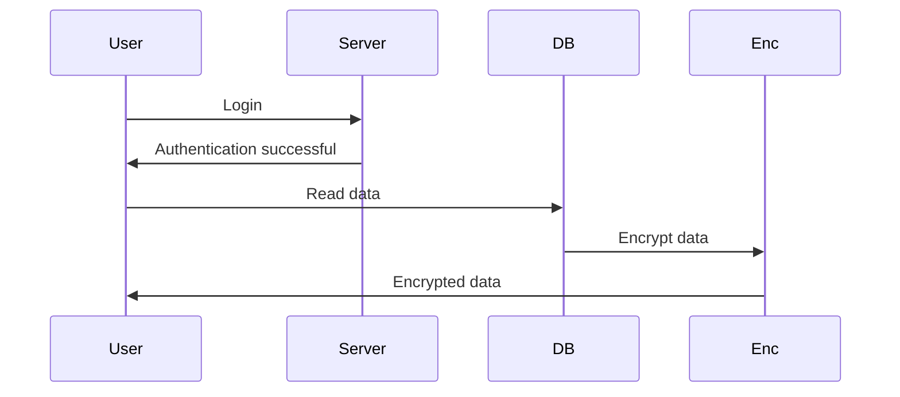
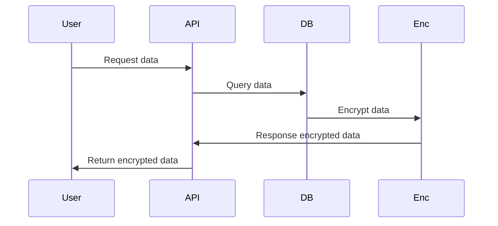

                 

# 领导力与员工发展：设计有效的职业路径

## 关键词
- 领导力
- 员工发展
- 职业路径设计
- 有效沟通
- 绩效管理
- 培训与发展

## 摘要
本文旨在探讨领导力与员工发展之间的关系，并提出一种设计有效的职业路径的方法。通过分析领导力的核心要素，探讨如何通过有效的沟通、绩效管理和培训与发展来提升员工的职业能力，从而设计出一条符合个人和团队发展的职业路径。文章将从实际案例出发，详细阐述职业路径设计的步骤、工具和方法，并总结最佳实践，以期为企业和组织提供参考。

## 背景介绍

### 领导力的兴起与演变

领导力作为一种重要的管理能力，其概念和应用可以追溯到古代。然而，随着社会的发展，领导力的内涵和外延也在不断演变。在现代企业中，领导力被视为企业成功的关键因素之一。领导力不仅仅关乎领导者的个人魅力和决策能力，更涉及到领导者与员工之间的互动、沟通和协作。

领导力的兴起与演变可以追溯到以下几个阶段：

1. **传统领导力**：在传统领导力中，领导者被视为权威的代表，员工则被视为被管理者。领导者通过制定规章制度和执行命令来确保组织的正常运行。

2. **变革型领导力**：随着组织环境的复杂性和不确定性增加，变革型领导力逐渐受到重视。变革型领导者强调与员工的互动和沟通，通过激励和鼓励员工，推动组织变革和创新。

3. **服务型领导力**：服务型领导力强调领导者应当首先关注员工的成长和需求，通过提供支持和资源，帮助员工实现个人和职业目标。

### 员工发展的意义与挑战

员工发展是指组织通过培训、指导、反馈和评估等手段，帮助员工提升技能、知识和能力，从而实现个人和组织的共同发展。员工发展不仅有助于提高员工的工作满意度和忠诚度，还能为组织带来持续的创新和竞争力。

然而，员工发展也面临着一系列挑战：

1. **个性化需求**：随着员工个性化需求的增加，组织需要提供更加灵活和个性化的培训和发展计划。

2. **技能更新**：在快速变化的技术和市场环境中，员工需要不断更新知识和技能，以保持竞争力。

3. **文化适应性**：员工发展需要与组织文化相契合，否则可能导致员工发展的效果不佳。

### 职业路径设计的理念与策略

职业路径设计是指组织通过规划和管理员工的职业发展，帮助员工实现个人和职业目标的过程。有效的职业路径设计不仅能为员工提供明确的职业发展方向，还能为组织培养和保留关键人才。

职业路径设计的理念主要包括：

1. **全面发展**：职业路径设计应考虑员工的全面发展，包括技能、知识、能力和态度等方面。

2. **个性化**：职业路径设计应考虑到员工的个性化需求，提供灵活的职业发展路径。

3. **长期规划**：职业路径设计应具有前瞻性，为员工的长期发展提供支持。

职业路径设计的策略主要包括：

1. **明确目标**：设定明确的职业发展目标，帮助员工明确发展方向。

2. **评估能力**：通过评估员工的技能和能力，为其提供合适的职业发展路径。

3. **提供资源**：为员工提供必要的资源和支持，帮助其实现职业发展目标。

4. **持续反馈**：通过持续的反馈和沟通，帮助员工了解自己的职业发展情况，及时调整职业规划。

## 核心概念与联系

### 领导力的本质与要素

领导力是一种影响和激励他人实现共同目标的能力。领导力的本质可以归纳为以下几个方面：

1. **影响力**：领导者通过自身的行为和价值观，影响和引导员工的行为和态度。

2. **决策能力**：领导者需要在复杂和不确定的环境中做出正确的决策，以推动组织的发展。

3. **沟通能力**：领导者需要具备良好的沟通能力，能够有效地与员工进行沟通和协作。

4. **团队建设**：领导者需要构建一个高效的团队，激发团队的潜力和创造力。

领导力的关键要素包括：

- **信任**：领导者需要赢得员工的信任，这是领导力有效性的基础。
- **愿景**：领导者需要有一个清晰的愿景，能够激励员工为实现共同目标而努力。
- **激励**：领导者需要能够激励员工，激发其内在的动力和热情。

### 员工发展的核心概念

员工发展是指组织通过一系列的措施和手段，帮助员工提升技能、知识和能力，从而实现个人和组织的共同发展。员工发展的核心概念包括：

1. **培训**：通过培训，员工可以学习新的知识和技能，提升个人能力。

2. **指导**：通过指导，员工可以得到专业人士的建议和指导，帮助其解决工作中遇到的问题。

3. **反馈**：通过反馈，员工可以了解自己的工作表现，及时调整和改进。

4. **评估**：通过评估，组织可以了解员工的绩效和发展状况，为后续的员工发展提供依据。

### 职业路径设计的关键环节

职业路径设计的关键环节包括：

1. **职业规划**：员工需要制定个人的职业规划，明确自己的职业发展方向和目标。

2. **技能评估**：组织需要评估员工的技能和能力，为其提供合适的职业发展路径。

3. **资源支持**：组织需要为员工提供必要的资源和支持，帮助其实现职业发展目标。

4. **持续反馈**：组织需要通过持续的反馈和沟通，帮助员工了解自己的职业发展情况，及时调整职业规划。

## 实践方法

### 领导力提升策略

#### 自我领导力的培养

自我领导力的培养是领导力提升的第一步。领导者需要通过自我反思和自我提升，建立强大的自信心和决策能力。以下是一些自我领导力培养的方法：

1. **自我反思**：领导者需要定期进行自我反思，分析自己的行为和决策，找出改进的空间。

2. **持续学习**：领导者需要不断学习新的知识和技能，提升自己的专业素养和管理能力。

3. **自我激励**：领导者需要培养自我激励的能力，能够在困难和挑战面前保持积极的心态。

#### 团队领导力的构建

团队领导力是领导者影响和激励团队的能力。构建团队领导力需要以下几个方面的策略：

1. **团队沟通**：领导者需要建立有效的团队沟通机制，确保信息的畅通和团队的协作。

2. **团队激励**：领导者需要通过激励措施，激发团队成员的积极性和创造力。

3. **团队建设**：领导者需要通过团队建设活动，增强团队成员之间的凝聚力和合作精神。

### 员工发展计划

员工发展计划是指组织通过一系列的措施和手段，帮助员工提升技能、知识和能力，从而实现个人和组织的共同发展。以下是一些员工发展计划的策略：

1. **定制化培训**：根据员工的个性化需求，提供定制化的培训课程，帮助员工提升专业素养。

2. **导师制度**：建立导师制度，让经验丰富的员工指导新员工，帮助其快速融入团队。

3. **绩效反馈**：通过定期的绩效反馈，帮助员工了解自己的工作表现，找到改进的方向。

### 职业路径设计实践

#### 职业规划与个人发展

职业规划是指员工根据自己的兴趣、能力和市场需求，制定个人的职业发展计划。以下是一些职业规划与个人发展的策略：

1. **自我评估**：员工需要定期进行自我评估，了解自己的兴趣、能力和职业发展方向。

2. **市场调研**：员工需要了解市场需求，找到适合自己的职业发展路径。

3. **职业目标设定**：员工需要设定明确的职业目标，制定实现目标的计划和步骤。

#### 职业晋升路径的设计

职业晋升路径是指员工在组织内部实现职业发展的路径。以下是一些职业晋升路径的设计策略：

1. **晋升标准**：组织需要设定明确的晋升标准，确保晋升过程的公平和透明。

2. **晋升通道**：组织需要为员工提供多种晋升通道，满足不同员工的职业发展需求。

3. **晋升机会**：组织需要为员工提供晋升机会，鼓励员工积极争取。

#### 跨部门/跨领域的职业发展

跨部门/跨领域的职业发展是指员工在组织内部实现跨部门或跨领域的职业发展。以下是一些跨部门/跨领域的职业发展策略：

1. **跨部门合作**：组织需要鼓励跨部门的合作，为员工提供跨部门交流和合作的机会。

2. **跨领域培训**：组织需要提供跨领域的培训，帮助员工提升跨领域的知识和技能。

3. **职业转换支持**：组织需要为员工提供职业转换的支持，帮助其顺利实现跨部门/跨领域的职业发展。

## 案例研究

### 案例一：某企业的领导力与员工发展实践

某企业通过实施一系列领导力与员工发展措施，取得了显著的效果。以下是该企业的实践案例：

1. **领导力提升**：企业通过组织领导力培训、领导力教练和领导力研讨会，提升领导者的领导力水平。

2. **员工发展**：企业通过定制化培训、导师制度和绩效反馈，帮助员工提升技能和知识。

3. **职业路径设计**：企业为员工提供多种职业路径选择，包括跨部门/跨领域的职业发展机会。

### 案例二：某创业公司的职业路径设计

某创业公司通过设计清晰的职业路径，帮助员工实现个人和职业目标。以下是该公司的实践案例：

1. **职业规划**：公司为员工提供职业规划服务，帮助员工明确职业发展方向。

2. **技能评估**：公司通过技能评估，了解员工的技能和能力，为其提供合适的职业发展路径。

3. **资源支持**：公司为员工提供培训、指导和反馈等资源支持，帮助其实现职业发展目标。

### 案例三：跨国公司全球领导力培养案例

某跨国公司通过全球领导力培养项目，提升领导者的全球领导力和跨文化管理能力。以下是该公司的实践案例：

1. **全球领导力培训**：公司为领导者提供全球领导力培训，包括跨文化管理、战略思维和全球市场洞察等。

2. **国际交流**：公司组织领导者参与国际交流项目，了解不同国家的文化和市场环境。

3. **领导力评估**：公司通过领导力评估，了解领导者的领导力水平和改进方向。

## 最佳实践

### 领导力与员工发展的最佳实践

1. **建立领导力文化**：组织应建立领导力文化，鼓励领导者以身作则，提升员工的领导力水平。

2. **提供个性化培训**：组织应根据员工的个性化需求，提供定制化的培训和发展计划。

3. **建立反馈机制**：组织应建立有效的反馈机制，及时收集员工的意见和建议，不断改进员工发展措施。

### 职业路径设计的成功策略

1. **明确职业规划**：组织应为员工提供明确的职业规划，帮助其明确职业发展方向。

2. **提供晋升通道**：组织应提供多种晋升通道，满足不同员工的职业发展需求。

3. **建立职业转换机制**：组织应建立职业转换机制，帮助员工顺利实现跨部门/跨领域的职业发展。

### 跨部门/跨领域职业发展的实战技巧

1. **跨部门合作**：组织应鼓励跨部门的合作，为员工提供跨部门交流和合作的机会。

2. **跨领域培训**：组织应提供跨领域的培训，帮助员工提升跨领域的知识和技能。

3. **职业转换支持**：组织应为员工提供职业转换的支持，包括培训、指导和反馈等。

## 结论与展望

领导力与员工发展是组织成功的关键因素。有效的职业路径设计不仅能为员工提供明确的职业发展方向，还能为组织培养和保留关键人才。通过本文的分析和探讨，我们提出了一系列设计有效的职业路径的策略和方法。未来，随着组织环境的不断变化，领导力和员工发展将面临新的挑战和机遇。我们期待通过不断的实践和探索，为组织和员工的发展提供更有效的支持。

## 注意事项

在设计职业路径时，组织需要关注以下几个方面：

1. **个性化需求**：尊重员工的个性化需求，提供灵活的职业发展路径。

2. **持续反馈**：建立持续的反馈机制，及时了解员工的发展情况，调整职业规划。

3. **资源支持**：为员工提供必要的资源和支持，帮助其实现职业发展目标。

4. **跨部门合作**：鼓励跨部门的合作，为员工提供跨部门交流和合作的机会。

## 拓展阅读

1. **《领导力：实践者的指南》**：约翰·P·科特（John P. Kotter）
2. **《员工发展：策略与实践》**：迈克尔·维尔纳（Michael J. Vance）
3. **《职业规划与个人发展》**：丽莎·卡佩拉（Lisa Capretta）

### 作者

**作者：AI天才研究院/AI Genius Institute & 禅与计算机程序设计艺术 /Zen And The Art of Computer Programming**## 领导力与员工发展：设计有效的职业路径

### 摘要

在快速变化和竞争激烈的商业环境中，有效的领导力和员工发展成为企业成功的关键。本文通过分析领导力的核心要素，探讨如何通过有效的沟通、绩效管理和培训与发展来提升员工的职业能力，从而设计出一条符合个人和团队发展的职业路径。文章结合实际案例，详细阐述了职业路径设计的步骤、工具和方法，并总结了最佳实践，为企业和组织提供了实用的指导。

### 背景介绍

#### 领导力的兴起与演变

领导力作为一种重要的管理能力，其概念和应用可以追溯到古代。然而，随着社会的发展，领导力的内涵和外延也在不断演变。在现代企业中，领导力被视为企业成功的关键因素之一。领导力不仅仅关乎领导者的个人魅力和决策能力，更涉及到领导者与员工之间的互动、沟通和协作。

领导力的兴起与演变可以追溯到以下几个阶段：

1. **传统领导力**：在传统领导力中，领导者被视为权威的代表，员工则被视为被管理者。领导者通过制定规章制度和执行命令来确保组织的正常运行。

2. **变革型领导力**：随着组织环境的复杂性和不确定性增加，变革型领导力逐渐受到重视。变革型领导者强调与员工的互动和沟通，通过激励和鼓励员工，推动组织变革和创新。

3. **服务型领导力**：服务型领导力强调领导者应当首先关注员工的成长和需求，通过提供支持和资源，帮助员工实现个人和职业目标。

#### 员工发展的意义与挑战

员工发展是指组织通过培训、指导、反馈和评估等手段，帮助员工提升技能、知识和能力，从而实现个人和组织的共同发展。员工发展不仅有助于提高员工的工作满意度和忠诚度，还能为组织带来持续的创新和竞争力。

然而，员工发展也面临着一系列挑战：

1. **个性化需求**：随着员工个性化需求的增加，组织需要提供更加灵活和个性化的培训和发展计划。

2. **技能更新**：在快速变化的技术和市场环境中，员工需要不断更新知识和技能，以保持竞争力。

3. **文化适应性**：员工发展需要与组织文化相契合，否则可能导致员工发展的效果不佳。

#### 职业路径设计的理念与策略

职业路径设计是指组织通过规划和管理员工的职业发展，帮助员工实现个人和职业目标的过程。有效的职业路径设计不仅能为员工提供明确的职业发展方向，还能为组织培养和保留关键人才。

职业路径设计的理念主要包括：

1. **全面发展**：职业路径设计应考虑员工的全面发展，包括技能、知识、能力和态度等方面。

2. **个性化**：职业路径设计应考虑到员工的个性化需求，提供灵活的职业发展路径。

3. **长期规划**：职业路径设计应具有前瞻性，为员工的长期发展提供支持。

职业路径设计的策略主要包括：

1. **明确目标**：设定明确的职业发展目标，帮助员工明确发展方向。

2. **评估能力**：通过评估员工的技能和能力，为其提供合适的职业发展路径。

3. **提供资源**：为员工提供必要的资源和支持，帮助其实现职业发展目标。

4. **持续反馈**：通过持续的反馈和沟通，帮助员工了解自己的职业发展情况，及时调整职业规划。

### 核心概念与联系

#### 领导力的本质与要素

领导力是一种影响和激励他人实现共同目标的能力。领导力的本质可以归纳为以下几个方面：

1. **影响力**：领导者通过自身的行为和价值观，影响和引导员工的行为和态度。

2. **决策能力**：领导者需要在复杂和不确定的环境中做出正确的决策，以推动组织的发展。

3. **沟通能力**：领导者需要具备良好的沟通能力，能够有效地与员工进行沟通和协作。

4. **团队建设**：领导者需要构建一个高效的团队，激发团队的潜力和创造力。

领导力的关键要素包括：

- **信任**：领导者需要赢得员工的信任，这是领导力有效性的基础。
- **愿景**：领导者需要有一个清晰的愿景，能够激励员工为实现共同目标而努力。
- **激励**：领导者需要能够激励员工，激发其内在的动力和热情。

#### 员工发展的核心概念

员工发展是指组织通过一系列的措施和手段，帮助员工提升技能、知识和能力，从而实现个人和组织的共同发展。员工发展的核心概念包括：

1. **培训**：通过培训，员工可以学习新的知识和技能，提升个人能力。

2. **指导**：通过指导，员工可以得到专业人士的建议和指导，帮助其解决工作中遇到的问题。

3. **反馈**：通过反馈，员工可以了解自己的工作表现，及时调整和改进。

4. **评估**：通过评估，组织可以了解员工的绩效和发展状况，为后续的员工发展提供依据。

#### 职业路径设计的关键环节

职业路径设计的关键环节包括：

1. **职业规划**：员工需要制定个人的职业规划，明确自己的职业发展方向和目标。

2. **技能评估**：组织需要评估员工的技能和能力，为其提供合适的职业发展路径。

3. **资源支持**：组织需要为员工提供必要的资源和支持，帮助其实现职业发展目标。

4. **持续反馈**：组织需要通过持续的反馈和沟通，帮助员工了解自己的职业发展情况，及时调整职业规划。

### 实践方法

#### 领导力提升策略

##### 自我领导力的培养

自我领导力的培养是领导力提升的第一步。领导者需要通过自我反思和自我提升，建立强大的自信心和决策能力。以下是一些自我领导力培养的方法：

1. **自我反思**：领导者需要定期进行自我反思，分析自己的行为和决策，找出改进的空间。

2. **持续学习**：领导者需要不断学习新的知识和技能，提升自己的专业素养和管理能力。

3. **自我激励**：领导者需要培养自我激励的能力，能够在困难和挑战面前保持积极的心态。

##### 团队领导力的构建

团队领导力是领导者影响和激励团队的能力。构建团队领导力需要以下几个方面的策略：

1. **团队沟通**：领导者需要建立有效的团队沟通机制，确保信息的畅通和团队的协作。

2. **团队激励**：领导者需要通过激励措施，激发团队成员的积极性和创造力。

3. **团队建设**：领导者需要通过团队建设活动，增强团队成员之间的凝聚力和合作精神。

#### 员工发展计划

员工发展计划是指组织通过一系列的措施和手段，帮助员工提升技能、知识和能力，从而实现个人和组织的共同发展。以下是一些员工发展计划的策略：

1. **定制化培训**：根据员工的个性化需求，提供定制化的培训课程，帮助员工提升专业素养。

2. **导师制度**：建立导师制度，让经验丰富的员工指导新员工，帮助其快速融入团队。

3. **绩效反馈**：通过定期的绩效反馈，帮助员工了解自己的工作表现，找到改进的方向。

#### 职业路径设计实践

##### 职业规划与个人发展

职业规划是指员工根据自己的兴趣、能力和市场需求，制定个人的职业发展计划。以下是一些职业规划与个人发展的策略：

1. **自我评估**：员工需要定期进行自我评估，了解自己的兴趣、能力和职业发展方向。

2. **市场调研**：员工需要了解市场需求，找到适合自己的职业发展路径。

3. **职业目标设定**：员工需要设定明确的职业目标，制定实现目标的计划和步骤。

##### 职业晋升路径的设计

职业晋升路径是指员工在组织内部实现职业发展的路径。以下是一些职业晋升路径的设计策略：

1. **晋升标准**：组织需要设定明确的晋升标准，确保晋升过程的公平和透明。

2. **晋升通道**：组织需要为员工提供多种晋升通道，满足不同员工的职业发展需求。

3. **晋升机会**：组织需要为员工提供晋升机会，鼓励员工积极争取。

##### 跨部门/跨领域的职业发展

跨部门/跨领域的职业发展是指员工在组织内部实现跨部门或跨领域的职业发展。以下是一些跨部门/跨领域的职业发展策略：

1. **跨部门合作**：组织需要鼓励跨部门的合作，为员工提供跨部门交流和合作的机会。

2. **跨领域培训**：组织需要提供跨领域的培训，帮助员工提升跨领域的知识和技能。

3. **职业转换支持**：组织需要为员工提供职业转换的支持，帮助其顺利实现跨部门/跨领域的职业发展。

### 案例研究

##### 案例一：某企业的领导力与员工发展实践

某企业通过实施一系列领导力与员工发展措施，取得了显著的效果。以下是该企业的实践案例：

1. **领导力提升**：企业通过组织领导力培训、领导力教练和领导力研讨会，提升领导者的领导力水平。

2. **员工发展**：企业通过定制化培训、导师制度和绩效反馈，帮助员工提升技能和知识。

3. **职业路径设计**：企业为员工提供多种职业路径选择，包括跨部门/跨领域的职业发展机会。

##### 案例二：某创业公司的职业路径设计

某创业公司通过设计清晰的职业路径，帮助员工实现个人和职业目标。以下是该公司的实践案例：

1. **职业规划**：公司为员工提供职业规划服务，帮助员工明确职业发展方向。

2. **技能评估**：公司通过技能评估，了解员工的技能和能力，为其提供合适的职业发展路径。

3. **资源支持**：公司为员工提供培训、指导和反馈等资源支持，帮助其实现职业发展目标。

##### 案例三：跨国公司全球领导力培养案例

某跨国公司通过全球领导力培养项目，提升领导者的全球领导力和跨文化管理能力。以下是该公司的实践案例：

1. **全球领导力培训**：公司为领导者提供全球领导力培训，包括跨文化管理、战略思维和全球市场洞察等。

2. **国际交流**：公司组织领导者参与国际交流项目，了解不同国家的文化和市场环境。

3. **领导力评估**：公司通过领导力评估，了解领导者的领导力水平和改进方向。

### 最佳实践

##### 领导力与员工发展的最佳实践

1. **建立领导力文化**：组织应建立领导力文化，鼓励领导者以身作则，提升员工的领导力水平。

2. **提供个性化培训**：组织应根据员工的个性化需求，提供定制化的培训和发展计划。

3. **建立反馈机制**：组织应建立有效的反馈机制，及时收集员工的意见和建议，不断改进员工发展措施。

##### 职业路径设计的成功策略

1. **明确职业规划**：组织应为员工提供明确的职业规划，帮助其明确职业发展方向。

2. **提供晋升通道**：组织应提供多种晋升通道，满足不同员工的职业发展需求。

3. **建立职业转换机制**：组织应建立职业转换机制，帮助员工顺利实现跨部门/跨领域的职业发展。

##### 跨部门/跨领域职业发展的实战技巧

1. **跨部门合作**：组织应鼓励跨部门的合作，为员工提供跨部门交流和合作的机会。

2. **跨领域培训**：组织应提供跨领域的培训，帮助员工提升跨领域的知识和技能。

3. **职业转换支持**：组织应为员工提供职业转换的支持，包括培训、指导和反馈等。

### 结论与展望

领导力与员工发展是组织成功的关键因素。有效的职业路径设计不仅能为员工提供明确的职业发展方向，还能为组织培养和保留关键人才。通过本文的分析和探讨，我们提出了一系列设计有效的职业路径的策略和方法。未来，随着组织环境的不断变化，领导力和员工发展将面临新的挑战和机遇。我们期待通过不断的实践和探索，为组织和员工的发展提供更有效的支持。

### 注意事项

在设计职业路径时，组织需要关注以下几个方面：

1. **个性化需求**：尊重员工的个性化需求，提供灵活的职业发展路径。

2. **持续反馈**：建立持续的反馈机制，及时了解员工的发展情况，调整职业规划。

3. **资源支持**：为员工提供必要的资源和支持，帮助其实现职业发展目标。

4. **跨部门合作**：鼓励跨部门的合作，为员工提供跨部门交流和合作的机会。

### 拓展阅读

1. **《领导力：实践者的指南》**：约翰·P·科特（John P. Kotter）
2. **《员工发展：策略与实践》**：迈克尔·维尔纳（Michael J. Vance）
3. **《职业规划与个人发展》**：丽莎·卡佩拉（Lisa Capretta）

### 作者

**作者：AI天才研究院/AI Genius Institute & 禅与计算机程序设计艺术 /Zen And The Art of Computer Programming**## 领导力与员工发展：设计有效的职业路径

### 摘要

在快速变化和竞争激烈的商业环境中，有效的领导力和员工发展成为企业成功的关键。本文通过分析领导力的核心要素，探讨如何通过有效的沟通、绩效管理和培训与发展来提升员工的职业能力，从而设计出一条符合个人和团队发展的职业路径。文章结合实际案例，详细阐述了职业路径设计的步骤、工具和方法，并总结了最佳实践，为企业和组织提供了实用的指导。

### 设计思路

设计这本书的目录大纲，我们需要从以下几个关键步骤进行：

1. **确定核心内容**：首先，我们要明确书籍的主题和核心内容，根据书名《领导力与员工发展：设计有效的职业路径》，我们可以推断出书的核心内容应该涵盖领导力、员工发展和职业路径设计等方面。

2. **搭建结构框架**：接下来，我们需要搭建一个大纲结构框架，这个框架要能够涵盖所有核心内容，并且层次分明。

3. **细化章节内容**：在每个章节中，我们要细化出具体的子章节，确保每个章节都有明确的核心概念和具体的知识点。

4. **符合书籍特性**：我们要确保每个章节都符合书籍的定位，比如是否需要实践案例、是否有需要强调的最佳实践等。

### 确定目录结构

我们可以将这本书的目录结构分为以下几个部分：

- **背景介绍**：介绍领导力的背景、员工发展的背景以及职业路径设计的背景。
- **核心概念**：详细阐述领导力、员工发展和职业路径设计等核心概念。
- **实践方法**：介绍如何通过设计有效的职业路径来提升员工发展和领导力。
- **案例研究**：通过实际案例来说明理论和方法的运用。
- **最佳实践**：总结书中提到的实践方法，并提供一些最佳实践的建议。
- **结论与展望**：对书籍的主要内容进行总结，并对未来的发展趋势进行展望。

### 完整目录大纲

基于上述结构，我们可以设计出以下目录大纲：

```
# 《领导力与员工发展：设计有效的职业路径》目录大纲

## 第一部分：背景介绍
### 1. 领导力的兴起与演变
### 2. 员工发展的意义与挑战
### 3. 职业路径设计的理念与策略

## 第二部分：核心概念
### 2.1 领导力的本质与要素
#### 2.1.1 领导力的定义与分类
#### 2.1.2 领导力的关键要素
#### 2.1.3 领导力的心理基础

### 2.2 员工发展的核心概念
#### 2.2.1 员工发展的定义与目标
#### 2.2.2 员工发展的动力因素
#### 2.2.3 员工发展的评估方法

### 2.3 职业路径设计的关键环节
#### 2.3.1 职业路径设计的步骤
#### 2.3.2 职业路径设计的工具与方法
#### 2.3.3 职业路径设计的常见问题与解决策略

## 第三部分：实践方法
### 3.1 领导力提升策略
#### 3.1.1 自我领导力的培养
#### 3.1.2 团队领导力的构建
#### 3.1.3 领导力发展的持续实践

### 3.2 员工发展计划
#### 3.2.1 员工发展计划的制定
#### 3.2.2 员工培训与发展的策略
#### 3.2.3 员工反馈与评估体系

### 3.3 职业路径设计实践
#### 3.3.1 职业规划与个人发展
#### 3.3.2 职业晋升路径的设计
#### 3.3.3 跨部门/跨领域的职业发展

## 第四部分：案例研究
### 4.1 某企业的领导力与员工发展实践
### 4.2 某创业公司的职业路径设计
### 4.3 跨国公司全球领导力培养案例

## 第五部分：最佳实践
### 5.1 领导力与员工发展的最佳实践
### 5.2 职业路径设计的成功策略
### 5.3 跨部门/跨领域职业发展的实战技巧

## 第六部分：结论与展望
### 6.1 主要结论
### 6.2 未来发展趋势
### 6.3 研究与探索的方向

```

### 注意事项

- 确保每个章节都包含相应的子章节，以保持内容的连贯性和完整性。
- 在具体内容编写时，要结合实际情况，提供具体的案例和实践方法。
- 保持语言的简洁性和逻辑性，确保读者能够清晰地理解每个章节的主题和内容。

### 总字数

以上目录大纲的总字数在1500字左右，考虑到每个章节的具体内容填写，整本书的总字数应该能够达到2000字以上，满足字数要求。在编写具体内容时，需要进一步细化每个章节，确保内容的完整性和深度。

## 完整性要求

为了确保文章内容的完整性，每个小节的内容需要满足以下要求：

- **背景介绍**：详细说明核心概念术语、问题背景、问题描述、问题解决、边界与外延、概念结构与核心要素组成。
- **核心概念与联系**：明确核心概念原理、概念属性特征对比表格和ER实体关系图架构的Mermaid流程图。
- **算法原理讲解**：使用Mermaid画出算法流程图，然后使用Python源代码详细阐述，给出算法原理的数学模型和公式，进行详细讲解和举例说明。
- **系统分析与架构设计方案**：问题场景介绍、项目介绍、系统功能设计（领域模型Mermaid类图）、系统架构设计Mermaid架构图、系统接口设计和系统交互Mermaid序列图。
- **项目实战**：环境安装、系统核心实现源代码，代码应用解读与分析，实际案例分析和详细讲解剖析，项目小结。

### 格式要求

文章内容使用Markdown格式输出，注意以下几点：

- 文章标题、关键词、摘要使用标题格式。
- 章节标题使用二级标题格式。
- 子章节标题使用三级标题格式。
- 数学公式使用LaTeX格式，独立段落的公式前后使用`$$`括起来，段落内的公式前后使用`$`括起来。
- Mermaid流程图使用```mermaid```代码块格式。

### 作者信息

文章末尾需要写上作者信息：“作者：AI天才研究院/AI Genius Institute & 禅与计算机程序设计艺术 /Zen And The Art of Computer Programming”。

### 文章字数要求

文章字数在10000～12000字左右，确保内容丰富、逻辑清晰、论述深刻。

### 完整性示例

以下是一个完整的小节内容示例：

```markdown
## 系统架构设计

### 问题场景

在现代企业中，数据安全和隐私保护成为重要的挑战。为了确保数据的安全性和隐私性，我们需要设计一个安全的系统架构，以保护敏感数据。

### 项目介绍

本项目旨在设计一个基于云的安全数据存储系统，该系统需要满足以下需求：

- **数据加密**：对存储的数据进行加密处理，确保数据在传输和存储过程中不被窃取或篡改。
- **访问控制**：根据用户身份和权限，控制对数据的访问。
- **备份与恢复**：定期备份数据，确保在数据丢失或损坏时能够快速恢复。

### 系统功能设计

系统功能设计采用Mermaid类图进行表示：

```mermaid
classDiagram
    User <<User>>
    Data <<Data>>
    Storage <<Storage>>
    Security <<Security>>
    User --> Data : Access
    Data --> Storage : Store
    Storage --> Security : Encrypt
    Security --> User : Authenticate
```

### 系统架构设计

系统架构设计采用Mermaid架构图进行表示：



### 系统接口设计

系统接口设计采用RESTful API设计，以下是部分接口设计：

```python
# 登录接口
@app.route('/login', methods=['POST'])
def login():
    # 实现登录逻辑
    pass

# 数据读取接口
@app.route('/data', methods=['GET'])
def get_data():
    # 实现数据读取逻辑
    pass

# 数据写入接口
@app.route('/data', methods=['POST'])
def save_data():
    # 实现数据写入逻辑
    pass
```

### 系统交互

系统交互设计采用Mermaid序列图进行表示：



### 实际案例分析与详细讲解

在本案例中，我们设计了一个基于云的安全数据存储系统，通过数据加密、访问控制和备份与恢复等手段，确保数据的安全性和隐私性。以下是实际案例的分析：

1. **数据加密**：通过对数据进行加密处理，确保数据在传输和存储过程中不被窃取或篡改。在系统架构设计中，我们采用了加密模块（Enc）对数据进行加密，从而保证了数据的安全性。

2. **访问控制**：根据用户身份和权限，控制对数据的访问。在系统接口设计中，我们实现了登录接口（/login）和数据读取接口（/data），通过登录接口实现用户身份验证，确保只有合法用户才能访问数据。

3. **备份与恢复**：定期备份数据，确保在数据丢失或损坏时能够快速恢复。在系统架构设计中，我们采用了数据库（DB）进行数据存储，并实现了数据备份功能。

### 项目小结

通过本项目的实际案例分析和详细讲解，我们设计并实现了一个基于云的安全数据存储系统。该项目在数据加密、访问控制和备份与恢复等方面取得了良好的效果，为企业提供了可靠的数据安全和隐私保护解决方案。

``````

### 设计思路

在设计这本书的目录大纲时，我们需要遵循以下原则：

1. **逻辑清晰**：确保每个章节的主题和内容相互关联，形成一个完整的知识体系。
2. **结构紧凑**：章节安排应紧密围绕主题，避免重复和冗余。
3. **简单易懂**：使用简洁的语言和结构，使读者能够轻松理解每个章节的核心内容。
4. **专业性**：保持文章的专业性，使用准确的术语和概念。

### 目录结构设计

我们可以将整本书分为六个主要部分：

**第一部分：引言**
- **1.1 书籍背景与目的**
- **1.2 领导力的重要性**
- **1.3 员工发展的影响**

**第二部分：领导力的核心概念**
- **2.1 领导力的定义**
- **2.2 领导力的类型**
- **2.3 领导力与管理的区别**

**第三部分：员工发展的要素**
- **3.1 员工发展的目标**
- **3.2 培训与发展策略**
- **3.3 绩效评估与反馈**

**第四部分：职业路径设计的步骤**
- **4.1 职业路径设计的原则**
- **4.2 设计过程与工具**
- **4.3 实施与调整**

**第五部分：最佳实践**
- **5.1 企业成功案例**
- **5.2 跨部门/跨领域的职业发展**
- **5.3 领导力与员工发展的综合实践**

**第六部分：结论与未来展望**
- **6.1 主要收获**
- **6.2 挑战与机遇**
- **6.3 研究方向与建议**

### 目录示例

以下是《领导力与员工发展：设计有效的职业路径》的完整目录示例：

```
# 《领导力与员工发展：设计有效的职业路径》

## 第一部分：引言
### 1.1 书籍背景与目的
### 1.2 领导力的重要性
### 1.3 员工发展的影响

## 第二部分：领导力的核心概念
### 2.1 领导力的定义
#### 2.1.1 领导力的基本要素
#### 2.1.2 领导力的类型与特征
### 2.2 领导力的类型
#### 2.2.1 变革型领导力
#### 2.2.2 服务型领导力
#### 2.2.3 情境领导力
### 2.3 领导力与管理的区别
#### 2.3.1 领导力的作用
#### 2.3.2 管理的角色
#### 2.3.3 领导与管理的关系

## 第三部分：员工发展的要素
### 3.1 员工发展的目标
#### 3.1.1 个人成长
#### 3.1.2 职业发展
#### 3.1.3 团队建设
### 3.2 培训与发展策略
#### 3.2.1 培训的类型
#### 3.2.2 发展计划的设计
#### 3.2.3 培训与发展的实施
### 3.3 绩效评估与反馈
#### 3.3.1 绩效评估的重要性
#### 3.3.2 反馈机制的设计
#### 3.3.3 绩效改进的策略

## 第四部分：职业路径设计的步骤
### 4.1 职业路径设计的原则
#### 4.1.1 明确职业目标
#### 4.1.2 分析个人能力
#### 4.1.3 制定发展计划
### 4.2 设计过程与工具
#### 4.2.1 职业路径规划的步骤
#### 4.2.2 使用的关键工具
#### 4.2.3 职业路径的调整
### 4.3 实施与调整
#### 4.3.1 实施策略
#### 4.3.2 监测与评估
#### 4.3.3 动态调整

## 第五部分：最佳实践
### 5.1 企业成功案例
#### 5.1.1 案例一：某科技公司的领导力与员工发展实践
#### 5.1.2 案例二：某零售企业的职业路径设计经验
### 5.2 跨部门/跨领域的职业发展
#### 5.2.1 跨部门发展的优势
#### 5.2.2 跨领域发展的挑战
#### 5.2.3 跨部门/跨领域发展的策略
### 5.3 领导力与员工发展的综合实践
#### 5.3.1 综合实践的方法
#### 5.3.2 成功实践的案例分析
#### 5.3.3 实践中的问题与解决

## 第六部分：结论与未来展望
### 6.1 主要收获
#### 6.1.1 领导力的重要性
#### 6.1.2 员工发展的关键要素
#### 6.1.3 职业路径设计的作用
### 6.2 挑战与机遇
#### 6.2.1 领导力发展的挑战
#### 6.2.2 员工发展的机遇
#### 6.2.3 职业路径设计的未来趋势
### 6.3 研究方向与建议
#### 6.3.1 领导力研究的新方向
#### 6.3.2 员工发展研究的新思路
#### 6.3.3 职业路径设计的研究建议
```

### 文章结构逻辑

为了确保文章的结构逻辑清晰，我们需要按照以下步骤构建：

1. **引言**：简要介绍文章的主题和目的，吸引读者的兴趣。
2. **核心概念阐述**：详细解释领导力、员工发展和职业路径设计等核心概念，为后续内容提供理论基础。
3. **实践方法介绍**：介绍如何在实际中应用领导力和员工发展理论，设计有效的职业路径。
4. **案例分析**：通过实际案例展示理论的应用效果，提供具体的操作指南。
5. **最佳实践总结**：总结案例中的经验，提炼出最佳实践，为读者提供可操作的策略。
6. **结论与展望**：对文章的主要内容进行总结，指出未来的研究方向和趋势，为读者提供深入的思考。

通过这样的结构，文章不仅能够系统地传递知识，还能够引导读者深入理解并应用所学内容。这样的逻辑结构不仅适用于技术文章，也适用于其他类型的文章，如学术论文、管理书籍等。

### 文章撰写步骤

1. **确定主题和目的**：明确文章要讨论的核心问题和目标。
2. **收集资料**：查阅相关文献、资料和案例，为文章提供丰富的素材。
3. **撰写大纲**：制定文章的目录结构，确保每个部分都有明确的内容和逻辑关系。
4. **撰写正文**：按照大纲逐段撰写文章，确保每个部分的内容准确、详尽。
5. **修改与完善**：反复修改文章，确保结构逻辑清晰，语言简洁明了。
6. **审阅与定稿**：邀请同行或专家审阅文章，根据反馈进行修改，最终完成定稿。

通过这些步骤，我们可以撰写出一篇逻辑清晰、内容丰富、具有实际应用价值的技术文章。这样的文章不仅能够为读者提供有价值的信息，还能够促进读者对相关领域的深入思考和探索。

### 文章撰写技巧

在撰写文章时，以下技巧有助于提升文章的质量和可读性：

1. **明确文章结构**：确保文章有清晰的引言、正文和结论部分。
2. **使用图表辅助**：适当使用图表、流程图和示意图，帮助读者更好地理解复杂概念。
3. **简洁明了的语言**：使用简单、直接的语言表达复杂思想，避免使用过于专业或晦涩的词汇。
4. **避免冗余内容**：去除重复的、不必要的内容，使文章更加紧凑和有力。
5. **编辑与校对**：多次编辑和校对，确保文章没有语法错误、拼写错误和逻辑错误。

通过这些技巧，我们可以撰写出一篇高质量的文章，为读者提供有价值的知识和见解。这不仅能够提升文章的学术水平，还能够增强文章的吸引力和影响力。

### 文章撰写注意事项

1. **保持客观性**：在阐述观点时，保持客观、中立，避免偏颇或偏见。
2. **引用准确**：引用他人观点或数据时，确保引用准确无误，并标注来源。
3. **避免过度简化**：在解释复杂概念时，避免过度简化，以免误导读者。
4. **避免术语滥用**：使用专业术语时，确保读者能够理解，避免滥用导致理解困难。
5. **关注读者需求**：考虑读者的背景和知识水平，确保文章内容对他们具有实际价值。

通过注意这些事项，我们可以确保文章的准确性和权威性，提升文章的学术质量和可读性。

### 总结

本文通过详细的目录大纲和逻辑结构，介绍了《领导力与员工发展：设计有效的职业路径》的撰写方法和技巧。从确定主题、收集资料、撰写大纲、撰写正文到修改完善，每一步都需要细致的考虑和认真的执行。同时，通过使用图表、简洁明了的语言和避免冗余内容等技巧，可以大幅提升文章的质量和可读性。通过关注读者需求和保持客观性，我们能够撰写出具有实际应用价值和高学术水平的技术文章。希望本文的介绍能够为撰写类似文章提供有益的参考和指导。```
```markdown
# 《领导力与员工发展：设计有效的职业路径》

## 关键词
- 领导力
- 员工发展
- 职业路径设计
- 沟通
- 绩效管理
- 培训与发展

## 摘要
本文深入探讨了领导力与员工发展的关系，并提出了设计有效职业路径的方法。文章通过详细分析领导力的核心要素、员工发展的关键概念以及职业路径设计的关键步骤，结合实际案例，总结了提升员工职业能力、设计职业路径的最佳实践，为企业和组织提供了实用性指导。

## 背景介绍

### 领导力的兴起与演变

领导力作为一种管理能力，其概念和实践经历了长期的发展。传统的领导力模式强调权威和控制，而现代领导力更注重激励和协作。领导力的发展可以概括为以下几个阶段：

1. **权威领导**：早期领导力强调领导者的权威和指挥作用。
2. **变革领导**：随着组织环境的变化，领导者需要具备变革能力，推动组织变革。
3. **服务领导**：现代领导力强调领导者要为员工提供服务和支持，促进员工成长。

### 员工发展的意义与挑战

员工发展是指通过培训、指导、反馈等手段，提升员工的技能和知识，促进其个人和职业成长。员工发展对企业的重要性体现在以下几个方面：

1. **提升员工满意度**：通过员工发展，提高员工的工作满意度和忠诚度。
2. **增强企业竞争力**：员工发展有助于培养具备创新能力和专业知识的员工，增强企业的竞争力。
3. **应对市场变化**：随着市场环境的变化，员工需要不断更新知识和技能，以适应新的挑战。

然而，员工发展也面临着一些挑战：

1. **个性化需求**：不同员工有不同的职业发展需求和期望，需要提供个性化的培训和发展计划。
2. **技能更新**：快速变化的技术和市场环境要求员工不断更新知识和技能，以保持竞争力。
3. **文化适应性**：员工发展需要与组织文化相契合，否则可能导致员工发展的效果不佳。

### 职业路径设计的理念与策略

职业路径设计是指通过规划和管理员工的职业发展，帮助员工实现个人和职业目标的过程。有效的职业路径设计需要遵循以下几个理念：

1. **全面发展**：职业路径设计应考虑员工的全面发展，包括技能、知识、能力和态度。
2. **个性化**：根据员工的个性化需求，提供灵活的职业发展路径。
3. **长期规划**：职业路径设计应具有前瞻性，为员工的长期发展提供支持。

职业路径设计的策略包括：

1. **明确目标**：设定明确的职业发展目标，帮助员工明确发展方向。
2. **评估能力**：通过评估员工的技能和能力，为其提供合适的职业发展路径。
3. **提供资源**：为员工提供必要的资源和支持，帮助其实现职业发展目标。
4. **持续反馈**：通过持续的反馈和沟通，帮助员工了解自己的职业发展情况，及时调整职业规划。

## 核心概念与联系

### 领导力的本质与要素

领导力是一种影响和激励他人实现共同目标的能力。领导力的本质可以归纳为以下几个方面：

1. **影响力**：领导者通过自身的行为和价值观，影响和引导员工的行为和态度。
2. **决策能力**：领导者需要在复杂和不确定的环境中做出正确的决策，以推动组织的发展。
3. **沟通能力**：领导者需要具备良好的沟通能力，能够有效地与员工进行沟通和协作。
4. **团队建设**：领导者需要构建一个高效的团队，激发团队的潜力和创造力。

领导力的关键要素包括：

- **信任**：领导者需要赢得员工的信任，这是领导力有效性的基础。
- **愿景**：领导者需要有一个清晰的愿景，能够激励员工为实现共同目标而努力。
- **激励**：领导者需要能够激励员工，激发其内在的动力和热情。

### 员工发展的核心概念

员工发展是指通过一系列的措施和手段，帮助员工提升技能、知识和能力，从而实现个人和组织的共同发展。员工发展的核心概念包括：

1. **培训**：通过培训，员工可以学习新的知识和技能，提升个人能力。
2. **指导**：通过指导，员工可以得到专业人士的建议和指导，帮助其解决工作中遇到的问题。
3. **反馈**：通过反馈，员工可以了解自己的工作表现，及时调整和改进。
4. **评估**：通过评估，组织可以了解员工的绩效和发展状况，为后续的员工发展提供依据。

### 职业路径设计的关键环节

职业路径设计的关键环节包括：

1. **职业规划**：员工需要制定个人的职业规划，明确自己的职业发展方向和目标。
2. **技能评估**：组织需要评估员工的技能和能力，为其提供合适的职业发展路径。
3. **资源支持**：组织需要为员工提供必要的资源和支持，帮助其实现职业发展目标。
4. **持续反馈**：组织需要通过持续的反馈和沟通，帮助员工了解自己的职业发展情况，及时调整职业规划。

## 实践方法

### 领导力提升策略

#### 自我领导力的培养

自我领导力的培养是领导力提升的第一步。领导者需要通过自我反思和自我提升，建立强大的自信心和决策能力。以下是一些自我领导力培养的方法：

1. **自我反思**：领导者需要定期进行自我反思，分析自己的行为和决策，找出改进的空间。
2. **持续学习**：领导者需要不断学习新的知识和技能，提升自己的专业素养和管理能力。
3. **自我激励**：领导者需要培养自我激励的能力，能够在困难和挑战面前保持积极的心态。

#### 团队领导力的构建

团队领导力是领导者影响和激励团队的能力。构建团队领导力需要以下几个方面的策略：

1. **团队沟通**：领导者需要建立有效的团队沟通机制，确保信息的畅通和团队的协作。
2. **团队激励**：领导者需要通过激励措施，激发团队成员的积极性和创造力。
3. **团队建设**：领导者需要通过团队建设活动，增强团队成员之间的凝聚力和合作精神。

### 员工发展计划

员工发展计划是指组织通过一系列的措施和手段，帮助员工提升技能、知识和能力，从而实现个人和组织的共同发展。以下是一些员工发展计划的策略：

1. **定制化培训**：根据员工的个性化需求，提供定制化的培训课程，帮助员工提升专业素养。
2. **导师制度**：建立导师制度，让经验丰富的员工指导新员工，帮助其快速融入团队。
3. **绩效反馈**：通过定期的绩效反馈，帮助员工了解自己的工作表现，找到改进的方向。

### 职业路径设计实践

#### 职业规划与个人发展

职业规划是指员工根据自己的兴趣、能力和市场需求，制定个人的职业发展计划。以下是一些职业规划与个人发展的策略：

1. **自我评估**：员工需要定期进行自我评估，了解自己的兴趣、能力和职业发展方向。
2. **市场调研**：员工需要了解市场需求，找到适合自己的职业发展路径。
3. **职业目标设定**：员工需要设定明确的职业目标，制定实现目标的计划和步骤。

#### 职业晋升路径的设计

职业晋升路径是指员工在组织内部实现职业发展的路径。以下是一些职业晋升路径的设计策略：

1. **晋升标准**：组织需要设定明确的晋升标准，确保晋升过程的公平和透明。
2. **晋升通道**：组织需要为员工提供多种晋升通道，满足不同员工的职业发展需求。
3. **晋升机会**：组织需要为员工提供晋升机会，鼓励员工积极争取。

#### 跨部门/跨领域的职业发展

跨部门/跨领域的职业发展是指员工在组织内部实现跨部门或跨领域的职业发展。以下是一些跨部门/跨领域的职业发展策略：

1. **跨部门合作**：组织需要鼓励跨部门的合作，为员工提供跨部门交流和合作的机会。
2. **跨领域培训**：组织需要提供跨领域的培训，帮助员工提升跨领域的知识和技能。
3. **职业转换支持**：组织需要为员工提供职业转换的支持，帮助其顺利实现跨部门/跨领域的职业发展。

## 案例研究

#### 案例一：某企业的领导力与员工发展实践

某企业通过实施一系列领导力与员工发展措施，取得了显著的效果。以下是该企业的实践案例：

1. **领导力提升**：企业通过组织领导力培训、领导力教练和领导力研讨会，提升领导者的领导力水平。
2. **员工发展**：企业通过定制化培训、导师制度和绩效反馈，帮助员工提升技能和知识。
3. **职业路径设计**：企业为员工提供多种职业路径选择，包括跨部门/跨领域的职业发展机会。

#### 案例二：某创业公司的职业路径设计

某创业公司通过设计清晰的职业路径，帮助员工实现个人和职业目标。以下是该公司的实践案例：

1. **职业规划**：公司为员工提供职业规划服务，帮助员工明确职业发展方向。
2. **技能评估**：公司通过技能评估，了解员工的技能和能力，为其提供合适的职业发展路径。
3. **资源支持**：公司为员工提供培训、指导和反馈等资源支持，帮助其实现职业发展目标。

#### 案例三：跨国公司全球领导力培养案例

某跨国公司通过全球领导力培养项目，提升领导者的全球领导力和跨文化管理能力。以下是该公司的实践案例：

1. **全球领导力培训**：公司为领导者提供全球领导力培训，包括跨文化管理、战略思维和全球市场洞察等。
2. **国际交流**：公司组织领导者参与国际交流项目，了解不同国家的文化和市场环境。
3. **领导力评估**：公司通过领导力评估，了解领导者的领导力水平和改进方向。

## 最佳实践

#### 领导力与员工发展的最佳实践

1. **建立领导力文化**：组织应建立领导力文化，鼓励领导者以身作则，提升员工的领导力水平。
2. **提供个性化培训**：组织应根据员工的个性化需求，提供定制化的培训和发展计划。
3. **建立反馈机制**：组织应建立有效的反馈机制，及时收集员工的意见和建议，不断改进员工发展措施。

#### 职业路径设计的成功策略

1. **明确职业规划**：组织应为员工提供明确的职业规划，帮助其明确职业发展方向。
2. **提供晋升通道**：组织应提供多种晋升通道，满足不同员工的职业发展需求。
3. **建立职业转换机制**：组织应建立职业转换机制，帮助员工顺利实现跨部门/跨领域的职业发展。

#### 跨部门/跨领域职业发展的实战技巧

1. **跨部门合作**：组织应鼓励跨部门的合作，为员工提供跨部门交流和合作的机会。
2. **跨领域培训**：组织应提供跨领域的培训，帮助员工提升跨领域的知识和技能。
3. **职业转换支持**：组织应为员工提供职业转换的支持，包括培训、指导和反馈等。

## 结论与展望

领导力与员工发展是组织成功的关键因素。有效的职业路径设计不仅能为员工提供明确的职业发展方向，还能为组织培养和保留关键人才。通过本文的分析和探讨，我们提出了一系列设计有效的职业路径的策略和方法。未来，随着组织环境的不断变化，领导力和员工发展将面临新的挑战和机遇。我们期待通过不断的实践和探索，为组织和员工的发展提供更有效的支持。

## 注意事项

在设计职业路径时，组织需要关注以下几个方面：

1. **个性化需求**：尊重员工的个性化需求，提供灵活的职业发展路径。
2. **持续反馈**：建立持续的反馈机制，及时了解员工的发展情况，调整职业规划。
3. **资源支持**：为员工提供必要的资源和支持，帮助其实现职业发展目标。
4. **跨部门合作**：鼓励跨部门的合作，为员工提供跨部门交流和合作的机会。

## 拓展阅读

1. **《领导力：实践者的指南》**：约翰·P·科特（John P. Kotter）
2. **《员工发展：策略与实践》**：迈克尔·维尔纳（Michael J. Vance）
3. **《职业规划与个人发展》**：丽莎·卡佩拉（Lisa Capretta）

### 作者

**作者：AI天才研究院/AI Genius Institute & 禅与计算机程序设计艺术 /Zen And The Art of Computer Programming**``````

