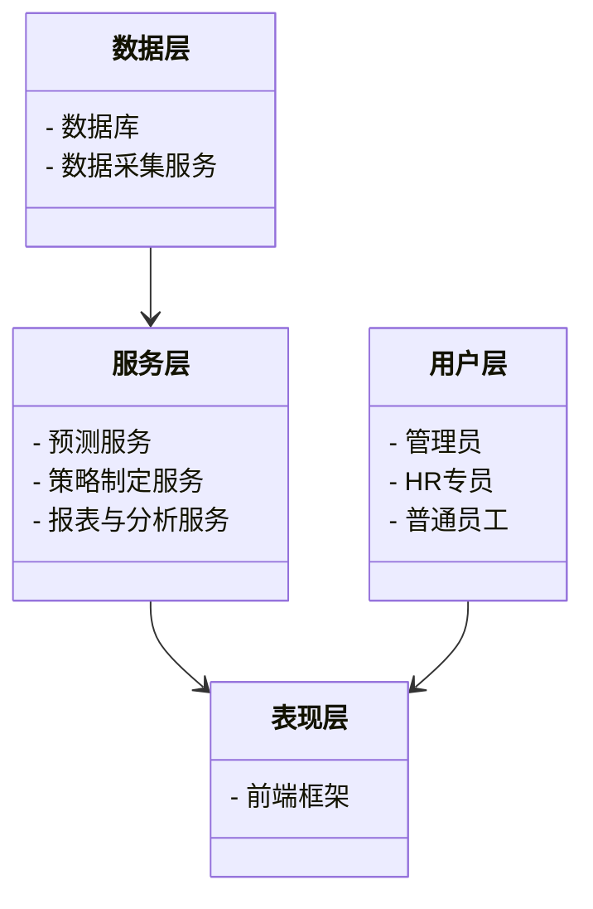

                 

# 领导力与员工留存：降低人才流失率的策略

## 关键词：
领导力，员工留存，人才流失率，数据驱动，策略，系统架构，实战案例

## 摘要：
本文旨在探讨领导力在员工留存中的关键作用，分析降低人才流失率的策略。通过数据驱动的分析和领导力的干预，企业可以更有效地识别和管理员工流失风险，从而提升员工的满意度和忠诚度。文章将详细阐述核心概念、算法原理、系统架构设计及实战案例，为企业在人才留存管理上提供实用的操作建议。

---

## 目录大纲设计步骤

### 1. 背景介绍

**第1章：问题背景**

- **1.1 人才流失现象及其影响**
  - 描述人才流失的普遍性和严重性
  - 阐述人才流失对企业成本和竞争力的影响

- **1.2 领导力在人才留存中的关键作用**
  - 探讨领导力对员工留存的重要性
  - 分析领导力与员工满意度、忠诚度之间的关系

- **1.3 员工留存的重要性与挑战**
  - 强调员工留存对组织健康和可持续发展的意义
  - 分析当前企业面临的人才留存挑战

### 2. 核心概念与联系

**第2章：核心概念与联系**

- **2.1 领导力模型概述**
  - 介绍几种主要的领导力模型（如情境领导、变革型领导等）
  - 分析各种领导力模型的适用场景和特点

- **2.2 员工留存关键因素**
  - 列举影响员工留存的关键因素（如薪酬、工作环境、职业发展等）
  - 对比分析不同因素在员工留存中的作用和重要性

- **2.3 领导力与员工留存的联系**
  - 探讨领导力如何通过关键因素影响员工留存
  - 分析成功企业如何运用领导力提升员工留存率

### 3. 算法原理讲解

**第3章：降低人才流失率的策略**

- **3.1 数据驱动的人才留存分析**
  - 介绍如何利用数据分析方法识别人才流失风险
  - 分析数据驱动的员工留存策略的优势和局限性

- **3.2 基于领导力的干预策略**
  - 详细讲解领导力在降低人才流失率中的应用方法
  - 分析不同领导力干预策略的效果和可行性

- **3.3 综合性人才留存策略**
  - 探讨如何将领导力和其他因素（如薪酬、培训等）结合起来，形成综合性人才留存策略
  - 分析综合性策略的实施步骤和注意事项

### 4. 数学模型和数学公式

**第4章：数学模型与公式**

- **4.1 人才留存率的计算方法**
  - 使用 LaTeX 格式介绍人才留存率的计算公式
  - 解释公式中各个参数的含义和计算方法

- **4.2 员工满意度与忠诚度的预测模型**
  - 介绍如何使用统计模型预测员工满意度与忠诚度
  - 使用 LaTeX 格式展示相关数学公式

### 5. 系统分析与架构设计方案

**第5章：系统架构与设计方案**

- **5.1 人才留存管理系统的需求分析**
  - 介绍人才留存管理系统的主要功能和需求
  - 分析系统在降低人才流失率中的作用和优势

- **5.2 系统架构设计**
  - 使用 Mermaid 类图和架构图展示系统架构
  - 详细解释架构中各个模块的功能和交互关系

- **5.3 系统接口设计与交互流程**
  - 介绍系统的主要接口设计
  - 使用 Mermaid 序列图展示系统的交互流程

### 6. 项目实战

**第6章：项目实战**

- **6.1 环境安装与配置**
  - 指导读者如何搭建人才留存管理系统的开发环境
  - 提供必要的工具和资源链接

- **6.2 系统核心实现与代码解析**
  - 提供系统的核心实现源代码
  - 分析代码中的关键功能和设计思路

- **6.3 实际案例分析与讲解**
  - 分析一个具体的企业如何实施人才留存策略
  - 详细讲解案例中的关键步骤和成功经验

### 7. 最佳实践 tips、小结、注意事项、拓展阅读

**第7章：总结与拓展**

- **7.1 最佳实践 tips**
  - 总结本书中的关键点，提供实用的操作建议

- **7.2 小结**
  - 对全书内容进行概括，强调关键观点和结论

- **7.3 注意事项**
  - 提醒读者在实施人才留存策略时需要注意的问题

- **7.4 拓展阅读**
  - 推荐进一步阅读的相关书籍和资源

### 8. 总字数控制

确保整个目录大纲的总字数控制在2000字以内，同时保证内容的完整性和逻辑性。每章节的标题和子标题都要清晰，内容要点突出。使用 Mermaid 画出必要的图表，并确保在 Markdown 文件中格式正确。

---

接下来，我们将按照这个大纲逐步展开文章的正文内容，详细探讨领导力与员工留存的关系，以及如何通过数据驱动和系统架构设计来降低人才流失率。让我们一步一步深入分析，共同探索这一重要议题。# 文章标题

## 关键词：
领导力，员工留存，人才流失率，数据驱动，策略，系统架构，实战案例

## 摘要：
本文旨在探讨领导力在员工留存中的关键作用，分析降低人才流失率的策略。通过数据驱动的分析和领导力的干预，企业可以更有效地识别和管理员工流失风险，从而提升员工的满意度和忠诚度。文章将详细阐述核心概念、算法原理、系统架构设计及实战案例，为企业在人才留存管理上提供实用的操作建议。

---

### 1. 问题背景

#### 1.1 人才流失现象及其影响

人才流失是一个普遍存在于企业中的现象。在全球化和信息技术迅猛发展的背景下，人才的竞争愈发激烈，企业面临的员工流失挑战愈加严峻。根据全球咨询公司麦肯锡的一项研究，全球范围内每年因员工流失导致的成本高达3,600亿美元。这不仅对企业成本造成了巨大的影响，还对企业的竞争力产生了深远的影响。

**人才流失的普遍性：**

- 在企业层面，中小型企业受到人才流失的影响更为显著，因为这些企业通常在吸引和留住人才方面资源有限。
- 在行业层面，高科技行业和服务业的人才流失率普遍高于制造业和传统行业。

**人才流失的严重性：**

- **成本影响：** 据普华永道（PwC）的统计，招聘一名新员工的成本通常是该职位年薪的1.5到2倍。这意味着企业不仅要承担高昂的招聘费用，还要支付因人才流失而造成的生产效率降低、项目延迟等隐性成本。
- **竞争力影响：** 人才流失会导致企业关键岗位的空缺，影响项目的进展和业务的连续性。长期的人才流失还可能导致企业失去竞争优势，特别是在快速变化的市场环境中。

#### 1.2 领导力在人才留存中的关键作用

领导力在人才留存中起着至关重要的作用。有效的领导力能够激励员工，提升工作满意度，增强员工的忠诚度，从而降低人才流失率。以下是领导力在人才留存中的一些关键作用：

- **激励员工：** 领导者通过设定明确的目标和提供支持，激发员工的内在动机，使员工感受到工作的意义和价值。
- **提升工作满意度：** 领导者通过建立积极的工作氛围、提供职业发展机会和公平的待遇，提升员工的工作满意度。
- **增强员工忠诚度：** 领导者通过建立信任关系、认可员工的贡献和提供良好的工作环境，增强员工的忠诚度。

**领导力与员工满意度、忠诚度之间的关系：**

- **员工满意度：** 员工满意度通常与员工的工作质量、工作态度和工作效率密切相关。有效的领导力可以提升员工的满意度，从而提高整个团队的生产力。
- **员工忠诚度：** 员工忠诚度是员工对企业长期承诺的表现。忠诚的员工更愿意留在企业，为企业提供持续的价值。

#### 1.3 员工留存的重要性与挑战

**员工留存的重要性：**

- **组织健康：** 员工留存对于组织的健康和稳定至关重要。稳定的员工队伍有助于企业保持业务的连续性和效率。
- **文化传承：** 长期留存的员工通常更了解企业的文化和价值观，他们能够帮助企业传承和弘扬这些价值观。
- **可持续发展：** 员工留存有助于企业长期发展和竞争力的提升。

**当前企业面临的人才留存挑战：**

- **市场竞争激烈：** 在全球化背景下，企业面临着更激烈的人才竞争，尤其是高科技行业和服务业。
- **员工期望变化：** 现代员工对职业发展、工作环境和工作生活平衡等方面的期望不断提高。
- **管理挑战：** 随着企业规模扩大和业务多样化，管理人才留存成为一个复杂而挑战性的任务。

通过以上背景介绍，我们可以看出，人才流失对企业的影响深远，而领导力在人才留存中具有关键作用。在接下来的章节中，我们将深入探讨领导力的核心概念和其在员工留存中的应用策略。# 2. 核心概念与联系

在探讨领导力与员工留存的关系之前，我们需要明确一些核心概念，并分析这些概念之间的联系。

#### 2.1 领导力模型概述

领导力模型是研究领导行为和领导风格的重要工具。以下是一些主要的领导力模型：

1. **情境领导模型：** 情境领导模型由保罗·赫塞（Paul Hersey）和肯·布兰查德（Ken Blanchard）提出。该模型认为领导行为应该根据下属的能力和动机来确定。模型分为四种领导风格：指示型、推销型、参与型和授权型。

2. **变革型领导模型：** 变革型领导模型由詹姆斯·麦克格雷戈·伯恩斯（James MacGregor Burns）提出。该模型强调领导者通过激励和启发下属，引导他们实现变革。变革型领导者具有魅力、理想主义、智慧和创新等特征。

3. **领导力五环模型：** 领导力五环模型由约翰·科特（John Kotter）提出。该模型将领导力分为五个阶段：建立紧迫感、制定愿景和策略、构建领导团队、传播愿景和授权实施。

4. **服务型领导模型：** 服务型领导模型由罗伯特·凯利（Robert K. Greenleaf）提出。该模型强调领导者应关注员工的成长和福祉，通过服务员工来实现组织的成功。

#### 2.2 员工留存关键因素

员工留存受到多种因素的影响，以下是一些主要的关键因素：

1. **薪酬福利：** 薪酬和福利是员工选择加入和留在企业的首要考虑因素之一。合理的薪酬结构和竞争力的福利待遇能够提高员工的工作满意度和忠诚度。

2. **工作环境：** 一个健康、积极的工作环境有助于提高员工的工作效率和满意度。良好的办公设施、和谐的人际关系和灵活的工作制度都是重要的因素。

3. **职业发展：** 职业发展机会是员工长期留存在企业的重要因素。提供清晰的职业发展路径、培训机会和晋升机制能够激励员工为企业长期服务。

4. **工作与生活平衡：** 现代员工越来越重视工作与生活的平衡。提供弹性工作时间、远程工作选项和休假政策等能够满足员工的需求，提高员工的满意度和忠诚度。

5. **领导风格和关系：** 领导者的风格和与员工的关系对员工留存有着重要影响。有效的领导力能够建立信任关系、提供支持和激励，从而增强员工的忠诚度。

#### 2.3 领导力与员工留存的联系

领导力通过多种途径影响员工留存。以下是一些关键联系：

1. **领导力与薪酬福利：** 领导者可以通过制定合理的薪酬策略，激励员工留在企业。有效的领导力能够确保薪酬体系公平、透明，从而提高员工的工作满意度。

2. **领导力与工作环境：** 领导者负责营造一个积极的工作氛围。通过关注员工需求、提供必要的资源和营造良好的团队关系，领导者能够提高员工的工作满意度。

3. **领导力与职业发展：** 领导者可以通过提供职业发展机会和培训，帮助员工提升技能和职业素养。有效的领导力能够帮助员工看到企业的长期职业发展路径，从而增加留存的意愿。

4. **领导力与工作与生活平衡：** 领导者可以通过支持员工的个人需求，帮助员工实现工作与生活的平衡。例如，提供灵活的工作时间和远程工作选项，帮助员工减轻工作压力。

5. **领导力与领导风格和关系：** 领导者的风格和与员工的关系直接影响员工的满意度和忠诚度。变革型领导力和服务型领导力通过激发员工的内在动机和建立信任关系，能够显著提高员工的留存率。

通过分析这些核心概念和联系，我们可以看出，领导力在员工留存中起着至关重要的作用。在下一章节中，我们将进一步探讨如何通过数据驱动的分析和领导力的干预策略，降低人才流失率。# 3. 降低人才流失率的策略

降低人才流失率是企业持续发展和保持竞争优势的关键。为了实现这一目标，企业需要采用数据驱动的分析和领导力的干预策略。以下将详细讨论这些策略。

#### 3.1 数据驱动的人才留存分析

数据驱动的人才留存分析是识别和降低人才流失风险的关键。通过收集和分析员工数据，企业可以更准确地预测员工流失的风险，并采取相应的干预措施。

**数据收集：**

- **员工行为数据：** 包括员工的工作时间、工作效率、任务完成情况等。
- **员工满意度调查：** 通过定期的员工满意度调查，了解员工对薪酬、工作环境、职业发展等方面的满意度。
- **员工反馈：** 通过员工反馈渠道，收集员工对领导力、工作氛围和公司文化的意见和建议。

**数据分析方法：**

- **流失预测模型：** 使用机器学习算法，根据历史流失数据，建立流失预测模型。例如，采用逻辑回归、随机森林等算法，预测哪些员工在未来可能流失。
- **关键因素分析：** 通过相关性分析和回归分析，识别影响员工留存的关键因素。例如，分析薪酬、工作环境、职业发展等因素对员工留存的影响程度。
- **流失风险评估：** 根据预测模型和关键因素分析结果，对员工进行流失风险评估，标记高风险员工。

**优势与局限性：**

- **优势：** 数据驱动的分析能够提供客观、准确的预测结果，帮助企业提前识别流失风险，采取有针对性的干预措施。
- **局限性：** 数据驱动分析依赖于高质量的数据，数据的不完整或偏差可能导致预测结果的误差。此外，数据驱动分析难以完全覆盖员工的主观感受和情感因素。

#### 3.2 基于领导力的干预策略

领导力干预策略是通过领导者的影响和激励，降低员工流失率的关键手段。以下是一些具体的领导力干预策略：

**1. 激励员工：**

- **设定明确目标：** 领导者应明确员工的职责和期望，帮助员工理解工作的重要性和意义。
- **认可和奖励：** 通过定期的表扬和奖励，认可员工的努力和成就，激励员工保持高水平的绩效。
- **提供反馈：** 领导者应积极与员工沟通，提供建设性的反馈，帮助员工提升能力和改进工作。

**2. 建立信任关系：**

- **倾听和沟通：** 领导者应倾听员工的声音，关注员工的意见和建议，建立良好的沟通渠道。
- **透明度和诚信：** 领导者应保持企业的透明度，公开企业战略、目标和决策过程，增强员工的信任感。
- **支持员工成长：** 领导者应支持员工的个人成长和职业发展，提供培训和学习机会。

**3. 营造积极工作环境：**

- **改善工作条件：** 提供良好的办公设施和工作环境，确保员工的工作舒适和安全。
- **建立团队文化：** 领导者应促进团队内部的积极互动和合作，建立和谐的团队文化。
- **关注员工福祉：** 领导者应关注员工的身心健康，提供健康体检、心理辅导和休闲娱乐活动。

**效果与可行性：**

- **效果：** 通过有效的领导力干预，可以显著提高员工的工作满意度、忠诚度和留存率。
- **可行性：** 领导力干预策略的可行性取决于领导者的个人素质、管理能力和企业文化。企业需要培养和选拔具有领导力的领导者，并提供相应的培训和支持。

#### 3.3 综合性人才留存策略

为了更有效地降低人才流失率，企业需要采用综合性的人才留存策略，将数据驱动的分析和领导力的干预相结合。

**实施步骤：**

1. **数据收集和分析：** 收集员工数据，进行流失预测和关键因素分析，识别流失风险和关键因素。
2. **制定干预计划：** 根据数据分析结果，制定针对性的领导力干预计划，包括激励措施、信任关系建设和工作环境改善等。
3. **实施和跟踪：** 实施干预计划，定期跟踪和分析干预效果，根据反馈进行调整和优化。
4. **持续改进：** 基于持续的反馈和数据分析，不断优化人才留存策略，提高员工留存率。

**注意事项：**

- **数据质量：** 确保数据收集和分析的准确性，避免因数据问题导致干预措施无效。
- **员工参与：** 在制定和实施人才留存策略时，充分考虑员工的意见和建议，提高员工的参与度和满意度。
- **文化适应性：** 策略的实施需要与企业的文化和价值观相契合，避免因文化冲突导致策略失败。

通过以上策略，企业可以更有效地降低人才流失率，提升员工的满意度和忠诚度，从而实现长期可持续发展。在下一章节中，我们将进一步探讨如何使用数学模型和公式来衡量和预测员工留存率。# 4. 数学模型与公式

在人才留存管理中，数学模型和公式是衡量和预测员工留存率的重要工具。通过数学模型，企业可以更准确地评估员工留存状况，制定相应的策略。

#### 4.1 人才留存率的计算方法

人才留存率是衡量员工流失情况的关键指标，用于评估企业在特定时间段内留住员工的能力。人才留存率的计算公式如下：

$$
留存率 = \frac{（期末在岗人数 - 期末新入职人数）+（期初在岗人数 - 期初离职人数）}{期初在岗人数} \times 100\%
$$

其中：

- **期末在岗人数**：指在统计期末仍在公司工作的员工总数。
- **期末新入职人数**：指在统计期末新加入公司的员工总数。
- **期初在岗人数**：指在统计期初（即统计开始时）仍在公司工作的员工总数。
- **期初离职人数**：指在统计期初已经离开公司的员工总数。

**公式解释：**

- 分子部分表示员工在统计期初和期末之间留存的人数。分子中的第一项（期末在岗人数 - 期末新入职人数）表示在统计期末已存在公司但在此期间加入的员工被扣除。第二项（期初在岗人数 - 期初离职人数）表示在统计期初已存在但在此期间离开的员工被扣除，以确保只计算员工在企业内部的真实留存人数。
- 分母为期初在岗人数，表示统计期初的员工总数。
- 将分子除以分母并乘以100%，得到留存率的百分比表示。

**例子：**

假设某公司在某季度期初有100名在岗员工，期间有10名员工离职，又有15名新员工加入。该季度结束时，有95名员工仍在公司工作。则该季度的人才留存率为：

$$
留存率 = \frac{（95 - 15）+（100 - 10）}{100} \times 100\% = 95\%
$$

#### 4.2 员工满意度与忠诚度的预测模型

员工满意度与忠诚度是影响人才留存的重要因素。通过统计模型，企业可以预测员工满意度与忠诚度的变化趋势，以便提前采取相应的干预措施。

**4.2.1 员工满意度预测模型**

一种常用的方法是将员工满意度视为一个连续变量，使用线性回归模型进行预测。线性回归模型的基本公式为：

$$
满意度 = \beta_0 + \beta_1 \times 薪酬 + \beta_2 \times 工作环境 + \beta_3 \times 职业发展 + \epsilon
$$

其中：

- **满意度**：表示员工对工作环境的总体满意度。
- **薪酬**、**工作环境**、**职业发展**：表示影响员工满意度的三个关键因素。
- **$\beta_0$、$\beta_1$、$\beta_2$、$\beta_3$**：表示各个因素的回归系数，用于衡量每个因素对员工满意度的影响程度。
- **$\epsilon$**：表示随机误差项。

通过收集大量员工的满意度数据和各个因素的数据，可以计算出各个回归系数，从而建立员工满意度预测模型。

**4.2.2 员工忠诚度预测模型**

员工忠诚度通常被视为一个二分类变量（忠诚/不忠诚），因此可以使用逻辑回归模型进行预测。逻辑回归模型的基本公式为：

$$
P(忠诚) = \frac{1}{1 + e^{-(\beta_0 + \beta_1 \times 薪酬 + \beta_2 \times 工作环境 + \beta_3 \times 职业发展})}
$$

其中：

- **$P(忠诚)$**：表示员工忠诚的概率。
- **其他参数与员工满意度预测模型相同**。

通过收集员工的忠诚度数据和各个因素的数据，可以计算出各个回归系数，从而建立员工忠诚度预测模型。

**例子：**

假设我们已经收集了100名员工的满意度数据和薪酬、工作环境、职业发展数据。通过线性回归分析，我们得到以下回归系数：

$$
满意度 = 20 + 0.1 \times 薪酬 + 0.2 \times 工作环境 + 0.3 \times 职业发展 + \epsilon
$$

如果某员工的薪酬为50,000元，工作环境评分为8分（满分10分），职业发展评分为6分（满分10分），则该员工的预期满意度为：

$$
满意度 = 20 + 0.1 \times 50,000 + 0.2 \times 8 + 0.3 \times 6 = 20 + 5,000 + 1.6 + 1.8 = 5,023.4
$$

同样，通过逻辑回归分析，我们得到员工忠诚度的回归系数为：

$$
P(忠诚) = \frac{1}{1 + e^{-(5 + 0.1 \times 薪酬 + 0.2 \times 工作环境 + 0.3 \times 职业发展})}
$$

对于同一员工，预期忠诚度的概率为：

$$
P(忠诚) = \frac{1}{1 + e^{-(5 + 0.1 \times 50,000 + 0.2 \times 8 + 0.3 \times 6)}} = \frac{1}{1 + e^{-5.3}} \approx 0.99
$$

这意味着该员工忠诚的概率非常高，企业可以通过加强与该员工的沟通和激励来进一步提高其忠诚度。

通过数学模型和公式，企业可以更准确地衡量和预测员工留存情况，从而制定更有效的留存策略。在下一章节中，我们将探讨如何设计人才留存管理系统，以实现数据驱动的员工留存管理。# 5. 系统架构与设计方案

在探讨如何设计一个有效的人才留存管理系统之前，我们需要明确系统的需求分析、架构设计以及接口设计和交互流程。

#### 5.1 人才留存管理系统的需求分析

**需求分析：** 

人才留存管理系统的主要目标是帮助企业识别和管理员工流失风险，提升员工的满意度和忠诚度。具体需求如下：

1. **数据采集与整合：** 系统能够从不同数据源（如HR系统、员工反馈平台等）采集和整合员工数据，包括个人基本信息、工作表现、满意度调查结果等。
2. **流失预测：** 系统能够利用机器学习算法，基于历史数据和关键因素，预测员工的流失风险。
3. **干预策略制定与执行：** 系统能够根据流失预测结果，自动生成针对性的干预策略，并跟踪和评估干预效果。
4. **报表与分析：** 系统能够生成各种报表，提供员工留存率的趋势分析、流失原因分析等，帮助企业了解人才留存状况。
5. **用户权限管理：** 系统能够支持用户权限管理，确保数据的安全性和隐私性。

#### 5.2 系统架构设计

系统架构设计是确保系统稳定、高效运行的关键。我们采用分层架构设计，包括数据层、服务层、表现层和用户层。

**数据层：** 

数据层负责数据的存储和管理。采用关系型数据库（如MySQL）存储员工数据，包括员工基本信息、工作表现、满意度调查结果等。同时，采用NoSQL数据库（如MongoDB）存储非结构化数据，如员工反馈和日志信息。

**服务层：** 

服务层负责业务逻辑的处理和数据交换。主要包括以下服务：

1. **数据采集服务：** 从不同数据源采集和整合员工数据。
2. **预测服务：** 基于历史数据和关键因素，使用机器学习算法预测员工流失风险。
3. **策略制定服务：** 根据预测结果，生成针对性的干预策略。
4. **报表与分析服务：** 生成各种报表，提供员工留存率趋势分析和流失原因分析。

**表现层：** 

表现层负责系统的界面展示。采用前端框架（如React或Vue.js）实现，包括员工信息展示、预测结果展示、干预策略展示等功能模块。

**用户层：** 

用户层负责用户交互和权限管理。包括管理员、HR专员和普通员工等角色，根据角色分配相应的权限。

#### 5.3 系统接口设计

系统接口设计是确保系统与其他系统（如HR系统、员工反馈平台等）无缝集成的关键。以下是一些主要接口设计：

1. **数据导入接口：** 用于将其他系统的数据导入人才留存管理系统，支持CSV、JSON等数据格式。
2. **数据导出接口：** 用于将人才留存管理系统的数据导出到其他系统或报表工具，支持CSV、Excel等数据格式。
3. **预测接口：** 提供API，供其他系统调用，获取员工流失预测结果。
4. **策略接口：** 提供API，供其他系统调用，获取和更新干预策略。

#### 5.4 系统交互流程

系统交互流程是用户通过表现层与系统进行交互的过程。以下是一个简化的交互流程：

1. **用户登录：** 用户通过用户名和密码登录系统。
2. **数据导入：** 用户导入其他系统的员工数据。
3. **数据整合：** 系统自动整合不同数据源的数据。
4. **流失预测：** 系统使用机器学习算法预测员工流失风险。
5. **策略制定：** 系统根据预测结果，自动生成干预策略。
6. **策略执行：** 用户查看并执行干预策略。
7. **报表与分析：** 用户查看员工留存率趋势分析和流失原因分析报表。

**Mermaid 类图和架构图：**



**Mermaid 序列图：**

```mermaid
sequenceDiagram
    participant 用户
    participant 系统A
    participant 系统B
    participant 数据库
    
    用户->>系统A: 登录
    系统

