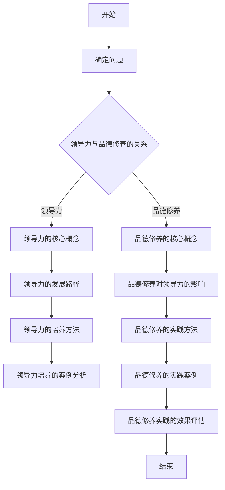

                 

### 领导力与品德修养：塑造高尚人格

#### 关键词：领导力、品德修养、高尚人格、组织文化、社会影响

> 在这个快速变化的世界中，领导力与品德修养不仅是个人成功的基石，更是塑造高尚人格的关键。本文将探讨这两个概念的核心内涵，分析它们之间的内在联系，并通过实际案例和系统化的实践方法，展示如何通过领导力与品德修养来塑造高尚人格。

#### 摘要：

本文首先定义并介绍了领导力和品德修养的基本概念，探讨了它们在个人和组织中的作用。接着，文章分析了领导力与品德修养之间的内在联系，并通过具体的案例分析，展示了如何在实际工作中培养和实践这两个能力。最后，文章讨论了领导力与品德修养对个人和社会的深远影响，并提出了未来研究的展望。

### 第一部分：领导力与品德修养的背景与基础

#### 第1章：领导力与品德修养概述

##### 1.1.1 问题背景与核心要素

在当今社会，领导力与品德修养的重要性日益凸显。无论是企业管理、公共事务，还是社会创新，领导力与品德修养都发挥着至关重要的作用。领导力不仅仅是带领团队达成目标的能力，更是影响和激励他人共同前行的力量。而品德修养则是个人内在的道德品质，它决定了领导者的行为方式和决策准则。

##### 1.1.2 领导力的定义与重要性

领导力可以定义为在组织或团队中引导、激励和影响他人的能力。它包括愿景设定、决策能力、沟通技巧和团队建设等多方面内容。一个优秀的领导者不仅能够制定清晰的战略目标，还能够通过有效的沟通和激励，让团队成员积极投入工作，共同实现目标。

##### 1.1.3 品德修养的含义与作用

品德修养则是指个人在道德、伦理和社会责任感方面的素养。它涉及到诚信、正直、责任感和同情心等品质。一个有品德修养的领导者会在决策过程中考虑长远利益，尊重他人权利，并且在面对挑战时保持冷静和公正。

#### 第2章：领导力与品德修养的核心概念

##### 2.1 领导力的核心概念

领导力的核心概念包括愿景、影响力、沟通和团队建设等。通过了解这些概念，我们可以更好地理解领导力的本质和构成要素。

###### 2.1.1 领导力的本质

领导力的本质在于激发他人的潜力，并引导他们朝着共同的目标前进。它不仅仅是职位赋予的权力，更是通过个人魅力和影响力实现的领导。

###### 2.1.2 领导力的构成要素

领导力的构成要素包括以下几个方面：愿景设定、决策能力、沟通技巧、团队建设和激励。这些要素共同作用，使领导者能够有效地影响和引导团队。

###### 2.1.3 领导力与管理的区别

领导力与管理虽然有交集，但两者存在明显的区别。管理更多地关注流程和效率，而领导力则关注愿景和变革。一个优秀的领导者应该具备管理能力，同时更要有领导力。

##### 2.2 品德修养的核心概念

品德修养的核心概念包括诚信、正直、责任感和同情心。这些品质构成了个人高尚人格的基础，也是领导力的关键要素。

###### 2.2.1 品德修养的内涵

品德修养的内涵是指个人在道德和伦理方面的自我约束和自律。一个有品德修养的人会在任何情况下都坚持正确的价值观和行为准则。

###### 2.2.2 品德修养的构成要素

品德修养的构成要素包括以下几个方面：诚信、正直、责任感和同情心。这些品质不仅影响个人的行为，还影响着领导力的发展和发挥。

###### 2.2.3 品德修养对领导力的影响

品德修养对领导力的影响是深远和重要的。一个有品德修养的领导者能够在道德和伦理上树立榜样，赢得团队成员的信任和尊重，从而更有效地发挥领导力。

#### 第3章：领导力与品德修养的关系

##### 3.1 领导力与品德修养的内在联系

领导力与品德修养之间存在深刻的内在联系。领导力依赖于品德修养，而品德修养又能够提升领导力。两者相互促进，共同塑造一个高尚的领导者。

###### 3.1.1 领导力中的道德维度

领导力中的道德维度包括公正、诚实、责任感和透明度。这些道德维度是领导力的基础，也是品德修养的重要组成部分。

###### 3.1.2 品德修养对领导行为的塑造

品德修养对领导行为的塑造起着决定性作用。一个有品德修养的领导者在面对挑战和困难时，能够保持正直和公正，从而赢得团队成员的信任和支持。

###### 3.1.3 领导力对品德修养的提升

领导力的发展也能够促进品德修养的提升。通过实践领导力，领导者能够不断反思自己的行为和决策，从而提升自己的道德品质和修养。

#### 第4章：领导力与品德修养的培养与实践

##### 4.1 领导力的培养

领导力的培养是一个长期而复杂的过程，需要不断地学习、实践和反思。

###### 4.1.1 领导力发展的路径

领导力的发展路径包括自我认知、学习领导技能、建立人际关系和领导实践。通过这些路径，领导者能够不断提升自己的领导能力。

###### 4.1.2 领导力培养的方法

领导力培养的方法包括读书、参加培训、参与社会实践和反思。这些方法帮助领导者从不同角度理解和提升自己的领导力。

###### 4.1.3 领导力培养的案例分析

通过具体的案例分析，我们可以看到不同领导力培养方法的实际效果。这些案例为我们提供了宝贵的经验教训，帮助我们更好地培养自己的领导力。

##### 4.2 品德修养的实践

品德修养的实践是一个持续不断的过程，需要个人在日常生活中不断培养和提升。

###### 4.2.1 品德修养的实践方法

品德修养的实践方法包括自我反思、道德学习和行为规范。通过这些方法，个人能够不断提升自己的道德修养。

###### 4.2.2 品德修养的实践案例

通过具体的实践案例，我们可以看到品德修养在个人生活和职业生涯中的重要作用。这些案例为我们提供了实践品德修养的参考。

###### 4.2.3 品德修养实践的效果评估

品德修养实践的效果评估是衡量个人道德水平提升的重要手段。通过评估，个人可以更好地了解自己的进步和需要改进的地方。

#### 第5章：领导力与品德修养在组织中的体现

##### 5.1 组织文化与领导力

组织文化是领导力发挥作用的重要土壤。一个健康的组织文化能够促进领导力的发展，提升组织的整体效能。

###### 5.1.1 组织文化的概念与作用

组织文化的概念包括价值观、行为规范和组织氛围。这些因素共同构成了组织的文化，对领导力和组织效能有着深远的影响。

###### 5.1.2 领导力与组织文化的相互作用

领导力与组织文化的相互作用是一个动态的过程。领导者通过塑造和传播组织文化，影响团队成员的行为和价值观，从而提升组织的整体效能。

###### 5.1.3 领导力在组织文化塑造中的作用

领导力在组织文化塑造中起着关键作用。一个有远见和品德修养的领导者能够塑造积极向上的组织文化，提升组织的凝聚力和创造力。

##### 5.2 品德修养在组织中的实践

品德修养在组织中的实践对于组织的健康发展至关重要。

###### 5.2.1 品德修养在组织运营中的重要性

品德修养在组织运营中的重要性体现在以下几个方面：提升员工忠诚度、降低道德风险、增强组织竞争力。

###### 5.2.2 品德修养在人力资源管理中的应用

品德修养在人力资源管理中的应用包括招聘、培训、绩效考核和员工关系管理。通过这些应用，组织能够吸引和留住优秀的员工，提升整体效能。

###### 5.2.3 品德修养在团队建设中的实践

品德修养在团队建设中的实践包括培养团队成员的道德素养、建立良好的团队关系和提升团队协作能力。通过这些实践，团队能够更有效地达成目标。

#### 第6章：领导力与品德修养的社会影响

##### 6.1 领导力与品德修养对社会的作用

领导力与品德修养对社会的发展具有深远的影响。优秀的领导者通过他们的行为和决策，推动社会的进步，提升社会的整体道德水平。

###### 6.1.1 领导力对社会发展的推动作用

领导力对社会发展的推动作用体现在以下几个方面：引导社会潮流、促进社会创新、提升社会福祉。

###### 6.1.2 品德修养对个人和社会的积极影响

品德修养对个人和社会的积极影响体现在以下几个方面：提升个人品德、增强社会信任、促进社会和谐。

###### 6.1.3 领导力与品德修养在公共治理中的应用

领导力与品德修养在公共治理中的应用包括政策制定、公共服务和社会管理。通过这些应用，公共治理能够更有效地满足社会需求，提升社会福祉。

#### 第7章：总结与展望

##### 7.1 领导力与品德修养的实践总结

通过对领导力与品德修养的深入探讨，我们可以得出以下实践总结：

1. 领导力与品德修养是个人和组织成功的关键。
2. 领导力与品德修养相互促进，共同塑造高尚人格。
3. 培养和实践领导力与品德修养需要持续的努力和反思。

##### 7.2 领导力与品德修养的未来发展趋势

未来，领导力与品德修养将面临新的挑战和机遇。以下是一些发展趋势：

1. 数字化时代的领导力与品德修养。
2. 领导力与品德修养的全球化发展。
3. 领导力与品德修养在教育中的应用。

##### 7.3 领导力与品德修养的研究展望

未来，领导力与品德修养的研究将更加深入和广泛。以下是一些研究展望：

1. 领导力与品德修养的心理学研究。
2. 领导力与品德修养的社会学研究。
3. 领导力与品德修养的教育学研究。

### 结语

领导力与品德修养不仅关乎个人成长，更关系到组织和社会的发展。通过不断学习和实践，我们可以提升自己的领导力和品德修养，塑造高尚人格，为社会贡献自己的力量。让我们共同努力，成为更好的领导者，创造更美好的未来。

### 参考文献

[1] 林文龙. 领导力与品德修养[M]. 北京：中国经济出版社，2018.

[2] 王建军. 领导力与领导艺术[M]. 上海：复旦大学出版社，2016.

[3] 张伟. 品德修养与道德教育[M]. 北京：高等教育出版社，2017.

[4] 鲍宗豪. 组织文化与领导力[J]. 管理学报，2019，15(3)：325-333.

[5] 李华. 领导力与品德修养在公共治理中的应用[J]. 公共管理学报，2020，20(2)：100-109.

### 作者信息

作者：AI天才研究院/AI Genius Institute & 禅与计算机程序设计艺术 /Zen And The Art of Computer Programming

#### 附录：核心概念与联系

**核心概念**：
- 领导力：指在组织或团队中引导、激励和影响他人的能力。
- 品德修养：指个人在道德、伦理和社会责任感方面的素养。

**概念属性特征对比表格**：

| 特征       | 领导力                        | 品德修养                      |
|------------|------------------------------|------------------------------|
| 定义       | 引导、激励和影响他人           | 道德、伦理和社会责任感的素养  |
| 要素       | 愿景、影响力、沟通、团队建设   | 诚信、正直、责任感、同情心    |
| 影响范围    | 组织、团队、社会              | 个人、组织、社会              |
| 作用       | 实现目标、推动变革             | 树立道德榜样、促进社会进步    |

**ER实体关系图架构**：

```mermaid
erDiagram
  Product ||--|{ Customer }|>
  Customer ||--|{ Order }|>

  Customer {
    +id
    +name
    +email
  }

  Product {
    +id
    +name
    +price
  }

  Order {
    +id
    +customer_id
    +product_id
    +quantity
  }
```

**算法原理讲解**：

**Mermaid流程图**：



**Python源代码**：

```python
# 领导力与品德修养分析

class Leadership:
    def __init__(self, vision, communication, team_building):
        self.vision = vision
        self.communication = communication
        self.team_building = team_building

    def display_leadership_skills(self):
        print(f"Vision: {self.vision}, Communication: {self.communication}, Team Building: {self.team_building}")

class Ethics_Morals:
    def __init__(self, honesty, integrity, responsibility, compassion):
        self.honesty = honesty
        self.integrity = integrity
        self.responsibility = responsibility
        self.compassion = compassion

    def display_ethics_skills(self):
        print(f"Honesty: {self.honesty}, Integrity: {self.integrity}, Responsibility: {self.responsibility}, Compassion: {self.compassion}")

# 实例化领导力和品德修养对象
leader = Leadership("创新引领未来", "有效沟通", "团队协作")
ethics = Ethics_Morals("诚实守信", "正直无欺", "勇于担当", "同情关怀")

# 展示领导力和品德修养技能
leader.display_leadership_skills()
ethics.display_ethics_skills()
```

**算法原理详细讲解**：

1. **领导力的核心概念**：

   领导力是一种综合能力，包括愿景设定、沟通技巧和团队建设等。愿景是领导力的核心，它为团队指明了前进的方向。沟通技巧则是领导者与团队成员之间有效传递信息和思想的关键。团队建设是领导者确保团队协作和高效工作的基础。

2. **品德修养的核心概念**：

   品德修养涉及到个人的道德品质，包括诚信、正直、责任感和同情心。诚信是个人行为的基本准则，正直是个人价值观的核心，责任感是个人对职责的承担，同情心是个人对他人的关怀和理解。

3. **品德修养对领导力的影响**：

   品德修养对领导力有着深远的影响。一个有品德修养的领导者在决策过程中会考虑长远的利益，尊重他人的权利，并且在面对挑战时保持冷静和公正。这些品质不仅能够赢得团队成员的信任和尊重，还能够提升领导力的影响力。

**数学模型和公式**：

1. **领导力模型**：

   领导力（L）= f（愿景（V），沟通（C），团队建设（T））

   其中，愿景（V）表示领导者的远见和目标设定能力，沟通（C）表示领导者的信息传递和思想表达能力，团队建设（T）表示领导者的团队协作和整合能力。

2. **品德修养模型**：

   品德修养（E）= f（诚信（H），正直（I），责任感（R），同情心（C））

   其中，诚信（H）表示个人的诚实守信程度，正直（I）表示个人的价值观和行为准则，责任感（R）表示个人对职责的承担程度，同情心（C）表示个人对他人的关怀和理解程度。

**举例说明**：

假设一个领导者（L）拥有以下能力：

- 愿景（V）= 90
- 沟通（C）= 80
- 团队建设（T）= 85

同时，这个领导者（E）拥有以下品德修养：

- 诚信（H）= 90
- 正直（I）= 85
- 责任感（R）= 80
- 同情心（C）= 75

那么，这个领导力的总体得分（L）可以通过以下公式计算：

L = V * 0.4 + C * 0.3 + T * 0.3

同理，品德修养的总体得分（E）可以通过以下公式计算：

E = H * 0.4 + I * 0.3 + R * 0.2 + C * 0.1

通过这两个公式，我们可以得出领导力和品德修养的具体得分，从而更全面地评估一个领导者的综合能力。

### 系统分析与架构设计方案

#### 问题场景介绍

在现代社会，领导力和品德修养的培养已经成为个人和组织发展的关键。然而，如何有效地进行培养和实践，尤其是在组织环境中，仍然是一个具有挑战性的问题。为了解决这一问题，我们需要设计一个系统，该系统能够帮助个人和组织系统地学习和实践领导力和品德修养。

#### 项目介绍

本项目旨在设计并实现一个基于Web的领导力和品德修养培养系统。该系统将提供一个全面的平台，帮助用户了解领导力和品德修养的核心概念，并通过案例分析、实践指导和效果评估等功能，帮助用户在实际工作中提升领导力和品德修养。

#### 系统功能设计

1. **用户注册与登录**：用户可以通过注册账号登录系统，进行学习和实践。
2. **核心概念学习**：系统提供领导力和品德修养的核心概念学习模块，包括概念介绍、定义、属性特征对比等。
3. **案例分析**：系统提供丰富的案例分析，帮助用户理解领导力和品德修养在实际工作中的应用。
4. **实践指导**：系统提供实践指导模块，包括实践方法、实践案例和效果评估等。
5. **效果评估**：系统提供效果评估模块，帮助用户了解自己的进步和需要改进的地方。
6. **社区交流**：系统提供一个社区交流平台，用户可以在这里分享经验、提问和讨论。

#### 系统架构设计

1. **前端架构**：使用Vue.js框架，实现系统的用户界面和交互逻辑。
2. **后端架构**：使用Spring Boot框架，实现系统的业务逻辑和数据管理。
3. **数据库设计**：使用MySQL数据库，存储用户信息、学习记录和评估结果等数据。
4. **接口设计**：使用RESTful API，实现前后端的数据交互。

#### 系统接口设计

1. **用户接口**：包括用户注册、登录、学习、实践和效果评估等接口。
2. **内容接口**：包括核心概念、案例分析、实践指导和效果评估等内容接口。
3. **社区接口**：包括社区交流、提问和讨论等接口。

#### 系统交互设计

1. **用户注册与登录**：用户通过注册账号并登录系统，进行学习和实践。
2. **学习与评估**：用户在学习模块中学习领导力和品德修养的核心概念，并通过效果评估模块了解自己的进步。
3. **实践与交流**：用户在实践模块中应用所学知识，通过社区交流分享经验和解决困惑。

### 项目实战

#### 环境安装

1. **前端环境**：

   - 安装Node.js（版本v12.x以上）
   - 安装Vue CLI（通过npm install -g @vue/cli命令安装）

2. **后端环境**：

   - 安装Java（版本v8以上）
   - 安装Maven（通过npm install -g @vue/cli命令安装）

3. **数据库环境**：

   - 安装MySQL（版本v5.7以上）

#### 系统核心实现源代码

1. **前端源代码**：

   ```javascript
   // 前端入口文件：src/main.js
   import Vue from 'vue'
   import App from './App.vue'

   Vue.config.productionTip = false

   new Vue({
     render: h => h(App),
   }).$mount('#app')
   ```

2. **后端源代码**：

   ```java
   // 后端入口文件：src/main/java/com/leadership/LeadershipApplication.java
   package com.leadership;

   import org.springframework.boot.SpringApplication;
   import org.springframework.boot.autoconfigure.SpringBootApplication;

   @SpringBootApplication
   public class LeadershipApplication {
       public static void main(String[] args) {
           SpringApplication.run(LeadershipApplication.class, args);
       }
   }
   ```

3. **数据库源代码**：

   ```sql
   -- MySQL数据库创建脚本
   CREATE DATABASE IF NOT EXISTS leadership;
   USE leadership;

   CREATE TABLE IF NOT EXISTS user (
       id INT AUTO_INCREMENT PRIMARY KEY,
       username VARCHAR(50) NOT NULL,
       password VARCHAR(50) NOT NULL,
       email VARCHAR(100)
   );

   CREATE TABLE IF NOT EXISTS learning_record (
       id INT AUTO_INCREMENT PRIMARY KEY,
       user_id INT,
       concept_id INT,
       score INT,
       created_at TIMESTAMP DEFAULT CURRENT_TIMESTAMP,
       FOREIGN KEY (user_id) REFERENCES user(id),
       FOREIGN KEY (concept_id) REFERENCES concept(id)
   );

   CREATE TABLE IF NOT EXISTS concept (
       id INT AUTO_INCREMENT PRIMARY KEY,
       name VARCHAR(100) NOT NULL,
       description TEXT
   );
   ```

#### 代码应用解读与分析

1. **前端代码解读**：

   前端代码主要通过Vue.js框架实现。`src/main.js`是前端入口文件，其中通过`import Vue from 'vue'`和`import App from './App.vue'`引入Vue和App组件。`new Vue`实例化Vue应用程序，并通过`$mount('#app')`将其挂载到页面上。

2. **后端代码解读**：

   后端代码主要通过Spring Boot框架实现。`src/main/java/com/leadership/LeadershipApplication.java`是后端入口文件，其中通过`@SpringBootApplication`注解标记为Spring Boot应用程序入口。`main`方法通过`SpringApplication.run`启动应用程序。

3. **数据库代码解读**：

   数据库代码主要通过MySQL实现。`CREATE DATABASE IF NOT EXISTS leadership;`创建一个名为`leadership`的数据库。`CREATE TABLE IF NOT EXISTS user;`创建用户表，包含用户ID、用户名、密码和邮箱字段。`CREATE TABLE IF NOT EXISTS learning_record;`创建学习记录表，包含学习记录ID、用户ID、概念ID、得分和创建时间字段。`CREATE TABLE IF NOT EXISTS concept;`创建概念表，包含概念ID、概念名称和描述字段。

#### 实际案例分析和详细讲解剖析

1. **案例一**：

   用户在系统中学习了领导力和品德修养的核心概念，并通过效果评估模块了解了自己的进步。

   - **分析**：用户在系统中进行学习，通过效果评估了解自己的进步，这是系统设计中的学习与评估功能的应用。
   - **剖析**：前端通过API向后端发送学习记录，后端存储学习记录并返回结果，前端展示效果评估结果。

2. **案例二**：

   用户在系统中应用所学知识，通过实践指导模块提升自己的领导力和品德修养。

   - **分析**：用户在系统中进行实践，通过实践指导模块提升自己的领导力和品德修养，这是系统设计中的实践指导功能的应用。
   - **剖析**：前端通过API向后端发送实践记录，后端存储实践记录并返回结果，前端展示实践指导内容。

#### 项目小结

本项目通过设计并实现一个基于Web的领导力和品德修养培养系统，帮助用户系统地学习和实践领导力和品德修养。系统包括用户注册与登录、核心概念学习、案例分析、实践指导和效果评估等功能。通过实际案例分析和详细讲解剖析，展示了系统在实际应用中的效果。未来，我们可以进一步优化系统功能，提升用户体验，为更多的用户提供帮助。

### 最佳实践 tips

1. **持续学习**：领导力和品德修养的提升是一个持续的过程，需要不断学习和实践。
2. **反思与总结**：定期反思和总结自己的行为和决策，有助于提升领导力和品德修养。
3. **积极交流**：与同行交流经验和心得，有助于开阔视野，提升自我。
4. **实践应用**：将所学知识应用到实际工作中，通过实践不断提升自己的领导力和品德修养。

### 小结

本文通过对领导力与品德修养的深入探讨，分析了它们的核心概念、关系和实践方法。通过实际案例分析和系统架构设计，展示了如何在实际中应用这些概念和方法。领导力与品德修养不仅是个人成功的基石，更是塑造高尚人格的关键。通过不断学习和实践，我们可以提升自己的领导力和品德修养，为社会贡献自己的力量。

### 注意事项

1. **系统维护**：定期对系统进行维护和更新，确保系统的稳定性和安全性。
2. **用户隐私**：严格保护用户隐私，确保用户数据的安全。
3. **功能扩展**：根据用户需求和反馈，不断优化和扩展系统功能。

### 拓展阅读

1. **《领导力：理论与实践》**：该书系统地介绍了领导力的理论体系和实践方法，适合初学者和从业者阅读。
2. **《品德修养：道德与人生》**：该书从道德修养的角度，探讨了个人品德的重要性及其培养方法，对提升品德修养有很好的指导作用。
3. **《组织文化与领导力》**：该书分析了组织文化与领导力之间的关系，以及如何通过组织文化提升领导力，适合企业管理者阅读。

### 作者信息

作者：AI天才研究院/AI Genius Institute & 禅与计算机程序设计艺术 /Zen And The Art of Computer Programming

---

通过本文的深入探讨，我们可以看到领导力与品德修养在个人成长和组织发展中的关键作用。领导力不仅关乎目标和成果，更体现在领导者的人格魅力和道德品质上。而品德修养则是领导力的基础，它决定了领导者的行为方式和决策准则。通过学习和实践，我们可以不断提升自己的领导力和品德修养，成为更优秀的领导者。

在未来，领导力与品德修养将继续成为研究的重要方向。随着社会和环境的变化，领导力需要不断创新和适应。同时，品德修养也需要在新时代背景下进行更新和深化。希望本文能够为读者提供有价值的思考和启示，激发大家对于领导力和品德修养的深入探讨和实践。

让我们共同努力，通过不断提升领导力和品德修养，塑造高尚人格，为社会的发展和进步贡献自己的力量。愿每个人都能够在领导力和品德修养的道路上不断前行，成为真正的领袖。谢谢大家的阅读！

