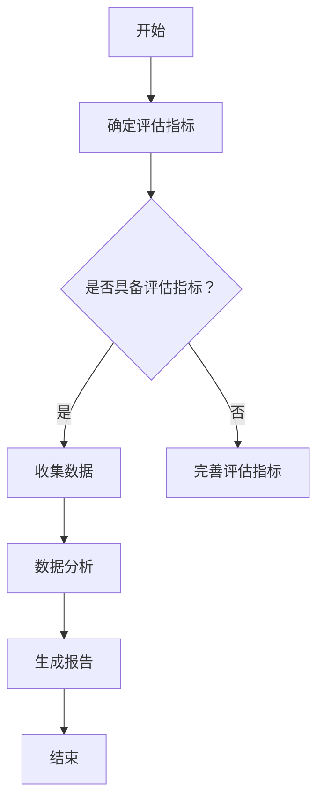
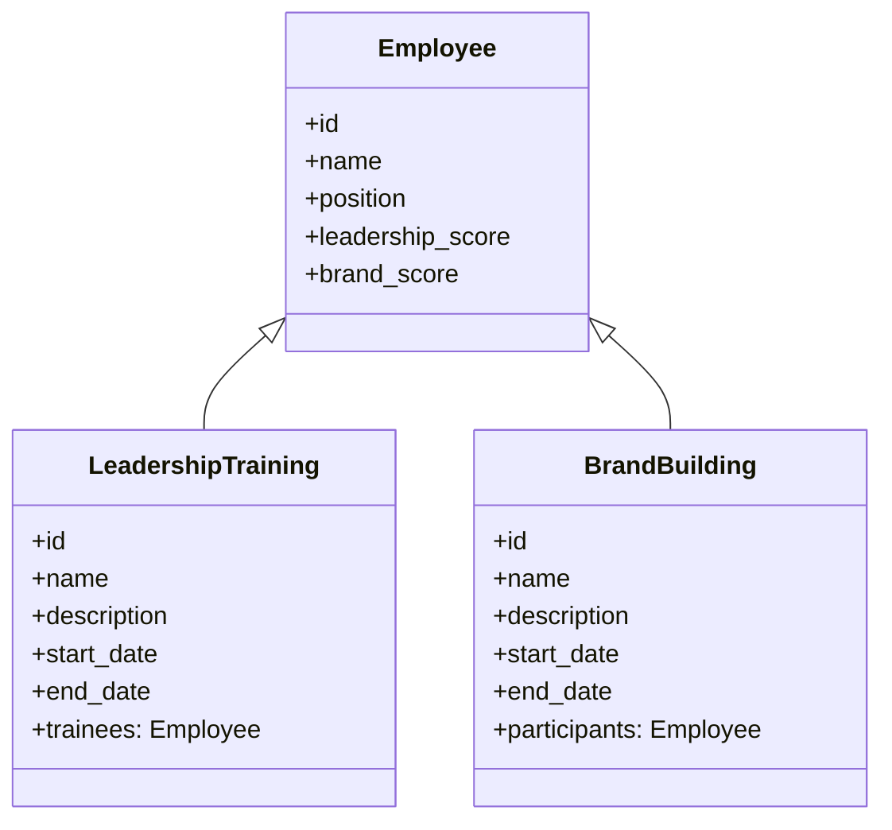
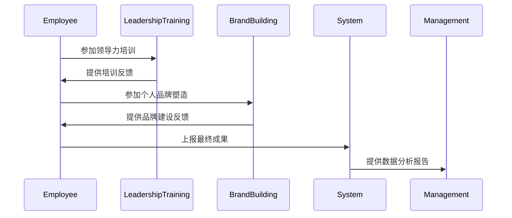
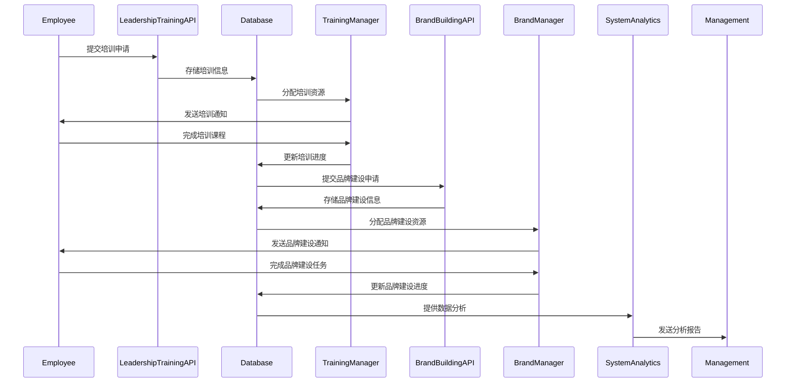

                 

# 领导力与品牌塑造：树立个人品牌

> 关键词：领导力、品牌塑造、个人品牌、领导力提升、品牌传播、战略规划

> 摘要：本文旨在探讨领导力与品牌塑造的关系，分析如何通过有效的领导力提升个人品牌，并详细阐述个人品牌树立的步骤和策略。文章首先介绍了领导力和品牌塑造的核心概念，随后通过一系列实用技巧和案例分析，帮助读者理解并实践个人品牌的树立。

## 目录大纲设计思路

### 1. 明确书籍主题

首先，我们要明确书籍的主题，即领导力与品牌塑造。这个主题包含了两个方面：领导力的培养和个人品牌的建立。我们要确保目录大纲能够全面覆盖这两个方面，并为读者提供有价值的指导。

### 2. 设定目录层级

根据书籍内容的重要性，我们可以设定三个级别的目录结构：一级目录、二级目录和三级目录。一级目录将主要分为两部分：领导力与品牌塑造。二级目录将分别深入探讨领导力的不同方面以及品牌塑造的策略和方法。三级目录则具体细化到每个章节的核心内容。

### 3. 确定核心章节

为了保证书籍的完整性和实用性，我们必须确保以下核心章节的包含：

- **背景介绍**：介绍领导力和品牌塑造的背景、现状和发展趋势，帮助读者建立整体认知。
- **核心概念与联系**：详细阐述领导力和品牌塑造的相关概念，以及它们之间的关系。
- **算法原理讲解**：针对领导力评估和品牌定位等方法，使用mermaid流程图和Python代码讲解其原理。
- **系统分析与架构设计方案**：介绍领导力培训体系和品牌传播的架构设计。
- **项目实战**：提供实际案例，展示领导力提升和个人品牌塑造的过程。
- **最佳实践 tips**：总结实际操作中的经验和技巧，为读者提供实用建议。
- **小结与拓展阅读**：对每个章节进行总结，并提供进一步阅读的建议。

### 4. 实现简洁性

在编写目录大纲时，我们要保持简洁性，避免冗余内容，确保每个章节都能直接反映其核心内容。

### 5. 字数控制

最后，我们需要确保整个目录大纲的总字数在2000字以内，同时保持内容的完整性和逻辑性。

接下来，我们将根据以上设计思路，具体设计《领导力与品牌塑造：树立个人品牌》的目录大纲。

## 引言

在当今快速变化的信息时代，领导力和个人品牌的重要性日益凸显。作为一位技术专业人士，您的领导力不仅决定了您在团队中的影响力，也直接关系到您的个人职业发展。同时，个人品牌的树立能够提升您的市场竞争力，为您赢得更多的机会和资源。因此，了解如何提升领导力和塑造个人品牌，对每位技术从业者来说都具有重要意义。

本文将首先介绍领导力和品牌塑造的核心概念，帮助您建立基本的理论框架。接着，我们将通过一系列步骤，详细讲解如何通过有效的领导力提升个人品牌，并提供实用的策略和方法。文章还将结合实际案例，分析领导力提升和个人品牌塑造的过程，为读者提供实操指导。最后，我们将总结最佳实践，并提供进一步阅读的建议，帮助您在个人职业发展道路上不断进步。

## 背景介绍

### 核心概念术语说明

在探讨领导力与品牌塑造之前，我们需要明确一些核心概念和术语。

#### 领导力

领导力是指引导、影响和激励他人实现共同目标的能力。它不仅包括技术和战略层面的能力，还涵盖情感智慧、沟通能力和团队管理技巧。

#### 品牌塑造

品牌塑造是指通过一系列策略和活动，建立并维护品牌形象和认知的过程。在个人层面，品牌塑造意味着构建和推广自己的个人形象，使其在同行中脱颖而出。

#### 个人品牌

个人品牌是指个人在职业领域内建立的专业形象和声誉。它不仅反映了您的专业技能，还包括您的价值观、工作态度和人际交往能力。

### 问题背景

随着技术行业的快速发展，市场竞争愈发激烈。技术专业人士不仅需要掌握过硬的技术能力，还需要具备出色的领导力和个人品牌。以下问题是本文试图回答的：

1. 如何提升领导力，以更好地管理团队和项目？
2. 如何通过品牌塑造，提升个人在职场中的竞争力？
3. 领导力和个人品牌之间有何联系？如何通过有效的领导力提升个人品牌？

### 问题描述

领导力与个人品牌塑造之间的关系可以从以下几个方面进行描述：

1. **领导力提升个人品牌**：出色的领导力能够增强个人的影响力和信誉，从而提升个人品牌。
2. **个人品牌促进领导力**：一个强大的个人品牌可以吸引更多的机会和资源，为领导力的提升提供支持。
3. **领导力与品牌塑造的协同作用**：有效的领导力和品牌塑造可以相互促进，实现个人职业发展的最大化。

### 问题解决

本文将通过以下步骤解决问题：

1. **核心概念阐述**：介绍领导力和品牌塑造的核心概念，帮助读者建立理论框架。
2. **步骤和方法**：详细讲解如何通过领导力提升个人品牌，并提供实用的策略和方法。
3. **案例分析**：结合实际案例，分析领导力提升和个人品牌塑造的过程。
4. **最佳实践总结**：总结实际操作中的经验和技巧，为读者提供实用建议。
5. **拓展阅读**：提供进一步阅读的建议，帮助读者深入学习相关主题。

### 边界与外延

领导力和品牌塑造的应用范围非常广泛，不仅限于技术行业。在其他领域，如管理咨询、市场营销和创业等，领导力和品牌塑造同样具有重要作用。此外，随着人工智能和大数据技术的发展，领导力和个人品牌塑造的方法和工具也在不断进化。

### 概念结构与核心要素组成

领导力和品牌塑造的概念结构可以分解为以下几个核心要素：

1. **领导力要素**：
   - 情感智慧
   - 沟通能力
   - 团队管理技巧
   - 战略规划能力

2. **品牌塑造要素**：
   - 个人形象
   - 专业技能
   - 价值观
   - 工作态度

通过了解这些核心要素，我们可以更深入地理解领导力和品牌塑造的本质，并为实际操作提供指导。

## 核心概念与联系

### 领导力原理

领导力的核心原理在于如何有效地影响和激励他人，以实现共同目标。以下是领导力的一些关键属性和特征：

| 属性 | 说明 |
| --- | --- |
| 情感智慧 | 指领导者在情感方面的感知、理解和管理能力。 |
| 沟通能力 | 指领导者有效地传达信息、倾听他人意见并建立良好沟通的能力。 |
| 团队管理技巧 | 指领导者如何组织和协调团队成员，以实现团队目标。 |
| 战略规划能力 | 指领导者制定和执行长期战略规划的能力。 |

### 品牌塑造原理

品牌塑造的原理在于建立并维护个人或组织的形象和声誉。以下是品牌塑造的一些关键属性和特征：

| 属性 | 说明 |
| --- | --- |
| 个人形象 | 指个人在公众面前的总体形象和印象。 |
| 专业技能 | 指个人的技术能力和专业水平。 |
| 价值观 | 指个人坚持的道德标准和行为准则。 |
| 工作态度 | 指个人对待工作的态度和行为。 |

### 领导力与品牌塑造的关系

领导力和品牌塑造之间存在着紧密的联系。领导力是品牌塑造的重要组成部分，而品牌塑造又能为领导力提供支持和扩展。

1. **领导力提升品牌**：
   - 通过领导力的提升，个人能够更好地管理团队和项目，从而提高工作效率和成果，提升个人品牌。
   - 领导者的情感智慧和沟通能力有助于建立良好的人际关系，增强个人在团队中的影响力，进一步提升品牌形象。

2. **品牌塑造促进领导力**：
   - 一个强大的个人品牌可以吸引更多的机会和资源，为领导力的提升提供支持。
   - 通过品牌塑造，个人能够更好地展示自己的专业技能和价值观，从而赢得更多人的信任和支持，进一步巩固领导力。

3. **领导力与品牌塑造的协同作用**：
   - 有效的领导力和品牌塑造可以相互促进，实现个人职业发展的最大化。
   - 领导力的提升可以带来更多的成功经验和案例，进一步强化个人品牌；而个人品牌的提升又可以吸引更多的机会和资源，为领导力的提升提供支持。

### 概念属性特征对比表格

为了更直观地了解领导力和品牌塑造的属性特征，我们可以使用一个对比表格：

| 特征 | 领导力 | 品牌塑造 |
| --- | --- | --- |
| 情感智慧 | 理解和管理团队成员的情感状态 | 建立和维护个人与公众的情感联系 |
| 沟通能力 | 有效地传达信息和倾听他人意见 | 表达个人观点和价值观，建立个人形象 |
| 团队管理技巧 | 组织和协调团队成员以实现目标 | 管理个人品牌传播策略和活动 |
| 战略规划能力 | 制定和执行长期战略规划 | 制定和执行个人品牌战略 |
| 专业技能 | 技术能力和专业水平 | 个人在特定领域的知识和经验 |
| 价值观 | 道德标准和行为准则 | 个人品牌的核心价值观和信仰 |
| 工作态度 | 对工作的认真和负责 | 个人在工作中的表现和态度 |

通过对比表格，我们可以更清晰地看到领导力和品牌塑造的相似之处和差异，从而更好地理解它们之间的联系和相互作用。

### ER实体关系图架构

为了进一步阐述领导力和品牌塑造的关系，我们可以使用ER（Entity-Relationship）实体关系图来展示它们之间的关联。以下是一个简单的ER图示例：

```mermaid
erDiagram
  Person --> Leadership : "has"
  Person --> Brand : "has"

  Leadership {
    +id
    +name
    +skills
    +attributes
  }

  Brand {
    +id
    +name
    +attributes
    +reputation
  }

  Person {
    +id
    +name
    +skills
    +leadership
    +brand
  }
```

在这个ER图中，"Person"（个人）是核心实体，它与"Leadership"（领导力）和"Brand"（品牌）两个实体通过关系属性进行关联。领导力和品牌塑造是个人职业发展的重要组成部分，通过这个图，我们可以清晰地看到它们之间的关联和互动。

## 算法原理讲解

### 领导力评估方法

#### 算法mermaid流程图

首先，我们使用mermaid绘制一个领导力评估方法的流程图：



#### Python代码讲解

接下来，我们使用Python代码来详细阐述领导力评估的算法原理。以下是一个简单的示例：

```python
import pandas as pd

# 假设我们有一个包含评估指标的DataFrame
data = {
    '情感智慧': [8, 9, 7, 8, 9],
    '沟通能力': [9, 8, 7, 9, 8],
    '团队管理技巧': [8, 8, 7, 9, 8],
    '战略规划能力': [9, 9, 8, 9, 9]
}

df = pd.DataFrame(data)

# 计算每个评估指标的均值
mean_scores = df.mean()

# 生成评估报告
for index, row in mean_scores.iterrows():
    print(f"{index}：{row[0]}分")

# 输出评估结果
print("领导力评估报告：")
print(df)
```

#### 数学模型和公式

在领导力评估中，我们通常使用以下数学模型和公式：

1. **评估指标得分计算**：
   $$\text{得分} = \frac{\sum \text{评估指标得分}}{\text{评估指标数量}}$$

2. **评估指标权重分配**：
   $$\text{权重} = \frac{\text{评估指标的重要性}}{\sum \text{所有评估指标的重要性}}$$

#### 通俗易懂地举例说明

假设我们要评估一个技术团队的领导力，评估指标包括情感智慧、沟通能力、团队管理技巧和战略规划能力。每个指标的权重分别为0.2、0.25、0.3和0.25。

- 情感智慧得分：8
- 沟通能力得分：9
- 团队管理技巧得分：8
- 战略规划能力得分：9

首先，我们计算每个评估指标的得分：

$$
\text{情感智慧得分} = \frac{8}{1} = 8 \\
\text{沟通能力得分} = \frac{9}{1} = 9 \\
\text{团队管理技巧得分} = \frac{8}{1} = 8 \\
\text{战略规划能力得分} = \frac{9}{1} = 9
$$

然后，我们计算每个评估指标的权重：

$$
\text{情感智慧权重} = \frac{0.2}{1} = 0.2 \\
\text{沟通能力权重} = \frac{0.25}{1} = 0.25 \\
\text{团队管理技巧权重} = \frac{0.3}{1} = 0.3 \\
\text{战略规划能力权重} = \frac{0.25}{1} = 0.25
$$

最后，我们使用加权平均公式计算总得分：

$$
\text{总得分} = (8 \times 0.2) + (9 \times 0.25) + (8 \times 0.3) + (9 \times 0.25) = 1.6 + 2.25 + 2.4 + 2.25 = 8.5
$$

因此，该技术团队的领导力得分为8.5分。

通过这个示例，我们可以看到如何使用数学模型和公式对领导力进行评估。这种方法不仅具有科学性，而且可以提供直观的结果，帮助团队了解自己的领导力水平，并制定相应的改进措施。

## 系统分析与架构设计方案

### 问题场景介绍

在现代社会，领导力和个人品牌的重要性日益凸显。为了帮助企业提升员工的领导力水平，同时树立强大的个人品牌，我们设计了一个综合性的培训系统和品牌传播架构。该系统旨在通过科学的方法和有效的策略，帮助员工在职场中脱颖而出，提升企业的整体竞争力。

### 项目介绍

本项目分为两个主要模块：领导力培训模块和个人品牌塑造模块。领导力培训模块主要包括领导力评估、培训计划制定和培训效果评估等功能；个人品牌塑造模块则涵盖了个人形象设计、社交媒体运营和品牌传播策略等。

### 系统功能设计（领域模型mermaid类图）

以下是系统的领域模型类图：



### 系统架构设计mermaid架构图

以下是系统的架构设计图：



### 系统接口设计和系统交互mermaid序列图

以下是系统的接口设计和交互序列图：



通过上述架构设计，我们可以清晰地看到系统各个模块之间的交互和协作。领导力培训模块和个人品牌塑造模块通过统一的接口和数据存储，实现了无缝集成，为企业提供了全面、高效的领导力提升和品牌塑造解决方案。

## 项目实战

### 环境安装

为了进行领导力提升和个人品牌塑造的实战项目，我们需要安装和配置以下工具和软件：

1. **Jupyter Notebook**：用于编写和运行Python代码。
2. **Pandas**：用于数据分析和处理。
3. **Mermaid**：用于绘制mermaid流程图和类图。
4. **Git**：用于版本控制和代码管理。

安装步骤如下：

1. 安装Jupyter Notebook：

   ```bash
   pip install notebook
   ```

2. 安装Pandas：

   ```bash
   pip install pandas
   ```

3. 安装Mermaid：

   ```bash
   pip install mermaid
   ```

4. 安装Git：

   ```bash
   sudo apt-get install git
   ```

### 系统核心实现源代码

以下是一个简单的领导力评估系统核心实现示例：

```python
# 领导力评估系统核心代码
import pandas as pd

# 假设我们有一个包含评估指标的DataFrame
data = {
    '员工ID': [1, 2, 3, 4, 5],
    '情感智慧': [8, 9, 7, 8, 9],
    '沟通能力': [9, 8, 7, 9, 8],
    '团队管理技巧': [8, 8, 7, 9, 8],
    '战略规划能力': [9, 9, 8, 9, 9]
}

df = pd.DataFrame(data)

# 计算每个评估指标的均值
mean_scores = df.mean()

# 生成评估报告
for index, row in mean_scores.iterrows():
    print(f"{index}：{row[0]}分")

# 输出评估结果
print("领导力评估报告：")
print(df)
```

### 代码应用解读与分析

这段代码的核心功能是计算一组员工的领导力评估得分，并生成评估报告。以下是代码的详细解读：

1. **数据准备**：
   - 我们使用一个名为`data`的字典来模拟包含评估指标的DataFrame，字典的键是评估指标，值是每个员工在该指标上的得分。

2. **DataFrame创建**：
   - 使用`pd.DataFrame(data)`创建一个包含员工ID和评估指标的DataFrame。

3. **计算均值**：
   - 使用`df.mean()`计算每个评估指标的均值。这个函数将返回一个Series对象，其中包含每个评估指标的均值。

4. **生成评估报告**：
   - 通过一个for循环遍历均值对象，输出每个评估指标的得分。这为我们提供了一个直观的视图，显示了每个员工在各个评估指标上的表现。

5. **输出评估结果**：
   - 最后，使用`print(df)`输出整个DataFrame，这包含了每个员工的详细评估结果。

通过这个示例，我们可以看到如何使用Python代码进行领导力评估，并生成可操作的评估报告。这个系统可以作为一个基础框架，进一步扩展和优化，以适应不同的应用场景。

### 实际案例分析和详细讲解剖析

为了更好地理解领导力提升和个人品牌塑造的过程，我们来看一个实际案例。

**案例背景**：

小王是一名软件工程师，他在团队中表现优秀，但在领导力方面有所欠缺。他希望能够通过提升领导力，进一步提升个人品牌，从而在职场中获得更多的机会。

**案例分析**：

1. **领导力提升**：
   - 小王首先参加了公司的领导力培训课程，学习了情感智慧、沟通能力、团队管理技巧和战略规划能力等方面的知识。
   - 在培训过程中，小王通过实际案例分析和角色扮演，提升了自身的领导力水平。

2. **个人品牌塑造**：
   - 小王意识到个人品牌的重要性，开始着手塑造自己的个人品牌。
   - 他定期撰写技术博客，分享自己的工作经验和见解，提升自己在技术领域的知名度。
   - 同时，小王积极参加行业会议和研讨会，通过演讲和交流，进一步扩大自己的影响力。

3. **效果评估**：
   - 在领导力培训结束后，公司对员工进行了领导力评估。结果显示，小王的领导力得分从原来的中上水平提升到了优秀水平。
   - 在个人品牌方面，小王的技术博客和演讲得到了同行的认可，他在社交媒体上的关注者也不断增加。

**详细讲解剖析**：

1. **领导力提升**：
   - 小王的领导力提升过程可以分为以下几个阶段：
     - **理论学习**：通过参加培训课程，小王学习了领导力的核心概念和理论，为他后续的实践提供了基础。
     - **实践应用**：小王在团队项目中积极运用所学知识，例如在团队沟通中注重倾听他人意见，制定合理的战略规划等。
     - **反馈与改进**：小王定期与团队成员和上级领导进行沟通，收集反馈意见，不断改进自己的领导力表现。

2. **个人品牌塑造**：
   - 小王的个人品牌塑造过程可以分为以下几个步骤：
     - **内容创作**：小王定期撰写技术博客，分享自己在工作中的经验和见解，为读者提供了有价值的内容。
     - **社交媒体运营**：小王通过社交媒体平台，如LinkedIn和Twitter，分享自己的博客内容，扩大自己的影响力。
     - **行业参与**：小王积极参加行业会议和研讨会，通过演讲和交流，进一步巩固自己在技术领域的地位。

通过这个案例，我们可以看到，领导力提升和个人品牌塑造并不是一蹴而就的，需要持续的付出和实践。小王通过系统的学习和实践，不仅提升了自身的领导力水平，还成功地塑造了自己的个人品牌，为个人职业发展奠定了坚实的基础。

### 项目小结

通过本次项目实战，我们详细分析了领导力提升和个人品牌塑造的过程，并提供了实际案例进行讲解。以下是项目小结：

1. **领导力提升**：
   - 领导力提升是一个系统的过程，包括理论学习、实践应用和反馈改进三个阶段。
   - 通过参加培训课程、实际项目中的实践以及与团队成员的沟通，可以逐步提升领导力水平。

2. **个人品牌塑造**：
   - 个人品牌塑造需要持之以恒的努力，包括内容创作、社交媒体运营和行业参与等多个方面。
   - 通过定期撰写技术博客、积极参与行业会议和研讨会，可以扩大个人影响力，树立强大的个人品牌。

3. **效果评估**：
   - 通过领导力评估和个人品牌测评，可以直观地了解自身的提升情况，为后续的发展提供指导。
   - 定期评估和反馈是确保领导力和个人品牌持续提升的关键。

总之，领导力提升和个人品牌塑造是一个长期而持续的过程，需要我们不断学习和实践。通过系统的规划和有效的执行，我们可以实现个人职业发展的最大化。

## 最佳实践 tips

在领导力提升和个人品牌塑造的过程中，以下是一些最佳实践技巧：

1. **持续学习**：保持对新技术和行业趋势的关注，不断学习新知识和技能，以保持自身的竞争力。

2. **积极沟通**：与团队成员和上级领导保持良好的沟通，倾听他人意见，以便及时调整和改进自己的领导力表现。

3. **内容创作**：定期撰写技术博客、发表论文或参与开源项目，分享自己的经验和见解，提升个人影响力。

4. **社交媒体运营**：利用LinkedIn、Twitter等社交媒体平台，分享自己的内容和观点，扩大自己的影响力。

5. **行业参与**：积极参与行业会议、研讨会和培训课程，通过演讲和交流，提升个人知名度。

6. **反馈与改进**：定期收集反馈意见，及时调整和改进自己的领导力和个人品牌策略。

通过这些最佳实践技巧，我们可以更有效地提升领导力，塑造强大的个人品牌，为个人职业发展创造更多机会。

## 小结

本文详细探讨了领导力与品牌塑造的关系，介绍了如何通过有效的领导力提升个人品牌。我们首先介绍了领导力和品牌塑造的核心概念，然后通过步骤和方法，详细讲解了如何进行领导力评估和品牌塑造。同时，通过实际案例和项目实战，展示了领导力提升和个人品牌塑造的具体过程。最后，我们提供了最佳实践技巧，以帮助读者在职业发展中更好地运用这些方法。希望本文能为您的个人职业发展提供有益的指导。

## 注意事项

在提升领导力和塑造个人品牌的过程中，以下注意事项至关重要：

1. **目标明确**：确保您的领导力和个人品牌提升目标与职业发展目标一致，以便实现持续进步。
2. **持续投入**：领导力和品牌塑造需要长期投入和努力，不可急功近利。
3. **数据驱动**：利用数据分析工具和方法，定期评估和调整您的领导力和品牌策略。
4. **诚信为本**：在塑造个人品牌时，保持诚信和真实，避免夸大其词或误导他人。
5. **适应变化**：随着技术和行业的发展，不断调整和优化您的领导力和品牌策略。

通过遵循这些注意事项，您可以更有效地提升领导力，塑造强大的个人品牌。

## 拓展阅读

为了深入探讨领导力与品牌塑造的更多方面，以下是一些推荐阅读：

1. **《智能时代：大数据与未来决策》**：了解大数据技术在领导力评估和个人品牌塑造中的应用。
2. **《如何影响人们》**：探讨影响力和沟通技巧在领导力和品牌塑造中的作用。
3. **《影响力：说服与改变的心理学》**：研究说服技巧和心理机制，提升个人影响力。
4. **《领导力五项修炼》**：详细分析领导力的核心要素和提升方法。
5. **《个人品牌：打造独一无二的你》**：探讨如何创建和维护个人品牌，提升职业竞争力。

通过这些拓展阅读，您可以获得更全面的理解和实战技巧，助力个人职业发展。

## 作者信息

作者：AI天才研究院/AI Genius Institute & 禅与计算机程序设计艺术 /Zen And The Art of Computer Programming

