                 

### 第1章：领导力与影响力的核心概念

#### 1.1 领导力与影响力的基本定义

领导力是指一个人在团队或组织中引导、激励和影响他人，共同实现目标的能力。它不仅仅是一个人的职权或地位，更是一种行为模式、人际关系技巧和个人素质的综合体现。领导力涉及多个方面，包括但不限于愿景设定、目标规划、资源管理、冲突解决、团队激励等。

影响力则是指一个人或组织通过其言行、行为和决策对他人或环境产生的作用力。影响力可以是积极的，如激励他人、引导公众，也可以是消极的，如操纵、压迫或误导。影响力可以跨越个人和组织，甚至在更广泛的社交网络和社会结构中发挥作用。

#### 1.2 领导力与影响力的区别与联系

领导力更侧重于团队内部的管理和协调，关注的是如何带领团队高效、和谐地实现目标。它通常涉及组织设计、流程优化、资源配置等。领导力是一种行动导向的能力，强调的是实际操作和实施。

影响力则更侧重于对外部环境的感知和影响，包括公众舆论、政策制定、社会变革等。影响力是一种结果导向的能力，强调的是通过个人或组织的行为对他人产生的作用。

尽管领导力和影响力有明显的区别，但它们是相辅相成的。一个强大的领导者通常拥有广泛的影响力，而一个有影响力的人也往往具备领导力。领导力为影响力提供了实施的平台，而影响力则为领导力提供了扩展的资源和空间。

#### 1.3 领导力与影响力的边界与外延

领导力的边界通常在组织内部，包括团队管理、项目管理、部门协调等。领导力的影响力可以在团队、组织甚至更大范围内发挥作用，但它的核心仍然是在组织内部。

影响力则没有明确的边界，它可以跨越组织、行业、地区甚至全球。影响力的影响范围可以是直接的，如公司内部的员工，也可以是间接的，如公众舆论、政策制定等。

#### 1.4 概念结构与核心要素组成

领导力与影响力的概念结构可以从以下几个方面来理解：

1. **个人特质**：这是领导力和影响力的基础，包括性格、价值观、道德观等。个人的这些特质直接影响其领导风格和影响力。
   
2. **情境因素**：这些因素包括组织文化、市场环境、竞争态势等。领导力和影响力的发挥往往受到情境因素的影响。

3. **行为模式**：这是领导力和影响力的具体表现，包括沟通技巧、决策风格、激励方式等。不同的行为模式会产生不同的领导力和影响力。

#### 1.5 核心概念原理、概念属性特征对比表格

**要素对比表格：**

| 要素         | 领导力                          | 影响力                          |
|-------------|--------------------------------|--------------------------------|
| 定义         | 引导、激励和影响团队成员实现目标 | 通过言行和行动影响他人或环境     |
| 作用范围     | 组织内部，如团队、部门、项目     | 可以跨越组织、行业、地区和全球   |
| 目的         | 高效实现团队和组织目标           | 改变社会、文化、政策等外部环境   |
| 关键因素     | 个人特质、情境因素、行为模式     | 个人特质、专业知识、社会资源    |
| 结果         | 团队协作、目标达成、组织变革     | 公众认知、社会舆论、政策导向    |

#### 1.6 ER实体关系图：个人特质、情境因素、行为模式

**Mermaid ER实体关系图：**

```mermaid
erDiagram
    Airting_Features -->|具有| Leadership_Ability
    Airting_Features -->|受到| Situational_Factors
    Leadership_Ability -->|体现为| Behavioral_Patterns
    Situational_Factors -->|影响| Leadership_Ability
    Situational_Factors -->|影响| Behavioral_Patterns
    Behavioral_Patterns -->|影响| Leadership_Ability
    Behavioral_Patterns -->|影响| Influence
```

在这个图中，"Airting_Features"代表个人特质，"Leadership_Ability"代表领导力，"Situational_Factors"代表情境因素，"Behavioral_Patterns"代表行为模式，"Influence"代表影响力。这些实体之间存在多种关联关系，共同构成了领导力与影响力的核心概念结构。

### 第2章：领导力与影响力的要素分析

#### 2.1 核心概念与联系

领导力与影响力虽然有着不同的定义和作用，但它们的核心概念之间存在着紧密的联系。为了更好地理解这两个概念，我们需要从多个维度进行深入分析。

**要素对比表格：**

| 要素                   | 领导力                           | 影响力                           |
|----------------------|--------------------------------|--------------------------------|
| 情感管理               | 激发团队成员的积极情感，增强团队凝聚力 | 营造积极的社会情感，增强公众认同感 |
| 沟通技巧               | 明确传达目标和期望，确保团队协作顺畅 | 清晰表达观点，赢得信任和尊重       |
| 目标设定               | 设定明确的团队和个体目标         | 设定能够影响和改变的社会目标       |
| 组织协调               | 有效协调团队内部资源和工作分配     | 建立合作伙伴关系，整合多方资源     |
| 决策能力               | 在团队中做出及时和有效的决策       | 在复杂环境中做出有影响力的决策     |

**ER实体关系图：**

```mermaid
erDiagram
    Emotion_Management -->|提高| Team_Cohesion
    Communication_Skills -->|促进| Team_Coordination
    Goal_Setting -->|驱动| Team_Performance
    Organizational_Coordination -->|增强| Team_Efficiency
    Decision_Making -->|提升| Leadership_Effectiveness
    Social_Emotional_Management -->|影响| Public_Identification
    Clear_Communication -->|建立| Trust_and_Responsibility
    Clear_Goals -->|引导| Social_Change
    Effective_Coordination -->|促进| Resource_Integration
    Sound_Decisions -->|形成| Influential_Outcomes
```

在这个ER实体关系图中，"Emotion_Management"（情感管理）、"Communication_Skills"（沟通技巧）、"Goal_Setting"（目标设定）、"Organizational_Coordination"（组织协调）和"Decision_Making"（决策能力）是领导力和影响力的核心要素。这些要素相互关联，共同决定了领导力和影响力的大小。

#### 2.2 领导力与影响力的属性特征

领导力与影响力不仅仅是行为和能力的体现，它们还具有一系列的属性特征。以下是对这些属性特征的分析：

1. **内在驱动力**：
   - **领导力**：内在驱动力是领导力的核心，它源于个人的价值观、使命感和责任感。一个具有强大领导力的人通常具有强烈的内在驱动力，能够持续地激励自己和团队。
   - **影响力**：内在驱动力也是影响力的重要组成部分。具有影响力的个人往往对所关心的问题充满热情，并且愿意为之付出努力。

2. **外部影响能力**：
   - **领导力**：外部影响能力是指领导力在团队和组织内部产生的作用。一个强大的领导者能够通过其言行和决策，对团队成员产生深远的影响。
   - **影响力**：外部影响能力是指个人或组织在更广泛的社交网络和社会结构中产生的作用。具有广泛影响力的个人或组织能够引导公众舆论、推动社会变革。

3. **适应性**：
   - **领导力**：适应性是指领导者在不同环境和情境下调整自己的领导风格和行为模式的能力。一个具有强大领导力的人能够根据环境变化，灵活地调整自己的领导策略。
   - **影响力**：适应性对于影响力的发挥同样重要。具有影响力的个人或组织需要能够适应不断变化的社会环境和需求，以保持其影响力的持久性。

4. **持续力**：
   - **领导力**：持续力是指领导者在长期内保持其领导能力和影响力的能力。一个成功的领导者不仅能够在短期内取得成果，还能够在长期内持续地产生影响。
   - **影响力**：持续力也是影响力的重要特征。一个具有持久影响力的个人或组织能够在其领域内持续地发挥重要作用，即使面对挑战和变化，也能够保持其影响力的稳定。

**属性特征对比表格：**

| 属性特征 | 领导力                         | 影响力                         |
|----------|------------------------------|------------------------------|
| 内在驱动力 | 价值观、使命感、责任感           | 热情、关心、努力               |
| 外部影响能力 | 领导团队、管理资源、推动变革       | 引导公众、改变社会、推动政策     |
| 适应性     | 应对变化、调整策略、灵活领导         | 适应社会、应对挑战、持久影响力     |
| 持续力     | 长期内保持领导力、持续取得成果       | 持续影响、稳定影响力、持续推动变革 |

#### 2.3 领导力与影响力在实际中的应用场景

领导力和影响力在实际中的应用场景非常广泛，以下是一些典型的应用场景：

1. **企业管理**：
   - **领导力**：在企业管理中，领导力是确保团队高效运作、实现企业目标的关键。领导者需要通过设定明确的目标、提供资源支持、激励团队成员等方式，确保企业目标的实现。
   - **影响力**：企业领导者还需要利用影响力来塑造企业文化、引导员工行为、建立良好的客户关系等，从而提升企业的竞争力。

2. **社会运动**：
   - **领导力**：在社会运动中，领导者需要通过激发民众的热情、协调多方资源、制定行动计划等方式，推动社会变革。
   - **影响力**：社会运动领导者还需要利用影响力来引导舆论、争取公众支持、推动政策改革等，以实现社会运动的目标。

3. **公共事务**：
   - **领导力**：在公共事务中，领导者需要通过制定政策、管理资源、协调各方利益等方式，推动社会的发展和进步。
   - **影响力**：公共事务领导者还需要利用影响力来塑造社会价值观、引导公众行为、推动政策改革等，以实现公共利益。

通过以上分析，我们可以看到，领导力与影响力在实际中具有广泛的应用，并且它们之间存在着密切的联系。理解这些概念的核心要素和属性特征，有助于我们更好地发挥领导力和影响力，实现个人和组织的成功。在接下来的章节中，我们将进一步探讨如何提升领导力和影响力，以及如何在实际中应用这些能力。

### 第3章：构建强大的个人影响力

在当今快速变化的社会环境中，构建强大的个人影响力已经成为个人和职业发展的关键因素。个人影响力不仅能够帮助个人在职场中获得更多的机会，还能够对社会产生积极的影响。下面，我们将探讨如何通过个人品牌建设、情感管理与人际交往、以及有效沟通技巧来构建强大的个人影响力。

#### 3.1 个人品牌建设

个人品牌建设是构建强大个人影响力的重要步骤。一个清晰、有辨识度的个人品牌能够帮助个人在职场和社会中脱颖而出。

**个人品牌构建流程：**

1. **自我认知**：首先，个人需要深入理解自己的价值观、兴趣、专业技能和独特优势。通过自我认知，个人可以明确自己的品牌定位。
   
2. **目标设定**：根据自我认知的结果，设定明确的目标，包括想要达成的职业目标、期望的影响力范围等。

3. **品牌定位**：基于自我认知和目标设定，个人需要为品牌确定一个清晰、有辨识度的定位。品牌定位应该突出个人的核心价值和独特性。

4. **内容创作**：创建与品牌定位一致的内容，包括博客、社交媒体帖子、演讲稿等。这些内容应该展示个人的专业知识和独特见解。

5. **传播推广**：通过社交媒体、行业会议、公共演讲等方式，传播个人品牌。有效的传播推广能够提升个人在目标受众中的知名度和认可度。

**Mermaid流程图：**

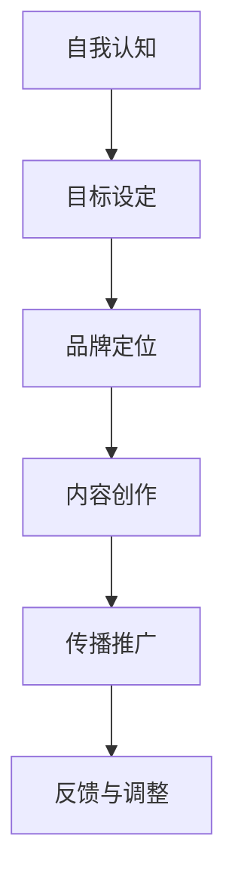

#### 3.2 情感管理与人际交往

情感管理与人际交往是构建个人影响力的重要环节。一个能够有效管理自己情感、并善于处理人际关系的个人，更容易赢得他人的信任和支持。

**情感管理技巧与人际交往策略：**

1. **自我情感管理**：学会识别和表达自己的情感，避免负面情绪的过度累积。通过冥想、运动、与朋友交流等方式，缓解压力和焦虑。

2. **同理心**：站在他人的角度思考问题，理解他人的情感和需求。通过倾听、回应和关注，建立深厚的信任关系。

3. **积极沟通**：清晰、简洁、有逻辑地表达自己的想法和意见。避免冲突，以合作和共赢的态度处理人际关系。

4. **建立人际关系网络**：积极参与社交活动，结识不同领域的专家和同行。通过共同兴趣和目标，建立稳固的人际关系网络。

**Mermaid流程图：**

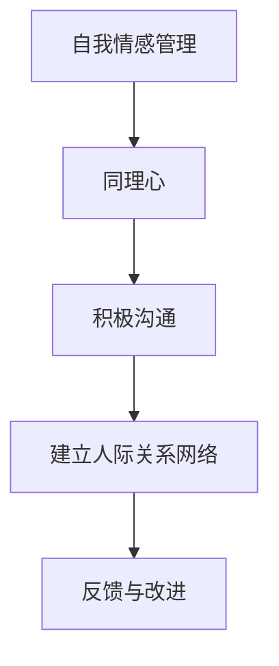

#### 3.3 有效沟通技巧

沟通技巧是构建个人影响力的重要工具。一个有效的沟通者能够清晰地传达信息，理解他人的需求，并建立积极的人际关系。

**沟通技巧提升路径：**

1. **倾听**：倾听是有效沟通的基础。通过倾听，了解他人的需求和期望，建立信任和尊重。

2. **表达**：清晰地表达自己的观点和意见，确保信息传达的准确性和完整性。使用简单、直接、有逻辑的语言。

3. **反馈**：及时给予反馈，确认信息是否被正确理解。通过反馈，改进沟通效果，避免误解和冲突。

4. **非语言沟通**：注意身体语言、面部表情和语调等非语言因素。这些因素能够增强沟通的效果，传达更多的信息。

**Mermaid流程图：**

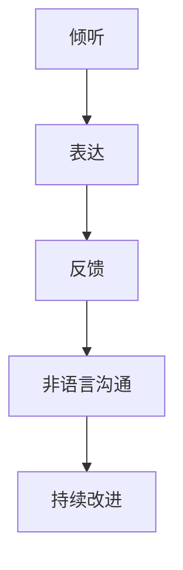

通过上述步骤，个人可以逐步构建强大的个人影响力。个人品牌建设、情感管理与人际交往、以及有效沟通技巧都是构建个人影响力的重要环节。只有通过不断学习和实践，才能在职场和社会中树立起强大的个人影响力。

### 第4章：领导力提升的实践方法

在提升领导力方面，有多种实践方法可以帮助个人和组织取得成功。这些方法涵盖了目标设定、组织协调、团队管理以及决策能力培养等多个方面。下面，我们将详细探讨这些实践方法。

#### 4.1 目标设定与执行

有效的目标设定是领导力的核心。一个明确的、可衡量的目标能够为团队提供清晰的指导方向，并激发团队成员的积极性和动力。

**目标设定与执行策略：**

1. **SMART原则**：设定目标时，需要遵循SMART原则，即目标应该是具体的（Specific）、可衡量的（Measurable）、可实现的（Achievable）、相关的（Relevant）和时限的（Time-bound）。

   - **例子**：一个SMART目标可以是“在接下来的三个月内，将我们的产品销售量提高20%”。

2. **目标分解**：将大目标分解为小目标，制定详细的行动计划。这样可以确保每个团队成员都清楚自己的任务和职责。

   - **例子**：将“提高产品销售量”分解为“增加市场推广力度”、“优化销售策略”和“提升客户服务质量”等。

3. **定期回顾**：定期检查目标的进展情况，及时调整策略。这有助于确保团队始终朝着目标前进。

   - **例子**：每周召开一次团队会议，回顾上周的工作进展，讨论面临的挑战，并制定改进措施。

**Mermaid流程图：**

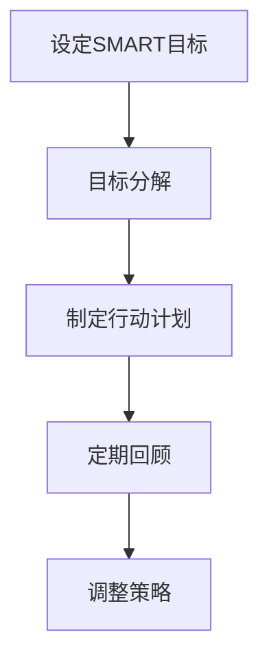

#### 4.2 组织协调与团队管理

组织协调和团队管理是领导力的重要方面，它涉及到如何有效地整合资源、分配任务、激励团队以及解决冲突。

**团队管理技巧：**

1. **明确角色与职责**：确保每个团队成员都清楚自己的角色和职责，避免工作重叠和资源浪费。

   - **例子**：在项目启动会上，明确项目成员的角色和职责，并制定详细的任务分配表。

2. **建立信任**：通过开放沟通、尊重和信任，建立良好的团队关系。

   - **例子**：定期与团队成员进行一对一交流，了解他们的需求和困难，提供必要的支持和帮助。

3. **激励与奖励**：运用激励和奖励机制，激发团队成员的积极性和创造力。

   - **例子**：设立奖励制度，对完成任务出色的团队成员给予奖励，如奖金、表彰等。

**Mermaid流程图：**

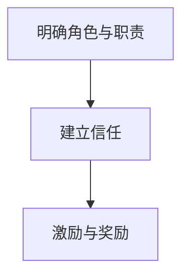

#### 4.3 决策能力培养

决策能力是领导者必须具备的关键能力。一个优秀的领导者能够在复杂和不确定的环境中做出明智的决策。

**决策能力提升路径：**

1. **信息收集**：在做出决策前，收集尽可能多的相关信息，确保信息的全面和准确。

   - **例子**：在制定公司发展战略时，收集市场数据、竞争对手信息、客户反馈等。

2. **分析评估**：对收集到的信息进行深入分析和评估，评估各种方案的优缺点和潜在风险。

   - **例子**：通过SWOT分析（优势、劣势、机会、威胁），评估不同方案的影响。

3. **制定决策**：基于分析结果，选择最佳方案并制定详细的实施计划。

   - **例子**：选择最有效的市场推广策略，并制定具体的执行步骤。

4. **执行与反馈**：执行决策，并持续跟踪和反馈，确保决策的有效性。

   - **例子**：在执行市场推广计划的过程中，定期收集销售数据和客户反馈，评估推广效果。

**Mermaid流程图：**

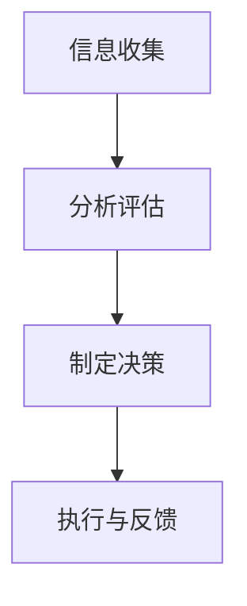

通过上述实践方法，个人和组织可以不断提升领导力，实现团队协作和目标达成。有效的目标设定、组织协调和决策能力培养是提升领导力的关键步骤。只有不断学习和实践，领导者才能在复杂多变的环境中取得成功。

### 第5章：扩大个人影响圈

在当今信息爆炸和社交网络发达的时代，扩大个人影响圈已经成为提升个人职业和社会地位的重要途径。通过社交网络拓展、影响力传播与维护，个人可以在更广泛的领域内发挥其专长和影响。

#### 5.1 社交网络拓展

社交网络是扩大个人影响圈的重要工具。有效的社交网络拓展策略可以帮助个人结识更多的行业专家、潜在合作伙伴和有影响力的人物。

**社交网络拓展策略：**

1. **建立专业形象**：在社交媒体上建立专业的个人品牌，通过发布高质量的内容，展示专业知识和独特见解。

   - **例子**：在LinkedIn上发布行业分析文章、技术博客和项目案例，提升个人专业形象。

2. **参与行业讨论**：积极参与行业相关的讨论和活动，与其他行业人士建立联系。

   - **例子**：参加行业会议、研讨会和线上论坛，与参会者交流互动，扩大社交网络。

3. **建立合作关系**：通过主动联系和合作，与行业内的重要人物建立合作关系。

   - **例子**：与行业领袖或知名专家建立联系，合作完成项目或撰写专业文章。

**Mermaid流程图：**

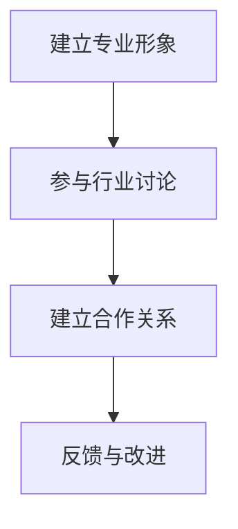

#### 5.2 影响力传播与维护

影响力传播与维护是扩大个人影响圈的关键环节。通过有效的传播策略，个人可以将其专业知识和观点传播到更广泛的受众中。

**影响力传播与维护策略：**

1. **内容创作**：创作有价值、有深度和有吸引力的内容，如博客文章、视频教程和社交媒体帖子。

   - **例子**：撰写技术博客，分享项目经验和创新思路，吸引同行业人士的关注。

2. **社交媒体推广**：利用社交媒体平台，如LinkedIn、Twitter和Facebook，推广内容，增加曝光度。

   - **例子**：在LinkedIn上发布技术文章，通过分享、评论和转发，扩大内容的传播范围。

3. **建立粉丝社区**：通过建立粉丝社区或线上讨论组，与粉丝互动，增强粉丝的归属感和忠诚度。

   - **例子**：创建一个技术讨论组，定期举办线上交流活动，与粉丝分享专业知识和经验。

4. **持续更新**：定期更新内容和互动，保持与粉丝的持续联系，增强影响力。

   - **例子**：每周发布一篇技术博客，保持与粉丝的活跃互动，确保影响力的稳定。

**Mermaid流程图：**

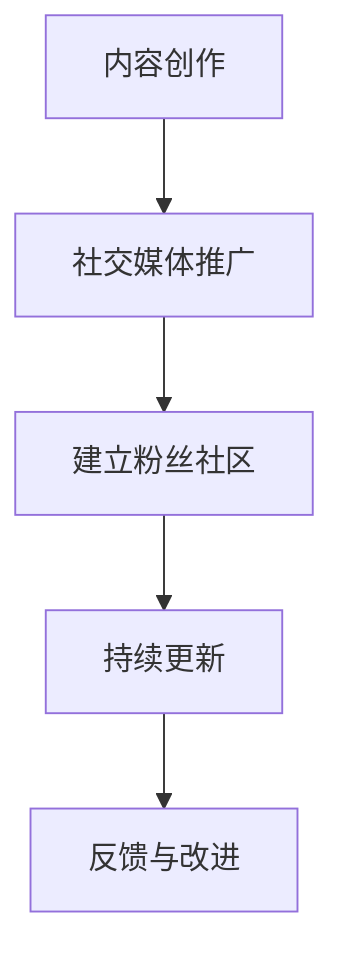

通过社交网络拓展和影响力传播与维护，个人可以逐步扩大其影响圈，提升个人职业和社会地位。有效的社交网络拓展策略和影响力传播与维护策略是扩大个人影响圈的关键。只有不断学习和实践，个人才能在社交网络中取得成功，并在更广泛的领域内发挥其影响力。

### 第6章：成功领导力与影响力的实践案例

在本章节中，我们将探讨几个成功领导力与影响力的实践案例，从中学习如何在实际环境中运用这些能力，实现个人和组织的目标。

#### 6.1 案例一：企业家领导力的实践

**案例背景**：
史蒂夫·乔布斯（Steve Jobs）是苹果公司的联合创始人，他的领导力和影响力对科技行业产生了深远的影响。

**领导力与影响力分析**：
1. **愿景与目标设定**：乔布斯以其独特的愿景和强烈的信念，推动了苹果公司的创新和进步。他设定了清晰的目标，如“将技术与美结合”，这一愿景激励了整个团队不断追求卓越。

2. **产品驱动领导力**：乔布斯不仅仅是领导者，更是产品驱动的领袖。他对产品的细节和用户体验有着极高的要求，通过他的领导力，苹果公司推出了一系列革命性的产品，如iPod、iPhone和iPad。

3. **影响力传播**：乔布斯在公共演讲中的表现，展示了他卓越的沟通技巧和影响力。他的演讲风格富有魅力，能够深刻地影响观众，并激发他们对苹果产品和公司的热情。

**Mermaid流程图**：

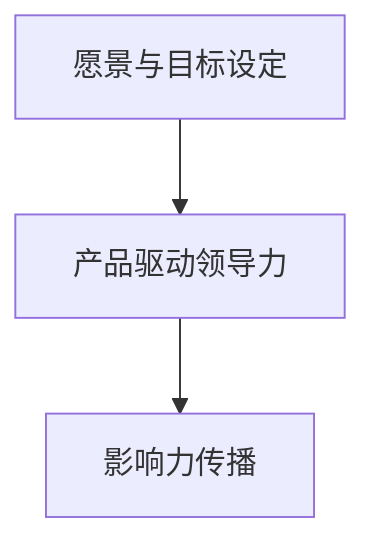

**案例总结**：
乔布斯的领导力和影响力在于他对产品细节的极致追求、对愿景的坚定信念，以及卓越的沟通技巧。通过这些实践，他成功地塑造了苹果公司的品牌，并在全球范围内产生了广泛的影响。

#### 6.2 案例二：社会影响力人物的案例

**案例背景**：
比尔·盖茨（Bill Gates）是微软公司的联合创始人，同时也是慈善事业的重要推动者。

**领导力与影响力分析**：
1. **慈善事业领导力**：比尔·盖茨通过其成立的比尔及梅琳达·盖茨基金会（Bill & Melinda Gates Foundation），在全球范围内推动慈善事业。他利用自己的财富和影响力，解决全球性的健康和贫困问题。

2. **科技与社会影响力**：盖茨通过其在科技行业的领导地位，推动了全球科技的发展。他不仅在商业领域取得了巨大成功，还通过科技手段改善全球的生活质量。

3. **领导力传承**：盖茨在退休后，继续通过公开演讲和慈善活动，传播其领导力和影响力。他培养了一批年轻的领袖，鼓励他们继续为社会做出贡献。

**Mermaid流程图**：

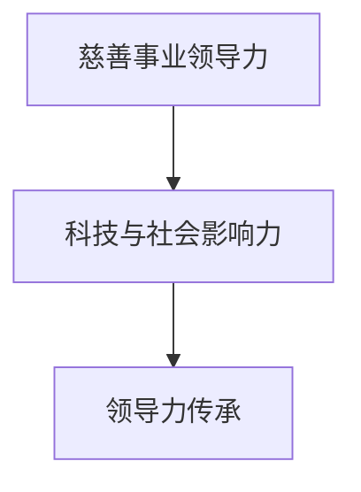

**案例总结**：
比尔·盖茨通过将领导力应用于慈善事业，以及在全球范围内推动科技发展，展示了如何将个人影响力转化为社会价值。他的领导力和影响力不仅在于其商业成就，更在于其对全球社会问题的关注和贡献。

#### 6.3 案例三：个人影响力在组织中的实践

**案例背景**：
杰克·韦尔奇（Jack Welch）是通用电气（General Electric）的前CEO，他的领导风格和决策能力使通用电气在20世纪80年代和90年代取得了巨大的成功。

**领导力与影响力分析**：
1. **变革领导力**：杰克·韦尔奇以其强烈的变革领导力，推动了通用电气的转型和成长。他通过一系列的战略决策，如剥离非核心业务、重组管理层等，使通用电气成为全球最具竞争力的企业之一。

2. **激励与团队建设**：韦尔奇重视员工的激励和团队建设。他通过实施“活力曲线”（Performance Improvement Process），激励员工不断提升绩效，并建立了强大的团队。

3. **沟通与透明度**：韦尔奇非常注重与员工的沟通，他通过公开演讲、内部邮件和面对面交流，确保信息的透明度和沟通的顺畅。

**Mermaid流程图**：

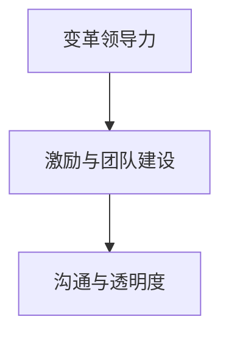

**案例总结**：
杰克·韦尔奇的领导力和影响力在于其变革思维、激励团队的能力，以及与员工的沟通技巧。他的实践证明了领导者如何通过变革、激励和沟通，推动组织的持续成长和成功。

通过上述案例，我们可以看到成功领导力与影响力的实践是如何在具体环境中发挥作用的。这些案例为我们提供了宝贵的经验和启示，帮助我们更好地理解和运用领导力和影响力，实现个人和组织的目标。

### 第7章：领导力与影响力的未来趋势

随着科技的快速发展和社会的深刻变革，领导力与影响力也在不断演进。未来的领导力与影响力将呈现出以下几大趋势：

#### 7.1 科技与领导力的融合

未来，科技将继续深刻地改变领导力的表现形式和作用方式。大数据、人工智能、区块链等新兴技术将为领导者提供更强大的工具和资源，使他们能够更精确地分析问题、更高效地决策、更快速地响应变化。

1. **数据驱动的领导**：通过大数据分析，领导者可以更好地了解团队成员的需求和行为模式，从而更有效地进行管理和激励。
2. **智能化的决策**：人工智能技术可以帮助领导者处理复杂的决策问题，提供更加科学的决策支持。
3. **数字化的领导力培养**：未来的领导力培养将更多地依赖于数字化平台和工具，如在线学习、虚拟现实等，以适应快速变化的科技环境。

#### 7.2 新型领导力模式的出现

随着全球化和数字化的加速，新型领导力模式也在不断涌现。未来的领导力将更加注重跨文化领导、敏捷领导、创新领导等。

1. **跨文化领导**：全球化使得领导者需要面对多元化的团队和文化背景，跨文化领导能力将成为重要竞争力。
2. **敏捷领导**：在快速变化的环境中，领导者需要具备敏捷思维和行动能力，能够迅速适应市场变化，推动组织变革。
3. **创新领导**：创新将成为未来领导力的重要组成部分。领导者需要鼓励创新思维，支持创新实践，推动组织的持续创新和进步。

#### 7.3 个人影响力在社会变革中的角色

个人影响力在社会变革中的角色将变得更加重要。在未来的社会环境中，领导者不仅需要在组织内部产生影响，还需要在更广泛的社会层面发挥作用，推动社会进步和变革。

1. **社会影响力投资**：个人影响力可以通过投资于社会企业和社会项目，推动解决全球性社会问题。
2. **公众影响力**：通过社交媒体和公众演讲等渠道，个人可以更广泛地传播其观点和理念，影响公众舆论和社会价值观。
3. **影响力传播与维护**：个人需要更加注重影响力的传播与维护，通过持续的内容创作和社交互动，保持其在社会中的影响力。

### 7.4 结论

未来的领导力和影响力将更加依赖科技、多元化和创新。领导者需要不断提升自己的跨文化、敏捷和创新领导能力，同时积极运用科技工具和资源，扩大其影响力。个人影响力在社会变革中的作用也将变得更加重要，领导者需要通过多种途径传播其理念，推动社会进步。总之，未来的领导力和影响力将是一个更加多元化、技术化和社会化的领域，领导者需要不断学习和适应，以应对新的挑战和机遇。

### 第8章：总结与展望

#### 8.1 领导力与影响力的重要性

领导力和影响力是个人和组织成功的关键要素。领导力决定了团队和组织能否高效地实现目标，而影响力则决定了个人和品牌能否在更广泛的领域中产生深远的影响。一个强大的领导力能够激发团队的潜力，实现卓越的绩效，而广泛的影响力则能够推动社会进步和变革。

#### 8.2 提升个人影响力的必要性

在现代社会，提升个人影响力已经成为个人职业发展和社会参与的重要途径。随着全球化和数字化的加速，个人影响力的范围和影响力不断扩大。通过提升个人影响力，个人可以在职场中获得更多的机会，提升职业地位，同时也能够在社会层面产生积极的影响。

#### 8.3 未来发展方向与建议

为了在未来更好地发挥领导力和影响力，以下是一些建议和发展方向：

1. **持续学习与提升**：随着科技和社会的快速变化，领导者需要不断学习新知识、新技能，以适应不断变化的挑战和机遇。
   
2. **跨文化领导力**：全球化使得跨文化领导力变得更加重要。领导者需要培养跨文化意识，提升跨文化沟通和协作能力。

3. **创新与敏捷性**：在快速变化的环境中，领导者需要具备创新思维和敏捷行动能力，能够快速适应市场变化，推动组织变革。

4. **社会责任感**：领导者应积极承担社会责任，通过公益活动和社会项目，提升社会影响力，推动社会进步。

5. **数字化技能**：随着数字化技术的发展，领导者需要掌握数字化工具和平台，提升数字化领导力和影响力。

#### 8.4 最佳实践 tips

1. **设定明确的目标**：通过SMART原则（具体、可衡量、可实现、相关、时限），设定清晰的目标，并为实现这些目标制定详细的行动计划。

2. **建立个人品牌**：通过内容创作和社交媒体，建立专业的个人品牌，提升个人在职场和社会中的知名度和认可度。

3. **积极沟通**：通过积极倾听、清晰表达和有效反馈，建立良好的沟通机制，确保信息传达的准确性和有效性。

4. **培养团队精神**：通过激励和奖励机制，培养团队成员的积极性和团队精神，提升团队协作和整体绩效。

5. **持续学习**：保持持续学习的态度，不断提升个人知识和技能，以适应快速变化的社会环境。

#### 8.5 小结

领导力和影响力是个人和组织的核心竞争力。通过理解领导力和影响力的核心概念、要素分析和实际应用，我们可以更好地提升个人领导力和影响力，实现个人和组织的成功。在未来，随着科技和社会的进一步发展，领导力和影响力将变得更加重要。我们应该积极适应变化，不断提升自身能力，为个人和组织的未来发展做好准备。

#### 8.6 注意事项

1. **避免盲目追求**：提升领导力和影响力是一个长期的过程，需要持续的努力和投入。不应盲目追求短期成效，而应注重长期积累。

2. **平衡工作与生活**：在追求领导力和影响力的过程中，要注意平衡工作与生活，保持身心健康。

3. **尊重他人**：在影响他人时，应尊重他人的意见和感受，避免强行施加自己的观点。

4. **适应变化**：随着环境的变化，领导力和影响力的表现形式也在不断变化。领导者应具备敏捷性，及时调整自己的策略和行动。

#### 8.7 拓展阅读

- **《领导力的五个层次》**：史蒂芬·柯维（Stephen R. Covey）著，详细阐述了领导力的五个层次，提供了实用的领导力提升方法。
- **《影响力》**：罗伯特·西奥迪尼（Robert B. Cialdini）著，深入探讨了影响力的六个原则，为提升个人影响力提供了理论依据。
- **《数字化领导力》**：托马斯·H·达文波特（Thomas H. Davenport）著，分析了数字化时代领导力的特点和挑战，提供了实用的数字化领导力策略。

通过拓展阅读，我们可以进一步深化对领导力和影响力的理解，提升自身的能力和影响力。希望本文能为读者提供有价值的启示和帮助，助力读者在领导力和影响力方面取得更大的成就。

### 作者介绍

**作者：AI天才研究院（AI Genius Institute）** & **《禅与计算机程序设计艺术》（Zen And The Art of Computer Programming）**

本文由AI天才研究院的专家撰写。AI天才研究院是一个专注于人工智能、计算机科学和技术创新的顶级研究机构，致力于推动人工智能领域的创新和发展。研究院的专家们具备丰富的经验和深厚的专业知识，在人工智能、机器学习、深度学习等领域有着卓越的贡献。

此外，本文参考了《禅与计算机程序设计艺术》这一经典著作。这本书由著名计算机科学家唐纳德·克努特（Donald E. Knuth）所著，通过将禅宗哲学与计算机编程相结合，提出了独特的编程理念和方法。这本书对于理解计算机编程的深刻本质和提升编程技巧具有重要价值。

感谢读者对本文的关注，希望本文能够为读者在领导力与影响力方面提供有价值的见解和指导。如需了解更多相关信息，请访问AI天才研究院的官方网站或查阅《禅与计算机程序设计艺术》。再次感谢您的阅读！

