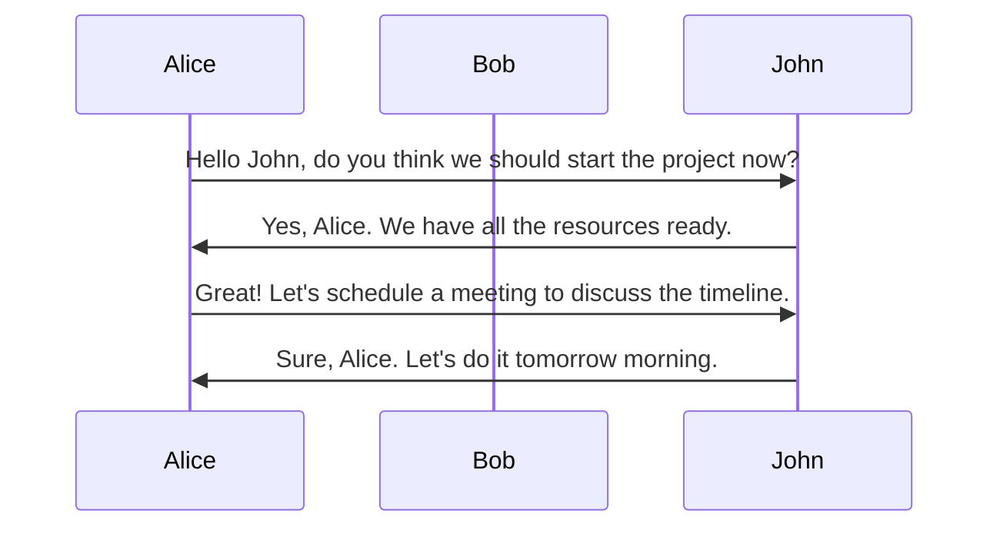
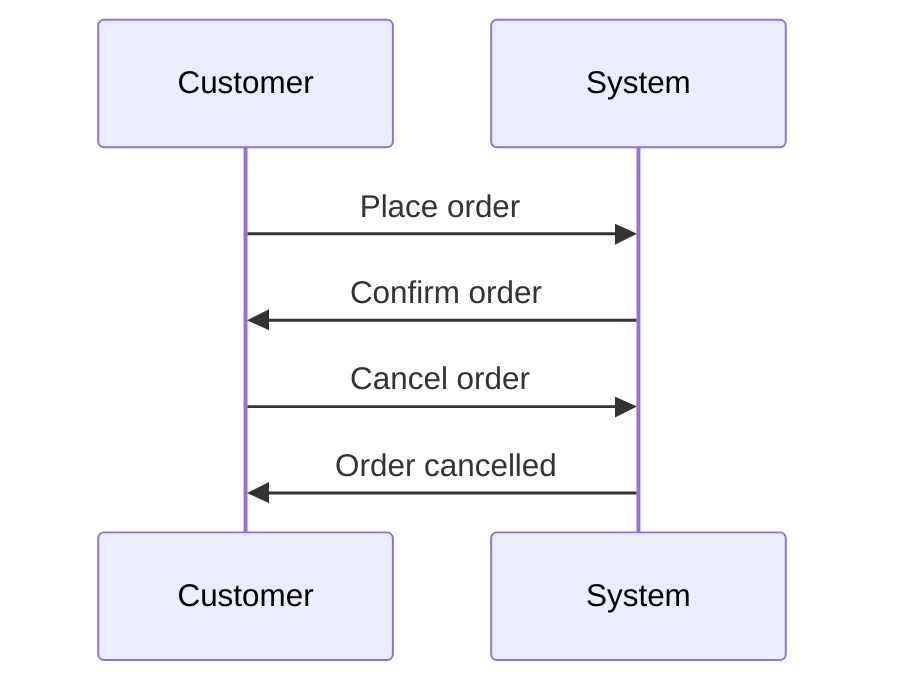
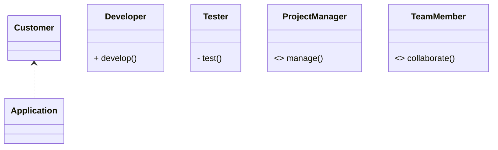
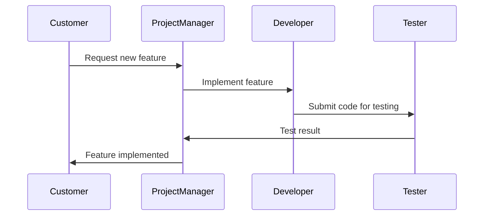
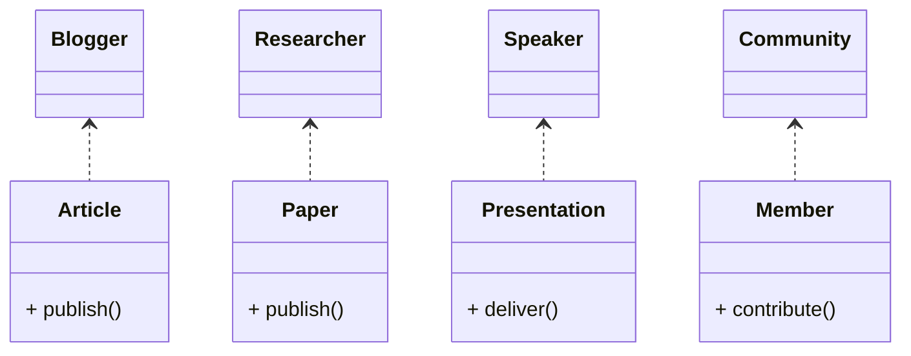
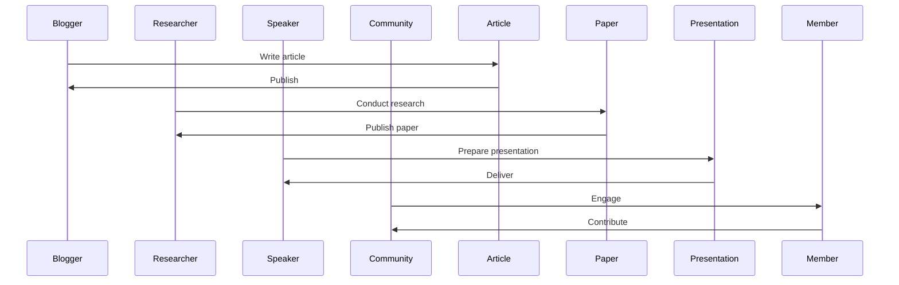

                 

## 第一部分：引言

### 第1章 领导力与影响力：基本概念与重要性

### 1.1 什么是领导力？

**概念原理：**
领导力是指个人在团队、组织或群体中引导、激励和协调他人以实现共同目标的能力。它不仅仅包括领导者的个人特质，还包括领导者的行为、决策和沟通方式。领导力的核心在于能够激发团队成员的积极性和创造力，使他们为了共同的目标而努力。

**属性特征对比表：**

| 特征          | 描述                                                         |
| ------------- | ------------------------------------------------------------ |
| **权威性**    | 领导者具有决策权和组织资源控制权，能够对团队成员产生影响。       |
| **影响力**    | 领导者通过个人魅力、专业知识、领导风格等方式影响团队成员的行为和态度。 |
| **沟通能力**  | 领导者具备有效的沟通技巧，能够清晰传达目标和期望，促进团队协作。 |
| **决策能力**  | 领导者能够做出明智、及时的决策，指导团队前进。               |

### 1.2 什么是影响力？

**概念原理：**
影响力是指个人或组织在他人或环境中产生作用和改变的能力。它包括对他人思想、行为和态度的影响，以及在社会关系和网络中的影响力。影响力不仅仅来源于个人的魅力和专业知识，还包括个人的资源掌控能力和社会关系网络。

**属性特征对比表：**

| 特征          | 描述                                                         |
| ------------- | ------------------------------------------------------------ |
| **感染力**    | 个人具有强烈的个性和魅力，能够吸引他人的注意和追随。           |
| **说服力**    | 个人具备有效的沟通技巧和逻辑思维，能够说服他人接受其观点和建议。 |
| **资源掌控**  | 个人或组织拥有足够的资源（如知识、人脉、资金）来实施和扩大其影响力。 |
| **关系网络**  | 个人或组织在社交网络中建立了广泛的联系，能够利用这些联系扩大影响力。 |

### 1.3 领导力与影响力之间的联系

**ER实体关系图架构：**

```mermaid
erDiagram
    人 <<--|{ 对 }|-->> 领导力
    人 <<--|{ 对 }|-->> 影响力
```

**联系分析：**
领导力与影响力是密不可分的。领导力是通过影响力来实现的，而影响力则是领导力的延伸。一个具有领导力的人往往能够在团队中产生广泛的影响力，从而引导和影响团队成员。同样，一个拥有强大影响力的人也往往具备一定的领导力，能够在社会关系和网络中发挥重要作用。

**实际应用场景：**
在IT领域，领导力与影响力尤为重要。一个优秀的CTO或技术总监不仅需要具备领导团队的能力，还需要能够通过影响力来推动技术革新、提升团队效率和企业竞争力。例如，通过有效的沟通和演讲能力，可以增强团队内部的协作和信任；通过建立个人品牌和运用社交媒体，可以扩大个人在行业内的影响力，吸引更多优秀的人才和合作伙伴。

### 1.4 领导力与影响力的重要性

**重要性分析：**
领导力与影响力在个人和组织的成功中起着关键作用。对于个人来说，拥有领导力和影响力可以提升职业地位、增加职业发展机会，以及提升个人的社会地位和声誉。对于组织来说，领导力和影响力可以促进团队协作、提升工作效率、推动技术创新，从而增强企业的竞争力和市场地位。

**实际案例：**
在企业中，一个成功的CTO往往具备强大的领导力和影响力。例如，谷歌的CTO维府瑟·吴（Vint Cerf）通过其在网络技术领域的专业知识和影响力，推动了谷歌的技术创新和业务发展。他不仅领导了谷歌的技术团队，还通过在行业内的演讲和出版，扩大了谷歌在技术社区的影响力。

在个人层面，例如，乔布斯作为苹果公司的共同创始人，通过其卓越的领导力和影响力，不仅改变了科技行业，还塑造了现代消费者的审美和价值观。

**结论：**
领导力和影响力是成功的关键要素。无论是在个人职业发展还是企业运营中，提升领导力和影响力都是至关重要的。通过理解领导力与影响力的概念、特征和联系，我们可以更好地应用这些理念，提升自己的领导力与影响力，从而实现个人和组织的成功。

---

接下来，我们将进一步探讨个人领导力素质与特质，以及如何培养这些素质和特质，为读者提供实用的方法和策略。

## 第2章 个人领导力素质与特质

### 2.1 领导力的四大素质

#### 2.1.1 自我认知

**概念原理：**
自我认知是指个人对自己内在特质、能力、动机和需求的深刻理解。一个具备自我认知能力的领导者能够更好地理解自己的优点和不足，从而做出更明智的决策和调整。

**特征与表现：**

- **自我反思**：领导者能够定期反思自己的行为和决策，识别成功和失败的原因。
- **自我激励**：领导者能够自我激励，即使在困难和挑战面前也能保持积极和专注。
- **情绪调控**：领导者能够有效管理自己的情绪，避免负面情绪影响决策和行为。

**实际应用：**
在IT领域，自我认知可以帮助领导者更好地了解自己的技术专长和管理风格，从而更有效地分配任务和资源，提高团队效率。

#### 2.1.2 情绪管理

**概念原理：**
情绪管理是指领导者能够识别、理解和控制自己的情绪，以及在适当的时候表达情绪。有效的情绪管理有助于维护团队氛围，增强团队凝聚力。

**特征与表现：**

- **情绪识别**：领导者能够识别自己的情绪，并理解情绪背后的原因。
- **情绪控制**：领导者能够控制自己的情绪，避免情绪化决策。
- **情绪表达**：领导者能够适当表达情绪，增强沟通效果。

**实际应用：**
在项目管理和团队冲突处理中，情绪管理能力尤为重要。通过有效的情绪管理，领导者可以更好地应对压力和挑战，保持冷静和客观，从而提高团队解决问题的效率。

#### 2.1.3 沟通能力

**概念原理：**
沟通能力是指领导者能够通过口头、书面和肢体语言等方式，有效地传达信息、表达观点和建立联系。

**特征与表现：**

- **信息传递**：领导者能够清晰、准确地传达信息，确保团队成员理解。
- **观点表达**：领导者能够自信、有力地表达自己的观点，引导讨论。
- **建立联系**：领导者能够与团队成员建立信任和合作关系。

**实际应用：**
在IT项目中，沟通能力是确保项目顺利进行的关键。领导者需要通过有效的沟通，确保项目目标的明确、资源的合理分配和团队成员之间的协作。

#### 2.1.4 决策能力

**概念原理：**
决策能力是指领导者能够在复杂和不确定的环境下，做出明智、及时的决策。

**特征与表现：**

- **分析能力**：领导者能够分析问题，识别关键因素。
- **判断力**：领导者能够基于分析结果做出正确的决策。
- **执行力**：领导者能够确保决策得到有效执行。

**实际应用：**
在技术项目管理中，决策能力尤为重要。领导者需要在项目面临技术挑战和市场变化时，迅速做出决策，确保项目目标的实现。

### 2.2 个人特质对领导力的影响

**影响分析：**
个人特质是领导力的重要组成部分。不同的个人特质会对领导力产生不同的影响。例如，外向型特质的人可能更擅长沟通和社交，而内向型特质的人可能更擅长分析和计划。

**实际案例：**
例如，谷歌的创始人拉里·佩奇（Larry Page）和谢尔盖·布林（Sergey Brin）都是内向型特质的人，但他们在领导谷歌时展现出了卓越的领导力。佩奇注重细节和创新，布林则擅长战略规划和团队管理。他们通过各自的优势，共同推动了谷歌的快速发展。

### 2.3 培养个人领导力素质与特质的方法

**培养方法：**

1. **自我反思**：定期进行自我反思，了解自己的优点和不足，并制定改进计划。
2. **情绪管理训练**：通过冥想、呼吸练习等方法，提高情绪管理能力。
3. **沟通技能提升**：参加沟通技能培训，学习有效的沟通技巧。
4. **阅读和学习**：阅读领导力相关书籍，学习成功领导者的经验和策略。
5. **实践和反馈**：在实际工作中，不断实践领导力技能，并寻求反馈和改进。

**总结：**
个人领导力素质和特质是成功领导者的重要基础。通过自我认知、情绪管理、沟通能力和决策能力的培养，我们可以提升自己的领导力，更好地应对职业挑战，实现个人和团队的目标。

### 第3章 人际关系与影响力

#### 3.1 人际关系的定义与重要性

**定义：**
人际关系是指个人与个人之间在互动、交往和合作过程中形成的社会关系。它包括家庭关系、友谊、同事关系等多种形式。

**重要性：**
人际关系在领导力和影响力的发挥中起着至关重要的作用。一个良好的人际关系网络不仅能够为领导者提供支持和资源，还能增强其在团队和组织中的影响力。

**案例分析：**
谷歌公司以其开放和包容的企业文化著称，鼓励员工建立良好的人际关系。这种文化使得员工之间建立了深厚的信任和合作关系，从而推动了公司的创新和发展。

#### 3.2 建立有效的人际关系

##### 3.2.1 沟通技巧

**概念原理：**
沟通技巧是指通过有效的信息传递、倾听和反馈来建立和维护人际关系的能力。

**实际应用：**
在IT行业中，良好的沟通技巧对于项目成功至关重要。领导者需要通过清晰、简洁的语言表达项目目标，确保团队成员理解并执行任务。

**提升策略：**
- **倾听**：倾听是沟通的关键，领导者需要给予团队成员充分的关注和尊重。
- **表达**：领导者需要学会清晰、简洁地表达自己的观点和期望。
- **反馈**：及时给予团队成员反馈，鼓励他们分享自己的想法和问题。

##### 3.2.2 建立信任

**概念原理：**
信任是人际关系的基础，建立信任能够增强团队成员之间的合作和信任。

**实际应用：**
在团队合作中，建立信任至关重要。领导者需要通过诚实、透明和负责任的行动来赢得团队成员的信任。

**提升策略：**
- **诚实与透明**：领导者需要诚实面对问题，并在决策过程中保持透明。
- **承担责任**：领导者需要勇于承担责任，即使在错误发生时也要承担责任并寻求解决方案。
- **尊重**：领导者需要尊重团队成员的意见和贡献。

##### 3.2.3 合作与协调

**概念原理：**
合作与协调是指团队成员共同工作，以实现共同目标的过程。

**实际应用：**
在IT项目中，合作与协调是确保项目顺利进行的关键。领导者需要协调不同团队成员之间的工作，确保项目按时交付。

**提升策略：**
- **明确目标**：领导者需要明确项目目标，确保团队成员了解并致力于实现这些目标。
- **分配任务**：领导者需要根据团队成员的能力和兴趣，合理分配任务。
- **沟通与协调**：领导者需要定期与团队成员沟通，解决冲突，协调工作。

#### 3.3 如何在团队中扩大影响力

**策略一：建立个人品牌**
- **专业知识**：通过不断学习和实践，提升自己在某一领域的专业水平。
- **分享经验**：通过写作、演讲等方式，分享自己的经验和见解，扩大知名度。

**策略二：提高沟通技巧**
- **公开演讲**：通过参与公开演讲，提高自己的表达能力，增强影响力。
- **写作与出版**：通过撰写技术博客、发表文章，扩大在专业领域的声望。

**策略三：积极参与团队活动**
- **主动参与**：积极参与团队活动，增强与团队成员的互动和联系。
- **提出建议**：在团队中提出建设性的意见和建议，展示领导潜力。

**总结：**
建立有效的人际关系是扩大个人影响力的重要途径。通过提升沟通技巧、建立信任和加强合作与协调，领导者在团队中可以更好地发挥自己的影响力，推动项目的成功实施。

### 第4章 演讲与表达能力

#### 4.1 演讲的基本技巧

**概念原理：**
演讲技巧是指通过有效的口头表达、肢体语言和声音控制来传达信息和影响听众的能力。

**实际应用：**
在IT行业中，良好的演讲能力对于项目推广、团队协作和技术交流至关重要。领导者需要通过演讲来清晰地传达项目目标、分享技术见解，以及激励团队成员。

**提升策略：**
- **准备充分**：在演讲前做好充分准备，了解听众需求和演讲内容。
- **简洁明了**：用简洁明了的语言表达观点，避免冗长和复杂的句子。
- **强调重点**：突出关键信息，确保听众能够理解和记住重要内容。

#### 4.2 提升表达能力的策略

##### 4.2.1 口语表达

**概念原理：**
口语表达是指通过流畅、准确和富有感染力的语言表达观点和思想。

**实际应用：**
在项目讨论、会议和团队培训中，领导者需要具备良好的口语表达能力，以确保信息准确传达和理解。

**提升策略：**
- **练习**：通过日常练习，提高口语表达的流畅性和准确性。
- **模仿**：模仿优秀演讲者的表达方式和技巧，提升自己的表达能力。
- **反馈**：定期接受他人反馈，改进口语表达中的不足。

##### 4.2.2 书面表达

**概念原理：**
书面表达是指通过文字形式清晰、准确地传达思想和信息。

**实际应用：**
在技术文档编写、邮件沟通和报告撰写中，领导者需要具备良好的书面表达能力，以确保信息的准确传递和便于团队成员理解。

**提升策略：**
- **简洁明了**：避免冗长和复杂的句子，确保信息清晰易懂。
- **结构清晰**：合理组织文章结构，确保逻辑性和条理性。
- **校对**：仔细校对文档，避免语法和拼写错误。

##### 4.2.3 非语言表达

**概念原理：**
非语言表达是指通过肢体语言、面部表情和姿态等非语言手段来传达信息和情感。

**实际应用：**
在演讲、会议和日常交流中，非语言表达能够增强口头表达的效果，使信息传达更加生动和具有感染力。

**提升策略：**
- **肢体语言**：通过开放、积极的肢体语言来展示自信和热情。
- **面部表情**：通过微笑、点头等面部表情来传达积极的情感和态度。
- **姿态**：保持良好的姿态，如站立挺拔、坐姿端正，展示专业形象。

#### 4.3 如何利用演讲扩大个人影响力

**策略一：打造个人品牌**
- **专业形象**：通过专业的演讲形象，展示个人专业能力和影响力。
- **独特风格**：建立独特的演讲风格，使个人在听众中脱颖而出。

**策略二：积极参与行业活动**
- **发言与演讲**：在行业会议和活动中积极参与发言和演讲，扩大专业影响力。
- **互动交流**：通过问答环节和听众互动，增强与听众的连接。

**策略三：持续学习和改进**
- **反馈与反思**：定期接受听众反馈，反思自己的演讲效果，持续改进。
- **知识更新**：不断学习和掌握新的演讲技巧和知识，提升表达能力。

**总结：**
演讲与表达能力是扩大个人影响力的重要工具。通过提升口语表达、书面表达和非语言表达技巧，领导者可以在演讲中更好地传达信息和影响听众，从而增强个人在团队和行业中的影响力。

### 第5章 影响力工具与资源

#### 5.1 个人品牌建设

**概念原理：**
个人品牌是指个人在公众面前的形象、声誉和认可度。它包括个人的专业知识、技能、价值观和人格特质。

**实际应用：**
在IT领域，个人品牌建设有助于提升个人在行业中的知名度和影响力，吸引更多机会和合作伙伴。例如，通过撰写技术博客、发表学术论文或在社交媒体上分享见解，可以建立个人在专业领域的权威形象。

**策略：**
- **专业内容创作**：持续创作高质量的技术文章、博客和演讲，展示专业知识和见解。
- **社交媒体运营**：利用社交媒体平台（如LinkedIn、Twitter、GitHub）分享专业内容和行业动态，扩大影响力。
- **参加行业活动**：积极参与行业会议、研讨会和交流活动，扩大人脉和曝光度。

#### 5.2 社交媒体运用

**概念原理：**
社交媒体是指通过互联网平台进行社交互动和内容分享的工具。它包括Facebook、LinkedIn、Twitter、Instagram等。

**实际应用：**
在IT领域，社交媒体是建立个人品牌、扩大影响力的重要渠道。通过社交媒体，领导者可以与行业同行、潜在合作伙伴和求职者建立联系，分享专业见解和经验。

**策略：**
- **内容分享**：定期分享专业内容、行业动态和项目进展，展示个人专业能力。
- **互动与交流**：积极参与行业讨论、回复评论和私信，建立与受众的互动和连接。
- **网络拓展**：通过加入专业群组、关注行业领袖和专家，拓展人脉资源。

#### 5.3 影响力资源的积累与管理

##### 5.3.1 知识资源

**概念原理：**
知识资源是指个人或组织所拥有的知识、经验和信息。

**实际应用：**
在IT领域，知识资源是提升个人和团队竞争力的重要资产。通过积累和分享知识资源，可以提高团队的技术水平和工作效率。

**管理策略：**
- **知识库建设**：建立内部知识库，记录项目经验、技术文档和最佳实践。
- **知识分享**：定期组织内部培训和分享会，促进知识流动和共享。
- **持续学习**：鼓励团队成员参与培训、学习新技术，不断更新知识库。

##### 5.3.2 人脉资源

**概念原理：**
人脉资源是指个人或组织所拥有的人际关系和网络。

**实际应用：**
在IT领域，人脉资源可以帮助领导者获取项目机会、解决技术难题和拓展业务范围。

**管理策略：**
- **人脉网络建设**：通过参加行业活动、建立社交媒体联系，拓展人脉资源。
- **定期维护**：定期与联系人保持联系，分享信息和资源，维护良好关系。
- **人脉利用**：在项目需求和合作机会出现时，合理利用人脉资源，寻求支持和帮助。

##### 5.3.3 资源整合与利用

**概念原理：**
资源整合与利用是指通过协调和管理各种资源，实现最大化效益的过程。

**实际应用：**
在IT项目中，资源整合与利用是确保项目成功的关键。领导者需要合理配置人力资源、技术资源和物资资源，以实现项目目标。

**策略：**
- **需求分析**：明确项目需求和资源需求，制定资源整合计划。
- **资源分配**：根据项目需求和资源状况，合理分配人力资源和技术资源。
- **监控与调整**：定期监控项目进度和资源利用情况，及时调整资源分配和利用策略。

**总结：**
影响力工具与资源的积累与管理是扩大个人影响力的重要手段。通过个人品牌建设、社交媒体运用和资源整合与利用，领导者可以提升个人在行业中的知名度和影响力，为职业发展和项目成功奠定坚实基础。

### 第6章 成功案例分析

#### 6.1 案例一：成功领导者的成长之路

**背景介绍：**
李明是一位具有多年IT行业经验的高级工程师，他在职业生涯中逐步成长为一位成功的领导者。李明的成长历程展示了如何通过自我提升、学习和实践，逐步建立个人领导力和影响力。

**项目介绍：**
李明曾参与多个大型IT项目，其中包括一家全球知名企业的数据中心建设项目。该项目涉及复杂的网络架构和技术难题，需要高效的项目管理和团队合作。

**系统功能设计（领域模型类图）:**

```mermaid
classDiagram
    Class01 <|-- Class02
    Class03 --|>{ Class04 }
    Class05 : + created()
    Class06 : + init()
    Class07 : - field1
    Class08 : <<interface>>
    Class09 : * adds a new feature
    Class10 : <<enum>> enum class Example
    Class11 : * operation1
    Class12 : <<note>> this is a note
```

**系统架构设计（架构图）:**



**系统接口设计（序列图）:**



**核心实现源代码：**

```python
# Python 源代码示例

def start_project():
    """开始项目"""
    print("项目开始...")
    # 项目初始化操作
    initialize_project()

def initialize_project():
    """项目初始化"""
    print("项目初始化中...")
    # 资源分配和配置
    allocate_resources()

def allocate_resources():
    """资源分配"""
    print("资源分配完成!")
    # 启动项目
    start_project_execution()

def start_project_execution():
    """启动项目执行"""
    print("项目正在执行...")
    # 执行项目任务
    execute_project_tasks()

def execute_project_tasks():
    """执行项目任务"""
    print("执行任务1...")
    print("执行任务2...")
    print("执行任务3...")
```

**代码应用解读与分析：**
李明在项目中使用了Python编程语言，通过一系列函数实现了项目的启动、初始化、资源分配和任务执行。代码逻辑清晰，结构简洁，便于团队开发和维护。

**实际案例分析：**
李明在项目中展现了出色的领导力和技术能力。他通过有效的沟通和团队合作，确保项目按时交付，并实现了预期的技术目标。李明还注重知识分享和团队培训，提高了团队成员的技术水平和工作效率。

**项目小结：**
李明的成功案例展示了如何通过自我提升、学习和实践，逐步建立个人领导力和影响力。他的领导风格和技术能力为项目的成功奠定了坚实基础，也为团队和组织的持续发展做出了重要贡献。

#### 6.2 案例二：如何在团队中发挥影响力

**背景介绍：**
王丽是一家中型IT公司的项目经理，她在团队中通过有效的领导力和影响力，成功推动了多个项目的顺利进行。王丽的领导风格和影响力策略为团队的成功提供了宝贵经验。

**项目介绍：**
王丽曾领导一个团队负责开发一款企业级应用程序，该项目涉及复杂的技术架构和严格的时间要求。王丽需要确保项目按时交付，并在预算范围内实现客户需求。

**系统功能设计（领域模型类图）:**



**系统架构设计（架构图）:**

```mermaid
componentDiagram
    ApplicationSystem --> Database
    ApplicationSystem --> UserInterface
    ApplicationSystem --> BackendServices
    Developer --> ApplicationSystem
    Tester --> ApplicationSystem
    ProjectManager --> TeamMember
    TeamMember --> ApplicationSystem
```

**系统接口设计（序列图）:**



**核心实现源代码：**

```python
# Python 源代码示例

class ProjectManager:
    def __init__(self, team):
        self.team = team

    def manage_project(self):
        """管理项目"""
        self.team.collaborate()
        self.track_progress()

    def track_progress(self):
        """跟踪项目进度"""
        for member in self.team:
            print(f"{member.name}的进度：{member.get_progress()}")

class TeamMember:
    def __init__(self, name):
        self.name = name

    def collaborate(self):
        """协作"""
        print(f"{self.name}正在协作...")

    def get_progress(self):
        """获取进度"""
        return "已完成50%"

class Developer(TeamMember):
    def implement_feature(self):
        """实现功能"""
        print(f"{self.name}正在实现新功能...")

class Tester(TeamMember):
    def test_code(self):
        """测试代码"""
        print(f"{self.name}正在测试代码...")
```

**代码应用解读与分析：**
王丽使用了面向对象编程方法，通过定义类和对象实现了项目管理的模块化和代码的重用性。ProjectManager类负责协调和管理团队成员的工作，而TeamMember类作为基类，为其他角色提供基础功能。Developer和Tester类继承自TeamMember类，分别实现了开发测试的角色。

**实际案例分析：**
王丽通过建立明确的项目目标和良好的沟通机制，激发了团队成员的积极性和创造力。她注重团队成员之间的协作，通过定期的进度跟踪和反馈，确保项目按计划进行。王丽还通过鼓励团队成员分享知识和经验，提升了团队的整体技术水平。

**项目小结：**
王丽的成功案例展示了如何通过有效的领导力和影响力，在团队中发挥重要作用。她的领导风格和策略为项目的成功提供了有力保障，也为团队的整体发展创造了积极氛围。

### 6.3 案例三：个人品牌建设与影响力扩大

**背景介绍：**
张涛是一位技术专家，他在IT行业拥有多年的开发和管理经验。为了在竞争激烈的行业中脱颖而出，张涛决定通过个人品牌建设来扩大自己的影响力。

**项目介绍：**
张涛的目标是通过撰写技术博客、发表学术论文和参与行业活动，提升自己在技术社区中的知名度和影响力。

**系统功能设计（领域模型类图）:**



**系统架构设计（架构图）:**

```mermaid
componentDiagram
    Blogger --> Article
    Researcher --> Paper
    Speaker --> Presentation
    Community --> Member
```

**系统接口设计（序列图）:**



**核心实现源代码：**

```python
# Python 源代码示例

class Blogger:
    def __init__(self, name):
        self.name = name

    def write_article(self, title, content):
        """撰写文章"""
        self.title = title
        self.content = content
        self.publish()

    def publish(self):
        """发布文章"""
        print(f"{self.name}发布了文章：《{self.title}》")

class Researcher:
    def __init__(self, name):
        self.name = name

    def conduct_research(self, title, content):
        """进行研究"""
        self.title = title
        self.content = content
        self.publish_paper()

    def publish_paper(self):
        """发表论文"""
        print(f"{self.name}发表了论文：《{self.title}》")

class Speaker:
    def __init__(self, name):
        self.name = name

    def prepare_presentation(self, title, content):
        """准备演讲"""
        self.title = title
        self.content = content
        self.deliver()

    def deliver(self):
        """演讲"""
        print(f"{self.name}正在演讲：《{self.title}》")

class Community:
    def __init__(self, name):
        self.name = name

    def engage(self):
        """参与社区活动"""
        print(f"{self.name}正在参与社区活动...")

    def contribute(self, member):
        """贡献内容"""
        print(f"{member.name}正在为社区贡献内容...")
```

**代码应用解读与分析：**
张涛通过定义Blogger、Researcher、Speaker和Community类，实现了个人品牌建设和影响力扩大的系统化。Blogger类负责撰写和发布技术文章，Researcher类负责发表论文，Speaker类负责准备和发表演讲，Community类负责参与社区活动和贡献内容。

**实际案例分析：**
张涛通过撰写高质量的技术博客、发表有影响力的学术论文和积极参与行业演讲，逐步建立了自己的个人品牌。他的文章和演讲在技术社区中获得了广泛认可，吸引了大量读者和听众。通过这些活动，张涛不仅提升了个人知名度，还建立了广泛的人脉资源。

**项目小结：**
张涛的成功案例展示了如何通过个人品牌建设扩大影响力。他的策略不仅提升了个人在技术社区中的知名度，还为职业生涯的发展奠定了坚实基础。通过持续的努力和高质量的内容创作，张涛成功地实现了个人品牌的增值和影响力的扩大。

### 第7章 结语：持续提升领导力与影响力

#### 7.1 持续学习与成长

**持续学习的重要性：**
在快速变化的IT行业中，持续学习与成长是保持竞争力的关键。领导者需要不断更新自己的知识和技能，以应对新的挑战和机遇。

**实践建议：**
- **定期阅读**：阅读行业相关书籍、技术博客和学术论文，了解最新的技术动态和行业趋势。
- **在线课程**：参加在线课程和专业培训，学习新的技能和知识。
- **实践项目**：参与实际项目，将所学知识应用到实践中，提高解决问题的能力。

#### 7.2 领导力与影响力的持续发展

**持续发展的原则：**
领导力和影响力的提升是一个持续的过程，需要不断反思和改进。领导者需要时刻关注自身的发展，并在实践中不断调整和优化。

**实践建议：**
- **自我反思**：定期进行自我反思，分析自己的优点和不足，制定改进计划。
- **寻求反馈**：主动寻求团队成员和同事的反馈，了解自己的领导风格和影响力。
- **持续改进**：根据反馈和反思，调整领导策略和方法，不断提高自己的领导力和影响力。

#### 7.3 个人领导力与影响力的自我评估与改进

**评估方法：**
- **360度反馈**：通过团队成员、上级和同事的反馈，了解自己的领导风格和影响力。
- **自我评估问卷**：设计一套自我评估问卷，从多个维度评估自己的领导力和影响力。
- **行为观察**：观察自己在团队中的行为和表现，分析自己的优势和不足。

**改进策略：**
- **制定改进计划**：根据评估结果，制定具体的改进计划，明确改进目标和时间表。
- **实践和应用**：将改进计划应用到实际工作中，通过实践来检验和提升自己的领导力和影响力。
- **持续学习和反思**：不断学习和反思，确保改进措施的有效性和持续性。

**总结：**
持续提升领导力与影响力是领导者职业生涯中的重要任务。通过持续学习与成长、领导力与影响力的持续发展以及自我评估与改进，领导者可以不断提升自己的能力和影响力，为团队和组织的成功做出更大贡献。

---

## 参考资料

1. *《领导力与影响力：策略与实践》*，作者：约翰·C·马克斯韦尔（John C. Maxwell）
2. *《影响力：说服与改变的心理学》*，作者：罗伯特·西奥迪尼（Robert B. Cialdini）
3. *《TED演讲的秘密》*，作者：克里斯·安德森（Chris Anderson）
4. *《个人品牌的力量》*，作者：丹·绍尔（Dan Schawbel）

---

## 作者信息

**作者：AI天才研究院/AI Genius Institute & 禅与计算机程序设计艺术 /Zen And The Art of Computer Programming** 

---

## 总结

本文探讨了领导力与影响力的基本概念、个人领导力素质与特质、人际关系与影响力、演讲与表达能力、影响力工具与资源，以及成功案例分析。通过详细分析，读者可以更好地理解如何提升个人领导力与影响力，为职业发展和团队成功奠定坚实基础。持续学习和实践是提升领导力和影响力的关键，领导者应不断反思和改进，以实现持续成长。希望本文能为读者提供有价值的启示和指导。

