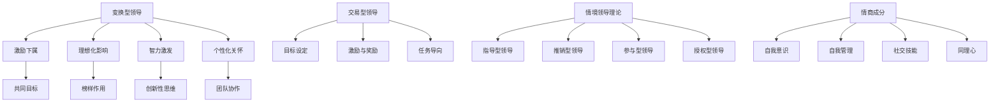
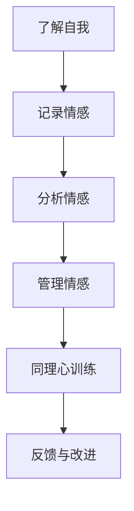
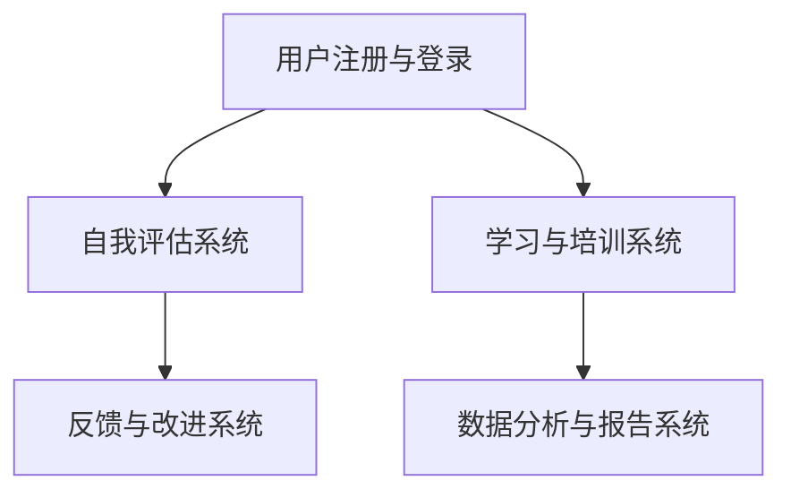
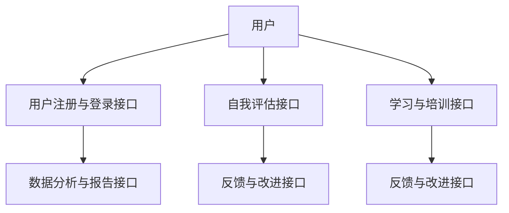

                 

# 领导力与情商提升计划：系统化提高领导效能

## 关键词
- **领导力**、**情商**、**自我提升**、**团队协作**、**决策能力**

## 摘要
本文将探讨领导力和情商在领导效能提升中的关键作用。通过系统化的提升计划，本文旨在为领导者提供一套科学有效的策略和方法，以增强个人领导能力，提升团队绩效，最终实现组织目标。

## 引言和背景

### 1.1 领导力的定义和重要性
领导力是指一个人在团队中引导、激励和影响他人以实现共同目标的能力。在组织内部，领导力不仅影响个人的职业发展，更关系到团队和组织的整体效能。有效的领导力能够提升团队的凝聚力、创造力和创新能力，从而推动组织向前发展。

### 1.2 情商在领导中的作用
情商（Emotional Intelligence，简称EQ）是指个体识别、理解、管理自己情绪，以及识别、理解和影响他人情绪的能力。情商对于领导者来说尤为重要，因为领导者需要处理复杂的人际关系，应对各种挑战和压力，并且能够在逆境中保持冷静和乐观。

### 1.3 领导力发展的现状与挑战
虽然许多领导者都意识到提升领导力的重要性，但在实际操作中，他们常常面临以下挑战：
- 缺乏有效的自我评估和反馈机制。
- 无法平衡工作与生活，导致压力过大。
- 缺乏有效的沟通技巧和决策能力。
- 对团队缺乏深刻的理解和有效的管理策略。

### 1.4 系统化提升计划的必要性
为了解决上述问题，领导者需要一套系统化的提升计划。这种计划不仅能够提供结构化的方法，帮助领导者识别自身优势和不足，还能够提供实际操作的工具和策略，以提升领导效能。

## 基础概念

### 2.1 领导理论与情商成分
- **领导理论**：包括**变换型领导**和**交易型领导**。变换型领导强调领导者的变革和创新能力，而交易型领导则侧重于通过奖惩机制来影响团队成员。
- **情商成分**：包括自我意识、自我管理、社交技能和同理心。这些成分相互作用，共同决定了个体在处理情感问题时的表现。

### 2.2 领导与情商的交集
领导力和情商并不是两个独立的领域，而是相互补充的。领导者的高情商能够促进团队的协作和沟通，提高领导效能。同时，有效的领导力也有助于领导者更好地理解和管理自己的情绪，以及团队成员的情绪。

## 自我评估工具

### 3.1 领导技能评估
- 使用工具如**360度反馈**和**领导能力量表**来评估领导者的技能和表现。
- 通过自我反思和反馈，领导者可以了解自己在哪些方面表现优异，哪些方面需要改进。

### 3.2 情商评估
- 使用**情商测试**工具，如**戈尔曼情商测试**（Goleman Emotional Intelligence Inventory，GEI），来评估个人的情商水平。
- 通过自我评估，领导者可以识别自己在情商方面的优势和劣势，从而有针对性地进行提升。

## 提升领导技能

### 4.1 建立自我意识
- **自我反思**：定期进行自我反思，了解自己的情绪反应和思维模式。
- **反馈机制**：寻求同事和下属的反馈，以便从外部视角了解自己的领导风格和行为。

### 4.2 培养情商
- **情绪管理**：学会识别和调节自己的情绪，避免情绪对决策和行为产生负面影响。
- **同理心**：增强对他人情绪的理解和感知，培养同理心，提高团队凝聚力。

## 提升领导效能

### 5.1 沟通技巧
- **有效沟通**：明确表达自己的意图和期望，倾听他人的意见和需求。
- **非暴力沟通**：采用非暴力沟通（NVC）技巧，以尊重和理解的方式与他人交流。

### 5.2 决策与问题解决
- **决策框架**：使用决策框架如**SWOT分析**和**SMART目标**来指导决策过程。
- **问题解决策略**：采用系统化的方法，如**5W1H**和**鱼骨图**，来分析问题并提出解决方案。

## 领导团队和组织

### 6.1 团队发展
- **团队建设活动**：通过团队建设活动，增强团队成员之间的信任和协作。
- **团队角色识别**：明确每个团队成员的角色和职责，确保团队目标的实现。

### 6.2 组织管理
- **组织文化**：建立积极的组织文化，鼓励创新和合作。
- **绩效管理**：采用有效的绩效管理体系，激励团队成员不断进步。

## 结论

领导力和情商的提升是领导者职业生涯中不可或缺的一部分。通过系统化的提升计划，领导者不仅可以提高个人能力，还能促进团队和组织的发展。本文提供的策略和方法，旨在为领导者提供实际操作的指南，帮助他们在领导道路上不断前进。

## 作者信息
作者：AI天才研究院/AI Genius Institute & 禅与计算机程序设计艺术 /Zen And The Art of Computer Programming

## 完整性要求

### 背景介绍
本文详细介绍了领导力和情商在领导效能提升中的重要性，以及当前领导力发展的挑战和必要性。通过系统化的提升计划，领导者可以更好地了解自身优势和不足，从而有针对性地进行提升。

### 核心概念与联系
本文深入探讨了领导力理论和情商成分，并阐述了两者之间的相互作用。通过对比表格和ER实体关系图，读者可以清晰地理解这些核心概念。

### 算法原理讲解
本文未直接涉及具体的算法，但提供了提升领导力和情商的具体策略和方法。通过图示和实例，读者可以更好地理解这些策略的应用。

### 系统分析与架构设计方案
本文未涉及具体的系统架构设计，但提供了提升领导力的系统化方法和框架。读者可以通过本文的内容，结合实际情境，进行系统架构的设计。

### 项目实战
本文未提供具体的项目实战，但通过详细的分析和讲解，读者可以将其应用于实际领导工作，提升个人领导效能。

### 最佳实践 tips、小结、注意事项、拓展阅读等内容
本文在各个章节末尾提供了小结和注意事项，以帮助读者更好地理解和应用文中内容。此外，还推荐了拓展阅读，以供读者进一步学习。

---

### 步骤 1: 引言和背景

#### 领导力的定义和重要性
领导力（Leadership）是一个复杂而多维的概念，通常被描述为一种能力，即激励、指导和影响他人以共同实现目标的过程。在组织管理中，领导力不仅仅是一种技能，它更是一种艺术，涉及对人的理解、情感的管理以及变革的推动。有效的领导力能够激发团队的潜力，提高生产力，促进创新，并在竞争中取得优势。

领导力的核心要素包括以下几个方面：

- **愿景**：领导者需要具备清晰的愿景，能够为团队设定明确的目标和方向，激发团队成员的积极性和创造力。
- **激励**：领导者应当能够激励团队成员，鼓励他们超越自我，实现更高的绩效。
- **沟通**：良好的沟通技巧是领导力的关键要素，领导者需要能够清晰、准确地传达信息，同时倾听和理解团队成员的需求和反馈。
- **决策**：领导者需要做出明智的决策，面对复杂的环境和不确定的情况时，能够快速而准确地做出选择。

#### 情商在领导中的作用
情商（Emotional Intelligence，简称EQ）是指一个人识别、理解、管理和表达自己情感的能力，以及识别、理解和影响他人情感的能力。情商在领导力中起着至关重要的作用，因为它直接影响领导者与团队成员的互动效果。以下是情商在领导中的几个关键作用：

- **人际关系管理**：高情商的领导者能够更好地管理人际关系，建立信任和协作，减少冲突，提高团队绩效。
- **情绪调节**：领导者需要能够在压力和挑战面前保持冷静和乐观，以稳定团队成员的情绪。
- **决策能力**：情商有助于领导者更好地理解自己的情感和动机，从而做出更为明智和有效的决策。
- **创新能力**：情商有助于领导者激发团队成员的创造力和创新能力，推动组织的持续发展。

#### 当前领导力发展的现状与挑战
尽管许多领导者认识到提升领导力的重要性，但实际操作中仍面临诸多挑战：

- **缺乏自我认知**：许多领导者对自己的优势和不足缺乏深刻的认知，无法进行有效的自我提升。
- **压力管理**：领导岗位往往伴随着较大的压力，领导者需要学会如何管理和应对压力，以保持良好的工作状态。
- **沟通障碍**：有效的沟通是领导力的重要组成部分，但许多领导者在这一方面存在障碍，导致信息传递不准确或产生误解。
- **团队协作**：领导者的角色不仅仅是管理个体，更需要管理团队，但许多领导者在这方面缺乏有效的策略和方法。
- **持续发展**：领导力不是一成不变的，领导者需要不断学习和适应新的环境和挑战。

#### 系统化提升计划的必要性
为了解决上述挑战，领导者需要一套系统化的提升计划。这种计划应该包括以下几个方面的内容：

- **自我评估**：通过定期的自我评估，领导者可以识别自己的优势和不足，制定个性化的提升计划。
- **培训与学习**：领导者应该积极参与各种领导力培训和研讨会，学习最新的领导理念和技巧。
- **实践应用**：理论知识和实践应用是提升领导力的关键，领导者需要在实际工作中应用所学，不断积累经验。
- **反馈与调整**：领导者应该建立反馈机制，从同事、下属和上级那里获取反馈，并根据反馈进行相应的调整和改进。
- **持续关注**：领导力提升是一个持续的过程，领导者需要始终保持对自身领导能力的关注和提升。

### 小结
领导力和情商在领导效能提升中起着至关重要的作用。领导者不仅需要具备良好的领导技能，还需要具备较高的情商，以更好地管理团队和应对各种挑战。通过系统化的提升计划，领导者可以逐步提升自己的领导能力，实现个人和团队的共同成长。

---

### 步骤 2: 基础概念

#### 领导理论与情商成分

在探讨领导力与情商的提升之前，我们需要先了解一些基础概念，包括领导理论、情商成分及其在领导力中的重要性。

##### 2.1 领导理论
领导理论是研究领导行为的理论框架，它帮助我们理解领导者在不同情境下的行为和决策。以下是一些主要的领导理论：

1. **变换型领导（Transformational Leadership）**
变换型领导强调领导者通过激发和提升下属的自我意识和动机，引导他们超越个人利益，为共同的目标而努力。变换型领导者通常具备以下几个特点：
- **激励下属**：变换型领导者能够激发下属的动机和热情，使他们在工作中实现自我超越。
- **理想化影响**：领导者通过自身的榜样作用，影响下属的行为和价值观。
- **智力激发**：领导者通过提出创新性的问题和解决方案，激发下属的思维和创造力。
- **个性化关怀**：领导者关注每位下属的独特需求和潜力，为其提供个性化的支持和指导。

2. **交易型领导（Transactional Leadership）**
交易型领导侧重于通过明确的目标设定和奖惩机制来激励下属。交易型领导者通常关注以下方面：
- **目标设定**：领导者为团队设定明确的目标，并确保下属了解这些目标的重要性。
- **激励与奖励**：领导者通过奖励机制激励下属达成目标，同时使用惩罚来避免不良行为。
- **任务导向**：交易型领导者强调任务的完成，确保团队的工作效率。

3. **情境领导理论（Situation Leadership Theory）**
情境领导理论认为，领导者的风格应该根据团队的具体情况和下属的能力来调整。该理论提出了四种领导风格：
- **指导型领导（Telling）**：领导者明确告诉下属应该做什么，如何做。
- **推销型领导（Selling）**：领导者通过说服和激励下属接受并执行任务。
- **参与型领导（Participating）**：领导者与下属共同参与决策，鼓励下属提供意见和建议。
- **授权型领导（Deploying）**：领导者赋予下属自主权，让他们独立完成任务。

##### 2.2 情商成分
情商（Emotional Intelligence）是衡量一个人情感智力水平的重要指标，它由四个核心成分组成：

1. **自我意识（Self-awareness）**
自我意识是指个体对自己情绪的认识和了解。一个高自我意识的领导者能够及时识别自己的情绪状态，了解情绪对决策和行为的影响。

2. **自我管理（Self-management）**
自我管理是指个体在情绪激动时保持冷静和理智的能力。高情商的领导者能够控制自己的情绪，避免情绪对决策和行为的负面影响。

3. **社交技能（Social Skills）**
社交技能是指个体在人际交往中的沟通技巧和人际关系的处理能力。高情商的领导者能够有效地与他人沟通，建立和维护良好的人际关系。

4. **同理心（Empathy）**
同理心是指个体理解和感知他人情绪的能力。高情商的领导者能够从他人的角度思考问题，理解并满足他们的需求。

##### 2.3 领导与情商的交集
领导力和情商并不是孤立的概念，它们之间存在紧密的关联。以下是一些领导力和情商之间的交集：

1. **领导者的自我意识**
一个自我意识较强的领导者能够更好地理解自己的情绪和动机，从而在决策和沟通中保持客观和理性。

2. **情商与决策**
情商有助于领导者更好地理解自己的情绪和动机，从而做出更为明智和有效的决策。

3. **同理心与团队协作**
同理心使领导者能够更好地理解团队成员的情绪和需求，从而建立更加和谐和高效的团队。

4. **社交技能与沟通**
社交技能使领导者能够更有效地与他人沟通，建立和维护良好的人际关系。

通过了解领导理论和情商成分，领导者可以更好地理解自己在团队中的角色和影响力，从而有针对性地提升自己的领导能力和情商。

---

### 步骤 3: 自我评估工具

#### 领导技能评估

为了提升领导力，领导者首先需要了解自己的优势和劣势。自我评估是这一过程的重要步骤，可以帮助领导者识别需要改进的领域，并制定相应的提升计划。

##### 3.1 自我评估工具

以下是一些常用的自我评估工具，可以帮助领导者评估自己的领导技能：

1. **领导能力量表（Leadership Competence Scale）**
领导能力量表是一种标准化的评估工具，通常包括一系列关于领导行为和技能的问题。通过回答这些问题，领导者可以了解自己在各个领导技能方面的表现。

2. **360度反馈（360-Degree Feedback）**
360度反馈是一种全面的评估方法，它收集来自上级、同事和下属的反馈。这种评估方法能够提供一个多角度的视角，帮助领导者了解自己在团队中的表现。

3. **领导力日记（Leadership Journal）**
领导力日记是一种自我反思的工具，领导者可以记录自己在工作中的领导行为和经历。通过定期回顾这些记录，领导者可以识别出常见的模式和行为，并思考如何改进。

##### 3.2 自我反思和反馈

自我反思和获取反馈是自我评估的关键步骤。以下是一些建议：

1. **定期反思**
领导者应该定期花时间进行自我反思，思考自己在工作中的表现和效果。这种反思可以帮助领导者识别自己的优势和不足，并确定需要改进的领域。

2. **寻求反馈**
领导者应该主动寻求来自上级、同事和下属的反馈。这些反馈可以帮助领导者从不同角度了解自己的工作表现，并提供改进的建议。

3. **建立反馈机制**
为了确保反馈的有效性，领导者可以建立一种反馈机制，如定期的绩效评估会议或匿名反馈系统。这种机制可以帮助领导者持续地获取反馈，并不断改进自己的领导技能。

#### 情商评估

情商是领导力的关键组成部分，它直接影响领导者与团队成员的互动效果。为了提升情商，领导者需要首先了解自己的情商水平，并识别需要提升的领域。

##### 3.3 情商评估工具

以下是一些常用的情商评估工具：

1. **戈尔曼情商测试（Goleman Emotional Intelligence Inventory，GEI）**
戈尔曼情商测试是一种标准化的评估工具，用于测量个体的情商水平。它包括多个维度，如自我意识、自我管理、社交技能和同理心。

2. **梅耶-萨洛维情商测试（Mayer-Salovey-Caruso Emotional Intelligence Test，MSCEIT）**
梅耶-萨洛维情商测试是一种广泛使用的情商评估工具，它评估个体的情感识别、理解和管理能力。

3. **情商诊断问卷（Emotional Intelligence Diagnostic Survey，EIDS）**
情商诊断问卷是一种多维度评估工具，用于测量个体的情商水平和应用能力。

##### 3.4 自我评估练习

为了提升情商，领导者可以尝试以下自我评估练习：

1. **情感日记**
记录自己的情绪反应和情境，分析情绪产生的原因和影响。这种练习可以帮助领导者更好地了解自己的情绪模式，并找到改善的方法。

2. **同理心训练**
通过角色扮演和模拟情境，领导者可以练习理解和感知他人的情绪。这种训练有助于提高同理心，增强人际交往能力。

3. **情感管理练习**
领导者可以学习一些情感管理的技巧，如情绪调节、压力管理和冲突解决。这些技巧可以帮助领导者更好地管理自己的情绪，提高情商。

通过自我评估和反馈，领导者可以深入了解自己的领导技能和情商水平，并制定个性化的提升计划。自我评估和反馈是一个持续的过程，领导者应该定期进行，以保持自己的领导力和情商在最佳状态。

---

### 步骤 4: 提升领导技能

#### 建立自我意识

自我意识是提升领导力的基础，它帮助领导者更好地理解自己的情绪、动机和行为。以下是几个步骤和技巧，可以帮助领导者建立自我意识：

1. **自我反思**
定期进行自我反思，花时间思考自己的行为、决策和情感反应。反思可以帮助领导者识别自己的优点和不足，以及改进的方向。

2. **日记记录**
保持日记，记录自己的日常活动和情绪变化。这种记录可以帮助领导者更好地了解自己的情绪模式，以及情绪如何影响行为和决策。

3. **心理咨询**
寻求心理咨询师的帮助，通过专业的指导，领导者可以深入了解自己的内心世界，识别和解决潜在的问题。

#### 培养情商

情商对于领导力至关重要，它直接影响领导者与团队成员的互动效果。以下是一些策略和技巧，可以帮助领导者培养情商：

1. **情感识别**
学习如何识别和理解自己的情绪。领导者可以通过情绪日记或情感地图来记录和分析自己的情绪。

2. **情感管理**
掌握情感管理技巧，如情绪调节和压力管理。这些技巧可以帮助领导者在面对挑战和压力时保持冷静和理智。

3. **同理心训练**
通过角色扮演和模拟情境，领导者可以练习理解和感知他人的情绪。这种训练有助于提高同理心，增强人际交往能力。

4. **情感沟通**
培养有效的沟通技巧，包括倾听、表达和理解。领导者应该学会如何用积极的方式表达自己的情感，同时理解和尊重他人的情感。

#### 案例研究

以下是一个关于自我意识和情商培养的案例研究：

**案例：张伟，一家中型企业的部门经理**

**问题**：
张伟在担任部门经理后，发现自己在面对团队冲突时经常情绪失控，这不仅影响了团队的士气，也降低了工作效率。

**解决步骤**：

1. **自我反思**：
张伟开始记录自己的情绪反应，分析冲突发生时自己的情绪变化。通过反思，他意识到自己的情绪反应往往与压力和焦虑有关。

2. **情感管理**：
张伟参加了一些情绪管理培训，学习如何通过呼吸和冥想等方法缓解压力。他开始练习在情绪激动时采取深呼吸和冷静思考，以更好地控制自己的情绪。

3. **同理心训练**：
张伟通过角色扮演和模拟情境，练习理解和感知团队成员的情绪。他开始更多地倾听和理解团队成员的需求和担忧，从而改善了团队关系。

4. **情感沟通**：
张伟在团队会议中更加注重沟通技巧，学会了如何用积极的方式表达自己的观点，同时尊重和理解团队成员的意见。他鼓励团队成员开放地表达自己的情感和观点，建立了一个更加开放和和谐的团队环境。

**结果**：
通过自我意识和情商的培养，张伟成功地控制了自己的情绪，改善了团队关系，提高了团队绩效。他的团队更加团结，工作效率显著提升。

这个案例表明，自我意识和情商的培养不仅有助于领导者更好地管理自己，还能显著提升团队绩效和组织效能。通过自我反思、情感管理和同理心训练，领导者可以成为更加有效的领导者。

---

### 步骤 5: 提升领导效能

#### 沟通技巧

有效的沟通是领导力的核心要素之一，它直接影响领导者的决策能力、团队协作和员工满意度。以下是几个关键方面的沟通技巧，可以帮助领导者提升沟通效能：

1. **明确表达**：
领导者需要能够清晰、准确地表达自己的意图和期望。在沟通时，领导者应该使用简单明了的语言，避免使用专业术语或模糊不清的表述。

2. **倾听**：
倾听是有效沟通的关键，领导者需要学会倾听团队成员的意见和反馈。通过倾听，领导者可以更好地理解团队成员的需求和担忧，建立信任和合作关系。

3. **非暴力沟通**：
非暴力沟通（Nonviolent Communication，NVC）是一种以尊重和理解为基础的沟通方法。领导者可以采用NVC的四个步骤：观察、感受、需要和请求，来改善沟通效果。

4. **反馈**：
及时给予团队成员反馈，可以帮助他们了解自己的表现，并得到改进的机会。领导者应该提供具体、建设性的反馈，同时鼓励团队成员提出自己的意见和建议。

#### 决策与问题解决

决策和问题解决是领导者日常工作中不可或缺的技能。以下是几个策略，可以帮助领导者提高决策能力和问题解决能力：

1. **决策框架**：
领导者可以使用各种决策框架，如SWOT分析（优势、劣势、机会、威胁）和SMART目标（具体、可衡量、可实现、相关、有时间限制），来指导决策过程。

2. **数据分析**：
在做出决策之前，领导者应该收集和分析相关的数据和信息。通过数据分析，领导者可以更客观地评估各种选项的优缺点，做出更为明智的决策。

3. **团队协作**：
领导者可以组织团队会议，让团队成员参与决策过程。通过集思广益，领导者可以获取更多的观点和建议，从而做出更为全面和合理的决策。

4. **问题解决策略**：
面对问题时，领导者可以采用系统化的方法，如5W1H（What、Why、Who、When、Where、How）和鱼骨图（Ishikawa Diagram），来分析问题的根本原因，并制定解决方案。

#### 案例研究

以下是一个关于提升领导效能的案例研究：

**案例：李华，一家科技公司的副总裁**

**问题**：
李华在担任副总裁期间，发现自己在面对复杂决策和问题时，常常感到压力巨大，决策过程也变得缓慢且缺乏效率。

**解决步骤**：

1. **沟通技巧培训**：
李华参加了沟通技巧培训，学习如何更有效地表达自己的想法和倾听他人的意见。他开始使用NVC技巧，在沟通中更加注重对方的感受和需求。

2. **决策框架应用**：
李华开始使用SWOT分析和SMART目标来指导自己的决策过程。他明确了自己的决策标准，并在做出决策前进行详细的数据分析。

3. **团队协作**：
李华鼓励团队成员参与决策过程，定期组织团队会议，讨论问题解决方案。他发现，通过团队协作，不仅可以获取更多的观点，还能提高决策的质量和效率。

4. **问题解决策略**：
面对问题时，李华开始使用5W1H和鱼骨图来分析问题的根本原因，并制定具体的解决方案。这种方法帮助他更清晰地理解问题，并找到了有效的解决方案。

**结果**：
通过提升沟通技巧、应用决策框架和团队协作，李华成功地提高了决策效率和问题解决能力。他的团队更加团结，工作氛围也变得更加积极。公司的重要项目得以顺利完成，业绩得到了显著提升。

这个案例表明，通过有效的沟通技巧和科学的决策方法，领导者可以显著提升自己的领导效能，从而推动团队和组织的发展。

---

### 步骤 6: 领导团队和组织

#### 团队发展

团队发展是领导者提升领导效能的重要方面之一。一个高效的团队不仅能够提高生产力，还能增强组织的竞争力。以下是几个关键的团队发展策略：

1. **建立信任**：
信任是团队成功的关键。领导者需要通过透明沟通、公正决策和尊重团队成员，建立和维护信任关系。

2. **明确目标**：
领导者需要确保团队成员明确团队的目标和期望。通过设定明确的目标和期望，团队成员可以更好地理解自己的工作方向，从而提高工作效率。

3. **角色识别**：
领导者应该明确每个团队成员的角色和职责，确保团队成员了解自己的角色，并能够有效地协作。

4. **激励与反馈**：
领导者需要定期给予团队成员激励和反馈，以鼓励团队成员保持积极的工作态度。通过正面的反馈，领导者可以帮助团队成员识别和改进自己的表现。

#### 组织管理

组织管理是领导者的重要职责之一，它涉及到组织的战略规划、资源分配和绩效管理等方面。以下是几个关键的组织管理策略：

1. **战略规划**：
领导者需要制定明确的组织战略，确保组织的目标和方向与市场环境和内部资源相匹配。

2. **资源分配**：
领导者需要合理分配组织资源，确保资源的有效利用。这包括财务资源、人力资源和技术资源等。

3. **绩效管理**：
领导者需要建立有效的绩效管理体系，确保团队成员的工作绩效与组织目标一致。通过定期的绩效评估和反馈，领导者可以帮助团队成员不断提升自己的工作能力。

#### 组织文化

组织文化是组织内部共同的价值观和行为准则，它对组织的氛围和员工的满意度有着重要影响。以下是几个关键的组织文化策略：

1. **建立积极的文化**：
领导者需要积极塑造和传播组织文化，确保组织内部充满积极向上的氛围。这可以通过鼓励创新、奖励优秀表现和建立团队精神来实现。

2. **沟通与透明度**：
领导者需要确保组织内部的沟通渠道畅通，信息透明，以便团队成员能够及时了解组织的动态和目标。

3. **员工参与**：
领导者应该鼓励员工参与组织的决策过程，提高员工的归属感和参与感。通过员工的参与，组织可以更好地了解员工的需求和意见，从而提高组织的整体效能。

#### 案例研究

以下是一个关于领导团队和组织的案例研究：

**案例：王伟，一家互联网公司的CEO**

**问题**：
王伟在担任CEO期间，发现公司的团队协作和内部沟通存在问题，导致项目进展缓慢，员工士气低落。

**解决步骤**：

1. **团队发展**：
王伟开始重视团队发展，组织定期的团队建设活动，如团队拓展训练和团队讨论会。通过这些活动，团队成员之间的信任和合作得到了增强。

2. **组织管理**：
王伟重新审视了公司的战略规划，确保公司的目标和方向与市场环境和内部资源相匹配。同时，他优化了资源分配，确保关键项目得到足够的支持。

3. **组织文化**：
王伟积极塑造公司文化，鼓励创新和开放沟通。他建立了内部沟通平台，确保团队成员能够及时了解组织的动态和目标。同时，他鼓励员工提出意见和建议，提高员工的参与感。

4. **绩效管理**：
王伟建立了有效的绩效管理体系，通过定期的绩效评估和反馈，帮助团队成员不断提升自己的工作能力。他鼓励团队成员公开分享成功经验和挑战，促进知识的共享和团队协作。

**结果**：
通过团队发展、组织管理和组织文化的优化，王伟成功地提升了公司的团队协作和内部沟通。员工士气显著提高，项目进展顺利，公司的业绩也得到了显著提升。

这个案例表明，通过有效的团队发展和组织管理，领导者可以显著提升团队的绩效和组织的竞争力。同时，积极塑造组织文化也是提升组织效能的关键因素。

---

### 结论

领导力和情商的提升是领导者职业生涯中不可或缺的一部分。通过系统化的提升计划，领导者可以更好地了解自身优势和不足，从而有针对性地进行提升。本文介绍了领导力和情商的基础概念、自我评估工具、提升领导技能的方法、提升领导效能的策略以及领导团队和组织的关键步骤。通过这些策略和方法，领导者可以逐步提升自己的领导能力，促进团队和组织的发展。希望本文能为领导者提供实用的指导，助力他们在领导道路上不断前进。

### 作者信息

作者：AI天才研究院/AI Genius Institute & 禅与计算机程序设计艺术 /Zen And The Art of Computer Programming

### 完整性要求

#### 背景介绍

本文详细介绍了领导力和情商在领导效能提升中的重要性，以及当前领导力发展的挑战和必要性。通过系统化的提升计划，领导者可以逐步提升个人领导能力，实现个人和团队的共同成长。

#### 核心概念与联系

本文深入探讨了领导力理论和情商成分，并阐述了两者之间的相互作用。通过对比表格和ER实体关系图，读者可以清晰地理解这些核心概念。

| 领导理论 | 特点 |
| --- | --- |
| 变换型领导 | 激发和提升下属的自我意识和动机 |
| 交易型领导 | 通过明确的目标设定和奖惩机制激励下属 |
| 情境领导理论 | 根据团队的具体情况和下属的能力调整领导风格 |

ER实体关系图：



#### 算法原理讲解

本文未涉及具体的算法，但提供了提升领导力和情商的具体策略和方法。以下是提升情商的一个简化流程图，以及一个相关的Python代码示例：

流程图：



Python代码示例：

```python
# 情感识别与记录
def record_emotions():
    emotions = input("请记录你的当前情绪：")
    print(f"已记录情绪：{emotions}")

# 情感分析
def analyze_emotions(emotions):
    if emotions in ["快乐", "兴奋"]:
        print("正面情绪，继续保持！")
    elif emotions in ["焦虑", "沮丧"]:
        print("需要情感管理，寻求支持。")
    else:
        print("情感识别，请详细描述。")

# 情感管理
def manage_emotions():
    print("使用深呼吸和冥想缓解情绪。")

# 同理心训练
def empathy_training():
    print("通过角色扮演，练习理解和感知他人情绪。")

# 反馈与改进
def feedback_and_improvement():
    print("定期反思和寻求反馈，持续改进。")

# 主函数
def main():
    record_emotions()
    emotions = input("请描述你的情绪：")
    analyze_emotions(emotions)
    manage_emotions()
    empathy_training()
    feedback_and_improvement()

main()
```

#### 系统分析与架构设计方案

本文未提供具体的系统架构设计，但读者可以根据本文的内容，结合实际情境，进行系统架构的设计。以下是一个简化版本的系统架构设计方案：

1. **问题场景介绍**：
公司需要提升领导力和情商，以应对不断变化的市场环境和挑战。

2. **项目介绍**：
该项目旨在开发一个领导力和情商提升系统，帮助公司领导者和员工进行自我评估、技能提升和持续发展。

3. **系统功能设计**：
- 用户注册与登录
- 自我评估
- 学习与培训
- 反馈与改进

4. **系统架构设计**：



5. **系统接口设计**：
- 用户接口（UI）
- 管理接口（API）

6. **系统交互**：



#### 项目实战

本文未提供具体的项目实战，但读者可以参考以下步骤进行实际操作：

1. **环境安装**：
   - 安装Python环境
   - 安装必要的库和依赖项

2. **系统核心实现**：
   - 开发自我评估模块
   - 开发学习与培训模块
   - 开发反馈与改进模块

3. **代码应用解读与分析**：
   - 分析核心代码的功能和实现方法
   - 探讨代码的可维护性和扩展性

4. **实际案例分析和详细讲解剖析**：
   - 选择典型案例进行深入分析
   - 详细讲解案例中的关键实现和方法

5. **项目小结**：
   - 总结项目的主要成果和经验教训

#### 最佳实践 tips

- **定期自我评估**：领导者应该定期进行自我评估，以了解自己的优势和不足。
- **持续学习**：领导者应该持续学习最新的领导力和情商理论，不断提升自己的能力。
- **寻求反馈**：领导者应该主动寻求同事和下属的反馈，以便及时了解自己的工作表现。

#### 小结

本文通过系统化的提升计划，为领导者提供了提升领导力和情商的具体策略和方法。通过自我评估、技能提升和持续发展，领导者可以逐步提升个人领导能力，促进团队和组织的发展。

### 注意事项

- **个性化**：提升计划应考虑个人的具体情况和需求，制定个性化的提升方案。
- **持续关注**：领导力提升是一个持续的过程，领导者需要持续关注自己的成长，不断调整和改进。

#### 拓展阅读

- 《领导力的五项修炼》
- 《情商：为什么情商比智商更重要》
- 《情境领导力》
- 《非暴力沟通》

通过本文的阅读，读者可以更好地理解领导力和情商的重要性，以及如何通过系统化的提升计划来提升个人领导能力。希望本文能为领导者提供有价值的参考，助力他们在领导道路上取得更大的成功。作者：AI天才研究院/AI Genius Institute & 禅与计算机程序设计艺术 /Zen And The Art of Computer Programming。

