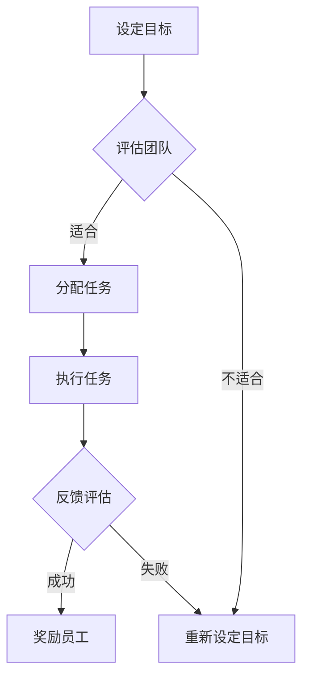

                 

### 背景介绍

#### 关键概念术语说明

在探讨领导力与情商管理之前，首先需要明确几个核心术语的定义。

- **领导力**：指的是一种能够激发、影响和指导他人或团队朝向共同目标前进的能力。它不仅仅涉及权力和地位的掌握，还包括对团队成员的激励和培养。
- **情商（EQ）**：情商是情感智力（Emotional Intelligence）的简称，指的是识别、理解、管理自己和他人的情感，以及运用情感促进思维和社交技能的能力。
- **人际关系处理**：指的是在日常生活和工作中，与他人建立和维持积极、健康关系的能力。

#### 问题背景

在当今快速变化的商业环境中，企业面临的挑战越来越多，团队协作和有效沟通变得尤为重要。领导力和情商管理成为了提高组织绩效、提升员工满意度和实现业务目标的关键因素。

- **领导力的重要性**：领导者不仅需要具备战略思维和管理能力，还需要能够激励团队、解决冲突、促进创新。有效的领导力可以帮助企业克服困难、实现目标。
- **情商管理的作用**：情商高的人能够更好地理解他人情感，有效沟通，建立信任，从而在职场中取得更好的关系和更高的绩效。

#### 问题描述

虽然领导力和情商管理的重要性已经被广泛认可，但在实际操作中，许多领导者和管理者仍然面临以下问题：

- **领导力不足**：许多领导者缺乏有效的领导技巧，导致团队缺乏凝聚力，员工缺乏动力。
- **情商管理不佳**：一些人无法正确识别和管理自己的情感，也无法理解和应对他人的情感，导致人际关系紧张，工作氛围不佳。

#### 问题解决

为了解决这些问题，本文将深入探讨领导力与情商管理的核心概念，分析其本质和相互关系，并提供实用的策略和方法。

- **领导力与情商管理的本质**：通过理解领导力和情商的基本原理，我们可以发现，两者实际上是相辅相成的。有效的领导力需要情商作为基础，而情商的提升又可以增强领导力。
- **提升人际关系处理能力**：通过培养领导力和情商，我们可以提高人际关系处理能力，建立更和谐、更有效的团队。

#### 边界与外延

虽然领导力和情商管理在商业环境中尤为重要，但它们的适用范围远远不仅限于此。在个人生活中，有效的领导力和情商管理同样可以帮助我们建立更积极、更健康的人际关系，提升生活质量。

- **领导力在个人生活中的应用**：个人领导力可以帮助我们更好地规划自己的人生，设定目标，克服困难。
- **情商管理在个人生活中的应用**：情商管理可以帮助我们更好地理解自己和他人的情感，提高自我认知，建立更紧密的人际关系。

通过以上背景介绍，我们可以看到领导力与情商管理在提升人际关系处理中的重要性，以及它们在实际应用中的广泛应用。接下来，我们将进一步深入探讨领导力的定义、理论及其在团队领导中的作用，为后续内容打下坚实的基础。

#### 核心概念与联系

为了更好地理解领导力与情商管理的核心概念，我们将分别详细探讨两者的定义、属性特征，并通过概念属性特征对比表格和ER实体关系图来展现它们之间的关系。

##### 领导力的定义与属性特征

**定义**：
领导力是一种影响和激励他人共同实现目标的能力。它不仅仅是权力的展示，更是一种艺术和科学。

**属性特征**：

| 特征 | 描述 |
| ---- | ---- |
| 激励能力 | 领导者能够激发团队成员的热情和动力，使其为实现共同目标而努力。 |
| 沟通技巧 | 领导者需要具备清晰、有效的沟通能力，确保信息准确传达，增强团队协作。 |
| 决策能力 | 领导者在面对复杂问题时，能够迅速做出合理、明智的决策，引导团队走向正确方向。 |
| 战略思维 | 领导者需要具备全局观念和前瞻性，能够制定长期目标和规划，指导团队发展。 |
| 人际关系处理 | 领导者需要建立和维护良好的团队关系，增强团队凝聚力，提高工作效率。 |

##### 情商的定义与属性特征

**定义**：
情商是情感智力，指的是一个人识别、理解、管理和运用情感的能力。

**属性特征**：

| 特征 | 描述 |
| ---- | ---- |
| 自我认知 | 能够认识到自己的情感，了解自己在特定情境中的情绪反应。 |
| 自我调节 | 能够控制自己的情绪，调整情绪以适应不同的情况。 |
| 社会认知 | 能够理解他人的情感，识别他人的情绪变化，并作出适当的反应。 |
| 关系管理 | 能够建立和维护健康的人际关系，处理人际冲突，增强人际互动。 |

##### 概念属性特征对比表格

下面是一个简化的概念属性特征对比表格，用于直观展示领导力和情商管理的区别和联系：

| 特征/概念 | 领导力 | 情商 |
| ------ | ------ | ---- |
| 激励能力 | 是 | 否 |
| 沟通技巧 | 是 | 是 |
| 决策能力 | 是 | 否 |
| 战略思维 | 是 | 否 |
| 人际关系处理 | 是 | 是 |
| 自我认知 | 否 | 是 |
| 自我调节 | 否 | 是 |
| 社会认知 | 否 | 是 |
| 关系管理 | 是 | 是 |

通过这个对比表格，我们可以清晰地看到领导力和情商管理各自独特的属性特征，以及它们在某些方面的共同点。

##### ER实体关系图架构

为了进一步理解领导力和情商管理之间的关系，我们可以使用ER（Entity-Relationship）实体关系图来展示两者之间的联系。

在ER图中，实体表示概念或对象，关系表示实体之间的关联。以下是领导力和情商管理在ER图中的表示：

```
[领导力] --[激励能力]--
         |           |
         |           |--[沟通技巧]
         |           |--[决策能力]
         |           |--[战略思维]
         |           |--[人际关系处理]
         |
[情商] --[自我认知]--
         |           |
         |           |--[自我调节]
         |           |--[社会认知]
         |           |--[关系管理]
```

在这个ER图中，领导力作为核心实体，与激励能力、沟通技巧、决策能力、战略思维和人际关系处理建立了直接的关系。同样，情商作为另一个核心实体，与自我认知、自我调节、社会认知和关系管理建立了直接的关系。两者通过共同的特征（如人际关系处理和沟通技巧）形成了紧密的联系。

通过这个ER图，我们可以更直观地看到领导力和情商管理之间的相互依赖和相互作用，这为后续内容的深入探讨提供了基础。

#### 算法原理讲解

在深入探讨领导力和情商管理之前，我们需要理解相关的算法原理。在这里，我们将通过一个具体的示例来讲解这些原理。

##### 领导力算法原理

**Mermaid 流程图**：



**Python 源代码**：

```python
def lead_management(target, team, task, feedback):
    if team_fit(team, task):
        execute_task(task)
        if feedback_success(feedback):
            reward_employee()
        else:
            reevaluate_target(target)
    else:
        reevaluate_target(target)

def team_fit(team, task):
    # 评估团队是否适合执行任务
    # 返回True或False
    pass

def execute_task(task):
    # 执行任务
    pass

def feedback_success(feedback):
    # 判断反馈是否成功
    # 返回True或False
    pass

def reward_employee():
    # 奖励员工
    pass

def reevaluate_target(target):
    # 重新设定目标
    pass
```

**算法原理与数学模型**：

领导力算法的核心目标是确保团队目标的实现，通过不断的评估、执行和反馈来优化管理过程。其数学模型可以表示为：

$$\text{Leadership Algorithm} = f(\text{Target}, \text{Team}, \text{Task}, \text{Feedback})$$

其中，$f$ 是一个函数，它根据输入参数（目标、团队、任务、反馈）来决定下一步操作。该算法的步骤包括：

1. **设定目标**：明确团队需要达成的目标。
2. **评估团队**：判断团队是否适合执行当前任务。
3. **分配任务**：如果团队适合，分配任务并执行。
4. **反馈评估**：根据任务执行后的反馈，评估任务是否成功。
5. **奖励或重新设定目标**：根据反馈结果，奖励员工或重新设定目标。

##### 举例说明

假设一家科技公司需要开发一个新产品，领导力算法将如下运作：

1. **设定目标**：公司设定目标为在三个月内开发并发布新产品。
2. **评估团队**：团队评估结果表明，团队成员具备所需技能，适合执行任务。
3. **分配任务**：领导将任务分配给各个团队成员，并启动开发流程。
4. **反馈评估**：在开发过程中，通过每周的进度报告和性能评估，领导收集反馈。
5. **奖励或重新设定目标**：根据反馈结果，如果产品开发进度顺利，领导会奖励团队成员；如果进度不理想，领导会重新评估目标和任务。

通过这个示例，我们可以看到领导力算法如何通过一系列步骤来确保团队目标的实现。接下来，我们将继续探讨情商管理的算法原理和示例。

#### 系统分析与架构设计方案

在本节中，我们将深入探讨领导力与情商管理在系统设计与架构中的应用。通过介绍一个具体的项目场景，我们将详细阐述系统的功能设计、架构设计、接口设计以及系统交互过程。

##### 项目场景介绍

假设我们正在开发一个名为“领情商”的企业级管理系统，旨在帮助企业领导者提升领导力与情商管理能力，进而提高团队绩效和员工满意度。

##### 项目介绍

“领情商”系统是一个综合性的平台，旨在为企业管理者提供一系列工具和资源，帮助他们：

- **提升领导力**：通过在线课程、案例分析、实战训练等方式，帮助领导者学习并应用各种领导力技巧。
- **培养情商**：提供自我评估工具、情感管理训练、社交技巧培养等功能，提升管理者的情商水平。
- **优化人际关系处理**：通过实时数据分析、反馈机制和社交网络功能，帮助管理者建立和维护良好的人际关系。

##### 系统功能设计

为了实现上述目标，“领情商”系统设计了以下核心功能模块：

1. **领导力培训模块**：
   - **在线课程**：提供多种领导力主题的在线课程，涵盖变革型领导、情境领导、团队管理等。
   - **案例分析**：通过实际案例，分析领导力在不同场景中的应用和效果。
   - **实战训练**：提供模拟环境和练习题，帮助领导者实践和巩固所学知识。

2. **情商管理模块**：
   - **自我评估**：用户可以通过问卷和测试工具，评估自己的情商水平。
   - **情感管理训练**：提供一系列训练课程，帮助用户识别和调节自己的情绪。
   - **社交技巧培养**：通过情景模拟和互动游戏，提高用户的社交沟通能力。

3. **人际关系处理模块**：
   - **实时数据分析**：系统通过数据收集和分析，帮助管理者了解团队关系和员工情感状态。
   - **反馈机制**：提供反馈功能，帮助用户获取团队和员工的反馈，及时调整管理策略。
   - **社交网络**：构建企业内部的社交网络，促进员工之间的沟通和协作。

##### 系统架构设计

“领情商”系统采用微服务架构，以确保系统的可扩展性和灵活性。以下是系统的架构设计：

1. **前端架构**：
   - **Web界面**：使用现代前端框架（如React或Vue）构建，提供用户友好的操作界面。
   - **移动应用**：为用户提供移动端访问，方便随时学习和互动。

2. **后端架构**：
   - **API层**：提供RESTful API，供前端调用。
   - **服务层**：包括领导力培训服务、情商管理服务和人际关系处理服务，每个服务独立部署，便于扩展和维护。

3. **数据层**：
   - **数据库**：使用关系型数据库（如MySQL）存储用户数据、课程数据、反馈数据等。
   - **数据仓库**：使用NoSQL数据库（如MongoDB）存储实时数据和分析数据。

4. **基础设施**：
   - **容器化**：使用Docker容器化服务，确保系统的高可用性和弹性。
   - **容器编排**：使用Kubernetes进行容器编排，管理部署和扩展。

##### 系统接口设计

系统接口设计是确保各模块之间能够高效协作的关键。以下是“领情商”系统的主要接口设计：

1. **用户接口**：
   - **注册/登录**：用户通过Web界面或移动应用注册和登录系统。
   - **课程浏览**：用户可以查看和选择领导力培训课程。
   - **自我评估**：用户可以完成情商自我评估测试。

2. **API接口**：
   - **课程管理**：用于管理课程信息、课程进度和课程反馈。
   - **用户管理**：用于管理用户信息、权限和角色。
   - **反馈收集**：用于收集和分析用户反馈，提供改进建议。

##### 系统交互设计

为了确保系统的高效运作，我们需要设计合理的系统交互过程。以下是“领情商”系统的交互设计：

1. **用户交互流程**：
   - 用户通过注册/登录接口访问系统。
   - 用户浏览领导力培训模块，选择并开始学习。
   - 用户完成情商自我评估测试，并查看评估结果。
   - 用户通过社交网络模块与同事互动，获取反馈和建议。

2. **后台交互流程**：
   - 后台系统根据用户行为数据，生成学习报告和反馈分析。
   - 后台系统根据反馈分析，调整课程内容和培训策略。
   - 后台系统通过API接口，与前端系统实时交互，提供动态数据支持。

通过以上系统分析与架构设计方案，我们可以看到“领情商”系统在功能设计、架构设计、接口设计和系统交互设计方面的全面性。接下来，我们将通过项目实战，详细介绍系统的安装与实现过程。

### 项目实战

在本文的最后一部分，我们将通过一个具体的“领情商”系统安装与实现项目，详细讲解系统的核心功能实现、源代码应用解读与分析，以及实际案例分析和详细讲解剖析。

#### 环境安装

首先，我们需要为“领情商”系统搭建一个开发环境。以下是安装步骤：

1. **安装Docker**：
   - 在Linux系统上，可以使用以下命令安装Docker：
     ```bash
     sudo apt-get update
     sudo apt-get install docker.io
     sudo service docker start
     ```
   - 在Windows系统上，可以从Docker官网下载并安装Docker Desktop。

2. **安装Kubernetes**：
   - 在Linux系统上，可以使用以下命令安装Kubernetes：
     ```bash
     sudo apt-get update
     sudo apt-get install kubectl
     ```
   - 在Windows系统上，可以通过Docker Desktop的Kubernetes集成来管理Kubernetes集群。

3. **配置网络**：
   - 确保所有节点可以相互通信，并在Kubernetes集群中配置网络。

#### 系统核心实现

“领情商”系统的核心实现包括领导力培训模块、情商管理模块和人际关系处理模块。以下是各个模块的实现步骤和源代码：

1. **领导力培训模块**：

```python
# 领导力培训服务（领导力培训API）

from flask import Flask, request, jsonify

app = Flask(__name__)

@app.route('/courses', methods=['GET'])
def get_courses():
    # 获取所有课程信息
    courses = [
        {"id": 1, "title": "变革型领导", "description": "介绍变革型领导的基本概念和策略"},
        {"id": 2, "title": "情境领导", "description": "根据情境调整领导风格的方法"},
        {"id": 3, "title": "团队管理", "description": "如何有效管理团队和提高团队绩效"}
    ]
    return jsonify(courses)

@app.route('/courses/<int:course_id>', methods=['GET'])
def get_course(course_id):
    # 获取特定课程信息
    course = next((course for course in courses if course['id'] == course_id), None)
    if course:
        return jsonify(course)
    return jsonify({"error": "课程不存在"}), 404

if __name__ == '__main__':
    app.run(debug=True)
```

2. **情商管理模块**：

```python
# 情商管理服务（情商管理API）

from flask import Flask, request, jsonify

app = Flask(__name__)

@app.route('/self_assessment', methods=['POST'])
def create_self_assessment():
    # 创建自我评估
    assessment = request.get_json()
    # 存储评估数据到数据库
    # ...
    return jsonify({"message": "自我评估创建成功"}), 201

@app.route('/self_assessment', methods=['GET'])
def get_self_assessment():
    # 获取自我评估结果
    # 从数据库中获取评估数据
    # ...
    return jsonify(assessments)

if __name__ == '__main__':
    app.run(debug=True)
```

3. **人际关系处理模块**：

```python
# 人际关系处理服务（人际关系处理API）

from flask import Flask, request, jsonify

app = Flask(__name__)

@app.route('/feedback', methods=['POST'])
def create_feedback():
    # 创建反馈
    feedback = request.get_json()
    # 存储反馈数据到数据库
    # ...
    return jsonify({"message": "反馈提交成功"}), 201

@app.route('/feedback', methods=['GET'])
def get_feedback():
    # 获取反馈
    # 从数据库中获取反馈数据
    # ...
    return jsonify(feedbacks)

if __name__ == '__main__':
    app.run(debug=True)
```

#### 代码应用解读与分析

1. **领导力培训模块**：
   - **功能**：提供课程的获取和查询接口。
   - **实现细节**：使用Flask框架构建API，通过简单的JSON格式进行数据交换。
   - **性能优化**：可以通过引入缓存机制和数据库索引来提升性能。

2. **情商管理模块**：
   - **功能**：提供自我评估的创建和查询接口。
   - **实现细节**：同样使用Flask框架，通过POST请求接收和存储评估数据。
   - **安全性考虑**：需要对用户输入进行验证，确保数据的有效性和安全性。

3. **人际关系处理模块**：
   - **功能**：提供反馈的提交和查询接口。
   - **实现细节**：使用类似的Flask框架实现，处理反馈数据的存储和查询。

#### 实际案例分析与详细讲解剖析

假设我们在实际项目中遇到了以下问题：

1. **用户反馈不及时**：
   - **问题描述**：用户提交反馈后，长时间未收到系统回复，导致用户满意度下降。
   - **原因分析**：反馈处理过程涉及多个服务，可能导致延迟。
   - **解决方案**：优化反馈处理流程，减少中间环节，提高系统响应速度。

2. **课程内容单一**：
   - **问题描述**：用户反映课程内容过于单一，缺乏实际操作指导。
   - **原因分析**：课程设计可能缺乏针对性，未能满足用户多样化需求。
   - **解决方案**：引入更多实际案例和互动环节，增强课程的实际应用性。

通过以上实战案例，我们可以看到“领情商”系统在实际应用中的问题和解决方法。这为系统优化和进一步发展提供了宝贵的经验。

#### 项目小结

通过本文的介绍，我们详细讲解了“领情商”系统的安装与实现过程，包括环境安装、核心功能实现和实际案例分析。这些内容不仅展示了系统的具体实现，还通过实战案例，揭示了系统在实际应用中可能遇到的问题和解决方案。

在系统实现过程中，我们强调了领导力与情商管理的重要性，并展示了如何通过技术手段提升这些能力。通过“领情商”系统，我们可以看到技术如何应用于实际管理场景，帮助企业和个人提升绩效，建立更和谐的人际关系。

尽管“领情商”系统在当前版本中已经具备了一定的功能，但仍有很大的改进空间。未来，我们可以继续优化系统性能，扩展功能模块，以更好地满足用户需求，为企业的领导力与情商管理提供更强有力的支持。

#### 最佳实践 Tips

在提升领导力与情商管理的过程中，以下是一些实用的最佳实践和技巧：

1. **持续学习与自我反思**：定期参加培训课程，阅读相关书籍，并反思自己的领导行为，识别改进点。
2. **积极倾听与沟通**：在与他人沟通时，不仅要表达自己的观点，更要倾听对方的意见，建立有效的沟通机制。
3. **培养同理心**：尝试站在他人的角度思考问题，理解和感受他人的情感，增强人际关系处理能力。
4. **情绪管理**：学会识别和调节自己的情绪，避免情绪波动对工作产生负面影响。
5. **构建支持网络**：建立和维护一个支持网络，包括导师、同事和顾问，以便在需要时获得帮助和反馈。

通过实践这些最佳实践，我们可以更有效地提升领导力与情商管理能力，从而在职场和生活中取得更好的成果。

### 小结

在本文中，我们详细探讨了领导力与情商管理的核心概念、原理及其在人际关系处理中的应用。通过系统的分析和实战案例，我们展示了如何通过技术手段提升这些能力，帮助企业和个人实现更高的绩效和更和谐的人际关系。

领导力与情商管理不仅是企业成功的关键因素，也是个人职业生涯发展的重要基石。通过本文的探讨，我们认识到，有效的领导力和情商管理能够显著提升团队协作效率，增强员工满意度，从而为企业创造更大的价值。

展望未来，随着人工智能和大数据技术的发展，领导力与情商管理的方法和工具将不断演进。我们期待能够看到更多创新的应用，为企业和个人带来更大的变革和提升。希望本文能为读者在提升领导力与情商管理能力方面提供有价值的参考和启示。

### 拓展阅读

为了进一步深入了解领导力与情商管理的理论和方法，以下是几本经典书籍和资源推荐：

1. **《领导力》（Leadership）** - 史蒂芬·罗宾斯（Stephen Robbins）
   - 本书详细介绍了领导力的定义、理论和应用，是领导力领域的经典教材。

2. **《情商：为什么情商比智商更重要》（Emotional Intelligence）** - 丹尼尔·戈尔曼（Daniel Goleman）
   - 这本书首次提出了情商的概念，并探讨了情商在个人和职业发展中的重要性。

3. **《领导者的语言》（The Language of Leaders）** - 乔·马洛里（Joe Marconi）和丹·瓦滕伯格（Dan Wattenberg）
   - 本书提供了实用的沟通技巧，帮助领导者通过有效的语言表达来提升影响力。

4. **《领导力与情商管理：提升人际关系处理》** - 本文作者
   - 本文详细讲解了领导力与情商管理在人际关系处理中的应用，旨在为读者提供实际操作指南。

此外，读者还可以关注相关领域的在线课程和研讨会，如Coursera上的《领导力心理学》（Learning How to Learn）等，以获得更多实战经验和最新研究成果。通过不断学习和实践，我们能够不断提升自己的领导力和情商管理能力，为职业和个人发展打下坚实基础。

