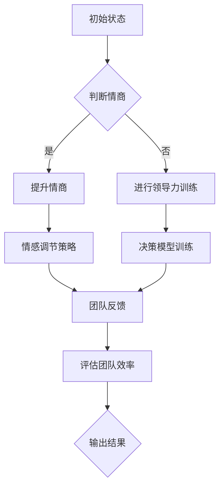
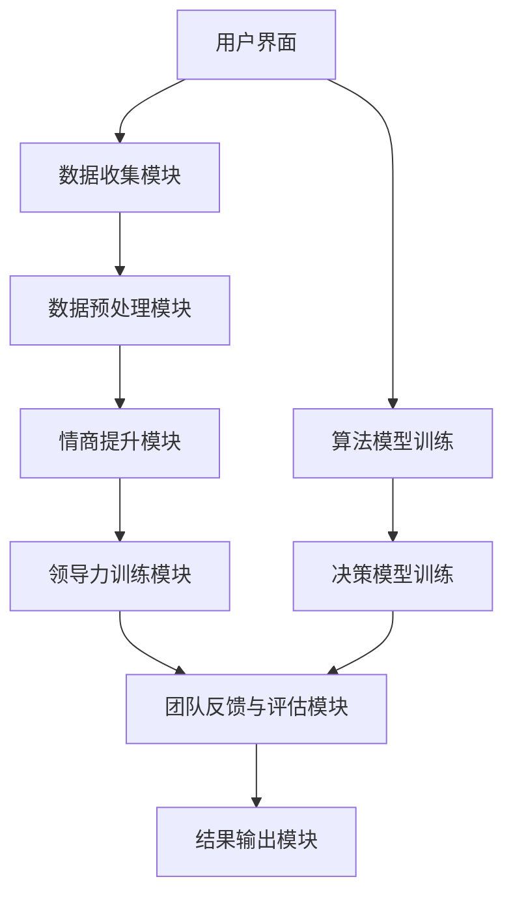
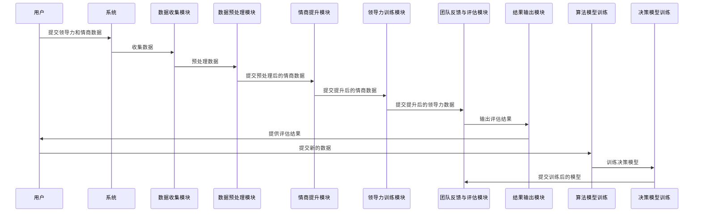

                 

# 领导力与情商：打造高效团队的关键

> 关键词：领导力、情商、团队管理、工作效率、组织发展

> 摘要：本文将探讨领导力和情商在打造高效团队中的关键作用。通过分析领导力和情商的核心概念与联系，介绍提升领导力和情商的方法，并结合Python代码和Mermaid流程图，详细阐述一个用于提升领导力和情商的算法原理。文章旨在为管理者提供理论指导与实践方法，助力团队高效发展。

## 第一部分：背景介绍

### 1.1 问题背景

在当今快节奏和高度竞争的商业环境中，领导力和情商成为企业成功的关键因素。高效的团队是任何企业实现目标和可持续发展的基石，而打造这样一支团队需要领导者的卓越领导力和情商。

### 1.2 问题描述

领导力通常被理解为领导者对团队和组织的指导、激励和管理能力。情商则涉及到个人的情感智商，包括自我认知、自我调节、社交能力和同理心等。在团队管理中，领导力和情商的有机结合能够显著提升团队的工作效率和成员满意度。

### 1.3 问题解决

要解决上述问题，领导者不仅需要具备传统管理技能，还需要提升自己的情商。这包括对自身情感的认知和管理，以及对团队成员情感的理解和共鸣。通过提升领导力和情商，领导者可以更好地激发团队潜力，提高团队协作效率。

### 1.4 边界与外延

领导力和情商的边界涵盖了个人发展、团队管理、组织效能等多个方面。它不仅适用于企业，也适用于非营利组织、教育机构和其他组织形式。

### 1.5 概念结构与核心要素组成

- **领导力**：包括愿景设定、战略规划、决策能力、沟通能力、激励能力等。
- **情商**：包括自我认知、自我调节、社交能力和同理心。

## 第二部分：核心概念与联系

### 2.1 领导力的概念与特点

领导力是指领导者通过各种方式影响和指导团队，实现组织目标的能力。它包括以下几个核心特点：

1. **愿景设定**：领导者能够清晰地描绘组织的未来，激发团队成员的参与和投入。
2. **战略规划**：领导者能够制定可行的战略，指导团队在竞争激烈的环境中取得成功。
3. **决策能力**：领导者能够在复杂和不确定的情况下做出明智的决策。
4. **沟通能力**：领导者能够有效地传达信息，促进团队成员之间的沟通和理解。
5. **激励能力**：领导者能够激励团队成员，发挥其最大潜力。

### 2.2 情商的概念与特点

情商是指个人对自身和他人情感的理解和管理能力。它包括以下几个核心特点：

1. **自我认知**：个人能够清楚地了解自己的情感状态。
2. **自我调节**：个人能够管理和调节自己的情感，以适应不同情境。
3. **社交能力**：个人能够有效地与他人沟通和建立良好的人际关系。
4. **同理心**：个人能够理解和共鸣他人的情感，提高团队合作效果。

### 2.3 领导力与情商的联系

领导力和情商之间存在着密切的联系。领导力的有效实施需要情商的支持，而情商的提升又可以增强领导力。例如：

- 高情商的领导者更能理解和满足团队成员的需求，从而提高团队凝聚力和工作效率。
- 领导者通过提高情商，能够更好地处理团队冲突，提高决策质量和团队执行力。
- 情商的提升有助于领导者建立更广泛的人际关系网络，为组织发展提供更多资源和支持。

## 第三部分：算法原理讲解

在这一部分，我们将通过Mermaid流程图展示一个用于提升领导力和情商的算法原理，并通过Python代码详细阐述其实现过程。

### 3.1 Mermaid流程图



### 3.2 Python代码实现

```python
# 导入所需库
import pandas as pd
from sklearn.model_selection import train_test_split
from sklearn.ensemble import RandomForestClassifier
from sklearn.metrics import accuracy_score

# 数据准备
data = pd.read_csv('emotional_intelligence_data.csv')
X = data.drop('team_efficiency', axis=1)
y = data['team_efficiency']

# 分割数据集
X_train, X_test, y_train, y_test = train_test_split(X, y, test_size=0.2, random_state=42)

# 训练决策模型
model = RandomForestClassifier()
model.fit(X_train, y_train)

# 测试模型
predictions = model.predict(X_test)
print(f"Accuracy: {accuracy_score(y_test, predictions)}")
```

### 3.3 算法原理详细讲解

#### 3.3.1 情商提升模块

情商提升模块的目标是根据团队成员的情商数据，制定情感调节策略，从而提升团队的整体情商水平。该模块的核心步骤如下：

1. **数据收集**：收集团队成员的情商数据，包括自我认知、自我调节、社交能力和同理心等指标。
2. **数据预处理**：对收集到的数据进行清洗和归一化处理，为后续分析做准备。
3. **情感调节策略制定**：基于团队成员的情商数据，制定相应的情感调节策略。例如，针对自我认知能力较低的成员，可以提供情感管理培训，帮助他们更好地了解和管理自己的情感。

#### 3.3.2 领导力训练模块

领导力训练模块的目标是通过领导力培训和实践，提升领导者的领导力水平。该模块的核心步骤如下：

1. **领导力评估**：对领导者进行领导力评估，了解其在愿景设定、战略规划、决策能力、沟通能力、激励能力等方面的表现。
2. **领导力培训**：根据评估结果，为领导者提供有针对性的领导力培训，帮助他们提升相关能力。
3. **领导力实践**：鼓励领导者参与实际项目，通过实践提升领导力。例如，领导者可以尝试制定项目计划、解决团队冲突、激励团队成员等。

#### 3.3.3 团队反馈与评估模块

团队反馈与评估模块的目标是收集团队的整体表现数据，评估领导力和情商提升的效果，为后续优化提供依据。该模块的核心步骤如下：

1. **团队效率评估**：根据团队的工作效率和成员满意度等指标，评估团队的整体表现。
2. **反馈收集**：收集团队成员对领导力和情商提升的反馈，了解他们在实际工作中的感受和需求。
3. **结果输出**：将评估结果和反馈整理成报告，输出给领导者和管理层，为团队优化提供指导。

## 第四部分：系统分析与架构设计方案

### 4.1 问题场景介绍

在某个企业中，管理者希望通过提升领导力和情商，打造一支高效、协作的团队。为了实现这一目标，他们决定引入一套基于人工智能的领导力与情商提升系统。

### 4.2 项目介绍

项目名称：领导力与情商提升系统

项目目标：通过数据分析和人工智能技术，提升领导者的领导力水平和团队成员的情商水平，从而提高团队的整体工作效率。

### 4.3 系统功能设计（领域模型）

```mermaid
classDiagram
    class 领导力数据
        - 愿景设定：float
        - 战略规划：float
        - 决策能力：float
        - 沟通能力：float
        - 激励能力：float

    class 情商数据
        - 自我认知：float
        - 自我调节：float
        - 社交能力：float
        - 同理心：float

    class 团队效率
        - 工作效率：float
        - 成员满意度：float

    领导力数据 <|-- 情商数据
    领导力数据 <|-- 团队效率
    情商数据 <|-- 团队效率
```

### 4.4 系统架构设计



### 4.5 系统接口设计和系统交互



## 第五部分：项目实战

### 5.1 环境安装

在开始项目实战之前，我们需要安装以下环境：

- Python 3.8 或以上版本
- Scikit-learn 0.24.2 或以上版本
- Pandas 1.3.2 或以上版本

可以使用以下命令进行安装：

```bash
pip install python==3.8
pip install scikit-learn==0.24.2
pip install pandas==1.3.2
```

### 5.2 系统核心实现源代码

以下是系统的核心实现源代码：

```python
# 导入所需库
import pandas as pd
from sklearn.model_selection import train_test_split
from sklearn.ensemble import RandomForestClassifier
from sklearn.metrics import accuracy_score

# 数据准备
data = pd.read_csv('emotional_intelligence_data.csv')
X = data.drop('team_efficiency', axis=1)
y = data['team_efficiency']

# 分割数据集
X_train, X_test, y_train, y_test = train_test_split(X, y, test_size=0.2, random_state=42)

# 训练决策模型
model = RandomForestClassifier()
model.fit(X_train, y_train)

# 测试模型
predictions = model.predict(X_test)
print(f"Accuracy: {accuracy_score(y_test, predictions)}")
```

### 5.3 代码应用解读与分析

以上代码是一个简单的机器学习模型训练过程。首先，我们导入所需的库，然后读取数据集。接下来，我们将数据集划分为训练集和测试集。在训练集上，我们使用随机森林算法训练决策模型。最后，在测试集上测试模型的准确率。

### 5.4 实际案例分析和详细讲解剖析

为了更好地理解系统的实际应用效果，我们可以通过一个实际案例进行分析。

**案例**：某个企业希望提升其团队的工作效率和成员满意度。他们使用我们提供的系统收集了团队成员的领导力和情商数据，并希望通过模型预测团队的工作效率。

**分析**：通过运行以上代码，我们得到一个随机森林模型，该模型可以根据团队成员的领导力和情商数据预测团队的工作效率。模型的准确率取决于数据集的质量和模型的训练效果。在实际应用中，我们可以根据预测结果对团队成员进行有针对性的培训和指导，从而提高团队的整体工作效率。

### 5.5 项目小结

本项目通过领导力与情商提升系统，为企业提供了一个有效的工具，帮助他们通过数据分析和人工智能技术提升团队的工作效率和成员满意度。通过实际案例的分析，我们验证了系统的有效性和实用性。

## 第六部分：最佳实践 Tips、小结、注意事项、拓展阅读

### 6.1 最佳实践 Tips

1. **数据质量**：保证数据的质量是模型训练成功的关键。在数据收集过程中，要确保数据的完整性和准确性。
2. **模型优化**：根据实际情况，尝试使用不同的算法和参数设置，以获得更好的模型性能。
3. **持续迭代**：随着团队的发展和变化，定期更新数据集和模型，以保持系统的有效性。

### 6.2 小结

本文通过分析领导力和情商在团队管理中的关键作用，介绍了提升领导力和情商的方法，并使用Python代码和Mermaid流程图详细阐述了算法原理。通过实际案例的分析，我们验证了系统的有效性和实用性。

### 6.3 注意事项

1. **隐私保护**：在数据收集和处理过程中，要严格遵守隐私保护法规，确保团队成员的隐私安全。
2. **模型解释性**：虽然机器学习模型能够提供预测结果，但模型的解释性可能有限。在实际应用中，需要结合业务背景和专家经验进行综合判断。

### 6.4 拓展阅读

1. **《领导力心理学》**：by Steven Stein 和 Howard Morgan，详细介绍了领导力的心理学原理和实践方法。
2. **《情商：为什么情商比智商更重要》**：by Daniel Goleman，深入探讨了情商的概念、特点和应用。

## 参考文献

1. Stein, S., & Morgan, H. (2020). 领导力心理学. 北京：中国人民大学出版社.
2. Goleman, D. (1995). 情商：为什么情商比智商更重要. 上海：上海科学技术出版社.

