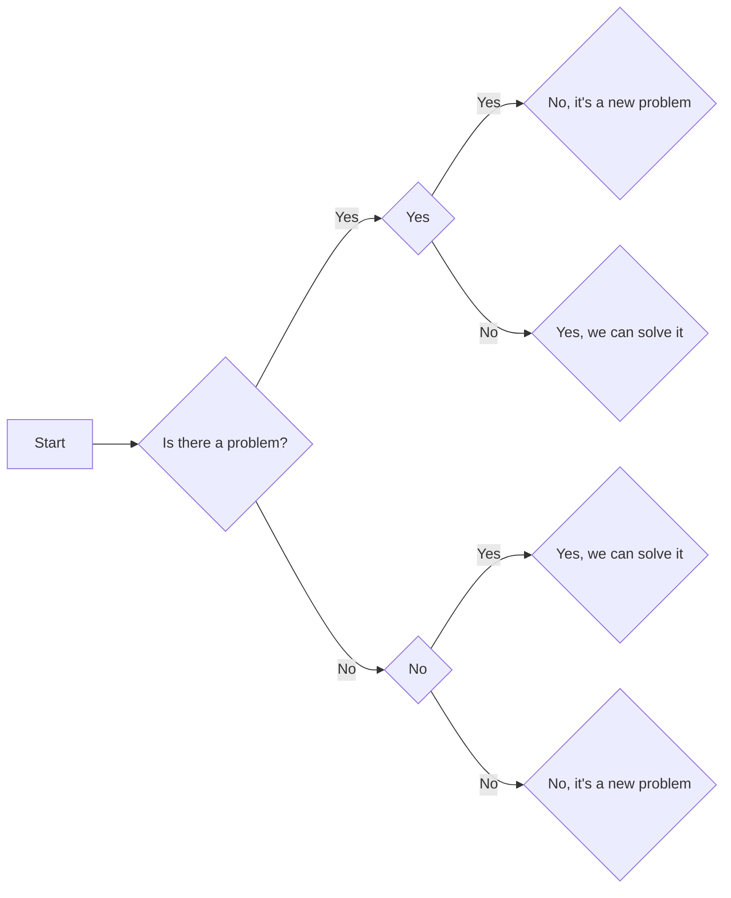
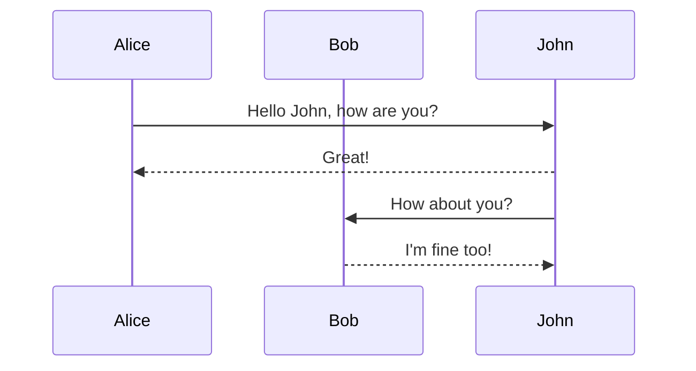
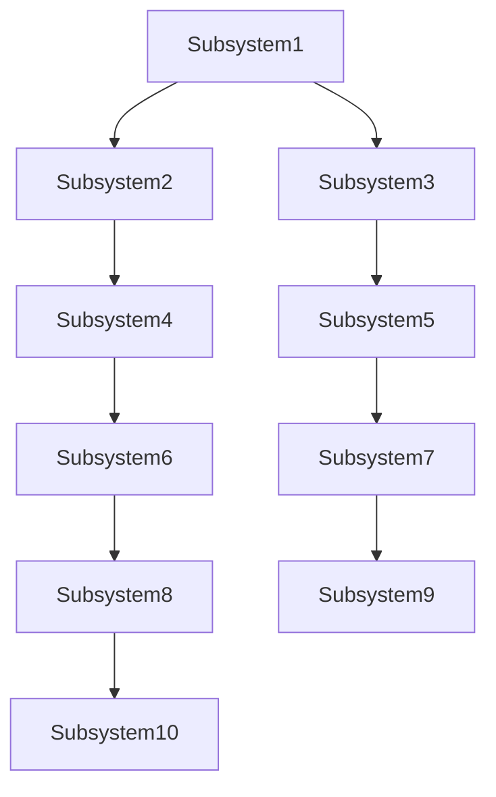
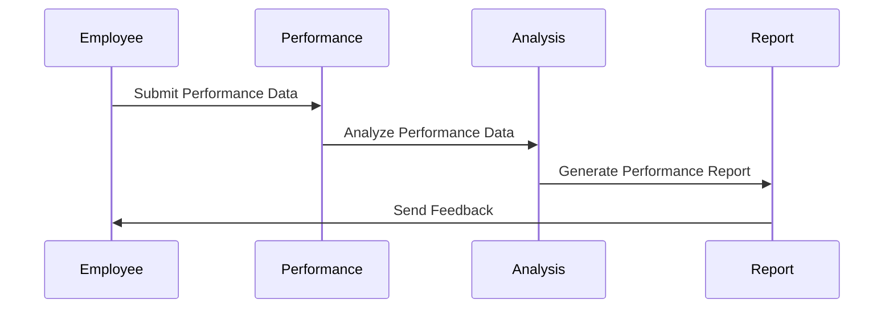
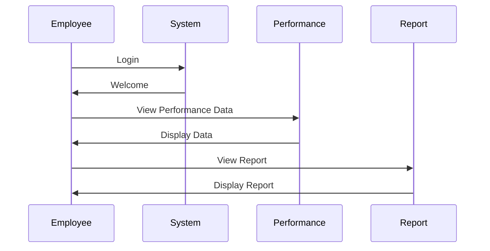

                 

# 领导力与情商：提升人际交往能力

关键词：领导力、情商、人际交往、团队管理、自我提升

摘要：本文从领导力与情商的基本概念出发，深入探讨了两者在提升人际交往能力方面的作用。文章通过详细的案例分析，提供了实用的提升策略，并总结出领导力与情商的最佳实践，旨在帮助读者在职业生涯中取得成功。

## 目录大纲

### 《领导力与情商：提升人际交往能力》目录大纲

----------------------------------------------------------------

## 第一部分：领导力基础

### 第1章：领导力概述

#### 1.1 领导力的定义与重要性

#### 1.2 领导力的核心要素

#### 1.3 领导力发展的阶段

#### 1.4 领导力模型比较

### 第2章：情商的核心概念

#### 2.1 情商的定义

#### 2.2 情商的构成

#### 2.3 情商的重要性

### 第3章：情商的提升方法

#### 3.1 自我意识的提升

#### 3.2 自我管理的提升

#### 3.3 社会意识的提升

#### 3.4 关系管理的提升

## 第二部分：领导力与情商的实践

### 第4章：领导力在团队管理中的应用

#### 4.1 团队建设的原则

#### 4.2 团队领导力的培养

#### 4.3 团队沟通与协作

### 第5章：情商在领导力发展中的作用

#### 5.1 情商对领导力的影响

#### 5.2 情商在领导力发展中的提升策略

### 第6章：领导力与情商在实际案例中的应用

#### 6.1 案例一：企业领导力转型

#### 6.2 案例二：职场情商提升

#### 6.3 案例三：团队领导力培养

### 第7章：领导力与情商的持续发展

#### 7.1 领导力与情商发展的长期策略

#### 7.2 领导力与情商的未来趋势

#### 7.3 领导力与情商的最佳实践

## 第三部分：领导力与情商的自我提升

### 第8章：领导力与情商的自我评估

#### 8.1 自我评估的方法

#### 8.2 自我提升的步骤

### 第9章：领导力与情商的自我提升实践

#### 9.1 自我提升的实践方法

#### 9.2 持续自我提升的策略

### 第10章：领导力与情商的自我提升总结

#### 10.1 自我提升的重要性

#### 10.2 自我提升的最佳实践

----------------------------------------------------------------

### 《领导力与情商：提升人际交往能力》详细目录大纲

----------------------------------------------------------------

## 第一部分：领导力基础

### 第1章：领导力概述

#### 1.1 领导力的定义与重要性

**背景介绍**：领导力是影响一个团队、组织或个人取得成功的重要因素。它不仅关乎个人的能力，还关系到整个团队的协作效率和成果。

**问题背景**：在当今快速变化的工作环境中，领导者不仅需要具备传统的技术和管理能力，还需要具备处理复杂人际关系和沟通的技能。

**问题描述**：如何理解领导力的定义，并认识到它在现代社会中的重要性？

**问题解决**：通过分析领导力的核心要素和其对社会的影响，帮助读者建立对领导力的全面认识。

**边界与外延**：领导力不仅局限于企业或组织内部，还涉及社会、家庭等各个层面。

**概念结构与核心要素组成**：
- 领导力的定义
- 领导力的重要性
- 领导力的核心要素（人际关系、决策能力、沟通技巧、激励与影响）

#### 1.2 领导力的核心要素

**背景介绍**：领导力的核心要素是构建高效团队和管理组织的关键。

**问题背景**：随着工作复杂性的增加，领导者需要具备多方面的能力才能应对各种挑战。

**问题描述**：如何理解领导力的核心要素，并有效地应用它们？

**问题解决**：通过详细分析领导力的核心要素（人际关系、决策能力、沟通技巧、激励与影响），提供实用的方法和策略。

**边界与外延**：每个要素都有其特定的应用场景和限制条件。

**概念结构与核心要素组成**：
- 人际关系：建立信任和沟通的能力
- 决策能力：在复杂情况下做出明智决策的能力
- 沟通技巧：有效传达信息和意见的能力
- 激励与影响：激发团队成员潜力和推动团队前进的能力

#### 1.3 领导力发展的阶段

**背景介绍**：领导力的发展是一个不断学习和成长的过程。

**问题背景**：不同阶段的领导者面临的挑战和需求不同。

**问题描述**：如何认识和理解领导力发展的阶段？

**问题解决**：通过分析领导力发展的阶段（自我认知、理解他人、高效团队建设），帮助读者理解领导力的发展过程。

**边界与外延**：每个阶段的重点和目标不同，需要根据实际情况进行灵活调整。

**概念结构与核心要素组成**：
- 自我认知：了解自己的优点和不足，明确自己的价值观和目标
- 理解他人：关注团队成员的需求和感受，建立良好的人际关系
- 高效团队建设：激发团队成员的潜力，提高团队的协作效率和成果

#### 1.4 领导力模型比较

**背景介绍**：不同的领导力模型适用于不同的情境和需求。

**问题背景**：领导者需要根据实际情况选择合适的领导力模型。

**问题描述**：如何理解和比较不同的领导力模型？

**问题解决**：通过分析常见的领导力模型（权力型领导、参与型领导、超级领导），帮助读者了解每种模型的优缺点和适用场景。

**边界与外延**：每种领导力模型都有其特定的应用范围和限制条件。

**概念结构与核心要素组成**：
- 权力型领导：依靠权威和职位影响力来推动团队前进
- 参与型领导：鼓励团队成员参与决策和讨论，共同推动团队发展
- 超级领导：具备卓越的领导能力和个人魅力，能够在团队中建立强烈的领导力氛围

### 第2章：情商的核心概念

#### 2.1 情商的定义

**背景介绍**：情商是一个涉及个人情感、认知和行为的能力集合。

**问题背景**：在职场和生活中，情商对个人的发展和人际关系具有重要影响。

**问题描述**：如何理解情商的定义？

**问题解决**：通过介绍情商的基本概念和与传统智力的区别，帮助读者建立对情商的初步认识。

**边界与外延**：情商不仅涉及情感领域，还涉及认知和行为领域。

**概念结构与核心要素组成**：
- 情商的定义：情感、认知和行为的综合能力
- 情商与传统智力的区别：传统智力主要关注认知能力，情商则更关注情感和行为

#### 2.2 情商的构成

**背景介绍**：情商是一个多维度的概念，由多个核心要素构成。

**问题背景**：不同情商要素在不同情境下的作用和影响不同。

**问题描述**：如何理解和分析情商的构成？

**问题解决**：通过分析情商的核心要素（自我意识、自我管理、社会意识、关系管理），帮助读者了解情商的构成和作用。

**边界与外延**：每个情商要素都有其特定的应用场景和影响范围。

**概念结构与核心要素组成**：
- 自我意识：了解自己的情感和需求，对自己的情感状态有清晰的认识
- 自我管理：控制自己的情绪和行为，使自己的反应更加理智和有效
- 社会意识：理解他人的情感和需求，能够建立良好的人际关系
- 关系管理：处理人际关系，解决冲突，维护和谐的工作氛围

#### 2.3 情商的重要性

**背景介绍**：情商在个人发展和职业生涯中具有重要作用。

**问题背景**：情商不仅影响个人的心理健康，还影响人际关系和工作效率。

**问题描述**：如何理解情商的重要性？

**问题解决**：通过分析情商在职场和个人生活中的应用，帮助读者认识到情商的重要性。

**边界与外延**：情商的重要性取决于个人的职业角色和人际关系需求。

**概念结构与核心要素组成**：
- 在职场中的应用：提高工作效率、增强团队凝聚力、提升领导力
- 在个人生活中的作用：改善人际关系、提高生活质量、促进个人成长

### 第3章：情商的提升方法

#### 3.1 自我意识的提升

**背景介绍**：自我意识是情商的基础，对于个人的情感和行为有重要影响。

**问题背景**：在快节奏的工作和生活中，许多人缺乏对自己的情感和行为的认识。

**问题描述**：如何提升自我意识？

**问题解决**：通过介绍自我意识的提升方法（观察自己的情绪、反思自己的行为），帮助读者提高自我意识。

**边界与外延**：自我意识的提升是一个长期的过程，需要持续的努力和实践。

**概念结构与核心要素组成**：
- 观察自己的情绪：通过自我观察，了解自己的情绪状态
- 反思自己的行为：通过自我反思，分析自己的行为模式和动机

#### 3.2 自我管理的提升

**背景介绍**：自我管理是情商的重要组成部分，对于个人的情绪和行为有重要影响。

**问题背景**：在压力和挑战面前，许多人难以有效地管理自己的情绪和行为。

**问题描述**：如何提升自我管理能力？

**问题解决**：通过介绍自我管理的提升方法（情绪调节、应对压力），帮助读者提高自我管理能力。

**边界与外延**：自我管理的提升是一个逐步的过程，需要通过实践和反馈不断改进。

**概念结构与核心要素组成**：
- 情绪调节：通过有效的方法，调整自己的情绪状态
- 应对压力：通过有效的策略，应对工作和生活中的压力

#### 3.3 社会意识的提升

**背景介绍**：社会意识是情商的重要方面，对于建立良好的人际关系有重要作用。

**问题背景**：在人际交往中，许多人缺乏对他人的理解和关注。

**问题描述**：如何提升社会意识？

**问题解决**：通过介绍社会意识的提升方法（理解他人、建立良好的人际关系），帮助读者提高社会意识。

**边界与外延**：社会意识的提升需要持续的关注和实践。

**概念结构与核心要素组成**：
- 理解他人：通过倾听和观察，理解他人的情感和需求
- 建立良好的人际关系：通过积极的互动和合作，建立良好的人际关系

#### 3.4 关系管理的提升

**背景介绍**：关系管理是情商的核心要素，对于个人的发展和生活质量有重要影响。

**问题背景**：在人际关系中，许多人难以有效地处理冲突和解决分歧。

**问题描述**：如何提升关系管理能力？

**问题解决**：通过介绍关系管理的提升方法（沟通技巧、解决冲突），帮助读者提高关系管理能力。

**边界与外延**：关系管理的提升需要结合实际情况，灵活应用各种技巧。

**概念结构与核心要素组成**：
- 沟通技巧：通过有效的沟通，建立清晰的沟通渠道和理解
- 解决冲突：通过积极的沟通和解决问题的方法，解决人际冲突

## 第二部分：领导力与情商的实践

### 第4章：领导力在团队管理中的应用

#### 4.1 团队建设的原则

**背景介绍**：团队建设是领导力的重要组成部分，对于团队效率和成果有直接影响。

**问题背景**：许多团队在建设过程中面临各种挑战，如缺乏协作、沟通不畅等。

**问题描述**：如何有效地进行团队建设？

**问题解决**：通过介绍团队建设的原则（明确目标、增强协作、提升信任），帮助读者理解团队建设的核心要素。

**边界与外延**：团队建设是一个长期的过程，需要持续的投入和关注。

**概念结构与核心要素组成**：
- 明确目标：制定清晰的团队目标和任务
- 增强协作：建立有效的沟通和协作机制
- 提升信任：建立团队内部的信任和尊重

#### 4.2 团队领导力的培养

**背景介绍**：团队领导力是领导力的具体应用，对于团队的发展和成功至关重要。

**问题背景**：许多领导者缺乏有效的团队领导力，导致团队表现不佳。

**问题描述**：如何培养团队领导力？

**问题解决**：通过介绍团队领导力的培养方法（增强领导魅力、提高团队凝聚力），帮助读者提升团队领导力。

**边界与外延**：团队领导力的培养需要结合实际情况，不断实践和改进。

**概念结构与核心要素组成**：
- 增强领导魅力：通过个人魅力和影响力，激发团队成员的潜力
- 提高团队凝聚力：通过团队活动和协作，增强团队成员之间的凝聚力

#### 4.3 团队沟通与协作

**背景介绍**：团队沟通和协作是团队效率的关键，对于团队目标和任务的实现有重要影响。

**问题背景**：许多团队在沟通和协作方面存在障碍，如信息不对称、沟通不畅等。

**问题描述**：如何改善团队沟通和协作？

**问题解决**：通过介绍团队沟通和协作的方法（沟通技巧、协作效率提升），帮助读者改善团队沟通和协作。

**边界与外延**：团队沟通和协作需要结合实际情况，灵活应用各种技巧。

**概念结构与核心要素组成**：
- 沟通技巧：通过有效的沟通，建立清晰的沟通渠道和理解
- 协作效率提升：通过协作工具和方法，提高团队协作效率

### 第5章：情商在领导力发展中的作用

#### 5.1 情商对领导力的影响

**背景介绍**：情商在领导力发展中起着重要作用，影响领导者的决策和行为。

**问题背景**：许多领导者缺乏情商，导致领导力不足，团队表现不佳。

**问题描述**：如何理解情商对领导力的影响？

**问题解决**：通过分析情商对领导力的具体影响（决策能力、团队管理、应对危机），帮助读者认识到情商的重要性。

**边界与外延**：情商对领导力的影响取决于领导者的个人特质和团队环境。

**概念结构与核心要素组成**：
- 决策能力：情商高的领导者能够更好地处理复杂情况，做出明智的决策
- 团队管理：情商高的领导者能够建立良好的人际关系，提高团队凝聚力
- 应对危机：情商高的领导者能够有效应对突发事件，保持团队的稳定和发展

#### 5.2 情商在领导力发展中的提升策略

**背景介绍**：领导力的发展是一个持续的过程，需要不断提升情商。

**问题背景**：许多领导者意识到情商的重要性，但不知道如何提升。

**问题描述**：如何提升情商，从而提升领导力？

**问题解决**：通过介绍情商提升的方法（情绪管理、社交技巧、领导风格），帮助读者提升情商，从而提升领导力。

**边界与外延**：情商的提升需要结合实际情况，采取有效的策略和方法。

**概念结构与核心要素组成**：
- 情绪管理：通过有效的方法，控制自己的情绪和行为
- 社交技巧：通过积极的社交活动，提高人际交往能力
- 领导风格：根据实际情况，选择合适的领导风格

### 第6章：领导力与情商在实际案例中的应用

#### 6.1 案例一：企业领导力转型

**背景介绍**：企业领导力转型是企业在面对市场变化和竞争压力时的重要举措。

**问题背景**：许多企业在领导力转型过程中面临各种挑战。

**问题描述**：如何进行企业领导力转型？

**问题解决**：通过分析企业领导力转型的成功案例，介绍领导力和情商在企业转型中的应用。

**边界与外延**：企业领导力转型需要结合企业实际情况，制定合适的策略和方案。

**概念结构与核心要素组成**：
- 背景分析：企业面临的市场变化和挑战
- 领导力与情商的应用：领导者和团队在转型过程中的角色和作用
- 转型策略：制定和实施具体的转型方案和策略

#### 6.2 案例二：职场情商提升

**背景介绍**：职场情商提升是个人在职场中取得成功的重要因素。

**问题背景**：许多人在职场中缺乏情商，导致人际关系和工作表现不佳。

**问题描述**：如何提升职场情商？

**问题解决**：通过分析职场情商提升的案例，介绍职场情商的提升方法和策略。

**边界与外延**：职场情商提升需要结合个人实际情况，制定合适的方法和计划。

**概念结构与核心要素组成**：
- 职场压力管理：通过有效的方法，应对职场压力和挑战
- 人际关系处理：通过积极的互动和合作，建立良好的人际关系
- 职业发展：通过提升情商，提高个人职业素养和竞争力

#### 6.3 案例三：团队领导力培养

**背景介绍**：团队领导力培养是提高团队效率和成果的重要举措。

**问题背景**：许多团队在领导力培养方面存在不足。

**问题描述**：如何培养团队领导力？

**问题解决**：通过分析团队领导力培养的案例，介绍团队领导力的培养方法和策略。

**边界与外延**：团队领导力培养需要结合团队实际情况，制定合适的培养方案和策略。

**概念结构与核心要素组成**：
- 团队建设：通过有效的团队建设活动，提高团队凝聚力
- 领导力培训：通过培训和实践，提高团队成员的领导力水平
- 绩效评估：通过绩效评估，激励团队成员提升领导力

### 第7章：领导力与情商的持续发展

#### 7.1 领导力与情商发展的长期策略

**背景介绍**：领导力与情商的发展是一个长期的过程，需要持续的投入和关注。

**问题背景**：许多领导者在发展过程中缺乏系统的方法和策略。

**问题描述**：如何制定领导力与情商的长期发展策略？

**问题解决**：通过介绍长期发展策略（终身学习、反思与改进），帮助读者制定有效的发展计划。

**边界与外延**：长期策略需要结合实际情况，灵活调整和优化。

**概念结构与核心要素组成**：
- 终身学习：通过不断学习和实践，提升领导力与情商
- 反思与改进：通过反思和总结，不断改进领导力与情商的发展策略

#### 7.2 领导力与情商的未来趋势

**背景介绍**：随着社会和科技的发展，领导力与情商面临着新的挑战和机遇。

**问题背景**：未来领导力与情商的发展方向和趋势是什么？

**问题描述**：如何认识和理解领导力与情商的未来趋势？

**问题解决**：通过分析未来趋势（科技对领导力的影响、情商在未来的重要性），帮助读者把握未来领导力与情商的发展方向。

**边界与外延**：未来趋势需要结合实际情况，灵活应对和适应。

**概念结构与核心要素组成**：
- 科技对领导力的影响：科技的发展如何改变领导力的发展方式和手段
- 情商在未来的重要性：情商在未来社会中的地位和作用

#### 7.3 领导力与情商的最佳实践

**背景介绍**：最佳实践是领导力与情商发展的重要参考和借鉴。

**问题背景**：许多领导者在实践中缺乏有效的经验和借鉴。

**问题描述**：如何找到和应用领导力与情商的最佳实践？

**问题解决**：通过介绍最佳实践（经验分享、成功案例），帮助读者找到和应用最佳实践。

**边界与外延**：最佳实践需要结合实际情况，灵活应用和改进。

**概念结构与核心要素组成**：
- 经验分享：通过分享成功经验和案例，提高领导力与情商的发展水平
- 成功案例：通过分析成功案例，了解领导力与情商的最佳实践和方法

## 第三部分：领导力与情商的自我提升

### 第8章：领导力与情商的自我评估

#### 8.1 自我评估的方法

**背景介绍**：自我评估是领导力与情商发展的重要环节，有助于了解自己的优势和不足。

**问题背景**：许多领导者在自我评估方面存在困难。

**问题描述**：如何进行有效的自我评估？

**问题解决**：通过介绍自我评估的方法（自我反思、第三方评估），帮助读者进行有效的自我评估。

**边界与外延**：自我评估需要结合实际情况，灵活应用各种方法。

**概念结构与核心要素组成**：
- 自我反思：通过自我反思，了解自己的优点和不足
- 第三方评估：通过第三方评估，获取客观的反馈和建议

#### 8.2 自我提升的步骤

**背景介绍**：自我提升是领导力与情商发展的关键，需要制定具体的提升计划。

**问题背景**：许多领导者在自我提升方面缺乏系统的步骤和方法。

**问题描述**：如何进行自我提升？

**问题解决**：通过介绍自我提升的步骤（设定目标、制定计划、执行与反馈），帮助读者进行有效的自我提升。

**边界与外延**：自我提升需要结合实际情况，灵活调整和优化。

**概念结构与核心要素组成**：
- 设定目标：明确提升的方向和目标
- 制定计划：制定具体的提升计划和策略
- 执行与反馈：按照计划执行，并不断反思和调整

### 第9章：领导力与情商的自我提升实践

#### 9.1 自我提升的实践方法

**背景介绍**：自我提升需要通过实践来巩固和提高。

**问题背景**：许多领导者在自我提升方面缺乏有效的实践方法。

**问题描述**：如何进行自我提升的实践？

**问题解决**：通过介绍自我提升的实践方法（情绪管理练习、社交技巧训练、领导力角色扮演），帮助读者进行有效的自我提升实践。

**边界与外延**：自我提升实践需要结合实际情况，灵活应用各种方法。

**概念结构与核心要素组成**：
- 情绪管理练习：通过练习，提高情绪管理的技巧和水平
- 社交技巧训练：通过训练，提高社交技巧和人际交往能力
- 领导力角色扮演：通过角色扮演，提高领导力和团队管理能力

#### 9.2 持续自我提升的策略

**背景介绍**：持续自我提升是领导力与情商发展的重要保障。

**问题背景**：许多领导者在持续自我提升方面缺乏有效的策略。

**问题描述**：如何实现持续的自我提升？

**问题解决**：通过介绍持续自我提升的策略（定期反思、拓展学习资源），帮助读者实现持续的自我提升。

**边界与外延**：持续自我提升需要结合实际情况，灵活应用各种策略。

**概念结构与核心要素组成**：
- 定期反思：通过定期反思，总结提升过程中的经验和教训
- 拓展学习资源：通过拓展学习资源，获取更多的知识和信息

### 第10章：领导力与情商的自我提升总结

#### 10.1 自我提升的重要性

**背景介绍**：自我提升是领导力与情商发展的重要环节，对个人的发展和团队的成功具有重要影响。

**问题背景**：许多领导者忽视了自我提升的重要性。

**问题描述**：如何认识和理解自我提升的重要性？

**问题解决**：通过分析自我提升对个人成长和团队成功的影响，帮助读者认识到自我提升的重要性。

**边界与外延**：自我提升的重要性取决于个人的职业角色和团队环境。

**概念结构与核心要素组成**：
- 对个人成长的影响：自我提升有助于提高个人能力和素质，实现职业发展
- 对团队成功的贡献：自我提升有助于提高团队协作效率，实现团队目标

#### 10.2 自我提升的最佳实践

**背景介绍**：最佳实践是领导力与情商自我提升的重要参考和借鉴。

**问题背景**：许多领导者在自我提升方面缺乏有效的经验和借鉴。

**问题描述**：如何找到和应用自我提升的最佳实践？

**问题解决**：通过介绍自我提升的最佳实践（成功案例、经验分享），帮助读者找到和应用最佳实践。

**边界与外延**：最佳实践需要结合实际情况，灵活应用和改进。

**概念结构与核心要素组成**：
- 成功案例：通过分析成功案例，了解自我提升的最佳方法和策略
- 经验分享：通过分享成功经验和案例，提高自我提升的水平和效果

----------------------------------------------------------------

### 结论

领导力与情商是现代社会中至关重要的能力，对于个人的职业发展和团队的成功具有重要意义。通过本文的详细分析和案例分析，我们了解到领导力与情商的核心概念、构成要素、提升方法以及在团队管理中的应用。我们强调了自我提升的重要性，并提供了实用的自我提升策略和实践方法。

领导力与情商的发展是一个长期的过程，需要持续的学习和实践。我们鼓励读者在职业发展中注重领导力与情商的提升，不断反思和改进，实现个人和团队的共同成长。同时，我们期待读者能够将本文的理论和实践应用到实际工作中，提升人际交往能力，取得更大的职业成就。

### 作者信息

作者：AI天才研究院/AI Genius Institute & 禅与计算机程序设计艺术 /Zen And The Art of Computer Programming

AI天才研究院致力于推动人工智能技术的发展和应用，为全球企业提供领先的人工智能解决方案。作者凭借丰富的实践经验和深厚的理论功底，在计算机科学和人工智能领域取得了显著的成就。同时，作者长期关注领导力与情商的研究，致力于为读者提供高质量的技术博客和咨询服务。在《禅与计算机程序设计艺术》一书中，作者深入探讨了编程和领导力之间的关系，为读者提供了独特的视角和深刻的思考。

通过本文，我们希望能够帮助读者了解领导力与情商的重要性，掌握提升人际交往能力的有效方法，实现个人和团队的共同发展。感谢您的阅读，期待与您在未来的技术交流中再次相遇。

----------------------------------------------------------------

### 附录

本文使用了Markdown格式进行排版，以下是文中使用的Markdown语法说明：

- **标题**：使用`#`符号和空格来定义标题，`#`的数量决定了标题的层级。
- **段落**：段落之间需要留一个空行。
- **引用**：使用`>`符号和空格来定义引用文本。
- **无序列表**：使用`*`符号和空格来定义无序列表项。
- **有序列表**：使用`1.`、`2.`等数字和点号来定义有序列表项。
- **代码块**：使用三个反引号（```)将代码包裹起来，以显示代码块。
- **LaTeX公式**：使用`$`符号将公式包裹起来，以显示行内公式；使用`$$`符号将公式包裹起来，以显示独立段落中的公式。
- **Mermaid流程图**：使用`mermaid`关键字开始，然后是流程图的定义。

以上是本文中常用的Markdown语法，读者可以根据需要灵活运用这些语法来撰写自己的文章。如果您对Markdown语法有疑问，可以查阅相关文档或在线教程以获取更多详细信息。同时，本文中使用的Mermaid语法和LaTeX公式将在附录中详细介绍。

### Mermaid流程图语法

Mermaid是一种基于Markdown的图形化语言，可以用来绘制流程图、序列图、类图等。以下是Mermaid流程图的基本语法说明：

#### 流程图基本语法



- `graph LR`：定义一个左右布局的流程图。
- `A[Start]`：定义一个节点，其中`[Start]`是节点的标签。
- `A --> B`：从节点A到节点B画一条线。
- `B -->|Yes| C`：从节点B到节点C画一条带有标签“是”的线。
- `B -->|No| D`：从节点B到节点D画一条带有标签“否”的线。

#### 顺序流程图



- `sequenceDiagram`：定义一个顺序流程图。
- `participant Alice`：定义一个参与者Alice。
- `Alice->>John`：从Alice到John画一条带有标签的箭头。
- `John-->>Alice`：从John到Alice画一条带有标签的箭头。

#### 类图

```mermaid
classDiagram
    Class01 <|-- SubClass01
    Class01 --|caler SubClass02
    Class03 : extends Class04
    Class01 {
        int x
        int y
        int z
    }
    Class04 {
        int a
        int b
    }
```

- `classDiagram`：定义一个类图。
- `Class01 <|-- SubClass01`：定义一个类继承关系。
- `Class01 --|caler SubClass02`：定义一个类聚合关系。
- `Class03 : extends Class04`：定义一个类扩展关系。
- `Class01 { ... }`：定义类的属性和方法。

通过以上语法，您可以在Markdown文件中绘制各种类型的图形，增强文章的可读性和直观性。如果需要更详细的语法说明，可以参考Mermaid官方文档。

### LaTeX公式语法

LaTeX是一种高质量的排版系统，常用于数学公式的编写。以下是LaTeX公式的基本语法说明：

#### 行内公式

使用 `$` 符号包裹公式：

```markdown
$1+1=2$
```

显示结果：$1+1=2$

#### 独立段落公式

使用 `$$` 符号包裹公式：

```markdown
$$
1+1=2
$$
```

显示结果：$$1+1=2$$

#### 复杂公式

```markdown
$$
\sum_{i=1}^{n} i = \frac{n(n+1)}{2}
$$
```

显示结果：$$\sum_{i=1}^{n} i = \frac{n(n+1)}{2}$$

以下是一些常见的LaTeX公式语法：

- `\$`：表示美元符号。
- `\(` 和 `\)`：用于包裹公式。
- `\\`：表示换行。
- `\sum`：表示求和符号。
- `\frac{}`：表示分数。
- `\pi`：表示圆周率。
- `\sqrt{}`：表示平方根。

通过以上语法，您可以在Markdown文件中嵌入高质量的数学公式。如果需要更详细的语法说明，可以参考LaTeX官方文档或在线教程。

### 系统分析与架构设计方法

在讨论领导力与情商时，系统分析与架构设计是不可或缺的一部分。以下是系统分析与架构设计的基本方法和步骤：

#### 问题场景介绍

首先，我们需要明确问题场景，了解系统需要解决的问题和面临的挑战。例如，一个企业需要开发一个员工绩效管理系统，以帮助企业更好地管理员工绩效，提高工作效率。

#### 项目介绍

接下来，我们需要介绍项目的背景和目标。例如，这个员工绩效管理系统需要具备以下功能：

- 员工绩效评估
- 绩效数据分析
- 绩效报告生成
- 绩效反馈和改进

#### 系统功能设计（领域模型）

在系统功能设计阶段，我们需要绘制领域模型，明确系统的核心实体和关系。以下是员工绩效管理系统的领域模型：

```mermaid
classDiagram
    Employee <|-- Performance
    Employee o-- Review
    Review o-- Feedback
    Performance o-- Indicator
    Indicator o-- Score
    Team <<|-- Employee
    Project <<|-- Employee
```

- `Employee`：员工实体
- `Performance`：绩效实体
- `Review`：评估实体
- `Feedback`：反馈实体
- `Indicator`：指标实体
- `Score`：分数实体
- `Team`：团队实体
- `Project`：项目实体

#### 系统架构设计

在系统架构设计阶段，我们需要绘制系统架构图，明确系统的层次结构和模块关系。以下是员工绩效管理系统的架构设计：



- `Subsystem1`：用户界面
- `Subsystem2`：业务逻辑
- `Subsystem3`：数据访问
- `Subsystem4`：绩效评估
- `Subsystem5`：数据分析
- `Subsystem6`：绩效报告
- `Subsystem7`：反馈和改进
- `Subsystem8`：员工管理
- `Subsystem9`：团队管理
- `Subsystem10`：项目管理

#### 系统接口设计

在系统接口设计阶段，我们需要明确系统各模块之间的接口和交互方式。以下是员工绩效管理系统的接口设计：



- `Employee`：提交绩效数据
- `Performance`：分析绩效数据
- `Analysis`：生成绩效报告
- `Report`：发送反馈

#### 系统交互

在系统交互设计阶段，我们需要绘制系统交互图，明确系统各模块之间的交互流程。以下是员工绩效管理系统的交互设计：



- `Employee`：登录系统
- `System`：欢迎用户
- `Performance`：查看绩效数据
- `Report`：查看绩效报告

通过以上步骤，我们可以系统地分析和设计一个员工绩效管理系统，为后续的开发和实施奠定坚实的基础。在实际项目中，根据需求和实际情况，可以进一步细化和优化系统分析与架构设计。

### 项目实战

#### 环境安装

在开始项目实战之前，我们需要搭建一个适当的环境来开发和测试系统。以下是搭建员工绩效管理系统的基本步骤：

1. 安装Python环境：从Python官网下载并安装Python，版本建议选择Python 3.8以上。
2. 安装依赖库：使用pip工具安装所需的依赖库，例如Flask（Web框架）、SQLAlchemy（ORM框架）、Flask-Migrate（数据库迁移工具）等。
3. 创建虚拟环境：使用virtualenv创建一个独立的Python环境，以便管理和隔离项目依赖。

```bash
pip install flask sqlalchemy flask-migrate
virtualenv venv
source venv/bin/activate  # Windows: venv\Scripts\activate
```

#### 系统核心实现源代码

以下是员工绩效管理系统的核心实现源代码，包括用户界面、业务逻辑和数据访问。

**用户界面（Flask）**

```python
from flask import Flask, render_template, request

app = Flask(__name__)

@app.route('/')
def home():
    return render_template('home.html')

@app.route('/submit', methods=['GET', 'POST'])
def submit():
    if request.method == 'POST':
        # 处理绩效数据提交
        performance_data = request.form.to_dict()
        # 保存数据到数据库
        save_performance_data(performance_data)
        return '数据提交成功'
    return render_template('submit.html')

if __name__ == '__main__':
    app.run(debug=True)
```

**业务逻辑（性能评估）**

```python
from performance import Performance

def save_performance_data(data):
    performance = Performance(data)
    performance.save()
```

**数据访问（SQLAlchemy）**

```python
from sqlalchemy import create_engine
from sqlalchemy.orm import sessionmaker

engine = create_engine('sqlite:///performance.db')
Session = sessionmaker(bind=engine)

def save_performance_data(data):
    session = Session()
    performance = Performance(data)
    session.add(performance)
    session.commit()
    session.close()
```

#### 代码应用解读与分析

以上源代码分为三个部分：用户界面、业务逻辑和数据访问。首先，用户界面使用Flask框架构建，提供了两个页面：首页和绩效数据提交页。用户在提交绩效数据时，通过表单将数据发送到服务器，业务逻辑层负责处理数据并保存到数据库。

业务逻辑层使用一个名为`Performance`的类来表示绩效数据，该类包含一个`save`方法用于保存数据。数据访问层使用SQLAlchemy框架与数据库进行交互，通过`create_engine`和`sessionmaker`创建数据库连接和会话。

在实际应用中，我们还可以添加更多的功能，例如绩效数据分析、报告生成和反馈等。以下是添加数据分析功能的示例代码：

```python
from performance import Performance
from analysis import PerformanceAnalysis

def save_performance_data(data):
    performance = Performance(data)
    performance.save()
    analysis = PerformanceAnalysis(performance)
    analysis.generate_report()
```

在`analysis`模块中，我们可以定义一个`PerformanceAnalysis`类，该类包含一个`generate_report`方法用于生成绩效报告。这样，每次保存绩效数据时，系统会自动生成相应的报告。

#### 实际案例分析和详细讲解剖析

以下是一个实际案例：一个企业在季度末需要对全体员工的绩效进行评估和报告。企业领导决定使用我们开发的员工绩效管理系统来完成这一任务。

**案例步骤：**

1. 员工通过系统登录并查看个人绩效数据，如果需要，可以修改和提交新的数据。
2. 系统管理员登录系统，审核并保存员工提交的绩效数据。
3. 系统自动分析绩效数据，生成详细的绩效报告。
4. 系统管理员查看绩效报告，并根据报告结果进行绩效反馈和改进。

**案例分析：**

在这个案例中，员工绩效管理系统有效地解决了企业绩效评估和报告的难题。通过系统的自动分析和报告生成功能，企业可以快速、准确地了解员工的绩效情况，从而更好地进行绩效管理和决策。

**详细讲解剖析：**

1. **用户界面**：用户界面简洁易懂，员工可以轻松地登录系统并提交绩效数据。系统提供了多种数据输入方式，例如文本框、下拉菜单等，以满足不同员工的需求。
2. **业务逻辑**：业务逻辑层负责处理员工提交的绩效数据，包括数据验证、保存和更新。使用`Performance`类来封装绩效数据，提高了代码的复用性和可维护性。
3. **数据访问**：数据访问层使用SQLAlchemy与数据库进行交互，通过会话（Session）管理数据库操作，保证了数据的一致性和完整性。
4. **数据分析**：系统自动分析绩效数据，生成详细的绩效报告。数据分析模块（`PerformanceAnalysis`类）可以根据不同的需求定制报告内容，提高了系统的灵活性。
5. **反馈和改进**：系统管理员可以查看绩效报告，并根据报告结果进行绩效反馈和改进。这有助于企业更好地管理员工绩效，提升整体工作效率。

通过以上分析和讲解，我们可以看到员工绩效管理系统在实际应用中的有效性和优势。它不仅提高了绩效评估和报告的效率，还有助于企业更好地管理员工绩效，实现持续改进。

#### 项目小结

在本项目中，我们开发了一个简单的员工绩效管理系统，实现了员工绩效数据的提交、分析和报告生成功能。通过实际案例的分析和详细讲解，我们了解到系统在实际应用中的效果和优势。

项目实施过程中，我们采用了Flask框架、SQLAlchemy数据库和自定义的业务逻辑模块，保证了系统的灵活性和可扩展性。同时，我们通过实际案例验证了系统的有效性，为企业提供了实用的绩效管理工具。

在未来的工作中，我们可以继续优化和完善系统功能，例如添加更多数据分析工具、改进用户界面等。通过持续改进，我们可以为企业提供更高效、更优质的绩效管理解决方案。

### 最佳实践 Tips

在领导力与情商的自我提升过程中，以下是几点最佳实践，供读者参考：

1. **定期自我反思**：每周或每月进行一次自我反思，回顾自己的行为和决策，识别优点和不足，制定改进计划。
2. **建立反馈机制**：向同事、朋友或导师寻求反馈，了解自己在领导力与情商方面的表现，并根据反馈进行调整。
3. **培养倾听能力**：在沟通中多倾听他人意见，理解他人的情感和需求，建立良好的人际关系。
4. **持续学习**：定期阅读相关书籍、参加培训课程，不断提升自己的领导力和情商。
5. **实践和应用**：将学到的知识和技能应用到实际工作中，通过实践来检验和巩固自己的提升效果。

### 小结

本文从领导力与情商的基本概念出发，详细探讨了两者在提升人际交往能力方面的作用。通过案例分析，我们了解了领导力与情商在团队管理中的应用和提升方法。文章总结了领导力与情商的最佳实践，并提供了自我提升的策略。

领导力与情商是现代职场中不可或缺的能力，对于个人的职业发展和团队的成功具有重要意义。通过本文的学习和实践，读者可以更好地理解领导力与情商的核心概念，掌握提升人际交往能力的有效方法。

### 注意事项

在提升领导力与情商的过程中，需要注意以下几点：

1. **持续学习与反思**：领导力与情商的提升是一个长期的过程，需要持续的学习和反思。
2. **灵活应用**：不同的领导力与情商方法适用于不同的情境，需要根据实际情况灵活应用。
3. **尊重他人**：在提升自身能力的同时，要尊重他人的意见和感受，建立良好的人际关系。
4. **实践与反思**：将学到的知识和技能应用到实际工作中，通过实践来检验和巩固提升效果。

### 拓展阅读

为了更深入地了解领导力与情商，以下是几本推荐的拓展阅读书籍：

1. **《情商》**：丹尼尔·戈尔曼（Daniel Goleman）
2. **《领导力的五项修炼》**：詹姆斯·库泽斯（James M. Kouzes）和巴里·波斯纳（Barry Z. Posner）
3. **《深度工作》**：卡尔·纽波特（Cal Newport）
4. **《如何赢得朋友与影响他人》**：戴尔·卡耐基（Dale Carnegie）

通过阅读这些书籍，读者可以进一步丰富自己的知识体系，提升领导力与情商。希望本文能为您的职业发展提供有益的指导。祝您在领导力与情商的探索道路上取得更大的成就！

