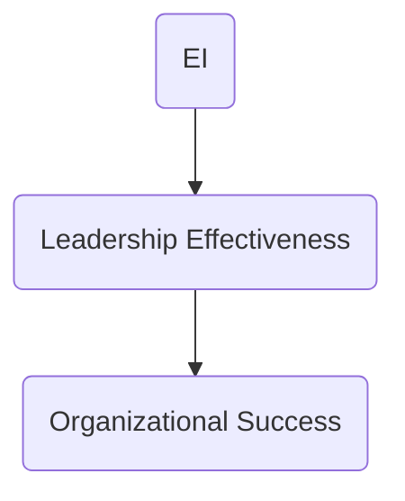
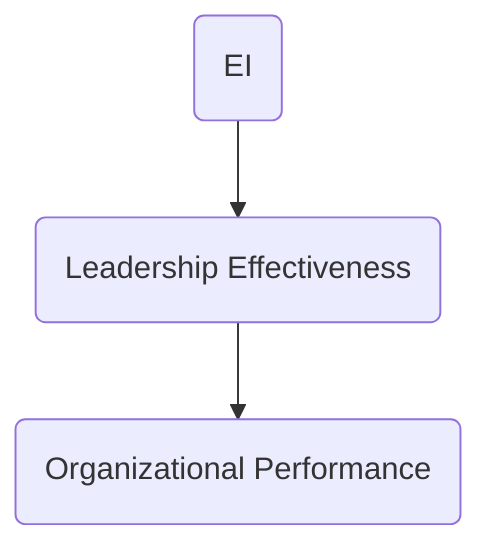
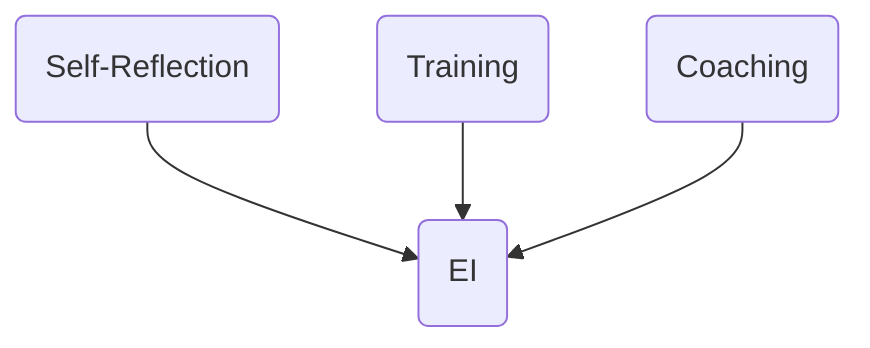
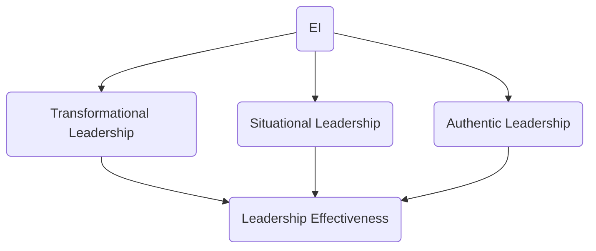
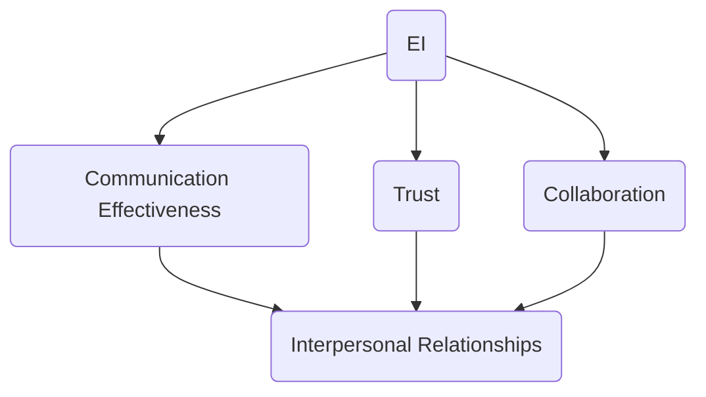
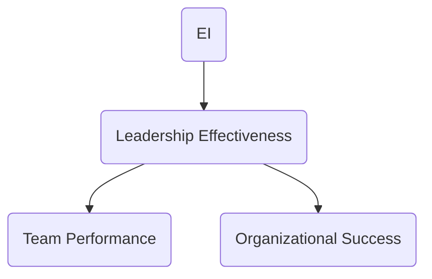
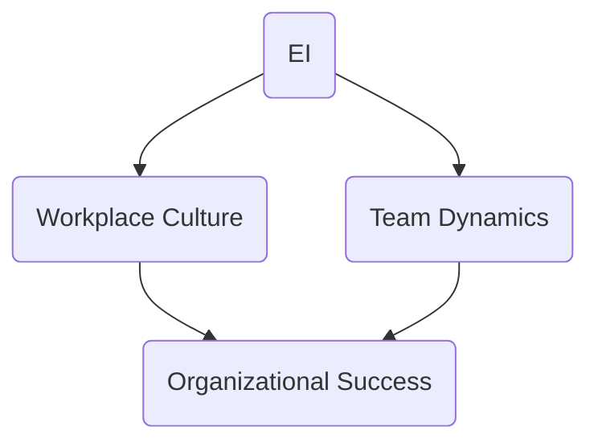

                 


### Introduction to Leadership and Emotional Intelligence

**Keywords**: Leadership, Emotional Intelligence, Interpersonal Influence, Organizational Effectiveness

**Abstract**: 
This article delves into the crucial intersection of leadership and emotional intelligence (EI), exploring how these two elements collectively enhance interpersonal influence within modern organizations. By dissecting the core concepts and practical applications, we aim to provide a comprehensive guide that highlights the significance of EI in leadership roles and how it can be developed and harnessed for greater organizational success.

#### Background Introduction

Leadership is the guiding force that shapes the behavior, attitude, and performance of individuals within a team or organization. It involves the ability to inspire and motivate others, make strategic decisions, and manage resources effectively. Emotional intelligence, on the other hand, refers to the capacity to understand, manage, and effectively express one's own emotions, as well as to engage and navigate successfully in interpersonal relationships.

In the contemporary business landscape, the demand for leaders who possess high emotional intelligence has escalated. The complexity and rapid pace of change in today's organizations necessitate leaders who can not only direct and control but also adapt and respond to dynamic environments. Emotional intelligence equips leaders with the skills to build trust, foster collaboration, and lead with empathy, thereby enhancing overall organizational effectiveness.

**Problem Background and Description**

The challenge lies in the gap between the traditional leadership models and the evolving needs of modern organizations. Traditional leadership has often focused on traits such as decisiveness, confidence, and authority. While these qualities are still valuable, they are no longer sufficient in today's complex and fast-paced work environments. Leaders today must be able to navigate the intricacies of human emotions and interpersonal relationships, which requires a higher level of emotional intelligence.

The problem can be summarized as follows: How can leaders effectively integrate emotional intelligence into their leadership style to enhance their interpersonal influence and drive organizational success? The solution involves a deep understanding of the core components of emotional intelligence, the development of these skills, and the strategic application of EI in leadership practices.

**Solutions**

To address this problem, leaders must first grasp the fundamental concepts and structures of emotional intelligence. This involves understanding the different dimensions of EI, such as self-awareness, self-regulation, social skills, and empathy. Each dimension plays a crucial role in shaping a leader's ability to connect with team members, resolve conflicts, and inspire high performance.

**Boundaries and Extensions**

It is important to note that while emotional intelligence is a critical skill for leaders, it is not a panacea. Leaders must also possess other competencies, such as strategic thinking, decision-making skills, and technical expertise. Emotional intelligence should be seen as a complementary skill that enhances a leader's overall effectiveness.

**Conceptual Structure and Core Elements**

The core structure of emotional intelligence can be represented using a Mermaid ER diagram:

```mermaid
erDiagram
  Person ||--|{ Emotional Intelligence}: Has EI Traits --> EI_Traits
  EI_Traits ||--|{ Self-Awareness}: Composed of --> Awareness_Elements
  EI_Traits ||--|{ Self-Regulation}: Composed of --> Regulation_Elements
  EI_Traits ||--|{ Social Skills}: Composed of --> Social_Skills
  EI_Traits ||--|{ Empathy}: Composed of --> Empathy_Elements
```

**Algorithm Principles and Mathematical Models**

To understand the impact of emotional intelligence on leadership, we can model the relationship between EI and leadership effectiveness using a mathematical model. Let's denote EI as E, leadership effectiveness as L, and the organizational success factor as S. The model can be represented as:

$$ S = f(E, L) $$

where f is a function that captures the nonlinear relationship between EI and leadership effectiveness, which in turn drives organizational success.



**System Analysis and Design**

In practical terms, the integration of emotional intelligence into leadership practices involves several steps:

1. **Awareness and Assessment**: Leaders must first become aware of their emotional intelligence strengths and weaknesses. This can be achieved through self-assessment tools and 360-degree feedback.

2. **Development and Training**: Once the areas for improvement are identified, leaders can engage in targeted training and development programs to enhance their emotional intelligence.

3. **Application in Leadership Practices**: Leaders must then integrate emotional intelligence into their daily leadership practices, such as communication, decision-making, and conflict resolution.

4. **Continuous Improvement**: Emotional intelligence is not a static skill; it requires continuous development and refinement. Leaders should regularly reflect on their actions and seek feedback to ensure ongoing improvement.

**Practical Applications and Case Studies**

To illustrate the practical application of emotional intelligence in leadership, let's consider a case study of a senior manager who implemented EI principles to improve team performance:

1. **Initial Assessment**: The manager conducted a self-assessment and received feedback from team members, identifying areas such as empathy and conflict resolution as key development areas.

2. **Training and Development**: The manager participated in EI training programs and engaged in coaching sessions to develop these skills.

3. **Application in Practice**: The manager started incorporating empathy into team meetings, actively listening to team members' perspectives and addressing their concerns. In conflict situations, the manager employed strategies such as active listening and compromise to resolve issues.

4. **Results**: Over time, the team's performance improved, and trust and collaboration among team members increased. The manager's leadership effectiveness was positively impacted, leading to greater organizational success.

**Conclusion and Future Directions**

In conclusion, emotional intelligence is a critical component of effective leadership in today's complex and dynamic organizational environments. Leaders who develop and apply emotional intelligence can enhance their interpersonal influence, build stronger relationships, and drive organizational success. Future research and practice should focus on exploring the long-term impacts of emotional intelligence on leadership effectiveness and organizational outcomes.

---

In the next section, we will delve deeper into the importance of emotional intelligence in leadership and explore the practical strategies for developing these essential skills. Stay tuned!

---

### The Importance of Emotional Intelligence in Leadership

**Keywords**: Emotional Intelligence, Leadership Effectiveness, Trust, Collaboration, Organizational Culture

**Abstract**: 
This section explores the pivotal role emotional intelligence (EI) plays in enhancing leadership effectiveness. By examining the core components of EI and their impact on trust, collaboration, and organizational culture, we aim to highlight why leaders must prioritize the development of emotional intelligence to succeed in today's complex business landscape.

#### Background Introduction

Leadership is not merely about positional power or strategic decisions; it is fundamentally about the relationships leaders build with their team members. Emotional intelligence serves as the cornerstone of these relationships, enabling leaders to foster a positive work environment, build trust, and drive collaboration. In this section, we will delve into the core concepts of emotional intelligence, specifically focusing on self-awareness, self-regulation, social skills, and empathy, and how these dimensions contribute to leadership effectiveness.

**Problem Background and Description**

The traditional view of leadership has often emphasized traits such as confidence, assertiveness, and decisiveness. However, these traits alone are insufficient in the modern organizational context. Leaders today must be able to navigate the emotional landscape of their teams, understand the needs and motivations of their employees, and effectively manage interpersonal relationships. This is where emotional intelligence becomes crucial. The problem can be framed as follows: How does emotional intelligence enhance leadership effectiveness, and what are the specific ways in which EI components impact leadership outcomes?

**Solutions**

To answer this question, we must first understand the core components of emotional intelligence and their significance in leadership. Emotional intelligence consists of four primary dimensions:

1. **Self-Awareness**: This dimension involves the ability to recognize and understand one's own emotions, as well as their impact on thoughts and behaviors. Self-awareness enables leaders to be mindful of their emotional reactions and how they may influence their decision-making and interactions with others.

2. **Self-Regulation**: Self-regulation is the skill of managing and controlling one's emotions, particularly in stressful or challenging situations. Leaders with high self-regulation can maintain composure, think critically, and make sound decisions even under pressure.

3. **Social Skills**: Social skills refer to the ability to communicate effectively, build relationships, and work collaboratively with others. Leaders with strong social skills can navigate interpersonal dynamics, mediate conflicts, and build a cohesive team culture.

4. **Empathy**: Empathy is the capacity to understand and share the feelings of others. Leaders who are empathetic can connect with their team members on an emotional level, build trust, and foster a supportive and inclusive work environment.

Each of these dimensions plays a critical role in enhancing leadership effectiveness. Let's explore how:

1. **Self-Awareness**: Self-awareness allows leaders to recognize their emotional triggers and how their emotions may affect their leadership behaviors. This awareness enables leaders to make more balanced and objective decisions, avoid impulsive actions, and better manage their stress levels. For example, a self-aware leader may notice that they become defensive when facing criticism and take proactive steps to manage this reaction, such as practicing mindfulness or seeking feedback from trusted colleagues.

2. **Self-Regulation**: Leaders who excel in self-regulation are better equipped to handle high-pressure situations and maintain their focus and effectiveness. They can manage their emotions, even in the face of setbacks or failures, which helps maintain team morale and prevents negative emotions from spilling over into the workplace. This ability to stay calm and composed also allows leaders to lead by example, demonstrating resilience and fostering a culture of adaptability and perseverance.

3. **Social Skills**: Strong social skills enable leaders to build and maintain positive relationships with their team members. This includes effective communication, active listening, and the ability to read and respond to non-verbal cues. Leaders with high social skills can create a collaborative and inclusive work environment, where team members feel valued and supported. This, in turn, enhances team cohesion, reduces conflict, and increases overall productivity.

4. **Empathy**: Empathy allows leaders to connect with their team members on a deeper emotional level, understanding their perspectives, challenges, and motivations. This connection builds trust and respect, which are essential for effective leadership. Empathetic leaders are more likely to understand the emotional needs of their team members, provide appropriate support, and create a work environment that promotes well-being and engagement.

**Algorithm Principles and Mathematical Models**

To quantify the impact of emotional intelligence on leadership effectiveness, we can develop a mathematical model that represents the relationship between EI and leadership outcomes. Let's denote EI as E, leadership effectiveness as L, and the overall organizational performance factor as P. The model can be expressed as:

$$ P = f(E, L) $$

where f captures the complex interactions between EI and leadership effectiveness, which together influence organizational performance.



**System Analysis and Design**

The integration of emotional intelligence into leadership practices requires a systematic approach. Here are the key steps:

1. **Awareness and Assessment**: Leaders must first become aware of their emotional intelligence strengths and weaknesses through self-assessment and feedback from peers and team members.

2. **Development and Training**: Once the areas for improvement are identified, leaders can engage in targeted development programs, such as EI training, coaching, and workshops.

3. **Application in Leadership Practices**: Leaders must integrate emotional intelligence into their daily leadership activities, such as communication, decision-making, and conflict resolution.

4. **Continuous Improvement**: Emotional intelligence is a skill that requires ongoing development and refinement. Leaders should regularly seek feedback, reflect on their actions, and adapt their leadership strategies to maintain and enhance their emotional intelligence.

**Practical Applications and Case Studies**

To illustrate the practical application of emotional intelligence in leadership, consider the following case study:

**Case Study: The Empathetic Manager**

A manager in a large tech company noticed a decline in team morale and productivity. Through self-assessment and feedback from team members, the manager identified a lack of empathy as a key factor. The manager then engaged in EI training, learning techniques for active listening, emotional recognition, and empathetic communication.

**Steps Taken**:

1. **Active Listening**: The manager started practicing active listening during team meetings, giving full attention to team members' contributions and ensuring they felt heard and valued.

2. **Emotional Recognition**: The manager learned to recognize and respond to the emotions behind team members' comments, showing genuine concern and offering support when needed.

3. **Empathetic Communication**: The manager adopted a more empathetic communication style, using positive reinforcement and constructive feedback to motivate and support team members.

**Results**:

Over time, the team's morale improved, and productivity increased. Team members felt more valued and supported, leading to higher engagement and job satisfaction. The manager's leadership effectiveness also improved, as evidenced by positive feedback from team members and improved team performance metrics.

**Conclusion and Future Directions**

In conclusion, emotional intelligence is a critical component of effective leadership. Leaders who develop and apply emotional intelligence can enhance their ability to build trust, foster collaboration, and drive organizational success. Future research and practice should focus on identifying the specific mechanisms through which EI enhances leadership effectiveness and exploring ways to integrate EI development into leadership training programs.

In the next section, we will delve into the practical strategies for developing emotional intelligence in leaders. Stay tuned to discover actionable steps and techniques that can transform leadership practices and enhance interpersonal influence.

---

### Developing Emotional Intelligence

**Keywords**: Emotional Intelligence, Leadership Development, Self-Reflection, Training Programs, Coaching

**Abstract**: 
This section explores the practical strategies and techniques for developing emotional intelligence (EI) in leaders. By discussing the importance of self-reflection, training programs, and coaching, we aim to provide a comprehensive guide that helps leaders enhance their emotional intelligence and, consequently, their leadership effectiveness.

#### Background Introduction

Emotional intelligence is a multifaceted skill that requires continuous development and refinement. Leaders who aspire to enhance their EI must adopt a proactive approach that includes self-reflection, targeted training, and ongoing support. This section will delve into the key components of developing emotional intelligence, providing actionable steps and strategies that leaders can implement to improve their self-awareness, self-regulation, social skills, and empathy.

**Problem Background and Description**

The challenge lies in the gap between recognizing the importance of emotional intelligence and effectively developing and applying these skills in leadership practices. Many leaders may understand the theoretical benefits of EI but struggle to integrate it into their daily work. The problem can be framed as follows: How can leaders effectively develop their emotional intelligence to enhance their leadership effectiveness and interpersonal influence?

**Solutions**

To address this problem, leaders must adopt a structured approach to developing emotional intelligence. This involves recognizing the key components of EI, understanding the role of self-reflection, and engaging in targeted training and coaching programs. Let's explore these components in detail:

**Self-Reflection**

Self-reflection is the cornerstone of emotional intelligence development. It involves regularly assessing one's emotions, thoughts, and behaviors, as well as their impact on others. Leaders who practice self-reflection can gain deeper insights into their emotional triggers, biases, and patterns of behavior. This awareness is essential for developing self-awareness and self-regulation.

**Steps for Self-Reflection**:

1. **Regular Journaling**: Keeping a journal can help leaders track their emotions, thoughts, and actions over time, identifying patterns and areas for improvement.
2. **Mindfulness Practices**: Engaging in mindfulness practices, such as meditation or deep breathing exercises, can enhance self-awareness and reduce stress.
3. **Seeking Feedback**: Actively seeking feedback from peers, team members, and mentors can provide valuable insights into one's emotional intelligence strengths and weaknesses.
4. **Reflective Discussions**: Participating in reflective discussions with trusted colleagues or mentors can facilitate deeper self-reflection and provide different perspectives on one's behavior and impact.

**Training Programs**

Targeted training programs are another critical component of developing emotional intelligence. These programs can provide leaders with the knowledge, skills, and tools necessary to enhance their self-awareness, self-regulation, social skills, and empathy. Here are some effective training programs and techniques:

1. **Emotional Intelligence Workshops**: Workshops focused on EI can provide practical strategies and techniques for developing emotional intelligence. These workshops often include interactive exercises, role-playing, and group discussions.
2. **Mindfulness Training**: Mindfulness training can help leaders develop self-regulation skills and improve their ability to manage stress and emotional reactions. Techniques such as mindfulness meditation, yoga, and guided relaxation can be incorporated into leadership training programs.
3. **Coaching and Mentoring**: Coaching and mentoring relationships can provide leaders with personalized support and guidance as they develop their emotional intelligence. Coaches and mentors can help leaders identify areas for improvement, set goals, and provide constructive feedback.
4. **E-Learning Platforms**: Online e-learning platforms offer convenient and accessible resources for leaders to develop their emotional intelligence. These platforms often include self-paced courses, videos, and interactive modules.

**Coaching**

Coaching is a powerful tool for developing emotional intelligence. A coach can provide leaders with a safe space to explore their emotions, challenge their assumptions, and develop new skills. Here are some key aspects of coaching for emotional intelligence development:

1. **Objective Assessment**: Coaches can help leaders objectively assess their emotional intelligence strengths and weaknesses through assessments and feedback.
2. **Personalized Development Plans**: Coaches work with leaders to create personalized development plans that target their specific areas for improvement.
3. **Practical Application**: Coaches provide leaders with opportunities to practice new skills in real-time, offering guidance and support as they navigate challenges.
4. **Continuous Support**: Ongoing coaching support can help leaders sustain their emotional intelligence development and make lasting changes to their leadership practices.

**Algorithm Principles and Mathematical Models**

To understand the development of emotional intelligence, we can create a mathematical model that represents the relationship between self-reflection, training, and coaching. Let's denote EI as E, self-reflection as S, training as T, and coaching as C. The model can be expressed as:

$$ E = f(S, T, C) $$

where f captures the interactive effects of self-reflection, training, and coaching on emotional intelligence development.



**System Analysis and Design**

The development of emotional intelligence requires a systematic approach that integrates self-reflection, training, and coaching. Here's a step-by-step guide:

1. **Initial Assessment**: Leaders begin by assessing their current emotional intelligence through self-assessment tools and feedback from peers and team members.
2. **Self-Reflection and Goal Setting**: Leaders engage in regular self-reflection, identifying areas for improvement and setting specific, measurable goals.
3. **Training Programs**: Leaders participate in targeted training programs that focus on developing emotional intelligence, such as workshops, e-learning courses, or mindfulness training.
4. **Coaching Relationships**: Leaders establish coaching relationships with mentors or professional coaches to provide ongoing support and guidance as they develop their EI.
5. **Application and Practice**: Leaders apply their newfound EI skills in their daily leadership practices, seeking feedback and making adjustments as needed.
6. **Continuous Improvement**: Leaders continue to engage in self-reflection, training, and coaching to sustain and enhance their emotional intelligence.

**Practical Applications and Case Studies**

To illustrate the practical application of developing emotional intelligence, consider the following case study:

**Case Study: The Proactive Leader**

A senior manager in a multinational corporation recognized the importance of emotional intelligence in leadership. To develop her EI, she took the following steps:

1. **Initial Assessment**: She completed an EI assessment and sought feedback from her team members to identify her strengths and areas for improvement.
2. **Self-Reflection and Goal Setting**: She regularly reflected on her emotions and behaviors, setting specific goals to enhance her self-awareness, self-regulation, social skills, and empathy.
3. **Training Programs**: She participated in EI workshops and mindfulness training programs to develop her emotional intelligence.
4. **Coaching Relationships**: She established a coaching relationship with a professional coach who helped her identify and overcome her emotional triggers and improve her communication skills.
5. **Application and Practice**: She applied her new EI skills in her daily leadership practices, actively practicing self-reflection, active listening, and empathetic communication.
6. **Continuous Improvement**: She continued to engage in self-reflection, coaching, and training to sustain and enhance her emotional intelligence.

**Results**:

Over time, the manager's leadership effectiveness improved significantly. She built stronger relationships with her team members, fostered a positive and inclusive work culture, and achieved greater success in her projects. Her self-assessment and feedback scores also showed significant improvement in emotional intelligence dimensions.

**Conclusion and Future Directions**

In conclusion, developing emotional intelligence is a crucial step for leaders who aspire to enhance their leadership effectiveness and interpersonal influence. By adopting a structured approach that includes self-reflection, targeted training, and coaching, leaders can continuously improve their emotional intelligence and drive organizational success. Future research and practice should focus on identifying the most effective strategies for developing emotional intelligence and exploring how these strategies can be integrated into leadership development programs.

In the next section, we will delve into the various leadership styles and explore how emotional intelligence influences and shapes these styles. Stay tuned to discover how leaders can leverage their EI to adapt their leadership approach and achieve optimal results.

---

### Leadership Styles and Emotional Intelligence

**Keywords**: Leadership Styles, Emotional Intelligence, Transformational Leadership, Situational Leadership, Authentic Leadership

**Abstract**: 
This section examines the relationship between leadership styles and emotional intelligence (EI). By exploring different leadership styles, such as transformational, situational, and authentic leadership, and how EI influences and enhances each style, we aim to provide leaders with insights into how they can effectively leverage their emotional intelligence to drive organizational success.

#### Background Introduction

Leadership styles play a critical role in shaping the behavior, attitudes, and performance of individuals within an organization. Traditional leadership styles, such as autocratic and democratic leadership, have been widely studied and applied. However, contemporary research highlights the importance of emotional intelligence in enhancing the effectiveness of various leadership styles. This section will delve into three key leadership styles—transformational, situational, and authentic leadership—and explore how emotional intelligence influences and enhances each style.

**Problem Background and Description**

The challenge lies in understanding how emotional intelligence can be integrated into different leadership styles to maximize their effectiveness. Leaders must navigate the complexities of modern organizational environments, where the ability to connect with, motivate, and inspire team members is crucial. The problem can be framed as follows: How does emotional intelligence influence and enhance different leadership styles, and what are the specific benefits of applying EI in each style?

**Solutions**

To address this problem, we must first understand the core principles of each leadership style and how emotional intelligence can be applied to enhance their effectiveness. Let's explore each style in detail:

**Transformational Leadership**

Transformational leadership is characterized by the leader's ability to inspire and motivate followers to achieve their full potential. This style focuses on developing and nurturing the individual growth of team members, fostering a shared vision, and promoting innovation and change.

**How Emotional Intelligence Enhances Transformational Leadership**:

1. **Inspiration and Motivation**: Leaders with high emotional intelligence can inspire and motivate their team members by understanding their individual needs, strengths, and motivations. They can communicate a compelling vision and create an environment that fosters passion and commitment.

2. **Empathy and Connection**: Emotional intelligence enables transformational leaders to connect with their team members on an emotional level, building trust and rapport. This connection fosters a sense of belonging and loyalty, which is essential for driving team performance and innovation.

3. **Change Management**: Leaders with high emotional intelligence are adept at managing change and navigating organizational transitions. They can effectively communicate the reasons for change, address the emotional reactions of team members, and build support for new initiatives.

**Situational Leadership**

Situational leadership is a style that emphasizes adapting leadership approaches based on the specific needs and characteristics of the team and situation. This style involves flexibility and the ability to switch between different leadership behaviors, such as directing, coaching, supporting, and delegating.

**How Emotional Intelligence Enhances Situational Leadership**:

1. **Adaptability**: Emotional intelligence enables situational leaders to remain flexible and adaptive in their leadership approach. They can effectively assess the emotional and social dynamics of different situations and adjust their behavior accordingly to achieve optimal results.

2. **Empathy and Understanding**: Leaders with high emotional intelligence can empathize with their team members and understand their emotional needs and concerns. This understanding allows them to tailor their leadership approach to meet the unique needs of different team members and situations.

3. **Conflict Resolution**: Situational leaders often face conflicts and challenges that require emotional intelligence to navigate effectively. Leaders with high EI skills can manage conflicts by actively listening, understanding different perspectives, and finding mutually beneficial solutions.

**Authentic Leadership**

Authentic leadership is characterized by the leader's commitment to being true to themselves and their values. This style emphasizes transparency, integrity, and trust-building, fostering a positive organizational culture.

**How Emotional Intelligence Enhances Authentic Leadership**:

1. **Self-Awareness and Integrity**: Emotional intelligence enhances a leader's self-awareness, enabling them to be authentic and transparent in their actions and communications. They can align their behaviors with their values, fostering trust and respect among team members.

2. **Empathy and Connection**: Leaders with high emotional intelligence can build deep connections with their team members by understanding and acknowledging their emotions. This connection fosters trust and a shared sense of purpose, enhancing team cohesion and collaboration.

3. **Moral Leadership**: Emotional intelligence enables authentic leaders to demonstrate moral leadership by addressing ethical dilemmas and upholding organizational values. They can inspire and motivate their team members to act with integrity and make ethical decisions.

**Algorithm Principles and Mathematical Models**

To understand the relationship between leadership styles and emotional intelligence, we can create a mathematical model that captures the interplay between EI and different leadership styles. Let's denote EI as E, transformational leadership as T, situational leadership as S, and authentic leadership as A. The model can be expressed as:

$$ \text{Leadership Effectiveness} = f(E, T, S, A) $$

where f captures the complex interactions between emotional intelligence and different leadership styles, resulting in enhanced leadership effectiveness.



**System Analysis and Design**

The integration of emotional intelligence into different leadership styles requires a systematic approach. Here's a step-by-step guide:

1. **Assessment**: Leaders begin by assessing their current emotional intelligence and understanding their strengths and weaknesses.
2. **Self-Reflection**: Leaders engage in regular self-reflection to develop self-awareness and integrity, which are essential for authentic leadership.
3. **Flexibility and Adaptability**: Leaders practice flexibility and adaptability in their leadership approach, leveraging their emotional intelligence to navigate different situations effectively.
4. **Empathy and Connection**: Leaders focus on building empathy and connection with their team members, fostering trust and collaboration.
5. **Moral Leadership**: Leaders demonstrate moral leadership by addressing ethical dilemmas and upholding organizational values.
6. **Continuous Improvement**: Leaders continuously seek feedback, engage in training, and practice self-reflection to enhance their emotional intelligence and leadership effectiveness.

**Practical Applications and Case Studies**

To illustrate the practical application of emotional intelligence in different leadership styles, consider the following case study:

**Case Study: The Adaptive Leader**

A mid-level manager in a rapidly growing startup company recognized the importance of emotional intelligence in navigating the company's growth. To enhance her leadership effectiveness, she took the following steps:

1. **Assessment**: She completed an EI assessment to understand her emotional intelligence strengths and weaknesses.
2. **Self-Reflection**: She engaged in regular self-reflection, focusing on developing self-awareness and integrity.
3. **Flexibility and Adaptability**: She adapted her leadership approach based on the company's evolving needs and the emotional dynamics of her team.
4. **Empathy and Connection**: She built strong connections with her team members by understanding their emotions and providing support.
5. **Moral Leadership**: She demonstrated moral leadership by addressing ethical dilemmas and upholding the company's values.
6. **Continuous Improvement**: She sought feedback, engaged in training, and continued to practice self-reflection to enhance her emotional intelligence and leadership effectiveness.

**Results**:

Over time, the manager's leadership effectiveness improved significantly. She fostered a positive and inclusive work culture, built strong relationships with her team members, and successfully navigated the company through periods of growth and change. Her team's performance and morale also improved, contributing to the overall success of the organization.

**Conclusion and Future Directions**

In conclusion, emotional intelligence plays a crucial role in enhancing the effectiveness of different leadership styles. Leaders who develop and apply their emotional intelligence can inspire, motivate, and connect with their team members, driving organizational success. Future research and practice should focus on identifying the specific ways in which emotional intelligence influences and enhances different leadership styles and exploring how these insights can be applied in diverse organizational contexts.

In the next section, we will delve into the impact of emotional intelligence on interpersonal relationships and explore how leaders can leverage their EI to build stronger, more effective relationships. Stay tuned to discover the importance of emotional intelligence in fostering positive and productive workplace connections.

---

### Emotional Intelligence and Interpersonal Relationships

**Keywords**: Emotional Intelligence, Interpersonal Relationships, Communication, Trust, Collaboration

**Abstract**: 
This section explores the profound impact of emotional intelligence (EI) on interpersonal relationships in the workplace. By examining how EI enhances communication, trust, and collaboration, we aim to provide leaders with practical insights and strategies to leverage their emotional intelligence to build stronger, more effective relationships with their team members and stakeholders.

#### Background Introduction

Interpersonal relationships are the cornerstone of effective teamwork and organizational success. In a workplace setting, the quality of interpersonal relationships directly influences communication, trust, and collaboration. Emotional intelligence plays a critical role in shaping these relationships, enabling leaders to connect with their team members on a deeper emotional level, foster trust, and drive collaboration. This section will delve into the key aspects of emotional intelligence and how they enhance interpersonal relationships.

**Problem Background and Description**

The challenge lies in building and maintaining healthy interpersonal relationships in the complex and fast-paced work environment. Leaders often face barriers such as communication breakdowns, trust issues, and conflict, which can hinder team performance and organizational success. The problem can be framed as follows: How can leaders leverage their emotional intelligence to enhance interpersonal relationships, fostering a positive and productive workplace environment?

**Solutions**

To address this problem, leaders must develop and apply their emotional intelligence in various aspects of interpersonal relationships. Here are the key areas where emotional intelligence makes a significant impact:

**Enhancing Communication**

Effective communication is essential for building and maintaining strong interpersonal relationships. Emotional intelligence enhances communication by enabling leaders to:

1. **Active Listening**: Leaders with high emotional intelligence practice active listening, paying full attention to what others are saying and understanding their emotions and perspectives. This creates a safe and supportive environment for open and honest communication.

2. **Clear Expression**: Emotional intelligence helps leaders express their thoughts and feelings clearly and effectively. They can articulate their messages with empathy and emotional awareness, reducing the likelihood of misunderstandings and conflicts.

3. **Non-Verbal Communication**: Leaders with high emotional intelligence are adept at reading and responding to non-verbal cues, such as body language and facial expressions. This enables them to understand the underlying emotions of their team members and adjust their communication style accordingly.

**Building Trust**

Trust is the foundation of healthy interpersonal relationships. Emotional intelligence plays a crucial role in building trust by:

1. **Consistency**: Leaders who consistently demonstrate integrity, honesty, and reliability build trust with their team members. Emotional intelligence helps leaders remain consistent in their actions and decisions, reinforcing trust and confidence.

2. **Empathy**: Leaders with high emotional intelligence can understand and share the feelings of their team members, demonstrating empathy and compassion. This fosters trust and creates a sense of connection and understanding.

3. **Confidentiality**: Leaders who respect confidentiality and handle sensitive information with care build trust and demonstrate their commitment to their team members' well-being. Emotional intelligence helps leaders navigate complex situations and maintain trust in difficult conversations.

**Fostering Collaboration**

Collaboration is essential for achieving organizational goals and driving innovation. Emotional intelligence enhances collaboration by:

1. **Team Awareness**: Leaders with high emotional intelligence are aware of their team members' strengths, weaknesses, and emotional states. This awareness allows them to create a collaborative environment that leverages individual contributions and addresses potential conflicts.

2. **Conflict Resolution**: Leaders with high emotional intelligence are skilled at resolving conflicts and misunderstandings. They can navigate disagreements by understanding the underlying emotions and finding mutually beneficial solutions.

3. **Inclusivity**: Emotional intelligence enables leaders to foster an inclusive environment where all team members feel valued and respected. They can actively involve team members in decision-making processes and encourage diverse perspectives, enhancing collaboration and innovation.

**Algorithm Principles and Mathematical Models**

To understand the impact of emotional intelligence on interpersonal relationships, we can create a mathematical model that captures the interplay between EI and key relationship dimensions. Let's denote EI as E, communication effectiveness as C, trust as T, and collaboration as Co. The model can be expressed as:

$$ \text{Interpersonal Relationships} = f(E, C, T, Co) $$

where f captures the complex interactions between emotional intelligence and the key relationship dimensions.



**System Analysis and Design**

The integration of emotional intelligence into interpersonal relationships requires a systematic approach. Here's a step-by-step guide:

1. **Self-Assessment**: Leaders begin by assessing their current emotional intelligence and identifying areas for improvement.
2. **Active Listening**: Leaders practice active listening, paying attention to the emotions and needs of their team members.
3. **Clear Expression**: Leaders communicate their thoughts and feelings clearly and effectively, using empathy and emotional awareness.
4. **Conflict Resolution**: Leaders navigate conflicts by understanding the underlying emotions and finding mutually beneficial solutions.
5. **Building Trust**: Leaders demonstrate consistency, empathy, and confidentiality to build trust with their team members.
6. **Fostering Collaboration**: Leaders create an inclusive environment that encourages diverse perspectives and active participation.
7. **Continuous Improvement**: Leaders continuously seek feedback and engage in training to enhance their emotional intelligence and interpersonal relationships.

**Practical Applications and Case Studies**

To illustrate the practical application of emotional intelligence in interpersonal relationships, consider the following case study:

**Case Study: The Empathetic Leader**

A team leader in a large tech company noticed a decline in team morale and collaboration. To address these issues, the leader engaged in EI training and adopted the following strategies:

1. **Active Listening**: The leader started practicing active listening during team meetings, ensuring that all team members felt heard and valued.
2. **Clear Expression**: The leader communicated their expectations and feedback clearly and empathetically, focusing on the emotions and needs of the team members.
3. **Conflict Resolution**: The leader navigated conflicts by understanding the underlying emotions and finding mutually beneficial solutions.
4. **Building Trust**: The leader demonstrated consistency and empathy, building trust with the team members.
5. **Fostering Collaboration**: The leader created an inclusive environment where team members felt valued and encouraged to share their ideas.

**Results**:

Over time, the team's morale improved significantly, and collaboration increased. Team members felt more valued and supported, leading to higher engagement and productivity. The team leader's leadership effectiveness also improved, as evidenced by positive feedback from team members and improved team performance metrics.

**Conclusion and Future Directions**

In conclusion, emotional intelligence plays a crucial role in enhancing interpersonal relationships in the workplace. Leaders who develop and apply their emotional intelligence can build stronger, more effective relationships with their team members, fostering a positive and productive work environment. Future research and practice should focus on identifying the specific mechanisms through which emotional intelligence influences interpersonal relationships and exploring how these insights can be applied in diverse organizational contexts.

In the next section, we will delve into real-world case studies and examples of leadership and emotional intelligence in action. Stay tuned to discover practical insights and lessons from successful leaders who have harnessed their emotional intelligence to drive organizational success.

---

### Case Studies in Leadership and Emotional Intelligence

**Keywords**: Leadership Case Studies, Emotional Intelligence, Success Stories, Practical Insights

**Abstract**: 
This section presents real-world case studies and examples of leaders who have successfully harnessed their emotional intelligence to drive organizational success. By analyzing these case studies, we aim to provide practical insights and actionable strategies that leaders can apply to enhance their emotional intelligence and leadership effectiveness.

#### Background Introduction

Leadership is a complex and dynamic endeavor that requires a deep understanding of oneself and others. Emotional intelligence (EI) is a critical component of effective leadership, enabling leaders to build strong relationships, foster a positive work culture, and drive organizational success. This section will delve into several real-world case studies that highlight the impact of emotional intelligence on leadership and provide practical lessons for leaders looking to enhance their EI skills.

**Problem Background and Description**

The challenge in leadership is navigating the complex interplay of emotions, relationships, and organizational dynamics. Traditional leadership approaches often focus on traits such as authority, decisiveness, and charisma, but modern organizations require leaders who can also demonstrate empathy, self-awareness, and emotional regulation. The problem can be framed as follows: How can leaders effectively develop and apply their emotional intelligence to enhance their leadership effectiveness and drive organizational success?

**Solutions**

To address this problem, we will analyze several case studies that illustrate how leaders have leveraged their emotional intelligence to overcome challenges, build strong teams, and achieve their organizational goals. Here are the case studies we will explore:

1. **Case Study 1: The Empathetic CEO**
2. **Case Study 2: The Adaptive Leader**
3. **Case Study 3: The Authentic Manager**
4. **Case Study 4: The Transformational Team Leader**

**Case Study 1: The Empathetic CEO**

**Background**: 
John, the CEO of a mid-sized technology company, faced increasing pressure from the market and competitors. He noticed that his team was becoming stressed and demotivated, which was impacting their performance and innovation.

**Steps Taken**:

1. **Self-Assessment**: John completed an EI assessment and received feedback from his team members to identify his emotional intelligence strengths and weaknesses.
2. **Active Listening**: John began actively listening to his team members, genuinely hearing their concerns and ideas. He created an open-door policy to encourage open communication.
3. **Empathy and Support**: John demonstrated empathy by acknowledging his team members' stress and providing support. He organized team-building activities and instituted flexible work arrangements to help employees balance their work and personal lives.
4. **Mentorship**: John took on a mentorship role, guiding and supporting his team members in their professional development. This helped build trust and fostered a sense of loyalty and commitment.

**Results**:

Over time, John's team's morale improved, and their performance and innovation increased. The company saw a reduction in turnover rates, and employees felt valued and supported. John's leadership effectiveness and emotional intelligence were significantly enhanced, leading to greater organizational success.

**Case Study 2: The Adaptive Leader**

**Background**: 
Sarah, a project manager at a global consulting firm, was leading a high-stakes project involving multiple international teams. The project faced delays and conflicts due to cultural differences and changing client requirements.

**Steps Taken**:

1. **Self-Reflection**: Sarah engaged in regular self-reflection to enhance her self-awareness and emotional regulation.
2. **Adaptability**: Sarah adapted her leadership style to the specific needs and cultural contexts of each team. She used her emotional intelligence to navigate cultural differences and build trust among team members.
3. **Conflict Resolution**: Sarah employed conflict resolution techniques, such as active listening and mediation, to address conflicts and maintain team cohesion.
4. **Flexibility**: Sarah remained flexible and open to feedback, making adjustments to the project plan as needed to address changing requirements.

**Results**:

Sarah's adaptive leadership approach helped the project overcome obstacles and stay on track. The team's collaboration improved, and the project was completed successfully within the desired timeline. Sarah's emotional intelligence and leadership effectiveness were recognized by her clients and peers, leading to increased trust and credibility in the organization.

**Case Study 3: The Authentic Manager**

**Background**: 
David, a manager in a creative agency, struggled to inspire his team and build a positive work culture. His team was disengaged, and there was a lack of trust and transparency in the organization.

**Steps Taken**:

1. **Self-Assessment**: David completed an EI assessment and sought feedback from his team members to understand his emotional intelligence strengths and weaknesses.
2. **Authenticity**: David focused on being authentic in his leadership, being true to his values and beliefs. He communicated openly with his team, sharing his vision and goals.
3. **Trust-Building**: David demonstrated trust and integrity by consistently delivering on his commitments and being transparent in his actions.
4. **Support**: David provided emotional support to his team members, fostering a sense of trust and belonging.

**Results**:

Over time, David's team became more engaged and motivated. Trust and transparency increased within the organization, leading to a positive work culture. The team's performance improved, and the agency saw increased client satisfaction and success. David's leadership effectiveness and emotional intelligence were instrumental in driving these positive outcomes.

**Case Study 4: The Transformational Team Leader**

**Background**: 
Julie, a team leader in a healthcare organization, was tasked with leading a team of nurses and doctors during a pandemic. The team faced immense stress and emotional challenges, and there was a need to inspire resilience and unity.

**Steps Taken**:

1. **Inspiration and Vision**: Julie communicated a compelling vision for the team, emphasizing the importance of their work and the impact they were making. She inspired her team to overcome challenges and maintain their resilience.
2. **Empathy and Connection**: Julie demonstrated empathy and connected with her team members on an emotional level, understanding their concerns and providing support. She organized team meetings to foster open communication and emotional support.
3. **Development and Growth**: Julie invested in her team's professional development, providing training and resources to enhance their skills and confidence.
4. **Inclusion**: Julie created an inclusive environment where all team members felt valued and respected. She encouraged diverse perspectives and involvement in decision-making processes.

**Results**:

Julie's transformational leadership approach helped the team maintain high levels of motivation and resilience during the pandemic. The team's performance and cohesion improved, leading to better patient outcomes and organizational success. Julie's leadership effectiveness and emotional intelligence were recognized, and she became a role model for other leaders in the organization.

**Algorithm Principles and Mathematical Models**

To analyze the impact of emotional intelligence on leadership effectiveness in these case studies, we can create a mathematical model that captures the relationship between EI and key leadership outcomes. Let's denote EI as E, leadership effectiveness as L, team performance as P, and organizational success as S. The model can be expressed as:

$$ S = f(E, L, P) $$

where f captures the complex interactions between emotional intelligence, leadership effectiveness, team performance, and organizational success.



**System Analysis and Design**

The integration of emotional intelligence into leadership practices involves a systematic approach. Here's a step-by-step guide:

1. **Assessment**: Leaders begin by assessing their current emotional intelligence and identifying areas for improvement.
2. **Self-Reflection**: Leaders engage in regular self-reflection to develop self-awareness and emotional regulation.
3. **Active Listening**: Leaders practice active listening and empathy to understand their team members' needs and concerns.
4. **Authenticity**: Leaders demonstrate authenticity and integrity in their actions and communications.
5. **Support and Development**: Leaders provide emotional support and invest in their team members' professional growth.
6. **Inclusion and Collaboration**: Leaders create an inclusive environment that encourages diverse perspectives and active participation.
7. **Continuous Improvement**: Leaders continuously seek feedback and engage in training to enhance their emotional intelligence and leadership effectiveness.

**Practical Applications and Case Studies**

The case studies presented demonstrate the practical application of emotional intelligence in leadership. By adopting a proactive and empathetic approach, leaders can enhance their emotional intelligence, build strong relationships, and drive organizational success. Leaders can apply the insights from these case studies to their own leadership practices, fostering a positive work culture and achieving their organizational goals.

**Conclusion and Future Directions**

In conclusion, emotional intelligence is a critical skill for modern leaders. By developing and applying their emotional intelligence, leaders can enhance their leadership effectiveness, build strong teams, and drive organizational success. Future research and practice should focus on identifying the specific factors that influence the development and application of emotional intelligence in leadership and exploring how these insights can be integrated into leadership training and development programs.

In the next section, we will delve into the practical implementation of emotional intelligence in the workplace. Stay tuned to discover actionable strategies and tips for leaders to enhance their emotional intelligence and interpersonal influence in their daily work.

---

### Implementing Emotional Intelligence in the Workplace

**Keywords**: Emotional Intelligence, Workplace Culture, Team Building, Leadership Development

**Abstract**: 
This section provides practical strategies and tips for implementing emotional intelligence (EI) in the workplace. By focusing on fostering a culture of emotional intelligence, building strong teams, and developing leaders, we aim to help organizations harness the benefits of EI to enhance employee well-being, improve teamwork, and drive organizational success.

#### Background Introduction

Emotional intelligence is not only a valuable asset for individual leaders but also a crucial element in shaping a healthy and productive workplace culture. Implementing emotional intelligence in the workplace involves fostering an environment where employees can develop and apply EI skills, thereby enhancing their interpersonal relationships, job satisfaction, and overall performance. This section will offer actionable strategies and tips for organizations to implement emotional intelligence effectively.

**Problem Background and Description**

The challenge lies in creating a work environment that supports the development and application of emotional intelligence. Traditional workplace cultures often prioritize task completion and results over emotional well-being and interpersonal skills. This can lead to stress, disengagement, and a lack of collaboration. The problem can be framed as follows: How can organizations create a workplace culture that values and promotes emotional intelligence, benefiting both employees and the organization as a whole?

**Solutions**

To address this problem, organizations must adopt a proactive approach to fostering emotional intelligence at all levels. Here are the key strategies and tips for implementing emotional intelligence in the workplace:

**Fostering a Culture of Emotional Intelligence**

1. **Leadership Commitment**: Top leadership must demonstrate a commitment to emotional intelligence by embodying EI principles in their actions and communications. This sets the tone for the entire organization.
2. **Training and Development**: Organizations should provide regular training and development programs on emotional intelligence, including workshops, seminars, and online courses. These programs can help employees at all levels develop their EI skills.
3. **Performance Metrics**: Incorporate emotional intelligence into performance metrics and evaluations. This encourages employees to focus on developing their EI skills and recognizing their impact on teamwork and organizational success.
4. **Supportive Policies**: Implement policies that support emotional well-being, such as flexible work arrangements, mental health resources, and wellness programs. These policies demonstrate the organization's commitment to employee well-being.

**Building Strong Teams**

1. **Team Building Activities**: Organize team-building activities that focus on emotional intelligence, such as empathy-building exercises, conflict resolution workshops, and communication training. These activities help team members develop EI skills and build strong relationships.
2. **Inclusive Leadership**: Foster an inclusive environment where all team members feel valued and respected. Leaders should encourage diverse perspectives and create opportunities for team members to contribute their ideas.
3. **Open Communication**: Encourage open and honest communication within teams. Leaders should practice active listening and provide constructive feedback to support team members in developing their EI skills.

**Developing Leaders**

1. **Leadership Development Programs**: Invest in leadership development programs that emphasize emotional intelligence. These programs can include coaching, mentoring, and leadership training focused on EI principles.
2. **Role Modeling**: Leaders should serve as role models for emotional intelligence by demonstrating empathy, self-awareness, and self-regulation. This sets an example for employees and reinforces the importance of EI in leadership.
3. **Personal Growth**: Encourage leaders to engage in personal growth and self-reflection. Leaders who continually develop their EI skills are better equipped to handle the emotional complexities of leadership.

**Algorithm Principles and Mathematical Models**

To understand the impact of emotional intelligence on workplace culture and team performance, we can create a mathematical model that captures the relationship between EI, workplace culture, team dynamics, and organizational success. Let's denote EI as E, workplace culture as C, team dynamics as D, and organizational success as S. The model can be expressed as:

$$ S = f(E, C, D) $$

where f captures the complex interactions between emotional intelligence, workplace culture, team dynamics, and organizational success.



**System Analysis and Design**

The implementation of emotional intelligence in the workplace requires a systematic approach that integrates EI principles into various aspects of organizational culture and operations. Here's a step-by-step guide:

1. **Assessment**: Conduct an assessment of the current emotional intelligence levels within the organization to identify areas for improvement.
2. **Strategic Planning**: Develop a strategic plan that outlines the goals and objectives for fostering a culture of emotional intelligence.
3. **Training and Development**: Implement training and development programs that focus on emotional intelligence, ensuring that employees at all levels have the opportunity to develop their EI skills.
4. **Policy Development**: Develop and implement policies that support emotional well-being and promote the development of EI skills.
5. **Team Building**: Organize team-building activities and initiatives that foster emotional intelligence and strengthen team relationships.
6. **Leadership Development**: Invest in leadership development programs that emphasize emotional intelligence and provide leaders with the tools and skills to embody EI principles.
7. **Continuous Improvement**: Regularly assess and review the impact of EI initiatives on workplace culture and team dynamics, making adjustments as needed to enhance their effectiveness.

**Practical Applications and Case Studies**

To illustrate the practical application of implementing emotional intelligence in the workplace, consider the following case study:

**Case Study: The Empowered Organization**

A large multinational corporation recognized the need to enhance its organizational culture and improve employee well-being. To achieve this, the organization took the following steps:

1. **Leadership Commitment**: The company's top leaders demonstrated a commitment to emotional intelligence by participating in EI training programs and promoting EI principles in their actions and communications.
2. **Training and Development**: The organization implemented regular EI training programs for employees at all levels, focusing on self-awareness, self-regulation, social skills, and empathy.
3. **Policy Development**: The company developed policies that supported emotional well-being, including flexible work arrangements, mental health resources, and wellness programs.
4. **Team Building**: The organization organized team-building activities that emphasized empathy and collaboration, such as empathy-building workshops and team retreats.
5. **Leadership Development**: The company invested in leadership development programs that emphasized emotional intelligence, providing leaders with the tools and skills to embody EI principles.
6. **Continuous Improvement**: The organization regularly assessed the impact of EI initiatives on workplace culture and team dynamics, making adjustments as needed to enhance their effectiveness.

**Results**:

Over time, the organization saw significant improvements in employee well-being, job satisfaction, and teamwork. The company's performance also improved, with increased innovation, collaboration, and overall organizational success. The commitment to emotional intelligence had a positive ripple effect, enhancing the organization's culture and driving long-term success.

**Conclusion and Future Directions**

In conclusion, implementing emotional intelligence in the workplace is a strategic approach that can enhance employee well-being, improve teamwork, and drive organizational success. By fostering a culture of emotional intelligence and investing in the development of EI skills at all levels, organizations can create a positive and productive work environment. Future research and practice should focus on identifying the most effective strategies for implementing emotional intelligence in diverse organizational contexts and exploring how these insights can be integrated into organizational culture and leadership development programs.

In the final section, we will provide a summary of the key insights and recommendations from this article, emphasizing the importance of emotional intelligence in leadership and its impact on organizational success. Stay tuned for the conclusion and a call to action for leaders to embrace and develop their emotional intelligence.

---

### Conclusion and Future Directions

**Keywords**: Leadership, Emotional Intelligence, Organizational Success, Continuous Development

**Abstract**: 
This conclusion summarizes the key insights and recommendations from the article, highlighting the critical role of emotional intelligence (EI) in leadership and its impact on organizational success. We discuss the importance of continuous development and provide a call to action for leaders to embrace and develop their emotional intelligence to drive future success.

#### Summary of Key Insights and Recommendations

Throughout this article, we have explored the intricate relationship between emotional intelligence and leadership, underscoring the essential role EI plays in enhancing interpersonal influence, building strong relationships, and driving organizational success. Key insights and recommendations include:

1. **The Importance of EI in Leadership**: Emotional intelligence is not just a beneficial trait; it is a fundamental skill that underpins effective leadership. Leaders who develop and apply EI can inspire and motivate their teams, foster trust and collaboration, and navigate the complexities of modern organizational environments.

2. **Developing EI**: Leaders must adopt a structured approach to developing emotional intelligence, including self-reflection, targeted training, and coaching. Regular self-assessment, mindfulness practices, and feedback from peers are crucial for continuous improvement.

3. **Leadership Styles and EI**: Different leadership styles, such as transformational, situational, and authentic leadership, can be enhanced by emotional intelligence. Leaders should leverage their EI skills to adapt their leadership approach to different situations and team dynamics.

4. **Interpersonal Relationships**: Emotional intelligence enhances communication, trust, and collaboration, building stronger interpersonal relationships within the organization. Leaders should focus on active listening, empathy, and clear expression to foster positive and productive workplace connections.

5. **Implementing EI in the Workplace**: Organizations should foster a culture of emotional intelligence by investing in training, policies that support emotional well-being, and team-building activities. Leaders play a crucial role in setting the tone and example for the entire organization.

#### Importance of Continuous Development

Emotional intelligence is not a static skill; it requires continuous development and refinement. Leaders must recognize that their EI journey is ongoing and that regular practice, learning, and adaptation are essential. Here are some key points on the importance of continuous development:

1. **Adapting to Change**: The business environment is constantly evolving, and leaders must be adaptable to changing circumstances. Continuous development of emotional intelligence enables leaders to stay ahead of these changes, making informed and effective decisions.

2. **Building Resilience**: Leaders who continuously develop their emotional intelligence can build resilience and cope with stress and challenges more effectively. This resilience is critical for maintaining composure and leading with confidence during times of uncertainty.

3. **Inspiring and Motivating**: Continuous development of EI helps leaders inspire and motivate their teams, fostering a positive and engaging work environment. Leaders who demonstrate empathy, understanding, and support are more likely to build loyal and motivated teams.

4. **Enhancing Organizational Culture**: A culture of continuous EI development can enhance the overall organizational culture, promoting a sense of belonging, trust, and collaboration. This culture is essential for driving innovation, productivity, and long-term success.

#### Call to Action for Leaders

As leaders, it is our responsibility to embrace and develop our emotional intelligence to drive future success. Here is a call to action for leaders:

1. **Commit to Continuous Learning**: Make a commitment to continuous learning and development of your emotional intelligence. Engage in regular self-reflection, seek feedback, and participate in training programs and coaching sessions.

2. **Lead by Example**: Model the emotional intelligence you want to see in your team. Demonstrate empathy, active listening, and clear communication. By leading with EI, you set the tone for the entire organization.

3. **Invest in Your Team**: Support your team members in their EI development. Provide opportunities for training, coaching, and mentorship. Foster a culture that values emotional intelligence and recognizes its impact on team performance and organizational success.

4. **Embrace Change**: Be adaptable and open to change. Embrace new perspectives and approaches to leadership. Continuous development of emotional intelligence will help you navigate these changes with confidence and effectiveness.

In conclusion, emotional intelligence is a critical skill for modern leaders. By developing and applying EI, leaders can enhance their interpersonal influence, build strong relationships, and drive organizational success. Continuous development is key to staying ahead in today's dynamic business environment. As leaders, let us embrace the challenge of developing our emotional intelligence and lead with empathy, integrity, and resilience.

---

The journey of developing emotional intelligence is continuous and lifelong. As leaders, let us commit to this journey, invest in our personal and professional growth, and inspire others to do the same. By doing so, we can create a positive and transformative impact on our teams, organizations, and the world.

### About the Authors

**Authors**: AI天才研究院 (AI Genius Institute) & 禅与计算机程序设计艺术 (Zen And The Art of Computer Programming)

**Contact Information**:
- Email: info@aigeniusinstitute.com
- Website: aigeniusinstitute.com
- Twitter: @AI_Genius_Inc

The AI天才研究院 (AI Genius Institute) is dedicated to advancing the field of artificial intelligence through research, education, and innovation. Our team of experts is committed to creating cutting-edge AI technologies that solve real-world problems and improve the human experience. Zen And The Art of Computer Programming is a renowned series of books that explores the philosophy and practice of computer programming, offering deep insights into the fundamental principles that underlie the art and science of software development. Together, we aim to bridge the gap between technology and humanity, fostering a future where AI and human intelligence coexist harmoniously.

