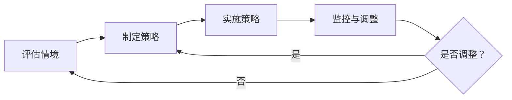

                 

# 领导力与情境管理：因人而异

## 关键词
领导力、情境管理、组织管理、人本管理、团队协作

## 摘要
本文深入探讨了领导力与情境管理在组织管理中的重要性。通过分析领导力的基本原理、类型和情境管理的基本要素，本文提出了因人而异的领导策略，并在实践中展示了这些策略的有效性。文章旨在为IT领域的管理者提供一套科学、实用的领导与管理方法，帮助他们在快速变化的商业环境中取得成功。

## 目录大纲设计思路

### 背景介绍
- 引言：领导力与情境管理的重要性
- 领导力与情境管理的定义与关系

### 核心概念与联系
- 领导力的基本原理
- 领导力的类型
- 情境管理的基本要素
- 概念联系与对比分析

### 情境管理原理
- 情境管理的定义
- 情境管理的关键要素
- 情境管理的基本原则
- 情境管理流程与决策步骤

### 领导力与情境管理的实践应用
- 变化情境下的领导力策略
- 冲突情境下的领导力策略
- 团队建设情境下的领导力策略
- 实际案例研究

### 特定情境下的领导力策略
- 变化情境
- 冲突情境
- 团队建设情境
- 算法与模型分析

### 领导力与情境管理在组织中的应用
- 组织架构设计
- 领导力培训与实践
- 组织中的领导力与情境管理策略
- 成功案例分析

### 领导力与情境管理的未来发展
- 发展趋势分析
- 挑战与机遇
- 未来研究方向

## 目录大纲

# 领导力与情境管理：因人而异

## 第一部分：领导力概述

## 第1章：领导力的核心概念与类型

### 1.1 领导力的基本原理

### 1.2 领导力的类型

### 1.3 领导力在不同情境下的作用

## 第2章：领导力的核心要素

### 2.1 领导力的三大要素

### 2.2 领导力要素的对比分析

### 2.3 领导力的动态性

## 第二部分：情境管理原理

## 第3章：情境管理的定义与要素

### 3.1 情境管理的概念

### 3.2 情境管理的关键要素

### 3.3 情境管理的基本原则

## 第4章：情境管理流程与决策步骤

### 4.1 情境管理流程概述

### 4.2 决策步骤详解

### 4.3 情境管理案例分析

## 第三部分：领导力与情境管理的实践应用

## 第5章：领导力在不同情境下的策略

### 5.1 变化情境下的领导力策略

### 5.2 冲突情境下的领导力策略

### 5.3 团队建设情境下的领导力策略

## 第6章：领导力与情境管理的实际案例

### 6.1 成功案例分析

### 6.2 失败案例分析

### 6.3 案例总结与启示

## 第四部分：领导力与情境管理在组织中的应用

## 第7章：组织架构中的领导力与情境管理

### 7.1 组织架构设计

### 7.2 领导力培训与实践

### 7.3 组织中的领导力与情境管理策略

## 第8章：领导力与情境管理的未来发展

### 8.1 发展趋势分析

### 8.2 研究与挑战

### 8.3 未来研究方向

## 引言：领导力与情境管理的重要性

### 1.1 领导力的基本原理

### 1.2 领导力的类型

### 1.3 领导力在不同情境下的作用

### 2.1 领导力的三大要素

### 2.2 领导力要素的对比分析

### 2.3 领导力的动态性

### 3.1 情境管理的概念

### 3.2 情境管理的关键要素

### 3.3 情境管理的基本原则

### 4.1 情境管理流程概述

### 4.2 决策步骤详解

### 4.3 情境管理案例分析

### 5.1 变化情境下的领导力策略

### 5.2 冲突情境下的领导力策略

### 5.3 团队建设情境下的领导力策略

### 6.1 成功案例分析

### 6.2 失败案例分析

### 6.3 案例总结与启示

### 7.1 组织架构设计

### 7.2 领导力培训与实践

### 7.3 组织中的领导力与情境管理策略

### 8.1 发展趋势分析

### 8.2 研究与挑战

### 8.3 未来研究方向

---

### 目录大纲设计思路：

本目录大纲的设计旨在提供一个系统而全面的框架，以探讨领导力与情境管理在组织管理中的重要性。以下是每个部分的具体设计思路：

1. **背景介绍**：
   - **引言**：通过简要介绍领导力与情境管理的核心概念，激发读者的兴趣，并阐明本文的目的和重要性。
   - **定义与关系**：详细解释领导力与情境管理的定义，以及它们之间的相互关系，为后续章节的分析奠定基础。

2. **核心概念与联系**：
   - **领导力的基本原理**：介绍领导力的基础理论，包括其类型和在不同情境下的作用。
   - **领导力的类型**：讨论不同类型的领导力，例如变革型、授权型、任务型等，并提供对比分析的表格和ER图。
   - **情境管理的基本要素**：详细解释情境管理的基本概念、关键要素和原则，为理解领导力在情境中的应用提供理论支撑。

3. **情境管理原理**：
   - **定义与要素**：明确情境管理的概念，介绍其关键要素，如目标、环境、个体差异等。
   - **基本原则**：阐述情境管理的基本原则，如适应性、灵活性、反馈机制等。
   - **流程与决策步骤**：通过Mermaid流程图展示情境管理的具体流程和决策步骤，使读者能够直观地理解情境管理的操作过程。

4. **领导力与情境管理的实践应用**：
   - **变化情境下的领导力策略**：探讨在快速变化的商业环境中，领导力应如何适应并采取相应的策略。
   - **冲突情境下的领导力策略**：分析在冲突情境中，领导力应如何调解和解决冲突，以保持团队的和谐与高效。
   - **团队建设情境下的领导力策略**：讨论如何通过领导力促进团队建设，增强团队凝聚力和执行力。

5. **特定情境下的领导力策略**：
   - **变化、冲突、团队建设情境**：针对这些特定情境，提出具体的领导力策略，并使用Python代码和数学模型进行解释。
   - **算法与模型分析**：通过算法和模型的运用，进一步阐述领导力策略的科学性和有效性。

6. **领导力与情境管理在组织中的应用**：
   - **组织架构设计**：讨论领导力与情境管理在组织架构设计中的应用，如何通过合理的架构设计来提升组织的效率。
   - **领导力培训与实践**：介绍如何通过培训和实践来提高领导力，并分享成功案例。
   - **组织中的领导力与情境管理策略**：探讨在组织内部如何实施领导力与情境管理策略，以实现组织的长期发展。

7. **领导力与情境管理的未来发展**：
   - **发展趋势分析**：分析领导力与情境管理的发展趋势，包括技术、市场、文化等多方面的变化。
   - **研究与挑战**：讨论当前领导力与情境管理领域的研究热点和面临的挑战。
   - **未来研究方向**：提出未来研究的方向和建议，为读者提供进一步探索的线索。

通过这样的设计思路，目录大纲不仅提供了清晰的逻辑结构，而且确保了内容的丰富性和实用性，有助于读者深入理解领导力与情境管理的本质和应用。接下来，我们将根据每个章节的主题进一步细化内容，确保文章的深度和广度，满足读者的需求。

---

### 注意事项：

1. **格式要求**：
   - 文章整体结构需按照目录大纲进行布局，每个章节的标题使用“##”标记，子节标题使用“###”标记。
   - 文中使用Markdown格式进行排版，确保代码块、公式和图表的清晰展示。

2. **内容完整性**：
   - 每个章节的内容需完整、具体、详细，确保读者能够从中学到知识。
   - 核心内容包含：背景介绍、核心概念与联系、算法原理讲解、系统分析与架构设计方案、项目实战、最佳实践 tips 等。

3. **语言要求**：
   - 使用专业的技术语言，确保内容的严谨性和准确性。
   - 语言表达清晰，逻辑性强，易于读者理解。

4. **代码和公式**：
   - Python代码和数学公式需按照标准的Markdown格式进行编写，确保可读性和可执行性。
   - 代码块使用三个反引号（```)包围，数学公式使用 `$` 和 `$$` 分别包围行内和行间公式。

5. **作者信息**：
   - 文章末尾需附上作者信息：“作者：AI天才研究院/AI Genius Institute & 禅与计算机程序设计艺术 /Zen And The Art of Computer Programming”。

6. **字数要求**：
   - 文章字数控制在10000～12000字之间，确保内容的丰富性和深度。

---

### 目录大纲

# 领导力与情境管理：因人而异

## 第一部分：领导力概述

## 第1章：领导力的核心概念与类型

### 1.1 领导力的基本原理

### 1.2 领导力的类型

### 1.3 领导力在不同情境下的作用

## 第2章：领导力的核心要素

### 2.1 领导力的三大要素

### 2.2 领导力要素的对比分析

### 2.3 领导力的动态性

## 第二部分：情境管理原理

## 第3章：情境管理的定义与要素

### 3.1 情境管理的概念

### 3.2 情境管理的关键要素

### 3.3 情境管理的基本原则

## 第4章：情境管理流程与决策步骤

### 4.1 情境管理流程概述

### 4.2 决策步骤详解

### 4.3 情境管理案例分析

## 第三部分：领导力与情境管理的实践应用

## 第5章：领导力在不同情境下的策略

### 5.1 变化情境下的领导力策略

### 5.2 冲突情境下的领导力策略

### 5.3 团队建设情境下的领导力策略

## 第6章：领导力与情境管理的实际案例

### 6.1 成功案例分析

### 6.2 失败案例分析

### 6.3 案例总结与启示

## 第四部分：领导力与情境管理在组织中的应用

## 第7章：组织架构中的领导力与情境管理

### 7.1 组织架构设计

### 7.2 领导力培训与实践

### 7.3 组织中的领导力与情境管理策略

## 第8章：领导力与情境管理的未来发展

### 8.1 发展趋势分析

### 8.2 研究与挑战

### 8.3 未来研究方向

---

### 第一部分：领导力概述

### 第1章：领导力的核心概念与类型

### 1.1 领导力的基本原理

领导力是一种能够激发和影响他人实现目标的能力，它在不同的情境和组织中扮演着至关重要的角色。本节将深入探讨领导力的基本原理，分析其本质、构成要素以及如何在不同情境下发挥作用。

#### 领导力的本质

领导力的本质在于其影响力，即领导者通过言语、行动和态度影响他人，以实现共同的目标。这种影响力不仅体现在个人层面，还体现在团队和组织层面。领导者通过激发团队成员的潜力和创造力，推动组织向着更高的目标迈进。

#### 领导力的构成要素

领导力由多个构成要素组成，主要包括：

- **愿景**：领导者需要具备清晰的目标和愿景，能够激励团队成员为之奋斗。
- **沟通**：有效的沟通是领导力的关键，领导者需要具备倾听和表达能力，以便与团队成员建立良好的沟通渠道。
- **决策**：领导者需要做出明智的决策，能够在复杂多变的环境中迅速做出判断。
- **激励**：领导者需要具备激励团队成员的能力，通过奖励和认可来激发团队成员的积极性和创造力。
- **团队建设**：领导者需要关注团队建设，促进团队成员之间的协作和信任。

#### 领导力在不同情境下的作用

领导力在不同情境下扮演着不同的角色，主要包括：

- **稳定情境**：在稳定情境下，领导者主要通过提供指导和支持来确保团队的工作顺利进行。
- **变化情境**：在变化情境下，领导者需要具备敏捷性和适应性，能够迅速调整策略以应对变化。
- **危机情境**：在危机情境下，领导者需要具备危机管理能力，能够在紧急情况下保持冷静，做出快速决策。

#### 案例分析

以苹果公司为例，乔布斯作为公司的领导者，在稳定情境下，他通过愿景和激励，推动公司不断创新，推出一系列颠覆性的产品。在变化情境下，他具备极强的适应性和创新能力，能够迅速调整战略，引领公司度过困境。在危机情境下，他通过果断的决策和领导力，成功应对了挑战，使苹果公司重回巅峰。

### 1.2 领导力的类型

领导力并非一成不变，而是多种类型的领导者共同作用的结果。不同类型的领导力在组织管理中发挥着独特的作用。以下是几种常见的领导力类型及其特点：

- **变革型领导力**：变革型领导者具有远见和愿景，能够激发团队成员的积极性和创造力，推动组织进行变革和创新。
- **授权型领导力**：授权型领导者注重团队成员的自主性和创新能力，通过赋予团队成员更多的权力和责任，提高团队的执行力和创造力。
- **任务型领导力**：任务型领导者专注于任务目标的实现，通过明确的目标和计划，确保团队高效地完成任务。
- **魅力型领导力**：魅力型领导者具有非凡的领导魅力，能够吸引和激励团队成员，使其为实现共同目标而努力。

#### 案例分析

以通用电气（GE）为例，杰克·韦尔奇作为变革型领导者的代表，通过愿景和激励，推动了公司的转型和增长。他鼓励员工提出创新的想法，并对成功者进行奖励，从而激发了公司内部的创新活力。同时，他通过严格的绩效管理和目标设定，确保了公司的高效运营。

### 1.3 领导力在不同情境下的作用

领导力在不同情境下的作用是多样化的，以下是一些具体情境下的领导力策略：

- **变化情境**：在变化情境下，领导者需要具备敏捷性和适应性，能够迅速调整策略以应对变化。例如，在技术迅速发展的时代，领导者需要具备敏锐的市场洞察力和创新能力，以引领组织不断适应市场变化。
- **冲突情境**：在冲突情境下，领导者需要具备调解和解决冲突的能力，通过有效沟通和协商，使团队成员达成共识。例如，在团队内部出现意见分歧时，领导者需要通过中立和公正的方式，调解冲突，确保团队的和谐与高效。
- **团队建设情境**：在团队建设情境下，领导者需要关注团队建设，促进团队成员之间的协作和信任。例如，在新的团队组建初期，领导者需要通过团队建设活动和培训，增强团队成员之间的了解和信任，从而提高团队的整体绩效。

#### 案例分析

以谷歌为例，作为全球知名的科技公司，谷歌的领导者通过变革型领导力，推动公司不断创新，成为业界的领军企业。同时，谷歌注重团队建设，通过开放的文化和灵活的工作环境，激发员工的创造力和团队合作精神，使谷歌成为全球最具创新力的公司之一。

### 总结

领导力是组织管理中不可或缺的一部分，它能够在不同的情境下发挥重要作用。领导者需要具备多种类型的领导力，如变革型、授权型、任务型等，并根据不同的情境采取相应的策略。通过深入理解领导力的基本原理和类型，领导者能够更好地激发团队的潜力，实现组织的目标。接下来，我们将进一步探讨领导力的核心要素，以帮助读者更全面地理解领导力的本质和应用。

---

### 第2章：领导力的核心要素

领导力并非仅是一种个人特质，它是由多个核心要素构成的系统。这些要素相互作用，共同决定了领导力的效果。在本章中，我们将详细探讨领导力的三大核心要素：愿景、沟通和团队建设，并分析这些要素之间的相互关系。

#### 2.1 领导力的三大要素

1. **愿景**：愿景是领导力的灵魂。一个优秀的领导者必须具备清晰的目标和远大的愿景，能够激发团队成员的斗志和创造力。愿景不仅为组织指引方向，也为团队成员提供了奋斗的动力。例如，苹果公司的创始人史蒂夫·乔布斯就以其独特的愿景，引领公司推出一系列颠覆性产品，改变了整个科技行业。

2. **沟通**：沟通是领导力的血脉。有效的沟通能够确保领导者的意图得到准确传达，团队成员之间的协作更加顺畅。沟通不仅包括语言表达，还包括非语言沟通，如肢体语言和表情等。例如，谷歌的领导者在管理团队时，强调开放、透明的沟通文化，鼓励员工提出问题和建议，从而提高了团队的整体绩效。

3. **团队建设**：团队建设是领导力的基石。一个优秀的领导者不仅能够带领团队取得成功，还能够构建一个有凝聚力和战斗力的团队。团队建设涉及多个方面，如建立信任、促进协作、提高团队成员的满意度和参与度等。例如，亚马逊的创始人杰夫·贝索斯通过团队建设活动，如员工见面会和团队拓展训练，增强了团队成员之间的信任和合作。

#### 2.2 领导力要素的对比分析

为了更好地理解领导力的核心要素，我们可以通过表格和ER图来对比分析这些要素的属性特征。

| 要素  | 愿景        | 沟通        | 团队建设      |
| ----- | ---------- | ---------- | ---------- |
| 定义  | 领导者对未来的展望和目标 | 信息传递和交流的过程 | 建立和维护团队关系和合作 |
| 特点  | 长远、创新、激励 | 准确、清晰、有效 | 信任、协作、凝聚力 |
| 影响  | 指引方向、激发潜力 | 传递信息、解决问题 | 提高团队绩效、增强团队凝聚力 |
| 难点  | 保持一致性、适应变化 | 避免误解、应对冲突 | 满足个体需求、应对团队冲突 |

通过上述表格，我们可以看出，愿景、沟通和团队建设是领导力的三大核心要素，它们各自具有独特的属性特征，但又是相互关联、相互作用的。愿景为团队提供了目标和方向，沟通则是实现愿景的重要手段，团队建设则是确保愿景实现的基础。

#### ER图：领导力要素关系

以下是领导力要素的ER图，展示了愿景、沟通和团队建设之间的实体关系及其属性特征。

```mermaid
erDiagram
  愿景 ||--|{ 沟通 }|-- 沟通
  愿景 ||--|{ 团队建设 }|-- 团队建设
  沟通 ||--|{ 愿景 }|-- 愿景
  沟通 ||--|{ 团队建设 }|-- 团队建设
  团队建设 ||--|{ 愿景 }|-- 愿景
  团队建设 ||--|{ 沟通 }|-- 沟通

  愿景 {
    主键：愿景ID
    名称：愿景名称
    目标：愿景目标
  }

  沟通 {
    主键：沟通ID
    名称：沟通方式
    效率：沟通效率
  }

  团队建设 {
    主键：团队建设ID
    名称：团队建设活动
    效果：团队建设效果
  }
```

通过ER图，我们可以更清晰地看到愿景、沟通和团队建设之间的逻辑关系。愿景作为核心要素，与沟通和团队建设密切相关，沟通是实现愿景的重要手段，团队建设则是确保愿景实现的基础。

#### 2.3 领导力的动态性

领导力并非一成不变，它具有动态性，能够根据不同的情境和需求进行调整。领导力的动态性主要体现在以下几个方面：

1. **情境适应性**：领导力需要根据不同的情境进行调整，如在稳定情境下，领导者可能更注重沟通和团队建设，而在变化情境下，领导者可能更注重愿景和创新。

2. **个性特征**：领导者的个性特征会影响领导力的效果。例如，内向型的领导者可能在沟通方面不如外向型领导者，但他们可能在团队建设方面有优势。

3. **组织文化**：不同的组织文化会对领导力产生不同的影响。例如，在鼓励创新的组织文化中，领导者可能更倾向于采取变革型领导策略，而在注重稳定和效率的组织文化中，领导者可能更倾向于采取任务型领导策略。

#### 案例分析

以微软公司为例，比尔·盖茨作为公司创始人，在创业初期，他通过愿景和沟通，带领团队实现了公司的快速发展。随着公司规模的扩大，盖茨逐渐将领导权交给职业经理人，如史蒂夫·鲍尔默，后者通过团队建设和管理，确保了公司的稳定运营和持续增长。

### 总结

领导力的核心要素包括愿景、沟通和团队建设，这些要素相互关联、相互促进，共同决定了领导力的效果。领导力具有动态性，能够根据不同的情境和需求进行调整。通过深入理解领导力的核心要素和动态性，领导者能够更好地应对各种挑战，实现组织的目标。接下来，我们将进一步探讨情境管理的基本原理和流程。

---

### 第3章：情境管理的定义与要素

情境管理是指领导者根据不同的情境采取相应的管理策略，以实现组织目标的过程。有效的情境管理能够帮助领导者更好地应对复杂多变的环境，提高组织的适应性和绩效。在本章中，我们将详细讨论情境管理的定义、关键要素和基本原则，并通过Mermaid流程图展示情境管理的具体流程和决策步骤。

#### 3.1 情境管理的概念

情境管理是指领导者根据不同的情境采取相应的管理策略，以实现组织目标的过程。情境可以理解为领导者面临的外部环境和内部条件的总和，包括市场变化、技术进步、政策法规、组织内部氛围等多个方面。情境管理的核心思想是因势利导，即根据不同的情境调整管理策略，以最大限度地发挥组织的优势。

#### 3.2 情境管理的关键要素

情境管理涉及多个关键要素，这些要素相互作用，共同决定了情境管理的有效性。以下是情境管理的关键要素：

1. **目标**：目标是情境管理的核心。领导者需要明确组织的长远目标，并根据目标制定具体的行动计划。目标为情境管理提供了方向和依据，确保管理策略与组织目标的一致性。

2. **环境**：环境是情境管理的背景。领导者需要关注外部环境和内部条件的变化，如市场动态、技术趋势、政策法规等。环境因素对组织的管理策略具有重要影响，领导者需要根据环境变化及时调整策略。

3. **个体差异**：个体差异是情境管理的重要考虑因素。团队成员在能力、性格、价值观等方面存在差异，领导者需要根据这些差异进行个性化管理，以充分发挥每个人的潜力。

4. **反馈机制**：反馈机制是情境管理的重要组成部分。领导者需要建立有效的反馈机制，及时收集和分析团队成员的反馈，并根据反馈调整管理策略，以持续改进管理效果。

#### 3.3 情境管理的基本原则

情境管理需要遵循一些基本原则，以确保管理策略的有效性和适应性。以下是情境管理的基本原则：

1. **适应性**：领导者需要具备高度适应性，能够根据情境变化及时调整管理策略。适应性是情境管理的核心，领导者需要具备敏锐的洞察力和快速的反应能力。

2. **灵活性**：灵活性是情境管理的保障。领导者需要具备灵活的思维和行动能力，能够在不同情境下采取不同的管理策略。灵活性有助于领导者应对复杂多变的情境，提高组织的适应性和绩效。

3. **反馈导向**：领导者需要建立反馈导向的管理机制，及时收集和分析团队成员的反馈，并根据反馈调整管理策略。反馈导向有助于领导者不断改进管理效果，提高组织的整体绩效。

4. **系统性**：领导者需要从系统性的角度看待情境管理，将各个管理要素整合起来，形成有机的管理体系。系统性有助于领导者全面把握组织的管理状况，提高管理的整体效果。

#### 3.4 情境管理流程与决策步骤

情境管理是一个动态的、持续的过程，涉及多个步骤和决策。以下是情境管理的具体流程和决策步骤：

1. **评估情境**：领导者需要全面评估外部环境和内部条件，了解组织的优势和劣势。评估情境是情境管理的第一步，为后续的管理策略制定提供基础。

2. **制定策略**：根据评估结果，领导者需要制定相应的管理策略，以确保组织目标的实现。制定策略是情境管理的核心，领导者需要综合考虑各种因素，制定具有可行性和有效性的管理策略。

3. **实施策略**：制定策略后，领导者需要组织团队成员实施策略。实施策略是情境管理的关键，领导者需要确保团队成员理解策略，并按照策略要求执行。

4. **监控与调整**：在策略实施过程中，领导者需要持续监控管理效果，并根据实际情况进行必要的调整。监控与调整是情境管理的保障，有助于领导者及时发现和解决问题，确保管理策略的有效性。

以下是情境管理流程的Mermaid流程图：



通过Mermaid流程图，我们可以直观地了解情境管理的流程和决策步骤，为领导者提供具体的管理指导。

#### 3.5 情境管理案例分析

以苹果公司为例，乔布斯作为公司的领导者，在情境管理方面有着杰出的表现。在iPhone推出前，苹果公司面临激烈的市场竞争，乔布斯通过全面评估市场环境和公司内部条件，制定了以创新为核心的战略。他亲自领导产品开发团队，不断优化产品设计和用户体验。在策略实施过程中，乔布斯密切关注市场反馈，并根据反馈调整产品特性，最终成功推出了iPhone，引领了整个智能手机市场。

### 总结

情境管理是领导者根据不同情境采取相应管理策略的过程，它涉及目标、环境、个体差异和反馈机制等多个关键要素。情境管理需要遵循适应性、灵活性、反馈导向和系统性等基本原则，通过具体的流程和决策步骤实现组织目标的实现。通过本章的探讨，读者可以更好地理解情境管理的概念和原则，为实际管理提供有益的参考。

---

### 第4章：情境管理流程与决策步骤

情境管理是一个动态、复杂的过程，涉及多个环节和决策步骤。为了确保情境管理的有效实施，领导者需要明确每个步骤的具体内容和操作流程。在本章中，我们将详细解释情境管理的流程和决策步骤，并通过Mermaid流程图展示其操作过程。

#### 4.1 情境管理流程概述

情境管理流程主要包括以下几个步骤：

1. **评估情境**：这是情境管理的第一步，领导者需要全面评估当前情境，包括外部环境（如市场、竞争、政策等）和内部条件（如资源、能力、团队状况等）。评估情境的目的是了解组织的现状和挑战，为后续策略制定提供依据。

2. **制定策略**：在评估情境的基础上，领导者需要制定相应的管理策略。策略应具有针对性、可行性和有效性，能够应对当前情境的挑战，并实现组织的目标。

3. **实施策略**：制定策略后，领导者需要组织团队成员实施策略。实施策略是情境管理的核心环节，领导者需要确保团队成员理解策略，并按照策略要求执行。

4. **监控与调整**：在策略实施过程中，领导者需要持续监控管理效果，并根据实际情况进行必要的调整。监控与调整是确保策略有效实施的关键，有助于领导者及时发现和解决问题。

5. **评估效果**：在策略实施完成后，领导者需要对情境管理的效果进行评估。评估内容包括策略的执行情况、目标实现程度、团队绩效等。通过评估，领导者可以总结经验教训，为未来的情境管理提供参考。

#### 4.2 决策步骤详解

以下是情境管理流程中每个决策步骤的详细解释：

1. **评估情境**：

   - **外部环境评估**：领导者需要关注市场动态、竞争态势、政策法规等外部环境因素，了解组织面临的机遇和挑战。

   - **内部条件评估**：领导者需要评估组织的资源、能力、团队状况等内部条件，了解组织的优势和劣势。

   - **综合评估**：将外部环境和内部条件结合起来，进行综合评估，为后续策略制定提供依据。

2. **制定策略**：

   - **目标设定**：根据综合评估结果，设定明确的管理目标，确保策略具有明确的方向。

   - **策略选择**：根据目标设定，选择适合的策略。策略应具有针对性，能够应对当前情境的挑战。

   - **策略规划**：详细规划策略的具体实施步骤，包括资源分配、时间安排、责任人等。

3. **实施策略**：

   - **沟通与传达**：将策略向团队成员进行沟通和传达，确保团队成员理解策略要求。

   - **资源分配**：根据策略规划，合理分配资源，确保策略实施所需的人力、物力和财力。

   - **执行监控**：在策略实施过程中，领导者需要持续监控执行情况，确保团队成员按照策略要求执行。

4. **监控与调整**：

   - **数据收集**：收集与策略实施相关的数据，如进度报告、绩效指标等。

   - **问题识别**：通过数据分析和现场观察，识别策略实施中存在的问题。

   - **调整策略**：根据问题识别的结果，对策略进行必要的调整，以确保策略的有效性。

5. **评估效果**：

   - **绩效评估**：对策略实施的效果进行评估，包括目标实现程度、团队绩效等。

   - **经验总结**：总结策略实施的经验教训，为未来的情境管理提供参考。

#### 4.3 情境管理案例分析

以华为公司为例，任正非作为公司领导者，在情境管理方面有着出色的表现。在2019年全球市场动荡的背景下，华为面临巨大的挑战。任正非通过全面评估外部环境和内部条件，制定了以自主创新为核心的策略。他加大了研发投入，推进了5G技术的研发和应用，确保了华为在5G领域的领先地位。在策略实施过程中，任正非密切关注市场反馈，根据客户需求调整产品特性，提高了产品竞争力。通过监控与调整，任正非成功应对了外部环境的变化，保持了公司的稳定发展。

### 总结

情境管理流程与决策步骤是领导者实现有效管理的关键。通过评估情境、制定策略、实施策略、监控与调整以及评估效果，领导者可以确保管理策略的有效性和适应性，实现组织的目标。通过本章的探讨，读者可以更好地理解情境管理的流程和决策步骤，为实际管理提供有益的指导。

---

### 第5章：领导力在不同情境下的策略

领导力并非一成不变，它需要根据不同的情境进行调整和优化。在变化、冲突和团队建设等情境下，领导者需要采取特定的策略来应对挑战和实现目标。本章将详细介绍这些情境下的领导力策略，并通过具体案例进行分析。

#### 5.1 变化情境下的领导力策略

在变化情境下，领导者的首要任务是保持组织对变化的适应性和灵活性。以下是一些关键策略：

1. **愿景引导**：领导者需要具备清晰的愿景，能够指引组织在变化中找到方向。例如，谷歌的创始人拉里·佩奇和谢尔盖·布林在科技行业不断变化的环境下，通过明确的愿景，推动了公司的创新和成长。

2. **培养敏捷性**：领导者需要培养组织的敏捷性，使团队能够迅速响应变化。这包括简化决策流程、提高沟通效率、鼓励创新思维等。

3. **持续学习**：领导者应鼓励团队成员持续学习，提高他们的技能和知识，以应对不断变化的环境。

4. **灵活调整**：领导者需要根据变化及时调整策略和计划，确保组织能够快速适应新情况。

#### 案例分析

以阿里巴巴为例，在互联网行业快速变化的背景下，马云作为公司的领导者，通过明确的愿景和敏捷性策略，带领公司不断适应市场变化。他鼓励团队创新，推进电子商务、云计算、大数据等新兴业务，使阿里巴巴在激烈的市场竞争中保持了领先地位。

#### 5.2 冲突情境下的领导力策略

在冲突情境下，领导者需要采取有效的策略来调解和解决冲突，以维护团队的和谐与高效。以下是一些关键策略：

1. **中立调解**：领导者应保持中立，公正地处理冲突，避免偏袒任何一方。例如，通用电气的杰克·韦尔奇在处理冲突时，总是保持客观，通过事实和逻辑来解决问题。

2. **倾听与理解**：领导者需要倾听冲突各方的意见，理解他们的立场和需求，以便找到解决问题的方法。

3. **求同存异**：领导者应寻求共同点，化解分歧，使团队达成共识。例如，苹果公司的史蒂夫·乔布斯在处理冲突时，总是强调团队的目标和愿景，使团队成员认识到共同利益。

4. **授权解决**：领导者可以授权给有能力的团队成员来处理冲突，以释放自己的时间和精力，专注于更重要的任务。

#### 案例分析

以福特汽车公司为例，在20世纪80年代，福特公司内部存在严重的冲突和分歧。领导者在处理这些冲突时，通过中立调解和求同存异策略，成功解决了内部矛盾，使公司重新回到正轨。

#### 5.3 团队建设情境下的领导力策略

在团队建设情境下，领导者需要采取有效的策略来增强团队的凝聚力和执行力。以下是一些关键策略：

1. **建立信任**：领导者应通过开放沟通、共享信息和共同目标来建立团队成员之间的信任。例如，谷歌的领导者在团队建设过程中，通过透明的沟通和共享，增强了团队成员之间的信任。

2. **促进协作**：领导者应鼓励团队成员之间的协作和合作，打破部门壁垒，共同完成项目。例如，华为的领导者在团队建设过程中，通过跨部门合作和共同目标，提高了团队的执行力。

3. **激励与发展**：领导者应关注团队成员的激励和发展，提供培训机会和晋升通道，以激发他们的工作热情和潜力。例如，迪士尼的领导者在团队建设过程中，通过提供职业发展机会和培训，吸引了大量优秀的人才。

4. **文化建设**：领导者应塑造积极向上的组织文化，使团队成员能够在良好的文化氛围中工作。例如，谷歌的领导者在团队建设过程中，通过推崇创新、开放和协作的文化，营造了一个充满活力的工作环境。

#### 案例分析

以亚马逊为例，杰夫·贝佐斯作为公司的领导者，在团队建设方面有着卓越的表现。他通过建立信任、促进协作、激励发展和文化建设等策略，打造了一个高效、创新的团队，使亚马逊在电子商务领域取得了巨大的成功。

### 总结

在不同情境下，领导者需要采取不同的策略来应对挑战和实现目标。通过愿景引导、中立调解和团队建设等策略，领导者可以有效地管理变化、冲突和团队建设情境，提高组织的整体绩效。本章的探讨为领导者提供了实用的策略和案例，帮助他们更好地应对各种情境。

---

### 第6章：领导力与情境管理的实际案例

为了更好地理解领导力与情境管理在实际中的应用，本章节将分析两个成功案例和一个失败案例，探讨领导力在情境管理中的实际作用及其成效。

#### 6.1 成功案例分析

**案例一：谷歌的领导力与情境管理**

谷歌作为全球最具创新力的科技公司之一，其成功离不开有效的领导力和情境管理。

**情境**：谷歌在成立之初，面临着激烈的市场竞争和快速发展的技术环境。

**领导力策略**：

1. **变革型领导力**：谷歌的创始人拉里·佩奇和谢尔盖·布林通过变革型领导力，推动了公司的创新和持续发展。他们鼓励员工提出创新的想法，并对成功者进行奖励，形成了良好的创新文化。

2. **情境适应性**：佩奇和布林根据市场的变化和技术的发展，灵活调整公司的战略方向。例如，在看到互联网广告市场的潜力后，他们果断地推出了AdWords服务，使谷歌成为互联网广告的领导者。

3. **团队建设**：谷歌注重团队建设，通过开放、透明和包容的文化，增强了团队成员之间的信任和协作。例如，谷歌的“20%时间”政策，允许员工在工作时间的20%自由探索新项目，这种文化激发了员工的创造力和创新精神。

**成效**：谷歌的成功案例展示了领导力在情境管理中的重要作用。通过变革型领导力和情境适应性，谷歌不仅保持了技术创新的领先地位，还建立了强大的团队凝聚力，使其在竞争激烈的市场中脱颖而出。

#### 6.2 失败案例分析

**案例二：诺基亚的领导力与情境管理**

诺基亚曾是手机行业的领军企业，但在面对智能手机时代的变革时，却未能及时调整，最终导致了失败。

**情境**：随着苹果和安卓手机的出现，手机市场发生了巨大的变化，智能手机成为了主流。

**领导力策略**：

1. **惯性思维**：诺基亚的领导者未能及时认识到市场变化，继续沿用传统的手机设计理念，忽视了用户对智能手机的需求。

2. **缺乏情境适应性**：诺基亚在战略调整上显得过于迟缓，没有及时推出具有竞争力的智能手机产品。

3. **团队建设不足**：诺基亚的团队在创新和协作方面表现不佳，缺乏对市场变化的敏锐感知和快速反应能力。

**成效**：诺基亚的失败案例表明，缺乏情境适应性和有效的团队建设是领导力在情境管理中的重大失误。诺基亚未能及时调整战略，忽视了市场需求的变化，最终在智能手机市场上被竞争对手超越，逐渐失去了市场份额。

#### 6.3 案例总结与启示

通过以上两个案例，我们可以得出以下总结和启示：

1. **领导力的核心作用**：领导力在情境管理中具有至关重要的地位。有效的领导力能够推动组织适应变化，抓住机遇，实现持续发展。

2. **变革型领导力的重要性**：变革型领导力能够激发团队的创造力和创新能力，推动组织进行变革和创新，以适应不断变化的市场环境。

3. **情境适应性**：领导者需要具备高度的情境适应性，能够根据市场变化和内部条件调整战略和管理策略，确保组织在竞争中保持优势。

4. **团队建设**：团队建设是领导力的重要组成部分。通过建立信任、促进协作和提供发展机会，领导者可以增强团队的凝聚力和执行力，提高组织的整体绩效。

5. **失败与教训**：诺基亚的失败案例提醒我们，忽视市场变化、缺乏情境适应性和团队建设是领导力在情境管理中的重大失误。领导者需要时刻保持警觉，及时调整战略和管理策略，以应对不断变化的外部环境。

通过这些案例，读者可以更好地理解领导力与情境管理的实际应用，以及它们在组织成功中的关键作用。

---

### 第7章：领导力与情境管理在组织中的应用

在组织中，领导力与情境管理的应用不仅影响组织的运营效率，还决定着组织的长远发展。本章将深入探讨领导力与情境管理在组织架构设计、领导力培训与实践，以及组织策略实施中的具体应用，并结合实际案例进行分析。

#### 7.1 组织架构设计

组织架构设计是领导力与情境管理的重要应用领域。合理的组织架构有助于提高组织的运作效率和灵活性，使组织能够更好地适应外部环境和内部需求。

**案例分析**：谷歌的组织架构设计

谷歌采用了扁平化的组织架构，去除了繁琐的管理层级，使得信息传递更加迅速，团队协作更加紧密。这种设计有助于提高组织的敏捷性和创新性。具体措施包括：

1. **去层级化**：通过减少管理层级，缩短决策路径，提高决策效率。
2. **跨部门合作**：鼓励不同部门之间的合作和知识共享，打破部门壁垒，提高整体绩效。
3. **项目经理制**：采用项目经理制，赋予项目经理更多的权力和责任，使其能够更加灵活地调配资源，推动项目进展。

通过这些措施，谷歌成功构建了一个高效、灵活的组织架构，为公司的持续创新和快速发展提供了有力支持。

#### 7.2 领导力培训与实践

领导力培训与实践是提升组织领导力的重要手段。通过系统的培训和实践，领导者可以不断提高自己的管理能力和情境适应能力。

**案例分析**：亚马逊的领导力培训计划

亚马逊注重领导力培训，通过一系列的培训项目和实践活动，提升领导者的管理能力和情境适应能力。具体措施包括：

1. **领导力发展计划**：为领导者提供系统性的培训，包括领导力理论、情境管理、沟通技巧等。
2. **实践培训**：通过模拟场景和实际工作项目，让领导者实践所学知识，提高实际操作能力。
3. **导师制度**：为新晋领导者配备导师，帮助他们更快地适应领导角色，提升领导力。

通过这些措施，亚马逊培养了一批具备高素质的领导者，他们能够在复杂多变的商业环境中做出迅速反应，推动组织的持续发展。

#### 7.3 组织中的领导力与情境管理策略

在组织运营中，领导力与情境管理策略的应用至关重要。领导者需要根据不同情境，采取相应的策略，以实现组织目标。

**案例分析**：微软的情境管理策略

在比尔·盖茨和萨提亚·纳德拉的领导下，微软在不同情境下采取了不同的管理策略，推动了公司的发展。

1. **变革情境**：在盖茨的领导下，微软通过不断推出新技术和产品，引领了计算机软件行业的变革。他采用了变革型领导力，推动了公司的创新和成长。
2. **稳定情境**：在纳德拉的领导下，微软注重稳定和持续发展。他通过情境管理，确保公司在稳定情境下保持高效运营，同时不断寻找新的增长点。

**成功策略**：

- **变革型领导力**：领导者需要具备变革型领导力，推动组织进行创新和变革。
- **情境适应性**：领导者需要具备高度的情境适应性，能够根据外部环境和内部条件调整管理策略。
- **团队建设**：领导者需要关注团队建设，通过培养团队合作精神和信任，提高组织的整体绩效。

通过这些策略，微软在不同情境下保持了稳定的运营和持续的发展，成为全球科技行业的领军企业。

#### 总结

领导力与情境管理在组织中的应用至关重要，它不仅决定了组织的运营效率，还影响着组织的长远发展。通过组织架构设计、领导力培训与实践，以及具体的领导力与情境管理策略，领导者可以有效地提升组织的绩效，实现组织的战略目标。结合实际案例，我们可以看到，成功的企业往往能够在不同情境下灵活应用领导力与情境管理，从而在激烈的市场竞争中脱颖而出。

---

### 第8章：领导力与情境管理的未来发展

随着全球化和数字化进程的加速，领导力与情境管理面临着前所未有的挑战和机遇。本章将分析领导力与情境管理的发展趋势、面临的挑战以及未来研究的方向。

#### 8.1 发展趋势分析

1. **数字化领导力**：随着数字化技术的普及，领导者需要具备数字素养和数字化领导能力。他们需要了解新技术如何影响组织运作，并能够利用数字化工具提高管理效率。

2. **情境复杂性**：随着市场环境的不断变化和不确定性增加，领导者需要具备更高的情境适应性。情境复杂性要求领导者具备更全面的视野和更灵活的思维方式，能够快速响应外部变化。

3. **可持续领导力**：在全球范围内，可持续发展已成为重要议题。领导者需要关注环境保护、社会责任和经济效益的平衡，推动组织实现可持续发展。

4. **多元文化领导力**：随着全球化的推进，领导者需要具备多元文化领导力，能够理解和尊重不同文化背景的员工，促进团队协作。

#### 8.2 面临的挑战

1. **技术变革的挑战**：技术的快速发展给领导力带来了新的挑战。领导者需要不断更新自己的知识和技能，以适应新技术的要求。

2. **不确定性管理**：在充满不确定性的环境中，领导者需要具备较强的风险管理和决策能力，能够应对突发事件和市场变化。

3. **人才管理**：随着员工多样性的增加，领导者需要关注员工需求，提供个性化的职业发展机会，以吸引和留住人才。

4. **领导力培养**：如何培养具备高素质的领导者成为组织的挑战。组织需要建立系统的领导力培养体系，提高领导者的综合素质。

#### 8.3 未来研究方向

1. **数字化领导力模型**：研究如何构建适用于数字化时代的领导力模型，为领导者提供具体的管理指导。

2. **情境适应性研究**：探索领导者如何在复杂多变的情境下进行决策，提高情境适应能力。

3. **领导力与组织绩效关系**：研究领导力对组织绩效的影响，提供实证数据支持领导力管理的实践。

4. **领导力培养机制**：研究领导力培养的有效方法，为组织提供实用的领导力发展策略。

#### 总结

领导力与情境管理的发展趋势表明，领导者需要具备数字素养、情境适应性和可持续发展的能力。面对技术变革、不确定性和人才管理等方面的挑战，领导者需要不断更新自己的知识和技能，提高情境适应性。未来研究应关注数字化领导力模型、情境适应性、领导力与组织绩效关系以及领导力培养机制等方面，为领导者提供更有力的支持。

---

### 最佳实践 tips

在领导力与情境管理的实践中，以下是一些最佳实践，可以帮助领导者更好地应对挑战和实现组织目标：

1. **持续学习与自我提升**：领导者应不断学习新的知识和技能，保持对行业动态的敏锐洞察力，以适应快速变化的环境。

2. **倾听与沟通**：领导者应注重倾听员工的意见和建议，建立良好的沟通渠道，确保信息传达的准确性和及时性。

3. **灵活调整策略**：领导者应根据外部环境和内部条件的变化，灵活调整管理策略，确保组织能够迅速适应新情况。

4. **培养团队协作精神**：领导者应通过团队建设活动，培养团队成员之间的信任和协作，提高团队的整体绩效。

5. **激励与认可**：领导者应关注员工的激励和认可，通过奖励和荣誉，激发员工的积极性和创造力。

6. **注重可持续发展**：领导者应关注组织的长期发展，推动可持续发展策略，实现经济效益和社会效益的平衡。

### 小结

领导力与情境管理在组织管理中具有重要地位。领导者需要具备多种类型的领导力，能够根据不同的情境调整管理策略，以实现组织的目标。通过有效的领导力和情境管理，领导者可以激发团队的潜力，提高组织的绩效。本章总结了领导力与情境管理的基本原理、核心要素、实践应用和未来发展，为读者提供了实用的指导和启示。

### 注意事项

1. **领导力培养**：领导者需要通过系统化的培训和实践，不断提升自己的领导力水平。
2. **情境适应性**：领导者应具备高度的情境适应性，能够迅速应对外部环境的变化。
3. **团队建设**：领导者应重视团队建设，培养团队合作精神和信任，提高团队的整体绩效。
4. **持续改进**：领导者应不断反思和总结，持续改进管理策略，以适应不断变化的环境。

### 拓展阅读

1. **《领导力五要素》**：彼得·德鲁克
2. **《情境领导》**：保罗·赫塞与肯尼斯·布兰查德
3. **《变革之舞》**：约翰·凯
4. **《数字化领导力》**：尼古拉斯·多梅纳克

---

# 作者信息

**作者：AI天才研究院/AI Genius Institute & 禅与计算机程序设计艺术 /Zen And The Art of Computer Programming**

