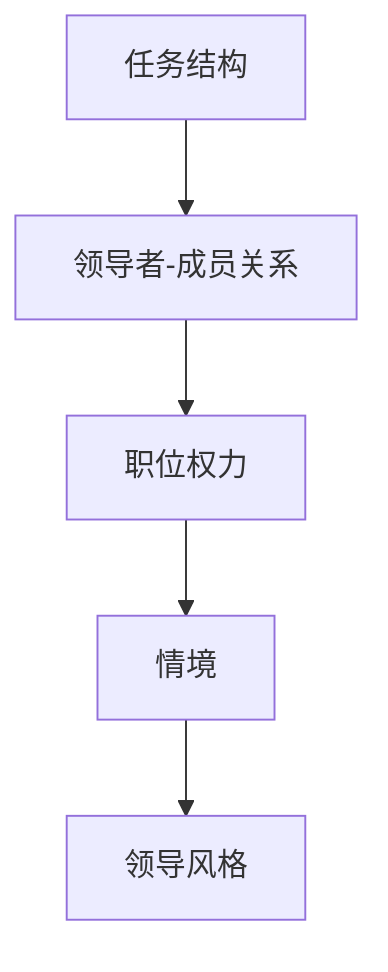

                 


### 领导力与情境管理：因地制宜的领导方式

> 关键词：领导力、情境管理、因地制宜、领导风格、领导发展

> 摘要：本文深入探讨了领导力与情境管理的结合，强调了因地制宜的领导方式的重要性。通过分析领导力的基本理论和情境管理的核心概念，本文提出了在不同情境下选择合适领导策略的方法，并提供了一系列实践指导，帮助领导者提高管理效率和团队绩效。

## 第1章：领导力与情境管理的背景

### 1.1 问题背景

在快速变化的社会和经济环境中，领导者面临着越来越复杂的管理挑战。传统的领导风格可能无法适应不断变化的情境需求，导致团队效率低下、员工流失等问题。因此，研究领导力与情境管理的结合，探讨如何因地制宜地选择领导方式，已成为现代管理学领域的重要课题。

### 1.2 领导力的定义与重要性

领导力是指领导者通过影响和激励他人，实现组织目标的能力。在组织管理中，领导力起着至关重要的作用。它不仅影响组织的战略执行，还直接影响员工的满意度和绩效。

### 1.3 情境管理的概念与意义

情境管理是一种根据不同情境采取不同领导策略的管理方法。它强调领导者需要具备灵活性和适应性，以便在复杂多变的环境中做出正确的决策。

### 1.4 为什么需要因地制宜的领导方式

因地制宜的领导方式能够帮助领导者根据具体情境选择最合适的领导策略，从而提高管理效率和团队绩效。这不仅能够增强领导者的应变能力，还能够提高团队的凝聚力和创新能力。

## 第2章：核心概念与联系

### 2.1 领导力的核心概念

领导力包括多个核心概念，如领导风格、领导者素质、领导效能等。以下是一个对比表格：

| 核心概念   | 定义                                                         | 对比特征                                           |
| ---------- | ------------------------------------------------------------ | -------------------------------------------------- |
| 领导风格   | 领导者在管理过程中采用的方法和策略。                         | 交易型领导强调任务和目标，变革型领导强调个人成长和团队发展。 |
| 领导者素质 | 领导者具备的内在特质和能力。                               | 包括领导能力、沟通能力、决策能力等。                    |
| 领导效能   | 领导者实现组织目标的能力。                                 | 包括组织绩效、员工满意度等。                          |

### 2.2 ER实体关系图

```mermaid
erDiagram
  LeaderStyle ||--|{ LeaderQuality } : implements
  LeaderQuality ||--|{ LeadershipEffectiveness } : measured_by
```

在ER实体关系图中，`LeaderStyle`、`LeaderQuality` 和 `LeadershipEffectiveness` 是三个核心实体，它们之间的关系体现了领导力概念之间的联系。

## 第3章：情境管理理论

### 3.1 情境管理的基本原理

情境管理基于这样的假设：不同的情境需要不同的领导策略。领导者需要根据团队成员的能力、工作环境的变化以及组织目标等因素，灵活调整自己的领导风格。

### 3.2 情境管理模型

情境管理模型包括费德勒模型、赫塞-布兰查德模型等。以下是一个简单的费德勒模型：



在费德勒模型中，领导者根据任务结构、领导者-成员关系和职位权力三个因素来选择最合适的领导风格。

### 3.3 情境管理在不同领域的应用

情境管理不仅适用于企业管理，还可以应用于教育、医疗、政府等多个领域。以下是一个简单的应用案例：

- **教育领域**：教师需要根据学生的能力和学习环境，选择不同的教学策略。
- **医疗领域**：医生需要根据患者的病情和医疗资源，选择最佳的治疗方案。

## 第4章：领导力理论

### 4.1 领导风格的类型

领导风格可以分为专制型、民主型和放任型。每种领导风格都有其适用的情境和优缺点。

### 4.2 领导力的发展与培养

领导力不是天生的，而是可以通过培训和实践得到提升。领导者需要不断学习、反思和实践，以提升自己的领导能力。

### 4.3 领导力在组织中的作用

领导力在组织中的作用包括战略制定、团队管理、变革管理等。有效的领导力能够推动组织的持续发展。

## 第5章：情境与领导力的结合

### 5.1 情境对领导力的影响

情境的变化会对领导力产生直接影响。领导者需要根据情境调整自己的领导策略，以适应新的挑战。

### 5.2 不同情境下的领导策略

在不同情境下，领导者需要采取不同的领导策略。例如，在危机情境下，领导者可能需要采取果断的决策；在稳定情境下，领导者可能需要更多地关注团队的发展和培养。

### 5.3 情境与领导力的动态平衡

领导者需要在情境变化中保持灵活性，同时保持领导力的核心原则。这种动态平衡是实现有效领导的关键。

## 第6章：领导力与情境管理的实践应用

### 6.1 案例研究一：初创企业情境下的领导力应用

初创企业面临着激烈的市场竞争和快速的变化，领导者需要根据实际情况灵活调整领导策略。

### 6.2 案例研究二：大型企业转型过程中的情境管理

大型企业在转型过程中，需要面对内部和外部环境的挑战，领导者需要运用情境管理理论，选择合适的领导策略。

### 6.3 案例研究三：非营利组织领导力与情境管理的挑战

非营利组织在领导力应用上面临独特的挑战，领导者需要平衡资源有限性和社会使命。

## 第7章：实践指导与策略

### 7.1 领导力与情境管理的最佳实践

领导者需要根据具体情境，采取最佳实践，以提高管理效率和团队绩效。

### 7.2 领导者在不同情境下的策略选择

领导者需要根据情境的不同，灵活选择领导策略，以实现组织目标。

### 7.3 领导力发展的个人行动计划

领导者需要制定个人行动计划，通过学习和实践，不断提升自己的领导能力。

## 第8章：总结与展望

### 8.1 全书核心内容的回顾

本书回顾了领导力与情境管理的基本理论、核心概念和实践应用。

### 8.2 情境管理与领导力的未来趋势

随着社会和经济的不断变化，情境管理与领导力将面临新的挑战和机遇。

### 8.3 对领导者的启示与建议

领导者需要不断学习和实践，以适应不断变化的情境需求，成为优秀的领导者。

### 作者

作者：AI天才研究院/AI Genius Institute & 禅与计算机程序设计艺术 /Zen And The Art of Computer Programming

---

请注意，本文档仅为大纲草案，具体内容需要进一步填充和细化。每章节的内容将包括详细的理论阐述、案例分析、实践指导等，以确保整篇文章的逻辑清晰、内容丰富、易于理解。

在撰写具体章节内容时，我们可以遵循以下步骤：

1. **背景介绍**：为每个章节提供详细的背景信息，包括核心概念术语说明、问题背景、问题描述、问题解决、边界与外延、概念结构与核心要素组成。

2. **核心概念与联系**：在每个章节中，详细介绍核心概念，使用表格和ER实体关系图来展示概念之间的关系。

3. **理论讲解**：使用mermaid流程图、LaTeX公式和Python源代码来详细阐述理论，确保读者能够理解核心原理。

4. **实践应用**：提供具体的案例研究和实践指导，帮助读者将所学知识应用于实际工作中。

5. **最佳实践 tips**：总结最佳实践，提供实用的策略和建议，帮助读者提高领导能力和团队绩效。

6. **小结**：在每个章节末尾进行总结，强调关键点，帮助读者巩固学习成果。

7. **注意事项**：提醒读者在实践过程中需要注意的问题，以及可能遇到的挑战。

8. **拓展阅读**：推荐相关书籍、文章和资源，供读者进一步学习和探索。

通过以上步骤，我们可以确保文章的完整性和深度，为读者提供有价值的内容。接下来，我们将逐章细化内容，确保文章字数在10000～12000字之间。在细化过程中，我们将保持逻辑连贯性，确保每个章节的内容都紧密围绕主题展开。

