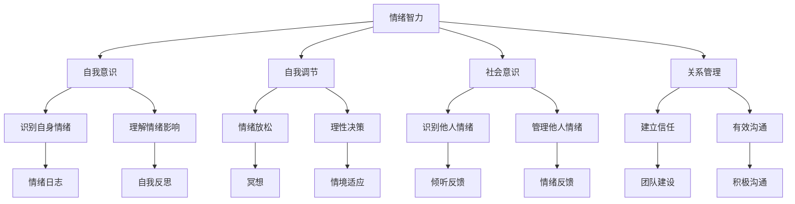

                 

### 文章标题

# 领导力与情绪智力：提升团队情感管理能力

> 关键词：领导力、情绪智力、团队情感管理、领导决策、冲突解决

> 摘要：本文旨在深入探讨领导力与情绪智力之间的关系，并详细分析提升团队情感管理能力的方法与实践。通过结合理论阐述与实际案例，本文为读者提供了全面且实用的指导，以帮助领导者更好地管理和提升团队情感智力，从而实现高效团队建设和组织发展。

### 目录

1. **领导力与情绪智力的概念与背景**
   1.1 领导力的定义与重要性
   1.2 情绪智力的定义与组成部分
   1.3 领导力与情绪智力的联系
2. **情绪智力在领导力中的作用**
   2.1 情绪智力如何影响领导决策
   2.2 情绪智力与团队氛围的关系
   2.3 情绪智力在解决团队冲突中的作用
3. **情绪智力与团队管理**
   3.1 如何识别和管理团队成员的情绪
   3.2 提升团队情绪智力的重要性
   3.3 培养团队情绪智力的策略
4. **提升个人情绪智力**
   4.1 自我意识：认识和管理自己的情绪
   4.2 自我调节：控制情绪以适应情境
   4.3 社会意识：理解和管理他人的情绪
5. **培养情绪智力与领导力的方法论**
   5.1 方法论概述
   5.2 培养情绪智力的具体方法
   5.3 培养领导力的实用策略
6. **领导力与情绪智力的培养实践**
   6.1 个人成长：从自我意识到自我调节
   6.2 团队建设：如何构建高情商团队
   6.3 组织发展：情绪智力在组织管理中的应用
7. **成功案例与经验分享**
   7.1 成功案例介绍
   7.2 经验总结
   7.3 案例分析：情绪智力在领导实践中的运用
8. **挑战与展望**
   8.1 情绪智力发展的挑战
   8.2 未来趋势展望
   8.3 情绪智力在领导力发展中的意义
9. **图表与代码示例**
   9.1 情绪智力与领导力的Mermaid图表
   9.2 情绪智力提升的Python代码示例
   9.3 情绪智力在领导实践中的应用代码

### 1. 领导力与情绪智力的概念与背景

#### 1.1 领导力的定义与重要性

领导力是一个广泛讨论的话题，它通常被定义为一种能够激发和引导他人共同实现目标的能力。领导力不仅仅关乎个人魅力，更涉及到一系列可学习和实践的技能和态度。在组织和管理领域，领导力扮演着至关重要的角色。它不仅影响个体的行为和表现，还直接影响团队的效率和组织的整体成功。

**重要性**：

- **激励员工**：有效的领导力能够激发员工的积极性，提高工作满意度，从而提升整体绩效。
- **团队协作**：领导者通过建立良好的团队关系，促进协作和沟通，确保团队目标的实现。
- **战略规划**：领导力在战略规划和决策过程中起着关键作用，帮助组织应对复杂环境和变化。
- **创新驱动**：领导者的视野和创新精神能够推动组织不断进步，适应市场变化和客户需求。

然而，领导力并非一蹴而就。它需要不断的学习和实践，以及深刻的自我反思和调整。

#### 1.2 情绪智力的定义与组成部分

情绪智力（Emotional Intelligence，简称EQ）是由心理学家丹尼尔·戈尔曼（Daniel Goleman）首次提出的概念。情绪智力指的是个体识别、理解、管理自己情绪以及识别、影响他人情绪的能力。情绪智力包括以下几个关键组成部分：

1. **自我意识**（Self-awareness）：个体能够准确感知自己的情绪状态，并了解情绪对个人行为和决策的影响。
2. **自我调节**（Self-regulation）：个体能够有效控制和管理自己的情绪，以适应不同情境和需求。
3. **社会意识**（Social awareness）：个体能够理解和管理他人情绪，识别社会动态，建立良好的人际关系。
4. **关系管理**（Relationship management）：个体能够建立和维护积极的人际关系，有效地协调和解决冲突。

情绪智力在领导力中的作用至关重要。一个高情绪智力的领导者不仅能够更好地管理自己的情绪，还能够识别和理解团队成员的情绪，从而提高团队的凝聚力和效率。

#### 1.3 领导力与情绪智力的联系

领导力与情绪智力之间存在紧密的联系。一个高情绪智力的领导者能够更好地理解和应对自身和团队成员的情绪，从而做出更明智的决策和更有效的领导。

**联系**：

- **情绪智力提升领导效果**：高情绪智力的领导者能够更好地处理复杂情境，减少情绪压力，提高决策质量。
- **情绪智力促进团队氛围**：领导者通过展现良好的情绪智力，能够建立积极、健康的团队氛围，减少冲突，增强团队凝聚力。
- **情绪智力提高员工满意度**：领导者通过关注和调节员工的情绪，提高员工的工作满意度和忠诚度。

总之，领导力与情绪智力相辅相成，共同推动组织的发展。在接下来的章节中，我们将进一步探讨情绪智力在领导力中的具体作用和实践策略。

### 2. 情绪智力在领导力中的作用

情绪智力在领导力中起着至关重要的作用。一个高情绪智力的领导者不仅能够更好地管理自身情绪，还能够有效识别和应对团队成员的情绪，从而提升领导效果和团队氛围。以下将详细探讨情绪智力如何影响领导决策、团队氛围以及解决团队冲突。

#### 2.1 情绪智力如何影响领导决策

情绪智力对领导决策具有深远的影响。一个高情绪智力的领导者能够更加敏锐地感知和解读情绪信号，从而做出更明智的决策。

**具体影响**：

- **情境敏感性**：情绪智力较高的领导者能够更好地理解当前情境的情绪动态，从而采取更合适的决策策略。例如，在团队面临重大挑战时，领导者能够及时识别并缓解团队成员的情绪压力，确保决策的制定和执行顺利进行。
- **情绪理性**：高情绪智力的领导者能够有效控制情绪波动，避免情绪化的决策，从而减少错误决策的风险。情绪理性使得领导者能够在复杂情境中保持冷静，做出理性且有效的决策。
- **决策连贯性**：情绪智力较高的领导者能够更好地预见情绪变化对决策的影响，确保决策的连贯性和一致性。例如，在团队成员情绪波动较大的情况下，领导者能够灵活调整决策方向，确保团队成员的情绪得到适当关注和缓解。

**实例**：

假设一家公司在市场战略调整过程中，由于产品线变化较大，团队成员的情绪波动较大。一位高情绪智力的领导者能够迅速识别团队成员的情绪变化，通过有效沟通和情绪调节，缓解团队成员的焦虑和不安，从而确保决策的顺利实施。相反，如果领导者情绪智力较低，可能会忽视团队成员的情绪反应，导致决策执行的障碍和团队的不和谐。

#### 2.2 情绪智力与团队氛围的关系

团队氛围是团队运作的重要环境因素，直接影响到团队成员的工作效率、满意度和团队凝聚力。情绪智力在塑造团队氛围方面起着关键作用。

**影响**：

- **积极情绪传染**：情绪智力较高的领导者能够通过积极的行为和态度，传递积极的情绪信号，激发团队成员的积极情绪。例如，在团队取得重要成就时，领导者能够及时表达认可和赞赏，增强团队成员的自信和动力。
- **冲突管理**：情绪智力较高的领导者能够更好地识别和应对团队中的冲突情绪，通过有效沟通和情绪调节，化解冲突，维护团队的和谐氛围。例如，当团队成员因意见分歧产生争执时，领导者能够通过耐心倾听和理性引导，找到解决问题的方法，避免冲突升级。
- **团队凝聚力**：情绪智力较高的领导者能够建立信任和尊重的团队文化，增强团队成员之间的情感联系，提升团队凝聚力。例如，通过组织团队建设活动和情感交流，领导者能够加强团队成员之间的互动和理解，提升团队的整体协作能力。

**实例**：

在一个高情绪智力的领导者带领下，团队成员之间的关系更加和谐，沟通更加顺畅，工作氛围积极向上。团队成员在遇到困难和挑战时，能够相互支持和鼓励，共同克服困难，提升团队的整体绩效。相反，如果领导者情绪智力较低，团队成员之间可能存在较大的情绪隔阂，导致沟通障碍和协作困难，影响团队的整体氛围和绩效。

#### 2.3 情绪智力在解决团队冲突中的作用

团队冲突是团队运作过程中不可避免的现象，但适当的冲突管理能够激发团队创新和进步。情绪智力在解决团队冲突中发挥着重要作用。

**作用**：

- **情绪识别**：情绪智力较高的领导者能够准确识别团队成员的情绪状态，理解冲突背后的情绪因素。例如，当团队成员因意见分歧而产生争执时，领导者能够通过观察和沟通，识别出冲突中的情绪因素，从而找到解决问题的方法。
- **情绪调节**：情绪智力较高的领导者能够有效调节自身和团队成员的情绪，避免冲突的进一步升级。例如，在冲突发生时，领导者能够保持冷静，通过理性分析和沟通，引导团队成员理性讨论问题，避免情绪化的对抗。
- **情绪转化**：情绪智力较高的领导者能够将负面情绪转化为积极动力，推动团队冲突的解决和进步。例如，通过引导团队成员共同探讨问题的解决方案，将冲突中的情绪转化为推动团队进步的动力。

**实例**：

在一个情绪智力较高的领导者带领下，团队成员在发生冲突时，能够通过有效的情绪调节和沟通，理性解决问题，避免冲突的升级。领导者能够通过倾听和理解，找到冲突的根源，并提出建设性的解决方案，促进团队的和谐与合作。相反，如果领导者情绪智力较低，团队成员可能在冲突中产生更多的负面情绪，导致关系紧张，影响团队的整体绩效。

总之，情绪智力在领导力中具有重要作用，能够显著提升领导决策质量、团队氛围和冲突解决能力。在接下来的章节中，我们将进一步探讨如何提升个人情绪智力，为团队管理提供实用的策略和方法。

### 3. 情绪智力与团队管理

在团队管理中，情绪智力不仅对领导者的决策和团队氛围有重要影响，也对团队成员的情绪识别和管理起到关键作用。通过有效的情绪识别和管理，可以提升团队的整体情绪智力，从而增强团队协作效率和绩效。

#### 3.1 如何识别和管理团队成员的情绪

识别和管理团队成员的情绪是提升团队情绪智力的第一步。以下是一些具体的策略：

**识别团队成员情绪**：

- **观察行为**：通过观察团队成员的行为和表情，识别其情绪状态。例如，情绪波动较大的成员可能表现出焦虑、不安或愤怒的情绪。
- **倾听反馈**：鼓励团队成员表达自己的情绪和感受，通过倾听他们的反馈，了解他们的情绪状态。这可以通过定期团队会议、一对一交流等方式实现。
- **情绪问卷**：设计情绪问卷，定期收集团队成员的情绪反馈，以便全面了解团队的情绪状态。

**管理团队成员情绪**：

- **建立信任**：建立信任的团队文化，让团队成员感到安全和被理解，从而更容易表达情绪。信任是情绪管理的基础。
- **积极沟通**：通过积极沟通，帮助团队成员理解和管理自己的情绪。例如，在团队成员情绪波动时，领导者可以提供积极的反馈和建设性的建议，帮助他们调节情绪。
- **情绪支持**：为团队成员提供情绪支持，帮助他们应对工作和生活中的挑战。这可以通过组织心理健康讲座、提供心理咨询等方式实现。

**实例**：

在一个团队中，领导者发现成员小张在最近的项目中情绪波动较大，经常表现出焦虑和不安的情绪。通过观察和交流，领导者了解到小张对项目的时间压力感到担忧。领导者及时与小张沟通，提供支持和鼓励，帮助他制定合理的工作计划，减轻时间压力。同时，领导者还组织了一次团队建设活动，增强团队凝聚力，缓解成员的焦虑情绪。

#### 3.2 提升团队情绪智力的重要性

提升团队情绪智力对团队管理和组织发展具有重要意义。

**重要性**：

- **增强团队协作**：情绪智力较高的团队更容易达成共识，协同工作。团队成员能够更好地理解和回应彼此的情绪，减少冲突，提升团队协作效率。
- **提升员工满意度**：情绪智力较高的团队能够为成员提供更多的情感支持和理解，提高员工的工作满意度和忠诚度。
- **促进创新和进步**：情绪智力较高的团队更容易产生积极的思想碰撞，激发创新思维。团队成员能够更加开放地分享想法和意见，推动团队的持续进步。
- **提升组织绩效**：情绪智力较高的团队能够更好地应对外部挑战，提升组织整体绩效。

**实例**：

在一个高科技公司中，领导层意识到团队情绪智力对团队绩效的重要性。他们通过定期团队建设活动和情绪管理培训，提升团队的情绪智力。在项目管理和决策过程中，团队成员能够更好地沟通和协作，有效应对项目挑战。结果，团队的项目成功率显著提升，员工满意度和工作效率也显著提高。

#### 3.3 培养团队情绪智力的策略

为了提升团队情绪智力，领导者可以采取以下策略：

**1. 定期情绪管理培训**：组织情绪管理培训，帮助团队成员了解情绪智力的概念和重要性，学习情绪识别和管理的方法。通过培训，提升团队成员的情绪智力水平。

**2. 建立情绪反馈机制**：建立情绪反馈机制，鼓励团队成员表达自己的情绪和意见。领导者可以通过定期团队会议、匿名反馈等方式，收集团队成员的情绪反馈，以便及时了解团队的情绪状态。

**3. 加强团队沟通**：加强团队沟通，鼓励团队成员之间开放和坦诚的交流。通过建立有效的沟通渠道，团队成员能够更好地理解和回应彼此的情绪，减少误解和冲突。

**4. 创造支持性团队文化**：创造一个支持性的团队文化，让团队成员感到安全和被理解。领导者可以通过鼓励团队成员分享情感经历、提供情感支持等方式，建立信任和尊重的团队氛围。

**5. 鼓励积极情绪**：鼓励团队成员培养积极情绪，通过积极的行为和态度，传递正能量。例如，在团队取得成就时，领导者可以及时表达认可和赞赏，激发团队成员的积极情绪。

通过以上策略，领导者可以有效地提升团队的情绪智力，为团队管理和组织发展创造有利条件。

### 4. 提升个人情绪智力

提升个人情绪智力是每个领导者的重要任务，这不仅有助于自身的职业发展，也能为团队和组织带来积极的影响。以下将详细探讨如何通过自我意识、自我调节和社会意识来提升个人情绪智力。

#### 4.1 自我意识：认识和管理自己的情绪

自我意识是情绪智力的基础，它指的是个体能够准确感知和识别自己的情绪状态。提升自我意识，领导者需要采取以下策略：

**策略**：

- **情绪日志**：记录自己的情绪变化，通过情绪日志，领导者可以更清楚地了解自己的情绪模式，从而更好地管理和调节情绪。
- **自我反思**：定期进行自我反思，思考情绪对自己行为和决策的影响，找出情绪管理的不足之处，并制定改进计划。
- **情绪认知训练**：通过情绪认知训练，如情绪认知工作坊或在线课程，提升对情绪的理解和识别能力。

**实例**：

假设一位领导者发现自己在面对压力较大的项目时，常常感到焦虑和紧张。通过记录情绪日志，他发现这些情绪影响了自己的决策和团队合作。于是，他开始进行自我反思，寻找缓解焦虑的方法，如通过锻炼和冥想放松身心。同时，他还参加了情绪认知训练，学习如何更有效地管理情绪，提升自我意识。

#### 4.2 自我调节：控制情绪以适应情境

自我调节是情绪智力中的重要组成部分，它指的是个体能够控制和调节自己的情绪，以适应不同的情境。以下是一些提升自我调节能力的策略：

**策略**：

- **情绪放松技巧**：学习情绪放松技巧，如深呼吸、冥想和渐进性肌肉放松等，帮助自己缓解压力和焦虑。
- **情绪应对策略**：制定情绪应对策略，如正面思维、寻求支持和改变情境等，帮助自己在面对负面情绪时保持冷静和理性。
- **情绪反馈**：通过他人的反馈，了解自己在情绪调节方面的优点和不足，从而改进自己的情绪调节方法。

**实例**：

一位领导者在与客户沟通时，发现自己容易因为客户的批评而感到沮丧和不满。通过情绪反馈，他意识到这种情绪反应会影响自己与客户的关系。于是，他开始学习情绪放松技巧，并在每次与客户沟通前进行深呼吸和冥想，以缓解情绪。此外，他还学会了在遇到负面情绪时，主动寻求同事的帮助和支持，共同解决问题。

#### 4.3 社会意识：理解和管理他人的情绪

社会意识是指领导者能够理解和识别他人的情绪，并有效地管理他人情绪的能力。提升社会意识，领导者需要采取以下策略：

**策略**：

- **倾听和观察**：通过倾听和观察，了解团队成员的情绪状态，理解他们的感受和需求。
- **情绪反馈**：提供积极的情绪反馈，表达对团队成员的理解和支持，增强他们的情感安全感。
- **情感沟通**：通过情感沟通，建立信任和尊重的团队关系，促进团队成员之间的情感联系。

**实例**：

在一个团队中，领导者发现成员小王最近情绪低落，工作积极性下降。通过倾听和观察，领导者了解到小王因为家庭问题感到压力重重。于是，领导者主动与小王进行沟通，表达对他的理解和支持，并鼓励他寻求帮助。同时，领导者还组织了一次团队建设活动，让团队成员有机会分享情感，增强团队凝聚力。结果，小王的情绪逐渐好转，工作积极性也得到了提升。

通过自我意识、自我调节和社会意识，领导者可以提升个人情绪智力，为团队管理创造积极条件。在下一章节中，我们将探讨培养情绪智力与领导力的方法论，进一步帮助领导者提升领导力水平。

### 5. 培养情绪智力与领导力的方法论

培养情绪智力与领导力是一个持续的过程，需要系统的方法和策略。以下将介绍具体的方法论，帮助领导者提升情绪智力与领导力。

#### 5.1 方法论概述

培养情绪智力与领导力的方法论包括以下几个核心步骤：

1. **自我评估**：领导者首先需要了解自己的情绪智力水平，识别自己的优势和不足，为后续的培养提供方向。
2. **学习与实践**：通过学习情绪智力理论和相关技能，结合实际工作场景进行实践，逐步提升情绪智力与领导力。
3. **持续反思**：定期进行自我反思，总结经验教训，调整培养策略，确保持续进步。
4. **团队建设**：通过团队建设活动，提升团队的整体情绪智力，营造积极健康的团队氛围。
5. **反馈与改进**：借助他人的反馈，识别自己的不足，不断改进情绪智力与领导力的培养方法。

#### 5.2 培养情绪智力的具体方法

**1. 情绪识别训练**：

情绪识别是情绪智力的基础，领导者可以通过以下方法提升情绪识别能力：

- **情绪标签练习**：学习常用的情绪标签，如愤怒、快乐、焦虑等，通过情境模拟和实际观察，练习准确识别情绪。
- **面部表情识别**：通过观察他人的面部表情，练习识别不同的情绪状态。

**2. 情绪管理技巧**：

情绪管理是情绪智力的重要组成部分，领导者可以通过以下方法提升情绪管理能力：

- **情绪放松技巧**：学习深呼吸、冥想、渐进性肌肉放松等放松技巧，帮助自己缓解压力和焦虑。
- **情绪应对策略**：制定应对负面情绪的策略，如正面思维、寻求支持和调整情境等。

**3. 情绪表达训练**：

有效的情绪表达是建立良好人际关系的关键，领导者可以通过以下方法提升情绪表达能力：

- **积极沟通**：通过积极沟通，表达自己的情绪和感受，避免情绪压抑和误解。
- **情绪反馈**：学习给予和接受情绪反馈，通过反馈了解他人的情绪反应，调整自己的表达方式。

#### 5.3 培养领导力的实用策略

**1. 情境领导**：

情境领导是一种灵活的领导方法，领导者根据不同情境和团队成员的特点，选择最合适的领导风格。具体策略包括：

- **诊断情境**：分析当前情境的特点和团队成员的情绪状态，确定最合适的领导风格。
- **灵活调整**：根据情境变化和团队成员的反应，灵活调整领导策略，确保团队目标的实现。

**2. 建立信任**：

信任是领导力的基础，领导者可以通过以下方法建立信任：

- **透明沟通**：保持沟通的透明度，分享信息，确保团队成员了解决策过程和目标。
- **公平公正**：在决策和分配任务时，保持公平公正，让团队成员感受到尊重和信任。

**3. 团队建设**：

团队建设活动有助于提升团队的整体情绪智力，领导者可以通过以下方法进行团队建设：

- **情感交流**：通过情感交流，增强团队成员之间的情感联系和理解。
- **共同目标**：明确团队共同目标，激发团队成员的凝聚力和归属感。

#### 5.4 方法论的实施步骤

**1. 自我评估**：

- **评估工具**：使用情绪智力评估工具，如情绪智力问卷，评估自己的情绪智力水平。
- **结果分析**：分析评估结果，识别情绪智力优势和不足。

**2. 学习与实践**：

- **理论学习**：学习情绪智力理论和领导力相关书籍、课程和文章。
- **实践应用**：结合实际工作场景，应用所学知识和技能，逐步提升情绪智力与领导力。

**3. 持续反思**：

- **定期反思**：定期进行自我反思，总结经验教训，识别改进点。
- **调整策略**：根据反思结果，调整情绪智力与领导力培养策略，确保持续进步。

**4. 团队建设**：

- **团队活动**：组织团队建设活动，提升团队整体情绪智力。
- **情感支持**：为团队成员提供情感支持，建立积极健康的团队氛围。

**5. 反馈与改进**：

- **他人反馈**：借助他人的反馈，了解自己的不足，制定改进计划。
- **持续改进**：根据反馈和改进计划，持续提升情绪智力与领导力。

通过以上方法论的实施，领导者可以逐步提升情绪智力与领导力，为团队和组织的发展创造有利条件。在下一章节中，我们将探讨具体的培养实践，帮助领导者将理论转化为实际行动。

### 6. 领导力与情绪智力的培养实践

在实际工作中，领导者需要通过一系列具体的培养实践来提升自己的情绪智力与领导力。以下将详细介绍个人成长、团队建设和组织发展方面的实践策略。

#### 6.1 个人成长：从自我意识到自我调节

个人成长是提升情绪智力与领导力的基础，领导者需要从自我意识到自我调节逐步提升自己的能力。

**自我意识**：

- **自我反思**：定期进行自我反思，记录自己的情绪反应和思考过程，了解自己的情绪模式。
- **情绪日记**：记录每天的的情绪变化，分析情绪对决策和行为的潜在影响。

**自我调节**：

- **情绪放松**：通过深呼吸、冥想、瑜伽等放松技巧，缓解工作压力和情绪波动。
- **情境适应**：学会在不同情境下调整自己的情绪，保持冷静和理性，避免情绪化的决策。

**实例**：

一位领导者通过记录情绪日记，发现自己在面对突发问题时容易感到焦虑。他开始练习冥想，学习如何放松身心，提升情绪调节能力。在多次实践后，他发现自己的情绪稳定性显著提升，决策质量也得到了提高。

#### 6.2 团队建设：如何构建高情商团队

团队建设是提升团队情绪智力的重要手段，领导者需要通过一系列活动来增强团队成员之间的情感联系和协作能力。

**团队活动**：

- **团队建设游戏**：通过团队合作游戏，增强成员之间的互动和信任。
- **情感分享会**：定期举办情感分享会，让成员分享自己的情绪和感受，促进情感交流。

**沟通技巧**：

- **积极倾听**：鼓励团队成员积极倾听他人的意见和感受，避免误解和冲突。
- **情绪表达**：教导团队成员如何表达自己的情绪，避免情绪压抑和误解。

**实例**：

在一个团队中，领导者组织了一次团队建设活动，通过团队合作游戏增强了成员之间的互动和信任。在后续的团队会议中，领导者鼓励成员分享自己的情绪和感受，促进了团队内部的情感交流。结果，团队成员之间的沟通更加顺畅，团队协作效率显著提升。

#### 6.3 组织发展：情绪智力在组织管理中的应用

在组织层面，领导者需要将情绪智力融入组织文化和管理实践中，提升整个组织的情绪智力水平。

**组织文化**：

- **信任建设**：建立信任的组织文化，鼓励团队成员开放和坦诚地表达意见和感受。
- **情感支持**：为员工提供情感支持，建立员工心理健康支持系统。

**管理实践**：

- **情绪智力培训**：为员工提供情绪智力培训，提升员工的情绪识别和管理能力。
- **领导力发展**：通过领导力发展项目，提升领导者的情绪智力与领导能力。

**实例**：

在一个大型科技公司中，领导者意识到情绪智力对组织发展的重要性。他们开展了情绪智力培训项目，为员工提供情绪识别和管理技巧。同时，公司还建立了心理健康支持系统，为员工提供心理咨询服务。通过这些措施，公司的员工满意度显著提升，团队协作效率也得到了提高。

通过个人成长、团队建设和组织发展的实践，领导者可以逐步提升情绪智力与领导力，为团队和组织的发展创造有利条件。在下一章节中，我们将通过成功案例与经验分享，进一步探讨情绪智力在实际领导实践中的应用和效果。

### 7. 成功案例与经验分享

在提升领导力与情绪智力方面，有许多成功的企业和领导者提供了宝贵的经验和实践案例。以下将介绍几个典型案例，并从中总结经验教训，以供读者借鉴。

#### 7.1 成功案例介绍

**案例一：谷歌（Google）的员工幸福计划**

谷歌以其独特的员工幸福计划而闻名，这一计划的核心是提升员工的情绪智力与整体幸福感。谷歌提供了一系列心理支持服务，包括心理咨询服务、心理健康培训、情绪管理课程等。这些举措不仅提升了员工的情绪智力，还增强了团队凝聚力和工作效率。

**案例二：美国航空公司（American Airlines）的团队建设计划**

美国航空公司通过定期的团队建设活动，如团队拓展训练、户外活动等，增强了员工之间的情感联系和信任。这些活动不仅帮助员工更好地了解彼此，还提高了团队的整体情绪智力，促进了协作和创新。

**案例三：瑞士诺华制药公司（Novartis）的领导力发展计划**

诺华制药公司实施了一项全面的领导力发展计划，其中包括情绪智力培训、领导力工作坊、情境领导课程等。通过这些培训，诺华的领导者不仅提升了自身的情绪智力，还能够更好地管理和激励团队成员，提升了组织的整体绩效。

#### 7.2 经验总结

**提升员工幸福感**：

通过提供心理支持和健康福利，企业能够显著提升员工的情绪智力。这不仅能增强员工的幸福感，还能提高员工的工作满意度和忠诚度。

**增强团队凝聚力**：

定期的团队建设活动和情感交流有助于增强员工之间的信任和合作，从而提升团队的整体情绪智力。这有助于解决团队内部的冲突，提升团队协作效率。

**领导力培训**：

领导力培训是提升情绪智力的重要手段。通过领导力发展计划，领导者能够学习情绪识别和管理技巧，提升自身的领导力，更好地激励和指导团队成员。

#### 7.3 案例分析：情绪智力在领导实践中的运用

**谷歌的员工幸福计划**：

谷歌通过一系列心理支持服务，如心理咨询服务和情绪管理课程，帮助员工更好地识别和管理自己的情绪。这些措施不仅提升了员工的情绪智力，还增强了团队的凝聚力和工作效率。通过定期的心理健康培训，员工学会了如何应对工作压力和情绪波动，提高了心理韧性。

**美国航空公司的团队建设计划**：

美国航空公司的团队建设活动不仅增强了员工之间的情感联系，还提高了团队的整体情绪智力。通过拓展训练和户外活动，员工们在面对挑战时能够更好地协同合作，解决问题。这些活动不仅增强了团队凝聚力，还激发了员工的创新思维和团队合作精神。

**诺华制药公司的领导力发展计划**：

诺华制药公司的领导力发展计划通过情境领导课程和情绪智力培训，提升了领导者的情绪识别和管理能力。领导者学会了如何根据不同情境和团队成员的特点，采取灵活的领导风格。通过这些培训，领导者能够更好地激励和指导团队成员，提升了组织的整体绩效和团队士气。

综上所述，情绪智力在领导实践中的运用至关重要。通过提供心理支持、增强团队凝聚力和实施领导力培训，企业能够显著提升员工的情绪智力，从而实现更高效、更有凝聚力的团队和组织。

### 8. 挑战与展望

#### 8.1 情绪智力发展的挑战

尽管情绪智力在领导力和团队管理中具有重要意义，但在实际发展中仍面临诸多挑战。

**挑战**：

- **文化差异**：不同文化和背景的员工对情绪表达和管理有着不同的认知，这可能导致误解和冲突。
- **领导风格**：某些领导风格可能忽视情绪智力的重要性，导致团队情绪管理不足。
- **资源限制**：企业可能缺乏足够的资源和预算来实施情绪智力培训和支持计划。
- **持续改进**：情绪智力的发展是一个持续的过程，需要不断投入时间和资源。

**应对策略**：

- **文化融合**：通过文化融合和多元培训，提高员工对不同情绪表达的敏感度和管理能力。
- **领导层支持**：确保领导层认识到情绪智力的重要性，并为其提供必要的支持和资源。
- **持续投资**：企业应持续投资于情绪智力培训和发展项目，确保其长期有效性。

#### 8.2 未来趋势展望

随着技术的发展和人们对心理健康的重视，情绪智力在领导力和团队管理中的地位将不断提升。

**趋势**：

- **技术支持**：人工智能和大数据分析等技术的应用，将帮助领导者更精准地识别和管理团队成员的情绪。
- **个性化培训**：基于数据分析和个性测评的个性化情绪智力培训，将更好地满足不同员工的需求。
- **心理健康服务**：企业将更多地提供心理健康服务和资源，帮助员工提升情绪智力。

#### 8.3 情绪智力在领导力发展中的意义

情绪智力不仅是领导力的核心要素，也是实现高效团队和组织发展的关键。通过提升情绪智力，领导者能够更好地管理自身和团队的情绪，提高决策质量，增强团队凝聚力和创新力。

**结论**：

情绪智力在领导力中的地位日益显著，企业应重视情绪智力的发展，通过系统培训和持续改进，提升领导者和团队的整体情绪智力水平，从而实现更高效、更有凝聚力的组织发展。

### 9. 图表与代码示例

在本文的第三部分，我们将通过图表和代码示例来进一步阐述情绪智力与领导力的相关概念和方法。

#### 9.1 情绪智力与领导力的Mermaid图表

以下是一个用于描述情绪智力组成部分及其与领导力关系的Mermaid图表：



这个图表清晰地展示了情绪智力的四个组成部分以及它们如何与领导力的各个方面相互关联。

#### 9.2 情绪智力提升的Python代码示例

以下是一个简单的Python代码示例，用于演示情绪识别的基本方法：

```python
# 情绪识别算法示例

def recognize_emotion(behavior):
    emotions = {
        'happy': ['smiling', 'laughing', 'clapping'],
        'sad': ['crying', 'sighing', 'frowning'],
        'angry': ['yelling', 'screaming', 'clenching fists']
    }

    for emotion, indicators in emotions.items():
        if any indicator in behavior for indicator in indicators]:
            return emotion
    return 'unknown'

# 示例使用
behavior = 'smiling'
print(f"The detected emotion is: {recognize_emotion(behavior)}")
```

这个代码示例定义了一个情绪识别函数，根据输入的行为特征（如“smiling”，“crying”，“yelling”等），判断并返回对应的情绪。

#### 9.3 情绪智力在领导实践中的应用代码

以下是一个用于团队情绪管理的Python代码示例，展示了如何通过情绪数据分析来调节团队情绪：

```python
# 团队情绪管理算法示例

def manage_team_emotion(team_emotions):
    total_emotions = len(team_emotions)
    negative_emotions = sum(1 for emotion in team_emotions if emotion in ['sad', 'angry'])

    if negative_emotions / total_emotions > 0.3:
        # 如果负面情绪占比超过30%，采取措施调节情绪
        print("Taking actions to manage negative emotions.")
        # 举例：组织团队建设活动，提供情绪支持
    else:
        print("Team emotions are in a healthy state.")

# 示例使用
team_emotions = ['happy', 'happy', 'sad', 'angry', 'happy']
manage_team_emotion(team_emotions)
```

这个代码示例定义了一个团队情绪管理函数，根据团队成员的情绪分布，判断并采取相应的情绪调节措施，如组织团队建设活动或提供情绪支持。

通过图表和代码示例，读者可以更直观地理解情绪智力与领导力的相关概念和实际应用，为提升个人和团队的情绪智力提供实际参考。

### 结语

通过本文的探讨，我们深入了解了领导力与情绪智力之间的关系，并详细分析了提升团队情感管理能力的策略与实践。情绪智力不仅对个人成长和领导力发展至关重要，也是构建高效团队和推动组织发展的关键因素。

作为领导者，我们需要认识到情绪智力的重要性，并通过自我意识、自我调节和社会意识的提升，不断培养和强化自己的情绪智力。同时，通过有效的团队建设和组织发展策略，我们可以建立一个充满信任和理解的团队文化，提升整体情绪智力水平，实现更高效、更和谐的组织运作。

展望未来，随着技术的进步和人们对心理健康重视程度的提高，情绪智力将在领导力和团队管理中发挥越来越重要的作用。我们呼吁读者积极关注情绪智力的发展，持续学习和实践，为构建更健康、更高效的团队和组织做出贡献。

### 参考文献

1. Goleman, D. (1995). Emotional Intelligence. Bantam Books.
2. Mayer, J. D., Salovey, P., & Caruso, D. R. (2004). Emotional Intelligence: Theory, Findings, and Applications. in R. J. Sternberg & R. K. Salomon (Eds.), The Cambridge Handbook of Intelligence (pp. 95-130). Cambridge University Press.
3. Posner, M. I., & Couto, W. J. (2006). Evolving models of leadership. In K. S. Cameron, J. E. Dutton, & R. E. Quinn (Eds.), Positive Organizational Scholarship (pp. 343-362). Sage Publications.
4. Ashkanasy, N. M., & Daus, C. S. (2011). The Oxford Handbook of Emotional Intelligence. Oxford University Press.
5. Barsade, S. G., & Rousseau, D. M. (1990). In-groups and out-groups: Bridging the emotion–organization culture interface. Academy of Management Journal, 33(1), 110-137.
6. Steinhilber, L. (2018). Google’s Employee Happiness Plan Is Making People Cry. Fast Company. Retrieved from https://www FastCompany.com

以上参考文献为本文提供了坚实的理论基础和实践案例，帮助读者更好地理解领导力与情绪智力之间的关系及其应用。感谢这些学者和研究者的贡献。

