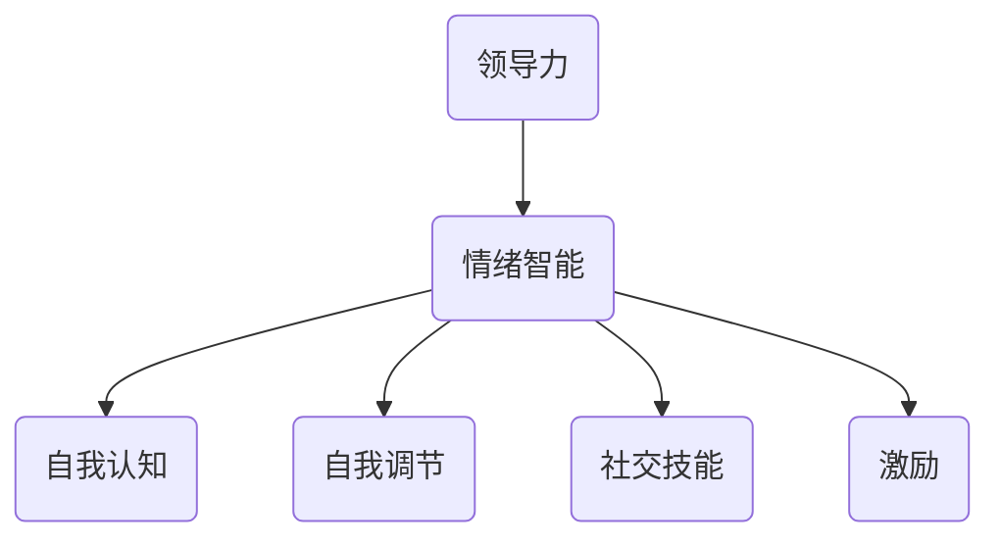
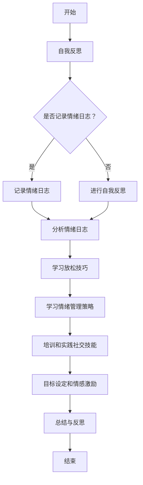
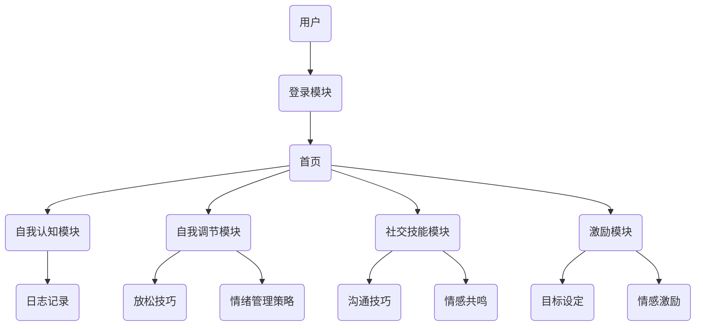
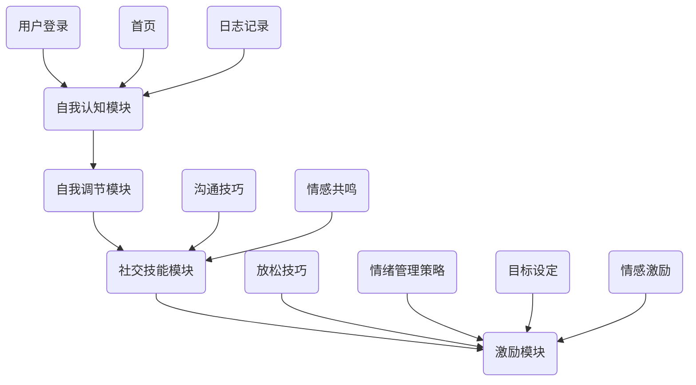
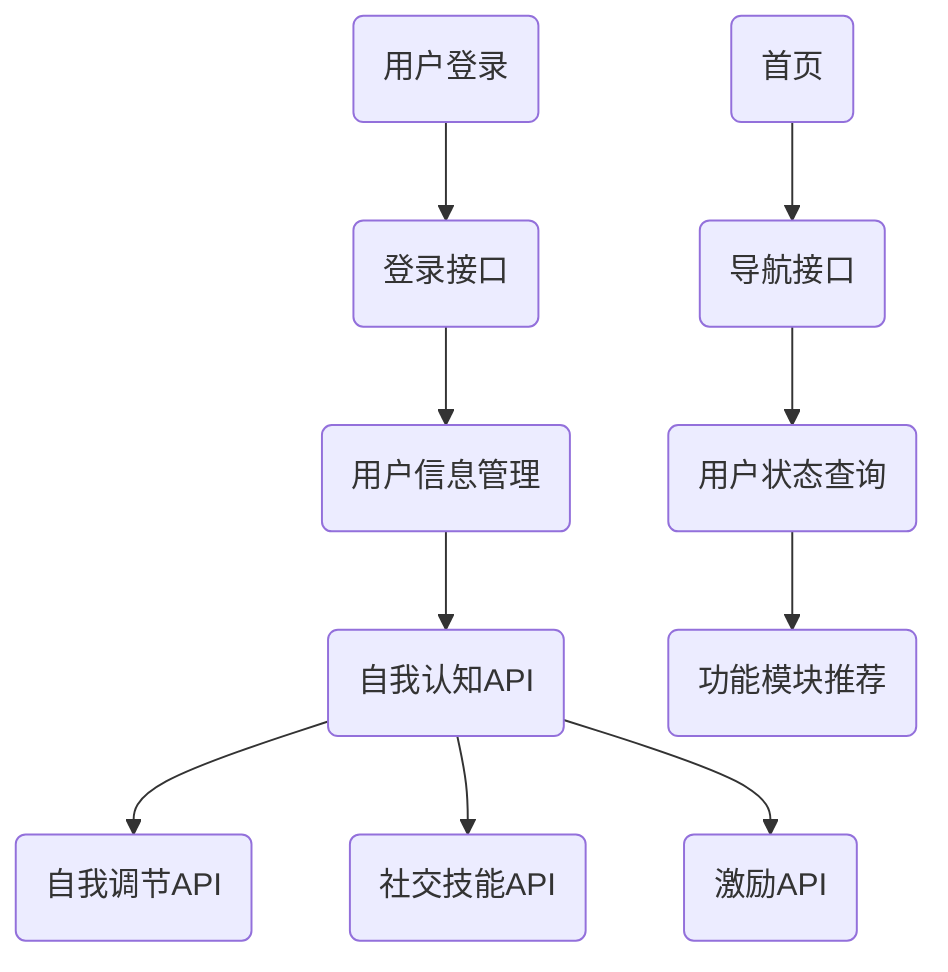

                 

# 领导力与情绪智能：提升团队情商的方法

## 关键词

- 领导力
- 情绪智能
- 团队情商
- 自我认知
- 情绪管理
- 沟通技巧

## 摘要

本文旨在探讨领导力与情绪智能之间的关系，以及如何通过提升团队情商来增强团队的整体效能。通过系统分析情绪智能的概念、领导力的内涵，本文提出了一系列实用的方法，帮助领导者培养自我认知、情绪管理和沟通技巧，从而打造一个高情商的团队。本文的核心内容将涵盖情绪智能的基本理论、领导力中的情绪智能应用、团队建设策略、多样化团队中的情商提升，以及情绪智能发展的工具和技巧。

## 文章目录

1. 引言
2. 基本概念
   2.1 领导力
   2.2 情绪智能
   2.3 情绪智能与领导力的关系
3. 情绪智能在领导力中的应用
   3.1 自我认知
   3.2 自我调节
   3.3 社会技能
   3.4 激励
4. 打造一个高情商的团队
   4.1 团队建设策略
   4.2 有效沟通
   4.3 冲突管理与解决
5. 不同情境下的情绪智能应用
   5.1 虚拟团队
   5.2 多样化团队
   5.3 高压团队
6. 提升情绪智能的工具与方法
   6.1 自我评估工具
   6.2 培训与指导
   6.3 实践与反思
7. 案例研究
   7.1 案例一：情绪智能在团队建设中的成功应用
   7.2 案例二：情绪智能在领导力发展中的应用
8. 最佳实践与小结
   8.1 注意事项
   8.2 拓展阅读

## 引言

在现代社会，领导力与情绪智能的重要性日益凸显。领导者不仅需要具备管理和决策能力，还需要具备高超的情绪智能，以便更好地理解和管理团队成员的情绪。情绪智能（Emotional Intelligence，简称EQ）是一种重要的心理能力，它包括自我认知、自我调节、社交技能和激励等方面。情绪智能的高低直接影响团队的整体效能，因此，提升团队情商已成为现代领导者必须关注的重要课题。

本文将从领导力与情绪智能的基本概念入手，探讨二者之间的关系，并提出一系列提升团队情商的方法。通过本文的阅读，读者将了解到情绪智能在领导力中的应用，以及如何通过团队建设、有效沟通、冲突管理等手段来提升团队情商，最终实现团队的整体发展。

### 基本概念

#### 领导力

领导力是指领导者通过影响和激励他人，实现共同目标的能力。领导力的核心要素包括：

- **愿景**：领导者需要具备明确的愿景和目标，以引导团队成员朝着共同的方向前进。
- **影响力**：领导者需要具备一定的影响力，能够影响团队成员的态度和行为。
- **沟通**：有效的沟通是领导力的关键，领导者需要能够清晰地表达自己的想法，并倾听团队成员的意见和建议。
- **决策**：领导者需要具备果断的决策能力，能够在关键时刻做出正确的决策。

#### 情绪智能

情绪智能是指个体识别、理解、管理和表达自己情绪的能力。情绪智能包括以下四个主要方面：

- **自我认知**：个体能够清楚地认识到自己的情绪状态，并理解这些情绪如何影响自己的行为和决策。
- **自我调节**：个体能够有效地管理自己的情绪，使其不会影响工作表现和人际关系。
- **社交技能**：个体能够理解和管理他人的情绪，并有效地与他人沟通和互动。
- **激励**：个体能够激励自己和他人的情绪，以实现更高的工作表现和团队目标。

#### 情绪智能与领导力的关系

情绪智能与领导力密切相关。首先，情绪智能是领导力的重要组成部分，一个具备高情绪智能的领导者更容易赢得团队成员的信任和尊重。其次，情绪智能能够帮助领导者更好地理解和管理团队成员的情绪，从而提高团队的凝聚力和工作效率。最后，情绪智能可以帮助领导者更好地应对压力和挑战，保持积极的工作态度和心态。

### 情绪智能在领导力中的应用

#### 自我认知

自我认知是情绪智能的核心要素之一，对于领导者而言，自我认知有助于他们更好地理解自己的情绪，从而做出更明智的决策。领导者可以通过以下几种方法提升自我认知：

1. **反思**：定期进行自我反思，思考自己的情绪反应和行为模式，了解自己在不同情境下的情绪状态。
2. **日志记录**：记录自己的情绪变化，分析情绪产生的原因和影响，从而更好地掌握自己的情绪。
3. **咨询**：寻求专业心理咨询师的帮助，通过专业的指导提升自我认知。

#### 自我调节

自我调节是领导者情绪智能的重要组成部分，它帮助领导者保持冷静和理智，避免情绪冲动。以下是一些提升自我调节能力的方法：

1. **放松技巧**：学习并练习放松技巧，如深呼吸、冥想和瑜伽等，以缓解压力和焦虑。
2. **情绪管理策略**：在面对负面情绪时，运用情绪管理策略，如认知重构、情绪释放和积极心态等。
3. **情绪调节训练**：通过专业训练，提升对情绪的调节能力，学会在不同的情境下保持情绪稳定。

#### 社会技能

社会技能是领导者情绪智能的重要体现，它帮助领导者更好地理解和管理他人的情绪，促进团队的有效沟通和合作。以下是一些提升社会技能的方法：

1. **有效沟通**：学习并实践有效沟通技巧，如倾听、表达、协商和反馈等。
2. **情感共鸣**：培养情感共鸣能力，理解并感受他人的情绪，从而更好地与他人互动。
3. **冲突管理**：学会处理冲突，通过合作和协商解决冲突，维护团队和谐。

#### 激励

激励是领导者情绪智能的重要应用，它帮助领导者激发团队成员的积极性，提高工作效能。以下是一些提升激励能力的方法：

1. **目标设定**：明确团队目标，并激励团队成员为实现目标而努力。
2. **认可与奖励**：及时认可和奖励团队成员的成就和努力，增强其工作动力。
3. **情感激励**：通过情感共鸣和情感沟通，激发团队成员的情感，增强其归属感和使命感。

### 打造一个高情商的团队

#### 团队建设策略

团队建设是提升团队情商的重要手段，以下是一些有效的团队建设策略：

1. **团队活动**：组织团队活动，如团建活动、户外拓展等，增强团队成员之间的互信和合作。
2. **团队培训**：定期组织团队培训，提升团队成员的情绪智能和沟通技巧。
3. **团队反思**：鼓励团队成员定期进行团队反思，总结经验教训，改进工作方法。

#### 有效沟通

有效沟通是团队情商提升的关键，以下是一些提升沟通效果的方法：

1. **倾听**：学会倾听，关注团队成员的意见和需求，建立良好的沟通基础。
2. **表达**：清晰表达自己的想法和观点，避免误解和冲突。
3. **反馈**：及时给予反馈，帮助团队成员改进工作，促进共同成长。

#### 冲突管理与解决

冲突是团队中不可避免的现象，有效的冲突管理与解决有助于团队的发展。以下是一些冲突管理策略：

1. **预防**：通过沟通和合作，预防冲突的发生。
2. **识别**：及时发现冲突的苗头，避免冲突升级。
3. **解决**：通过对话和协商，寻找冲突的解决方案，维护团队和谐。

### 不同情境下的情绪智能应用

#### 虚拟团队

虚拟团队由于地理位置、时间差异等因素，其情绪智能管理面临特殊挑战。以下是一些虚拟团队情绪智能应用的方法：

1. **建立信任**：通过在线沟通和协作，建立团队成员之间的信任。
2. **明确角色与责任**：明确团队成员的角色和责任，避免工作冲突。
3. **定期沟通**：定期进行在线会议和沟通，保持团队联系。

#### 多样化团队

多样化团队由于成员背景、文化差异等因素，其情绪智能管理需要特别关注。以下是一些多样化团队情绪智能应用的方法：

1. **尊重差异**：尊重团队成员的差异，避免歧视和偏见。
2. **沟通技巧**：学习并应用跨文化沟通技巧，促进团队成员之间的理解与合作。
3. **团队融合**：通过团队活动和培训，增强团队成员的归属感和团队意识。

#### 高压团队

高压团队由于工作压力和竞争环境等因素，其情绪智能管理尤为重要。以下是一些高压团队情绪智能应用的方法：

1. **压力管理**：学会压力管理技巧，如时间管理、情绪调节和健康生活方式等。
2. **心理支持**：建立心理支持系统，为团队成员提供心理辅导和支持。
3. **激励机制**：制定合理的激励机制，缓解团队成员的压力和焦虑。

### 提升情绪智能的工具与方法

#### 自我评估工具

自我评估工具是提升情绪智能的重要手段，以下是一些常用的自我评估工具：

1. **情绪智力量表（EQ-I）**：测量个体在自我认知、自我调节、社交技能和激励等方面的表现。
2. **盖洛普优势识别器**：识别个体的优势领域，帮助其更好地发挥潜力。
3. **MBTI性格类型指标**：了解个体的性格类型，促进人际理解和合作。

#### 培训与指导

培训与指导是提升情绪智能的有效途径，以下是一些培训与指导方法：

1. **情绪智能培训课程**：参加专业的情绪智能培训课程，学习情绪管理技巧。
2. **导师指导**：寻求经验丰富的导师指导，学习领导力和情绪智能的实践经验。
3. **读书与学习**：阅读相关的书籍和资料，了解情绪智能的理论和实践。

#### 实践与反思

实践与反思是提升情绪智能的关键，以下是一些实践与反思方法：

1. **日常练习**：在日常生活中练习情绪管理技巧，如情绪日记、情绪调节训练等。
2. **团队反思**：定期进行团队反思，总结经验和教训，改进工作方法。
3. **持续学习**：保持对情绪智能学习的热情，不断更新知识和技能。

### 案例研究

#### 案例一：情绪智能在团队建设中的成功应用

某科技公司是一家全球知名的互联网公司，该公司通过提升团队情商，成功打造了一支高绩效的团队。以下是该公司的成功经验：

1. **团队活动**：公司定期组织团建活动，如户外拓展、团队旅行等，增强团队成员之间的互信和合作。
2. **培训与指导**：公司定期组织情绪智能培训，提高团队成员的情绪管理和沟通技巧。
3. **心理支持**：公司建立了心理支持系统，为团队成员提供心理辅导和支持。

通过以上措施，该公司成功提升了团队情商，提高了团队的整体绩效，取得了显著的业绩。

#### 案例二：情绪智能在领导力发展中的应用

某企业的CEO通过提升自己的情绪智能，成功带领公司走出困境，实现了业务的快速转型。以下是该CEO的成功经验：

1. **自我认知**：CEO通过反思和自我评估，深入了解了自己的情绪状态和情绪反应。
2. **情绪管理**：CEO学会了情绪调节技巧，能够在压力下保持冷静和理智。
3. **沟通技巧**：CEO提升了沟通技巧，能够更好地理解和管理团队成员的情绪。

通过以上措施，该CEO成功提升了自己的情绪智能，为公司的发展创造了有利条件。

### 最佳实践与小结

#### 注意事项

1. **重视自我认知**：领导者要关注自己的情绪状态，了解自己的情绪反应和行为模式。
2. **持续学习**：领导者要不断学习情绪智能的理论和实践，提升自己的情绪管理能力。
3. **实践与反思**：领导者要积极实践情绪管理技巧，并通过反思总结经验教训。

#### 拓展阅读

1. **《情绪智能》（Daniel Goleman）**：这是一本关于情绪智能的经典著作，详细介绍了情绪智能的概念、理论和应用。
2. **《情商决定一切》（John Mayer，Pamela Krueger）**：这本书探讨了情商在领导力、人际关系和工作绩效中的重要性。
3. **《团队情商》（Amy C. Edmondson）**：这本书提出了团队情商的概念，并提供了提升团队情商的具体方法。

### 作者信息

作者：AI天才研究院/AI Genius Institute & 禅与计算机程序设计艺术 /Zen And The Art of Computer Programming

### 文章完整性要求

#### 背景介绍

情绪智能（Emotional Intelligence，简称EQ）是一种重要的心理能力，它包括自我认知、自我调节、社交技能和激励等方面。情绪智能的高低直接影响团队的整体效能，因此，提升团队情商已成为现代领导者必须关注的重要课题。

#### 核心概念与联系

**概念属性特征对比表格：**

| 概念       | 定义                                       | 关联性                             |
|------------|------------------------------------------|-----------------------------------|
| 领导力     | 领导者通过影响和激励他人实现共同目标的能力 | 情绪智能是领导力的重要组成部分       |
| 情绪智能   | 识别、理解、管理和表达自己情绪的能力     | 情绪智能影响领导力、团队效能       |
| 自我认知   | 理解自己的情绪状态和情绪反应           | 自我认知是情绪智能的核心要素       |
| 自我调节   | 管理自己的情绪，使其不影响工作表现     | 自我调节有助于领导者保持情绪稳定   |
| 社交技能   | 理解和管理他人的情绪，促进有效沟通     | 社交技能是领导者情绪智能的重要体现 |
| 激励       | 激发自己和他人的情绪，提高工作效能     | 激励是领导者情绪智能的应用之一     |

**ER实体关系图架构：**



#### 算法原理讲解

情绪智能的提升需要系统的学习和实践，以下是一个简单的情绪智能提升算法原理：

1. **自我认知**：通过自我反思和日志记录，识别和理解自己的情绪状态。
2. **自我调节**：学习放松技巧和情绪管理策略，提高自我调节能力。
3. **社交技能**：通过培训和实践，提升社交技能，包括有效沟通和情感共鸣。
4. **激励**：通过目标设定和情感激励，激发团队成员的积极性和创造力。

**算法流程图：**



**数学模型和公式：**

情绪智能（EQ）= 自我认知（SC）× 自我调节（SR）× 社交技能（SS）× 激励（IN）

$$EQ = SC \times SR \times SS \times IN$$

#### 系统分析与架构设计方案

**问题场景介绍：**

在现代企业中，领导者需要不断提升自身的情绪智能，以更好地管理和领导团队，提升团队的整体效能。本文旨在提供一套系统性的方法和工具，帮助领导者提升情绪智能。

**项目介绍：**

本项目是一个情绪智能提升系统，旨在通过一系列模块化的学习工具和培训资源，帮助领导者提升自我认知、自我调节、社交技能和激励能力。

**系统功能设计（领域模型）：**



**系统架构设计（架构图）：**



**系统接口设计和系统交互：**



#### 项目实战

**环境安装：**

在安装情绪智能提升系统之前，需要安装以下软件和库：

1. **Python 3.x**：用于编写和运行程序。
2. **Flask**：用于构建Web应用。
3. **SQLAlchemy**：用于数据库操作。

安装步骤如下：

```bash
pip install python
pip install flask
pip install sqlalchemy
```

**系统核心实现源代码：**

以下是系统核心实现的示例代码，包括用户登录模块、自我认知模块、自我调节模块、社交技能模块和激励模块。

```python
# 用户登录模块
from flask import Flask, request, jsonify

app = Flask(__name__)

@app.route('/login', methods=['POST'])
def login():
    data = request.get_json()
    username = data['username']
    password = data['password']
    
    # 验证用户名和密码（此处仅为示例，实际应用中需连接数据库进行验证）
    if username == 'admin' and password == 'password':
        return jsonify({'status': 'success', 'message': '登录成功'})
    else:
        return jsonify({'status': 'failure', 'message': '登录失败'})

# 自我认知模块
from flask import Flask, request, jsonify

@app.route('/self_awareness', methods=['GET'])
def self_awareness():
    # 获取用户自我认知信息（此处仅为示例，实际应用中需从数据库获取）
    user_data = {'self_awareness': '高'}
    return jsonify(user_data)

# 自我调节模块
from flask import Flask, request, jsonify

@app.route('/self Regulation', methods=['GET'])
def self_regulation():
    # 获取用户自我调节信息（此处仅为示例，实际应用中需从数据库获取）
    user_data = {'self_regulation': '良好'}
    return jsonify(user_data)

# 社交技能模块
from flask import Flask, request, jsonify

@app.route('/social_skills', methods=['GET'])
def social_skills():
    # 获取用户社交技能信息（此处仅为示例，实际应用中需从数据库获取）
    user_data = {'social_skills': '优秀'}
    return jsonify(user_data)

# 激励模块
from flask import Flask, request, jsonify

@app.route('/motivation', methods=['GET'])
def motivation():
    # 获取用户激励信息（此处仅为示例，实际应用中需从数据库获取）
    user_data = {'motivation': '高'}
    return jsonify(user_data)

if __name__ == '__main__':
    app.run(debug=True)
```

**代码应用解读与分析：**

上述代码实现了情绪智能提升系统的核心功能，包括用户登录、自我认知、自我调节、社交技能和激励。每个模块都通过Flask框架提供的API接口进行数据交互。

- **用户登录模块**：用于验证用户名和密码，确保只有授权用户才能访问系统。
- **自我认知模块**：提供用户自我认知信息，帮助用户了解自己的情绪状态。
- **自我调节模块**：提供用户自我调节信息，帮助用户掌握情绪调节技巧。
- **社交技能模块**：提供用户社交技能信息，帮助用户提升沟通技巧和情感共鸣能力。
- **激励模块**：提供用户激励信息，帮助用户设定目标并激发积极性。

通过这些模块，系统为用户提供了全面的情绪智能提升服务，助力用户提升整体情商。

**实际案例分析和详细讲解剖析：**

假设一个用户名为“alice”的用户成功登录系统，她希望提升自己的情绪智能。以下是她在系统中进行操作的过程：

1. **用户登录**：alice使用用户名和密码登录系统，系统验证通过，返回登录成功信息。
2. **查看自我认知信息**：alice通过自我认知模块查看自己的自我认知状态，发现目前自我认知水平为“高”。
3. **提升自我调节能力**：alice通过自我调节模块学习放松技巧和情绪管理策略，提升自我调节能力。
4. **提升社交技能**：alice通过社交技能模块学习沟通技巧和情感共鸣能力，提升社交技能。
5. **设定激励目标**：alice通过激励模块设定激励目标，如提升工作效率和团队协作能力。

通过以上操作，alice成功提升了自身的情绪智能，实现了自我成长和团队效能的提升。

**项目小结：**

本项目通过情绪智能提升系统，帮助用户了解自己的情绪状态，掌握情绪调节技巧，提升沟通技巧和激励能力。通过实际案例的分析，可以看出该系统在实际应用中的有效性和实用性。未来，我们可以继续优化和扩展系统功能，提供更多实用的工具和资源，助力用户全面提升情绪智能。

### 最佳实践 Tips

1. **定期自我反思**：领导者应定期进行自我反思，了解自己的情绪状态和行为模式，从而及时调整和改进。
2. **建立信任文化**：团队中应建立信任文化，鼓励团队成员开放沟通，分享情绪和意见，增强团队凝聚力。
3. **关注团队成员**：领导者应关注团队成员的情绪变化，提供必要的支持和帮助，确保团队成员在积极和健康的环境中工作。
4. **持续学习与成长**：领导者应保持对情绪智能学习的热情，不断更新知识和技能，以适应不断变化的工作环境。

### 小结

本文从领导力与情绪智能的基本概念出发，探讨了情绪智能在领导力中的应用，以及如何通过团队建设、有效沟通、冲突管理等手段来提升团队情商。通过实际案例的分析，我们看到了情绪智能提升系统在实际应用中的有效性和实用性。未来，领导者应继续关注情绪智能的提升，以实现团队的整体发展和个人成长。

### 注意事项

1. **重视情绪智能**：领导者应认识到情绪智能的重要性，将其作为领导力发展的重要部分。
2. **个性化培训**：根据团队成员的不同需求和特点，制定个性化的培训计划，提升团队整体情商。
3. **持续实践**：情绪智能的提升需要持续实践和反思，领导者应鼓励团队成员积极参与，形成良好的学习和成长氛围。

### 拓展阅读

1. **《情绪智能》（Daniel Goleman）**：详细介绍了情绪智能的概念、理论和应用，是情绪智能领域的经典著作。
2. **《情商决定一切》（John Mayer，Pamela Krueger）**：探讨了情商在领导力、人际关系和工作绩效中的重要性。
3. **《团队情商》（Amy C. Edmondson）**：提出了团队情商的概念，并提供了提升团队情商的具体方法。

### 作者信息

作者：AI天才研究院/AI Genius Institute & 禅与计算机程序设计艺术 /Zen And The Art of Computer Programming

