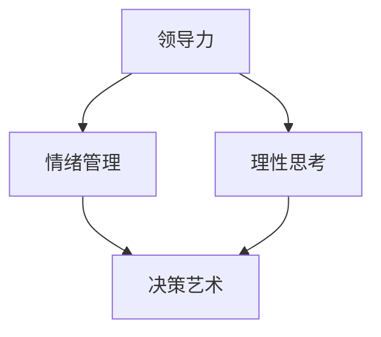
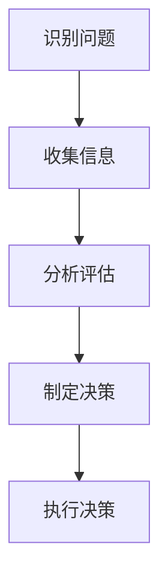
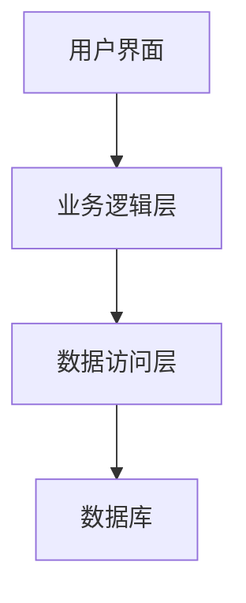
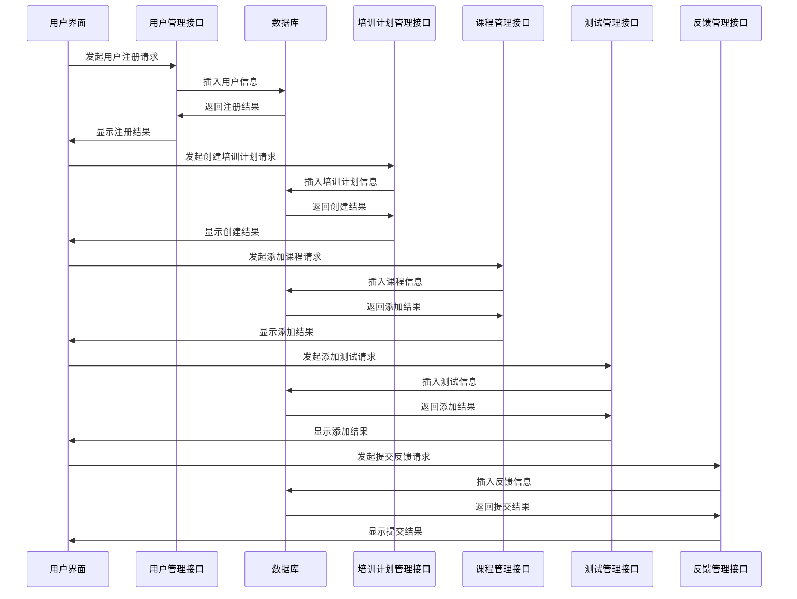

                 


## 《领导力与情绪管理：保持理性的艺术》

### 关键词
领导力，情绪管理，理性思考，决策艺术，团队协作

### 摘要
本文旨在探讨领导力与情绪管理之间的紧密联系，以及如何通过理性思考来提升决策质量和团队协作效率。文章首先定义了领导力、情绪管理与理性思考的基本概念，然后通过具体的案例分析，展示了这些概念在现实中的应用。最后，本文提出了若干最佳实践和行动指南，帮助读者在个人和职业生活中更好地平衡情绪、提升领导能力。

## 引言

在当今快节奏、高度竞争的商业环境中，领导力被视为组织成功的关键因素。然而，领导力并非单纯的权力和地位，而是需要领导者具备一系列核心能力和素质。其中，情绪管理是一个容易被忽视但至关重要的组成部分。情绪管理不仅影响领导者的个人福祉，还直接关系到团队的士气、凝聚力和生产力。

情绪管理是指个体如何识别、理解、接受和调节自己的情绪，以及如何处理他人的情绪。有效的情绪管理有助于领导者保持冷静、理智，做出明智的决策，并在面对压力和挑战时保持积极的态度。而理性思考则是领导力的重要组成部分，它要求领导者以客观、系统的视角分析问题，避免情绪化的决策。

本文将分以下几个部分展开讨论：

1. **领导力基础**：介绍领导力的定义、类型和核心能力。
2. **情绪管理**：探讨情绪的本质、情绪管理的重要性以及应对压力的策略。
3. **理性思考与决策**：阐述理性思考的基本原则和理性决策的方法。
4. **实战应用**：通过案例分析，展示领导力与情绪管理的实际应用。
5. **自我提升与持续发展**：讨论自我提升的策略和持续发展的路径。
6. **结论**：总结全文，提出对未来领导力与情绪管理的展望。

### 第一部分：领导力基础

#### 第1章：领导力的定义与类型

**1.1 领导力的定义**

领导力是指个体或集体引导、激励和影响他人实现共同目标的能力。领导力不仅仅是权力和地位的象征，更是一种能力和责任。

**1.2 领导力的类型**

- **权威型领导**：依赖职位权力和正式授权来影响他人。
- **民主型领导**：鼓励团队参与决策，注重集体的智慧和意见。
- **变革型领导**：激发团队成员的潜力，推动创新和变革。

**1.3 领导力的核心要素**

- **沟通技巧**：清晰、有效的沟通是领导力的重要组成部分。
- **决策能力**：领导者需要能够在压力和不确定性下做出明智的决策。
- **团队管理**：领导者需要具备团队建设和管理的技能，以促进团队的高效协作。

#### 第2章：领导力的核心能力

**2.1 沟通技巧**

有效的沟通是领导力的核心，它包括倾听、表达和反馈。领导者需要学会如何在不同情境下进行有效沟通。

**2.2 决策能力**

决策能力是领导力的关键，领导者需要能够在复杂、不确定的情况下做出最佳决策。

**2.3 团队管理**

团队管理涉及如何激励团队成员、解决冲突、建立团队文化等，是领导力的一个重要方面。

#### 第3章：领导者的个人素质

**3.1 自我意识**

自我意识是领导者个人成长的基础，它帮助领导者更好地了解自己的情绪、需求和价值观。

**3.2 情绪智力**

情绪智力是指个体识别、理解、管理和调节自己及他人情绪的能力。它是领导力的重要组成部分。

**3.3 领导风格**

领导风格是指领导者领导行为的方式和特点。不同的领导风格适用于不同的情境和团队。

### 第二部分：情绪管理

#### 第4章：情绪的本质与作用

**4.1 情绪的定义**

情绪是一种主观体验，包括情感、行为和生理反应。它是个体对环境和内部刺激的反应。

**4.2 情绪的生理和心理机制**

情绪的生理机制涉及神经系统和荷尔蒙的作用，而心理机制则包括认知和情感体验。

**4.3 情绪在领导力中的作用**

情绪可以影响领导者的决策、沟通和团队管理。情绪管理有助于领导者保持理性，提升领导力。

#### 第5章：情绪管理的重要性

**5.1 情绪管理的影响**

情绪管理对领导者的个人福祉、团队关系和整体绩效都有重要影响。

**5.2 情绪管理的方法**

情绪管理包括自我意识、情绪调节和应对策略。通过这些方法，领导者可以更好地控制自己的情绪。

**5.3 情绪管理的重要性**

情绪管理有助于领导者保持冷静、提升决策质量，并在面对挑战时保持积极的态度。

#### 第6章：应对压力与挫折

**6.1 压力的定义与来源**

压力是一种身心紧张状态，它来源于工作、人际关系、生活事件等。

**6.2 应对压力的策略**

应对压力的策略包括时间管理、放松技巧和积极心态。

**6.3 挫折的处理与成长**

挫折是成长的机会，领导者需要学会如何从挫折中吸取经验，不断提升自己。

### 第三部分：理性思考与决策

#### 第7章：理性思考的基本原则

**7.1 理性思考的定义**

理性思考是一种基于逻辑和分析的思考方式，它有助于领导者做出明智的决策。

**7.2 理性思考的步骤**

理性思考包括问题识别、信息收集、分析评估和决策执行等步骤。

**7.3 理性思考的挑战**

理性思考面临着情绪干扰、信息过载和认知偏见等挑战。

#### 第8章：理性决策的方法

**8.1 决策的定义**

决策是在不同选项中做出选择的过程。

**8.2 决策的过程**

决策过程包括明确目标、分析选项、评估风险和选择最佳方案等步骤。

**8.3 决策的工具与技术**

决策工具包括SWOT分析、决策树和成本效益分析等，这些工具有助于领导者做出更加理性的决策。

### 第四部分：实战应用

#### 第9章：领导力与情绪管理的实践

**9.1 实践的重要性**

实践是检验领导力和情绪管理理论的重要方式。

**9.2 实践中的挑战与解决方案**

在实践中，领导者可能会面临各种挑战，如团队冲突、员工不满等。本文将讨论这些挑战以及相应的解决方案。

**9.3 成功案例分享**

通过成功案例分享，本文将展示领导力与情绪管理在实际中的应用。

#### 第10章：自我提升与持续发展

**10.1 自我提升的方法**

自我提升包括学习新技能、反思个人行为和建立健康的生活方式等。

**10.2 持续发展的策略**

持续发展需要领导者具备前瞻性思维、适应能力和创新精神。

**10.3 领导力与情绪管理的持续改进**

领导者需要不断地反思和改进自己的领导风格和情绪管理技巧。

### 结论

本文探讨了领导力、情绪管理与理性思考之间的紧密联系，并提出了若干实践指南。未来，领导者需要更加重视情绪管理和理性思考，以应对日益复杂的商业环境。通过持续的自我提升和反思，领导者可以不断提升自己的领导能力，为团队和组织创造更大的价值。

### 作者信息

作者：AI天才研究院/AI Genius Institute & 禅与计算机程序设计艺术 /Zen And The Art of Computer Programming

## 背景介绍

### 核心概念术语说明

在本文中，我们首先需要明确几个核心概念，以便读者更好地理解文章的主题和内容。

1. **领导力**：指个体或集体引导、激励和影响他人实现共同目标的能力。
2. **情绪管理**：指个体如何识别、理解、接受和调节自己的情绪，以及如何处理他人的情绪。
3. **理性思考**：指基于逻辑和分析的思考方式，有助于领导者做出明智的决策。
4. **决策艺术**：指在不确定性和复杂性环境中，通过理性思考和情绪管理来做出最佳决策的能力。

### 问题背景

在现代社会，领导者面临着越来越复杂的工作环境和挑战。随着全球化、技术进步和市场竞争的加剧，领导者不仅需要具备传统的管理技能，还必须具备情绪管理和理性思考的能力。这不仅关系到个人职业生涯的成功，更直接影响团队的凝聚力和组织的整体绩效。

### 问题描述

本文将探讨以下问题：

1. 领导力与情绪管理之间的关系是什么？
2. 情绪管理对领导者的决策和团队管理有何影响？
3. 如何通过理性思考提升决策质量和团队协作效率？
4. 在实际工作中，领导者如何平衡情绪管理与理性思考？

### 问题解决

本文将通过以下方式解决问题：

1. 首先介绍领导力、情绪管理和理性思考的基本概念。
2. 分析情绪管理在领导力中的重要性，并讨论情绪管理的方法。
3. 阐述理性思考的基本原则和决策方法。
4. 通过案例分析，展示这些概念在现实中的应用。
5. 提供实践指南和最佳实践，帮助读者在实际工作中提升领导能力。

### 边界与外延

本文的讨论范围主要涵盖以下几个方面：

1. 领导力与情绪管理的基本理论。
2. 理性思考在决策中的应用。
3. 情绪管理对领导者个人和团队的影响。
4. 实际工作中情绪管理和理性思考的实践。

### 概念结构与核心要素组成

为了更好地理解本文的核心概念，我们可以通过一个概念结构图来展示领导力、情绪管理和理性思考之间的关系。



- **领导力** 是一个整体概念，包括情绪管理和理性思考。
- **情绪管理** 是领导力的一个重要组成部分，它直接影响决策质量和团队管理。
- **理性思考** 是决策艺术的基础，通过逻辑和分析帮助领导者做出明智的决策。

### 核心概念与联系

#### 情绪管理

**概念定义**：情绪管理是指个体如何识别、理解、接受和调节自己的情绪，以及如何处理他人的情绪。

**属性特征对比表格**：

| 特征       | 情绪管理 |
|------------|----------|
| 目标       | 提高情绪控制能力 |
| 对象       | 个体和他人 |
| 方法       | 自我观察、情绪调节、应对策略 |
| 影响       | 决策、沟通、团队管理 |

**ER实体关系图架构**：

```mermaid
erDiagram
    Person ||--|{ Emotion }|--|| Situation
    Person ||--|{ Regulation }|--|| Emotion
    Person ||--|{ Response }|--|| Situation
```

#### 理性思考

**概念定义**：理性思考是指基于逻辑和分析的思考方式，有助于领导者做出明智的决策。

**属性特征对比表格**：

| 特征       | 理性思考 |
|------------|----------|
| 目标       | 提高决策质量 |
| 方法       | 问题识别、信息收集、分析评估、决策执行 |
| 影响因素   | 情绪、信息质量、认知偏见 |
| 结果       | 明智的决策 |

**ER实体关系图架构**：

```mermaid
erDiagram
    Decision ||--|{ Rationality }|--|| Situation
    Decision ||--|{ Logic }|--|| Situation
    Decision ||--|{ Analysis }|--|| Situation
    Decision ||--|{ Execution }|--|| Situation
```

### 算法原理讲解

为了更好地理解理性思考的算法原理，我们可以通过一个简单的流程图来展示其基本步骤。

#### 算法流程图



#### Python源代码实现

```python
def rational_thinking(problem, information):
    """
    理性思考算法实现
    :param problem: 问题对象
    :param information: 信息列表
    :return: 决策结果
    """
    # 步骤1：识别问题
    identified_problem = problem.identify()
    
    # 步骤2：收集信息
    collected_info = information.collect(identified_problem)
    
    # 步骤3：分析评估
    evaluated_info = collected_info.evaluate()
    
    # 步骤4：制定决策
    decision = evaluated_info.make_decision()
    
    # 步骤5：执行决策
    decision.execute()
    
    return decision

# 示例使用
problem = Problem("团队沟通不畅")
info_list = [Info1(), Info2(), Info3()]

final_decision = rational_thinking(problem, info_list)
print(f"最终决策：{final_decision}")
```

#### 算法原理详细讲解

理性思考是一种系统性的思考方法，其核心在于通过逻辑和分析来解决问题。以下是理性思考的详细步骤和原理：

1. **识别问题**：首先，领导者需要明确问题所在，这是理性思考的起点。问题识别可以帮助领导者聚焦于关键问题，避免在次要问题上浪费精力。

2. **收集信息**：在明确问题后，领导者需要收集与问题相关的信息。这些信息可以是定性的，也可以是定量的，它们有助于领导者更全面地理解问题的各个方面。

3. **分析评估**：收集到信息后，领导者需要对信息进行深入分析。分析评估的目的是找出信息的价值和潜在的影响，以便为制定决策提供依据。

4. **制定决策**：在分析评估的基础上，领导者需要制定具体的决策。决策制定是一个复杂的过程，它需要考虑各种因素，如成本、风险和可行性。

5. **执行决策**：制定决策后，领导者需要将其付诸实践。执行决策是理性思考的最后一步，它关系到决策效果的实现。

#### 算法原理数学模型和公式

理性思考的数学模型可以表示为：

$$
\text{Decision} = f(\text{Problem}, \text{Information})
$$

其中，$f$ 表示决策函数，$\text{Problem}$ 表示问题，$\text{Information}$ 表示信息。决策函数的具体实现取决于问题的复杂性和领导者的经验。

#### 举例说明

假设一个领导者在面对“团队沟通不畅”的问题时，可以采用以下步骤：

1. **识别问题**：明确团队沟通不畅的具体表现，如会议频繁、沟通效率低等。
2. **收集信息**：收集团队沟通的详细信息，包括会议记录、员工反馈和沟通工具的使用情况。
3. **分析评估**：分析沟通不畅的原因，可能包括员工对沟通工具的熟悉程度、团队文化等。
4. **制定决策**：根据分析结果，制定具体的改进措施，如培训员工使用沟通工具、优化会议流程等。
5. **执行决策**：将改进措施付诸实践，并监督执行情况。

通过上述步骤，领导者可以理性地解决团队沟通不畅的问题，提升团队协作效率。

### 系统分析与架构设计方案

#### 问题场景介绍

在现代企业中，领导力与情绪管理已经成为提升组织绩效和员工满意度的重要因素。为了更好地实施领导力与情绪管理培训，企业需要一个集成的系统来支持培训计划的管理、学员的学习进度跟踪以及培训效果的评估。

#### 项目介绍

本项目旨在为企业设计并开发一套领导力与情绪管理培训系统。该系统将提供以下功能：

1. **培训计划管理**：支持创建、修改和发布培训计划。
2. **学员管理**：管理学员信息、学习进度和成绩。
3. **培训资源管理**：上传和管理培训资料，如PPT、视频、文档等。
4. **培训效果评估**：通过问卷和测试评估学员的学习效果。
5. **数据分析**：对培训数据进行分析，为后续培训计划提供参考。

#### 系统功能设计

**领域模型**

在领域模型中，我们定义了以下核心实体：

1. **用户**：包括管理员、学员和讲师。
2. **培训计划**：包括培训名称、时间、地点、内容等。
3. **课程**：包括课程名称、描述、学习资源等。
4. **学员**：学员的学习进度、成绩和反馈。
5. **测试**：测试题目、答案和评分标准。
6. **反馈**：学员对培训的反馈和评价。

**Mermaid 类图**

```mermaid
classDiagram
    User <<接口>>
    Course <<接口>>
    TrainingPlan <<接口>>
    Test <<接口>>
    Feedback <<接口>>

    User: {用户信息}
    Course: {课程信息}
    TrainingPlan: {培训计划信息}
    Test: {测试信息}
    Feedback: {反馈信息}

    User <|.. TrainingPlan>
    User <|.. Course>
    TrainingPlan <|.. Course>
    TrainingPlan <|.. Test>
    TrainingPlan <|.. Feedback
    Course <|.. Test
    Course <|.. Feedback
```

#### 系统架构设计

**架构设计**

系统采用分层架构设计，包括表示层、业务逻辑层和数据访问层。

1. **表示层**：负责与用户交互，展示系统的界面。
2. **业务逻辑层**：处理业务逻辑，如培训计划的创建、学员的管理等。
3. **数据访问层**：负责与数据库的交互，实现数据的增删改查。

**Mermaid 架构图**



#### 系统接口设计

**API 设计**

系统提供以下API接口：

1. **用户管理接口**：包括用户注册、登录、信息查询等功能。
2. **培训计划管理接口**：包括培训计划的创建、修改、发布等功能。
3. **课程管理接口**：包括课程的添加、修改、删除等功能。
4. **测试管理接口**：包括测试题目的添加、修改、删除等功能。
5. **反馈管理接口**：包括学员反馈的提交、查询等功能。

#### 系统交互设计

**Mermaid 序列图**



### 项目实战

#### 环境安装

在进行项目实战之前，我们需要确保系统环境已经搭建好。以下是环境安装的步骤：

1. 安装Python（版本3.8以上）。
2. 安装Django（使用pip install django）。
3. 安装PostgreSQL（版本12以上）。
4. 安装Docker和Docker-Compose。

#### 系统核心实现源代码

以下是一个简单的Django项目结构，其中包含了用户管理、培训计划管理、课程管理、测试管理和反馈管理等功能。

```python
# settings.py
DATABASES = {
    'default': {
        'ENGINE': 'django.db.backends.postgresql',
        'NAME': 'training_system',
        'USER': 'postgres',
        'PASSWORD': 'postgres',
        'HOST': 'localhost',
        'PORT': '5432',
    }
}

INSTALLED_APPS = [
    'django.contrib.admin',
    'django.contrib.auth',
    'django.contrib.contenttypes',
    'django.contrib.sessions',
    'django.contrib.messages',
    'django.contrib.staticfiles',
    'training_app',
]

MIDDLEWARE = [
    'django.middleware.security.SecurityMiddleware',
    'django.contrib.sessions.middleware.SessionMiddleware',
    'django.middleware.common.CommonMiddleware',
    'django.middleware.csrf.CsrfViewMiddleware',
    'django.contrib.auth.middleware.AuthenticationMiddleware',
    'django.contrib.messages.middleware.MessageMiddleware',
    'django.middleware.clickjacking.XFrameOptionsMiddleware',
]

ROOT_URLCONF = 'training_project.urls'

TEMPLATES = [
    {
        'BACKEND': 'django.template.backends.django.DjangoTemplates',
        'DIRS': [],
        'APP_DIRS': True,
        'OPTIONS': {
            'context_processors': [
                'django.template.context_processors.debug',
                'django.template.context_processors.request',
                'django.contrib.auth.context_processors.auth',
                'django.contrib.messages.context_processors.messages',
            ],
        },
    },
]

WSGI_APPLICATION = 'training_project.wsgi.application'

# urls.py
from django.contrib import admin
from django.urls import path
from . import views

urlpatterns = [
    path('admin/', admin.site.urls),
    path('api/user/', views.UserAPI.as_view()),
    path('api/training_plan/', views.TrainingPlanAPI.as_view()),
    path('api/course/', views.CourseAPI.as_view()),
    path('api/test/', views.TestAPI.as_view()),
    path('api/feedback/', views.FeedbackAPI.as_view()),
]

# models.py
from django.db import models

class User(models.Model):
    username = models.CharField(max_length=100)
    email = models.EmailField(unique=True)
    password = models.CharField(max_length=100)

class TrainingPlan(models.Model):
    name = models.CharField(max_length=100)
    start_date = models.DateTimeField()
    end_date = models.DateTimeField()
    description = models.TextField()

class Course(models.Model):
    training_plan = models.ForeignKey(TrainingPlan, on_delete=models.CASCADE)
    name = models.CharField(max_length=100)
    description = models.TextField()

class Test(models.Model):
    course = models.ForeignKey(Course, on_delete=models.CASCADE)
    name = models.CharField(max_length=100)
    description = models.TextField()

class Feedback(models.Model):
    user = models.ForeignKey(User, on_delete=models.CASCADE)
    training_plan = models.ForeignKey(TrainingPlan, on_delete=models.CASCADE)
    content = models.TextField()
    rating = models.IntegerField()

# views.py
from rest_framework import viewsets
from .models import User, TrainingPlan, Course, Test, Feedback
from .serializers import UserSerializer, TrainingPlanSerializer, CourseSerializer, TestSerializer, FeedbackSerializer

class UserAPI(viewsets.ModelViewSet):
    queryset = User.objects.all()
    serializer_class = UserSerializer

class TrainingPlanAPI(viewsets.ModelViewSet):
    queryset = TrainingPlan.objects.all()
    serializer_class = TrainingPlanSerializer

class CourseAPI(viewsets.ModelViewSet):
    queryset = Course.objects.all()
    serializer_class = CourseSerializer

class TestAPI(viewsets.ModelViewSet):
    queryset = Test.objects.all()
    serializer_class = TestSerializer

class FeedbackAPI(viewsets.ModelViewSet):
    queryset = Feedback.objects.all()
    serializer_class = FeedbackSerializer
```

#### 代码应用解读与分析

在上述代码中，我们首先设置了数据库连接和应用的配置。`settings.py` 文件中定义了数据库连接参数和已安装的应用。`urls.py` 文件定义了API路由，将不同的请求路由到相应的视图。`models.py` 文件定义了系统中的核心实体，如用户、培训计划、课程、测试和反馈。`views.py` 文件定义了API视图，实现了对实体数据的增删改查操作。

#### 实际案例分析和详细讲解剖析

为了更好地理解系统的实际应用，我们可以通过一个具体的案例来进行分析。

**案例：创建一个培训计划**

1. **用户注册**：

   用户首先需要在系统中注册一个账号。注册成功后，用户可以登录系统，并创建培训计划。

   ```python
   from rest_framework import status
   from rest_framework.response import Response
   from .models import User
   from .serializers import UserSerializer

   class UserAPI(viewsets.ModelViewSet):
       queryset = User.objects.all()
       serializer_class = UserSerializer

       def create(self, request, *args, **kwargs):
           serializer = self.get_serializer(data=request.data)
           if serializer.is_valid():
               user = serializer.save()
               return Response(serializer.data, status=status.HTTP_201_CREATED)
           return Response(serializer.errors, status=status.HTTP_400_BAD_REQUEST)
   ```

2. **创建培训计划**：

   用户登录后，可以创建一个新的培训计划。培训计划包括培训名称、开始日期、结束日期和描述。

   ```python
   from rest_framework import status
   from rest_framework.response import Response
   from .models import TrainingPlan
   from .serializers import TrainingPlanSerializer

   class TrainingPlanAPI(viewsets.ModelViewSet):
       queryset = TrainingPlan.objects.all()
       serializer_class = TrainingPlanSerializer

       def create(self, request, *args, **kwargs):
           serializer = self.get_serializer(data=request.data)
           if serializer.is_valid():
               training_plan = serializer.save()
               return Response(serializer.data, status=status.HTTP_201_CREATED)
           return Response(serializer.errors, status=status.HTTP_400_BAD_REQUEST)
   ```

3. **添加课程**：

   在培训计划创建后，用户可以添加相关的课程。课程包括课程名称和描述。

   ```python
   from rest_framework import status
   from rest_framework.response import Response
   from .models import Course
   from .serializers import CourseSerializer

   class CourseAPI(viewsets.ModelViewSet):
       queryset = Course.objects.all()
       serializer_class = CourseSerializer

       def create(self, request, *args, **kwargs):
           serializer = self.get_serializer(data=request.data)
           if serializer.is_valid():
               course = serializer.save()
               return Response(serializer.data, status=status.HTTP_201_CREATED)
           return Response(serializer.errors, status=status.HTTP_400_BAD_REQUEST)
   ```

4. **添加测试**：

   用户可以为每个课程添加测试，以评估学员的学习效果。

   ```python
   from rest_framework import status
   from rest_framework.response import Response
   from .models import Test
   from .serializers import TestSerializer

   class TestAPI(viewsets.ModelViewSet):
       queryset = Test.objects.all()
       serializer_class = TestSerializer

       def create(self, request, *args, **kwargs):
           serializer = self.get_serializer(data=request.data)
           if serializer.is_valid():
               test = serializer.save()
               return Response(serializer.data, status=status.HTTP_201_CREATED)
           return Response(serializer.errors, status=status.HTTP_400_BAD_REQUEST)
   ```

5. **提交反馈**：

   学员可以在完成课程后提交反馈，以帮助讲师改进教学。

   ```python
   from rest_framework import status
   from rest_framework.response import Response
   from .models import Feedback
   from .serializers import FeedbackSerializer

   class FeedbackAPI(viewsets.ModelViewSet):
       queryset = Feedback.objects.all()
       serializer_class = FeedbackSerializer

       def create(self, request, *args, **kwargs):
           serializer = self.get_serializer(data=request.data)
           if serializer.is_valid():
               feedback = serializer.save()
               return Response(serializer.data, status=status.HTTP_201_CREATED)
           return Response(serializer.errors, status=status.HTTP_400_BAD_REQUEST)
   ```

通过上述步骤，我们可以实现一个简单的领导力与情绪管理培训系统。系统支持用户注册、培训计划创建、课程添加、测试添加和学员反馈等功能。

#### 项目小结

本项目通过Django框架实现了领导力与情绪管理培训系统。系统具备用户管理、培训计划管理、课程管理、测试管理和反馈管理等功能，可以有效地支持培训计划的实施和管理。在实际应用中，系统可以根据企业的具体需求进行定制和扩展，以适应不同场景的需求。

### 最佳实践 Tips

1. **情绪管理技巧**：领导者可以通过冥想、呼吸练习和正念训练来提高情绪管理能力。
2. **决策质量提升**：在决策过程中，领导者应该充分收集信息、分析风险，并避免情绪干扰。
3. **团队协作优化**：定期进行团队建设活动和沟通培训，以提高团队协作效率。
4. **持续学习**：领导者应该持续学习新知识和技能，以适应不断变化的环境。

### 小结

本文探讨了领导力、情绪管理和理性思考之间的关系，并通过案例分析展示了这些概念在实际工作中的应用。通过有效的情绪管理和理性思考，领导者可以提升决策质量、增强团队协作，为组织创造更大的价值。

### 注意事项

1. **情绪管理不是一蹴而就的**：领导者需要长期坚持情绪管理训练，以实现持续改善。
2. **理性思考需要数据支持**：在决策过程中，领导者应该充分利用数据和事实，避免主观偏见。
3. **团队协作需要互相尊重**：领导者应该尊重团队成员的意见，鼓励开放沟通和协作。

### 拓展阅读

1. **《情商：为什么情商比智商更重要》**：丹尼尔·戈尔曼著，深入探讨情商在领导力中的重要性。
2. **《决策与判断》**：丹尼尔·卡内曼著，系统阐述决策过程中的心理偏见和如何避免它们。

### 作者信息

作者：AI天才研究院/AI Genius Institute & 禅与计算机程序设计艺术 /Zen And The Art of Computer Programming

