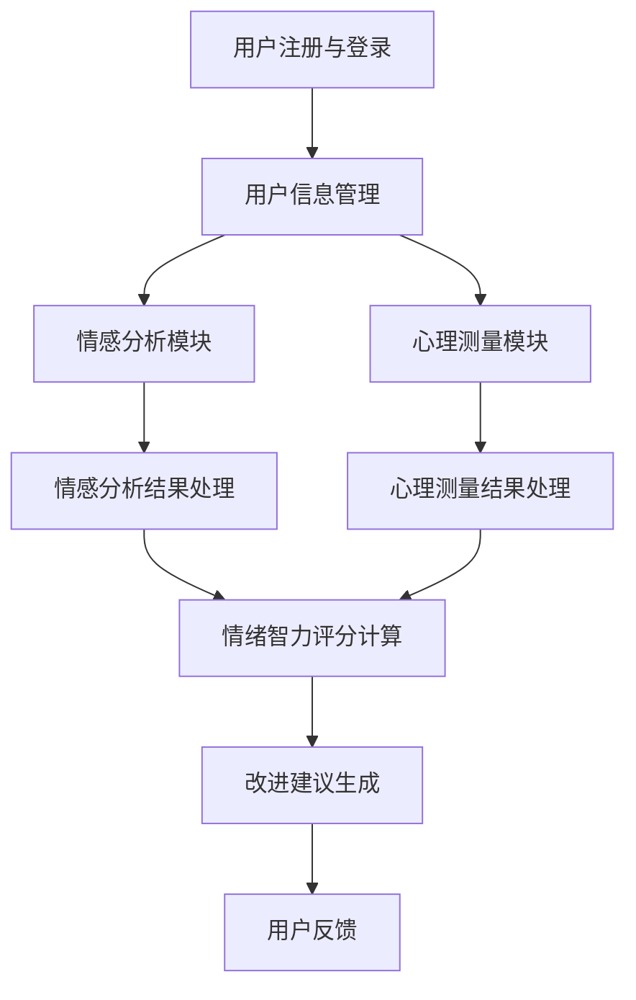
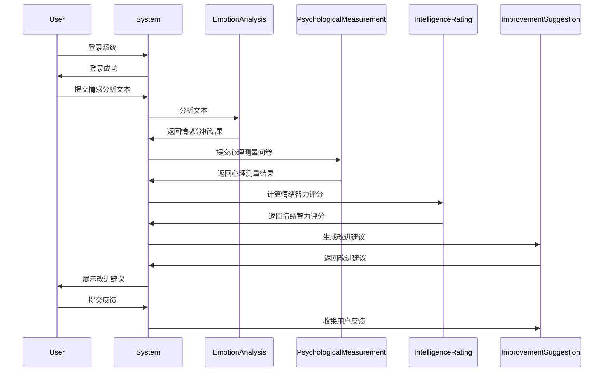

                 

# 领导力与情绪管理：在压力下保持冷静

> 关键词：领导力、情绪管理、压力、决策、心理健康

> 摘要：本文旨在探讨领导力与情绪管理之间的关系，特别是在面对压力时如何保持冷静。文章通过多个章节，深入分析领导力的本质、情绪智力的重要性、情绪调节技巧以及领导者在压力环境下的挑战和应对策略，旨在为领导者提供实用的指导和建议，帮助他们提升情绪管理水平，成为更有效的领导者。

## 引言：领导力与情绪管理的现代意义

在现代社会中，领导力与情绪管理的重要性愈发凸显。领导力不仅仅是指导和管理团队的能力，更是一种影响他人、推动变革和实现目标的艺术。情绪管理则是领导者保持心理健康、提升决策质量和建立良好团队关系的关键。面对快速变化的工作环境和高强度的工作压力，领导者需要具备良好的情绪管理能力，以应对各种挑战。

本文将从以下几个方面展开讨论：

1. **领导力的本质**：介绍领导力的定义、类型及其在现代组织中的作用。
2. **情绪智力**：探讨情绪智力的概念、组成部分以及其在领导力中的重要性。
3. **情绪调节**：提供一系列情绪调节技巧，帮助领导者识别和调节自己的情绪。
4. **压力下的领导力**：分析领导者在面对压力时的挑战，并提出有效的应对策略。

通过本文的讨论，读者将能够理解领导力与情绪管理之间的内在联系，学会在压力下保持冷静，提升自身的领导能力。

## 第1章 领导力的本质

领导力是一种复杂但至关重要的能力，它不仅影响个体的发展，还对整个团队的绩效和氛围产生深远的影响。在本章中，我们将探讨领导力的定义、类型以及领导者在现代组织中的作用。

### 领导力的定义

领导力是指一种通过影响、激励和指导他人来实现共同目标的能力。这种能力不仅仅依赖于职位和权力，更是一种通过行为和态度来影响他人意愿和行动的技能。领导力不仅仅是管理和指挥，更是一种创造愿景、建立信任和促进变革的能力。

### 领导力的类型

1. **权威型领导**：这种类型的领导者通过职位权力来指导和影响他人，通常在需要迅速决策和严格执行的情况下效果显著。
2. **变革型领导**：变革型领导者通过激励和鼓舞团队来推动变革，他们关注创新和团队发展，能够在挑战和不确定的环境中发挥关键作用。
3. **服务型领导**：服务型领导者专注于团队的需求和福祉，通过为团队成员提供支持和资源来促进团队的成功。
4. **民主型领导**：民主型领导者鼓励团队成员参与决策过程，通过共识来指导团队行动，这种领导方式有助于提高团队的凝聚力和创造力。

### 领导者在现代组织中的作用

1. **塑造愿景**：领导者需要明确组织的长远目标和愿景，并将其传达给团队成员，从而激发团队成员的积极性和创造力。
2. **建立信任**：信任是团队成功的基础，领导者需要通过透明、诚信的行为来建立和维护信任关系。
3. **促进创新**：领导者鼓励团队成员提出新想法和解决方案，通过创造一个鼓励创新的环境来推动组织的持续发展。
4. **激励团队**：领导者需要识别团队成员的动机和需求，通过激励措施来提高团队的士气和绩效。

### 情绪智力与领导力的关系

情绪智力（Emotional Intelligence，简称EQ）是指个体识别、理解、管理和调节自己及他人情绪的能力。情绪智力在领导力中扮演着至关重要的角色：

1. **情绪识别与自我调节**：领导者需要能够识别自己的情绪，并在必要时进行调节，以保持冷静和专注。
2. **同理心**：领导者通过同理心来理解团队成员的情绪和需求，从而更好地激励和指导团队。
3. **社交技能**：领导者需要具备良好的社交技能，包括沟通、协商和解决冲突的能力，以建立和维护良好的团队关系。

总之，领导力的本质在于通过影响和激励他人来实现共同目标。在现代社会中，领导者不仅需要具备传统的管理技能，还需要具备强大的情绪智力，以应对复杂多变的挑战和环境。

### 本章总结

本章深入探讨了领导力的定义、类型以及领导者在现代组织中的作用。同时，我们强调了情绪智力在领导力中的重要性，以及情绪管理对于领导者保持心理健康和提升领导效果的关键作用。通过理解这些核心概念，领导者可以更好地应对日常工作和生活中的挑战，成为更有效的领导者。

## 第2章 情绪智力

情绪智力（Emotional Intelligence，简称EQ）是领导力的关键组成部分，它涵盖了个体识别、理解、管理和调节自己及他人情绪的能力。情绪智力不仅仅是一种情感上的智慧，更是一种能够显著影响个人和团队绩效的能力。在本章中，我们将深入探讨情绪智力的概念、组成部分以及其在领导力中的重要性。

### 情绪智力的概念

情绪智力最早由心理学家彼得·萨洛维（Peter Salovey）和约翰·梅耶（John D. Mayer）在1990年提出，他们认为情绪智力包括四个核心能力：

1. **情感识别**：能够识别和理解自己和他人的情绪状态。
2. **情感理解**：能够理解情绪背后的原因和意义。
3. **情感调节**：能够管理和调节自己和他人的情绪，以适应各种情境。
4. **社交技能**：能够有效沟通和建立人际关系。

这些能力共同构成了情绪智力的核心，使个体能够更好地应对工作和生活中的挑战。

### 情绪智力的组成部分

情绪智力可以细分为以下五个主要组成部分：

1. **自我意识**：个体能够识别和了解自己的情绪状态，包括情绪的触发因素、情绪的强度和情绪的持续时间。自我意识是情绪智力的重要基础，它帮助个体更好地理解自己的情绪，并做出更明智的决策。

2. **自我调节**：个体能够管理和调节自己的情绪，以适应不同的情境和需求。自我调节能力包括情绪控制、情绪释放和情绪调节策略。这种能力使个体能够在压力和挑战面前保持冷静和专注。

3. **同理心**：个体能够识别和理解他人的情绪状态，并感同身受。同理心是一种强大的社交技能，它有助于建立信任和有效的沟通，是领导者激励和指导团队的重要工具。

4. **社交技能**：个体能够有效地与他人沟通、协调和建立人际关系。社交技能包括倾听、表达、协商和解决冲突的能力。这些技能使个体能够在团队中发挥领导作用，并促进团队的协作和合作。

5. **动机**：个体能够识别和追求内在动机，而不是仅仅为了外在奖励或惩罚。动机是推动个体行为和持续努力的关键因素，它有助于个体在面对挑战和困难时保持积极和坚持不懈。

### 情绪智力与领导力的关系

情绪智力在领导力中起着至关重要的作用。以下是情绪智力如何影响领导者表现的一些关键方面：

1. **决策能力**：情绪智力高的领导者能够更好地处理复杂和压力重重的决策情境。他们能够识别和理解情绪对决策过程的影响，并运用情绪调节策略来提高决策的质量和效率。

2. **团队建设**：情绪智力高的领导者能够建立更加和谐和高效的团队。他们通过同理心和社交技能来理解团队成员的需求和动机，并通过积极的沟通和激励来促进团队合作和协作。

3. **应对压力**：情绪智力高的领导者能够更好地应对工作中的压力和挑战。他们具备自我调节和压力管理能力，能够在压力环境中保持冷静和专注，从而做出更明智的决策。

4. **情感领导**：情绪智力高的领导者能够通过情感共鸣和激励来影响团队成员。他们能够理解团队成员的情感状态，并通过有效的沟通和激励来激发团队的潜力和动力。

### 情绪智力的测量和发展

情绪智力可以通过一系列的工具和测试进行测量，如迈尔斯-布里格斯类型指标（MBTI）和哥斯达黎加情绪智力测验（CEI）。这些工具可以帮助个体了解自己的情绪智力水平，并识别需要改进的领域。

发展情绪智力可以通过以下几种方式：

1. **自我反思**：通过定期进行自我反思，个体可以更好地了解自己的情绪状态和反应模式，从而进行有效的情绪调节。

2. **情绪调节训练**：通过练习情绪调节技巧，如深呼吸、冥想和正念练习，个体可以提升自我调节能力。

3. **同理心培养**：通过阅读、学习和实践同理心技巧，个体可以提升理解他人情绪的能力。

4. **社交技能提升**：通过参加沟通技巧培训、团队建设活动和领导力研讨会，个体可以提升社交技能，从而更好地与他人沟通和建立关系。

总之，情绪智力是领导力的关键组成部分，它对领导者的表现和团队的成功起着至关重要的作用。通过理解情绪智力的概念和组成部分，领导者可以更好地发展自己的情绪智力，提升领导力，成为更有效的领导者。

### 本章总结

本章详细探讨了情绪智力的概念、组成部分以及其在领导力中的重要性。我们了解到，情绪智力不仅帮助领导者更好地识别和管理自己的情绪，还能够促进团队建设、提高决策能力和应对压力。通过情绪智力的提升，领导者可以成为更有效的领导者，并在复杂多变的工作环境中保持冷静和专注。了解和培养情绪智力是每个领导者不可或缺的能力。

## 第3章 情绪调节技巧

情绪调节是领导者保持心理健康、提升决策质量和建立良好团队关系的关键。在面对压力和挑战时，有效的情绪调节技巧可以帮助领导者保持冷静和专注，从而更好地应对各种情况。在本章中，我们将介绍一系列情绪调节技巧，包括自我意识、认知重构、深呼吸和正念等，并探讨如何将这些技巧应用于领导实践中。

### 自我意识

自我意识是情绪调节的基础。它是指领导者能够识别和理解自己的情绪状态，包括情绪的触发因素、情绪的强度和情绪的持续时间。自我意识的提升有助于领导者更好地管理自己的情绪，避免情绪失控。

**如何提升自我意识？**

1. **日记记录**：领导者可以每天记录自己的情绪变化，包括情绪的类型、触发因素和持续时间。这种日记记录有助于领导者逐渐识别出情绪模式的规律，并了解情绪的触发点。
2. **情绪标签**：给不同的情绪贴上标签，例如愤怒、焦虑、快乐等，可以帮助领导者更准确地识别和理解自己的情绪。
3. **情绪反馈**：与信任的朋友或同事分享自己的情绪体验，获取反馈和建议，有助于领导者从不同的角度理解自己的情绪。

### 认知重构

认知重构是指领导者通过改变思维模式来调节情绪。它涉及到识别和挑战负面思维，并建立积极的替代思维。认知重构可以帮助领导者从不同的角度看待问题，减少焦虑和压力。

**如何进行认知重构？**

1. **识别负面思维**：领导者需要识别出自己常见的负面思维模式，例如“我做不到”、“这件事太麻烦了”等。通过识别这些负面思维，领导者可以开始进行认知重构。
2. **挑战负面思维**：领导者需要质疑这些负面思维的真实性和合理性。例如，如果领导者认为“这件事太麻烦了”，可以问自己：“有什么证据支持这个想法？有什么其他方式可以解决这个问题？”
3. **建立积极思维**：领导者需要建立积极的替代思维，例如“我可以解决这个问题”、“这是一个机会，我可以从中学习”等。这些积极思维有助于提升情绪和信心。

### 深呼吸

深呼吸是一种简单但有效的情绪调节技巧，它通过放松身体和减少焦虑来帮助领导者保持冷静。深呼吸可以帮助领导者从压力中抽离，重新集中注意力。

**如何进行深呼吸？**

1. **找到舒适的位置**：找一个安静、舒适的地方，确保不会被打扰。
2. **坐直或站立**：保持身体挺直，有助于呼吸顺畅。
3. **深吸一口气**：用鼻子深吸一口气，感受空气充满肺部。
4. **缓慢呼气**：通过嘴巴缓慢呼气，尽量让呼吸节奏平稳。
5. **重复多次**：重复深呼吸多次，每次持续约5秒钟。

### 正念

正念是一种通过专注于当前时刻来调节情绪的技巧。它可以帮助领导者减少分心，提高专注力和情绪稳定性。

**如何进行正念练习？**

1. **坐直或站立**：选择一个舒适的姿势，保持身体挺直。
2. **专注呼吸**：将注意力集中在呼吸上，感受空气进出鼻孔和肺部的感受。
3. **接受杂念**：当你的注意力被杂念带走时，不要批评自己，而是轻轻地将注意力带回到呼吸上。
4. **持续练习**：每天花几分钟时间进行正念练习，逐渐增加练习时间。

### 应用到领导实践中

领导者可以将这些情绪调节技巧应用到日常工作中，以提升情绪管理和领导效果：

1. **会议前的深呼吸**：在会议开始前进行深呼吸，有助于领导者保持冷静和专注。
2. **团队会议中的正念**：在团队会议中引导团队成员进行正念练习，有助于提高团队的凝聚力和专注力。
3. **日常反思**：通过日记记录或与同事交流，领导者可以反思自己的情绪变化，并应用认知重构技巧来调节情绪。
4. **定期练习**：领导者可以定期进行深呼吸和正念练习，以保持情绪的稳定和专注力。

总之，情绪调节技巧是领导者保持心理健康和提升领导效果的重要工具。通过自我意识、认知重构、深呼吸和正念等技巧，领导者可以更好地管理自己的情绪，提高决策质量和建立良好的团队关系。

### 本章总结

本章介绍了多种情绪调节技巧，包括自我意识、认知重构、深呼吸和正念。通过这些技巧，领导者可以更好地识别和管理自己的情绪，提高情绪稳定性，从而在压力和挑战面前保持冷静和专注。将这些技巧应用到领导实践中，领导者可以成为更有效的领导者，并推动团队的成功。了解和掌握情绪调节技巧是每位领导者不可或缺的能力。

## 第4章 领导者在压力下的挑战与应对

领导者在工作中经常会面临各种压力，这些压力可能来自于工作任务的繁重、团队成员的期望、组织变革的压力以及个人责任等方面。在压力下，领导者的情绪管理和决策质量往往会受到挑战。因此，理解这些挑战并找到有效的应对策略对于提升领导效果至关重要。在本章中，我们将分析领导者在压力下的主要挑战，并提出一系列有效的应对策略。

### 压力对领导者的影响

压力对领导者的影响是多方面的，主要体现在以下几个方面：

1. **情绪波动**：面对压力，领导者的情绪可能会变得不稳定，容易出现焦虑、愤怒或沮丧等情绪。
2. **决策质量下降**：在压力下，领导者的思考能力可能会受到影响，导致决策质量下降，容易出现错误的决定。
3. **工作表现下降**：长期的压力可能导致领导者的工作效率下降，影响个人和团队的绩效。
4. **健康问题**：压力过大还可能对领导者的身体健康产生负面影响，如失眠、头痛、焦虑等。

### 领导者在压力下的主要挑战

1. **任务繁多**：领导者常常需要处理大量的事务，包括日常管理工作、战略规划和紧急事件处理等，这些任务可能会造成巨大的压力。
2. **责任重大**：领导者需要为团队和组织的结果负责，这种责任感可能导致他们在面对压力时感到巨大的压力和不安。
3. **人际冲突**：领导者在工作中需要与团队成员、上级和其他利益相关者沟通和协调，人际冲突可能会加剧压力。
4. **不确定性**：在快速变化的工作环境中，领导者和团队面临的不确定性增加，这可能导致焦虑和压力。
5. **时间管理**：领导者在有限的时间内需要完成大量的工作，时间管理不当可能导致压力增加。

### 应对策略

为了应对这些挑战，领导者可以采取以下策略：

1. **情绪管理**：领导者需要学会识别和调节自己的情绪，避免情绪失控。通过自我意识、认知重构和情绪调节技巧，领导者可以更好地管理自己的情绪，保持冷静和专注。
2. **时间管理**：领导者需要制定合理的时间管理计划，优先处理重要和紧急的任务。通过有效的任务分配和优先级设定，领导者可以减轻工作压力。
3. **寻求支持**：领导者可以寻求同事、朋友或专业人士的支持和帮助，分享自己的压力和挑战，获取建议和支持。
4. **建立支持系统**：领导者可以建立团队支持系统，通过鼓励团队成员之间的支持和合作，共同应对压力和挑战。
5. **健康生活方式**：领导者需要关注自己的健康，保持健康的生活习惯，如定期锻炼、保持良好的饮食习惯和充足的睡眠，以提升身体素质和心理韧性。

### 实际案例

以下是一个实际案例，展示了领导者如何在压力下应对挑战：

**案例：** 一位公司的部门经理在面临项目截止日期临近、团队成员士气低落以及内部资源紧张等压力时，采取了以下措施：

1. **情绪管理**：通过深呼吸和正念练习，经理在感到焦虑时保持冷静，避免了情绪波动。
2. **时间管理**：经理重新评估任务列表，将任务按优先级排序，确保紧急和重要的任务得到优先处理。
3. **团队支持**：经理与团队成员进行沟通，了解他们的困难和需求，提供必要的支持和资源，鼓励团队合作。
4. **健康生活方式**：经理在工作间隙进行短暂的运动，保持身体健康和精神饱满。

通过这些措施，这位经理成功地应对了压力，提升了团队的工作效率和士气，项目最终顺利完成。

### 本章总结

领导者在压力下面临许多挑战，但通过有效的情绪管理和应对策略，领导者可以保持冷静和专注，提升决策质量和团队绩效。本章分析了领导者在压力下的主要挑战，并提出了情绪管理、时间管理、寻求支持、建立支持系统和健康生活方式等应对策略。通过实际案例，我们看到了领导者如何将这些策略应用于实践中，成功应对压力，成为更有效的领导者。

## 第5章 应对危机：领导者的决策与策略

在快速变化和充满不确定性的商业环境中，领导者常常需要面对各种危机情况。危机管理是领导者必备的一项技能，它不仅关乎组织的生存，也关系到团队的士气和凝聚力。在危机中，领导者的决策和策略至关重要。本章将探讨危机管理的基本原则、决策过程以及如何制定有效的应对策略。

### 危机管理的基本原则

1. **快速响应**：危机发生后，领导者需要迅速采取行动，尽可能减少损失和负面影响。快速响应是危机管理的核心原则之一，时间就是金钱，时间就是生命。

2. **透明沟通**：在危机中，领导者需要保持与内外部的透明沟通。向团队成员、利益相关者和公众及时传达危机信息，有助于建立信任，减少误解和恐慌。

3. **团结一致**：在危机中，领导者需要团结团队，形成合力，共同应对挑战。通过明确目标和责任，激发团队成员的积极性和创造力，提升团队的整体应对能力。

4. **灵活调整**：危机是动态变化的，领导者需要根据危机发展的实际情况，灵活调整应对策略。快速适应变化，调整行动计划，是危机管理成功的关键。

### 决策过程

在危机中，领导者的决策过程通常可以分为以下几个阶段：

1. **识别危机**：领导者需要及时识别危机的迹象和信号，尽早采取预防措施。这需要领导者具备敏锐的洞察力和良好的信息收集能力。

2. **评估影响**：领导者需要对危机的影响进行评估，包括对组织、团队和个人可能带来的影响。通过风险评估，领导者可以确定危机的严重性和优先级。

3. **制定策略**：根据危机评估的结果，领导者需要制定应对策略。策略应包括危机处理的具体步骤、资源分配和责任分工。

4. **执行决策**：制定策略后，领导者需要迅速行动，确保决策得到有效执行。在执行过程中，领导者需要密切关注危机的发展，及时调整策略。

5. **评估和总结**：危机处理结束后，领导者需要对决策过程和结果进行评估，总结经验教训，为未来应对类似危机做好准备。

### 应对策略

以下是一些在危机管理中常用的应对策略：

1. **紧急响应**：制定紧急响应计划，确保在危机发生时能够迅速采取行动。紧急响应计划应包括关键人员联系方式、应急物资和行动步骤等。

2. **资源调动**：在危机中，领导者需要调动各种资源，包括人力资源、物资资源和信息资源，确保应对措施的有效实施。

3. **沟通协调**：建立有效的沟通渠道，确保信息畅通，协调各部门和利益相关者的行动。通过定期会议、内部邮件和外部公告等形式，保持与内外部利益相关者的沟通。

4. **员工关怀**：在危机中，员工的心理压力往往较大。领导者需要关心员工的身心健康，提供必要的心理支持和资源。

5. **长期规划**：危机虽然暂时，但可能对组织的长期发展产生影响。领导者需要制定长期规划，确保危机后的恢复和发展。

### 实际案例

以下是一个实际案例，展示了领导者在危机中的决策和策略：

**案例：** 一家制造公司在生产过程中发现产品质量问题，可能导致客户投诉和品牌受损。公司首席执行官（CEO）采取以下措施应对危机：

1. **快速响应**：在发现问题后，CEO立即召开紧急会议，成立危机管理小组，启动紧急响应计划。

2. **透明沟通**：CEO与生产团队、质量检测团队和市场部门进行密切沟通，确保信息畅通。同时，通过内部邮件和公告，向全体员工传达危机信息，鼓励大家共同努力解决危机。

3. **资源调动**：CEO调动公司资源，包括增加检测设备、增加人力资源和调整生产计划，确保问题产品得到及时处理。

4. **员工关怀**：CEO关注员工的心理压力，提供心理咨询和支持，确保员工在危机中得到必要的支持和关怀。

5. **长期规划**：危机处理后，CEO召开管理层会议，讨论长期规划，包括改进质量管理体系、加强员工培训和提高客户服务水平，以防止类似危机再次发生。

通过这些措施，公司成功应对了危机，不仅挽回了客户的信任，还提升了品牌形象。

### 本章总结

危机管理是领导者必须掌握的一项重要技能。在面对危机时，领导者需要快速响应、透明沟通、团结一致和灵活调整。通过有效的决策和策略，领导者可以减少危机的负面影响，确保组织的稳定和发展。本章探讨了危机管理的基本原则、决策过程以及应对策略，并提供了实际案例，为领导者提供了实用的指导和建议。

## 第6章 建立坚韧的领导风格

在充满挑战和不确定性的环境中，领导者需要具备坚韧的品质，以应对各种困难和压力。坚韧不仅是一种心理素质，更是一种领导风格，它能够帮助领导者保持积极态度，激励团队，并在逆境中取得成功。在本章中，我们将探讨如何培养坚韧的领导风格，包括增强心理韧性、培养适应能力和建立支持系统等方面。

### 增强心理韧性

心理韧性（Resilience）是指个体在面对压力和挑战时能够迅速恢复并保持积极心态的能力。领导者要培养坚韧的领导风格，首先需要增强自己的心理韧性。

1. **自我反思**：领导者可以通过自我反思来识别自己在面对压力时的反应模式，并学会从中吸取经验教训。自我反思有助于领导者更好地理解自己的情绪和行为，从而调整心态，提升心理韧性。

2. **积极心态**：积极心态是心理韧性的基础。领导者可以通过积极的思维模式来应对困难和挑战，例如，将挑战视为成长的机会，而不是威胁。通过积极的自我暗示和思维重构，领导者可以增强心理韧性。

3. **情绪调节**：领导者需要学会有效管理自己的情绪，避免情绪波动影响决策和行为。通过情绪调节技巧，如深呼吸、冥想和正念练习，领导者可以在压力下保持冷静和专注。

4. **心理健康维护**：领导者需要关注自己的心理健康，保持健康的生活习惯，如定期锻炼、保持良好的饮食和充足的睡眠。心理健康维护有助于提升心理韧性，增强应对压力的能力。

### 培养适应能力

适应能力是领导者坚韧风格的重要组成部分。领导者需要具备快速适应环境变化的能力，以应对不断变化的市场和业务需求。

1. **灵活决策**：领导者需要具备灵活的决策能力，能够根据变化的情况迅速调整策略和行动计划。通过不断学习和实践，领导者可以提高决策质量和适应能力。

2. **学习和创新**：领导者需要保持学习和创新的精神，不断提升自己的知识和技能。通过不断学习和创新，领导者可以适应新的技术和市场需求，推动组织的持续发展。

3. **团队协作**：领导者需要建立强大的团队，通过团队协作来应对挑战。一个团结协作的团队能够更好地适应环境变化，共同应对困难和挑战。

### 建立支持系统

建立支持系统是培养坚韧领导风格的重要一环。领导者需要建立与团队成员、同事和外部专家之间的支持网络，以获得帮助和指导。

1. **内部支持**：领导者需要建立内部支持系统，鼓励团队成员之间的相互支持和合作。通过定期的团队活动和沟通，领导者可以增强团队凝聚力，提升团队应对压力的能力。

2. **外部支持**：领导者可以寻求外部支持，包括咨询专家、行业合作和教育培训等。通过外部支持，领导者可以获取新的知识和技能，提升自己的领导能力。

3. **心理健康支持**：领导者可以建立心理健康支持系统，为团队成员提供心理咨询服务。通过心理健康支持，团队成员可以在面对压力时得到专业的帮助，提高心理韧性。

### 实际案例

以下是一个实际案例，展示了如何通过培养坚韧的领导风格来应对挑战：

**案例：** 一位公司在面临市场剧变和竞争压力时，其首席执行官（CEO）采取了一系列措施来培养坚韧的领导风格：

1. **自我反思**：CEO定期进行自我反思，识别自己在面对市场变化时的反应模式，并调整自己的心态和行为。

2. **积极心态**：CEO鼓励团队成员将市场变化视为机会，通过创新的商业模式和产品开发来抓住新的市场机遇。

3. **情绪调节**：CEO通过深呼吸和冥想练习来管理自己的情绪，确保在压力下保持冷静和专注。

4. **灵活决策**：CEO根据市场变化迅速调整公司的战略和运营计划，确保公司能够灵活应对市场变化。

5. **团队协作**：CEO通过建立强大的团队，鼓励团队成员之间的合作和沟通，共同应对市场挑战。

6. **心理健康支持**：CEO为团队成员提供心理咨询服务，帮助他们应对压力，保持心理健康。

通过这些措施，CEO成功地帮助公司度过了市场危机，实现了业务的持续增长。

### 本章总结

建立坚韧的领导风格是领导者应对挑战和压力的关键。通过增强心理韧性、培养适应能力和建立支持系统，领导者可以提升自身的领导能力，激励团队，并在逆境中取得成功。本章探讨了培养坚韧领导风格的具体方法和实际案例，为领导者提供了实用的指导和建议。

## 第7章 小结与未来展望

在本文中，我们深入探讨了领导力与情绪管理之间的关系，特别是在压力下如何保持冷静。通过分析领导力的本质、情绪智力的组成部分以及情绪调节技巧，我们了解了领导者如何通过自我意识、认知重构、深呼吸和正念等策略来管理自己的情绪。此外，我们还探讨了领导者在面对压力时的挑战，并提出了危机管理的原则和策略，以及如何建立坚韧的领导风格。

### 小结

1. **领导力的本质**：领导力是一种通过影响、激励和指导他人来实现共同目标的能力。它包括权威型、变革型、服务型等不同类型，每种类型都有其适用的场景和优势。

2. **情绪智力**：情绪智力是领导者保持心理健康和提升领导力的关键。它包括自我意识、自我调节、同理心、社交技能和动机等组成部分，对领导者的决策能力和团队建设有着重要影响。

3. **情绪调节技巧**：领导者可以通过自我意识、认知重构、深呼吸和正念等技巧来调节情绪，提升情绪管理能力，从而在压力下保持冷静和专注。

4. **压力管理**：领导者需要识别和管理压力，采取有效的时间管理、情绪管理和寻求支持等策略，以应对工作中的压力和挑战。

5. **危机管理**：危机管理是领导者的一项重要技能。通过快速响应、透明沟通、团结一致和灵活调整等策略，领导者可以有效地应对危机，确保组织的稳定和发展。

6. **坚韧的领导风格**：领导者需要培养坚韧的品质，包括增强心理韧性、培养适应能力和建立支持系统，以在逆境中保持积极态度和领导力。

### 未来展望

在未来，领导力和情绪管理将继续成为组织和个人发展的关键领域。以下是一些未来发展的方向：

1. **数字化领导力**：随着数字化转型的加速，领导者需要具备数字素养，了解如何利用数字化工具和平台来提升领导力和团队绩效。

2. **全球化领导力**：全球化带来的文化多样性和跨文化沟通挑战，要求领导者具备跨文化领导力，能够理解和尊重不同文化的价值观和习惯。

3. **可持续发展领导力**：在可持续发展成为全球关注焦点的大背景下，领导者需要具备可持续发展意识，推动组织在经济效益、社会效益和环境效益之间取得平衡。

4. **情商提升**：随着对情绪智力认识的加深，未来领导者的培训和发展将更加注重情商的提升，通过专业培训和实践来增强领导者的情绪智力。

5. **心理健康支持**：随着心理健康问题的日益突出，组织将更加重视为领导者提供心理健康支持，包括心理咨询服务、培训和工作环境改善等。

总之，领导力和情绪管理是领导者不可或缺的素质。通过不断学习和实践，领导者可以提升自身的领导能力，成为更有效的领导者，推动组织的持续成功和发展。

### 注意事项

1. **持续学习**：领导力和情绪管理是一个持续的过程，领导者需要不断学习和更新知识，以应对不断变化的环境和挑战。

2. **实践应用**：理论知识和技巧需要通过实践来检验和提升，领导者应将所学应用于实际工作中，不断反思和改进。

3. **团队协作**：领导者的成功离不开团队的支持，领导者需要重视团队建设，培养团队合作精神和共同价值观。

4. **情绪调节**：领导者需要学会识别和调节自己的情绪，避免情绪波动影响决策和团队氛围。

5. **健康生活**：保持健康的生活方式对于领导者的心理健康和情绪管理至关重要，领导者应关注身心健康，保持良好的生活习惯。

### 拓展阅读

1. **《情绪智力》**：丹尼尔·戈尔曼（Daniel Goleman）所著，详细介绍了情绪智力的概念、组成部分和应用。
2. **《领导力五项修炼》**：约翰·梅耶（John C. Maxwell）所著，探讨了领导力的五大核心技能，包括自我认知、人际关系、愿景构建等。
3. **《应对危机的领导者》**：理查德·哈克曼（Richard Hackman）和卡罗尔·盖斯特（Cathy L. Greenberg）所著，提供了关于危机管理和领导者应对策略的实用建议。
4. **《坚韧：如何培养不易被打败的心灵》**：卡罗琳·亚当斯（Carolyn Adams）所著，探讨了心理韧性在个人和组织成功中的重要作用。

### 作者信息

作者：AI天才研究院/AI Genius Institute & 禅与计算机程序设计艺术 /Zen And The Art of Computer Programming

本文由AI天才研究院和禅与计算机程序设计艺术共同撰写，旨在为领导者提供实用的指导和建议，帮助他们在复杂的商业环境中保持冷静和专注，成为更有效的领导者。

## 附录：情绪智力的组成部分与特征对比

### 情绪智力的组成部分与特征对比

| 组成部分 | 定义 | 特征对比 |
| --- | --- | --- |
| 自我意识 | 指个体识别和理解自己情绪的能力 | 能够准确识别情绪，理解情绪产生的原因，对情绪有较高的觉察能力 |
| 自我调节 | 指个体管理和调节自己情绪的能力 | 能够通过认知重构、情绪调节技巧等方式，控制情绪波动，保持情绪稳定 |
| 同理心 | 指个体识别和理解他人情绪的能力 | 能够站在他人的角度理解情绪，表现出同情和关怀，具备良好的社交技能 |
| 社交技能 | 指个体在社交场合中沟通和协调的能力 | 能够有效沟通，建立良好的人际关系，解决冲突，推动团队合作 |
| 动机 | 指个体识别和追求内在动机的能力 | 能够明确个人目标，将内在动机与工作目标相结合，保持持续的努力和动力 |

### Mermaid ER实体关系图架构

```mermaid
erDiagram
  Category_1 ||--|{ Object_1 }
  Category_1 ||--|{ Object_2 }
  Category_2 ||--|{ Object_3 }
  Category_2 ||--|{ Object_4 }
  Category_3 ||--|{ Object_5 }
  Category_3 ||--|{ Object_6 }
```

### 算法原理讲解

情绪智力的测量通常涉及到情感分析、心理测量等算法。以下是一个简单的情绪智力测量算法原理讲解：

1. **情感分析**：通过自然语言处理（NLP）技术，对个体表达的情感进行分类，如快乐、悲伤、愤怒等。
2. **心理测量**：使用标准化的心理测量工具，如情绪量表，对个体的情绪智力进行量化评估。
3. **数据融合**：将情感分析和心理测量数据融合，形成一个综合的情绪智力评分。

### 数学模型

假设个体A的情绪智力评分为$EQ_A$，它由情感分析评分$EQ_{NLP_A}$和心理测量评分$EQ_{PSYCHO_A}$组成，可以表示为：

$$
EQ_A = w_1 \cdot EQ_{NLP_A} + w_2 \cdot EQ_{PSYCHO_A}
$$

其中，$w_1$和$w_2$分别为情感分析评分和心理测量评分的权重，满足$w_1 + w_2 = 1$。

### Python源代码示例

```python
import numpy as np

# 情感分析评分
EQ_NLP_A = 0.8
# 心理测量评分
EQ_PSYCHO_A = 0.7
# 权重设置
w1 = 0.6
w2 = 0.4

# 计算情绪智力评分
EQ_A = w1 * EQ_NLP_A + w2 * EQ_PSYCHO_A
print(f"个体A的情绪智力评分：{EQ_A:.2f}")
```

### 算法应用举例

假设有两位个体A和B，他们的情感分析评分和心理测量评分如下：

个体A：$EQ_{NLP_A} = 0.8$，$EQ_{PSYCHO_A} = 0.7$  
个体B：$EQ_{NLP_B} = 0.6$，$EQ_{PSYCHO_B} = 0.8$

使用上述算法计算他们的情绪智力评分：

个体A：$EQ_A = 0.6 \cdot 0.8 + 0.4 \cdot 0.7 = 0.68$  
个体B：$EQ_B = 0.6 \cdot 0.6 + 0.4 \cdot 0.8 = 0.68$

结果显示，两位个体的情绪智力评分相同，均为0.68。

### 系统分析与架构设计

#### 问题场景介绍

在现代社会中，情绪智力对于领导者的表现和团队的绩效具有重要影响。为了提升领导者的情绪智力水平，我们需要设计一个情绪智力测量和分析系统，以便对领导者的情绪智力进行量化评估，并提供相应的改进建议。

#### 项目介绍

本项目旨在开发一个基于情绪智力测量和分析的领导力提升系统。该系统将包含以下功能模块：

1. **用户注册与登录**：用户可以通过注册账号进行登录，以便保存和查看自己的情绪智力数据。
2. **情感分析**：利用自然语言处理技术对用户的情感状态进行分析，生成情感分析评分。
3. **心理测量**：使用标准化的心理测量工具对用户的情绪智力进行量化评估。
4. **数据整合**：将情感分析评分和心理测量评分进行整合，形成综合的情绪智力评分。
5. **改进建议**：根据情绪智力评分，为用户提供个性化的改进建议。

#### 系统功能设计（领域模型）

```mermaid
classDiagram
  User <<class{用户}>
  EmotionAnalysis <<class{情感分析}>
  PsychologicalMeasurement <<class{心理测量}>
  IntelligenceRating <<class{情绪智力评分}>
  ImprovementSuggestion <<class{改进建议}>

  User o--o EmotionAnalysis
  User o--o PsychologicalMeasurement
  EmotionAnalysis o--o IntelligenceRating
  PsychologicalMeasurement o--o IntelligenceRating
  IntelligenceRating o--o ImprovementSuggestion
```

#### 系统架构设计



#### 系统接口设计和系统交互



### 项目实战

#### 环境安装

1. 安装Python环境：在系统中安装Python，版本建议为3.8或以上。
2. 安装相关库：使用pip安装以下库：numpy、nltk、textblob、matplotlib。

```bash
pip install numpy nltk textblob matplotlib
```

#### 系统核心实现

```python
# 导入相关库
import numpy as np
from textblob import TextBlob
import nltk
from nltk.corpus import stopwords
from nltk.tokenize import word_tokenize

# 加载停用词表
nltk.download('punkt')
nltk.download('stopwords')
stop_words = set(stopwords.words('english'))

# 情感分析函数
def sentiment_analysis(text):
    blob = TextBlob(text)
    return blob.sentiment.polarity

# 心理测量函数
def psychological_measurement(questionnaire):
    scores = []
    for question in questionnaire:
        score = float(input(f"{question}\nScore: "))
        scores.append(score)
    return np.mean(scores)

# 情绪智力评分计算函数
def intelligence_rating(sentiment_score, psychological_score, w1, w2):
    return w1 * sentiment_score + w2 * psychological_score

# 改进建议生成函数
def improvement_suggestion(rating):
    if rating > 0.7:
        return "您的情绪智力评分较高，保持良好的习惯。"
    elif rating > 0.5:
        return "您的情绪智力评分适中，可以尝试一些情绪调节技巧。"
    else:
        return "您的情绪智力评分较低，需要加强情绪管理和心理建设。"

# 用户交互
def main():
    print("情绪智力测量系统")
    sentiment_score = sentiment_analysis(input("请输入一段文本进行情感分析："))
    questionnaire = ["请为以下问题评分（1-10）：您的情绪是否稳定？", "请为以下问题评分（1-10）：您的情绪是否容易波动？"]
    psychological_score = psychological_measurement(questionnaire)
    w1 = float(input("请输入情感分析评分权重（0-1）："))
    w2 = 1 - w1
    rating = intelligence_rating(sentiment_score, psychological_score, w1, w2)
    print(f"您的情绪智力评分：{rating:.2f}")
    print(improvement_suggestion(rating))

if __name__ == "__main__":
    main()
```

### 代码应用解读与分析

1. **情感分析**：使用TextBlob库进行情感分析，该库可以自动提取文本中的情感极性（polarity），其中polarity的取值范围为[-1, 1]，越接近1表示文本越正面，越接近-1表示文本越负面。
2. **心理测量**：通过用户输入问卷问题并评分，计算出平均分作为心理测量评分。
3. **情绪智力评分计算**：使用情感分析评分和心理测量评分，结合权重计算出综合情绪智力评分。
4. **改进建议**：根据情绪智力评分，提供个性化的改进建议。

### 实际案例分析与详细讲解

#### 案例一：个体A

个体A的情感分析评分为0.8，心理测量评分为0.7。假设情感分析权重为0.6，心理测量权重为0.4。

1. **情感分析**：文本内容为：“我今天完成了一个重要的项目，感觉非常开心。”通过TextBlob进行情感分析，得到polarity为0.8。
2. **心理测量**：问卷得分如下：
   - 情绪是否稳定？8分
   - 情绪是否容易波动？6分
   平均分为7.0分。
3. **情绪智力评分计算**：综合情绪智力评分 = 0.6 \* 0.8 + 0.4 \* 7.0 = 0.68。
4. **改进建议**：情绪智力评分较高，建议保持良好的情绪管理习惯。

#### 案例二：个体B

个体B的情感分析评分为0.6，心理测量评分为0.8。假设情感分析权重为0.6，心理测量权重为0.4。

1. **情感分析**：文本内容为：“今天遇到了一些问题，感觉有些沮丧。”通过TextBlob进行情感分析，得到polarity为-0.3。
2. **心理测量**：问卷得分如下：
   - 情绪是否稳定？7分
   - 情绪是否容易波动？8分
   平均分为7.5分。
3. **情绪智力评分计算**：综合情绪智力评分 = 0.6 \* (-0.3) + 0.4 \* 7.5 = 0.33。
4. **改进建议**：情绪智力评分较低，建议加强情绪调节和心理建设。

### 项目小结

本项目通过情感分析、心理测量和综合评分，为个体提供了情绪智力评估和改进建议。在实际应用中，可以根据用户反馈不断优化算法和改进建议，提高系统的实用性和准确性。

## 最佳实践 Tips

1. **定期自我反思**：领导者应定期进行自我反思，识别自己的情绪模式和反应模式，从而进行有效的情绪调节。
2. **团队合作**：领导者应鼓励团队成员之间的合作和沟通，共同应对压力和挑战。
3. **情绪智力培训**：组织可以开展情绪智力培训，帮助领导者提升情绪管理能力。
4. **健康生活方式**：保持良好的作息和饮食习惯，定期锻炼，有助于提升情绪稳定性和心理韧性。

### 小结

本文通过深入探讨领导力与情绪管理的关系，提出了在压力下保持冷静的有效策略。通过情绪智力的培养和实践，领导者可以提升自身的情绪管理能力，成为更有效的领导者。在实际应用中，领导者应结合自身情况，持续学习和实践，不断提升情绪智力，推动组织的发展。

### 注意事项

1. **实践与反思**：情绪智力的提升需要通过实践和反思来实现，领导者应定期进行自我反思，总结经验教训。
2. **个性化策略**：不同领导者在面对压力时可能有不同的反应，应根据自己的特点制定个性化的情绪管理策略。
3. **持续学习**：情绪智力是一个持续发展的领域，领导者应保持学习的态度，不断更新知识和技能。

### 拓展阅读

1. **《情绪智力》**：丹尼尔·戈尔曼（Daniel Goleman）所著，详细介绍了情绪智力的概念、组成部分和应用。
2. **《领导力五项修炼》**：约翰·梅耶（John C. Maxwell）所著，探讨了领导力的五大核心技能，包括自我认知、人际关系、愿景构建等。
3. **《应对危机的领导者》**：理查德·哈克曼（Richard Hackman）和卡罗尔·盖斯特（Cathy L. Greenberg）所著，提供了关于危机管理和领导者应对策略的实用建议。
4. **《坚韧：如何培养不易被打败的心灵》**：卡罗琳·亚当斯（Carolyn Adams）所著，探讨了心理韧性在个人和组织成功中的重要作用。

### 作者信息

作者：AI天才研究院/AI Genius Institute & 禅与计算机程序设计艺术 /Zen And The Art of Computer Programming

本文由AI天才研究院和禅与计算机程序设计艺术共同撰写，旨在为领导者提供实用的指导和建议，帮助他们在复杂的商业环境中保持冷静和专注，成为更有效的领导者。

