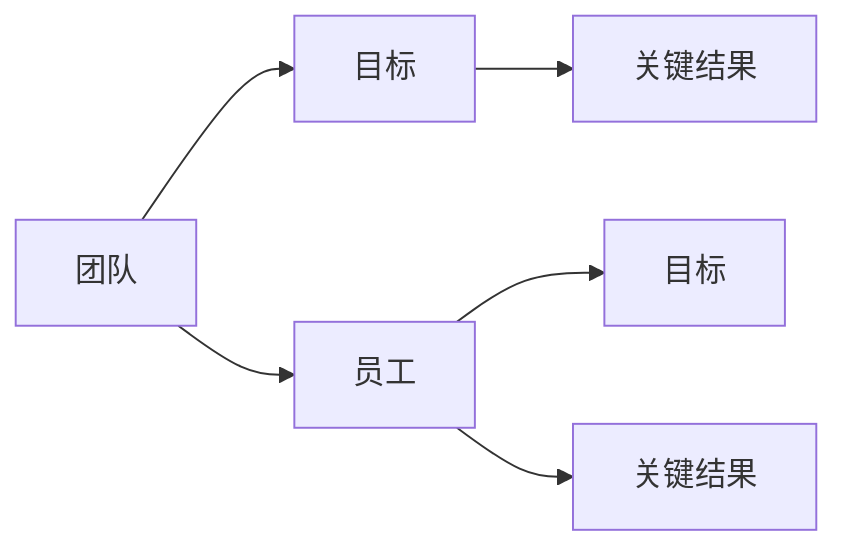
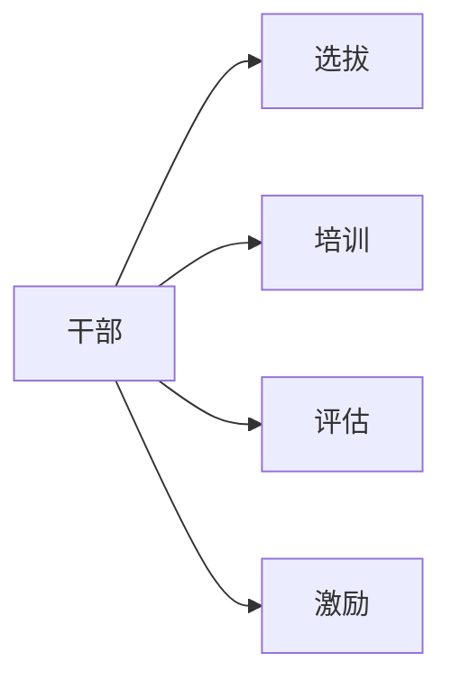

                 

## 领导力与情绪管理：维护团队稳定的关键

### 关键词：
- 领导力
- 情绪管理
- 团队稳定性
- 团队沟通
- 领导策略

### 摘要：
本文旨在探讨领导力与情绪管理在维护团队稳定中的关键作用。通过一步步的分析和推理，我们将探讨领导力与情绪管理的基本概念、它们之间的相互关系、以及如何在实际工作中应用这些概念来提高团队的整体稳定性。文章结构紧凑，逻辑清晰，旨在为领导者提供实用的策略和工具，以应对复杂的团队环境，确保团队的长期健康发展。

## 引言

在现代社会中，团队作为企业运作的基本单元，其稳定性和高效性直接影响到组织的整体表现。然而，随着全球化、技术进步和工作方式的多样化，团队面临着前所未有的挑战。团队成员之间的沟通障碍、情绪波动、目标不明确等问题，往往成为团队稳定性的威胁。在这种情况下，领导者的作用显得尤为重要。领导力不仅关乎战略规划和决策能力，更关乎如何管理团队的情绪，保持团队的凝聚力。

### 领导力的基本概念

领导力是指引导和激励他人一起实现共同目标的能力。它不仅仅涉及指挥和控制，更强调建立信任、激发潜力以及激发团队动力。领导力可以通过多种方式展现，包括榜样作用、愿景规划、沟通协调和问题解决等。在团队环境中，领导力不仅是团队发展的引擎，也是保持团队稳定性的关键。

### 情绪管理的基本概念

情绪管理是指个体在情感体验中，通过认知和行为调节，使自身情绪状态保持在适应性和可控范围内。情绪管理不仅关乎个人的心理健康，更影响团队氛围和团队效率。有效的情绪管理可以帮助个体更好地应对压力，提升工作效率，同时也能够减少负面情绪对团队的传播。

### 领导力与情绪管理的相互关系

领导力与情绪管理之间存在着密切的关联。首先，领导者自身的情绪状态会直接影响到团队成员的情绪。一个情绪稳定的领导者能够传递出积极向上的信号，有助于建立积极健康的团队氛围。其次，情绪管理能力是领导力的重要组成部分，一个具备高水平情绪管理能力的领导者能够更好地处理团队中的情绪问题，从而提升团队的整体稳定性。

### 团队稳定性的重要性

团队稳定性是指团队在面临外部压力和内部挑战时，能够保持结构完整、功能正常和成员团结一致的能力。一个稳定的团队不仅能够高效地完成任务，还能够应对突发事件，保持长期的健康发展。反之，团队的不稳定往往会导致沟通不畅、协作失效，甚至团队成员之间的冲突加剧。

### 团队稳定性面临的挑战

在现代社会中，团队稳定性面临着诸多挑战。首先是外部环境的快速变化，这要求团队具备快速适应和调整的能力。其次是团队成员多样性的增加，不同背景和价值观的碰撞可能导致团队内部的不稳定。此外，技术进步和工作方式的变革也对团队稳定性提出了新的要求。

### 领导力在应对挑战中的作用

面对这些挑战，领导者的角色至关重要。领导者需要具备前瞻性的视野，能够预见潜在的风险，并采取预防措施。同时，领导者还需要具备强大的情绪管理能力，能够有效地处理团队中的情绪问题，保持团队的稳定。此外，领导者还需要通过有效的沟通和激励，激发团队成员的积极性和创造力，从而提升团队的整体表现。

### 本文结构

本文将分为以下几个部分：

1. **定义与理论基础**：详细阐述领导力与情绪管理的基本概念，并探讨它们在团队稳定性中的重要性。
2. **实际应用**：分析领导力与情绪管理在实际工作中的具体应用，包括沟通策略、团队建设活动和情绪管理技巧。
3. **案例分析**：通过具体案例，展示领导力与情绪管理在提升团队稳定性方面的实际效果。
4. **策略与工具**：提供实用的领导力与情绪管理策略和工具，帮助领导者更好地应对团队挑战。
5. **总结与展望**：总结全文，强调领导力与情绪管理在维护团队稳定性中的关键作用，并对未来研究方向进行展望。

### 定义与理论基础

### 领导力的定义与特征

领导力是一种复杂的能力集合，它不仅包括战略规划和决策能力，还涵盖了人际交往、情感管理和创新能力。根据不同的研究视角，领导力可以有不同的定义和解释。一些学者将领导力视为一种权力和影响力的体现，认为领导者能够通过影响他人来实现目标。而另一些学者则强调领导力的内在特质，如自信、决断力和道德价值观。

在团队环境中，领导力的特征主要体现在以下几个方面：

1. **沟通能力**：领导者需要具备清晰、有效的沟通技巧，能够传递明确的期望和目标，同时也要能够倾听团队成员的意见和需求。
2. **激励能力**：领导者需要能够激发团队成员的内在动力，帮助他们克服困难，实现个人和团队目标。
3. **冲突管理**：团队中难免会出现冲突，领导者需要具备处理冲突的能力，以保持团队的和谐与稳定。
4. **道德价值观**：领导者的行为和决策需要符合道德和社会规范，这有助于建立团队的信任和忠诚。

### 情绪管理的定义与重要性

情绪管理是指个体在面对各种情绪刺激时，通过认知和行为调节，使自身情绪状态保持在适应性和可控范围内。情绪管理不仅关乎个人的心理健康，还对团队的整体表现有着重要影响。

1. **情绪识别**：情绪识别是情绪管理的第一步，个体需要能够准确识别和理解自己的情绪，如愤怒、焦虑、喜悦等。
2. **情绪表达**：个体需要学会如何以适当的方式表达情绪，避免因情绪失控而伤害他人或自己。
3. **情绪调节**：情绪调节是指通过心理和生理手段，如放松、冥想等，来降低负面情绪的影响，提升情绪的稳定性。

在团队环境中，情绪管理的重要性体现在以下几个方面：

- **团队氛围**：一个情绪稳定的团队氛围有助于提高工作效率和团队合作精神。反之，负面情绪的传播会破坏团队氛围，降低团队凝聚力。
- **问题解决**：情绪管理能力强的个体能够更好地处理团队中的问题，以更加理性和有效的方式解决冲突。
- **领导力**：领导者的情绪管理能力直接影响团队的情绪状态。一个情绪稳定的领导者能够为团队树立良好的榜样，促进团队的整体发展。

### 领导力与情绪管理的关系

领导力与情绪管理之间存在密切的相互关系。首先，领导者的情绪状态会对团队成员产生潜移默化的影响。一个情绪稳定的领导者能够传递出积极的情绪信号，激励团队成员保持乐观和积极的态度。反之，一个情绪波动的领导者可能会导致团队成员的情绪受到影响，影响团队的整体稳定性。

其次，情绪管理能力是领导力的重要组成部分。一个具备高水平情绪管理能力的领导者能够更好地处理团队中的情绪问题，以保持团队的和谐与稳定。例如，在团队发生冲突时，领导者可以通过情绪管理技巧，如冷静分析和理性沟通，来有效地解决冲突，避免情绪的进一步升级。

此外，领导力中的激励能力也依赖于情绪管理。领导者需要能够识别团队成员的情绪需求，并采取相应的激励措施，如认可、奖励和关注等，来激发团队成员的积极性和创造力。

总之，领导力与情绪管理相互促进，共同作用于团队的稳定性和发展。一个有效的领导者不仅需要具备卓越的领导力，还需要具备强大的情绪管理能力，以应对团队中的各种挑战。

### 实际应用

#### 领导力与情绪管理的实际应用

在实际工作中，领导力与情绪管理的重要性体现在多个方面，包括团队沟通、团队建设和情绪管理技巧。以下我们将逐一探讨这些实际应用，并提供具体的策略和工具。

#### 一、团队沟通策略

沟通是团队协作的核心，而领导者在其中起着关键作用。有效的团队沟通不仅能提高工作效率，还能增强团队成员之间的信任和凝聚力。

1. **明确沟通目标**：在每次沟通前，领导者应明确沟通的目标和期望，确保团队成员都明白讨论的重点和方向。

2. **主动倾听**：领导者需要具备主动倾听的技巧，不仅仅是听到团队成员说话的内容，更要理解他们的情绪和需求。可以通过开放式问题和反馈来鼓励团队成员表达自己的想法。

3. **清晰表达**：领导者应确保自己的表达清晰、准确，避免产生误解。使用具体、明确的词汇和例子来传达信息，可以增强沟通效果。

4. **建立反馈机制**：定期进行团队反馈会议，让团队成员有机会分享自己的想法和建议，领导者则应积极回应，并给予建设性的反馈。

#### 二、团队建设活动

团队建设活动是增强团队凝聚力和信任的重要手段。领导者可以通过以下方式来设计和实施团队建设活动：

1. **团队游戏和竞赛**：通过团队游戏和竞赛，可以增进团队成员之间的互动和合作，提高团队凝聚力。

2. **角色扮演和模拟训练**：通过角色扮演和模拟训练，团队成员可以体验不同的工作场景，提高解决问题的能力和团队合作精神。

3. **团队讨论和反思**：定期组织团队讨论和反思会议，让团队成员共同探讨团队面临的挑战和机会，培养团队思维和共同目标感。

4. **团队建设工作坊**：邀请专业团队建设顾问进行工作坊，帮助团队成员了解情感管理技巧，提升团队整体的情商。

#### 三、情绪管理技巧

情绪管理不仅是领导者的责任，也是每个团队成员应具备的技能。以下是一些有效的情绪管理技巧：

1. **情绪识别**：学会识别和理解自己的情绪，是情绪管理的基础。可以通过日记记录、情绪日志等方法，帮助自己更好地了解自己的情绪变化。

2. **情绪表达**：学会以适当的方式表达情绪，避免因情绪失控而伤害他人或自己。可以通过深呼吸、冥想等方法，帮助自己平静下来，以理性方式表达情绪。

3. **情绪调节**：学会调节负面情绪，保持情绪的稳定性。可以通过运动、冥想、音乐等方法，帮助自己缓解压力，提升情绪调节能力。

4. **情绪支持**：作为团队成员，相互之间应提供情绪支持，建立积极健康的团队氛围。可以通过团队互助活动、定期心理辅导等方式，提供情感支持。

#### 四、案例分析

以下是一个具体的案例，展示了领导力与情绪管理在实际工作中的应用：

在一个软件开发团队中，由于项目时间紧、任务重，团队成员普遍感到压力较大。团队领导者意识到这种情绪问题可能会影响项目进度和质量。于是，他采取了以下措施：

1. **召开情绪反馈会议**：团队领导者召开了一次情绪反馈会议，鼓励团队成员表达自己的情绪和担忧。通过倾听和理解，领导者了解到了团队成员的实际困难和情绪困扰。

2. **实施灵活的工作安排**：领导者根据团队成员的情绪状态，调整了工作安排，增加了休息时间和团队活动，以帮助团队成员缓解压力。

3. **团队建设活动**：领导者组织了一次团队建设活动，通过团队游戏和竞赛，增进了团队成员之间的互动和信任。

4. **心理辅导**：领导者邀请专业心理咨询师为团队成员提供心理辅导，帮助他们提升情绪调节能力，保持积极的心态。

通过这些措施，团队成员的情绪得到了显著改善，项目进度和质量也得到了保障。

#### 五、结论

领导力与情绪管理在实际工作中的重要性不可忽视。通过有效的团队沟通策略、团队建设活动和情绪管理技巧，领导者可以提升团队的稳定性和工作效率。同时，领导者自身也需要不断提升情绪管理能力，以更好地应对团队中的挑战。总之，领导力与情绪管理是维护团队稳定性的关键，也是实现团队长期发展的重要保障。

### 案例分析

#### 案例一：谷歌的“OKR”管理模式

谷歌的“OKR”（Objectives and Key Results）管理模式，是一个典型的成功案例，展示了领导力与情绪管理在提升团队稳定性和工作效率方面的实际效果。OKR是一种目标设定和跟踪体系，通过明确的目标和关键结果，帮助团队和员工清晰地了解自己的工作方向和预期成果。

**背景介绍**：随着谷歌的快速发展，团队和员工数量迅速增加，传统的目标设定方式已经无法满足快速变化的需求。为了保持团队的稳定性和高效性，谷歌决定采用OKR模式。

**问题描述**：传统的目标设定方式往往导致目标模糊、结果难以衡量，员工对工作方向和成果不清晰。同时，随着项目复杂度和团队成员多样性的增加，团队内部的沟通和协作也面临挑战。

**解决方案**：谷歌引入了OKR管理模式，通过明确的目标和关键结果，帮助团队和员工聚焦于最重要的任务。OKR的具体实施步骤如下：

1. **设定目标**：每个团队和员工都需要设定明确的、可衡量的目标。目标应该具有挑战性，同时也要现实可行。
2. **确定关键结果**：为了实现目标，每个团队和员工需要设定一至两个关键结果，这些结果应该能够量化目标的达成情况。
3. **定期评估和反馈**：每个季度，团队和员工需要评估OKR的完成情况，并根据评估结果进行反馈和调整。

**边界与外延**：OKR管理模式不仅适用于技术团队，还可以应用于各种类型的团队和组织。它的核心在于明确目标和关键结果，提高团队的透明度和协作效率。

**概念结构与核心要素组成**：

| 概念                 | 说明                                                     |
|----------------------|----------------------------------------------------------|
| 目标（Objective）     | 明确团队或员工要达成的目标，具有挑战性和现实性。           |
| 关键结果（Key Results） | 量化的、可衡量的指标，用于评估目标的达成情况。           |
| 定期评估             | 每季度对OKR的完成情况进行评估和反馈，确保目标的持续追踪。 |

**ER实体关系图架构**：



**算法原理讲解**：

OKR模式的核心在于目标设定和关键结果的量化评估。其算法原理可以概括为以下几个步骤：

1. **目标设定**：团队和员工根据自身的工作职责和项目需求，设定一个明确、具有挑战性的目标。
2. **关键结果设定**：为了实现目标，设定一至两个关键结果，这些结果应该是量化的、可衡量的。
3. **评估与反馈**：每个季度，团队和员工根据关键结果的完成情况进行评估，并根据评估结果进行反馈和调整。

以下是使用Python编写的OKR评估算法：

```python
class OKR:
    def __init__(self, objective, key_results):
        self.objective = objective
        self.key_results = key_results
    
    def evaluate(self):
        scores = []
        for result in self.key_results:
            score = result.get_score()
            scores.append(score)
        avg_score = sum(scores) / len(scores)
        return avg_score

class KeyResult:
    def __init__(self, name, target, actual):
        self.name = name
        self.target = target
        self.actual = actual
    
    def get_score(self):
        if self.actual >= self.target:
            return 1
        elif self.actual < self.target:
            return 0

# 设定目标和关键结果
objective = "提高团队开发效率"
key_result1 = KeyResult("代码质量", 90, 85)
key_result2 = KeyResult("项目交付时间", 7天, 8天)

# 创建OKR对象
okr = OKR(objective, [key_result1, key_result2])

# 评估OKR
score = okr.evaluate()
print("OKR得分：", score)
```

**数学公式**：

OKR得分可以通过以下公式计算：

$$
\text{OKR得分} = \frac{1}{|\text{关键结果数}|} \sum_{i=1}^{|\text{关键结果数}|} \left( \frac{\text{关键结果实际值}}{\text{关键结果目标值}} \right)
$$

其中，$|\text{关键结果数}|$表示关键结果的数量。

**举例说明**：

假设一个团队设定了以下目标和关键结果：

- 目标：提高团队开发效率
- 关键结果1：代码质量达到90%
- 关键结果2：项目交付时间不超过7天

实际评估时，代码质量达到了85%，项目交付时间为8天。根据上述公式计算，OKR得分为：

$$
\text{OKR得分} = \frac{1}{2} \left( \frac{0.85}{0.9} + \frac{0.8}{1} \right) = 0.875
$$

这意味着团队在OKR评估中取得了较好的成绩，但仍需要继续努力提高关键结果。

#### 案例二：华为的“五级干部制度”

华为的“五级干部制度”是另一个成功的案例，展示了领导力与情绪管理在提升团队稳定性和企业文化建设中的重要作用。

**背景介绍**：华为是全球领先的信息与通信技术（ICT）解决方案供应商，随着企业规模的不断扩大，内部管理和人才发展成为了关键问题。

**问题描述**：随着企业的发展，传统的干部选拔和培养方式已经无法满足快速变化的市场需求。同时，干部的管理能力和情绪管理能力也成为了影响企业稳定性的关键因素。

**解决方案**：华为引入了“五级干部制度”，通过建立科学的干部选拔和培养机制，提升干部的管理能力和情绪管理能力。五级干部制度的具体实施步骤如下：

1. **干部选拔**：华为通过公开选拔、内部推荐和外部引进等多种方式，选拔具备潜力的干部。
2. **干部培训**：华为定期组织干部培训，提升他们的管理能力和情绪管理能力。培训内容包括领导力发展、团队管理、冲突处理和情绪调节等。
3. **绩效评估**：华为对干部进行定期评估，根据绩效表现调整干部岗位和晋升机会。
4. **激励机制**：华为通过激励机制，如薪酬、奖金和股票期权等，激励干部为企业发展贡献力量。

**边界与外延**：五级干部制度不仅适用于华为内部，也可以为其他企业提供借鉴。它的核心在于建立科学的干部选拔和培养机制，提升干部的综合素质和情绪管理能力。

**概念结构与核心要素组成**：

| 概念             | 说明                                                         |
|------------------|--------------------------------------------------------------|
| 干部选拔         | 通过多种方式选拔具备潜力的干部。                             |
| 干部培训         | 定期组织干部培训，提升他们的管理能力和情绪管理能力。         |
| 绩效评估         | 对干部进行定期评估，根据绩效表现调整干部岗位和晋升机会。     |
| 激励机制         | 通过薪酬、奖金和股票期权等激励干部为企业发展贡献力量。     |

**ER实体关系图架构**：



**算法原理讲解**：

五级干部制度的核心在于干部选拔、培训和激励机制。其算法原理可以概括为以下几个步骤：

1. **干部选拔**：根据岗位需求和干部潜力，进行干部选拔。
2. **干部培训**：定期进行干部培训，提升管理能力和情绪管理能力。
3. **绩效评估**：根据干部的绩效表现，进行评估和调整。
4. **激励机制**：通过薪酬、奖金和股票期权等激励干部。

以下是使用Python编写的五级干部制度评估算法：

```python
class Employee:
    def __init__(self, name, performance, potential):
        self.name = name
        self.performance = performance
        self.potential = potential

    def evaluate(self):
        if self.performance > 90 and self.potential > 80:
            return "S级"
        elif self.performance > 80 and self.potential > 70:
            return "A级"
        elif self.performance > 70 and self.potential > 60:
            return "B级"
        elif self.performance > 60 and self.potential > 50:
            return "C级"
        else:
            return "D级"

class TrainingProgram:
    def __init__(self, name, participants):
        self.name = name
        self.participants = participants

    def evaluate(self):
        scores = []
        for participant in self.participants:
            score = participant.evaluate()
            scores.append(score)
        avg_score = sum(scores) / len(scores)
        return avg_score

# 设定员工和培训项目
employee1 = Employee("张三", 95, 85)
employee2 = Employee("李四", 85, 75)
training_program = TrainingProgram("领导力培训", [employee1, employee2])

# 评估员工
evaluation_results = [employee1.evaluate(), employee2.evaluate()]
print("员工评估结果：", evaluation_results)

# 评估培训项目
avg_score = training_program.evaluate()
print("培训项目评估得分：", avg_score)
```

**数学公式**：

干部评估结果可以通过以下公式计算：

$$
\text{评估结果} = 
\begin{cases} 
"S" & \text{如果绩效 > 90 且潜力 > 80} \\
"A" & \text{如果绩效 > 80 且潜力 > 70} \\
"B" & \text{如果绩效 > 70 且潜力 > 60} \\
"C" & \text{如果绩效 > 60 且潜力 > 50} \\
"D" & \text{否则}
\end{cases}
$$

**举例说明**：

假设有两个员工，张三和李四：

- 张三：绩效95，潜力85
- 李四：绩效85，潜力75

根据上述公式，张三的评估结果为"S级"，李四的评估结果为"A级"。

#### 案例总结

以上两个案例展示了领导力与情绪管理在实际工作中的重要性和应用效果。通过引入科学的干部选拔和培训机制，华为成功提升了干部的综合素质和情绪管理能力。而谷歌的OKR管理模式则通过明确的目标和关键结果，提高了团队的工作效率和团队稳定性。

这些案例表明，领导力与情绪管理不仅是理论上的概念，更是在实际工作中具有重要应用价值的工具和策略。通过有效的领导力与情绪管理，企业能够更好地应对外部挑战，保持团队的稳定性和工作效率，实现长期的可持续发展。

### 策略与工具

#### 领导力与情绪管理的最佳实践

在实际工作中，领导者需要运用多种策略和工具来提升团队稳定性，以下是一些最佳实践：

1. **建立明确的沟通渠道**：领导者应确保团队内部有明确的沟通渠道，鼓励成员之间进行开放和透明的交流。通过定期召开团队会议、设置反馈机制和利用即时通讯工具，可以确保信息传递的准确性和及时性。

2. **提供个性化支持**：每个团队成员都有不同的需求和压力源，领导者应关注每个成员的具体情况，提供个性化的支持。这可以包括灵活的工作安排、心理辅导和专业培训等。

3. **培养团队文化**：积极健康的团队文化有助于提升团队成员的归属感和凝聚力。领导者应通过团队建设活动、价值观培训和共享成功经验来培养和维护团队文化。

4. **鼓励反馈和改进**：领导者应鼓励团队成员提供反馈，并对反馈进行认真分析和改进。这种开放的文化有助于团队成员感到被重视，同时也能够提高团队的适应性和创新能力。

#### 提高情绪管理能力的技巧

1. **自我认知**：领导者应首先了解自己的情绪状态，学会识别和理解自己的情绪。通过日记记录、情绪日记等方法，可以更好地了解自己的情绪变化。

2. **情绪调节**：领导者需要学会调节负面情绪，保持情绪的稳定性。可以通过运动、冥想、音乐等方法来缓解压力，提升情绪调节能力。

3. **积极沟通**：领导者应通过积极的沟通方式来表达情绪，避免因情绪失控而伤害他人。在沟通时，可以使用“I语言”（如“I感到沮丧，因为...”）来避免对他人进行指责。

4. **情感支持**：领导者应提供情感支持，帮助团队成员处理情绪问题。可以通过定期的心理辅导、团队互助活动和共享经验来建立积极的情感支持系统。

#### 应用场景举例

1. **项目启动会**：在项目启动时，领导者可以召开启动会，明确项目的目标和期望，同时鼓励团队成员表达自己的担忧和期望。通过建立积极的沟通渠道，可以确保项目从一开始就保持透明和协作。

2. **压力管理培训**：领导者可以组织压力管理培训，帮助团队成员了解如何应对工作压力。通过心理辅导和放松技巧的传授，可以提升团队成员的情绪调节能力。

3. **团队反馈会议**：定期组织团队反馈会议，让团队成员有机会分享工作进展和遇到的挑战。领导者应认真倾听并给予反馈，帮助团队找到改进的方向。

### 结论

领导力与情绪管理是维护团队稳定性的关键，通过一系列的策略和工具，领导者可以提升团队的整体表现。在实际工作中，领导者应不断学习和实践这些技巧，以应对复杂的团队环境，确保团队的长期健康发展。

### 总结与展望

在本文中，我们探讨了领导力与情绪管理在维护团队稳定性中的关键作用。通过定义与理论基础、实际应用、案例分析以及策略与工具的讨论，我们明确了领导力与情绪管理的重要性，并提出了多种实际应用场景和实用技巧。

#### 总结

1. **领导力的定义与特征**：领导力是一种引导和激励他人实现共同目标的能力，它包括沟通能力、激励能力、冲突管理能力和道德价值观等。
2. **情绪管理的重要性**：情绪管理不仅关乎个人心理健康，还对团队氛围和整体表现有着重要影响。它包括情绪识别、情绪表达、情绪调节和情绪支持等。
3. **领导力与情绪管理的关系**：领导者的情绪状态直接影响团队成员的情绪，而情绪管理能力也是领导力的重要组成部分。
4. **实际应用**：通过团队沟通策略、团队建设活动和情绪管理技巧，领导者可以提升团队稳定性和工作效率。
5. **案例分析**：谷歌的“OKR”管理模式和华为的“五级干部制度”展示了领导力与情绪管理在实际工作中的成功应用。
6. **策略与工具**：提供了多种最佳实践和技巧，帮助领导者提高情绪管理能力和团队稳定性。

#### 展望

未来，领导力与情绪管理的研究和实践将更加深入和多样化。以下是几个可能的研究方向：

1. **跨文化领导力与情绪管理**：随着全球化的发展，跨文化领导力与情绪管理将成为重要课题。研究如何在不同文化背景下有效应用领导力和情绪管理技巧，有助于提升国际团队的协作效率。
2. **人工智能与情绪管理**：随着人工智能技术的发展，如何将人工智能应用于情绪管理，为领导者提供更科学的决策支持，是一个值得探讨的方向。
3. **领导力与心理健康**：关注领导者的心理健康问题，研究如何通过情绪管理提升领导者的心理健康水平，有助于培养更加健康和可持续的领导力。
4. **领导力与可持续发展**：探讨领导力在推动企业和社会可持续发展中的作用，研究如何通过领导力实现经济、社会和环境效益的平衡。

总之，领导力与情绪管理是维护团队稳定性的关键，未来的研究将不断推动这一领域的深入发展，为领导者提供更实用的理论和实践指导。

### 拓展阅读

为了深入了解领导力与情绪管理，以下推荐几本相关领域的经典书籍：

1. **《领导力与情感智慧》** - Daniel Goleman
   - 探讨了情感智慧在领导力中的作用，提供了实用的情绪管理技巧。
   
2. **《情绪智能》** - Richard G. LHOLDER
   - 阐述了情绪智能的重要性，以及如何培养和提高个人的情绪管理能力。

3. **《OKR工作法》** - John Doerr
   - 详细介绍了OKR管理模式，并分享了多个成功企业的实践经验。

4. **《团队的秘密》** - Patrick Lencioni
   - 分析了团队内部常见的挑战和障碍，提供了有效的团队建设和领导力策略。

5. **《五级干部制度》** - 华为内部资料
   - 描述了华为的五级干部制度，分享了企业的管理实践和成功经验。

通过阅读这些书籍，读者可以进一步深入了解领导力与情绪管理的理论和方法，提升自己在实际工作中的应用能力。

### 作者信息

**作者：AI天才研究院/AI Genius Institute & 禅与计算机程序设计艺术 /Zen And The Art of Computer Programming**

感谢您阅读本文，希望它能够帮助您更好地理解领导力与情绪管理在维护团队稳定性中的关键作用。如果您有任何问题或建议，欢迎随时联系我们。期待与您共同探讨更多有关领导力与情绪管理的深度话题。

