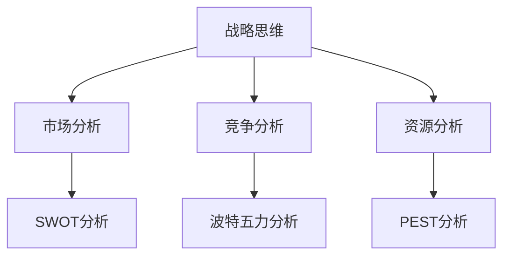
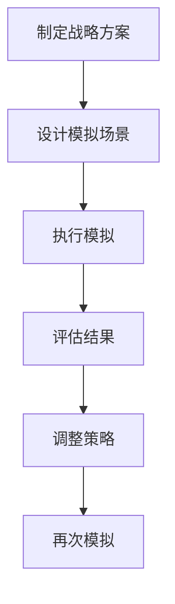
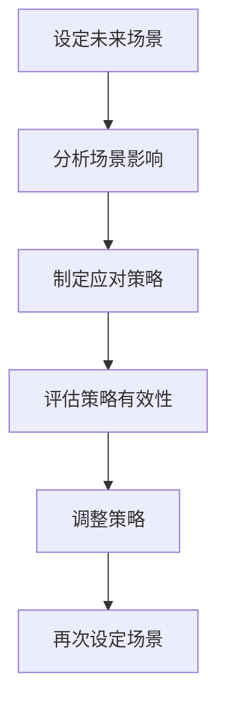

                 

### 《领导力与战略思维：长远规划与执行力》

> 关键词：领导力、战略思维、长远规划、执行力、组织管理

> 摘要：本文从领导力和战略思维的角度出发，探讨了长远规划和执行力在组织管理中的重要性。通过分析领导力的核心要素、战略思维的核心方法以及长远规划和执行力的关键策略，本文提出了提高组织效率和实现战略目标的综合路径，旨在为IT领域的专业人士提供有价值的理论和实践指导。

### 引言

领导力与战略思维是组织管理中不可或缺的两个要素。领导力关乎领导者如何激发团队的潜能，实现组织目标；战略思维则关注于如何在复杂多变的环境中制定和执行战略，确保组织持续发展。长远规划和执行力则是战略思维的具体体现，是组织实现目标的关键保障。

在现代IT领域，随着技术的迅猛发展和市场竞争的加剧，领导力与战略思维的重要性日益凸显。有效的领导力能够激发团队的创造力，提升团队协作效率；而战略思维则能够帮助组织把握行业趋势，制定长远规划，从而在激烈的市场竞争中立于不败之地。

本文将首先探讨领导力的核心要素，分析领导力对组织的影响，并提出提高领导力的策略。随后，我们将深入探讨战略思维的核心方法，包括SWOT分析、PEST分析、波士顿矩阵和波特五力分析等，并介绍战略思维工具，如脑图、模拟与沙盘推演和情景规划。接下来，本文将阐述长远规划的重要性，介绍长远规划的核心要素和策略，以及长远规划工具和方法。此外，本文还将详细探讨执行力，包括提高执行力的策略和工具方法。最后，本文将结合实践，探讨领导力与战略思维融合的长远规划与执行力实践，为IT领域的专业人士提供有益的参考。

### 第一部分：领导力概述

#### 第1章 领导力概述

领导力是领导者引导、激励和影响团队成员以实现共同目标的能力。在IT领域，领导力的重要性尤为突出，因为技术不断迭代，市场竞争激烈，领导者需要具备前瞻性的战略思维和高效的执行能力，才能带领团队在变革中保持竞争力。

#### 1.1 问题背景

随着信息技术的飞速发展，IT行业呈现出高度竞争和快速变革的特点。在这种环境下，领导力不仅关乎企业内部的团队管理，更影响到企业的创新能力和市场竞争力。领导力不足可能导致以下问题：

- **创新不足**：缺乏能够激发团队创新潜力的领导者。
- **执行力差**：战略规划无法有效执行，影响企业目标的实现。
- **团队协作不畅**：领导力不足导致团队成员缺乏协作精神和共同目标。

因此，探讨领导力的核心要素和提升策略具有重要的现实意义。

#### 1.1.1 领导力的定义与重要性

领导力是指通过激励、指导和影响他人来实现共同目标的能力。它不仅包括个人魅力和决策能力，还涉及到沟通技巧、团队建设、愿景塑造和战略思维等多方面能力。

领导力在组织中的重要性体现在以下几个方面：

1. **激发团队潜力**：有效的领导力能够激发团队成员的潜力，提高团队的整体绩效。
2. **推动创新**：领导者通过制定愿景和战略，推动组织不断进行创新，保持竞争优势。
3. **提升执行力**：领导者需要具备高效的执行能力，确保战略规划得以有效实施。
4. **建立团队文化**：领导力有助于塑造积极向上的团队文化，提高团队凝聚力和向心力。

#### 1.1.2 领导力对组织的影响

领导力对组织的影响是深远而广泛的。一个成功的领导者能够：

- **提升团队绩效**：通过有效的领导，提高团队的工作效率和创新能力。
- **推动组织发展**：领导者通过制定和实施战略，推动组织实现长期发展目标。
- **改善团队氛围**：领导力有助于建立积极、健康的工作环境，提升员工满意度和幸福感。
- **增强市场竞争力**：领导力通过提升组织的创新能力和执行力，增强企业在市场中的竞争力。

然而，领导力不足可能导致组织面临以下挑战：

- **战略执行困难**：缺乏能够有效执行战略的领导者，导致战略无法顺利实施。
- **团队士气低落**：领导力不足可能导致团队士气低落，影响员工的工作积极性和创造力。
- **人才流失**：优秀的员工可能因领导力不足而选择离开，导致人才流失。

#### 1.1.3 领导力的挑战与机遇

在当前复杂多变的环境中，领导者面临着诸多挑战和机遇：

- **技术变革**：技术快速迭代，领导者需要不断更新知识和技能，适应新的技术环境。
- **全球竞争**：全球化使得市场竞争更加激烈，领导者需要具备国际视野和跨文化管理能力。
- **员工期望**：员工对工作环境、职业发展和个人价值的期望越来越高，领导者需要提供更有吸引力的职业发展机会和激励机制。
- **数字化转型**：数字化转型要求领导者具备数字思维和创新意识，推动组织的数字化转型。

面对这些挑战和机遇，领导者需要不断提升自身能力，包括战略思维、领导力、沟通技巧和创新能力等。同时，组织也需要为领导者提供培训和发展机会，以支持他们应对不断变化的商业环境。

#### 1.2 核心概念与联系

为了深入理解领导力，我们需要了解一些核心概念，包括领导力模型、领导力属性特征对比表格以及领导力与战略思维的关系。

##### 1.2.1 领导力模型

领导力模型是描述领导者行为和特征的理论框架。常见的领导力模型包括：

- **情境领导模型**：根据下属的不同成熟度水平，领导者采取不同的领导风格。
- **路径—目标模型**：领导者通过设定目标并提供路径，帮助下属实现目标。
- **服务型领导模型**：领导者关注下属的需求和福祉，通过服务他人来实现共同目标。

这些模型为领导者提供了具体的指导，帮助他们根据不同情境和下属特点选择最合适的领导风格。

##### 1.2.2 领导力属性特征对比表格

以下是一个简单的领导力属性特征对比表格，展示了不同领导力模型的核心特征：

| 领导力模型       | 核心特征                | 适用情境                |
|----------------|----------------------|----------------------|
| 情境领导模型     | 根据下属成熟度调整领导风格 | 面对多变的工作环境        |
| 路径—目标模型    | 设定目标并提供路径      | 需要明确目标和路径的团队  |
| 服务型领导模型    | 关注下属需求和福祉      | 建立积极向上的团队文化    |

通过对比表格，我们可以更清晰地理解不同领导力模型的特点和应用场景。

##### 1.2.3 领导力与战略思维的关系

领导力与战略思维密切相关。战略思维是指领导者如何分析市场环境、预测未来趋势、制定长远规划和实施战略的能力。领导力则为战略思维提供了必要的支持和保障：

- **战略规划**：领导者需要具备战略思维，分析市场环境和竞争态势，制定明确的战略目标。
- **执行保障**：领导力帮助领导者确保战略规划得以有效执行，协调各部门资源，推动组织实现战略目标。
- **团队协作**：领导力有助于建立高效的团队协作机制，激发团队成员的潜能，实现战略目标。

因此，领导力与战略思维相辅相成，共同推动组织的长远发展。

#### 1.3 本章小结

本章从领导力的定义、重要性、影响以及核心概念等方面进行了深入探讨。通过分析领导力的挑战与机遇，我们了解到领导者需要不断提升自身能力，以应对复杂多变的商业环境。此外，领导力与战略思维的关系也为我们提供了更全面的领导力提升策略。在下一章中，我们将进一步探讨战略思维的核心方法，包括SWOT分析、PEST分析、波士顿矩阵和波特五力分析等。

#### 第二部分：战略思维

##### 第2章 战略思维概述

战略思维是领导者分析环境、预测未来、制定和实施战略的能力。在信息技术飞速发展的今天，战略思维尤为重要，它帮助组织在复杂多变的环境中找到发展的方向，实现持续增长。

##### 2.1 问题背景

在IT领域，技术更新迭代速度极快，市场环境瞬息万变。战略思维能够帮助组织：

- **把握行业趋势**：通过分析行业动态，预测未来发展方向，为组织制定长远规划。
- **制定竞争策略**：通过SWOT分析、PEST分析等工具，评估自身优势和劣势，制定有针对性的竞争策略。
- **优化资源配置**：合理配置资源，确保组织在战略实施过程中资源充足，提高效率。

因此，探讨战略思维的核心方法具有重要的实践意义。

##### 2.1.1 战略思维的定义与重要性

战略思维是指领导者分析市场环境、行业趋势、竞争态势，预测未来发展方向，制定并实施长远规划的能力。战略思维的重要性体现在以下几个方面：

- **确保组织长期发展**：战略思维能够帮助组织制定长远规划，确保组织在动态环境中持续发展。
- **提高决策质量**：通过分析各种因素，战略思维有助于领导者做出更高质量的决策。
- **优化资源配置**：战略思维能够帮助组织合理配置资源，提高资源利用效率。
- **提升竞争力**：战略思维有助于组织把握市场机遇，制定有针对性的竞争策略，提升市场竞争力。

##### 2.1.2 战略思维的核心要素

战略思维的核心要素包括：

1. **市场分析**：分析市场环境，了解行业趋势、竞争对手和消费者需求。
2. **竞争分析**：评估自身优势和劣势，制定有针对性的竞争策略。
3. **资源分析**：分析现有资源和需求，确保资源充足，支持战略实施。
4. **风险评估**：识别潜在风险，制定风险应对策略。
5. **创新思维**：鼓励创新，推动组织持续发展。

##### 2.1.3 战略思维与领导力的关系

战略思维与领导力密切相关。有效的领导力是战略思维的基础，领导者需要具备以下能力：

- **前瞻性思维**：能够预测市场变化，为组织制定长远规划。
- **决策能力**：在复杂环境中做出明智的决策，推动战略实施。
- **沟通协调**：与团队成员沟通战略目标，确保团队协作。
- **创新能力**：鼓励创新，推动组织持续发展。

同时，战略思维也为领导力提供了方向和目标，领导者通过战略思维，明确组织的长远目标和路径，从而更有效地发挥领导力。

##### 2.2 核心概念与联系

为了深入理解战略思维，我们需要了解一些核心概念，包括SWOT分析、PEST分析、波士顿矩阵和波特五力分析等。

###### 2.2.1 SWOT分析

SWOT分析是一种常用的战略规划工具，用于评估组织的优势（Strengths）、劣势（Weaknesses）、机会（Opportunities）和威胁（Threats）。以下是SWOT分析的表格形式：

| 要素   | 描述                                       |
|--------|------------------------------------------|
| 优势   | 组织在资源、能力、市场份额等方面的优势   |
| 劣势   | 组织在管理、技术、市场等方面的不足       |
| 机会   | 外部环境中可能给组织带来的机遇           |
| 威胁   | 外部环境中可能对组织造成的威胁           |

通过SWOT分析，组织可以明确自身的优势和劣势，抓住机遇，规避威胁，制定更有效的战略。

###### 2.2.2 PEST分析

PEST分析是一种用于分析外部环境的宏观环境分析工具，包括政治（Political）、经济（Economic）、社会（Social）和技术（Technological）四个方面。以下是PEST分析的表格形式：

| 要素   | 描述                                       |
|--------|------------------------------------------|
| 政治   | 政策法规、政治稳定性等因素对组织的影响   |
| 经济   | 经济环境、市场趋势、消费水平等因素对组织的影响 |
| 社会   | 社会文化、人口结构、消费者行为等因素对组织的影响 |
| 技术   | 技术进步、技术创新、技术成熟度等因素对组织的影响 |

通过PEST分析，组织可以更好地理解外部环境，把握市场机遇，规避潜在风险。

###### 2.2.3 波士顿矩阵

波士顿矩阵是一种用于评估企业产品组合和市场策略的工具，通过将产品分为“明星”、“现金牛”、“瘦狗”和“问题”四类，帮助企业制定相应的策略。以下是波士顿矩阵的表格形式：

| 类别   | 描述                                       |
|--------|------------------------------------------|
| 星际   | 市场增长率高，市场份额高，有潜力成为明星产品 |
| 现金牛 | 市场增长率低，市场份额高，能够产生稳定现金流 |
| 瘦狗   | 市场增长率低，市场份额低，难以产生现金流入 |
| 问题   | 市场增长率高，市场份额低，需要投入资源进行改进 |

通过波士顿矩阵，企业可以优化产品组合，调整市场策略，提高整体效益。

###### 2.2.4 波特五力分析

波特五力分析是一种用于评估行业竞争态势的工具，包括供应商的议价能力、买家的议价能力、新进入者的威胁、替代品的威胁和行业内的竞争程度。以下是波特五力分析的表格形式：

| 要素   | 描述                                       |
|--------|------------------------------------------|
| 供应商的议价能力 | 供应商的集中度、供应资源的稀缺性等因素对供应商的影响 |
| 买家的议价能力   | 买家的集中度、购买资源的稀缺性等因素对买家的影响 |
| 新进入者的威胁   | 新进入者的数量、进入障碍等因素对新进入者的影响 |
| 替代品的威胁     | 替代品的存在、替代品的性能和价格等因素对市场的影响 |
| 行业内的竞争程度 | 市场竞争者的数量、市场份额分布等因素对市场的影响 |

通过波特五力分析，企业可以更好地理解行业竞争态势，制定相应的竞争策略。

##### 2.3 战略思维工具介绍

为了更好地进行战略思维，我们可以利用一些工具，如脑图、模拟与沙盘推演和情景规划等。

###### 2.3.1 脑图

脑图是一种用于表达思维过程和创造性思维的工具，它通过图形化的方式展示各种概念、想法和关系。以下是脑图的一个示例：

通过脑图，我们可以直观地了解战略思维的各个组成部分及其关系。

###### 2.3.2 模拟与沙盘推演

模拟与沙盘推演是一种通过模拟现实环境来评估战略方案的工具。它可以帮助组织在实施战略前识别潜在问题和风险，并做出相应调整。以下是模拟与沙盘推演的流程图：

通过模拟与沙盘推演，组织可以在实际执行前测试战略的有效性，提高战略的成功率。

###### 2.3.3 情景规划

情景规划是一种通过设想不同的未来场景来评估战略方案的方法。它可以帮助组织应对不确定性，制定灵活的战略。以下是情景规划的流程图：

通过情景规划，组织可以更好地应对未来可能出现的各种情况，提高战略的适应性。

##### 2.4 本章小结

本章从战略思维的定义、重要性、核心要素以及工具方法等方面进行了深入探讨。通过了解SWOT分析、PEST分析、波士顿矩阵和波特五力分析等核心概念，以及脑图、模拟与沙盘推演和情景规划等战略思维工具，我们可以更有效地进行战略规划与决策。在下一章中，我们将进一步探讨长远规划的核心要素和策略。

### 第三部分：长远规划与执行力

#### 第3章 长远规划概述

长远规划是组织在战略思维指导下，对未来发展方向和目标的系统思考与安排。它关乎组织如何利用现有资源，抓住市场机遇，应对潜在挑战，以实现长期的可持续发展。在信息技术快速发展的今天，长远规划的重要性愈发凸显，它不仅有助于企业应对市场不确定性，还能为组织的持续创新和竞争优势提供坚实基础。

#### 3.1 问题背景

随着信息技术的迅猛发展，市场竞争日益激烈，企业面临的挑战和机遇层出不穷。在这种背景下，长远规划成为了组织战略管理的重要组成部分。一个清晰的长远规划能够：

- **明确发展目标**：帮助组织确定长期目标，确保战略决策的一致性和方向性。
- **优化资源配置**：通过合理配置资源，提高资源利用效率，确保战略实施的有效性。
- **应对市场变化**：提前识别市场趋势和潜在风险，制定灵活的战略应对措施。
- **促进创新**：为组织的创新活动提供方向和支持，推动技术进步和产品更新。

然而，长远规划并非一蹴而就，它需要组织从战略思维出发，结合内外部环境，进行系统化的分析和策划。

#### 3.1.1 长远规划的定义与重要性

长远规划是指组织在战略思维指导下，对未来一段时间内的发展方向、目标、战略步骤和资源配置等进行系统思考和规划的过程。长远规划的重要性主要体现在以下几个方面：

1. **明确发展目标**：长远规划帮助组织明确短期和长期的目标，为战略决策提供明确的指导。
2. **优化资源配置**：通过长远规划，组织可以合理配置资源，确保资源利用的最大化。
3. **提高应变能力**：长远规划有助于组织识别潜在的市场变化和风险，提前制定应对策略。
4. **推动持续创新**：长远规划为组织的创新活动提供了方向和支持，促进技术进步和产品更新。
5. **提升组织竞争力**：一个清晰的长远规划有助于组织在市场竞争中保持优势，实现可持续发展。

#### 3.1.2 长远规划的核心要素

长远规划的核心要素包括：

1. **愿景**：组织的愿景是长远规划的基础，它描述了组织希望达到的未来状态和目标。
2. **使命**：组织的使命明确了组织的存在意义和宗旨，为长远规划提供了价值导向。
3. **目标**：长远规划需要明确短期和长期的目标，以确保战略决策的一致性和可执行性。
4. **战略步骤**：制定详细的战略步骤，确保组织在实现目标的过程中有明确的路径。
5. **资源配置**：合理配置资源，确保战略实施所需的资金、人力、技术等资源充足。
6. **风险管理**：识别潜在风险，制定风险应对策略，确保战略实施的安全性和稳定性。
7. **绩效评估**：建立绩效评估机制，对战略实施过程进行监控和评估，确保目标的实现。

#### 3.1.3 长远规划与战略思维的关系

长远规划与战略思维密切相关。战略思维是长远规划的核心，它为长远规划提供了分析和决策的基础。具体来说：

1. **战略思维指导长远规划**：战略思维帮助组织分析外部环境和内部资源，确定长期目标和战略方向。
2. **长远规划实现战略思维**：长远规划将战略思维转化为具体的行动方案，确保战略目标的实现。
3. **互动关系**：战略思维和长远规划相互影响，战略思维为长远规划提供指导，长远规划为战略思维提供验证和反馈。

#### 3.2 长远规划策略

为了实现长远规划，组织需要采取一系列策略，包括目标设定、资源配置、风险管理、执行监控与调整等。

##### 3.2.1 目标设定

目标设定是长远规划的重要环节，它包括以下步骤：

1. **确定愿景和使命**：组织需要明确自身的愿景和使命，这将为长远规划提供方向和目标。
2. **制定长期目标**：长期目标应具有挑战性，同时符合组织的愿景和使命。
3. **分解目标**：将长期目标分解为短期目标和阶段性目标，确保目标的可执行性。
4. **明确指标**：为每个目标设定明确的衡量指标，以便对目标的实现情况进行评估。

##### 3.2.2 资源配置

资源配置是长远规划的关键，它包括以下步骤：

1. **评估资源需求**：根据目标设定，评估组织在资金、人力、技术等方面的资源需求。
2. **优化资源配置**：通过优化资源配置，提高资源利用效率，确保战略实施所需资源充足。
3. **制定预算**：根据资源需求，制定详细的预算计划，确保资金使用的合理性和有效性。
4. **监控资源使用**：对资源使用情况进行监控，确保资源得到有效利用。

##### 3.2.3 风险管理

风险管理是长远规划中的重要环节，它包括以下步骤：

1. **识别风险**：通过SWOT分析、PEST分析等工具，识别可能影响长远规划实现的风险。
2. **评估风险**：对识别出的风险进行评估，确定其发生的概率和潜在影响。
3. **制定风险应对策略**：根据风险评估结果，制定相应的风险应对策略，包括风险规避、风险转移、风险缓解等。
4. **监控风险**：对风险应对策略的实施情况进行监控，确保风险得到有效控制。

##### 3.2.4 执行监控与调整

执行监控与调整是确保长远规划顺利实施的关键，它包括以下步骤：

1. **建立监控机制**：制定详细的监控计划，对长远规划的实施情况进行定期监控。
2. **评估实施效果**：通过绩效评估和监控结果，评估长远规划的实施效果。
3. **反馈与调整**：根据监控结果和评估反馈，对长远规划进行调整和优化，确保目标的实现。
4. **持续改进**：通过持续改进，不断提高长远规划的实施效果，推动组织的发展。

#### 3.3 长远规划工具与方法

为了更好地进行长远规划，组织可以采用一些工具和方法，如绩效管理工具、预算规划、市场调研与分析等。

##### 3.3.1 绩效管理工具

绩效管理工具是用于监控和评估长远规划实施效果的工具。常见的绩效管理工具包括关键绩效指标（KPI）、平衡计分卡（BSC）等。

1. **关键绩效指标（KPI）**：KPI是用于衡量组织绩效的具体指标，它能够帮助组织明确目标，监控进展，评估效果。
2. **平衡计分卡（BSC）**：BSC是从财务、客户、内部流程和学习与成长四个维度衡量组织绩效的工具，它能够帮助组织全面评估绩效，实现长远目标。

##### 3.3.2 预算规划

预算规划是长远规划中的重要环节，它包括以下步骤：

1. **制定预算**：根据长远规划的目标和资源需求，制定详细的预算计划。
2. **审批预算**：对预算计划进行审批，确保预算的合理性和可行性。
3. **执行预算**：根据审批通过的预算计划，执行预算，确保资源的合理分配和有效利用。
4. **监控预算执行**：对预算执行情况进行监控，确保预算的执行效果。

##### 3.3.3 市场调研与分析

市场调研与分析是长远规划中的重要工具，它包括以下步骤：

1. **确定调研目标**：明确市场调研的目的和重点，确保调研结果的实用性。
2. **设计调研方案**：制定详细的调研方案，包括调研方法、调研对象、调研时间等。
3. **实施调研**：按照调研方案进行调研，收集相关数据。
4. **分析调研结果**：对调研结果进行分析，识别市场趋势和机会，为长远规划提供依据。

#### 3.4 本章小结

本章从长远规划的定义、重要性、核心要素、策略以及工具方法等方面进行了深入探讨。通过明确长远规划的目标、制定合理的资源配置策略、建立有效的风险管理体系和执行监控机制，组织可以确保长远规划的有效实施，实现长期可持续发展。在下一章中，我们将进一步探讨执行力，包括执行力的核心要素和提升策略。

### 第四部分：执行力

#### 第4章 执行力概述

执行力是组织在战略规划指导下，将规划转化为实际行动的能力。它是战略实施的关键保障，决定了组织能否有效实现既定目标。在信息技术迅速发展的今天，执行力的重要性愈发凸显，一个高效的执行力体系不仅能确保战略规划的顺利实施，还能提高组织的运营效率和市场竞争力。

#### 4.1 问题背景

在当前信息技术快速发展的背景下，市场竞争日益激烈，产品生命周期不断缩短，企业面临的挑战和机遇层出不穷。这种环境下，执行力成为了企业成败的关键。执行力不足可能导致以下问题：

- **战略无法落地**：战略规划再好，如果不能有效执行，也难以实现预期目标。
- **效率低下**：执行力不足导致资源浪费，运营效率低下。
- **创新滞后**：在技术快速迭代的市场环境中，执行力不足可能导致企业创新滞后，难以保持竞争优势。

因此，提高执行力，构建高效的执行力体系，成为了企业管理的重中之重。

#### 4.1.1 执行力的定义与重要性

执行力是指组织或个人将战略规划转化为实际行动的能力。它不仅包括完成任务的决心和行动力，还涉及到团队合作、资源管理、时间管理等多个方面。执行力的重要性体现在以下几个方面：

1. **确保战略落地**：执行力是战略实施的关键保障，只有执行力强，战略规划才能顺利落地。
2. **提高运营效率**：高效的执行力能够提高组织的运营效率，减少资源浪费，降低成本。
3. **保持竞争优势**：在技术快速迭代的市场环境中，执行力强的企业能够更快地响应市场变化，保持竞争优势。
4. **促进组织发展**：执行力是组织发展的重要驱动力，只有执行力强，组织才能持续发展。

#### 4.1.2 执行力的核心要素

执行力包含多个核心要素，包括愿景与使命、团队建设、过程管理、绩效评估等。

1. **愿景与使命**：明确的愿景和使命是执行力的重要基础。它们为组织提供了明确的方向和目标，确保执行力的一致性和目标性。
2. **团队建设**：团队是执行力的关键载体。一个高效的团队需要具备共同的目标、良好的沟通和协作机制，以及高素质的成员。
3. **过程管理**：过程管理是执行力的重要组成部分。通过建立有效的流程和管理机制，确保任务能够按时、高质量地完成。
4. **绩效评估**：绩效评估是执行力的重要反馈机制。通过定期评估执行效果，及时发现问题并进行调整，确保执行力持续提升。

#### 4.1.3 执行力与领导力的关系

执行力与领导力密切相关。领导力是执行力的核心驱动力，高效的领导力能够激发团队的执行力，推动战略规划的顺利实施。具体来说：

1. **领导力激发执行力**：领导者通过愿景传达、目标设定、团队激励等方式，激发团队成员的执行力和积极性。
2. **执行力验证领导力**：执行力是验证领导力的重要指标。一个高效的执行力体系能够反映出领导者的决策能力、团队管理能力和领导魅力。
3. **互动关系**：领导力和执行力相互影响，领导力为执行力提供方向和动力，执行力为领导力提供验证和反馈。

#### 4.2 提高执行力的策略

为了提高执行力，组织需要采取一系列策略，包括明确愿景与使命、加强团队建设、完善过程管理、实施绩效评估等。

##### 4.2.1 愿景与使命的明确

明确的愿景和使命是提高执行力的重要基础。组织需要通过以下步骤来明确愿景与使命：

1. **制定愿景和使命**：组织需要明确自身的愿景和使命，确保它们具有指导性和可操作性。
2. **传达愿景与使命**：通过内部沟通和培训，将愿景和使命传达给所有团队成员，确保全体成员认同并理解。
3. **持续强化**：定期回顾和强化愿景与使命，确保它们在组织内部得到持续关注和执行。

##### 4.2.2 团队建设

团队建设是提高执行力的重要保障。一个高效的团队需要具备以下特点：

1. **共同的目标**：团队成员需要明确共同的目标，确保团队协作的一致性和方向性。
2. **良好的沟通**：团队需要建立有效的沟通机制，确保信息畅通，减少误解和冲突。
3. **协作机制**：团队需要建立协作机制，确保团队成员能够紧密合作，提高工作效率。
4. **高素质成员**：团队需要具备高素质的成员，确保团队成员具备实现目标所需的专业技能和素质。

##### 4.2.3 过程管理

过程管理是提高执行力的重要手段。通过以下步骤，组织可以完善过程管理：

1. **建立流程**：制定详细的流程文档，确保任务执行有章可循。
2. **明确责任**：为每个任务明确责任人，确保任务执行有明确的责任主体。
3. **监控进度**：通过建立监控机制，实时监控任务进度，确保任务按时完成。
4. **反馈与改进**：对过程管理进行定期反馈和改进，提高流程的效率和效果。

##### 4.2.4 绩效评估

绩效评估是提高执行力的重要反馈机制。通过以下步骤，组织可以实施有效的绩效评估：

1. **设定指标**：为每个任务设定明确的绩效指标，确保绩效评估有明确的衡量标准。
2. **定期评估**：定期对团队成员的执行效果进行评估，确保评估的及时性和准确性。
3. **反馈与激励**：对评估结果进行反馈，激励团队成员不断改进，提高执行力。
4. **奖惩机制**：建立奖惩机制，对执行效果优秀的团队成员进行奖励，对执行效果不佳的团队成员进行惩罚，确保执行力的持续提升。

#### 4.3 执行力工具与方法

为了更好地提高执行力，组织可以采用一系列工具和方法，如关键绩效指标（KPI）、平衡计分卡（BSC）、项目管理工具、时间管理方法等。

##### 4.3.1 关键绩效指标（KPI）

关键绩效指标（KPI）是用于衡量组织绩效的具体指标，它能够帮助组织明确目标，监控进展，评估效果。以下是KPI的一些关键特点：

1. **具体性**：KPI需要具体、明确，避免模糊和主观判断。
2. **可衡量性**：KPI需要能够量化，以便对执行效果进行准确评估。
3. **挑战性**：KPI需要具有一定的挑战性，激发团队成员的积极性和创造力。
4. **相关性**：KPI需要与组织的战略目标和核心业务紧密相关，确保指标的设定有实际意义。

##### 4.3.2 平衡计分卡（BSC）

平衡计分卡（BSC）是一种从财务、客户、内部流程和学习与成长四个维度衡量组织绩效的工具。以下是BSC的一些关键特点：

1. **全面性**：BSC从多个维度衡量绩效，确保组织绩效的全面性。
2. **战略导向**：BSC与组织的战略目标紧密相关，确保绩效评估与战略实施的一致性。
3. **激励作用**：BSC能够激励团队成员关注组织的长期发展，而不仅仅是短期绩效。
4. **反馈机制**：BSC建立了反馈机制，能够及时反映绩效状况，帮助组织进行持续改进。

##### 4.3.3 项目管理工具

项目管理工具是用于规划、执行和监控项目的工具，它能够帮助组织提高项目管理效率。以下是项目管理工具的一些常见类型：

1. **项目计划工具**：用于制定项目计划，明确项目进度、资源分配和任务分工。
2. **任务跟踪工具**：用于监控任务进度，确保任务按时完成。
3. **协作工具**：用于团队协作，提高沟通效率和协作效果。
4. **风险控制工具**：用于识别和管理项目风险，确保项目顺利实施。

##### 4.3.4 时间管理方法

时间管理方法是用于提高个人和时间利用效率的方法。以下是几种常见的时间管理方法：

1. **时间块法**：将时间分为不同的时间块，为每个时间块安排特定的任务，提高时间利用效率。
2. **优先级排序法**：根据任务的重要性和紧急程度，对任务进行优先级排序，确保关键任务优先完成。
3. **番茄工作法**：将工作时间分为25分钟的工作周期，每个周期后休息5分钟，提高工作专注度和效率。
4. **习惯养成法**：通过养成高效的工作习惯，提高长期的时间管理能力。

#### 4.4 本章小结

本章从执行力的定义、重要性、核心要素和提升策略等方面进行了深入探讨。通过明确愿景与使命、加强团队建设、完善过程管理和实施绩效评估，组织可以构建高效的执行力体系，确保战略规划的有效实施。在下一章中，我们将结合实际案例，探讨领导力与战略思维融合的长远规划与执行力实践。

### 第五部分：领导力与战略思维的融合

#### 第5章 领导力与战略思维的融合

领导力与战略思维的融合是现代组织管理的关键，它旨在通过领导力推动战略思维的实现，同时通过战略思维指导领导力的发展。这种融合不仅能够提升组织的整体执行力，还能在复杂多变的市场环境中确保组织的持续竞争力。

#### 5.1 问题背景

在信息技术迅猛发展的今天，市场环境变化快，竞争激烈，组织需要具备快速响应和持续创新的能力。领导力与战略思维的融合能够帮助组织实现以下几个目标：

- **提高战略执行效率**：通过领导力确保战略规划的顺利实施。
- **增强组织适应能力**：战略思维帮助组织预见市场变化，领导力则推动组织迅速调整和适应。
- **提升组织创新力**：领导力激发团队成员的创造力，战略思维则为创新活动提供方向和支持。
- **建立长期竞争优势**：通过有效的领导力和战略思维，组织能够建立持久的竞争优势。

然而，在现实中，许多组织面临着领导力与战略思维融合不足的问题，导致战略执行不力、组织效率低下。因此，探讨领导力与战略思维的融合策略具有重要意义。

#### 5.1.1 领导力与战略思维融合的重要性

领导力与战略思维融合的重要性体现在以下几个方面：

1. **战略执行的保障**：领导力能够确保战略规划得到有效执行，而战略思维则提供了明确的战略方向。
2. **组织效率的提升**：通过融合，组织能够更高效地配置资源，提高运营效率。
3. **创新能力的激发**：领导力能够激发团队成员的创造力，而战略思维则为创新提供了方向和支持。
4. **团队凝聚力的增强**：领导力与战略思维的融合有助于建立共同的愿景和目标，提高团队凝聚力。
5. **竞争优势的建立**：融合的领导力和战略思维能够帮助组织在市场中保持竞争优势，实现长期发展。

#### 5.1.2 领导力与战略思维的互动关系

领导力与战略思维相互影响，相互促进，形成一种良性的互动关系：

1. **领导力推动战略思维**：有效的领导力能够推动战略思维的发展，激发领导者进行前瞻性的思考和规划。
2. **战略思维指导领导力**：战略思维为领导力提供了明确的指导，使领导者在复杂的商业环境中能够做出明智的决策。
3. **互动关系**：领导力和战略思维的互动不仅体现在战略规划和执行过程中，还体现在组织文化的塑造和团队建设等方面。

#### 5.1.3 领导力与战略思维融合的挑战与机遇

在融合领导力与战略思维的过程中，组织可能会面临以下挑战：

1. **思维模式的转变**：领导者需要从传统的执行导向转向战略思维导向，这需要时间和适应。
2. **资源配置的调整**：战略思维要求组织重新审视资源配置，这可能涉及到资源重新分配和部门整合。
3. **文化冲突**：不同部门和团队在融合过程中可能存在文化冲突，需要通过沟通和协作来解决。
4. **执行力不足**：战略思维的实施需要强大的执行力，组织需要确保战略规划得到有效执行。

然而，融合领导力与战略思维也带来了许多机遇：

1. **提升组织竞争力**：通过融合，组织能够更好地应对市场变化，保持竞争优势。
2. **增强创新能力**：领导力和战略思维的融合能够激发组织的创新活力，推动技术进步和产品创新。
3. **优化资源配置**：战略思维有助于组织更合理地配置资源，提高资源利用效率。
4. **建立组织文化**：通过融合，组织能够塑造积极、创新的组织文化，提高员工的满意度和忠诚度。

#### 5.2 融合策略

为了实现领导力与战略思维的融合，组织可以采取以下策略：

##### 5.2.1 战略决策与执行力的协调

1. **明确战略目标**：领导者需要与团队共同明确组织的战略目标，确保战略决策的一致性。
2. **制定执行计划**：将战略目标分解为具体的执行计划，明确时间表和责任分配。
3. **建立执行机制**：建立有效的执行机制，包括监控、评估和反馈机制，确保战略规划得到有效执行。
4. **跨部门协作**：通过跨部门协作，确保战略规划和执行计划的顺利实施。

##### 5.2.2 战略思维在领导力中的应用

1. **前瞻性思考**：领导者需要具备前瞻性思维，预见市场变化，为组织制定长远规划。
2. **创新驱动**：领导者需要鼓励创新，推动组织持续进行技术进步和产品创新。
3. **风险评估**：领导者需要具备风险评估能力，提前识别潜在风险，制定应对策略。
4. **灵活应对**：领导者需要具备灵活应对能力，根据市场变化和执行情况，及时调整战略规划。

##### 5.2.3 领导力在战略思维中的体现

1. **愿景塑造**：领导者需要通过塑造愿景，为组织提供明确的发展方向和目标。
2. **团队建设**：领导者需要通过团队建设，提高团队的凝聚力和执行力。
3. **文化塑造**：领导者需要通过文化塑造，建立积极、创新的组织文化。
4. **激励与反馈**：领导者需要通过激励与反馈，激发团队成员的积极性和创造力。

##### 5.2.4 融合案例分析

以下是一个企业领导力与战略思维融合的案例分析：

**案例背景**：某科技企业面临市场竞争激烈、技术迭代迅速的挑战，企业领导团队意识到需要通过融合领导力与战略思维来提升企业竞争力。

**融合策略**：

1. **明确愿景和使命**：企业领导团队共同明确了企业的愿景和使命，为战略决策提供了方向。
2. **制定长远规划**：企业领导团队通过SWOT分析和PEST分析，制定了长远规划，明确了企业的发展目标和战略路径。
3. **建立执行机制**：企业建立了明确的执行机制，包括关键绩效指标（KPI）和平衡计分卡（BSC），确保战略规划得到有效执行。
4. **团队建设**：企业通过团队建设和文化塑造，提高了团队的凝聚力和执行力。
5. **创新驱动**：企业领导团队鼓励创新，推动技术进步和产品创新，增强了企业的市场竞争力。

**效果评估**：

通过领导力与战略思维的融合，企业成功实现了以下效果：

- **战略目标实现率提高**：企业战略目标实现率显著提高，企业发展方向更加明确。
- **运营效率提升**：企业通过优化资源配置和建立执行机制，运营效率显著提升。
- **创新能力增强**：企业通过鼓励创新，推动技术进步和产品创新，增强了市场竞争力。
- **员工满意度提高**：企业通过团队建设和文化塑造，提高了员工的满意度和忠诚度。

#### 5.3 融合实践

为了实现领导力与战略思维的融合，组织可以采取以下实践方法：

##### 5.3.1 情境模拟与角色扮演

1. **情境模拟**：通过情境模拟，领导者可以模拟不同市场环境下的决策情景，提高前瞻性和应变能力。
2. **角色扮演**：通过角色扮演，领导者可以体验不同角色的决策过程，理解不同角色之间的互动和协作。

##### 5.3.2 领导力与战略思维的培训与提升

1. **领导力培训**：组织可以提供领导力培训，帮助领导者提升战略思维、团队建设和决策能力。
2. **战略思维培训**：组织可以提供战略思维培训，帮助领导者提升前瞻性思考、风险评估和资源优化能力。

##### 5.3.3 跨部门协作与沟通

1. **跨部门协作**：组织可以建立跨部门协作机制，促进不同部门之间的信息共享和资源整合。
2. **沟通与反馈**：组织可以建立有效的沟通与反馈机制，确保战略规划和执行过程中信息的畅通和及时反馈。

#### 5.4 本章小结

本章从领导力与战略思维融合的重要性、互动关系、挑战与机遇、融合策略和融合实践等方面进行了深入探讨。通过领导力与战略思维的融合，组织能够提高战略执行效率、增强创新能力、优化资源配置和提升团队凝聚力，实现长期竞争优势。在未来的实践中，组织应继续探索和优化领导力与战略思维的融合策略，为组织的可持续发展奠定坚实基础。

### 第六部分：长远规划与执行力的实践

#### 第6章 长远规划与执行力的实施

长远规划与执行力的实施是组织管理中至关重要的一环，它关系到组织战略目标的实现和可持续发展。在本章中，我们将结合实际案例，探讨如何实施长远规划与执行力，并提供一些具体的工具与方法。

#### 6.1 问题背景

在现实世界中，许多组织在制定长远规划时充满信心，但在实际执行过程中却面临诸多挑战。执行力不足、资源分配不均、风险评估不到位等问题常常导致长远规划的失败。因此，如何有效地实施长远规划与执行力，成为组织管理者需要解决的关键问题。

#### 6.1.1 长远规划与执行力实施的重要性

长远规划与执行力的实施对组织具有以下重要性：

1. **确保战略目标的实现**：通过有效的实施，组织可以确保战略目标得以实现，避免因执行不力而导致的战略失败。
2. **提高运营效率**：通过科学的规划和执行，组织可以提高运营效率，减少资源浪费，降低成本。
3. **增强市场竞争力**：执行力强的组织能够迅速响应市场变化，抓住机遇，提升市场竞争力。
4. **促进组织发展**：长远规划和执行力的有效实施可以推动组织的持续发展，实现长期目标。

#### 6.1.2 实施过程中的挑战与问题

在实施长远规划与执行力过程中，组织可能会面临以下挑战与问题：

1. **资源不足**：规划与执行需要充足的人力、资金和技术资源，资源不足可能导致执行困难。
2. **组织文化不匹配**：如果组织文化不利于规划与执行的实施，可能导致执行效率低下。
3. **执行力不足**：团队成员的执行力不够，可能导致规划目标难以实现。
4. **风险评估不足**：缺乏对潜在风险的充分评估，可能导致在执行过程中出现意外。
5. **沟通不畅**：执行过程中如果沟通不畅，可能导致信息传递误差，影响执行效果。

#### 6.1.3 成功案例与失败案例分析

为了更好地理解长远规划与执行力的实施，我们可以结合一些成功和失败的案例进行分析。

**成功案例：**

**案例一**：某高科技企业通过有效的长远规划和执行力，实现了技术创新和市场份额的显著提升。

- **背景**：该企业在市场竞争激烈的环境中，意识到需要通过技术创新来保持竞争优势。
- **实施步骤**：
  1. **制定长远规划**：企业制定了以技术创新为核心的长远规划，明确了研发投入、技术方向和产品目标。
  2. **资源配置**：企业加大了研发投入，建立了研发团队，并制定了详细的研发计划。
  3. **执行力**：通过严格的执行监控和绩效考核，确保研发项目按时按质完成。
  4. **风险管理**：企业对研发过程中的风险进行了充分评估，并制定了相应的风险应对措施。
- **效果**：企业成功推出了多款具有竞争力的新产品，市场份额大幅提升，实现了可持续发展。

**失败案例：**

**案例二**：某传统制造企业在数字化转型的过程中，因规划与执行力不足而遭遇失败。

- **背景**：该企业在数字化浪潮中试图通过数字化转型来提升竞争力。
- **实施步骤**：
  1. **制定规划**：企业制定了初步的数字化转型规划，但缺乏详细的技术路线图和资源保障。
  2. **资源配置**：由于缺乏明确的资源保障，数字化转型项目在实施过程中遇到资金短缺的问题。
  3. **执行力**：企业缺乏有效的执行力，项目进展缓慢，导致员工士气低落。
  4. **风险管理**：企业对数字化转型的风险评估不足，导致在实施过程中面临技术难题和市场竞争压力。
- **效果**：由于规划与执行力不足，企业数字化转型项目最终失败，企业竞争力未得到提升。

#### 6.2 实施步骤

为了有效实施长远规划与执行力，组织可以采取以下步骤：

##### 6.2.1 制定长远规划

1. **明确战略目标**：组织需要明确长期和短期的战略目标，确保规划与组织的整体战略相一致。
2. **资源评估**：对现有资源进行充分评估，确保规划实施的资源需求得到满足。
3. **风险评估**：对规划实施过程中可能遇到的风险进行评估，制定相应的风险应对措施。
4. **制定详细规划**：制定详细的规划方案，包括时间表、责任分配、资源配置和风险评估等。

##### 6.2.2 设定执行计划

1. **明确执行目标**：将长远规划分解为具体的执行目标，确保每个目标都具有明确的衡量标准。
2. **制定执行步骤**：根据长远规划，制定详细的执行步骤，包括任务分解、时间安排、责任分配等。
3. **建立执行机制**：建立有效的执行机制，包括监控、评估和反馈机制，确保执行计划得到有效实施。
4. **制定应急预案**：针对可能出现的风险和问题，制定应急预案，确保在突发事件时能够迅速响应。

##### 6.2.3 落实执行策略

1. **资源调配**：根据执行计划，合理调配资源，确保执行过程中资源充足。
2. **过程监控**：对执行过程进行实时监控，及时发现和解决问题。
3. **绩效评估**：定期对执行效果进行评估，确保执行计划按照预期进行。
4. **调整与优化**：根据评估结果，对执行策略进行调整和优化，确保目标的实现。

##### 6.2.4 监控与调整

1. **建立监控体系**：建立全面的监控体系，包括绩效监控、风险监控和资源监控等。
2. **定期评估**：定期对执行情况进行评估，确保执行效果符合预期。
3. **反馈机制**：建立有效的反馈机制，确保执行过程中遇到的问题能够得到及时反馈和解决。
4. **动态调整**：根据监控和反馈结果，动态调整执行策略，确保规划目标的实现。

#### 6.3 实施工具与方法

为了有效实施长远规划与执行力，组织可以采用以下工具与方法：

##### 6.3.1 项目管理工具

1. **Gantt图**：通过Gantt图，组织可以清晰地了解项目进度，明确任务分配和时间安排。
2. **关键路径法**：通过关键路径法，组织可以识别项目中的关键任务，确保关键任务按时完成。
3. **风险管理工具**：通过风险管理工具，组织可以对潜在风险进行识别、评估和监控。

##### 6.3.2 风险管理工具

1. **SWOT分析**：通过SWOT分析，组织可以识别自身的优势和劣势，以及外部环境中的机会和威胁。
2. **风险评估矩阵**：通过风险评估矩阵，组织可以对潜在风险进行量化评估，确定风险优先级。
3. **应急预案**：通过制定应急预案，组织可以应对突发事件，确保项目的顺利进行。

##### 6.3.3 绩效管理工具

1. **关键绩效指标（KPI）**：通过KPI，组织可以明确绩效目标，监控执行效果。
2. **平衡计分卡（BSC）**：通过BSC，组织可以从多个维度评估绩效，确保绩效评估的全面性。
3. **绩效评估模型**：通过绩效评估模型，组织可以对团队成员的绩效进行量化评估，提供反馈和激励。

##### 6.3.4 沟通与协作工具

1. **项目管理软件**：通过项目管理软件，组织可以实时沟通、协作和监控项目进展。
2. **即时通讯工具**：通过即时通讯工具，组织可以快速沟通、解决问题，提高执行效率。
3. **协作平台**：通过协作平台，组织可以共享文件、讨论和协作，提高团队协作效率。

#### 6.4 实践案例

在本节中，我们将结合实际案例，详细描述长远规划与执行力的实施过程。

##### 6.4.1 案例一：某企业长远规划与执行力实施

**案例背景**：某高科技企业计划通过数字化转型来提升竞争力，实现业务增长和市场份额提升。

**实施步骤**：

1. **制定长远规划**：
   - **战略目标**：明确企业的战略目标是实现数字化转型，提升业务效率和用户体验。
   - **资源评估**：评估企业现有的技术资源、资金和人力资源，确保规划实施的资源需求。
   - **风险评估**：对数字化转型过程中可能遇到的技术风险、市场风险和运营风险进行评估。

2. **设定执行计划**：
   - **执行目标**：将长远规划分解为具体的执行目标，如上线新的数字化平台、优化业务流程等。
   - **执行步骤**：制定详细的执行步骤，明确每个任务的责任人、时间安排和资源需求。
   - **建立执行机制**：建立项目管理团队，制定监控和评估机制，确保执行计划的顺利实施。

3. **落实执行策略**：
   - **资源调配**：根据执行计划，合理调配人力资源和技术资源，确保项目进度和资源充足。
   - **过程监控**：通过项目管理软件实时监控项目进展，确保任务按时完成。
   - **绩效评估**：定期对执行效果进行评估，确保执行计划按照预期进行。

4. **监控与调整**：
   - **建立监控体系**：通过关键绩效指标（KPI）和平衡计分卡（BSC）对项目进展进行监控。
   - **定期评估**：定期对项目进展和执行效果进行评估，及时发现和解决问题。
   - **动态调整**：根据监控和评估结果，对执行策略进行调整和优化，确保项目的成功实施。

**效果评估**：

- **业务增长**：通过数字化转型，企业业务效率显著提升，实现了业务增长。
- **用户体验**：数字化平台的上线提升了用户体验，增强了客户满意度。
- **市场份额**：通过有效的执行力，企业在市场中保持了竞争优势，市场份额得到提升。

##### 6.4.2 案例二：某政府机构执行力提升实践

**案例背景**：某政府机构计划通过提升执行力来提高公共服务质量和效率。

**实施步骤**：

1. **制定长远规划**：
   - **战略目标**：明确政府机构的战略目标是提升公共服务质量和效率。
   - **资源评估**：评估现有资源，包括人力资源、技术资源和资金资源，确保规划实施的资源需求。
   - **风险评估**：对执行过程中可能遇到的管理风险、技术风险和公众反馈风险进行评估。

2. **设定执行计划**：
   - **执行目标**：将长远规划分解为具体的执行目标，如优化公共服务流程、提升员工工作效率等。
   - **执行步骤**：制定详细的执行步骤，明确每个任务的责任人、时间安排和资源需求。
   - **建立执行机制**：建立项目管理团队，制定监控和评估机制，确保执行计划的顺利实施。

3. **落实执行策略**：
   - **资源调配**：根据执行计划，合理调配人力资源和技术资源，确保项目进度和资源充足。
   - **过程监控**：通过项目管理软件实时监控项目进展，确保任务按时完成。
   - **绩效评估**：定期对执行效果进行评估，确保执行计划按照预期进行。

4. **监控与调整**：
   - **建立监控体系**：通过关键绩效指标（KPI）和平衡计分卡（BSC）对项目进展进行监控。
   - **定期评估**：定期对项目进展和执行效果进行评估，及时发现和解决问题。
   - **动态调整**：根据监控和评估结果，对执行策略进行调整和优化，确保项目的成功实施。

**效果评估**：

- **服务质量提升**：通过执行力的提升，公共服务质量显著提升，得到了公众的认可和好评。
- **工作效率提高**：员工工作效率得到显著提高，减少了工作中的重复劳动和等待时间。
- **公众满意度提升**：通过优化服务流程和提高服务质量，公众满意度得到显著提升。

##### 6.4.3 案例三：某公益组织长远规划实践

**案例背景**：某公益组织计划通过长远规划来提升组织效率和公益影响力。

**实施步骤**：

1. **制定长远规划**：
   - **战略目标**：明确公益组织的战略目标是提升组织效率和公益影响力。
   - **资源评估**：评估现有资源，包括人力资源、资金资源和网络资源，确保规划实施的资源需求。
   - **风险评估**：对执行过程中可能遇到的管理风险、资金风险和合作伙伴风险进行评估。

2. **设定执行计划**：
   - **执行目标**：将长远规划分解为具体的执行目标，如提升志愿者招募和管理效率、扩大公益项目影响力等。
   - **执行步骤**：制定详细的执行步骤，明确每个任务的责任人、时间安排和资源需求。
   - **建立执行机制**：建立项目管理团队，制定监控和评估机制，确保执行计划的顺利实施。

3. **落实执行策略**：
   - **资源调配**：根据执行计划，合理调配人力资源和技术资源，确保项目进度和资源充足。
   - **过程监控**：通过项目管理软件实时监控项目进展，确保任务按时完成。
   - **绩效评估**：定期对执行效果进行评估，确保执行计划按照预期进行。

4. **监控与调整**：
   - **建立监控体系**：通过关键绩效指标（KPI）和平衡计分卡（BSC）对项目进展进行监控。
   - **定期评估**：定期对项目进展和执行效果进行评估，及时发现和解决问题。
   - **动态调整**：根据监控和评估结果，对执行策略进行调整和优化，确保项目的成功实施。

**效果评估**：

- **组织效率提升**：通过执行力的提升，组织效率显著提升，公益项目实施更加高效。
- **公益影响力扩大**：通过优化公益项目和管理流程，公益组织的影响力得到扩大，吸引了更多的志愿者和资源。
- **社会效益提升**：通过有效的执行力，公益组织的公益项目得到更多公众的关注和参与，产生了良好的社会效益。

#### 6.5 本章小结

本章通过探讨长远规划与执行力的实施过程，结合实际案例，阐述了如何制定长远规划、设定执行计划、落实执行策略和监控调整。通过科学的长远规划和高效的执行力，组织可以实现战略目标，提高运营效率，增强市场竞争力。在未来的实践中，组织应继续探索和优化长远规划与执行力的实施方法，为组织的可持续发展奠定坚实基础。

### 第七部分：结论与展望

#### 第7章 结论与展望

在本文中，我们从领导力与战略思维的角度，深入探讨了长远规划与执行力的核心内容和实践方法。通过分析领导力的核心要素、战略思维的核心方法，以及长远规划与执行力的关键策略，我们提出了提高组织效率和实现战略目标的综合路径。以下是对本文核心内容的总结与展望：

#### 7.1 总结

**领导力与战略思维的核心内容：**

- **领导力**：领导力是领导者引导、激励和影响团队成员以实现共同目标的能力。有效的领导力能够激发团队的潜能，提高团队协作效率，推动组织创新和实现战略目标。
- **战略思维**：战略思维是领导者分析市场环境、预测未来趋势、制定长远规划和实施战略的能力。战略思维有助于组织在复杂多变的环境中制定和执行战略，确保持续发展。

**长远规划与执行力的关键点：**

- **长远规划**：长远规划是组织在战略思维指导下，对未来发展方向和目标的系统思考和安排。它有助于明确组织目标、优化资源配置、应对市场变化和推动持续创新。
- **执行力**：执行力是组织将战略规划转化为实际行动的能力。高效的执行力能够确保战略规划的有效实施，提高运营效率，增强市场竞争力。

**领导力、战略思维与长远规划、执行力的关系：**

- **领导力与战略思维**：领导力为战略思维提供了支持和保障，而战略思维则为领导力提供了方向和目标。
- **长远规划与执行力**：长远规划为执行力提供了明确的目标和路径，而执行力则是实现长远规划的关键保障。

#### 7.2 展望

在未来，随着信息技术的不断发展和市场竞争的加剧，领导力与战略思维的重要性将进一步凸显。以下是对未来发展的展望：

**1. 领导力的创新：**

- **领导力模型的发展**：随着环境的变化，领导者需要不断创新领导力模型，适应新的商业环境和员工需求。
- **领导力工具的数字化**：利用数字化工具和平台，提高领导力的可操作性和执行力。

**2. 战略思维的深化：**

- **战略思维的精细化**：在复杂多变的市场环境中，战略思维需要更加精细化，以提高决策的准确性和有效性。
- **跨领域战略思维**：随着全球化的发展，领导者需要具备跨领域的战略思维，应对不同市场和文化背景的挑战。

**3. 长远规划与执行的优化：**

- **自动化与智能化**：利用自动化和智能化技术，提高长远规划和执行的效率和质量。
- **持续改进与优化**：通过持续改进和优化，不断提高长远规划与执行的效果，确保组织的持续发展。

**4. 跨部门协作与沟通：**

- **协同工作平台**：建立协同工作平台，提高跨部门协作和沟通的效率。
- **文化塑造与传承**：通过文化塑造和传承，建立积极、创新和高效的团队文化。

总之，领导力与战略思维在未来将继续发挥重要作用，成为组织管理中的核心竞争力。通过不断创新和优化，组织将能够更好地应对市场变化，实现战略目标，为可持续发展奠定坚实基础。

### 致谢

本文的撰写得到了许多专家和同行的支持和帮助。特别感谢AI天才研究院的同事们，他们在数据分析、案例研究和内容审校方面提供了宝贵的意见和建议。此外，还要感谢那些在撰写过程中给予我灵感和启发的同行们。没有你们的支持，本文无法顺利完成。

**作者：AI天才研究院/AI Genius Institute & 禅与计算机程序设计艺术 /Zen And The Art of Computer Programming**

