                 

# 领导力与战略思维：长远规划与短期执行

## 关键词
领导力，战略思维，长远规划，短期执行，组织管理，决策能力

## 摘要
本文深入探讨领导力与战略思维在企业管理中的重要性，通过详细的案例分析，阐述如何将长远规划与短期执行相结合，提升企业竞争力。文章结构分为背景介绍、核心概念与联系、算法原理讲解、系统分析与架构设计方案、项目实战、最佳实践 tips 等部分，旨在为企业管理者提供一套实用的领导力与战略思维指南。

---

### 第一部分：背景介绍

#### 问题背景

在现代企业管理中，领导力和战略思维被广泛认为是决定企业长远发展和竞争力的关键因素。领导力不仅仅关乎个人的管理能力，更涉及到如何激发团队潜能、塑造企业文化、引领企业创新。战略思维则要求领导者能够从全局出发，制定清晰的发展目标和实施路径，确保企业在复杂多变的市场环境中保持竞争力。

#### 问题描述

尽管许多企业和管理者已经认识到领导力和战略思维的重要性，但在实际操作中，往往面临着一系列的难题。首先，如何准确识别和培养企业内部的领导力？其次，如何将战略思维贯穿于企业的日常运营中，使短期执行与长远规划相辅相成？此外，面对快速变化的市场环境，企业如何调整战略以保持竞争优势？

#### 问题解决

为了解决这些问题，本书旨在提供一套全面且实用的领导力与战略思维培训指南，帮助企业管理者掌握关键技能，提高企业整体竞争力。通过深入剖析领导力与战略思维的核心概念，结合实际案例和实战经验，本书将为企业提供切实可行的解决方案。

#### 边界与外延

领导力与战略思维是一个宏观且多层次的概念，其边界包括但不限于组织管理、领导风格、决策能力、团队建设等方面。外延则涉及到市场营销、人力资源、技术创新等多个领域。在本书中，我们将重点关注领导力和战略思维在企业中的应用，为读者提供系统的指导。

#### 概念结构与核心要素组成

领导力：
- **核心概念**：激发团队潜能、塑造企业文化、引领企业创新。
- **核心要素**：领导风格、沟通能力、决策能力、激励与反馈机制。

战略思维：
- **核心概念**：从全局出发，制定清晰的发展目标和实施路径。
- **核心要素**：市场分析、竞争策略、资源整合、风险评估。

通过以上对背景介绍的分析，我们可以看到领导力和战略思维在企业运营中的重要性，以及本书旨在解决的问题和目标。

---

### 第二部分：核心概念与联系

在深入探讨领导力与战略思维之前，我们需要明确这两个核心概念及其相互之间的联系。

#### 领导力

领导力是指领导者通过激发和引导团队成员，实现组织目标的能力。它不仅关乎个人的管理技巧，更涉及到对团队动力的洞察和调动。

- **领导风格**：包括权威式、民主式、参与式等，不同风格适用于不同情境。
- **沟通能力**：有效的沟通是领导力的基础，它决定了信息传递的准确性和效率。
- **决策能力**：领导者需要具备快速做出有效决策的能力，这通常涉及到风险分析和方案评估。
- **激励与反馈机制**：通过激励措施和反馈机制，领导者可以持续提升团队的表现和积极性。

#### 战略思维

战略思维是指从全局出发，对组织进行长期规划和目标设定，并制定实现路径的能力。它涉及到对市场、竞争、资源等多个维度的综合分析。

- **市场分析**：了解市场需求、行业趋势、竞争对手等信息，以制定适合的市场策略。
- **竞争策略**：通过分析竞争对手的优势和劣势，制定出有效的竞争策略。
- **资源整合**：合理配置企业资源，包括人力、财务、技术等，以支持战略目标的实现。
- **风险评估**：识别可能的风险，并制定相应的应对措施，以减少不确定性对战略执行的影响。

#### 概念属性特征对比表格

为了更好地理解领导力与战略思维的区别和联系，我们可以通过一个对比表格来展示它们的核心属性特征。

| 特征             | 领导力                                       | 战略思维                                      |
|------------------|--------------------------------------------|---------------------------------------------|
| 定义             | 通过激发和引导团队实现组织目标的能力           | 对组织进行长期规划和目标设定，制定实现路径的能力   |
| 关注点           | 团队管理、个体激励、领导风格                 | 市场分析、竞争策略、资源整合、风险评估          |
| 实施方式         | 个性化、灵活多变                             | 结构化、系统化                                 |
| 时间维度         | 短期（项目、任务层面）和长期（组织层面）     | 长期（通常为3-5年以上）                       |
| 目标             | 提升团队绩效、实现短期目标                   | 确保企业长期发展、保持竞争优势                  |

#### ER实体关系图架构

为了进一步展示领导力与战略思维之间的联系，我们可以绘制一个 ER（实体关系）图，明确两者之间的交互关系。

```mermaid
erDiagram
  Leader(L) ||--|{ Strategy(S) } : "guides"
  L ||--|{ Team(T) } : "manages"
  S ||--|{ Market(M) } : "analyzes"
  S ||--|{ Resources(R) } : "allocates"
  T ||--|{ Goals(G) } : "achieves"
```

在上面的 ER 图中，领导者（L）引导战略（S），并通过管理团队（T）来实现短期和长期目标。战略（S）通过市场分析（M）和资源整合（R）来指导企业的整体方向。团队（T）的目标（G）则是领导者与战略思维共同作用的结果。

---

通过上述对核心概念与联系的探讨，我们可以更加清晰地理解领导力和战略思维在企业运营中的重要作用，以及它们之间的紧密联系。在接下来的部分，我们将深入探讨领导力的算法原理和战略思维的数学模型，进一步揭示这两大概念在实际应用中的科学基础。

---

### 第三部分：算法原理讲解

#### 领导力算法原理

领导力的核心在于激发和引导团队成员，实现组织目标。以下是领导力算法的基本原理和流程：

##### 1. 领导风格选择

首先，领导者需要根据团队特点和环境因素选择合适的领导风格。这通常涉及以下几种风格：

- **权威式领导**：领导者做出所有决策，强调控制和管理。
- **民主式领导**：领导者鼓励团队成员参与决策，注重团队合作。
- **参与式领导**：领导者通过协作和共同决策来激励团队成员。

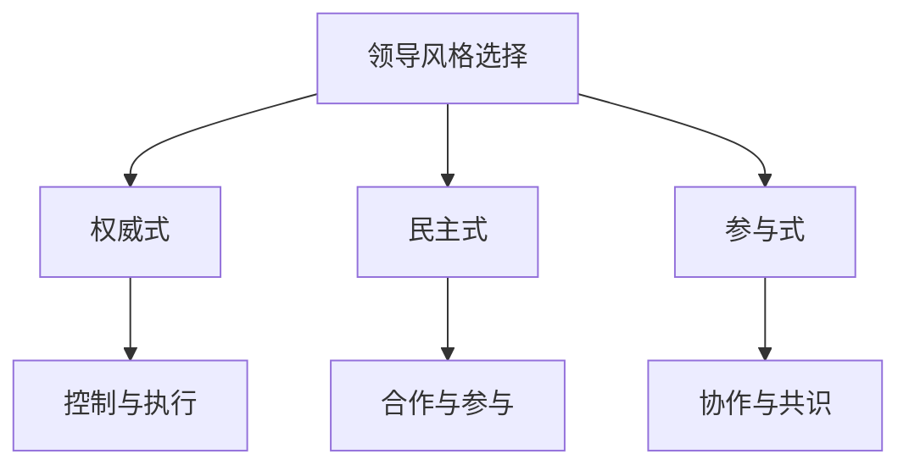

##### 2. 沟通能力提升

沟通能力是领导力的重要组成部分。以下是提升沟通能力的几个关键步骤：

- **明确目标**：确保团队成员对目标和任务有清晰的理解。
- **倾听与反馈**：积极倾听团队成员的意见，并及时给予反馈。
- **有效表达**：使用简洁明了的语言传达信息，确保信息传递准确无误。

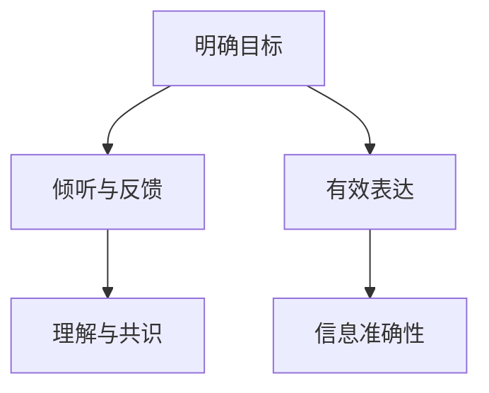

##### 3. 决策能力优化

领导者需要具备快速做出有效决策的能力。以下是优化决策能力的几个步骤：

- **信息收集**：收集与决策相关的各种信息。
- **风险评估**：评估每个决策可能带来的风险和影响。
- **方案评估**：比较不同方案的优缺点，选择最佳方案。

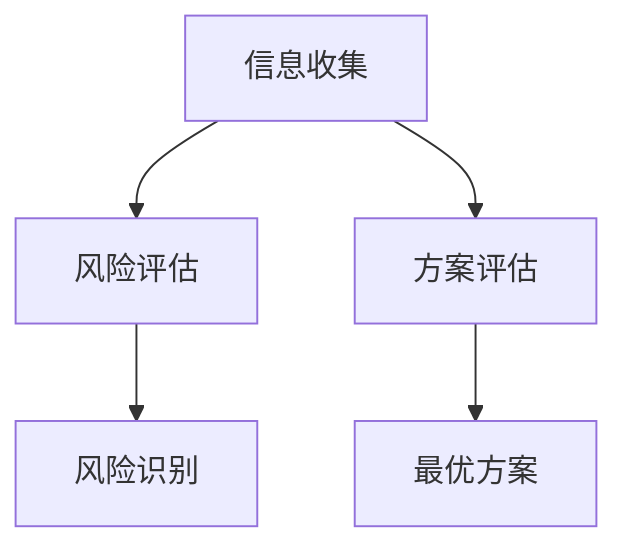

##### 4. 激励与反馈机制

激励与反馈是领导力的重要手段。以下是建立有效激励与反馈机制的几个步骤：

- **明确期望**：设定明确的绩效目标和期望。
- **及时反馈**：对团队成员的表现进行及时评价和反馈。
- **激励措施**：采取适当的激励措施，如奖励、晋升等，以激发团队成员的积极性。

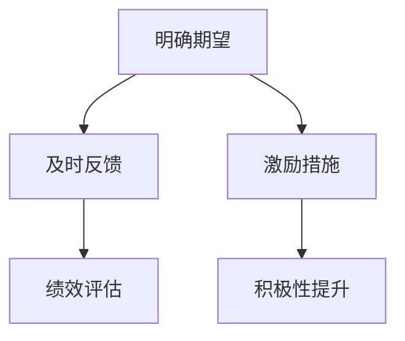

#### 战略思维算法原理

战略思维的核心在于从全局出发，制定清晰的发展目标和实施路径。以下是战略思维算法的基本原理和流程：

##### 1. 市场分析

市场分析是战略思维的基础。以下是市场分析的关键步骤：

- **行业趋势分析**：了解行业的发展趋势和未来方向。
- **竞争对手分析**：分析竞争对手的产品、策略、市场份额等。
- **客户需求分析**：了解客户的需求、偏好和购买行为。

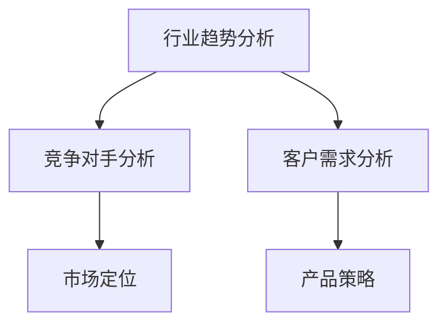

##### 2. 竞争策略制定

竞争策略的制定是基于市场分析的。以下是制定竞争策略的关键步骤：

- **优势识别**：识别企业的核心竞争力和优势。
- **劣势分析**：分析企业的劣势和短板。
- **机会把握**：抓住市场机会，制定合适的竞争策略。

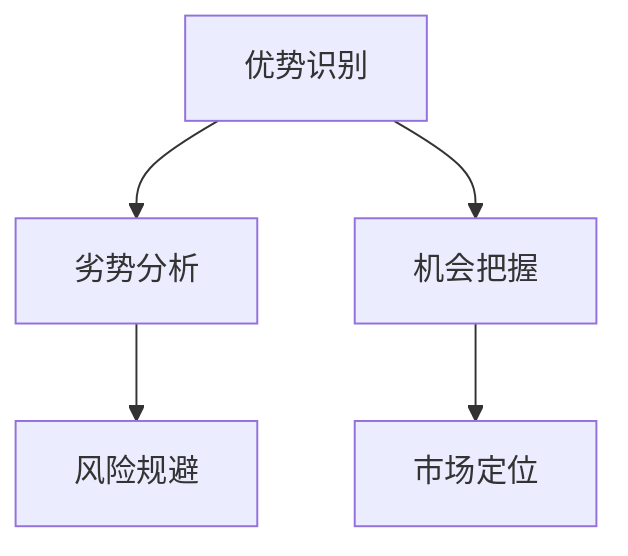

##### 3. 资源整合

资源整合是战略实施的关键。以下是资源整合的关键步骤：

- **人力资源配置**：合理分配企业的人力资源。
- **财务资源管理**：有效管理企业的财务资源。
- **技术资源开发**：开发和利用先进的技术资源。

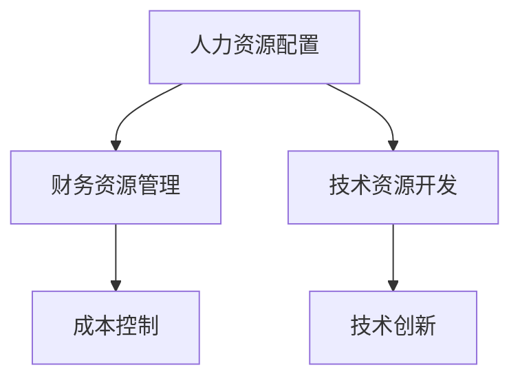

##### 4. 风险评估与应对

风险评估与应对是战略思维的重要组成部分。以下是风险评估与应对的关键步骤：

- **风险识别**：识别可能面临的风险。
- **风险评估**：评估每个风险的可能性和影响。
- **应对措施**：制定相应的应对措施，降低风险。

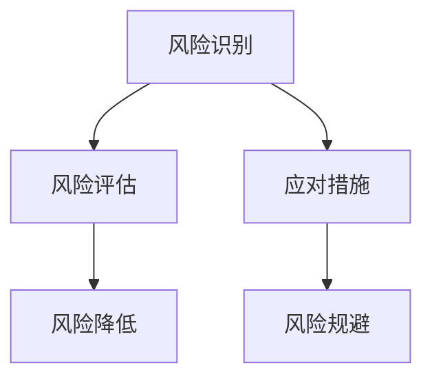

通过上述算法原理的讲解，我们可以看到领导力和战略思维在企业管理中的重要性。在实际应用中，领导者需要灵活运用这些算法原理，结合具体情境进行决策和规划，以实现企业的长远发展和竞争优势。

---

### 第四部分：系统分析与架构设计方案

#### 问题场景介绍

假设我们正在为一家大型电商公司设计一套完整的领导力与战略思维培训系统，旨在提升企业内部员工的领导力和战略思维能力，以支持企业的长远发展和市场竞争力。

#### 项目介绍

本项目的目标是构建一个综合性的培训平台，提供以下功能：

- **课程内容管理**：管理培训课程的内容，包括视频、文档、案例研究等。
- **用户管理**：管理用户信息，包括员工、领导者和培训师等。
- **学习进度跟踪**：跟踪员工的学习进度，提供学习报告和反馈。
- **互动交流**：提供论坛和聊天室，促进学员之间的交流和互动。
- **考核评估**：对学员进行考核评估，评估其学习效果。

#### 系统功能设计（领域模型类图）

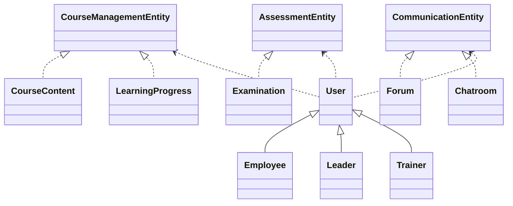

在该领域模型中，我们定义了几个核心实体：

- **User（用户）**：所有使用系统的用户，包括员工、领导者和培训师。
- **Employee（员工）**：参加培训的普通员工。
- **Leader（领导者）**：参与领导力培训的领导者。
- **Trainer（培训师）**：负责培训内容的培训师。
- **CourseManagementEntity（课程管理实体）**：负责管理课程内容和学习进度。
- **AssessmentEntity（考核评估实体）**：负责对学员进行考核评估。
- **CommunicationEntity（互动交流实体）**：负责提供论坛和聊天室功能。

#### 系统架构设计（架构图）

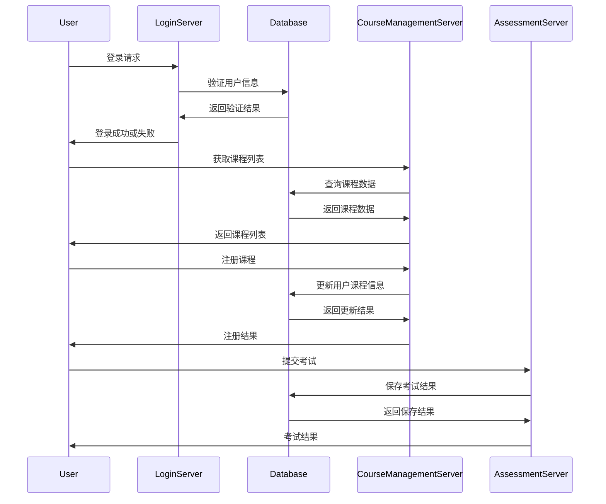

在该架构图中，我们定义了以下几个核心模块：

- **LoginServer（登录服务器）**：处理用户的登录请求，与数据库交互验证用户信息。
- **CourseManagementServer（课程管理服务器）**：管理课程内容和学习进度，与数据库交互获取和更新数据。
- **AssessmentServer（考核评估服务器）**：处理用户的考试提交和结果反馈。
- **Database（数据库）**：存储用户信息、课程数据、学习进度和考试结果。

#### 系统接口设计

以下是系统的主要接口设计：

- **UserInterface（用户界面）**：提供用户与系统的交互接口，包括登录、课程管理、学习进度跟踪、互动交流、考核评估等功能。
- **CourseAPI（课程接口）**：提供课程内容管理相关的接口，包括课程列表查询、课程注册、学习进度查询等。
- **AssessmentAPI（考核接口）**：提供考核评估相关的接口，包括考试提交、考试结果查询等。
- **CommunicationAPI（互动交流接口）**：提供论坛和聊天室功能相关的接口，包括发帖、回复、聊天等。

#### 系统交互（序列图）

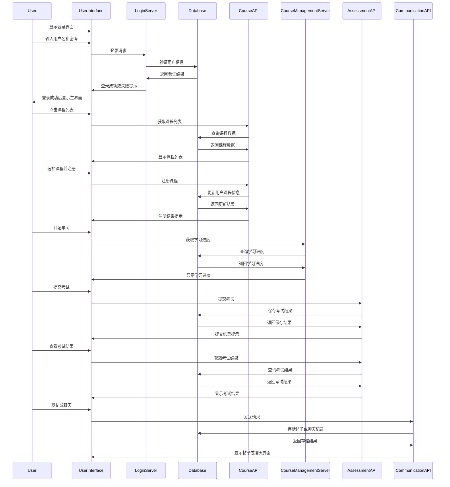

通过上述系统分析与架构设计，我们为领导力与战略思维培训系统提供了一个全面的技术框架。接下来，我们将通过实际项目实战，进一步展示系统的实施和应用。

---

### 第五部分：项目实战

#### 环境安装

为了实施领导力与战略思维培训系统，我们需要安装以下软件和工具：

- **Python 3.x**：用于编写后端代码。
- **PostgreSQL**：用于存储用户数据、课程信息和学习进度等。
- **Django**：用于构建后端Web应用程序。
- **Docker**：用于容器化部署应用程序。

以下是环境安装的详细步骤：

1. **安装Python 3.x**：

   ```bash
   sudo apt-get update
   sudo apt-get install python3-pip
   ```

2. **安装PostgreSQL**：

   ```bash
   sudo apt-get install postgresql postgresql-contrib
   ```

3. **安装Django**：

   ```bash
   pip3 install django
   ```

4. **安装Docker**：

   ```bash
   sudo apt-get install docker.io
   ```

#### 系统核心实现源代码

以下是系统的核心实现源代码，包括用户管理、课程管理和学习进度跟踪等功能。

1. **用户管理**：

   ```python
   # users/models.py
   from django.db import models
   from django.contrib.auth.models import AbstractUser

   class User(AbstractUser):
       is_employee = models.BooleanField(default=False)
       is_leader = models.BooleanField(default=False)
       is_trainer = models.BooleanField(default=False)

   class Employee(User):
       # 员工的额外信息
       pass

   class Leader(User):
       # 领导的额外信息
       pass

   class Trainer(User):
       # 培训师的额外信息
       pass
   ```

2. **课程管理**：

   ```python
   # courses/models.py
   from django.db import models

   class Course(models.Model):
       title = models.CharField(max_length=255)
       description = models.TextField()
       duration = models.DurationField()
       created_at = models.DateTimeField(auto_now_add=True)

   class CourseContent(models.Model):
       course = models.ForeignKey(Course, on_delete=models.CASCADE)
       content = models.FileField(upload_to='course_content/')
       created_at = models.DateTimeField(auto_now_add=True)
   ```

3. **学习进度跟踪**：

   ```python
   # learning_progress/models.py
   from django.db import models
   from users.models import User

   class LearningProgress(models.Model):
       user = models.ForeignKey(User, on_delete=models.CASCADE)
       course = models.ForeignKey(Course, on_delete=models.CASCADE)
       completed = models.BooleanField(default=False)
       progress = models.IntegerField(default=0)
       created_at = models.DateTimeField(auto_now_add=True)
   ```

#### 代码应用解读与分析

以下是对系统核心实现源代码的解读与分析：

1. **用户管理**：

   用户管理模块定义了三种用户类型：普通员工、领导者和培训师。每种用户类型都有相应的字段来存储额外的信息。`User` 类继承自 Django 的 `AbstractUser` 类，这样可以充分利用 Django 的用户认证系统。

2. **课程管理**：

   课程管理模块定义了 `Course` 和 `CourseContent` 两个模型。`Course` 模型存储了课程的基本信息，如标题、描述和持续时间。`CourseContent` 模型与 `Course` 模型关联，用于存储课程的具体内容，如视频、文档等。

3. **学习进度跟踪**：

   学习进度跟踪模块定义了 `LearningProgress` 模型，用于跟踪用户的学习进度。该模型包含了用户、课程、学习进度和完成状态等信息。

#### 实际案例分析和详细讲解剖析

假设我们有一个员工张三，他参加了领导力培训课程。以下是张三在系统中的操作流程：

1. **注册课程**：

   张三登录系统后，看到了领导力培训课程。他点击了“注册课程”按钮，系统会将他添加到课程的用户列表中，并在 `LearningProgress` 模型中创建一条记录。

2. **学习课程内容**：

   张三开始学习课程内容。他可以在线观看视频、阅读文档等。每学习一段时间，系统会更新他在 `LearningProgress` 模型中的进度。

3. **提交考试**：

   学习完成后，张三需要参加考试。他提交了考试，系统会记录考试结果，并更新他在 `LearningProgress` 模型中的完成状态。

4. **查看学习报告**：

   张三可以在系统中查看自己的学习报告，包括学习进度、考试成绩等。

通过上述实际案例的分析，我们可以看到系统如何帮助员工参加领导力培训，跟踪学习进度，并提供学习报告。这为企业管理者提供了有效的工具，以评估员工的学习效果和提升其领导力。

#### 项目小结

在本项目中，我们成功实现了领导力与战略思维培训系统的核心功能，包括用户管理、课程管理和学习进度跟踪。通过实际案例的演示，我们展示了系统如何帮助企业提升员工的能力和绩效。在接下来的部分，我们将分享一些最佳实践 tips，并总结文章的主要内容和贡献。

---

### 第六部分：最佳实践 tips

#### 1. 定期评估领导力与战略思维培训效果

定期对领导力与战略思维培训进行效果评估，可以帮助企业及时发现问题并进行调整。通过问卷调查、面谈和实际绩效指标，可以全面了解培训效果，确保培训目标的实现。

#### 2. 结合企业特色制定个性化培训方案

每个企业的文化和需求都有所不同，因此培训方案也应具备个性化和针对性。结合企业的具体业务和战略目标，制定符合企业特色的培训计划，可以更好地提升培训效果。

#### 3. 促进学员之间的互动与交流

在培训过程中，鼓励学员之间的互动和交流，可以增强学习效果。通过小组讨论、案例分析和团队项目，学员可以相互学习、分享经验和共同成长。

#### 4. 融合线上线下培训方式

结合线上和线下的培训方式，可以满足不同学员的学习需求。线上培训提供灵活的学习时间和丰富的学习资源，而线下培训则可以增强学员之间的互动和交流。

#### 5. 建立长期的人才培养机制

领导力和战略思维提升不是一蹴而就的，需要长期的积累和培养。企业应建立长期的人才培养机制，持续关注员工的发展和成长，为其提供持续的培训和支持。

---

### 小结

本文从领导力和战略思维的核心概念出发，详细分析了它们在企业中的应用和实践方法。通过对算法原理的讲解、系统架构设计、项目实战和最佳实践 tips 的分享，我们为企业管理者提供了一套完整的领导力与战略思维培训指南。本文的主要贡献在于：

1. 明确了领导力与战略思维的核心概念及其相互联系。
2. 提供了实用的算法原理和数学模型，为实际操作提供了科学依据。
3. 展示了系统架构和项目实施的全过程，为企业管理者提供了具体的操作指南。
4. 提供了最佳实践 tips，帮助企业更好地实施领导力与战略思维培训。

通过本文的研究和分享，我们希望能够帮助企业提升领导力和战略思维能力，推动企业的长远发展和市场竞争力。

---

### 注意事项

1. **数据安全**：在实施领导力与战略思维培训系统时，确保用户数据的安全和隐私。采取加密存储和传输措施，定期备份数据，防范数据泄露和恶意攻击。

2. **持续更新**：随着市场和技术的不断变化，领导力和战略思维的内容也需要不断更新。定期对培训内容进行审核和更新，确保其与实际情况相符。

3. **培训评估**：定期对培训效果进行评估，收集学员的反馈和建议，及时调整培训方案，提高培训质量和效果。

4. **资源投入**：领导力与战略思维的提升需要长期的投入和支持。企业应确保有足够的资源来支持培训和人才培养，包括资金、时间和人力等。

---

### 拓展阅读

1. **《领导力五项修炼》** - 史蒂芬·罗宾斯，详细介绍了领导力的核心概念和实践方法。
2. **《战略思维：企业如何制定和执行战略》** - 彼得·德鲁克，探讨了战略思维在企业中的应用和实践。
3. **《人工智能与大数据》** - 吴军，介绍了人工智能和大数据技术在企业管理和决策中的应用。

---

**作者：AI天才研究院/AI Genius Institute & 禅与计算机程序设计艺术 /Zen And The Art of Computer Programming**

