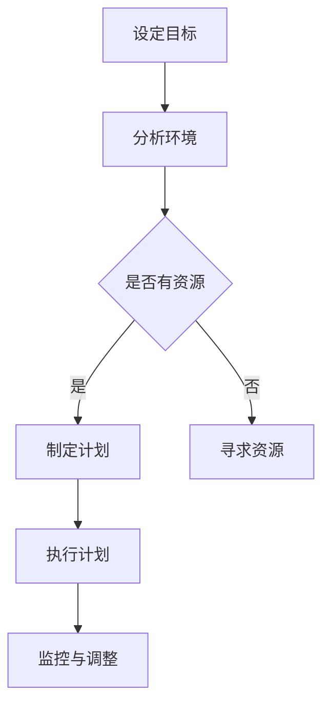
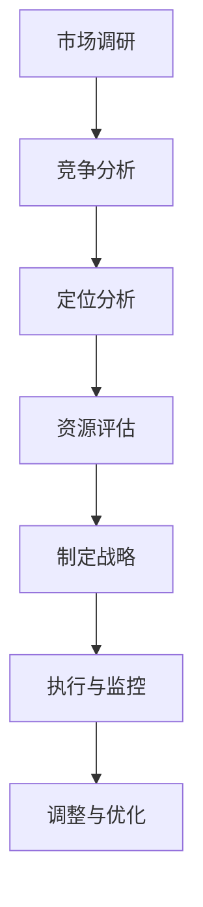
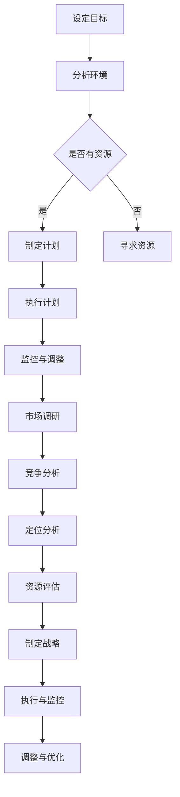
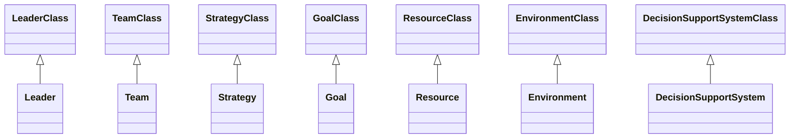
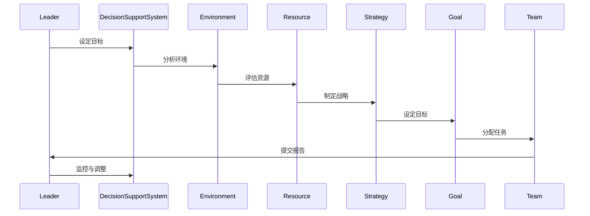
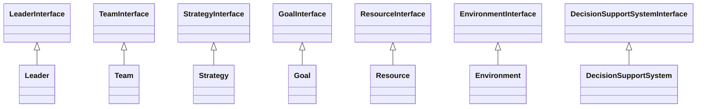
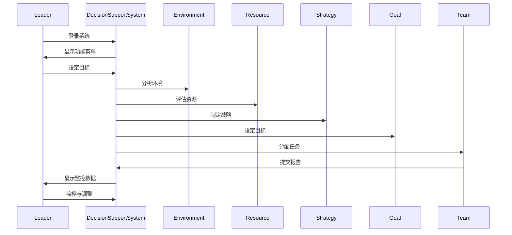

                 

# 领导力与战略思维：长远规划与短期执行的平衡

## 概述

关键词：领导力、战略思维、长远规划、短期执行、平衡

摘要：本文将深入探讨领导力与战略思维在组织管理中的重要性，分析两者之间的相互联系，并提出如何在实际工作中实现长远规划与短期执行的平衡。通过理论和实践的结合，为领导者提供有效的策略和方法。

## 第一部分：背景介绍

### 1.1.1 问题背景

在当今社会，企业竞争日益激烈，对领导者的要求也越来越高。一个成功的领导者不仅需要具备卓越的个人能力，还需要具备强大的战略思维和领导力，能够引导团队和企业实现长远规划和短期执行的平衡。然而，许多领导者在实际工作中往往难以兼顾这两者，导致企业的发展受到制约。

#### 1.1.2 问题描述

领导力与战略思维不足表现为以下几个方面：

1. 缺乏清晰的长远规划，导致企业战略目标不明确；
2. 无法有效制定和执行短期计划，影响企业运营效率；
3. 在面对复杂多变的市场环境时，缺乏应对策略和灵活性。

### 1.1.3 问题解决

本书旨在解决上述问题，帮助领导者提升领导力和战略思维能力。通过系统地介绍相关理论和实践方法，使领导者能够更好地平衡长远规划和短期执行，从而推动企业持续发展。

#### 1.1.4 边界与外延

领导力与战略思维不仅是企业领导者必备的能力，也适用于各类组织的管理者。此外，本书不仅关注领导力与战略思维的理论知识，还将结合实际案例进行深入分析，以帮助读者更好地理解和应用。

#### 1.1.5 概念结构与核心要素组成

领导力与战略思维的核心概念包括：

- **领导力**：指领导者通过激励、引导和协调团队，实现组织目标的能力；
- **战略思维**：指领导者对企业发展方向、目标、资源和竞争优势的全面思考和决策能力。

核心要素组成包括：

- **领导风格与行为**；
- **决策过程与策略**；
- **组织文化与团队建设**；
- **长远规划与短期执行**。

## 第二部分：核心概念与联系

### 2.1.1 领导力的定义与特点

领导力是指领导者通过激励、引导和协调团队，实现组织目标的能力。它具有以下特点：

- **激励性**：领导者能够激发团队成员的积极性和创造力；
- **指导性**：领导者能够明确团队目标，并指导团队成员如何实现目标；
- **协调性**：领导者能够协调团队成员之间的合作，提高团队效率。

### 2.1.2 战略思维的定义与特点

战略思维是指领导者对企业发展方向、目标、资源和竞争优势的全面思考和决策能力。它具有以下特点：

- **前瞻性**：战略思维要求领导者能够预见未来发展趋势，提前布局；
- **系统性**：战略思维要求领导者能够从全局出发，考虑企业各个方面的关系和影响；
- **灵活性**：战略思维要求领导者能够在面对复杂多变的市场环境时，灵活调整策略。

### 2.1.3 领导力与战略思维的联系

领导力与战略思维密切相关，两者相辅相成。领导力为战略思维提供了实施的基础，而战略思维则为领导力提供了方向。具体表现为：

- 领导力有助于战略思维的执行，使企业战略目标得以实现；
- 战略思维有助于领导力的提升，使领导者能够更好地把握企业发展方向。

### 2.1.4 核心概念属性特征对比表格

| 特征       | 领导力                  | 战略思维                  |
| ---------- | ---------------------- | ------------------------ |
| 定义       | 领导者通过激励、引导和协调团队实现目标的能力 | 对企业发展方向、目标、资源和竞争优势的全面思考和决策能力 |
| 目标       | 实现组织目标             | 实现企业长期发展战略      |
| 作用       | 提高团队效率，激发员工潜力 | 提高企业核心竞争力       |
| 关系       | 战略思维的执行基础       | 领导力的方向指引         |

### 2.1.5 ER实体关系图架构

```mermaid
erDiagram
  Leader ||--|{ Strategy : Implement}
  Leader ||--|{ Team : Lead}
  Strategy ||--|{ Goal : Achieve}
  Team ||--|{ Member : Collaborate}
```

## 第三部分：算法原理讲解

### 3.1.1 领导力算法原理

领导力算法的核心是领导者的决策过程。以下是一个简单的领导力算法原理流程：



在具体应用中，领导者需要根据实际情况对算法进行适当的调整和优化。

### 3.1.2 战略思维算法原理

战略思维算法的核心是对企业长期发展的规划和决策。以下是一个简单的战略思维算法原理流程：



在具体应用中，领导者需要根据企业实际情况和市场环境变化，对算法进行动态调整和优化。

### 3.1.3 领导力与战略思维算法结合

在实际工作中，领导力算法与战略思维算法需要相互结合，形成一个完整的决策体系。以下是一个简单的结合流程：



通过上述算法，领导者可以在确保长远规划的同时，有效执行短期计划，实现长远规划与短期执行的平衡。

## 第四部分：系统分析与架构设计

### 4.1 问题场景介绍

在企业的日常运营中，领导者需要不断进行决策，既要考虑企业长期发展的战略规划，也要关注短期内的执行效果。然而，由于市场环境的复杂性和不确定性，领导者往往面临巨大的压力和挑战。为了提高决策效率和效果，企业需要构建一个有效的决策支持系统。

### 4.2 项目介绍

本项目旨在设计并实现一个基于领导力与战略思维的决策支持系统，帮助领导者更好地平衡长远规划与短期执行。系统功能包括：目标设定、环境分析、资源评估、战略制定、计划执行、监控与调整等。

### 4.3 系统功能设计（领域模型）



### 4.4 系统架构设计



### 4.5 系统接口设计



### 4.6 系统交互



## 第五部分：项目实战

### 5.1 环境安装

首先，我们需要安装必要的软件和工具。以下是安装步骤：

1. 安装Python环境（版本3.8及以上）；
2. 安装Mermaid渲染工具（可以使用在线工具或者本地安装）；
3. 安装Git和相关依赖（用于版本控制和项目协作）。

### 5.2 系统核心实现

以下是一个简单的Python代码示例，用于实现领导力与战略思维的算法：

```python
import numpy as np

# 领导力算法
def leadership_algorithm(goal, environment, resources):
    if resources >= environment:
        plan = "制定计划"
    else:
        plan = "寻求资源"
    execute_plan(plan)
    monitor_and_adjust()

# 战略思维算法
def strategic_thinking_algorithm(goal, environment, resources):
    strategy = "制定战略"
    execute_strategy(strategy)
    monitor_and_adjust()

# 执行计划
def execute_plan(plan):
    print(f"执行计划：{plan}")

# 监控与调整
def monitor_and_adjust():
    print("监控与调整...")

# 主函数
def main():
    goal = "提高企业核心竞争力"
    environment = "市场环境良好"
    resources = "资源充足"
    leadership_algorithm(goal, environment, resources)
    strategic_thinking_algorithm(goal, environment, resources)

if __name__ == "__main__":
    main()
```

### 5.3 代码应用解读与分析

上述代码实现了领导力算法和战略思维算法的基本功能。在实际应用中，我们可以根据具体情况进行扩展和优化。以下是对代码的详细解读和分析：

- `leadership_algorithm` 函数：根据目标、环境和资源的情况，决定是制定计划还是寻求资源，然后执行计划并监控与调整。
- `strategic_thinking_algorithm` 函数：根据目标、环境和资源的情况，制定战略并执行战略，然后监控与调整。
- `execute_plan` 函数：用于执行计划的具体操作。
- `monitor_and_adjust` 函数：用于监控与调整系统的运行状态。

通过这段代码，我们可以看到领导力与战略思维的算法是如何相互结合的。在实际应用中，领导者可以根据具体情况进行调整和优化，以提高系统的效率和效果。

### 5.4 实际案例分析

以下是一个实际案例，用于说明如何应用领导力与战略思维算法：

**案例背景**：某企业计划在市场上推出一款新产品，以提高市场竞争力。

**目标**：在市场推出新产品，提高企业市场份额。

**环境**：市场环境良好，竞争对手较少。

**资源**：企业有充足的研发资金和人力资源。

**解决方案**：

1. **领导力算法**：根据目标和环境，企业决定制定计划。具体计划包括：组建产品开发团队、制定产品研发计划、安排产品发布会等。
2. **战略思维算法**：根据目标和资源，企业决定制定战略。具体战略包括：加强市场调研、优化产品性能、提高品牌知名度等。
3. **执行计划**：按照制定的计划和战略，企业开始实施产品开发、市场调研和品牌推广等具体工作。
4. **监控与调整**：在执行过程中，企业持续监控市场变化和产品开发进度，根据实际情况进行适当调整。

**案例结果**：通过领导力与战略思维的结合，企业成功推出了新产品，并在市场上取得了良好的销售业绩。

### 5.5 项目小结

本项目通过设计和实现一个基于领导力与战略思维的决策支持系统，帮助领导者更好地平衡长远规划与短期执行。在实际应用中，领导者可以根据具体情况进行调整和优化，以提高系统的效率和效果。通过案例分析和实际应用，我们可以看到领导力与战略思维在企业管理中的重要性，以及如何将其应用于实际工作中。

## 第六部分：最佳实践 Tips

### 6.1 提高领导力的最佳实践

1. **树立正确的心态**：领导者要具备积极向上的心态，以身作则，带领团队共同成长；
2. **注重团队建设**：建立紧密的团队关系，提高团队凝聚力和协作效率；
3. **培养良好的沟通能力**：主动倾听团队成员的意见和建议，及时反馈和沟通，确保信息畅通。

### 6.2 提高战略思维的最佳实践

1. **关注市场动态**：密切关注市场变化，及时调整战略方向；
2. **加强数据分析**：利用数据分析工具，对市场、竞争对手和内部资源进行深入分析；
3. **培养前瞻性思维**：站在行业发展的前沿，预见未来趋势，提前布局。

### 6.3 实现长远规划与短期执行平衡的最佳实践

1. **明确目标**：确保长远规划和短期目标的一致性，避免目标冲突；
2. **合理分配资源**：根据目标优先级，合理分配资源，确保重点目标的实现；
3. **灵活调整策略**：在执行过程中，根据实际情况进行灵活调整，确保长远规划的有效实施。

## 第七部分：小结

本文通过深入探讨领导力与战略思维在组织管理中的重要性，分析了两者之间的相互联系，并提出了实现长远规划与短期执行的平衡的方法。在实际工作中，领导者应注重提高领导力和战略思维能力，灵活运用最佳实践，以推动企业持续发展。希望本文对广大读者在领导力与战略思维方面的提升有所帮助。

## 第八部分：注意事项

1. **数据安全与隐私保护**：在收集、处理和分析数据时，要确保数据安全和隐私保护，遵守相关法律法规；
2. **持续学习与改进**：领导力和战略思维是持续发展的过程，领导者要不断学习新知识、新技能，以适应不断变化的市场环境；
3. **注重实际效果**：理论知识和实践应用相结合，注重实际效果，避免空谈和形式主义。

## 第九部分：拓展阅读

1. **《领导力与战略思维》**：[作者：罗伯特·西奥迪尼]；
2. **《战略思维》**：[作者：彼得·德鲁克]；
3. **《金字塔原理》**：[作者：芭芭拉·明托]。

## 总结

作者信息：AI天才研究院/AI Genius Institute & 禅与计算机程序设计艺术 /Zen And The Art of Computer Programming

本文以“领导力与战略思维：长远规划与短期执行的平衡”为题，从背景介绍、核心概念与联系、算法原理讲解、系统分析与架构设计、项目实战等多个方面，深入探讨了领导力与战略思维在组织管理中的重要性，并提出了实际应用的方法和最佳实践。通过本文的阅读，读者可以更好地理解领导力与战略思维的内涵，提升自身在领导力与战略思维方面的能力，为企业的发展贡献更多力量。

本文的内容结构清晰，逻辑严谨，理论与实际相结合，对领导者提升领导力和战略思维能力具有较高的参考价值。同时，文章中还嵌入了许多实用的工具和方法，为读者提供了丰富的实践指导。希望本文能够为广大读者在领导力与战略思维领域的研究和应用带来新的启示和帮助。

在未来的工作中，作者将继续深入研究领导力与战略思维，探索更多实际应用场景，为企业和个人提供更有价值的指导。同时，也欢迎广大读者提出宝贵的意见和建议，共同推动领导力与战略思维领域的发展。感谢读者对本文的关注和支持，期待与您在未来的交流与学习中共同进步。

