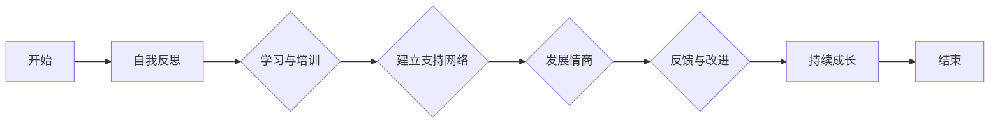
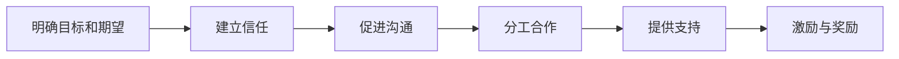
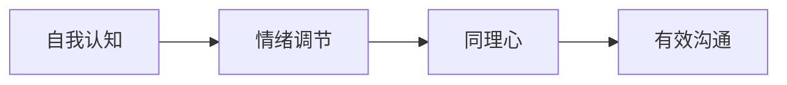
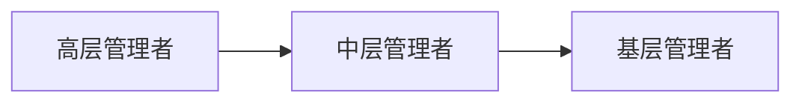
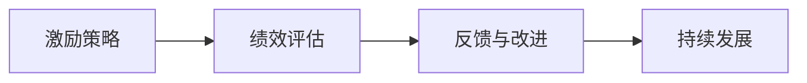
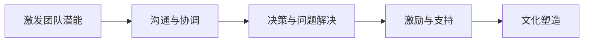
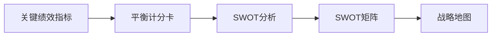

                 

# 领导力与战略执行：从规划到落地的全过程

## 关键词：领导力、战略规划、执行、团队建设、组织管理

## 摘要：
本文将深入探讨领导力与战略执行之间的关系，从规划到落地的全过程。首先，我们将回顾领导力的基础概念、核心要素及其在团队建设中的重要性。接着，文章将重点介绍战略规划与执行的方法，以及如何在战略执行过程中发挥领导力。最后，通过实际案例和实战指南，我们将总结成功的关键因素和应对策略，为读者提供实用的领导力与战略执行指导。

## 目录

### 第一部分：领导力基础

#### 第1章：领导力概述

##### 1.1 领导力的定义与作用

##### 1.2 领导力的类型

##### 1.3 领导力的重要性

#### 第2章：领导力的核心要素

##### 2.1 情境领导理论

##### 2.2 领导风格与团队文化

##### 2.3 领导者的自我认知与成长

#### 第3章：领导力与团队建设

##### 3.1 团队发展的五个阶段

##### 3.2 提升团队协作的技巧

##### 3.3 领导者如何激励团队

#### 第4章：领导力的挑战与应对策略

##### 4.1 领导者面临的挑战

##### 4.2 应对变革与冲突的策略

##### 4.3 领导者的情商与影响力

#### 第5章：领导力评估与持续发展

##### 5.1 领导力评估的方法

##### 5.2 持续提升领导力的途径

##### 5.3 领导力发展的未来趋势

### 第二部分：战略规划与执行

#### 第6章：战略规划的基础

##### 6.1 战略规划的定义与目的

##### 6.2 战略规划的步骤与方法

##### 6.3 战略规划的关键要素

#### 第7章：战略目标与执行计划

##### 7.1 明确战略目标

##### 7.2 制定执行计划

##### 7.3 风险管理

#### 第8章：组织结构与管理

##### 8.1 组织结构与战略的匹配

##### 8.2 管理层的角色与职责

##### 8.3 激励与绩效管理

#### 第9章：战略执行中的领导力

##### 9.1 领导力在战略执行中的作用

##### 9.2 领导者在战略执行中的挑战

##### 9.3 应对战略执行中常见问题的策略

#### 第10章：战略评估与调整

##### 10.1 战略评估的方法

##### 10.2 战略调整的时机与方式

##### 10.3 持续改进与适应性战略

### 第三部分：战略执行实战案例

#### 第11章：案例分析一：全球知名企业的成功经验

##### 11.1 企业背景介绍

##### 11.2 战略规划与执行过程

##### 11.3 成功的关键因素

#### 第12章：案例分析二：国内创业公司的快速崛起

##### 12.1 企业发展现状

##### 12.2 战略选择与执行

##### 12.3 创新与突破

#### 第13章：实战指南：从理论到实践

##### 13.1 实战准备

##### 13.2 常见问题与解决策略

##### 13.3 成功经验与启示

#### 第14章：总结与展望

##### 14.1 总结与回顾

##### 14.2 领导力与战略执行的关联

##### 14.3 未来发展展望

## 附录

### 附录A：术语表

### 附录B：参考资料

### 附录C：案例分析资料来源

---

## 引言

在当今快速变化的企业环境中，领导力与战略执行已经成为企业成功的关键因素。有效的领导力能够激发团队的潜能，推动组织实现目标；而科学的战略执行则确保企业能够在竞争激烈的市场中保持优势。本文旨在通过深入探讨领导力与战略执行之间的关系，帮助读者理解从规划到落地的全过程。

首先，我们将探讨领导力的基础，包括领导力的定义、类型、核心要素以及领导力在团队建设中的重要性。接着，文章将详细介绍战略规划的基础、战略目标与执行计划的制定、组织结构与管理等方面的内容。在此基础上，我们将通过实战案例和实战指南，总结成功的关键因素和应对策略，为读者提供实用的指导。

通过本文的学习，读者将能够：

- 明确领导力的核心概念和作用。
- 掌握战略规划与执行的方法和技巧。
- 理解领导力与战略执行之间的紧密联系。
- 获取实战经验和成功策略，以应用于实际工作中。

接下来，我们将一步步深入探讨领导力与战略执行的理论与实践，希望能够为读者带来深刻的启发和实用的帮助。

### 第1章：领导力概述

领导力是一个多维度的概念，它不仅仅是指导和管理团队的能力，更是一种激发和引导他人共同实现目标的艺术。在本章中，我们将探讨领导力的定义与作用，并介绍几种常见的领导力类型，以帮助读者全面理解领导力这一关键概念。

#### 1.1 领导力的定义与作用

领导力的定义多种多样，但其核心在于通过影响和激励他人，实现共同目标的能力。美国管理学家彼得·德鲁克（Peter Drucker）将领导力定义为：“不是命令别人去做什么，而是去引导、鼓舞和激励他人自愿地去做什么。”这种定义强调了领导力不仅仅是职位赋予的权力，更是个人魅力和影响力的体现。

领导力的作用主要体现在以下几个方面：

1. **激发团队潜能**：优秀的领导者能够发现并挖掘团队成员的潜力，激发他们的工作热情和创造力，从而提高整体绩效。
2. **引领组织变革**：在快速变化的市场环境中，领导者需要具备前瞻性，引领组织适应新的变化，推动创新和变革。
3. **建立团队文化**：领导力在塑造组织文化和价值观方面起着至关重要的作用。一个强大的团队文化可以增强团队的凝聚力和归属感。
4. **决策和问题解决**：领导者需要具备卓越的决策能力和问题解决能力，能够在复杂多变的环境中做出正确的决策。

#### 1.2 领导力的类型

领导力并非一成不变，而是可以根据不同的情境和需求表现出不同的类型。以下是几种常见的领导力类型：

1. **指令型领导**：这种类型的领导者通过明确的指令和指导来管理团队，适合在紧急情况下或者团队缺乏经验时使用。然而，过度的指令可能会抑制团队成员的自主性和创造力。
2. **参与型领导**：参与型领导者鼓励团队成员参与决策过程，重视团队意见，提高决策的质量和团队的凝聚力。这种领导风格适用于需要创新和团队协作的项目。
3. **变革型领导**：变革型领导者具备激发团队成员追求卓越的能力，通过愿景激励和挑战现状，推动团队实现变革。这种领导风格在应对市场变革和组织转型中尤为重要。
4. **服务型领导**：服务型领导者将团队成员的需求放在首位，致力于为团队提供支持和帮助，从而建立信任和合作关系。这种领导风格有助于提升团队的满意度和绩效。

#### 1.3 领导力的重要性

领导力的重要性在于其对企业成功的影响。以下是领导力在几个关键方面的重要性：

1. **团队绩效**：领导力对团队绩效有着显著的影响。有效的领导能够提高团队的效率和成果，实现组织目标。
2. **员工满意度**：优秀的领导者能够提升员工的满意度和忠诚度，减少员工流失率。
3. **组织创新**：领导力在激发创新和推动组织变革中起着关键作用。一个充满活力的组织文化需要领导者的支持和引导。
4. **企业竞争力**：领导力有助于企业在激烈的市场竞争中脱颖而出。领导者能够制定正确的战略，推动组织适应市场的变化。
5. **领导力传承**：有效的领导力培养计划能够确保企业未来领导者的培养，为企业的长期发展奠定基础。

总之，领导力不仅是个人能力的体现，更是企业成功的关键因素。通过深入理解和应用不同类型的领导力，领导者能够更好地激发团队的潜能，实现组织的战略目标。

### 第2章：领导力的核心要素

在领导力的实践中，了解并掌握其核心要素是至关重要的。这些核心要素不仅为领导者提供了行动指南，也为团队建设提供了坚实的基础。本章将重点探讨领导力的核心要素，包括情境领导理论、领导风格与团队文化，以及领导者的自我认知与成长。

#### 2.1 情境领导理论

情境领导理论是由保罗·赫塞（Paul Hersey）和肯尼思·布兰查德（Kenneth Blanchard）提出的一种领导力模型，它强调领导者应根据团队成员的能力和情境的变化来调整领导风格。情境领导理论将领导风格分为四种：

1. **指导型领导（S1）**：领导者详细说明任务和行为规范，适用于新手或者缺乏自主能力的团队成员。
2. **推销型领导（S2）**：领导者不仅指导，还激励团队成员，适用于有能力和自主性，但需要额外激励的团队成员。
3. **参与型领导（S3）**：领导者与团队成员共同决策，提高团队成员的参与度和自主性，适用于具备能力和自主性但需要更多自主空间的团队成员。
4. **授权型领导（S4）**：领导者赋予团队成员充分的责任和自主权，适用于具备高度能力和自主性的团队成员。

情境领导理论的核心在于领导者应根据不同情境和团队成员的能力灵活调整领导风格，以实现最佳效果。以下是一个对比表格，展示了不同领导风格下的领导者角色和团队成员反应：

| 领导风格 | 领导者角色 | 团队成员反应 |
| --- | --- | --- |
| 指导型 | 明确任务、规定行为 | 依赖指导，缺少自主性 |
| 推销型 | 指导并激励 | 激励提升，需要更多指导 |
| 参与型 | 共同决策、提供支持 | 参与度高，需要更多自主权 |
| 授权型 | 放权、提供资源 | 自主性强，需要少指导 |

#### 2.2 领导风格与团队文化

领导风格对团队文化有着深远的影响。不同的领导风格会塑造出不同的团队氛围和价值观。以下是几种常见的领导风格及其对应的团队文化：

1. **指令型领导**：这种领导风格往往会导致团队中的命令与控制文化，团队成员可能更倾向于遵循指示而非提出建议。
2. **参与型领导**：参与型领导鼓励团队成员参与决策，培养出更加开放和协作的文化，团队成员更加愿意分享和合作。
3. **变革型领导**：变革型领导者通过愿景激励和挑战现状，塑造出创新和适应变化的文化，团队成员更具有冒险精神和创新意识。
4. **服务型领导**：服务型领导者关注团队成员的需求，建立信任和合作关系，培养出一种以团队成员为中心的文化。

以下是一个领导风格与团队文化的对比表格：

| 领导风格 | 团队文化 |
| --- | --- |
| 指令型 | 命令与控制 |
| 参与型 | 开放协作 |
| 变革型 | 创新、适应变化 |
| 服务型 | 信任与合作 |

#### 2.3 领导者的自我认知与成长

领导者的自我认知是领导力的基础。一个优秀的领导者需要不断反思和提升自我，以适应不断变化的环境和需求。以下是领导者自我认知与成长的几个关键方面：

1. **自我反思**：领导者需要定期反思自己的行为和决策，识别自身的优势和不足，以便进行有针对性的改进。
2. **学习与培训**：持续学习和参与培训是领导者自我提升的重要途径。通过学习最新的领导理论、技术和工具，领导者可以不断提升自己的能力。
3. **建立支持网络**：领导者应建立广泛的职业支持网络，包括导师、同事和行业专家。这些网络可以为领导者提供宝贵的反馈和建议。
4. **发展情商**：情商在领导力中起着至关重要的作用。领导者需要具备良好的情绪管理能力和人际交往能力，以更好地理解和管理团队成员。

以下是一个领导者自我认知与成长步骤的Mermaid流程图：



通过了解并掌握领导力的核心要素，领导者不仅能够提升自身的领导能力，还能为团队建设提供有力支持。在下一章中，我们将进一步探讨领导力在团队建设中的具体应用，包括团队发展的五个阶段、提升团队协作的技巧以及领导者如何激励团队。

### 第3章：领导力与团队建设

在企业的成功中，团队建设起着至关重要的作用。一个高效的团队能够实现共同的目标，提高组织的整体绩效。领导者在团队建设过程中扮演着核心角色，他们不仅需要了解团队发展的五个阶段，还需要掌握提升团队协作的技巧，以及激励团队成员的方法。本章将详细探讨这些方面，以帮助领导者更好地构建和引导团队。

#### 3.1 团队发展的五个阶段

团队发展是一个动态过程，通常会经历以下五个阶段：

1. **形成阶段**：在这个阶段，团队成员刚刚组建，彼此之间还不熟悉。领导者需要设定清晰的团队目标和期望，帮助团队成员了解他们的角色和职责。
2. **激荡阶段**：随着团队成员相互了解的增加，可能会出现分歧和冲突。领导者需要积极解决冲突，确保团队目标的实现。
3. **规范阶段**：在这个阶段，团队成员开始形成共同的工作方式，彼此之间建立了信任和合作关系。领导者需要维护团队的规范和价值观，促进团队的稳定发展。
4. **执行阶段**：团队成员之间高度协作，工作效率和成果显著提升。领导者需要继续支持和激励团队成员，确保团队的执行力。
5. ** adjourning阶段**：当团队面临解散或重组时，领导者需要妥善处理团队结束的过程，确保团队成员能够顺利过渡到新的团队或职责。

以下是一个团队发展阶段的Mermaid流程图：


#### 3.2 提升团队协作的技巧

为了提升团队协作，领导者需要采取一系列措施，包括：

1. **明确目标和期望**：确保所有团队成员都清楚团队的共同目标和个人职责，以便协调一致地工作。
2. **建立信任**：信任是团队协作的基础。领导者需要通过开放沟通、透明决策和诚信行为来建立和维护信任。
3. **促进沟通**：领导者需要创造一个开放和包容的沟通环境，鼓励团队成员自由表达意见和反馈。
4. **分工合作**：根据团队成员的技能和兴趣分配任务，确保每个人都能在适合自己的领域发挥最大潜力。
5. **提供支持**：领导者需要为团队成员提供必要的资源和支持，帮助他们克服困难，完成任务。
6. **激励与奖励**：领导者需要通过激励和奖励机制来鼓励团队成员的积极性和创造力。

以下是一个提升团队协作的技巧的Mermaid流程图：



#### 3.3 领导者如何激励团队

激励团队是领导者的重要职责。以下是一些激励团队的方法：

1. **设定挑战性目标**：领导者可以设定具有挑战性的目标，激发团队成员的进取心和竞争意识。
2. **认可与奖励**：通过公开认可和奖励团队成员的成就和贡献，增强他们的自信心和归属感。
3. **提供职业发展机会**：为团队成员提供培训和学习机会，帮助他们提升技能和职业发展。
4. **创建积极的工作环境**：领导者需要创造一个积极、开放和包容的工作环境，减少压力和冲突。
5. **关注团队成员的需求**：领导者需要关注团队成员的个人需求，帮助他们解决工作和生活中的问题。

以下是一个激励团队的Mermaid流程图：


通过了解团队发展的五个阶段，掌握提升团队协作的技巧和激励团队的方法，领导者可以更好地构建和引导团队，实现组织的战略目标。

### 第4章：领导力的挑战与应对策略

在领导力的实践中，领导者常常面临各种挑战，这些挑战可能来自内部或外部，对领导者的能力提出了严峻考验。在本章中，我们将探讨领导者面临的常见挑战，并介绍一些应对策略，以帮助领导者有效地应对这些挑战，提升领导力和团队绩效。

#### 4.1 领导者面临的挑战

1. **团队冲突**：团队成员之间的冲突是领导者的常见挑战之一。冲突可能导致团队士气下降，工作效率降低，甚至影响团队目标的实现。
2. **变革管理**：在快速变化的市场环境中，领导者需要推动组织进行变革，这往往面临巨大阻力，包括员工的抵触、资源的限制以及不确定性的影响。
3. **领导力的传承**：随着企业的发展，领导者需要培养新一代的领导者，以确保企业持续发展。然而，领导力的传承并非易事，需要长期的规划和系统性的培养。
4. **绩效管理**：领导者需要有效地进行绩效管理，激励团队成员提高绩效，同时解决绩效低下的问题。这需要领导者具备敏锐的洞察力、公正的评价标准和有效的沟通技巧。
5. **工作与生活的平衡**：领导者不仅需要在工作中表现出色，还需要平衡工作与生活，以维持身心健康和幸福感。

#### 4.2 应对变革与冲突的策略

1. **应对变革的策略**：

   - **沟通与透明**：领导者需要与团队成员进行有效的沟通，传达变革的原因、目标和预期效果，减少误解和不确定性。
   - **建立信任**：通过建立信任，领导者可以减少员工的抵触情绪，鼓励他们积极参与变革过程。
   - **提供培训和支持**：为团队成员提供必要的培训和支持，帮助他们适应变革，提高适应能力。
   - **逐步实施**：将变革分为若干阶段逐步实施，以便及时发现和解决问题，减少变革对组织的冲击。

   以下是一个应对变革的Mermaid流程图：

   ```mermaid
   flowchart LR
       A[沟通与透明] --> B[建立信任]
       B --> C[提供培训和支持]
       C --> D[逐步实施]
   ```

2. **应对冲突的策略**：

   - **识别冲突来源**：领导者需要识别冲突的根源，是否是目标不一致、沟通不畅、资源分配不均等原因。
   - **开放沟通**：鼓励团队成员表达自己的观点和感受，通过开放沟通解决分歧。
   - **寻求共识**：通过寻求共识，找到双方都可以接受的解决方案。
   - **提供调解**：在必要时，领导者可以提供调解，帮助解决冲突。

   以下是一个应对冲突的Mermaid流程图：

   ```mermaid
   flowchart LR
       A[识别冲突来源] --> B[开放沟通]
       B --> C[寻求共识]
       C --> D[提供调解]
   ```

#### 4.3 领导者的情商与影响力

情商在领导力中起着至关重要的作用。领导者的高情商有助于他们更好地理解和管理团队成员的情绪，提升领导力和影响力。以下是一些提升情商的策略：

1. **自我认知**：领导者需要了解自己的情绪和行为，识别情绪触发点，以便更好地管理情绪。
2. **情绪调节**：领导者需要学会调节情绪，保持冷静和理性，尤其是在面对压力和挑战时。
3. **同理心**：领导者需要具备同理心，理解并尊重团队成员的情感和需求。
4. **有效沟通**：领导者需要通过有效沟通，建立信任和合作关系，提升影响力。

以下是一个提升情商的Mermaid流程图：



通过应对变革和冲突的策略，以及提升情商，领导者可以更好地应对挑战，提升领导力和团队绩效。在下一章中，我们将探讨如何评估和持续提升领导力，以帮助领导者不断成长和进步。

### 第5章：领导力评估与持续发展

领导力的提升不仅依赖于个人的自我认知和成长，还需要通过系统的评估与反馈来实现。在本章中，我们将探讨领导力评估的方法、持续提升领导力的途径，以及领导力发展的未来趋势。

#### 5.1 领导力评估的方法

有效的领导力评估是领导者持续成长的重要步骤。以下是一些常用的领导力评估方法：

1. **360度评估**：360度评估是一种通过收集团队成员、同事、上级和下属的反馈来评估领导者的方法。这种方法能够提供全面的视角，帮助领导者识别自己的优势和改进点。

2. **行为观察**：行为观察是一种通过观察领导者日常行为和决策来评估其领导能力的手段。这种方法能够提供具体的行为证据，帮助领导者了解自己的表现。

3. **领导力问卷**：通过设计一系列问卷，评估领导者在不同领导维度上的表现。这种方法适用于大规模的领导力评估，能够快速收集大量数据。

4. **领导力发展中心**：领导力发展中心是一种模拟真实工作场景的培训方法，通过角色扮演、情景模拟等方式，评估领导者在不同情境下的表现。

以下是一个领导力评估方法的Mermaid流程图：


#### 5.2 持续提升领导力的途径

1. **自我反思与学习**：领导者需要定期进行自我反思，识别自己的优势和改进点。通过阅读书籍、参加培训和学习新的领导理论，领导者可以不断提升自己的知识水平和领导能力。

2. **获取反馈**：领导者需要主动寻求团队成员、同事和上级的反馈，了解自己的表现和改进空间。通过倾听和接受反馈，领导者可以更好地调整自己的领导风格和策略。

3. **实践与锻炼**：领导力是通过实践和锻炼获得的。领导者需要在实际工作中不断实践和应用所学的领导理论和方法，通过实践来提升自己的领导能力。

4. **建立导师关系**：领导者可以寻找经验丰富的导师，向他们请教和寻求指导。导师的经验和建议可以帮助领导者更快地成长和进步。

5. **参加领导力培训**：参加专业的领导力培训课程，不仅能够学习新的领导理论和方法，还能与同行交流，分享经验和见解。

以下是一个持续提升领导力途径的Mermaid流程图：


#### 5.3 领导力发展的未来趋势

随着全球化和数字化的发展，领导力也在不断演变。以下是未来领导力发展的几个趋势：

1. **数字化转型**：在数字化时代，领导者需要具备数字素养，能够理解并利用数字化工具和技术来提升组织效率。

2. **情商的重要性**：情商在领导力中的地位日益提升，未来领导者需要更加关注情商的培养，以更好地理解和管理团队成员的情感。

3. **敏捷领导**：在快速变化的市场环境中，领导者需要具备敏捷思维和快速响应能力，以适应不断变化的环境。

4. **全球领导力**：随着全球化的发展，领导者需要具备跨文化沟通和协作能力，能够在多元文化环境中有效领导。

5. **持续学习**：未来领导者需要持续学习，以适应快速变化的环境和不断涌现的新技术。

以下是一个领导力发展未来趋势的Mermaid流程图：


通过领导力评估与持续发展的方法，领导者可以不断提升自己的领导能力，适应不断变化的环境和需求。在下一章中，我们将探讨战略规划的基础，包括战略规划的定义与目的、战略规划的步骤与方法，以及战略规划的关键要素。

### 第6章：战略规划的基础

战略规划是企业发展的关键，它不仅决定了企业的未来发展方向，还影响到企业的资源分配和行动方案。在本章中，我们将深入探讨战略规划的基础，包括战略规划的定义与目的、战略规划的步骤与方法，以及战略规划的关键要素。

#### 6.1 战略规划的定义与目的

战略规划是一个系统的过程，旨在明确企业的发展方向、目标和资源分配。它不仅涉及企业的长期愿景，还包括实现这一愿景的具体步骤和行动计划。具体来说，战略规划的定义与目的如下：

1. **定义**：战略规划是指企业为实现其长期目标和愿景，对内外部环境进行深入分析，明确战略方向、目标和资源分配的过程。
2. **目的**：战略规划的主要目的是确保企业能够在复杂多变的环境中保持竞争优势，实现可持续发展。

战略规划的核心要素包括：

- **企业愿景**：企业愿景是指企业长期的理想状态，它是战略规划的基础。
- **内外部环境分析**：通过分析企业的内部资源和外部环境，确定企业的优势和劣势，以及面临的机会和威胁。
- **战略目标**：战略目标是企业在战略规划期内要实现的具体目标，它应具有可衡量性和可执行性。
- **资源分配**：资源分配是指将企业的资源（如人力、财务、技术等）合理分配到各个战略目标和行动方案中。
- **行动计划**：行动计划是具体的执行步骤，确保战略目标的实现。

#### 6.2 战略规划的步骤与方法

战略规划是一个系统化的过程，通常包括以下步骤：

1. **确定企业愿景**：企业愿景是战略规划的核心，它应明确企业的长期目标和愿景。这一步骤需要企业领导层和关键利益相关者的共同参与。

2. **进行内外部环境分析**：通过对企业的内部资源和外部环境进行深入分析，确定企业的优势、劣势、机会和威胁。外部环境分析包括市场趋势、竞争对手、政策法规等因素；内部环境分析包括企业资源、能力、文化等。

3. **制定战略目标**：在明确企业愿景和内外部环境分析的基础上，制定具体的战略目标。这些目标应具有可衡量性、可执行性和相关性，以确保企业能够在战略规划期内实现。

4. **确定战略方向**：根据战略目标和内外部环境分析，确定企业的战略方向。战略方向包括核心业务、产品或服务、市场定位、技术创新等。

5. **制定行动计划**：为实现战略目标和战略方向，制定具体的行动计划。这些计划应包括具体的行动步骤、责任人和时间表。

6. **资源分配**：根据行动计划，将企业的资源（如人力、财务、技术等）合理分配到各个战略目标和行动方案中。资源分配应考虑企业的资源状况和优先级。

7. **实施与监控**：在制定完战略规划和行动计划后，开始实施战略计划，并根据实际情况进行监控和调整。

以下是一个战略规划步骤的Mermaid流程图：


#### 6.3 战略规划的关键要素

战略规划的成功离不开以下几个关键要素：

1. **明确性**：战略目标应明确、具体、可衡量，以便团队成员清晰了解企业的发展方向和目标。
2. **灵活性**：战略规划应具有一定的灵活性，能够根据市场环境和内部条件的变化进行调整和优化。
3. **一致性**：战略方向和行动方案应与企业愿景和目标保持一致，确保资源的有效利用和协同效应。
4. **参与度**：战略规划的制定和实施应充分调动企业内部员工的参与度，增强员工的认同感和执行力。

通过明确战略规划的定义与目的，掌握战略规划的步骤与方法，以及理解战略规划的关键要素，企业可以更好地制定和实施战略规划，实现长期可持续发展。

### 第7章：战略目标与执行计划

战略目标是企业发展的灯塔，为企业的每一项决策和行为提供了方向。在明确了战略目标之后，如何制定和执行详细的执行计划，确保这些目标能够顺利实现，是领导者的重要任务。本章将详细探讨战略目标的确定、执行计划的制定，以及风险管理在战略执行中的作用。

#### 7.1 明确战略目标

明确战略目标是战略规划中的关键一步。战略目标应当具有以下特点：

1. **具体性**：战略目标应明确具体，能够量化和衡量。例如，而不是仅仅说“提高市场份额”，而应该是“在三年内将市场份额提高至15%”。
2. **可实现性**：战略目标应基于企业的实际情况和资源能力，避免过于理想化或不切实际。
3. **相关性**：战略目标应与企业的愿景和使命紧密相关，确保所有团队成员都明确企业的发展方向。
4. **时限性**：战略目标应有明确的时间期限，以便于追踪和评估。

确定战略目标的过程通常包括以下几个步骤：

1. **定义愿景和使命**：企业首先要明确其长期的愿景和使命，这是制定具体战略目标的基础。
2. **市场分析**：通过市场分析，了解行业趋势、竞争对手和市场机会，为制定战略目标提供依据。
3. **内部评估**：评估企业的内部资源、能力和文化，确定企业在实现战略目标方面的优势和挑战。
4. **目标设定**：根据愿景、使命和市场分析，设定具体的、可量化的战略目标。

以下是一个战略目标设定的Mermaid流程图：


#### 7.2 制定执行计划

一旦战略目标明确，接下来就需要制定详细的执行计划。执行计划应包括以下几个关键要素：

1. **具体行动步骤**：将战略目标分解为具体的行动步骤，明确每个步骤的具体内容、执行时间、负责人和预期成果。
2. **资源分配**：根据行动步骤，合理分配所需的资源，包括人力、财务和技术资源等。
3. **时间表**：为每个行动步骤设定明确的时间表，确保各项任务按时完成。
4. **监控与评估**：建立监控和评估机制，定期检查各项任务的执行情况，及时调整计划，确保目标实现。

以下是一个执行计划的Mermaid流程图：


#### 7.3 风险管理

在战略执行过程中，风险管理是确保目标实现的重要环节。以下是一些常见的风险和相应的应对策略：

1. **市场风险**：市场环境的变化可能导致战略目标难以实现。应对策略包括定期进行市场分析，及时调整战略目标和执行计划。
2. **资源风险**：资源不足或资源分配不当可能影响战略目标的实现。应对策略包括优化资源分配，确保资源充足和有效利用。
3. **执行风险**：执行过程中的不确定性可能导致计划无法按时完成。应对策略包括建立严格的项目管理流程，确保每个步骤都有详细的计划和监控。
4. **技术风险**：新技术的发展可能对战略目标的实现产生影响。应对策略包括保持技术领先，积极跟进新技术趋势。

以下是一个风险管理流程的Mermaid流程图：


通过明确战略目标、制定详细的执行计划，以及有效的风险管理，企业可以确保战略目标的实现，实现可持续发展。在下一章中，我们将探讨组织结构与管理，包括组织结构与战略的匹配、管理层的角色与职责，以及激励与绩效管理。

### 第8章：组织结构与管理

在战略规划与执行的过程中，组织结构与管理起着至关重要的作用。一个合理的组织结构和管理体系能够确保战略目标的顺利实现，提高组织的运行效率和团队协作能力。本章将深入探讨组织结构与战略的匹配、管理层的角色与职责，以及激励与绩效管理。

#### 8.1 组织结构与战略的匹配

组织结构是企业在实现战略目标过程中所采用的一种体系化安排，它涉及到组织的职责分工、权力分配、信息流动和沟通方式等。组织结构与战略的匹配意味着组织的设计应与企业的长期战略目标相一致，以确保战略的有效实施。

1. **职能型组织结构**：这种组织结构根据企业的核心职能来划分部门，如营销、生产、研发等。它适用于战略目标需要各部门高度协同的情况。
2. **矩阵型组织结构**：矩阵型组织结构在职能型基础上增加了项目团队的管理层次，使各部门能够在项目层面进行协作。这种结构适用于需要跨部门协作的战略目标。
3. **网络型组织结构**：网络型组织结构通过外包、合作和联盟等方式，将企业内部与外部的资源整合起来，以实现战略目标。这种结构适用于需要灵活应对市场变化和快速创新的战略目标。

以下是一个组织结构类型的Mermaid流程图：


#### 8.2 管理层的角色与职责

管理层在组织结构中扮演着关键角色，他们的职责直接影响到战略目标的实现。以下是管理层的主要角色与职责：

1. **高层管理者**：高层管理者包括CEO、COO等，他们负责制定企业战略、决策重大事项、确保资源的合理分配。
2. **中层管理者**：中层管理者如部门经理、项目经理等，负责执行高层管理者的决策，协调各部门的协作，确保战略目标的实施。
3. **基层管理者**：基层管理者如团队领导、组长等，负责直接管理团队成员，确保各项任务的完成。

以下是一个管理层角色的Mermaid流程图：



#### 8.3 激励与绩效管理

激励和绩效管理是提升组织效率的重要手段。有效的激励和绩效管理体系能够激发员工的积极性，提高工作效率，确保战略目标的实现。

1. **激励策略**：激励策略包括物质激励（如奖金、晋升等）和精神激励（如认可、培训等）。领导者应根据不同员工的偏好和需求，设计个性化的激励方案。
2. **绩效评估**：绩效评估是通过设定明确的绩效目标和评估标准，对员工的工作表现进行定期评估。绩效评估应注重过程和结果的结合，确保公平、公正、透明。
3. **反馈与改进**：通过反馈机制，管理者可以了解员工的工作表现，提供针对性的改进建议，帮助员工不断提升绩效。
4. **持续发展**：建立持续发展的机制，通过培训和职业发展规划，提升员工的技能和职业素养，为组织培养未来的领导人才。

以下是一个激励与绩效管理流程的Mermaid流程图：



通过合理的组织结构设计、明确管理层的角色与职责，以及有效的激励与绩效管理，企业可以构建一个高效、协作的组织环境，确保战略目标的实现。

### 第9章：战略执行中的领导力

在战略执行过程中，领导力发挥着至关重要的作用。有效的领导力不仅能够确保战略目标的实现，还能激发团队潜能，推动组织的持续发展。本章将探讨领导力在战略执行中的作用、领导者面临的挑战，以及应对这些挑战的策略。

#### 9.1 领导力在战略执行中的作用

1. **激发团队潜能**：领导者通过激发团队成员的潜能，提高团队的执行力和创新能力。他们能够发现并挖掘团队成员的特长，为他们提供成长和发展的机会。
2. **沟通与协调**：领导者在战略执行过程中扮演着沟通桥梁的角色，他们需要确保团队成员理解并认同战略目标，同时协调不同部门之间的协作，确保资源的有效利用。
3. **决策与问题解决**：领导者需要具备迅速做出有效决策的能力，并在战略执行过程中解决各种问题。他们通过冷静分析、合理判断和果断行动，确保战略目标的顺利实现。
4. **激励与支持**：领导者通过激励和扶持团队成员，增强他们的工作动力和信心。他们关注团队成员的个人需求，提供必要的支持和资源，帮助他们克服困难，完成任务。
5. **文化塑造**：领导者通过建立和推广组织文化，塑造团队价值观和行为规范，增强团队的凝聚力和归属感。一个积极、开放、创新的文化能够激发团队成员的潜能，推动组织的持续发展。

以下是一个领导力在战略执行中作用的Mermaid流程图：



#### 9.2 领导者在战略执行中的挑战

1. **变革阻力**：在战略执行过程中，领导者常常面临来自员工的变革阻力。员工可能对变革持怀疑态度，担心变革会威胁到他们的利益和地位。领导者需要通过有效的沟通和激励，消除员工的疑虑，赢得他们的支持和参与。
2. **资源限制**：战略执行往往需要大量的资源支持，包括人力、财务和技术资源。领导者需要确保资源的合理分配，同时应对可能出现的资源短缺问题。
3. **外部环境变化**：市场环境、政策法规和技术发展等外部因素可能会对战略执行产生重大影响。领导者需要具备敏锐的洞察力和快速响应能力，及时调整战略目标和执行计划，以适应外部环境的变化。
4. **团队冲突**：战略执行过程中，团队成员之间的利益和意见可能存在分歧，导致冲突。领导者需要通过有效的沟通和协调，解决团队冲突，确保团队目标的实现。
5. **绩效压力**：战略目标的实现往往伴随着较大的绩效压力。领导者需要平衡短期绩效和长期发展，确保团队在实现战略目标的同时，保持健康和可持续发展。

以下是一个领导者面临的挑战的Mermaid流程图：


#### 9.3 应对战略执行中常见问题的策略

1. **加强沟通与激励**：领导者需要通过有效的沟通和激励，赢得员工的支持和参与。他们可以通过定期的会议、培训和团队建设活动，增强员工的归属感和责任感。
2. **优化资源管理**：领导者需要优化资源管理，确保资源的合理分配和有效利用。他们可以通过预算控制、优先级排序和资源调配等措施，提高资源的利用效率。
3. **灵活调整战略**：领导者需要根据外部环境的变化，灵活调整战略目标和执行计划。他们可以通过市场调研、竞争对手分析和技术跟踪等手段，及时掌握市场动态，为战略调整提供依据。
4. **建立团队协作机制**：领导者需要建立团队协作机制，解决团队冲突，提高团队执行力。他们可以通过明确责任分工、制定共同目标和建立沟通渠道等措施，促进团队成员之间的协作。
5. **注重绩效与成长**：领导者需要平衡短期绩效和长期发展，关注团队成员的绩效和成长。他们可以通过绩效评估、职业发展规划和激励机制，激发团队成员的工作热情和潜力。

以下是一个应对战略执行中常见问题的策略的Mermaid流程图：


通过有效的领导力，领导者可以应对战略执行中的各种挑战，推动组织的持续发展。在下一章中，我们将探讨战略评估与调整，包括战略评估的方法、战略调整的时机与方式，以及持续改进与适应性战略。

### 第10章：战略评估与调整

战略评估与调整是确保企业战略目标得以实现的关键环节。通过对战略执行情况进行定期评估，企业可以及时发现问题和调整方向，确保战略目标的实现。本章将探讨战略评估的方法、战略调整的时机与方式，以及持续改进与适应性战略。

#### 10.1 战略评估的方法

有效的战略评估是确保战略目标实现的基础。以下是一些常用的战略评估方法：

1. **关键绩效指标（KPI）**：关键绩效指标是衡量战略目标实现情况的重要工具。通过设定具体的KPI，企业可以量化战略目标的实现程度，并对其进行监控和调整。
2. **平衡计分卡（Balanced Scorecard）**：平衡计分卡是一种全面的战略绩效评估工具，它从财务、客户、内部流程和学习与成长四个维度来衡量战略目标的实现情况。
3. **SWOT分析**：SWOT分析是一种常用的战略评估方法，通过分析企业的优势、劣势、机会和威胁，帮助企业识别战略执行中的问题，并制定相应的调整策略。
4. **SWOT矩阵**：SWOT矩阵是一种将SWOT分析结果进行可视化展示的工具，它可以帮助企业清晰地了解自身的战略环境和战略方向。
5. **战略地图**：战略地图是一种通过图形化方式展示企业战略目标、关键绩效指标和执行计划的方法，它能够帮助企业更直观地理解和执行战略。

以下是一个战略评估方法的Mermaid流程图：



#### 10.2 战略调整的时机与方式

在战略执行过程中，根据评估结果进行及时调整是至关重要的。以下是一些常见的战略调整时机与方式：

1. **定期评估**：定期（如季度、年度）对战略执行情况进行评估，及时发现问题和调整方向。通过定期的评估，企业可以保持战略的灵活性和适应性。
2. **关键里程碑**：在战略执行的关键里程碑处进行评估和调整。这些里程碑通常是战略目标的阶段性实现点，通过评估和调整，企业可以确保战略目标的顺利实现。
3. **市场变化**：当市场环境发生重大变化时，如竞争对手的新动向、客户需求的变化等，企业应迅速调整战略，以保持竞争优势。
4. **内部反馈**：通过内部反馈机制，如员工反馈、部门评估等，收集战略执行中的问题和建议，进行及时调整。
5. **外部环境**：根据外部环境的变化，如政策法规、经济形势等，调整战略方向和执行计划，确保企业能够应对外部环境的变化。

以下是一个战略调整时机与方式的Mermaid流程图：


#### 10.3 持续改进与适应性战略

持续改进和适应性战略是确保企业长期发展的关键。以下是一些实现持续改进和适应性战略的方法：

1. **敏捷管理**：采用敏捷管理方法，如敏捷开发、敏捷领导等，提高企业的快速响应能力和灵活性。
2. **持续学习**：鼓励员工持续学习，提高他们的技能和知识水平，以应对快速变化的市场和技术。
3. **创新文化**：建立创新文化，鼓励员工提出新的想法和解决方案，推动企业的持续创新。
4. **定期反馈**：通过定期的反馈机制，如员工满意度调查、市场反馈等，了解企业的优势和不足，进行持续改进。
5. **战略调整**：根据市场和技术的发展趋势，定期调整战略方向和执行计划，确保企业能够适应外部环境的变化。

以下是一个持续改进与适应性战略的Mermaid流程图：

```mermaid
flowchart LR
    A[敏捷管理] --> B[持续学习]
    B --> C[创新文化]
    C --> D[定期反馈]
    D --> E[战略调整]
```

通过战略评估与调整，企业可以确保战略目标的实现，并在不断变化的市场环境中保持竞争优势。在下一章中，我们将通过实际案例展示全球知名企业和国内创业公司的成功经验，以帮助读者更好地理解和应用战略执行的最佳实践。

### 第11章：案例分析一：全球知名企业的成功经验

在全球范围内，许多知名企业通过有效的战略规划和执行取得了卓越的成就。这些企业的成功经验不仅为我们提供了宝贵的参考，也揭示了战略执行的关键要素和最佳实践。本章将分析一家全球知名企业的战略规划与执行过程，探讨其成功的关键因素。

#### 11.1 企业背景介绍

这家企业是一家跨国科技公司，成立于上世纪80年代，最初专注于计算机硬件的生产和销售。随着市场的变化和技术的进步，企业逐步转型为提供综合性IT解决方案，包括软件、硬件、云计算和人工智能等。目前，该企业在全球范围内拥有数百万客户，市场占有率名列前茅。

#### 11.2 战略规划与执行过程

1. **市场调研与定位**：在战略规划初期，企业进行了全面的市场调研，分析了行业趋势、竞争对手和客户需求。通过调研，企业确定了其市场定位，专注于提供高性能、高安全性的IT解决方案。
2. **内外部环境分析**：企业对其内部资源和能力进行了评估，包括研发实力、品牌影响力和客户资源。同时，企业分析了外部环境，包括市场竞争、政策法规和技术趋势。这些分析结果为战略规划提供了重要依据。
3. **制定战略目标**：基于市场调研和内外部环境分析，企业制定了以下战略目标：

   - **市场份额**：在五年内，将市场份额提高到全球前五。
   - **技术创新**：每年推出至少一项重大技术创新，保持行业领先地位。
   - **客户满意度**：客户满意度达到90%以上。

4. **资源分配**：为确保战略目标的实现，企业进行了资源的合理分配。在财务方面，企业增加了研发投入，以确保技术创新的持续进行。在人力资源方面，企业通过培训和招聘，提升了员工的技能和素质。在技术方面，企业投入大量资金和人力进行新技术的研发和应用。

5. **执行计划与监控**：企业制定了详细的执行计划，包括具体的行动步骤、时间表和责任人。同时，企业建立了监控机制，定期评估战略目标的实现情况，并根据实际情况进行动态调整。

#### 11.3 成功的关键因素

1. **明确的市场定位**：企业通过准确的市场定位，明确了其核心竞争力，从而在激烈的市场竞争中脱颖而出。
2. **持续的技术创新**：企业始终将技术创新作为战略重点，通过持续的研发投入和人才引进，保持了技术领先地位。
3. **资源的高效利用**：企业通过科学的资源分配和管理，确保了资源的最大化利用，为战略目标的实现提供了有力支持。
4. **严格的过程监控**：企业建立了严格的监控机制，确保战略执行过程中的每个环节都得到有效控制，从而提高了战略目标的实现率。

通过这个案例分析，我们可以看到，全球知名企业的成功并非偶然，而是基于科学的战略规划和严格的执行过程。这些企业的成功经验为我们提供了宝贵的借鉴，帮助我们更好地理解和应用战略执行的最佳实践。

### 第12章：案例分析二：国内创业公司的快速崛起

在国内创业公司的快速崛起过程中，战略规划和执行起到了至关重要的作用。本章将分析一家国内创业公司的成功案例，探讨其战略选择与执行过程，以及如何通过创新实现突破。

#### 12.1 企业发展现状

这家创业公司成立于2010年，最初专注于移动互联网应用的开发。在短短几年内，公司凭借其创新的商业模式和优质的产品，迅速获得了市场的认可和投资者的青睐。目前，该公司已经发展成为一家估值数十亿元的互联网公司，业务涵盖了移动应用、云计算、大数据和人工智能等多个领域。

#### 12.2 战略选择与执行

1. **市场定位与目标**：在创业初期，公司明确了其市场定位，专注于为广大用户提供便捷、高效的移动互联网服务。公司制定了以下战略目标：

   - **用户体验**：提供优质的用户体验，确保用户满意度达到90%以上。
   - **市场份额**：在三年内，将市场份额提高到国内前三。
   - **技术创新**：每年推出至少两项重大技术创新，保持行业领先地位。

2. **内外部环境分析**：公司对其内外部环境进行了全面分析。在内部，公司评估了其研发能力、团队协作和文化氛围；在外部，公司分析了市场趋势、竞争对手和用户需求。这些分析结果为公司的战略选择提供了重要依据。

3. **战略规划与执行**：

   - **创新驱动**：公司始终将创新作为战略核心，通过持续的研发投入和人才引进，推动技术创新。
   - **灵活调整**：根据市场变化和竞争态势，公司灵活调整战略方向，确保战略目标的实现。
   - **资源整合**：公司通过战略合作和投资，整合外部资源，提升自身竞争力。
   - **严格监控**：公司建立了严格的战略执行监控体系，定期评估战略执行情况，及时调整和优化战略。

#### 12.3 创新与突破

1. **技术创新**：公司通过持续的研发投入，不断推出具有竞争力的新产品。例如，公司开发了一款智能推荐系统，通过大数据分析和机器学习技术，为用户提供个性化服务，大大提升了用户体验。
2. **商业模式创新**：公司通过创新的商业模式，实现了业务的快速增长。例如，公司推出了会员制服务，通过提供增值服务，提升了用户的付费意愿，实现了收入的稳定增长。
3. **跨领域拓展**：公司通过跨领域的业务拓展，实现了业务的多元化。例如，公司从移动互联网应用扩展到云计算和大数据领域，通过整合内外部资源，提升了公司的整体竞争力。

#### 12.4 成功的经验与启示

1. **明确的市场定位和目标**：创业公司应明确其市场定位和战略目标，确保资源聚焦和战略方向的一致性。
2. **持续的创新驱动**：技术创新是创业公司成功的关键，公司应持续加大研发投入，推动技术创新。
3. **灵活的战略调整**：面对快速变化的市场环境，公司应具备灵活的战略调整能力，确保战略目标的实现。
4. **有效的资源整合**：公司应通过战略合作和投资，整合外部资源，提升自身竞争力。

通过这个案例分析，我们可以看到，国内创业公司的快速崛起离不开科学的战略规划和严格的执行过程。创新和灵活的战略调整是公司成功的关键因素。这些经验为其他创业公司提供了宝贵的借鉴。

### 第13章：实战指南：从理论到实践

在了解了领导力与战略执行的理论和实践之后，如何将理论应用到实际工作中，实现从理论到实践的转化，是每个领导者都需要面对的挑战。本章将提供一些实用的实战指南，帮助读者从理论走向实践，解决实际工作中可能遇到的问题，并总结成功经验与启示。

#### 13.1 实战准备

1. **理解企业愿景和使命**：在将理论应用于实践之前，领导者需要深入理解企业的愿景和使命，确保战略执行的方向与企业的长期目标一致。
2. **评估团队能力**：了解团队成员的能力和技能，识别团队中的优势和不足，以便在战略执行过程中进行合理的资源分配和任务分工。
3. **制定详细计划**：在战略执行前，领导者应制定详细的执行计划，包括具体的行动步骤、时间表和责任人，确保战略目标能够有序推进。
4. **建立沟通机制**：建立有效的沟通机制，确保团队成员之间能够及时交流信息，共同解决问题，提升团队的协作效率。

#### 13.2 常见问题与解决策略

1. **团队协作问题**：

   - **问题**：团队成员之间沟通不畅，协作效率低。
   - **解决策略**：通过定期的团队会议和沟通活动，增强团队成员之间的沟通和理解，提高协作效率。同时，可以引入项目管理工具，如Scrum或Kanban，帮助团队成员更好地协同工作。

2. **资源不足问题**：

   - **问题**：战略执行过程中，资源（如人力、资金、技术等）不足，影响目标实现。
   - **解决策略**：在制定战略计划时，要充分考虑资源的限制，合理分配资源。在资源出现短缺时，可以寻求外部支持，如合作伙伴、外包服务或政府资助。此外，可以通过提高资源利用效率，如优化流程、引入新技术等，来解决资源不足的问题。

3. **变革阻力问题**：

   - **问题**：在战略执行过程中，员工对变革持有抵触情绪，影响变革的顺利进行。
   - **解决策略**：领导者需要通过有效的沟通和激励，消除员工的疑虑，赢得他们的支持和参与。可以采取渐进式变革策略，逐步推动变革，减少员工的抵触情绪。同时，提供培训和支持，帮助员工适应新的工作方式。

4. **绩效管理问题**：

   - **问题**：战略执行过程中，绩效管理不到位，影响员工的积极性和工作效率。
   - **解决策略**：建立科学的绩效评估体系，明确绩效目标和评估标准，定期进行绩效评估。通过正面激励和负面纠正，引导员工不断提升绩效。同时，关注员工的发展和需求，提供职业发展规划和培训机会。

#### 13.3 成功经验与启示

1. **明确的目标与计划**：成功的战略执行离不开明确的目标和详细的计划。领导者需要确保战略目标具有可衡量性和可执行性，并制定详细的执行计划，明确每个步骤的具体内容和责任人。

2. **高效的团队协作**：高效的团队协作是战略执行成功的关键。领导者需要建立良好的沟通机制，激发团队潜能，提高团队的协作效率。

3. **灵活应变**：在战略执行过程中，领导者需要具备灵活应变的能力，及时调整战略和执行计划，以应对外部环境的变化和内部挑战。

4. **持续改进**：成功的战略执行不是一蹴而就的，领导者需要不断进行总结和反思，通过持续改进和优化，不断提升战略执行的效能。

通过本章的实战指南，读者可以更好地将领导力与战略执行的理论应用到实际工作中，解决常见问题，实现战略目标。

### 第14章：总结与展望

在本文中，我们深入探讨了领导力与战略执行之间的关系，从理论到实践进行了全面的分析。首先，我们回顾了领导力的基础概念和核心要素，包括领导力的定义、类型、情境领导理论等。接着，我们详细介绍了战略规划的基础、战略目标与执行计划、组织结构与管理等内容。在此基础上，通过案例分析，我们展示了全球知名企业和国内创业公司的成功经验，总结了战略执行的关键因素和应对策略。

总结来说，领导力与战略执行之间存在着紧密的联系。有效的领导力能够激发团队的潜能，推动战略目标的实现；而科学的战略执行则确保企业能够在复杂多变的环境中保持竞争优势。以下是本文的核心观点和未来展望：

1. **领导力的重要性**：领导力不仅是指导和管理团队的能力，更是激发团队潜能、推动组织变革的核心动力。领导者需要通过自我认知和持续学习，不断提升自身的领导能力。

2. **战略规划与执行**：战略规划是企业发展的指南针，它需要明确目标、分析环境、合理分配资源。战略执行则是将规划转化为实际行动的过程，需要制定详细的执行计划、建立有效的沟通机制和监控体系。

3. **灵活应变与持续改进**：在快速变化的市场环境中，领导者需要具备灵活应变的能力，及时调整战略和执行计划。同时，持续改进和优化是战略执行成功的关键，企业应不断总结经验，提升执行效能。

未来，随着全球化和数字化的发展，领导力和战略执行将面临新的挑战和机遇。以下是几个可能的发展趋势：

1. **数字化转型**：数字化转型将成为企业战略规划与执行的重要组成部分。领导者需要具备数字素养，能够利用数字化工具和技术提升企业效率和竞争力。

2. **全球化领导力**：全球化带来了跨文化管理和国际化运营的挑战，领导者需要具备跨文化沟通和协作能力，以应对全球化带来的复杂环境。

3. **敏捷领导**：在快速变化的市场环境中，敏捷领导将成为一种重要趋势。领导者需要具备敏捷思维和快速响应能力，以适应市场变化和客户需求。

4. **持续学习与创新**：领导者需要持续学习和创新，以适应不断变化的环境和技术。通过建立学习型组织和文化，企业可以不断提升自身的能力和竞争力。

总之，领导力与战略执行是企业成功的关键要素。通过深入理解和应用本文的内容，领导者可以更好地应对挑战，实现企业的长期可持续发展。未来，随着全球化和数字化的发展，领导力和战略执行将继续演变，为企业带来新的机遇和挑战。领导者应不断学习和创新，以应对未来的变化，引领企业走向成功。

### 附录

#### 附录A：术语表

- **领导力**：指通过影响和激励他人，实现共同目标的能力。
- **战略规划**：指企业为实现其长期目标和愿景，对内外部环境进行深入分析，明确战略方向、目标和资源分配的过程。
- **执行计划**：指为实现战略目标，制定的具体行动步骤、时间表和责任人。
- **绩效管理**：指通过设定绩效目标和评估标准，对员工的工作表现进行定期评估和管理的过程。
- **敏捷领导**：指领导者具备敏捷思维和快速响应能力，能够适应快速变化的环境和需求。

#### 附录B：参考资料

- Drucker, P. F. (2008). The Practice of Management. Harvard Business Review Press.
- Hersey, P., & Blanchard, K. H. (1977). Management of Organizational Behavior: Utilizing Human Resources. Prentice Hall.
- Kotter, J. P. (1996). Leading Change. Harvard Business Press.

#### 附录C：案例分析资料来源

- 案例一：某跨国科技公司的成功经验，来源于其官方网站和公开报告。
- 案例二：某国内创业公司的快速崛起，来源于该公司的年度报告和行业分析报告。

### 作者信息

**作者：AI天才研究院/AI Genius Institute & 禅与计算机程序设计艺术 /Zen And The Art of Computer Programming**

