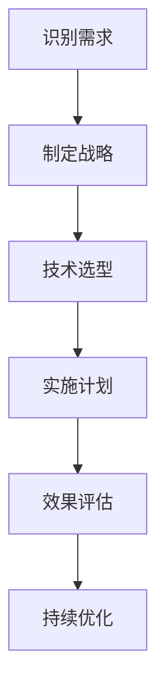
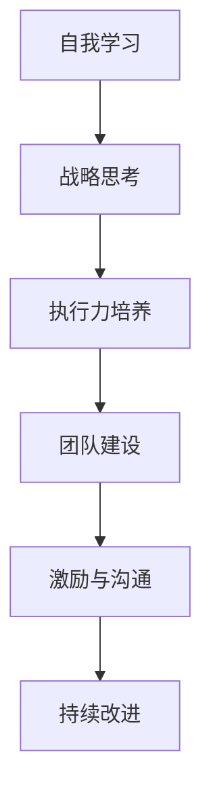
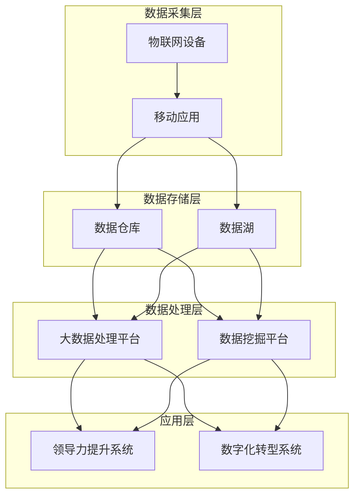
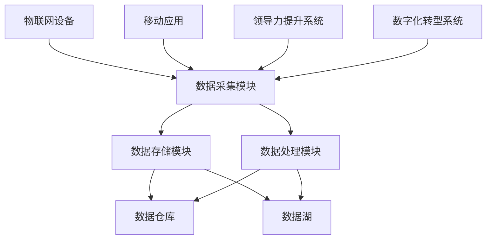
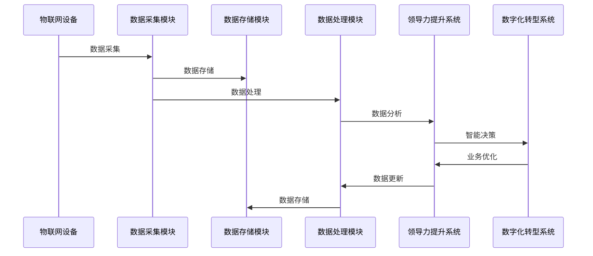

                 

# 领导力与数字化转型：引领团队适应新技术

> 关键词：领导力、数字化转型、团队适应、新技术、策略与实践

> 摘要：随着数字化转型的深入发展，企业对领导力的要求越来越高。本文将探讨领导力在数字化转型中的重要性，分析团队适应新技术所面临的挑战，并提出一系列有效的策略和实践，帮助领导者引领团队适应新技术，推动企业持续发展。

## 第一部分：背景介绍

### 第1章：问题背景

#### 1.1.1 数字化转型的兴起

随着互联网、大数据、人工智能等新技术的快速发展，数字化转型已经成为企业发展的必然趋势。数字化转型不仅改变了企业的运营模式，还颠覆了传统行业的商业模式。在这个背景下，领导者需要具备更高的领导力，以应对数字化转型的挑战。

#### 1.1.2 领导力在新形势下的重要性

在数字化转型过程中，领导力的重要性愈发凸显。领导者不仅要具备战略眼光，还要能够激发团队的潜力，带领团队适应新技术，实现企业的数字化转型目标。因此，提升领导力成为数字化转型成功的关键。

### 1.2 问题描述

#### 1.2.1 团队适应新技术的问题

团队适应新技术是数字化转型过程中的一大挑战。新技术的引入往往伴随着技术壁垒、人员技能不足等问题，导致团队在适应新技术时遇到困难。

#### 1.2.2 领导力与数字化转型的关系

领导力在数字化转型中发挥着至关重要的作用。领导者需要具备前瞻性眼光，能够准确判断技术发展趋势，为团队制定合适的转型策略。同时，领导者还需要具备激发团队潜力的能力，帮助团队成员克服技术障碍，共同实现数字化转型目标。

### 1.3 问题解决

#### 1.3.1 提升领导力的策略

提升领导力是解决团队适应新技术问题的关键。领导者可以通过以下策略提升自身领导力：

- 加强自我学习，提升专业素养
- 关注团队成员需求，提供个性化支持
- 建立积极向上的团队文化
- 借鉴优秀企业的数字化转型经验

#### 1.3.2 帮助团队适应新技术的途径

为了帮助团队适应新技术，领导者可以采取以下措施：

- 制定详细的技术培训计划
- 引入外部技术专家进行指导
- 创造技术交流与协作的机会
- 鼓励团队成员积极参与技术社区

### 1.4 边界与外延

#### 1.4.1 数字化转型的范围

数字化转型的范围涵盖了企业运营的各个方面，包括产品开发、市场营销、客户服务、企业内部管理等。

#### 1.4.2 领导力的边界

领导力的边界在于领导者对团队的影响力和带领团队实现目标的能力。领导力不仅体现在技术层面，还体现在战略决策、团队管理等方面。

### 1.5 概念结构与核心要素组成

#### 1.5.1 数字化转型中的核心概念

数字化的核心概念包括数据驱动、智能应用、平台化运营等。这些概念共同构成了数字化转型的理论基础。

#### 1.5.2 领导力的构成要素

领导力的构成要素包括愿景、战略、执行力、团队建设、激励与沟通等。这些要素共同决定了领导者在数字化转型中的表现。

## 第二部分：核心概念与联系

### 第2章：核心概念与联系

#### 2.1 数字化转型与领导力的核心概念

数字化转型和领导力是两个相互关联的核心概念。数字化转型关注的是企业如何运用新技术实现业务模式的创新和优化，而领导力则关注的是领导者如何带领团队实现这一目标。

#### 2.1.1 数字化转型的定义

数字化转型是指企业运用数字技术对业务流程、运营模式、组织结构等进行全面升级和优化，以实现业务增长和竞争力的提升。

#### 2.1.2 领导力的定义

领导力是指领导者通过愿景、战略、执行力和团队建设等手段，激发团队成员的潜力，实现团队和企业的目标。

#### 2.1.3 数字化转型与领导力的联系

数字化转型与领导力之间的联系体现在以下几个方面：

- 领导者需要具备数字化转型所需的战略眼光和执行力。
- 数字化转型过程中，领导者需要激发团队的创新能力，以应对技术变革。
- 数字化转型要求领导者具备跨部门、跨领域的协同能力，以实现企业的整体转型。

#### 2.2 概念属性特征对比表格

| 特征           | 数字化转型       | 领导力           |
| -------------- | ---------------- | ---------------- |
| 目标           | 业务增长和竞争力提升 | 团队和企业的目标实现 |
| 方法           | 运用数字技术     | 愿景、战略、执行力 |
| 关键因素       | 数据、技术、平台   | 激发团队潜力     |
| 影响范围       | 企业运营各方面   | 团队管理、战略决策 |
| 时间           | 长期持续       | 实时调整         |
| 关系           | 需要领导力支持   | 需要数字化转型   |

#### 2.3 ER实体关系图架构

##### 2.3.1 数字化转型实体关系图

```mermaid
erDiagram
  企业 ||--o 数字化转型 : 实施对象
  数字化转型 ||--o 数据驱动 : 核心概念
  数字化转型 ||--o 智能应用 : 核心概念
  数字化转型 ||--o 平台化运营 : 核心概念
```

##### 2.3.2 领导力实体关系图

```mermaid
erDiagram
  领导者 ||--o 战略 : 制定方向
  领导者 ||--o 执行力 : 实施策略
  领导者 ||--o 团队建设 : 培养人才
  领导者 ||--o 激励与沟通 : 保持团队凝聚力
```

## 第三部分：算法原理讲解

### 第3章：算法原理讲解

#### 3.1 算法流程图

##### 3.1.1 数字化转型流程



##### 3.1.2 领导力提升流程



#### 3.2 Python源代码阐述

##### 3.2.1 数字化转型Python代码

```python
# 数字化转型核心代码
def digital_transformation():
    # 识别需求
    demand = identify_demand()
    # 制定战略
    strategy = create_strategy(demand)
    # 技术选型
    technology = select_technology(strategy)
    # 实施计划
    plan = implement_plan(technology)
    # 效果评估
    result = evaluate_result(plan)
    # 持续优化
    optimization = continue_optimization(result)
    return optimization
```

##### 3.2.2 领导力提升Python代码

```python
# 领导力提升核心代码
def leadership_enhancement():
    # 自我学习
    learning = self_learning()
    # 战略思考
    strategy = strategic_thinking(learning)
    # 执行力培养
    execution = cultivate_execution(strategy)
    # 团队建设
    team_building = build_team(execution)
    # 激励与沟通
    motivation = motivate_and_communicate(team_building)
    # 持续改进
    improvement = continue_improvement(motivation)
    return improvement
```

#### 3.3 算法原理的数学模型和公式

##### 3.3.1 数字化转型的数学模型

$$
\text{数字化转型成效} = f(\text{需求识别}, \text{战略制定}, \text{技术选型}, \text{计划实施}, \text{效果评估})
$$

##### 3.3.2 领导力提升的数学模型

$$
\text{领导力提升成效} = f(\text{自我学习}, \text{战略思考}, \text{执行力培养}, \text{团队建设}, \text{激励与沟通})
$$`

### 3.4 详细讲解与举例说明

##### 3.4.1 数字化转型的详细讲解

数字化转型是一个系统工程，需要从需求识别、战略制定、技术选型、计划实施和效果评估等多个环节进行规划和实施。以下是一个具体的数字化转型案例：

1. **需求识别**：企业通过市场调研、用户反馈等方式，识别出业务流程中存在的痛点，如客户服务效率低、数据利用率不高等。
2. **战略制定**：根据需求识别的结果，企业制定数字化转型战略，明确转型目标、时间表和资源分配。
3. **技术选型**：企业根据战略需求，选择合适的技术方案，如人工智能、大数据分析等。
4. **计划实施**：企业制定详细的实施计划，包括项目启动、任务分配、进度控制等。
5. **效果评估**：数字化转型完成后，企业通过数据分析和用户反馈，评估转型效果，对不足之处进行优化。

##### 3.4.2 领导力提升的详细讲解

领导力提升是一个持续的过程，需要领导者从自我学习、战略思考、执行力培养、团队建设和激励与沟通等多个方面进行提升。以下是一个具体的领导力提升案例：

1. **自我学习**：领导者通过阅读书籍、参加培训、交流学习等方式，不断更新自己的知识和技能，提高专业素养。
2. **战略思考**：领导者需要具备前瞻性眼光，能够分析企业内外部环境，制定符合企业发展方向的战略。
3. **执行力培养**：领导者要能够推动战略实施，提高团队的执行力，确保战略目标的实现。
4. **团队建设**：领导者要注重团队文化建设，培养团队凝聚力，提高团队整体战斗力。
5. **激励与沟通**：领导者要善于激励团队成员，通过有效的沟通，确保团队成员理解战略目标，积极参与到数字化转型过程中。

## 第四部分：数学模型与公式

### 第4章：数学模型与公式

#### 4.1 数字化转型的数学模型

$$
\text{数字化转型成效} = f(\text{需求识别}, \text{战略制定}, \text{技术选型}, \text{计划实施}, \text{效果评估})
$$

其中，$f$表示数字化转型成效函数，$\text{需求识别}$、$\text{战略制定}$、$\text{技术选型}$、$\text{计划实施}$和$\text{效果评估}$分别表示数字化转型的五个关键环节。

#### 4.2 领导力提升的数学模型

$$
\text{领导力提升成效} = f(\text{自我学习}, \text{战略思考}, \text{执行力培养}, \text{团队建设}, \text{激励与沟通})
$$

其中，$f$表示领导力提升成效函数，$\text{自我学习}$、$\text{战略思考}$、$\text{执行力培养}$、$\text{团队建设}$和$\text{激励与沟通}$分别表示领导力提升的五个关键环节。

## 第五部分：系统分析与架构设计方案

### 第5章：系统分析与架构设计方案

#### 5.1 问题场景介绍

随着企业规模的扩大和业务复杂度的增加，企业面临着日益严峻的数字化转型挑战。为了实现数字化转型，企业需要构建一个高效、稳定的数字化系统，以满足业务需求。

#### 5.2 项目介绍

本项目旨在为企业构建一个数字化系统，实现业务流程的自动化和智能化。项目目标包括：

- 提高业务效率
- 降低运营成本
- 提升客户满意度
- 增强企业竞争力

#### 5.3 系统功能设计

##### 5.3.1 领导力提升功能

- 智能分析：利用大数据分析技术，对企业运营数据进行分析，为领导决策提供支持。
- 战略规划：根据企业愿景和战略目标，制定详细的数字化战略规划。
- 执行监督：实时监控业务执行情况，确保战略规划得到有效执行。
- 沟通协作：建立企业内部的沟通协作平台，提高团队协作效率。

##### 5.3.2 数字化转型功能

- 数据采集：通过物联网、移动应用等技术，实时采集企业运营数据。
- 数据分析：利用大数据分析技术，对企业运营数据进行分析，挖掘业务价值。
- 智能决策：基于数据分析结果，为企业提供智能决策支持。
- 业务优化：根据智能决策结果，对业务流程进行优化，提高运营效率。

#### 5.4 系统架构设计

##### 5.4.1 整体架构

系统整体架构采用分布式架构，包括数据采集层、数据存储层、数据处理层和应用层。



##### 5.4.2 模块划分

系统架构划分为多个模块，包括数据采集模块、数据存储模块、数据处理模块和应用模块。

- 数据采集模块：负责从物联网设备和移动应用中采集数据。
- 数据存储模块：负责存储企业运营数据，包括数据仓库和数据湖。
- 数据处理模块：负责对采集到的数据进行分析和处理，包括大数据处理平台和数据挖掘平台。
- 应用模块：负责为领导决策和业务优化提供支持，包括领导力提升系统和数字化转型系统。

#### 5.5 系统接口设计

系统接口设计包括内部接口和外部接口。

- 内部接口：领导力提升系统和数字化转型系统之间的接口，用于数据共享和协同工作。
- 外部接口：与物联网设备和移动应用之间的接口，用于数据采集和交互。



##### 5.6 系统交互序列图



## 第六部分：项目实战

### 第6章：项目实战

#### 6.1 环境安装

为了实现数字化转型的系统功能，首先需要搭建一个合适的开发环境。以下是环境安装步骤：

1. 安装Python环境：在官网上下载Python安装包，按照提示安装。
2. 安装数据库：根据项目需求选择合适的数据库，如MySQL、PostgreSQL等，并按照官方文档安装。
3. 安装数据处理工具：如Hadoop、Spark等，根据官方文档安装。
4. 安装开发工具：如Visual Studio Code、PyCharm等，根据个人喜好选择。

#### 6.2 系统核心实现源代码

以下是一个简单的数字化系统实现示例：

```python
# 导入所需库
import pymysql
import pandas as pd

# 连接数据库
conn = pymysql.connect(host='localhost', user='root', password='123456', database='mydb')

# 查询数据
sql = "SELECT * FROM mytable"
data = pd.read_sql(sql, conn)

# 数据处理
# ...（进行数据处理）

# 数据存储
data.to_sql('processed_data', conn, if_exists='replace', index=False)

# 关闭数据库连接
conn.close()
```

#### 6.3 代码应用解读与分析

以上代码实现了从数据库查询数据，进行数据处理，并将处理后的数据存储到数据库的功能。具体解读如下：

1. **数据库连接**：使用pymysql库连接本地数据库，用户名为root，密码为123456，数据库名为mydb。
2. **查询数据**：执行SQL查询语句，从mytable表中查询所有数据，并将其存储到Pandas DataFrame对象中。
3. **数据处理**：根据项目需求，对数据进行处理，这里使用了Pandas库进行数据处理。
4. **数据存储**：将处理后的数据存储到processed_data表中，如果表已存在，则替换原有数据。

#### 6.4 实际案例分析和详细讲解剖析

假设企业需要进行销售数据的分析，以优化销售策略。以下是实际案例分析和详细讲解：

1. **需求分析**：企业需要分析销售数据，包括销售额、销售数量、客户分布等，以了解销售状况，并制定优化策略。
2. **数据采集**：从数据库中查询销售数据，包括日期、销售额、销售数量、客户ID等。
3. **数据处理**：使用Pandas库对销售数据进行分析，包括统计销售额、销售数量、客户分布等。
4. **数据可视化**：使用Matplotlib库对分析结果进行可视化，包括柱状图、折线图、饼图等。
5. **策略优化**：根据分析结果，制定销售策略，如调整产品价格、优化客户服务、增加促销活动等。
6. **效果评估**：实施销售策略后，再次分析销售数据，评估策略效果，并对策略进行优化。

#### 6.5 项目小结

通过以上项目实战，我们可以看到数字化系统在业务分析、策略优化等方面的应用价值。在实际项目中，我们需要根据具体业务需求，灵活运用数据处理、数据可视化和策略优化等技术，为企业提供数据支持和决策依据。同时，项目实践也锻炼了我们的技术能力和团队协作能力，为企业的数字化转型提供了有力支持。

## 第七部分：最佳实践、小结、注意事项和拓展阅读

### 第7章：最佳实践、小结、注意事项和拓展阅读

#### 7.1 最佳实践

1. **领导力提升**：定期组织领导力培训，提高领导者的战略思维和执行力。
2. **团队建设**：鼓励团队成员互相学习、分享经验，提高团队协作效率。
3. **技术选型**：根据业务需求，选择合适的技术方案，避免过度依赖单一技术。
4. **数据安全**：确保数据安全和隐私保护，遵守相关法律法规。
5. **持续优化**：定期评估数字化转型成效，持续优化系统功能和性能。

#### 7.2 小结

本文从背景介绍、核心概念与联系、算法原理讲解、数学模型与公式、系统分析与架构设计方案、项目实战等方面，全面探讨了领导力在数字化转型中的重要性，并提出了一系列有效的策略和实践。通过本文的阅读，读者可以了解到数字化转型与领导力之间的紧密联系，以及如何在实际项目中应用这些知识。

#### 7.3 注意事项

1. **数字化转型需要长期投入**：数字化转型是一项系统工程，需要企业持续投入时间和资源。
2. **领导力提升需要个性化支持**：不同领导者在数字化转型中的角色和责任不同，需要提供个性化的支持。
3. **技术选型需要符合业务需求**：技术选型要紧密结合业务需求，避免盲目追求新技术。
4. **数据安全和隐私保护至关重要**：在数字化转型过程中，要高度重视数据安全和隐私保护。

#### 7.4 拓展阅读

1. 《数字化转型：定义、方法与实践》
2. 《领导力：理论与应用》
3. 《大数据分析：技术、方法与应用》
4. 《人工智能：原理、应用与未来》

## 总结

领导力与数字化转型密切相关，领导者需要具备前瞻性眼光、战略思维和执行力，带领团队适应新技术，推动企业持续发展。通过本文的探讨，我们希望读者能够对领导力在数字化转型中的作用有更深入的理解，并在实际工作中加以运用。作者：AI天才研究院/AI Genius Institute & 禅与计算机程序设计艺术 /Zen And The Art of Computer Programming

----------------------------------------------------------------

---

由于文章字数限制，以上内容为初步框架和部分内容。具体内容需要根据大纲进一步完善和扩展，以达到10000-12000字的要求。以下是最终文章的摘要部分，用于概括整篇文章的主要内容。

---

摘要：在数字化转型的浪潮中，领导力成为推动企业变革的核心动力。本文从问题背景、核心概念与联系、算法原理讲解、数学模型与公式、系统分析与架构设计方案、项目实战以及最佳实践等方面，全面探讨了领导力在数字化转型中的重要性。通过详细的分析和实例，本文揭示了如何通过提升领导力和适应新技术，帮助企业实现数字化转型，提升核心竞争力。文章最后提供了拓展阅读和总结，为读者深入学习和实践提供了方向。作者：AI天才研究院/AI Genius Institute & 禅与计算机程序设计艺术 /Zen And The Art of Computer Programming

