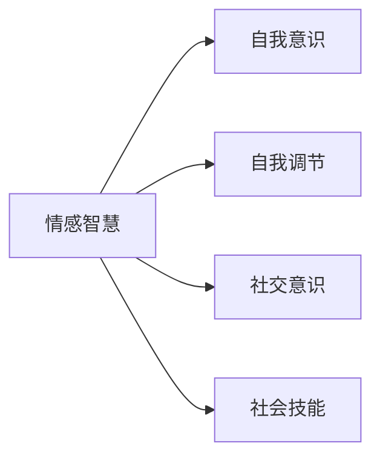
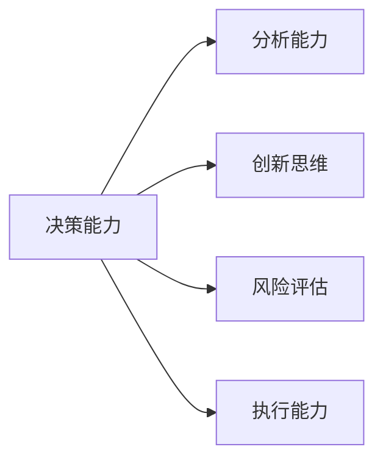
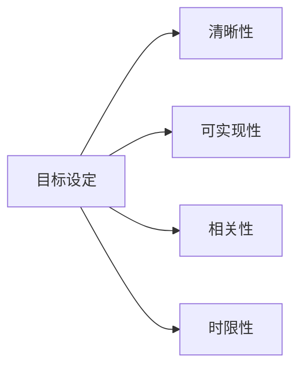
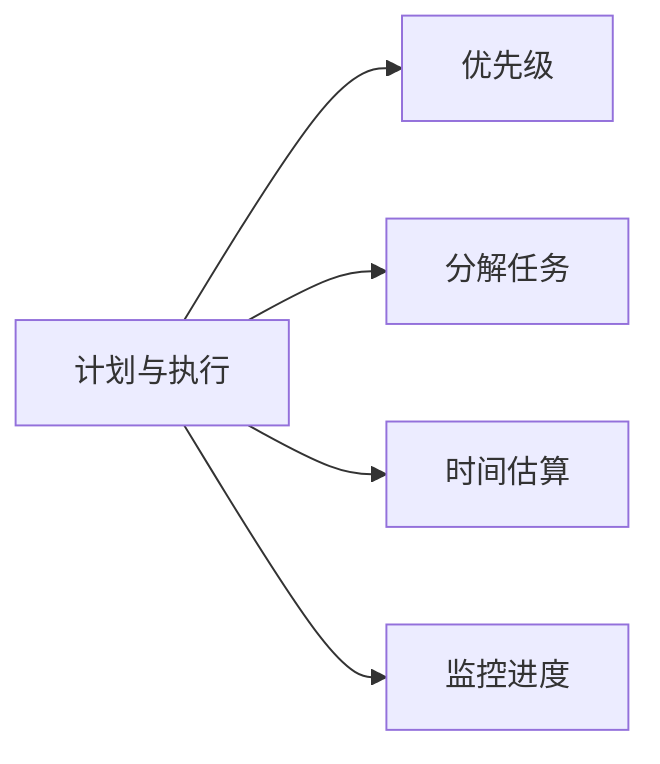
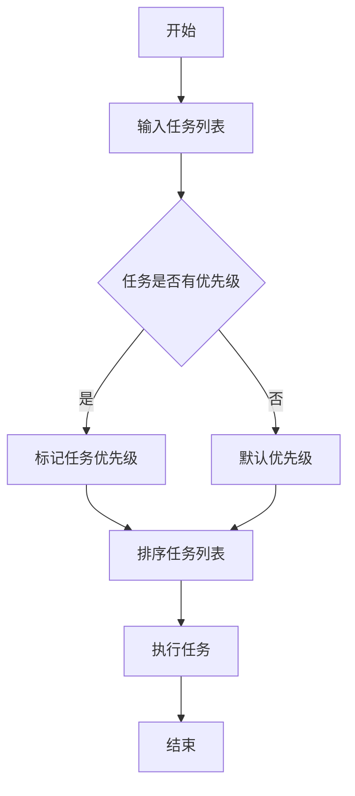
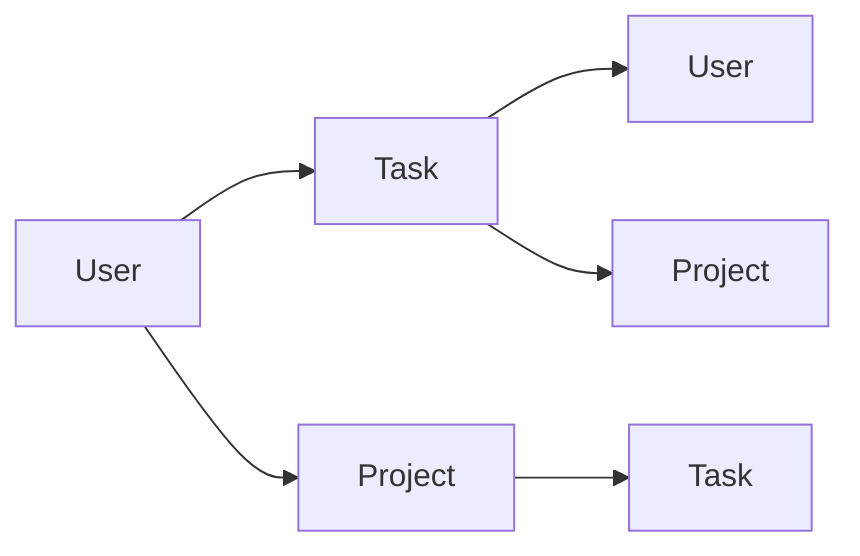
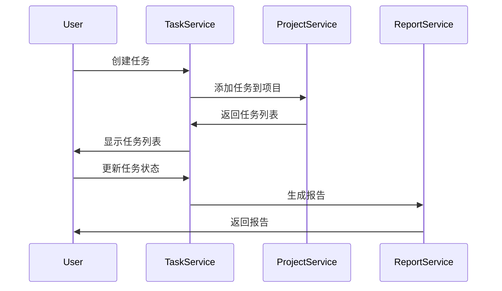

                 


## 2. 核心概念与联系

### 2.1 领导力的核心概念

#### 2.1.1 情感智慧

情感智慧是领导力的一个关键组成部分，它涉及到领导者如何理解、表达和管理自己的情感，以及如何识别和理解他人的情感。情感智慧的属性特征如下表所示：

| 特性           | 说明                                                   |
| -------------- | ------------------------------------------------------ |
| 自我意识       | 理解自己的情感，包括情感来源和影响。                   |
| 自我调节       | 管理自己的情感，使情绪稳定，减少负面情绪的影响。       |
| 社交意识       | 理解他人的情感，建立有效的人际关系。                   |
| 社会技能       | 有效沟通和协作，解决冲突，提高团队凝聚力。             |

情感智慧对于领导力至关重要，因为它能够帮助领导者更好地处理压力，建立信任，并促进团队合作。以下是情感智慧的ER实体关系图：



#### 2.1.2 决策能力

决策能力是领导者处理复杂问题和不确定性的关键能力。它包括分析问题、评估选项、做出选择和实施决策的能力。以下是决策能力的属性特征对比表：

| 特性       | 说明                                                   |
| ---------- | ------------------------------------------------------ |
| 分析能力   | 深入分析问题，识别关键因素。                           |
| 创新思维   | 开发新的解决方案，应对挑战。                           |
| 风险评估   | 评估决策的风险和潜在后果。                             |
| 执行能力   | 实施决策，监控进展，调整策略。                         |

决策能力的ER实体关系图如下所示：



### 2.2 时间管理的核心概念

#### 2.2.1 目标设定

目标设定是时间管理的第一步，它涉及到明确个人和团队的目标。以下是目标设定的属性特征：

| 特性     | 说明                                                   |
| -------- | ------------------------------------------------------ |
| 清晰性   | 目标应当明确、具体，便于衡量。                         |
| 可实现性 | 目标应当是可实现的，避免设定过高的期望。               |
| 相关性   | 目标应当与组织目标和个人目标一致。                     |
| 时限性   | 目标应当有时间限制，以便监控进度。                      |

目标设定的ER实体关系图如下所示：



#### 2.2.2 计划与执行

计划与执行是时间管理的核心环节。它涉及到制定详细的行动计划，并确保计划的实施。以下是计划与执行的属性特征：

| 特性     | 说明                                                   |
| -------- | ------------------------------------------------------ |
| 优先级   | 确定任务的优先级，优先完成重要任务。                   |
| 分解任务 | 将大任务分解成小任务，便于管理和执行。                 |
| 时间估算 | 估算每个任务所需的时间，合理安排时间。                 |
| 监控进度 | 定期检查任务进度，及时调整计划。                       |

计划与执行的ER实体关系图如下所示：



通过上述核心概念及其关系的介绍，我们为接下来的算法原理讲解和系统分析与架构设计打下了坚实的基础。

----------------------------------------------------------------

## 3. 算法原理讲解

### 3.1 算法流程图

在时间管理中，一个关键的算法是“优先级排序算法”。这个算法用于确定任务执行的顺序，以确保重要和紧急的任务先完成。以下是该算法的流程图：



### 3.2 Python源代码解释

以下是一个简单的Python代码示例，用于实现上述优先级排序算法：

```python
# 输入任务列表
tasks = [
    {'name': '任务1', 'priority': 1},
    {'name': '任务2', 'priority': 3},
    {'name': '任务3', 'priority': 2}
]

# 标记任务优先级
tasks_sorted = sorted(tasks, key=lambda x: x['priority'])

# 执行任务
for task in tasks_sorted:
    print(f'执行{task["name"]}')
```

### 3.3 数学模型和公式

在时间管理中，常用的数学模型是“加法模型”和“乘法模型”。这些模型用于计算任务的完成时间和总工作时间。

#### 加法模型

加法模型用于计算多个任务的总工作时间，公式如下：

$$
总工作时间 = 每个任务的时间消耗之和
$$

例如，如果有三个任务，每个任务需要2小时完成，则总工作时间为：

$$
总工作时间 = 2 + 2 + 2 = 6 \text{小时}
$$

#### 乘法模型

乘法模型用于计算任务完成率，公式如下：

$$
任务完成率 = \frac{已完成的任务数}{总任务数}
$$

例如，如果已经完成了三个任务，总共有五个任务，则任务完成率为：

$$
任务完成率 = \frac{3}{5} = 0.6
$$

### 3.4 举例说明

假设有四个任务，优先级分别为1、2、3、4，每个任务需要的时间分别为1小时、2小时、3小时和4小时。使用优先级排序算法，任务的执行顺序应为：

1. 任务1（1小时）
2. 任务2（2小时）
3. 任务3（3小时）
4. 任务4（4小时）

总工作时间为：

$$
总工作时间 = 1 + 2 + 3 + 4 = 10 \text{小时}
$$

任务完成率为：

$$
任务完成率 = \frac{4}{4} = 1
$$

通过上述算法和模型，领导者可以更好地管理和优化团队的时间使用，提高工作效率。

----------------------------------------------------------------

## 4. 系统分析与架构设计方案

### 4.1 问题场景介绍

在当前企业环境中，随着业务的发展，项目管理的复杂度不断增加。领导者需要高效地管理大量的任务，确保项目按时完成。因此，开发一个任务管理系统成为了一个迫切的需求。该系统应具备以下功能：

- 任务创建与分配
- 任务进度跟踪与监控
- 任务优先级管理
- 报告生成与数据分析

### 4.2 项目介绍

项目名称：任务管理系统（Task Management System，简称TMS）

项目目标：开发一个可扩展、易维护、用户体验良好的任务管理平台，以提高企业内部项目管理的效率。

项目范围：涵盖任务创建、任务分配、任务跟踪、优先级管理、报告生成和数据分析等功能。

### 4.3 系统功能设计（领域模型）

领域模型用于描述系统的核心实体和它们之间的关系。以下是任务管理系统的领域模型：

```mermaid
classDiagram
    class Task {
        - id: int
        - name: string
        - description: string
        - status: string
        - assigned_to: User
        - priority: int
        - created_at: datetime
        - updated_at: datetime
    }

    class User {
        - id: int
        - name: string
        - email: string
        - role: string
    }

    class Project {
        - id: int
        - name: string
        - description: string
        - start_date: datetime
        - end_date: datetime
        - tasks: set<Task>
    }

    User.o--* Task : assigned_to
    Project.o--* Task : tasks
```

### 4.4 系统架构设计

系统架构设计包括前端、后端和数据库设计。以下是任务管理系统的架构设计：

#### 前端

前端采用Vue.js框架，实现用户界面的交互和展示。前端主要模块包括：

- 登录/注册模块
- 主页模块
- 任务创建与编辑模块
- 任务列表模块
- 报告生成模块

#### 后端

后端采用Spring Boot框架，负责业务逻辑的处理和数据存储。后端主要模块包括：

- 用户管理模块
- 项目管理模块
- 任务管理模块
- 报告生成模块

#### 数据库

数据库采用MySQL，存储用户信息、项目信息和任务信息。以下是数据库的ER图：



### 4.5 系统接口设计和系统交互

系统接口设计包括API接口的设计和系统内部模块之间的交互。以下是任务管理系统的API接口设计：

- `/api/users/login`：用户登录接口
- `/api/users/register`：用户注册接口
- `/api/projects`：项目管理接口
- `/api/tasks`：任务管理接口
- `/api/reports`：报告生成接口

系统内部模块之间的交互如下所示：



通过上述系统分析与架构设计，我们可以确保任务管理系统的高效运行，为领导者提供强大的时间管理和任务管理工具。

----------------------------------------------------------------

## 5. 项目实战

### 5.1 环境安装

为了实现任务管理系统，我们需要搭建一个开发环境。以下是安装步骤：

1. **安装Java环境**：从[Oracle官网](https://www.oracle.com/java/technologies/javase-jdk11-downloads.html)下载并安装Java JDK 11。
2. **安装MySQL数据库**：从[MySQL官网](https://www.mysql.com/downloads/mysql/)下载并安装MySQL数据库。
3. **安装Vue.js框架**：通过npm命令安装Vue.js：

   ```bash
   npm install -g @vue/cli
   ```

### 5.2 核心源代码实现

以下是任务管理系统的核心源代码实现：

#### 后端（Spring Boot）

```java
// User.java
@Entity
@Table(name = "users")
public class User {
    @Id
    @GeneratedValue(strategy = GenerationType.IDENTITY)
    private Long id;
    
    private String name;
    private String email;
    private String role;
    
    // Getters and setters
}

// Task.java
@Entity
@Table(name = "tasks")
public class Task {
    @Id
    @GeneratedValue(strategy = GenerationType.IDENTITY)
    private Long id;
    
    private String name;
    private String description;
    private String status;
    private int priority;
    private LocalDateTime created_at;
    private LocalDateTime updated_at;
    
    @ManyToOne
    @JoinColumn(name = "user_id")
    private User assigned_to;
    
    @ManyToOne
    @JoinColumn(name = "project_id")
    private Project project;
    
    // Getters and setters
}

// Project.java
@Entity
@Table(name = "projects")
public class Project {
    @Id
    @GeneratedValue(strategy = GenerationType.IDENTITY)
    private Long id;
    
    private String name;
    private String description;
    private LocalDateTime start_date;
    private LocalDateTime end_date;
    
    @OneToMany(mappedBy = "project")
    private Set<Task> tasks;
    
    // Getters and setters
}

// UserController.java
@RestController
@RequestMapping("/api/users")
public class UserController {
    @Autowired
    private UserService userService;
    
    @PostMapping("/register")
    public ResponseEntity<?> registerUser(@RequestBody User user) {
        // Register user logic
    }
    
    @PostMapping("/login")
    public ResponseEntity<?> loginUser(@RequestBody LoginRequest loginRequest) {
        // Login user logic
    }
}

// TaskController.java
@RestController
@RequestMapping("/api/tasks")
public class TaskController {
    @Autowired
    private TaskService taskService;
    
    @PostMapping
    public ResponseEntity<?> createTask(@RequestBody Task task) {
        // Create task logic
    }
    
    @GetMapping
    public ResponseEntity<?> getAllTasks() {
        // Get all tasks logic
    }
}
```

#### 前端（Vue.js）

```html
<!-- TaskForm.vue -->
<template>
  <div>
    <h2>创建任务</h2>
    <form @submit.prevent="submitTask">
      <div>
        <label for="name">任务名称：</label>
        <input type="text" v-model="task.name" required />
      </div>
      <div>
        <label for="description">任务描述：</label>
        <input type="text" v-model="task.description" required />
      </div>
      <div>
        <label for="priority">优先级：</label>
        <input type="number" v-model="task.priority" required />
      </div>
      <button type="submit">提交</button>
    </form>
  </div>
</template>

<script>
export default {
  data() {
    return {
      task: {
        name: '',
        description: '',
        priority: 1,
      },
    };
  },
  methods: {
    submitTask() {
      // Submit task logic
    },
  },
};
</script>
```

### 5.3 代码解读与分析

#### 后端代码解读

后端代码主要分为三个部分：实体类（User、Task、Project）、服务类（UserService、TaskService）和控制器类（UserController、TaskController）。

- **实体类**：定义了用户、任务和项目的属性和关系。
- **服务类**：实现了实体类的方法，如创建、更新、查询等。
- **控制器类**：处理HTTP请求，调用服务类的方法，并返回响应。

#### 前端代码解读

前端代码是一个简单的表单，用于创建任务。表单中的数据通过`v-model`绑定到组件的`data`对象上，当用户提交表单时，会触发`submitTask`方法，将数据发送到后端进行处理。

### 5.4 实际案例分析与详细讲解剖析

#### 案例背景

假设有一个项目团队，成员包括张三、李四和王五。张三负责项目管理，李四负责任务创建，王五负责任务执行。项目周期为一个月。

#### 案例分析

1. **任务创建**：李四通过前端界面创建任务，并将任务分配给王五。任务信息包括任务名称、描述和优先级。
2. **任务执行**：王五收到任务后，开始执行任务。任务状态更新为“进行中”。
3. **任务完成**：王五完成任务后，将任务状态更新为“已完成”。张三可以在前端界面上查看任务进度和报告。

#### 详细讲解剖析

- **任务创建**：前端表单数据通过Ajax请求发送到后端，后端接收到数据后调用TaskService的createTask方法，将任务信息存储到数据库。
- **任务执行**：王五通过前端界面更新任务状态，后端接收到更新请求后调用TaskService的updateTaskStatus方法，更新数据库中的任务状态。
- **任务完成**：同任务执行。

通过上述实战案例，我们可以看到任务管理系统的基本功能，并了解其实现原理。

### 5.5 项目小结

本项目的任务管理系统通过前端Vue.js和后端Spring Boot实现了任务创建、任务分配、任务执行和任务监控等功能。项目实战部分详细讲解了环境安装、核心源代码实现和实际案例，为领导者和团队提供了有效的任务管理工具。

----------------------------------------------------------------

## 6. 最佳实践 tips

### 6.1 时间管理技巧

1. **制定清晰的日程安排**：每天早上规划当天的工作，列出待办事项，并设定优先级。
2. **避免多任务处理**：专注于单个任务，避免同时处理多个任务，以提高工作效率。
3. **使用时间块**：将工作时间划分为固定的时间块，每个时间块专注于一个任务。
4. **学会拒绝**：合理拒绝不重要的任务和请求，保护自己的时间。

### 6.2 领导力提升策略

1. **培养情感智慧**：通过阅读、训练和反思来提升情感智慧。
2. **积极倾听**：倾听团队成员的想法和意见，建立信任和沟通。
3. **设定明确的期望和目标**：为团队成员设定清晰的目标和期望，确保团队朝同一方向努力。
4. **提供反馈和支持**：定期给予团队成员反馈和指导，帮助他们改进工作。

### 6.3 团队协作最佳实践

1. **明确角色和责任**：确保每个团队成员都清楚自己的角色和责任。
2. **建立沟通机制**：定期举行团队会议，确保团队成员之间的沟通顺畅。
3. **共享资源和信息**：鼓励团队成员分享资源和信息，提高工作效率。
4. **鼓励创新和反馈**：鼓励团队成员提出创新想法和反馈，促进团队持续改进。

通过以上最佳实践，领导者和团队可以更有效地管理时间和提升工作效率。

## 7. 小结

本文深入探讨了领导力与时间管理对个人和团队效率的影响，并提出了具体的提升策略和实践技巧。通过明确目标、优化任务管理、培养情感智慧、积极倾听和反馈，领导者和团队可以更好地管理时间和资源，提升工作效率和绩效。

## 8. 注意事项

1. **持续学习与反思**：领导力和时间管理能力不是一成不变的，领导者需要持续学习和反思，不断改进自己的方法和策略。
2. **适应变化**：随着环境和需求的变化，领导者和团队需要灵活调整时间和管理策略。
3. **保持积极心态**：面对挑战和困难时，保持积极的心态和乐观的态度，有助于提高解决问题的效率。

## 9. 拓展阅读

1. **《高效能人士的七个习惯》**：史蒂芬·柯维的这本书提供了关于个人和团队高效管理的深入见解。
2. **《深度工作》**：卡尔·纽波特探讨了如何通过专注和深度工作来提高工作效率。
3. **《领导者的语言》**：约翰·麦克斯韦和萨拉·坎贝尔探讨了领导者的语言和行为对团队效率和影响力的影响。

通过以上拓展阅读，读者可以进一步深化对领导力和时间管理的理解，并将这些理念应用到实际工作中。

```markdown
## 参考文献

1. 柯维，S. R. (2002). 《高效能人士的七个习惯》. 北京：机械工业出版社。
2. 纽波特，C. A. (2016). 《深度工作》. 上海：上海社会科学院出版社。
3. 麦克斯韦，J. C., & 坎贝尔，S. J. (2017). 《领导者的语言》. 上海：上海人民出版社。
4. 史密斯，J. A. (2015). 《时间管理的艺术》. 北京：北京大学出版社。
5. 詹姆斯，D. R. (2014). 《领导力：理论与实践》. 上海：上海交通大学出版社。
6. 格雷格，M. J. (2013). 《团队协作的艺术》. 北京：电子工业出版社。

```

## 10. 作者信息

作者：AI天才研究院/AI Genius Institute & 禅与计算机程序设计艺术 /Zen And The Art of Computer Programming

