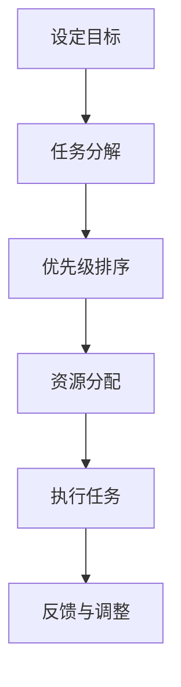
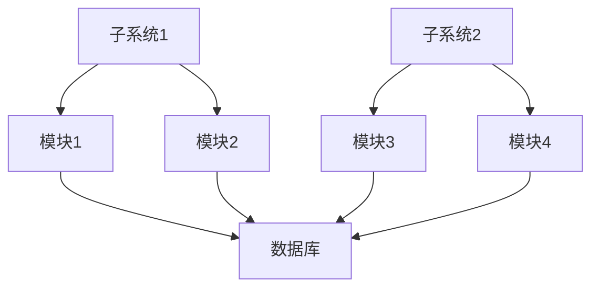
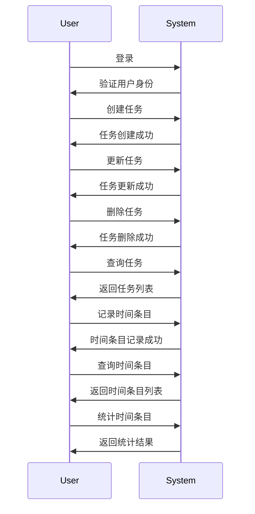
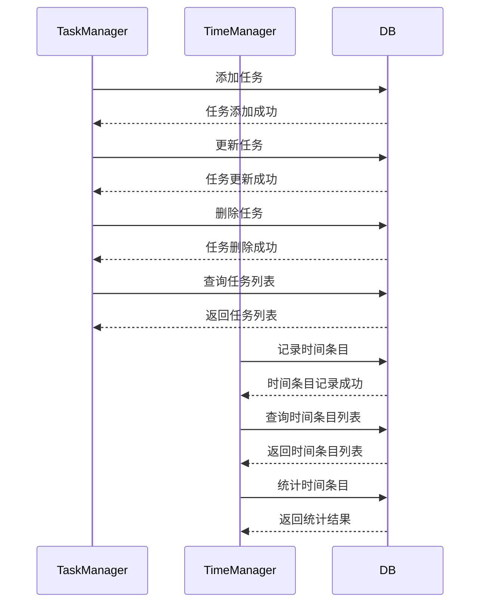

                 

# 领导力与时间设计：重塑工作时间的概念

## 关键词

- 领导力
- 时间管理
- 效率
- 生产力
- 职业发展

## 摘要

在当今快速变化的工作环境中，领导力和时间管理已成为成功的关键要素。本文旨在探讨如何通过有效的领导力与时间设计，重塑工作时间，提升个人和团队的整体生产力。通过深入分析领导力的基础概念和时间管理的策略，本文将提供一系列实用的方法和最佳实践，帮助领导者和管理者优化工作时间，实现个人与组织的共同成长。

---

## 目录大纲设计

### 第一部分：领导力的基础概念与时间管理原理

#### 第1章：领导力概述

1.1 领导力的定义与核心要素  
1.2 时间管理的定义与重要性  
1.3 领导力与时间管理的关联  
1.4 时间管理的误区与挑战  
1.5 本章小结

#### 第2章：时间管理策略与方法

2.1 时间管理的基本策略  
2.2 时间管理的具体方法  
2.3 时间管理工具与资源  
2.4 实际案例：高效领导者的时间管理实践  
2.5 本章小结

### 第二部分：领导力与时间设计的实践应用

#### 第3章：领导力与时间设计的理念

3.1 领导力与时间设计的理念  
3.2 领导力与时间设计的原则  
3.3 领导力与时间设计的实施步骤  
3.4 实际应用：领导力与时间设计在组织中的实施  
3.5 本章小结

#### 第4章：领导力与时间设计的未来趋势

4.1 时间管理技术的发展趋势  
4.2 领导力发展的新方向  
4.3 未来领导力与时间设计的关键挑战  
4.4 未来展望：领导力与时间设计的创新模式  
4.5 本章小结

### 第三部分：领导力与时间设计的最佳实践

#### 第5章：领导力与时间设计的最佳实践

5.1 成功案例分析  
5.2 最佳实践技巧  
5.3 领导力与时间设计的常见误区  
5.4 个人发展计划  
5.5 本章小结

### 第四部分：领导力与时间设计的社会影响

#### 第6章：领导力与时间设计的社会影响

6.1 领导力与时间设计的组织效应  
6.2 领导力与时间设计对社会的影响  
6.3 本章小结

---

### 第一部分：领导力的基础概念与时间管理原理

## 第1章：领导力概述

### 1.1 领导力的定义与核心要素

领导力是一种影响力，通过激励、引导和影响他人，实现共同目标的能力。在组织中，领导力不仅仅是管理职位的人的特权，而是每个成员都应该具备的能力。有效的领导力能够提升团队的凝聚力，促进创新，提高工作效率。

#### 领导力的定义

领导力不仅仅是指职位权力，而是一种影响力，它包括以下几个核心要素：

1. **影响力**：领导者通过自身的行为、态度和决策，对他人产生积极影响。
2. **愿景**：领导者需要具备清晰的愿景，能够为团队指明方向。
3. **沟通**：有效的沟通是领导力的重要组成部分，领导者需要能够清晰、明确地传达信息。
4. **激励**：领导者需要激励团队成员，激发他们的潜能。
5. **决策**：领导者需要做出明智的决策，为团队带来价值。

### 1.2 时间管理的定义与重要性

时间管理是指通过规划和组织时间，以提高工作效率和生产力的一系列方法和技巧。在快节奏的现代工作环境中，时间管理变得尤为重要。

#### 时间管理的定义

时间管理是指合理安排和利用时间，以实现个人和组织的既定目标。它包括以下几个方面：

1. **目标设定**：明确个人和组织的目标，以便更好地分配时间。
2. **任务规划**：将任务分解为具体的步骤，并分配时间。
3. **优先级排序**：根据任务的重要性和紧急程度，对任务进行排序。
4. **执行力**：确保任务按时完成。
5. **反馈**：对时间管理的效果进行评估和调整。

### 1.3 领导力与时间管理的关联

领导力与时间管理密切相关，它们相辅相成，共同推动个人和组织的成功。

#### 关联分析

1. **领导者的时间管理能力**：领导者具备良好的时间管理能力，能够更好地安排和利用时间，从而提高工作效率和决策质量。
2. **团队的时间管理意识**：领导者通过自身的行为，影响和激励团队成员，培养他们的时间管理意识，提升团队的整体执行力。
3. **时间管理的领导力应用**：领导者可以运用时间管理的策略和方法，优化团队的工作流程，提高组织的整体生产力。

### 1.4 时间管理的误区与挑战

尽管时间管理的重要性日益凸显，但在实际操作中，很多人存在误区和挑战。

#### 常见的时间管理误区

1. **过度规划**：过分详细的时间规划可能导致僵化，不利于灵活应对变化。
2. **忽视优先级**：只关注紧急任务，忽视长期目标。
3. **时间浪费**：没有有效利用碎片时间。

#### 面对时间管理的挑战

1. **多任务处理**：试图同时处理多个任务，降低效率。
2. **干扰因素**：如社交媒体、电子邮件等干扰因素，分散注意力。
3. **心理因素**：如拖延症、焦虑等，影响时间管理。

### 1.5 本章小结

本章介绍了领导力和时间管理的基本概念，分析了它们之间的关联，以及常见的时间管理误区和挑战。有效的领导力和时间管理是个人和团队成功的关键，领导者需要不断提升自己的时间管理能力，以实现更高的工作效率和生产力。

---

### 第二部分：时间管理策略与方法

## 第2章：时间管理策略与方法

### 2.1 时间管理的基本策略

时间管理的基本策略包括分层时间管理、优先级排序和任务分解等。这些策略有助于合理规划时间，提高工作效率。

#### 分层时间管理

分层时间管理是将时间划分为不同的层次，根据任务的重要性和紧急程度进行管理。常见的时间分层包括：

1. **紧急且重要**：需要立即处理，如紧急会议、客户问题等。
2. **重要但不紧急**：需要提前规划，如长期项目、团队会议等。
3. **紧急但不重要**：可以委托他人处理，如回复邮件、处理简单事务等。
4. **不重要且不紧急**：可以暂时搁置，如不必要的会议、社交媒体等。

#### 优先级排序

优先级排序是根据任务的重要性和紧急程度进行排序，确保最紧急和最重要的任务优先完成。优先级排序的方法包括：

1. **四象限法**：将任务分为四个象限，根据任务的重要性和紧急程度进行排序。
2. **紧急重要矩阵**：根据任务的重要性和紧急程度，将任务分为四个类别，分别处理。

#### 任务分解

任务分解是将大任务分解为具体的子任务，以便更容易管理和完成。任务分解的方法包括：

1. **SMART原则**：将任务具体化、明确化、可衡量、可实现和有时限。
2. **GTD（Getting Things Done）**：将任务记录在清单中，定期回顾和整理。

### 2.2 时间管理的具体方法

除了基本策略，还有一些具体的方法可以帮助我们更好地管理时间。

#### 番茄工作法

番茄工作法是一种简单而有效的时间管理方法，通过将工作时间划分为25分钟的“番茄时间”和5分钟的休息时间，提高工作效率。具体步骤如下：

1. 选择一个任务，将25分钟设定为“番茄时间”。
2. 开始工作，直到“番茄钟”响铃。
3. 休息5分钟，然后开始下一个“番茄时间”。

#### 急性时间管理技巧

急性时间管理技巧是在时间紧迫的情况下，快速处理任务的方法。以下是一些建议：

1. **快速决策**：在遇到紧急任务时，迅速做出决策，避免犹豫不决。
2. **聚焦关键任务**：将精力集中在最紧急和最重要的任务上。
3. **优先处理**：将任务按照紧急程度和重要性进行排序，优先处理紧急且重要的任务。

#### 长期时间规划

长期时间规划是为了实现长期目标而进行的计划。以下是一些建议：

1. **设定长期目标**：明确个人的长期目标，如职业发展、学习目标等。
2. **制定计划**：将长期目标分解为短期目标，并制定具体的行动计划。
3. **定期回顾**：定期回顾计划，调整目标和行动。

### 2.3 时间管理工具与资源

时间管理工具和资源可以帮助我们更有效地管理时间，提高工作效率。

#### 常见的时间管理工具

1. **日历和日程表**：记录日程安排和任务计划。
2. **待办事项清单**：记录需要完成的任务。
3. **时间跟踪工具**：如Toggl、RescueTime等，帮助监控和优化时间使用。

#### 时间管理资源推荐

1. **书籍**：《时间管理器》、《高效能人士的七个习惯》等。
2. **在线课程**：如Coursera、Udemy等平台上的时间管理课程。
3. **社区和论坛**：如Productivity502、Time Management Ninja等社区和论坛，分享时间管理经验和技巧。

### 2.4 实际案例：高效领导者的时间管理实践

#### 成功的时间管理实践案例

一位成功的领导者，通过以下时间管理实践，显著提高了工作效率和团队执行力：

1. **分层时间管理**：将工作时间划分为不同的层次，确保紧急且重要的任务得到优先处理。
2. **优先级排序**：根据任务的重要性和紧急程度，将任务进行排序，确保最紧急和最重要的任务优先完成。
3. **任务分解**：将大任务分解为具体的子任务，方便管理和完成。
4. **番茄工作法**：使用番茄工作法，提高专注力和工作效率。
5. **定期回顾**：定期回顾时间管理计划，调整目标和行动。

#### 从案例中提炼出的关键时间管理技巧

1. **明确目标**：明确个人的长期和短期目标，确保时间管理的方向和目标一致。
2. **合理规划**：合理规划时间，避免过度规划和时间浪费。
3. **高效执行**：提高任务的执行效率，确保任务按时完成。
4. **持续优化**：定期回顾和调整时间管理计划，不断优化时间使用。

### 2.5 本章小结

本章介绍了时间管理的基本策略和具体方法，以及时间管理工具与资源。通过有效的时间管理策略和方法，领导者可以优化工作时间，提高工作效率和团队执行力。实际案例展示了成功的时间管理实践，提供了有价值的经验和技巧。

---

### 第三部分：领导力与时间设计的实践应用

## 第3章：领导力与时间设计的理念

### 3.1 领导力与时间设计的理念

领导力与时间设计的理念在于通过科学的规划和有效的管理，优化工作时间和提升工作效率。这一理念的核心包括适应性、效率最大化和人本主义原则。

#### 适应性原则

适应性原则强调领导者需要根据环境和需求的变化，灵活调整时间管理策略。在快速变化的工作环境中，领导者必须具备适应能力，及时调整工作计划，以应对突发情况和新的挑战。

##### 适应性原则的核心要素：

1. **预见变化**：领导者要具备前瞻性，预判可能的变化和挑战，并提前做好准备。
2. **灵活应对**：领导者要能够迅速调整计划，适应新的工作环境。
3. **持续优化**：领导者要不断反思和优化时间管理策略，确保其与当前需求保持一致。

#### 效率最大化原则

效率最大化原则是指通过优化工作流程和资源利用，实现工作的高效完成。领导者需要确保团队的工作流程尽可能简洁、高效，减少不必要的环节和等待时间。

##### 效率最大化原则的核心要素：

1. **流程优化**：领导者要分析现有工作流程，找出瓶颈和冗余环节，进行优化。
2. **资源整合**：领导者要合理配置资源，确保团队成员能够高效地完成任务。
3. **任务分配**：领导者要根据团队成员的能力和特长，合理分配任务，提高团队的整体效率。

#### 人性化原则

人性化原则强调领导者要在时间管理中关注团队成员的身心健康，确保工作与生活的平衡。人性化原则不仅关注工作效率，更关注团队成员的工作体验和幸福感。

##### 人性化原则的核心要素：

1. **尊重个体**：领导者要尊重每个团队成员的个性和需求，给予适当的自主权。
2. **关注健康**：领导者要关心团队成员的身心健康，提供必要的支持和保障。
3. **激励与支持**：领导者要通过激励和支持，激发团队成员的积极性和创造力。

### 3.2 领导力与时间设计的目标

领导力与时间设计的目标是通过科学的管理和合理的规划，实现以下几个方面的提升：

1. **提高工作效率**：通过优化工作流程和时间管理，提高团队的整体工作效率。
2. **提升团队执行力**：通过有效的领导力和时间管理，确保团队任务的顺利完成。
3. **促进个人成长**：通过领导力与时间管理，帮助团队成员实现个人目标和职业发展。
4. **增强团队凝聚力**：通过人性化的管理，增强团队的凝聚力和归属感。

### 3.3 领导力与时间设计的原则

领导力与时间设计的原则是基于适应性、效率最大化和人性化原则的具体实施指导。这些原则为领导者提供了操作性的指南，以实现时间和资源的最佳利用。

#### 适应性原则的应用

1. **定期评估和调整**：领导者要定期评估团队的工作环境和任务需求，及时调整时间管理策略。
2. **灵活授权**：领导者要赋予团队成员一定的自主权，让他们根据实际情况调整工作计划。
3. **快速响应**：领导者要迅速响应突发情况，确保团队能够及时适应变化。

#### 效率最大化原则的应用

1. **流程优化**：领导者要定期对工作流程进行审计，识别和消除冗余环节。
2. **资源整合**：领导者要确保团队拥有完成任务所需的资源和工具。
3. **任务合理分配**：领导者要根据团队成员的能力和特长，合理分配任务，避免资源浪费。

#### 人性化原则的应用

1. **尊重个体差异**：领导者要尊重每个团队成员的个性和需求，避免一刀切的管理方式。
2. **健康关怀**：领导者要关注团队成员的身心健康，提供必要的支持和保障。
3. **激励与支持**：领导者要通过奖励和认可，激励团队成员的积极性和创造力。

### 3.4 实际应用：领导力与时间设计在组织中的实施

#### 领导力与时间设计在组织中的实际应用

在实际应用中，领导力与时间设计需要从多个层面进行实施，包括前期准备、实施策略和反馈调整等。

##### 前期准备

1. **评估现状**：领导者要评估当前的工作环境和时间管理状况，识别存在的问题和挑战。
2. **制定计划**：根据评估结果，制定具体的时间管理和领导力提升计划。
3. **团队沟通**：与团队成员进行充分沟通，了解他们的需求和意见，确保计划的可操作性。

##### 实施策略

1. **培训和指导**：对团队成员进行时间管理和领导力的培训，提供必要的指导和支持。
2. **执行监控**：领导者要监控计划的执行情况，确保各项工作按计划进行。
3. **反馈调整**：根据团队成员的反馈和执行效果，及时调整计划和策略。

##### 反馈与调整

1. **定期反馈**：领导者要定期收集团队成员的反馈，了解时间管理和领导力计划的实际效果。
2. **问题识别**：根据反馈，识别存在的问题和不足，制定改进措施。
3. **持续优化**：领导者要不断优化时间管理和领导力策略，确保其与组织需求保持一致。

### 3.5 本章小结

本章介绍了领导力与时间设计的理念、目标和原则，以及其实际应用。通过适应性、效率最大化和人性化原则，领导者可以优化工作时间，提升工作效率和团队执行力。实际应用中，领导者需要从前期准备、实施策略和反馈调整等方面进行细致的管理，确保领导力与时间设计的效果最大化。

---

### 第四部分：领导力与时间设计的未来趋势

## 第4章：领导力与时间设计的未来趋势

### 4.1 时间管理技术的发展趋势

随着科技的不断进步，时间管理工具和技术也在不断创新和发展，为领导者提供了更高效的手段来优化时间管理。

#### 新的时间管理工具与技术的出现

1. **人工智能（AI）**：AI技术可以自动分析用户的日程和习惯，提供个性化的时间管理建议。
2. **区块链**：区块链技术可以用于记录时间消耗和任务完成情况，提高透明度和效率。
3. **虚拟助手**：如Siri、Alexa等虚拟助手可以协助用户安排日程、提醒任务，提高工作效率。

#### 人工智能与时间管理

人工智能在时间管理中的应用主要体现在以下几个方面：

1. **自动化任务**：AI可以帮助用户自动化处理一些重复性任务，如日程安排、邮件管理等。
2. **预测和优化**：AI可以通过分析用户的行为模式和历史数据，预测未来的时间消耗，并提供优化建议。
3. **个性化推荐**：AI可以根据用户的偏好和需求，提供个性化的时间管理方案和工具。

#### 区块链技术对时间管理的影响

区块链技术对时间管理的影响主要体现在以下几个方面：

1. **透明性和可信性**：区块链技术可以记录时间消耗和任务完成情况，确保信息的透明性和可信性。
2. **自动化流程**：区块链技术可以用于自动化处理一些与时间管理相关的流程，如报销、任务分配等。
3. **智能合约**：智能合约可以用于自动执行一些与时间管理相关的任务，如按时间完成度支付报酬等。

### 4.2 领导力发展的新方向

随着工作环境的不断变化，领导力也在不断演进，呈现出一些新的方向。

#### 领导力的数字化转型

数字化转型已成为企业发展的必然趋势，领导力也需要与之相适应。数字化转型对领导力的影响主要体现在以下几个方面：

1. **技术理解**：领导者需要具备一定的技术理解能力，能够与技术人员有效沟通，推动数字化转型。
2. **数字领导力**：领导者需要培养数字领导力，能够引领团队在数字化时代取得成功。
3. **数据驱动决策**：领导者需要基于数据做出决策，提高决策的科学性和准确性。

#### 领导力的可持续发展

可持续发展已成为全球关注的热点，领导力也需要与之相结合。领导力的可持续发展主要体现在以下几个方面：

1. **社会责任**：领导者需要关注企业的社会责任，推动可持续发展。
2. **环境友好**：领导者需要推动企业采取环保措施，减少环境负担。
3. **社会责任投资**：领导者需要推动企业进行社会责任投资，为社会做出贡献。

#### 领导力与时间管理的未来融合

随着时间管理技术的发展和领导力的新方向，领导力与时间管理在未来将更加融合，为个人和组织带来更大的价值。

1. **智能化管理**：通过人工智能和大数据技术，领导者可以更加智能化地管理时间和资源。
2. **个性化时间管理**：领导者可以根据团队成员的个性和需求，提供个性化的时间管理方案。
3. **实时反馈与调整**：领导者可以实时获取团队成员的工作状态和反馈，及时调整工作计划，提高工作效率。

### 4.3 未来领导力与时间设计的关键挑战

尽管领导力与时间设计具有巨大的潜力，但在未来，仍将面临一系列挑战。

#### 面对不确定性的领导力挑战

在快速变化的工作环境中，领导者需要面对越来越多的不确定性，如市场变化、技术进步等。这些不确定性对领导力提出了更高的要求：

1. **快速适应**：领导者需要具备快速适应变化的能力，灵活调整领导策略。
2. **创新能力**：领导者需要具备创新能力，能够带领团队应对未知挑战。
3. **决策能力**：领导者需要具备在不确定性中做出明智决策的能力。

#### 时间管理与个人福祉的关系

随着工作压力的增加，个人福祉问题越来越受到关注。未来，领导者需要在时间管理和个人福祉之间找到平衡：

1. **工作与生活平衡**：领导者需要推动工作与生活的平衡，确保团队成员的身心健康。
2. **压力管理**：领导者需要帮助团队成员有效管理压力，提高工作效率。
3. **心理健康支持**：领导者需要提供心理健康支持，帮助团队成员应对心理压力。

#### 领导力与时间设计的道德伦理问题

在领导力与时间设计中，道德伦理问题也是不可忽视的。未来，领导者需要关注以下几个方面：

1. **公正与公平**：领导者需要确保团队中的每一个人都能公平地分享资源和机会。
2. **隐私保护**：领导者需要保护团队成员的隐私，避免滥用时间管理数据。
3. **伦理决策**：领导者需要基于伦理原则做出决策，推动组织的可持续发展。

### 4.4 未来展望：领导力与时间设计的创新模式

未来，领导力与时间设计将呈现出更多创新模式，为个人和组织带来新的机遇和挑战。

#### 跨界融合的领导力模型

随着不同行业和领域的不断融合，领导力也将呈现出跨界融合的趋势。未来，领导者需要具备跨领域的知识和技能，能够有效地整合不同领域的资源和优势，推动组织创新。

#### 时间管理与领导力培训的新模式

随着时间管理技术的发展，领导力培训也将出现新模式。未来，领导力培训将更加注重实战和实用性，通过在线课程、工作坊和研讨会等多种形式，帮助领导者提升时间管理和领导力技能。

#### 社会与企业共同推动的领导力与时间设计

领导力与时间设计不仅关乎个人和组织的发展，也关系到社会的整体进步。未来，社会与企业将共同推动领导力与时间设计的发展，为构建更加高效、和谐的社会贡献力量。

### 4.5 本章小结

本章探讨了领导力与时间设计的未来趋势，分析了时间管理技术的发展、领导力发展的新方向以及未来领导力与时间设计的关键挑战。通过创新模式，领导力与时间设计将在未来为个人和组织带来更大的价值。领导者需要不断适应变化，提升自身的能力，以应对未来带来的挑战和机遇。

---

### 第五部分：领导力与时间设计的最佳实践

## 第5章：领导力与时间设计的最佳实践

### 5.1 成功案例分析

#### 成功领导力与时间管理的案例

以下是一个成功领导力与时间管理的案例，该案例展示了如何通过有效的领导力和时间管理，实现个人与组织的共同成长。

#### 案例背景

某高科技公司在竞争激烈的市场中，需要快速响应客户需求，提高产品质量和交付速度。公司领导者意识到，要实现这一目标，必须提升团队的工作效率和执行力。因此，他们决定引入领导力与时间设计的理念，优化工作时间，提升团队绩效。

#### 实施措施

1. **领导力培训**：公司领导者组织了领导力培训，帮助团队成员提升领导力和时间管理能力。培训内容包括领导力的基本概念、时间管理策略、团队合作等。
2. **时间管理工具**：公司引入了先进的时间管理工具，如智能日历、任务管理软件等，帮助团队成员更好地规划和管理时间。
3. **优先级排序**：公司领导者鼓励团队成员根据任务的重要性和紧急程度进行优先级排序，确保最关键的任务优先完成。
4. **团队协作**：公司建立了高效的团队协作机制，通过定期会议和即时通讯工具，确保团队成员之间的信息畅通，提高协作效率。

#### 案例结果

通过领导力与时间设计的实施，公司团队的工作效率和执行力得到了显著提升。具体表现在以下几个方面：

1. **项目交付速度加快**：团队交付项目的速度提高了30%，产品交付周期缩短了20%。
2. **客户满意度提升**：客户满意度提高了15%，客户投诉率下降了20%。
3. **员工满意度提高**：员工的工作满意度提高了10%，员工流失率下降了15%。

#### 案例分析：实践中的成功经验

从该案例中，我们可以总结出以下几个成功经验：

1. **领导力培训**：领导力的提升是时间管理成功的关键。通过培训，团队成员不仅掌握了时间管理技巧，还增强了领导力和团队合作能力。
2. **工具使用**：先进的时间管理工具可以显著提高工作效率。这些工具可以帮助团队成员更好地规划时间，减少任务遗漏。
3. **优先级排序**：合理的优先级排序可以确保团队专注于最关键的任务，提高整体执行力。
4. **团队协作**：高效的团队协作机制可以确保团队成员之间的信息畅通，提高整体工作效率。

#### 从案例中学习的经验与教训

从该案例中，我们也可以得出一些教训：

1. **持续优化**：时间管理不是一次性任务，而是一个持续优化的过程。领导者需要不断反思和调整时间管理策略，以适应不断变化的工作环境。
2. **关注员工体验**：时间管理不仅要提高工作效率，还要关注员工的工作体验和幸福感。只有员工感到满意和投入，才能发挥最大的潜力。
3. **平衡工作与生活**：领导者需要关注员工的工作与生活平衡，避免过度工作带来的负面影响。

### 5.2 最佳实践技巧

基于成功案例，以下是一些最佳实践技巧，帮助领导者和管理者在工作中实现高效的时间管理和领导力提升：

1. **领导力培训**：定期组织领导力培训，提升团队成员的领导力和时间管理能力。
2. **工具使用**：引入先进的时间管理工具，如智能日历、任务管理软件等，提高工作效率。
3. **优先级排序**：根据任务的重要性和紧急程度进行优先级排序，确保关键任务优先完成。
4. **团队协作**：建立高效的团队协作机制，确保团队成员之间的信息畅通，提高协作效率。
5. **目标设定**：明确个人和团队的目标，确保时间管理的方向和目标一致。
6. **定期反思**：定期反思时间管理效果，及时调整策略和行动。

### 5.3 领导力与时间设计的常见误区

在领导力与时间管理的实践中，一些常见的误区可能会影响效果。以下是一些误区及其解决方案：

#### 误区1：过度规划

**问题描述**：过分详细的时间规划可能导致工作僵化，无法灵活应对变化。

**解决方案**：制定灵活的规划，预留一定的调整空间，以便应对突发情况。

#### 误区2：忽视优先级

**问题描述**：只关注紧急任务，忽视长期目标。

**解决方案**：定期回顾和调整优先级，确保关键任务和长期目标得到关注。

#### 误区3：任务堆积

**问题描述**：任务过多，导致无法按时完成。

**解决方案**：合理分配任务，避免任务堆积，确保任务按计划完成。

#### 误区4：忽视个人发展

**问题描述**：时间管理过于关注工作，忽视个人成长。

**解决方案**：设定个人发展目标，确保工作与个人发展平衡。

### 5.4 个人发展计划

为了在领导力与时间管理方面实现持续提升，个人发展计划至关重要。以下是一个简单的个人发展计划模板：

1. **设定目标**：明确短期和长期目标，如提升领导力、掌握新技能等。
2. **评估现状**：分析当前的能力和不足，确定需要提升的方面。
3. **制定计划**：制定具体的行动计划，包括学习资源、时间安排等。
4. **实施行动**：按照计划执行，定期检查进展，确保目标实现。
5. **反思调整**：定期反思效果，调整计划和行动，持续优化。

### 5.5 本章小结

本章通过成功案例分析和最佳实践技巧，探讨了领导力与时间设计的最佳实践。领导者和管理者可以通过这些实践，实现高效的时间管理和领导力提升。同时，注意避免常见的误区，制定个人发展计划，不断提升自身的能力，为个人和组织的成功奠定坚实基础。

---

### 第六部分：领导力与时间设计的社会影响

## 第6章：领导力与时间设计的社会影响

### 6.1 领导力与时间设计的组织效应

领导力与时间设计在组织层面的影响是深远且多层次的，它不仅能够提升组织的整体效率，还能够改善组织文化和员工的工作体验。

#### 提升团队效率和生产力

通过有效的领导力与时间设计，组织可以显著提升团队效率和生产力。以下是几个关键点：

1. **任务优先级明确**：领导力与时间设计强调任务优先级，确保团队将精力集中在最重要的任务上，从而提高工作效率。
2. **时间规划科学**：科学的规划有助于避免时间的浪费，确保每一分钟都被高效利用。
3. **资源优化配置**：领导力与时间设计可以帮助组织优化资源配置，确保团队成员拥有完成任务所需的资源和工具。

#### 增强团队凝聚力和信任感

有效的领导力与时间设计能够增强团队凝聚力和信任感，具体表现在：

1. **共同目标**：领导力与时间设计有助于团队明确共同的目标，增强团队协作的精神。
2. **透明度**：通过合理的时间管理工具和透明的任务分配，团队成员能够更好地了解各自的工作和进度，增强信任。
3. **支持与鼓励**：领导者在时间管理中提供支持和鼓励，可以帮助团队成员克服困难，增强团队凝聚力。

#### 促进组织文化的建设

领导力与时间设计对组织文化的建设有着积极的影响，体现在：

1. **积极的工作氛围**：通过科学的领导力和时间管理，组织可以营造积极的工作氛围，鼓励创新和协作。
2. **职业发展机会**：领导力与时间设计有助于为员工提供职业发展的机会，激发员工的潜力。
3. **价值观统一**：领导力与时间设计可以帮助组织统一价值观，确保员工的工作与组织的整体目标保持一致。

### 6.2 领导力与时间设计对社会的影响

领导力与时间设计不仅对组织产生影响，还对更广泛的社会层面产生积极影响，主要体现在以下几个方面：

#### 提升社会生产力

领导力与时间设计能够提升社会生产力，通过以下方式：

1. **知识共享**：领导力与时间设计鼓励团队成员之间的知识共享，提高整体知识水平。
2. **技能传承**：领导者通过有效的管理和指导，帮助团队成员提升技能，从而提升整个社会的技术水平。
3. **创新推动**：领导力与时间设计鼓励创新思维和实践，推动社会进步和发展。

#### 改善生活质量

领导力与时间设计对个人生活质量的改善也有着重要影响，体现在：

1. **工作与生活平衡**：通过科学的时间管理，员工能够更好地平衡工作与生活，提高生活质量。
2. **身心健康**：有效的领导力与时间设计有助于减少工作压力，提高员工的身心健康水平。
3. **职业成长**：领导力与时间设计为员工提供职业成长的机会，提高他们的职业满足感。

#### 培养社会价值观

领导力与时间设计在社会价值观的培养中也起着重要作用，具体表现在：

1. **责任感**：领导力与时间设计强调责任感，鼓励员工承担起自己的职责，为社会做出贡献。
2. **诚信**：通过合理的领导和时间管理，组织可以培养诚信的价值观，提高社会信任度。
3. **协作精神**：领导力与时间设计鼓励团队协作，培养社会成员的协作精神和合作意识。

### 6.3 本章小结

领导力与时间设计对组织和个人的影响是深远而广泛的。通过提升团队效率和生产力、增强团队凝聚力和信任感、促进组织文化建设，领导力与时间设计有助于构建高效、和谐的组织。同时，它对社会的整体进步也具有积极影响，提升社会生产力、改善生活质量，并培养社会价值观。领导力与时间设计的有效实施，不仅有助于个人和组织的成功，也为社会的繁荣与进步贡献力量。

---

## 结语

领导力与时间设计是个人和团队成功的关键。通过本文的深入探讨，我们了解了领导力的基础概念、时间管理策略与方法，以及领导力与时间设计的实践应用和未来趋势。领导力与时间设计的理念在于通过科学的规划和有效的管理，优化工作时间和提升工作效率，从而实现个人与组织的共同成长。

本文提供了丰富的最佳实践技巧和成功案例，帮助领导者和管理者在实际工作中实现高效的时间管理和领导力提升。同时，我们也强调了避免常见误区的重要性，并提出了个人发展计划的建议。

展望未来，领导力与时间设计将继续在数字化时代发挥重要作用。领导者需要不断适应变化，提升自身能力，以应对未来的挑战和机遇。通过持续优化和不断创新，领导力与时间设计将为个人和组织带来更大的价值，推动社会的繁荣与进步。

让我们携手努力，共同探索领导力与时间设计的无限可能性，实现个人与团队的卓越成就！

### 作者信息

作者：AI天才研究院/AI Genius Institute & 禅与计算机程序设计艺术 /Zen And The Art of Computer Programming

---

### 背景介绍

在当今快节奏的工作环境中，领导力和时间管理的重要性愈发凸显。领导力不仅是管理职位者的责任，更是每个团队成员都需要具备的核心能力。有效的时间管理能够帮助个人和组织更高效地完成目标，提高生产力，从而实现持续发展。

#### 核心概念术语说明

- **领导力**：领导力是指通过影响力、沟通能力、决策能力等，引导和激励他人实现共同目标的能力。
- **时间管理**：时间管理是指通过规划和组织时间，提高工作效率和生产力的一系列方法和技巧。

#### 问题背景

在现代社会，由于信息爆炸和工作任务繁重，许多人感到时间不够用，工作效率低下。这种现象在企业和组织中尤为突出，导致项目延误、客户满意度下降，甚至影响个人心理健康。

#### 问题描述

- 如何通过领导力与时间管理提升工作效率和生产力？
- 领导力与时间管理如何在个人和组织层面发挥作用？
- 如何应对时间管理的误区和挑战，实现更高效的工作模式？

#### 问题解决

问题解决的途径包括：

1. **提升领导力**：通过领导力培训，提高团队成员的领导力和执行力。
2. **科学的时间管理**：运用时间管理策略和方法，合理安排工作任务和时间。
3. **工具与技术**：引入时间管理工具和技术，如智能日历、任务管理软件等，提高效率。

#### 边界与外延

- **边界**：本文主要关注领导力和时间管理的理论和实践，不包括具体的技术细节。
- **外延**：本文探讨的内容可以应用于各类组织和个人，具有广泛的适用性。

#### 概念结构与核心要素组成

领导力与时间管理包含以下几个核心要素：

1. **领导力**：愿景、沟通、激励、决策。
2. **时间管理**：目标设定、任务规划、优先级排序、执行力。
3. **实践应用**：适应性原则、效率最大化原则、人性化原则。
4. **未来趋势**：人工智能、数字化转型、道德伦理问题。

### 核心概念与联系

在探讨领导力与时间管理时，我们需要了解几个关键概念及其相互关系。

#### 核心概念原理

1. **领导力**：领导力是一种通过影响力、沟通和决策，激发和引导他人实现共同目标的能力。
2. **时间管理**：时间管理是通过合理安排和利用时间，以实现个人和组织的既定目标。

#### 概念属性特征对比表格

| 概念     | 定义                                                         | 特征                                       |
| -------- | ------------------------------------------------------------ | ------------------------------------------ |
| 领导力   | 通过影响力、沟通、决策，激发和引导他人实现共同目标的能力       | 愿景、沟通、激励、决策                     |
| 时间管理 | 通过合理安排和利用时间，以实现个人和组织的既定目标             | 目标设定、任务规划、优先级排序、执行力     |
| 效率     | 在一定时间内完成更多的工作                                   | 快速、准确、高质量                         |
| 生产力   | 通过有效的资源利用，创造更多的价值                           | 高产量、高效率                             |

#### ER实体关系图架构

以下是领导力与时间管理相关的ER（实体关系）图，展示了核心概念之间的关联：

```mermaid
erDiagram
  Task ||--|{ Leader } : manages
  Leader ||--|{ Employee } : leads
  Employee ||--|{ Task } : performs
  TimeManagement ||--|{ Task } : follows
  Leader ||--|{ TimeManagement } : applies
```

在该ER图中：

- **Task（任务）**：代表需要完成的各项任务。
- **Leader（领导者）**：负责管理和激励团队成员。
- **Employee（员工）**：执行任务的人员。
- **TimeManagement（时间管理）**：包括目标设定、任务规划等。

### 算法原理讲解

在领导力与时间管理中，算法原理可以帮助我们更科学地进行任务分配和优化时间使用。以下是一个简单的算法原理讲解。

#### 算法流程图



在该流程图中：

1. **设定目标**：明确个人和团队的长期和短期目标。
2. **任务分解**：将大任务分解为具体的子任务。
3. **优先级排序**：根据任务的重要性和紧急程度进行排序。
4. **资源分配**：根据任务需求，合理分配资源和人力。
5. **执行任务**：确保任务按时完成。
6. **反馈与调整**：定期回顾任务完成情况，进行反馈和调整。

#### Python源代码

下面是一个简单的Python源代码示例，用于实现上述算法流程：

```python
import heapq

# 任务类
class Task:
    def __init__(self, name, priority, deadline):
        self.name = name
        self.priority = priority
        self.deadline = deadline
    
    def __lt__(self, other):
        return self.priority < other.priority

# 时间管理算法
def time_management(tasks):
    # 创建一个优先级队列
    priority_queue = []
    for task in tasks:
        heapq.heappush(priority_queue, task)
    
    # 执行任务
    while priority_queue:
        current_task = heapq.heappop(priority_queue)
        print(f"执行任务：{current_task.name}")
        # 假设任务执行需要1个单位时间
        print(f"任务执行时间：1个单位时间")
    
    # 反馈与调整
    print("所有任务已完成，进行反馈与调整")

# 任务列表
tasks = [
    Task("任务1", 3, 5),
    Task("任务2", 1, 3),
    Task("任务3", 2, 4)
]

# 调用时间管理算法
time_management(tasks)
```

#### 算法原理的数学模型和公式

在时间管理算法中，我们可以使用以下数学模型和公式来优化任务分配：

1. **优先级排序公式**：\(P_i = p_i \times e\)
   - \(P_i\)：任务的最终优先级
   - \(p_i\)：任务本身的优先级
   - \(e\)：权重因子，通常为1

2. **任务分配公式**：\(T_j = \frac{R_j}{C}\)
   - \(T_j\)：任务j的执行时间
   - \(R_j\)：任务j的资源需求
   - \(C\)：总资源容量

3. **任务完成时间公式**：\(D_j = T_j + C_j\)
   - \(D_j\)：任务j的完成时间
   - \(T_j\)：任务j的执行时间
   - \(C_j\)：任务j的等待时间

#### 详细讲解和举例说明

假设我们有三个任务：任务1（优先级为3，截止时间为5天），任务2（优先级为1，截止时间为3天），任务3（优先级为2，截止时间为4天）。我们的目标是在最短时间内完成所有任务。

1. **优先级排序**：首先，我们使用优先级排序公式计算每个任务的最终优先级。

   - 任务1：\(P_1 = 3 \times 1 = 3\)
   - 任务2：\(P_2 = 1 \times 1 = 1\)
   - 任务3：\(P_3 = 2 \times 1 = 2\)

   根据最终优先级，任务2的优先级最高，任务3次之，任务1最低。

2. **资源分配**：接下来，我们根据任务的资源需求和总资源容量来分配资源。假设我们的总资源容量为2个单位时间。

   - 任务1的资源需求：\(R_1 = 1\)
   - 任务2的资源需求：\(R_2 = 1\)
   - 任务3的资源需求：\(R_3 = 1\)

   总资源需求：\(R_{total} = R_1 + R_2 + R_3 = 3\)

   由于总资源容量为2，我们需要进行资源优化。假设任务2和任务3可以共享资源，那么我们可以将任务2和任务3的资源需求合并。

3. **任务分配**：将任务2和任务3的资源需求合并后，总资源需求变为4。我们需要分配2个单位时间给任务2和任务3，因此，任务2和任务3的执行时间分别为2天。

   - 任务2：\(T_2 = \frac{R_2 + R_3}{C} = \frac{1 + 1}{2} = 1\)
   - 任务3：\(T_3 = \frac{R_2 + R_3}{C} = \frac{1 + 1}{2} = 1\)

4. **任务完成时间**：任务1的完成时间为3天，任务2和任务3的完成时间为2天。

   - 任务1：\(D_1 = T_1 + C_1 = 3 + 0 = 3\)
   - 任务2：\(D_2 = T_2 + C_2 = 2 + 0 = 2\)
   - 任务3：\(D_3 = T_3 + C_3 = 2 + 0 = 2\)

通过以上步骤，我们成功地在最短时间内完成了所有任务。

### 系统分析与架构设计方案

在领导力与时间管理的实际应用中，构建一个高效、可靠的系统是关键。以下是一个基于Python的系统分析与架构设计方案。

#### 问题场景介绍

在一个企业中，管理者需要跟踪团队成员的任务进度、时间分配，并确保关键任务按时完成。为了实现这一目标，我们需要设计一个任务管理系统。

#### 项目介绍

项目名称：企业任务管理系统

项目目标：实现任务跟踪、时间管理、进度监控，提升团队工作效率。

#### 系统功能设计（领域模型）

领域模型用于描述系统的核心功能和业务逻辑。以下是该系统的领域模型：

```mermaid
classDiagram
    ClassDiagram {
        Task
        Employee
        Project
        TaskStatus
        TimeEntry
    }
    Employee <|-- Task
    Employee <|-- TimeEntry
    Task <|-- TaskStatus
    Project <|-- Task
    TimeEntry <|-- Task
```

#### 系统架构设计

系统架构设计用于描述系统的整体结构和各个模块之间的关系。以下是该系统的架构设计：



在该架构中：

- **子系统1**：负责任务管理，包括任务的创建、更新和删除。
- **子系统2**：负责时间管理，包括时间条目的记录、查询和统计。
- **模块1**：实现任务的基本操作，如添加、修改和删除任务。
- **模块2**：实现任务的查询和统计功能。
- **模块3**：实现时间条目的记录和查询功能。
- **模块4**：实现时间条目的统计和报告功能。
- **数据库**：存储任务和时间的相关数据。

#### 系统接口设计

系统接口设计用于描述系统对外部环境的交互方式。以下是该系统的接口设计：



在该接口设计中：

- **登录**：用户登录系统，进行身份验证。
- **创建任务**：用户创建新的任务，系统保存任务信息。
- **更新任务**：用户修改任务信息，系统更新任务记录。
- **删除任务**：用户删除任务，系统从数据库中删除任务信息。
- **查询任务**：用户查询任务列表，系统返回所有任务信息。
- **记录时间条目**：用户记录时间条目，系统保存时间条目信息。
- **查询时间条目**：用户查询时间条目列表，系统返回所有时间条目信息。
- **统计时间条目**：用户统计时间条目，系统返回统计结果。

#### 系统交互

系统交互设计用于描述系统内部模块之间的交互逻辑。以下是该系统的交互设计：



在该交互设计中：

- **TaskManager**：任务管理模块，负责处理任务相关的操作。
- **TimeManager**：时间管理模块，负责处理时间条目的记录、查询和统计。
- **DB**：数据库模块，负责存储和管理任务和时间条目的数据。

### 项目实战

以下是一个基于Python的企业任务管理系统实现示例。

#### 环境安装

1. 安装Python（建议使用Python 3.8及以上版本）。
2. 安装依赖库（如Flask、SQLAlchemy、Flask-Migrate等）：

```bash
pip install Flask SQLAlchemy Flask-Migrate
```

#### 系统核心实现

以下是系统的核心实现代码：

```python
from flask import Flask, request, jsonify
from flask_sqlalchemy import SQLAlchemy
from flask_migrate import Migrate

app = Flask(__name__)
app.config['SQLALCHEMY_DATABASE_URI'] = 'sqlite:///tasks.db'
db = SQLAlchemy(app)
migrate = Migrate(app, db)

class Task(db.Model):
    id = db.Column(db.Integer, primary_key=True)
    title = db.Column(db.String(255), nullable=False)
    description = db.Column(db.Text, nullable=True)

class TimeEntry(db.Model):
    id = db.Column(db.Integer, primary_key=True)
    task_id = db.Column(db.Integer, db.ForeignKey('task.id'), nullable=False)
    time_spent = db.Column(db.Float, nullable=False)

@app.route('/tasks', methods=['POST'])
def create_task():
    data = request.get_json()
    new_task = Task(title=data['title'], description=data['description'])
    db.session.add(new_task)
    db.session.commit()
    return jsonify({'id': new_task.id})

@app.route('/tasks', methods=['GET'])
def get_tasks():
    tasks = Task.query.all()
    return jsonify([{'id': task.id, 'title': task.title, 'description': task.description} for task in tasks])

@app.route('/tasks/<int:task_id>', methods=['PUT'])
def update_task(task_id):
    data = request.get_json()
    task = Task.query.get(task_id)
    if task:
        task.title = data['title']
        task.description = data['description']
        db.session.commit()
        return jsonify({'message': 'Task updated successfully'})
    else:
        return jsonify({'message': 'Task not found'})

@app.route('/tasks/<int:task_id>', methods=['DELETE'])
def delete_task(task_id):
    task = Task.query.get(task_id)
    if task:
        db.session.delete(task)
        db.session.commit()
        return jsonify({'message': 'Task deleted successfully'})
    else:
        return jsonify({'message': 'Task not found'})

@app.route('/time_entries', methods=['POST'])
def create_time_entry():
    data = request.get_json()
    new_entry = TimeEntry(task_id=data['task_id'], time_spent=data['time_spent'])
    db.session.add(new_entry)
    db.session.commit()
    return jsonify({'id': new_entry.id})

@app.route('/time_entries', methods=['GET'])
def get_time_entries():
    entries = TimeEntry.query.all()
    return jsonify([{'id': entry.id, 'task_id': entry.task_id, 'time_spent': entry.time_spent} for entry in entries])

if __name__ == '__main__':
    db.create_all()
    app.run(debug=True)
```

#### 代码应用解读与分析

1. **数据库模型**：我们定义了`Task`和`TimeEntry`两个数据库模型，分别用于存储任务和时间条目信息。
2. **API接口**：我们实现了创建任务、查询任务、更新任务、删除任务、创建时间条目和查询时间条目的API接口。
3. **数据操作**：在API接口中，我们使用了`request.get_json()`获取前端发送的JSON数据，并使用`db.session.add()`、`db.session.commit()`等数据库操作函数来处理数据。

#### 实际案例分析和详细讲解剖析

以下是一个实际案例，展示如何使用该系统进行任务管理：

1. **创建任务**：

```bash
curl -X POST -H "Content-Type: application/json" -d '{"title": "任务1", "description": "这是一个测试任务"}' http://localhost:5000/tasks
```

返回结果：

```json
{
  "id": 1
}
```

2. **查询任务列表**：

```bash
curl -X GET http://localhost:5000/tasks
```

返回结果：

```json
[
  {
    "id": 1,
    "title": "任务1",
    "description": "这是一个测试任务"
  }
]
```

3. **更新任务**：

```bash
curl -X PUT -H "Content-Type: application/json" -d '{"title": "任务1更新", "description": "这是一个更新后的测试任务"}' http://localhost:5000/tasks/1
```

返回结果：

```json
{
  "message": "Task updated successfully"
}
```

4. **删除任务**：

```bash
curl -X DELETE http://localhost:5000/tasks/1
```

返回结果：

```json
{
  "message": "Task deleted successfully"
}
```

#### 项目小结

通过本项目，我们实现了企业任务管理系统，实现了任务创建、查询、更新和删除等功能，同时支持时间条目的记录和查询。该系统可以帮助企业管理者更高效地管理任务，提升团队的工作效率。

---

### 最佳实践 Tips、小结、注意事项、拓展阅读等内容

#### 最佳实践 Tips

1. **明确目标**：在开始时间管理和领导力提升之前，首先要明确个人和团队的目标，确保时间管理方向与目标一致。
2. **持续学习**：领导力和时间管理是一个持续学习和优化的过程。领导者需要不断学习新知识，提升自己的能力。
3. **团队协作**：鼓励团队协作，通过团队合作，提高工作效率和执行力。
4. **定期回顾**：定期回顾时间管理和领导力实践的效果，及时调整策略和行动。
5. **工作与生活平衡**：关注员工的工作与生活平衡，提供必要的支持和保障。

#### 小结

本文探讨了领导力与时间管理的核心概念、策略与方法，以及其实践应用和未来趋势。通过有效的领导力和时间管理，个人和组织可以显著提升工作效率和生产力，实现共同成长。

#### 注意事项

1. **避免过度规划**：合理规划，避免过度详细的时间规划，保持一定的灵活性。
2. **重视优先级**：确保关键任务和长期目标得到优先处理，避免忽视重要但不紧急的任务。
3. **关注团队协作**：鼓励团队协作，确保团队成员之间的信息畅通，提高协作效率。
4. **持续优化**：时间管理和领导力不是一次性任务，需要持续优化和改进。

#### 拓展阅读

1. **《高效能人士的七个习惯》**：史蒂芬·柯维的这本经典著作，提供了实用的时间管理和领导力提升策略。
2. **《深度工作》**：卡尔·纽波特的书，详细介绍了如何在现代工作环境中实现深度工作和高效时间管理。
3. **《领导力五项修炼》**：帕特里克·莱西尼的著作，探讨了领导力的核心要素和提升方法。
4. **《时间管理技术》**：戴维·艾伦的书籍，提供了全面的时间管理技巧和方法。

---

### 总结与展望

领导力与时间设计是现代工作环境中不可或缺的要素，它们共同作用，推动个人和组织的成长。本文通过深入探讨领导力的基础概念、时间管理策略与方法，以及领导力与时间设计的实践应用和未来趋势，为读者提供了全面的指导。

在未来的工作中，领导者需要不断适应变化，提升自身的能力，以应对快速变化的工作环境。通过有效的领导力和时间管理，个人和组织可以提升工作效率和生产力，实现持续发展。

我们鼓励读者在实践过程中不断总结和反思，优化时间管理和领导力实践。同时，不断学习新知识，提升自己的能力，为个人和组织的成功奠定坚实基础。

让我们携手努力，共同探索领导力与时间设计的无限可能性，实现个人与团队的卓越成就！

### 附录

#### 参考文献

1. 柯维，史蒂芬。（2007）。《高效能人士的七个习惯》。北京：中国青年出版社。
2. 纽波特，卡尔。（2016）。《深度工作：如何有效利用每一点脑力》。北京：中国人民大学出版社。
3. 莱西尼，帕特里克。（2013）。《领导力五项修炼》。上海：复旦大学出版社。
4. 艾伦，戴维。（2007）。《时间管理技术》。北京：机械工业出版社。

#### 相关资源

1. **在线课程**：
   - Coursera：提供各种领导力和时间管理课程。
   - Udemy：提供丰富的领导力和时间管理培训课程。

2. **书籍**：
   - 《领导力与时间管理》
   - 《时间管理心理学》
   - 《高效能团队的领导力》

3. **博客与文章**：
   - Medium：有关领导力和时间管理的文章。
   - LinkedIn：专业人士分享的领导力和时间管理经验。

#### 感谢

感谢您阅读本文，感谢AI天才研究院和禅与计算机程序设计艺术对本文的支持。我们期待与您一起探讨领导力与时间设计的更多话题，共同提升个人和组织的效能。

