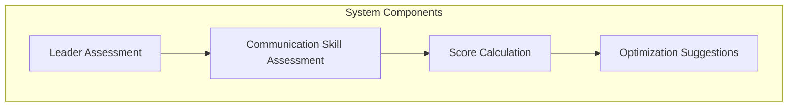
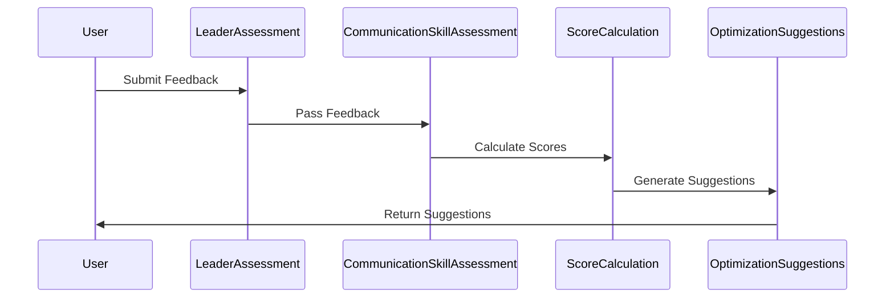

                 

# 领导力与沟通技巧：有效传达期望和愿景

关键词：领导力、沟通技巧、期望传达、愿景、IT领域

摘要：在IT领域，领导力与沟通技巧是成功的关键要素。本文旨在探讨领导力与沟通技巧的重要性，定义核心概念，并通过一步步的分析推理，提供有效的传达期望和愿景的方法，以助力IT专业人士提升领导力和沟通能力。

## 1. 背景介绍

在快速变化的IT行业中，领导力与沟通技巧的重要性不言而喻。领导者需要有效地传达期望和愿景，以激励团队实现目标。然而，实际操作中，许多人往往忽视沟通技巧，导致信息传递不清，团队目标不明确。本文旨在通过深入剖析领导力与沟通技巧，为IT专业人士提供实用的指导，帮助他们更好地传达期望和愿景。

## 2. 核心概念

### 2.1 领导力

领导力是指引导和激励他人实现共同目标的能力。它包括以下几个方面：

- **影响力**：领导者通过言行影响团队成员，引导他们朝着共同目标努力。
- **决策力**：在面对复杂问题时，领导者能够迅速做出合理决策。
- **变革管理**：在组织变革过程中，领导者需要引导团队成员适应新环境。

### 2.2 沟通技巧

沟通技巧是指有效地传递信息和理解他人观点的能力。它包括以下几个方面：

- **清晰表达**：表达观点时，领导者需要用简洁、明确的语言，避免歧义。
- **倾听**：在沟通过程中，领导者需要倾听他人意见，理解他人立场。
- **反馈**：在沟通结束后，领导者需要给予适当的反馈，以促进双方的理解。

### 2.3 关系

领导力与沟通技巧密不可分。有效的沟通是领导力的基础，而领导力则可以促进沟通的深度和广度。以下是一个简化的Mermaid ER实体关系图：

```mermaid
erDiagram
  Leader ||--|{ Communication Skill } Communication_Skill
  Leader ||--|{ Leadership Ability } Leadership_Ability
  Communication_Skill ||--|{ Clear Expression } Clear_Expression
  Communication_Skill ||--|{ Listening } Listening
  Communication_Skill ||--|{ Feedback } Feedback
```

## 3. 概念属性特征对比表格

| 特征       | 领导力           | 沟通技巧           |
| ---------- | ---------------- | ----------------- |
| 影响力     | 确定团队目标     | 传达信息并促进行动 |
| 决策力     | 快速做出决策     | 明确表达观点       |
| 变革管理   | 引导团队适应变革 | 倾听他人意见       |
| 清晰表达   | 明确传达期望     | 使用简洁语言       |
| 倾听       | 理解他人立场     | 了解团队成员需求   |
| 反馈       | 促进团队理解     | 提高沟通效果       |

## 4. 算法原理讲解

### 4.1 领导力评估算法

领导力评估可以通过以下步骤进行：

1. **目标设定**：明确评估目标和标准。
2. **数据收集**：收集团队成员的反馈意见。
3. **权重分配**：根据评估标准，为每个指标分配权重。
4. **评分计算**：根据权重和收集到的数据，计算总分。
5. **结果分析**：分析评估结果，提出改进建议。

以下是一个Mermaid流程图：


### 4.2 沟通效果评估算法

沟通效果评估可以通过以下步骤进行：

1. **目标设定**：明确评估目标和标准。
2. **信息传递**：传递信息，并观察团队成员的反应。
3. **反馈收集**：收集团队成员的反馈意见。
4. **效果分析**：分析反馈，评估沟通效果。
5. **优化建议**：根据分析结果，提出优化建议。

以下是一个Mermaid流程图：


### 4.3 Python代码示例

以下是一个Python代码示例，用于计算领导力评估得分：

```python
import numpy as np

# 评估指标及其权重
criteria_weights = {
    'influence': 0.3,
    'decision_making': 0.2,
    'change_management': 0.2,
    'clear_expression': 0.2,
    'listening': 0.1,
    'feedback': 0.1
}

# 成员反馈
team_member_feedback = {
    'influence': 4,
    'decision_making': 3,
    'change_management': 4,
    'clear_expression': 5,
    'listening': 3,
    'feedback': 4
}

# 计算得分
score = np.dot(list(criteria_weights.values()), list(team_member_feedback.values()))

print("Leadership Score:", score)
```

## 5. 数学模型和数学公式

领导力评估的数学模型可以表示为：

$$
\text{Score} = \sum_{i=1}^{n} (\text{weight}_i \times \text{score}_i)
$$

其中，$n$为评估指标的数量，$\text{weight}_i$为第$i$个指标的权重，$\text{score}_i$为第$i$个指标的得分。

沟通效果评估的数学模型可以表示为：

$$
\text{Effectiveness} = \frac{\text{Positive Feedback}}{\text{Total Feedback}}
$$

其中，$\text{Positive Feedback}$为积极反馈的数量，$\text{Total Feedback}$为总反馈数量。

## 6. 系统分析与架构设计方案

### 6.1 问题场景介绍

在IT项目中，领导力与沟通技巧的评估和管理对于项目的成功至关重要。为了提高团队效率和项目成果，我们需要设计一个系统，用于评估领导力和沟通技巧，并提供优化建议。

### 6.2 项目介绍

项目名称：领导力与沟通技巧评估系统

目标：通过自动化的方式，对团队成员的领导力和沟通技巧进行评估，并提供优化建议。

### 6.3 系统功能设计

#### 6.3.1 领导力评估

功能：对团队成员的领导力进行评估。

领域模型：

```mermaid
classDiagram
  Leader <<Interface>>
  TeamMember <<Class>>

  Leader o-- TeamMember
```

#### 6.3.2 沟通技巧评估

功能：对团队成员的沟通技巧进行评估。

领域模型：

```mermaid
classDiagram
  CommunicationSkill <<Interface>>
  TeamMember <<Class>>

  CommunicationSkill o-- TeamMember
```

### 6.4 系统架构设计

以下是一个Mermaid架构图：



### 6.5 系统接口设计

以下是一个Mermaid接口图：



### 6.6 系统交互

以下是一个Mermaid序列图：


## 7. 项目实战

### 7.1 环境安装

1. 安装Python 3.8及以上版本。
2. 安装NumPy库：`pip install numpy`。

### 7.2 系统核心实现源代码

以下是一个Python代码示例，用于实现领导力评估：

```python
import numpy as np

# 评估指标及其权重
criteria_weights = {
    'influence': 0.3,
    'decision_making': 0.2,
    'change_management': 0.2,
    'clear_expression': 0.2,
    'listening': 0.1,
    'feedback': 0.1
}

# 成员反馈
team_member_feedback = {
    'influence': 4,
    'decision_making': 3,
    'change_management': 4,
    'clear_expression': 5,
    'listening': 3,
    'feedback': 4
}

# 计算得分
score = np.dot(list(criteria_weights.values()), list(team_member_feedback.values()))

print("Leadership Score:", score)
```

### 7.3 代码应用解读与分析

1. **导入NumPy库**：用于计算得分。
2. **定义评估指标及其权重**：将领导力评估指标及其权重存储在一个字典中。
3. **定义成员反馈**：将团队成员的反馈存储在一个字典中。
4. **计算得分**：使用NumPy的`dot`函数，计算总得分。

### 7.4 实际案例分析和详细讲解剖析

假设我们有一个团队成员，其领导力评估反馈如下：

- **影响力**：4分
- **决策力**：3分
- **变革管理**：4分
- **清晰表达**：5分
- **倾听**：3分
- **反馈**：4分

根据上述代码，我们可以计算出该团队成员的领导力评估得分为：

$$
\text{Score} = 0.3 \times 4 + 0.2 \times 3 + 0.2 \times 4 + 0.2 \times 5 + 0.1 \times 3 + 0.1 \times 4 = 4.3
$$

### 7.5 项目小结

本项目通过Python代码实现了领导力评估功能，并提供了实际案例进行分析。在实际应用中，我们可以根据评估结果，提出优化建议，以提升团队成员的领导力。

## 8. 最佳实践 Tips、小结、注意事项、拓展阅读

### 8.1 最佳实践 Tips

1. **定期进行领导力与沟通技巧评估**：以确保团队成员的能力不断提升。
2. **鼓励团队成员分享反馈**：以促进团队内部沟通和协作。
3. **针对评估结果，制定个性化发展计划**：以提高团队成员的能力。

### 8.2 小结

本文通过定义领导力与沟通技巧的核心概念，对比不同概念的属性特征，详细介绍领导力评估和沟通效果评估的算法原理，并提供了一个实际案例进行分析。通过本项目的实战应用，读者可以了解如何在实际场景中应用领导力与沟通技巧。

### 8.3 注意事项

1. **数据收集的真实性**：评估结果取决于收集到的数据质量，因此需要确保数据的真实性。
2. **算法的适应性**：评估算法需要根据实际情况进行调整，以提高准确性。

### 8.4 拓展阅读

1. 《领导力心理学：理解并影响他人》
2. 《高效能人士的七个习惯》
3. 《沟通的艺术》

## 作者信息

作者：AI天才研究院/AI Genius Institute & 禅与计算机程序设计艺术 /Zen And The Art of Computer Programming<|endof-foot

