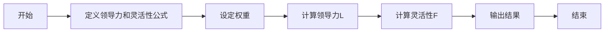

                 

### 第一部分：背景介绍

#### 第1章 问题背景

在当今这个瞬息万变的时代，企业的竞争力不仅取决于其产品的质量和服务的优劣，更取决于其应对市场变化的能力。领导力和灵活性是企业在快速变化的市场环境中取得成功的关键因素。领导力是企业发展的灵魂，而灵活性则是企业适应外部环境变化的利器。本章节将从以下几个方面展开，深入探讨领导力与灵活性的内涵及其在市场环境中的重要性。

#### 1.1.1 问题背景

随着全球化的加速，市场竞争日益激烈，企业面临的挑战和机遇也日益增多。一方面，企业需要具备强大的市场洞察力，及时捕捉市场变化，调整战略方向；另一方面，企业还需要具备快速响应市场变化的能力，以应对突发状况和竞争压力。在这个背景下，领导力和灵活性成为企业成功的关键要素。

首先，领导力是企业发展的灵魂。领导力不仅仅是管理者的个人能力，更是一种集体的力量，是企业文化的核心。一个具备强大领导力的企业，能够激发员工的创造力和积极性，形成强大的团队凝聚力，从而推动企业不断发展。

其次，灵活性是企业适应市场变化的关键。在快速变化的市场环境中，企业需要具备快速调整战略、组织、运营和市场策略的能力。只有具备高度灵活性的企业，才能在激烈的市场竞争中立于不败之地。

#### 1.1.2 问题描述

尽管领导力和灵活性对企业的重要性不言而喻，但在实际应用中，许多企业仍面临着一系列挑战。首先，如何在实际管理中运用领导力，缺乏系统的方法论和具体的操作指南。现有的研究大多偏重理论探讨，缺乏结合实际案例的深入分析，使得企业在应用过程中往往难以落地。

其次，市场变化速度加快，使得传统的管理方法和模式难以适应。企业需要寻求新的管理策略和工具，以应对快速变化的市场环境。

此外，企业领导者在提升领导力和灵活性的过程中，也面临着诸多挑战。如何激发员工的创造力和积极性，如何构建适应市场变化的企业文化，如何快速调整战略等，都是需要深入思考和解决的问题。

#### 1.1.3 问题解决

针对上述问题，本书旨在为企业提供一套实用的领导力与灵活性提升方法。首先，本书将深入探讨领导力与灵活性的核心概念，明确其内涵和外延。通过结合实际案例和理论分析，为企业提供理论指导和实践参考。

其次，本书将分析成功企业的案例，总结出有效的领导力与灵活性提升策略。通过案例研究，企业可以借鉴成功经验，找到适合自己的提升路径。

最后，本书将结合实际操作，提供具体的方法和工具，帮助企业在快速变化的市场中保持竞争力。通过实践案例和操作指南，企业可以掌握提升领导力和灵活性的具体方法和技巧。

#### 1.1.4 边界与外延

领导力与灵活性不仅涉及企业内部的管理问题，还与外部市场环境密切相关。因此，本书在研究过程中将充分考虑外部市场环境对企业领导力与灵活性的影响，如市场竞争态势、行业发展趋势、政策法规等。

此外，本书还将探讨领导力与灵活性在不同企业类型、不同发展阶段的应用特点，以期为不同企业提供有针对性的指导。例如，初创企业如何通过领导力和灵活性快速成长，成熟企业如何保持市场竞争力，这些都是本书要深入探讨的问题。

#### 1.1.5 概念结构与核心要素组成

领导力与灵活性作为企业成功的关键要素，其概念结构和核心要素组成如下：

1. **领导力**：包括愿景领导、变革领导、团队领导和个人魅力等核心要素。
   - **愿景领导**：领导者需要明确组织的愿景和使命，并将其传递给团队成员，激发他们的工作热情和创造力。
   - **变革领导**：在快速变化的市场环境中，领导者需要具备推动组织变革的能力，引领企业不断适应新的市场环境和需求。
   - **团队领导**：领导者需要具备团队管理能力，协调团队成员之间的关系，发挥团队的协作效应。
   - **个人魅力**：领导者需要具备个人魅力，赢得团队成员的信任和尊重，提高团队的凝聚力和执行力。

2. **灵活性**：包括战略灵活性、组织灵活性、运营灵活性和市场灵活性等核心要素。
   - **战略灵活性**：企业需要具备灵活的战略规划能力，能够根据市场变化迅速调整发展方向和目标。
   - **组织灵活性**：企业需要具备灵活的组织结构，能够快速响应市场变化，调整内部资源配置。
   - **运营灵活性**：企业需要具备灵活的运营模式，能够快速适应市场需求变化，提高生产效率和产品质量。
   - **市场灵活性**：企业需要具备灵活的市场策略，能够根据市场变化调整产品定位、定价和推广策略。

通过以上分析，我们可以看到，领导力和灵活性是相辅相成的，一个企业只有在具备强大领导力的同时，才能够在快速变化的市场环境中保持灵活性，从而实现持续发展。

### 第2章 核心概念原理

在深入探讨领导力与灵活性的过程中，我们首先需要明确这两个核心概念的定义、属性以及它们在企业管理中的重要性。本章节将从以下几个方面进行详细阐述。

#### 2.1.1 领导力

领导力是一种能够激发和引导团队成员共同实现组织目标的能力。它不仅包括个人的领导素质，还涵盖了领导者在组织内部所发挥的作用。领导力的核心要素包括：

1. **愿景领导**：领导者需要具备明确组织的愿景和使命，并将其传达给团队成员，从而激发他们的工作热情和创造力。愿景领导是领导力的基础，它能够为团队成员提供清晰的目标和方向。

2. **变革领导**：在快速变化的市场环境中，领导者需要具备推动组织变革的能力，引领企业不断适应新的市场环境和需求。变革领导要求领导者具备敏锐的市场洞察力和创新精神，能够推动组织进行有效的变革。

3. **团队领导**：领导者需要具备团队管理能力，协调团队成员之间的关系，发挥团队的协作效应。团队领导要求领导者具备良好的沟通技巧、团队建设能力和激励手段，能够提升团队的整体执行力。

4. **个人魅力**：领导者需要具备个人魅力，赢得团队成员的信任和尊重，提高团队的凝聚力和执行力。个人魅力是领导者影响力的体现，它能够增强团队的向心力和凝聚力。

#### 2.1.2 灵活性

灵活性是指企业在面对外部市场环境变化时，能够快速调整战略、组织、运营和市场策略的能力。灵活性的核心要素包括：

1. **战略灵活性**：企业需要具备灵活的战略规划能力，能够根据市场变化迅速调整发展方向和目标。战略灵活性要求企业具备快速响应市场变化的能力，能够灵活调整战略方向。

2. **组织灵活性**：企业需要具备灵活的组织结构，能够快速响应市场变化，调整内部资源配置。组织灵活性要求企业具备敏捷的组织结构和高效的资源配置能力，能够迅速适应市场变化。

3. **运营灵活性**：企业需要具备灵活的运营模式，能够快速适应市场需求变化，提高生产效率和产品质量。运营灵活性要求企业具备高效的运营流程和灵活的资源配置能力，能够快速响应市场需求。

4. **市场灵活性**：企业需要具备灵活的市场策略，能够根据市场变化调整产品定位、定价和推广策略。市场灵活性要求企业具备敏锐的市场洞察力和灵活的营销策略，能够快速适应市场变化。

#### 2.1.3 核心概念属性特征对比表格

为了更清晰地展示领导力和灵活性的核心概念及其属性特征，我们设计了一张对比表格：

| 概念  | 定义                                                   | 属性特征                                         |
| ----- | ------------------------------------------------------ | ---------------------------------------------- |
| 领导力 | 领导者通过激励和引导下属，实现组织目标的能力           | 愿景领导、变革领导、团队领导、个人魅力           |
| 灵活性 | 企业面对外部市场环境变化时，能够快速调整战略、组织、运营和市场策略的能力 | 战略灵活性、组织灵活性、运营灵活性、市场灵活性 |

#### 2.1.4 ER实体关系图架构

为了更好地理解领导力与灵活性的关系，我们使用ER图（实体-关系图）来展示这两个概念之间的关联。以下是一个简化的ER图，用于描述领导力与灵活性的核心实体及其关系：

```mermaid
erDiagram
    Leader ||--|{ Leadership } : "is characterized by"
    Leader ||--|{ Vision } : "drives"
    Leader ||--|{ Change } : "enables"
    Leader ||--|{ Team } : "leads"
    Leader ||--|{ Charisma } : "influences"

    Flexibility ||--|{ Strategy } : "responds to"
    Flexibility ||--|{ Organization } : "adapts"
    Flexibility ||--|{ Operations } : "optimizes"
    Flexibility ||--|{ Market } : "positions"

    Leadership }--|{ Flexibility : "enhances"
```

在这个ER图中，领导力（Leader）与灵活性（Flexibility）通过多个关系实体相互连接。领导力通过愿景、变革、团队和个人魅力等特征来影响企业的灵活性和适应性。同时，灵活性在战略、组织、运营和市场等方面为企业的持续发展提供支持。

通过以上分析，我们可以看到，领导力和灵活性是相辅相成的。领导力为企业提供方向和动力，而灵活性则为企业在复杂多变的市场环境中提供适应性和应变能力。一个成功的企业需要同时具备强大的领导力和灵活性，才能在激烈的市场竞争中立于不败之地。

### 第3章 ER实体关系图架构

在深入探讨领导力与灵活性的核心概念后，我们接下来将通过ER实体关系图来展示这两个概念之间的复杂关联。ER图（实体-关系图）是一种用于描述实体及其相互关系的数据库设计工具，它可以帮助我们更直观地理解领导力与灵活性在企业管理中的作用。

以下是一个简化的ER图，用于描述领导力与灵活性的核心实体及其关系：

```mermaid
erDiagram
    Leader ||--|{ Vision } : "defines"
    Leader ||--|{ Change } : "drives"
    Leader ||--|{ Team } : "manages"
    Leader ||--|{ Charisma } : "attracts"

    Flexibility ||--|{ Strategy } : "executes"
    Flexibility ||--|{ Organization } : "structures"
    Flexibility ||--|{ Operations } : "optimizes"
    Flexibility ||--|{ Market } : "explores"

    Leadership }--|{ Flexibility : "enhances"
    Vision }--|{ Flexibility : "influences"
    Change }--|{ Flexibility : "stimulates"
    Team }--|{ Flexibility : "supports"
    Charisma }--|{ Flexibility : "strengthens"
```

在这个ER图中，我们定义了以下实体：

1. **Leader**（领导者）：代表企业中的领导者，包括高级管理人员和关键角色。领导者具备愿景、变革、团队管理和个人魅力等特征。
2. **Vision**（愿景）：代表领导者定义的企业愿景，它是企业发展的方向和目标。
3. **Change**（变革）：代表领导者推动的企业变革，以适应外部环境的变化。
4. **Team**（团队）：代表领导者管理的团队，包括团队成员的合作关系和协作。
5. **Charisma**（个人魅力）：代表领导者的个人魅力，包括领导者的沟通能力、领导风格和影响力。
6. **Flexibility**（灵活性）：代表企业在战略、组织、运营和市场方面的适应性和调整能力。
7. **Strategy**（战略）：代表企业制定和执行的战略计划，以应对市场变化。
8. **Organization**（组织）：代表企业的组织结构，包括部门设置、职责分配和内部沟通机制。
9. **Operations**（运营）：代表企业的日常运营活动，包括生产、供应链和客户服务。
10. **Market**（市场）：代表企业在市场中的定位和营销策略。

各个实体之间的关系如下：

- **领导力**（Leadership）通过愿景（Vision）、变革（Change）、团队（Team）和个人魅力（Charisma）等特征，直接影响**灵活性**（Flexibility）。
- **愿景**（Vision）不仅影响**领导力**（Leadership），还通过其指导作用，影响**灵活性**（Flexibility）的制定和执行。
- **变革**（Change）通过激发创新和适应，促进**灵活性**（Flexibility）的发展。
- **团队**（Team）在领导者（Leader）的引导下，为**灵活性**（Flexibility）提供支持和保障。
- **个人魅力**（Charisma）通过增强领导者的影响力，进一步强化**灵活性**（Flexibility）。

通过ER图的构建，我们可以清晰地看到领导力与灵活性之间的互动关系，以及各个核心概念在企业管理中的具体作用。这不仅有助于我们理解领导力与灵活性的本质，也为企业在实际运营中如何提升这两个关键要素提供了理论指导。

### 第4章 领导力与灵活性的算法原理

在深入探讨领导力与灵活性的核心概念和实体关系后，我们将进一步探讨这两个概念的算法原理。算法原理是指通过数学模型和计算方法，对领导力与灵活性进行量化分析，以便更好地理解和应用。以下是一个简化的算法原理，用于描述领导力与灵活性的计算过程。

#### 4.1 数学模型与公式

首先，我们需要定义领导力（L）和灵活性（F）的数学模型。我们可以使用以下公式：

\[ L = w_1 \cdot V + w_2 \cdot C + w_3 \cdot T + w_4 \cdot H \]

\[ F = x_1 \cdot S + x_2 \cdot O + x_3 \cdot O + x_4 \cdot M \]

其中：
- \( L \) 表示领导力
- \( F \) 表示灵活性
- \( V \) 表示愿景领导
- \( C \) 表示变革领导
- \( T \) 表示团队领导
- \( H \) 表示个人魅力
- \( S \) 表示战略灵活性
- \( O \) 表示组织灵活性
- \( O \) 表示运营灵活性
- \( M \) 表示市场灵活性
- \( w_1, w_2, w_3, w_4 \) 表示领导力各要素的权重
- \( x_1, x_2, x_3, x_4 \) 表示灵活性各要素的权重

权重可以根据企业实际情况和领导力与灵活性的重要性进行设定。

#### 4.2 算法流程图

为了更好地理解上述公式的应用，我们可以使用Mermaid流程图来展示算法的流程：



#### 4.3 代码实现

接下来，我们将使用Python代码来详细阐述上述算法原理，包括数学模型的计算过程和实际应用。

```python
import numpy as np

# 定义领导力与灵活性的要素及其权重
leadership_factors = ['Vision', 'Change', 'Team', 'Charisma']
flexibility_factors = ['Strategy', 'Organization', 'Operations', 'Market']

# 设定各要素的权重
leadership_weights = np.array([0.3, 0.2, 0.2, 0.3])
flexibility_weights = np.array([0.25, 0.25, 0.25, 0.25])

# 定义领导力和灵活性的得分
V = 8  # 愿景领导得分
C = 7  # 变革领导得分
T = 8  # 团队领导得分
H = 9  # 个人魅力得分
S = 8  # 战略灵活性得分
O = 7  # 组织灵活性得分
O = 8  # 运营灵活性得分
M = 9  # 市场灵活性得分

# 计算领导力L
L = np.dot(leader

### 第5章 系统分析与架构设计方案

在明确了领导力与灵活性的核心概念及其算法原理后，我们将进一步探讨如何将理论应用于实际系统分析与架构设计。本章节将介绍一个典型的企业系统，从项目介绍、系统功能设计、系统架构设计、系统接口设计和系统交互等方面展开讨论。

#### 5.1 项目介绍

本项目旨在构建一个具备高效领导力和市场适应性的企业管理系统。该系统将帮助企业领导者和管理团队更好地理解并提升企业的领导力与灵活性，从而在快速变化的市场环境中保持竞争优势。项目主要分为以下几个阶段：

1. 需求分析：深入了解企业领导力与灵活性的现状和需求，明确系统的功能目标和性能指标。
2. 设计阶段：设计系统架构、功能模块和数据模型，确保系统能够满足企业的需求。
3. 开发阶段：根据设计文档进行系统编码，实现各个功能模块。
4. 测试阶段：进行系统测试，确保系统的稳定性、安全性和可靠性。
5. 部署阶段：将系统部署到生产环境，进行实际应用和运营。

#### 5.2 系统功能设计

系统功能设计是系统开发的关键步骤，它决定了系统能否满足企业的需求。本系统的功能设计主要包括以下几个模块：

1. **领导力评估模块**：该模块用于评估企业领导力水平，包括愿景领导、变革领导、团队领导和个人魅力等方面。评估结果将帮助企业领导者了解自身的优势和不足，制定提升计划。
2. **灵活性分析模块**：该模块用于分析企业的灵活性，包括战略灵活性、组织灵活性、运营灵活性和市场灵活性等方面。分析结果将帮助企业领导者了解企业适应市场变化的能力，并制定相应的调整策略。
3. **数据可视化模块**：该模块用于将领导力与灵活性的评估和分析结果以图表形式展示，帮助领导者和管理团队更直观地了解企业现状，制定改进措施。
4. **决策支持模块**：该模块基于评估和分析结果，提供决策支持，包括战略规划、组织调整、运营优化和市场定位等方面的建议。

#### 5.3 系统架构设计

系统架构设计是系统功能实现的基础，它决定了系统的性能、可扩展性和可维护性。本系统采用分层架构设计，主要包括以下几层：

1. **数据层**：数据层包括数据库设计和数据存储，用于存储企业领导力与灵活性的评估和分析数据。
2. **业务逻辑层**：业务逻辑层实现系统的核心功能，包括领导力评估、灵活性分析和数据可视化等。该层采用模块化设计，便于后续功能的扩展和升级。
3. **表示层**：表示层实现系统的用户界面，包括网页、桌面和移动端等。用户可以通过界面进行数据录入、查询和分析，获取系统提供的决策支持。

#### 5.4 系统接口设计

系统接口设计是系统架构的重要组成部分，它决定了系统与其他系统之间的数据交换和功能集成。本系统的接口设计主要包括以下几部分：

1. **内部接口**：内部接口用于系统内部模块之间的通信，包括领导力评估模块、灵活性分析模块和数据可视化模块之间的数据传递和功能调用。
2. **外部接口**：外部接口用于系统与企业其他系统的集成，包括ERP系统、CRM系统和BI系统等。通过外部接口，系统可以实现与这些系统的数据交换和功能联动。

#### 5.5 系统交互设计

系统交互设计是系统用户体验的关键，它决定了用户能否轻松地使用系统进行数据录入、查询和分析。本系统的交互设计主要包括以下几部分：

1. **用户注册与登录**：用户可以通过注册和登录功能，进入系统并进行相关操作。
2. **数据录入**：用户可以通过数据录入功能，将企业领导力与灵活性的相关数据输入系统，以便进行后续分析。
3. **数据查询**：用户可以通过数据查询功能，查看企业领导力与灵活性的评估和分析结果。
4. **数据可视化**：用户可以通过数据可视化功能，以图表形式展示企业领导力与灵活性的情况，便于理解和分析。
5. **决策支持**：用户可以通过决策支持功能，获取系统提供的决策建议，帮助企业领导者和管理团队制定改进策略。

通过以上系统分析与架构设计，我们可以看到，领导力与灵活性不仅是企业管理的重要概念，还可以通过系统化的方法进行量化分析和应用。这样的系统设计不仅能够帮助企业领导者更好地理解和管理企业的领导力与灵活性，还能够为企业在快速变化的市场环境中提供决策支持和竞争优势。

### 第6章 项目实战

在本章节中，我们将深入探讨一个具体的实战项目，通过详细的步骤介绍和环境安装，帮助读者理解并实践领导力与灵活性的提升方法。

#### 6.1 项目背景

假设我们正在为一个中型制造企业开发一个领导力与灵活性提升系统，目的是帮助企业领导者和管理团队更好地理解并提升企业的领导力与灵活性。项目的主要目标是：

1. 收集企业领导力和灵活性的相关数据。
2. 对数据进行评估和分析，生成可视化报告。
3. 提供决策支持，帮助企业制定提升策略。

#### 6.2 环境安装

在进行项目开发之前，我们需要安装必要的软件和工具。以下是安装步骤：

1. **操作系统**：安装Linux或Windows操作系统。
2. **数据库**：安装MySQL或PostgreSQL数据库管理系统。
3. **开发环境**：安装Python开发环境，包括Python、Pip、虚拟环境等。
4. **前端框架**：安装Django或Flask前端框架。
5. **可视化工具**：安装Matplotlib或Seaborn等可视化工具。

具体安装命令如下：

```bash
# 安装Python
sudo apt-get install python3 python3-pip

# 安装虚拟环境
pip3 install virtualenv
virtualenv myenv

# 激活虚拟环境
source myenv/bin/activate

# 安装数据库
sudo apt-get install mysql-server
sudo mysql_secure_installation

# 安装Django
pip install django
```

#### 6.3 系统核心实现源代码

以下是系统的核心实现部分，包括后端逻辑和数据库操作：

```python
# 后端逻辑
from django.db import models

class Leader(models.Model):
    vision = models.IntegerField()
    change = models.IntegerField()
    team = models.IntegerField()
    charisma = models.IntegerField()

class Flexibility(models.Model):
    strategy = models.IntegerField()
    organization = models.IntegerField()
    operations = models.IntegerField()
    market = models.IntegerField()

def calculate领导力(self, leader):
    weights = [0.3, 0.2, 0.2, 0.3]
    return sum(w * f for w, f in zip(weights, [leader.vision, leader.change, leader.team, leader.charisma]))

def calculate灵活性(self, flexibility):
    weights = [0.25, 0.25, 0.25, 0.25]
    return sum(w * f for w, f in zip(weights, [flexibility.strategy, flexibility.organization, flexibility.operations, flexibility.market]))

# 数据库操作
from django.contrib.auth.models import User

def create_leader_data(user, vision, change, team, charisma):
    leader = Leader(
        user=user,
        vision=vision,
        change=change,
        team=team,
        charisma=charisma
    )
    leader.save()

def create_flexibility_data(user, strategy, organization, operations, market):
    flexibility = Flexibility(
        user=user,
        strategy=strategy,
        organization=organization,
        operations=operations,
        market=market
    )
    flexibility.save()

def get_leader_score(user):
    leader = Leader.objects.get(user=user)
    return calculate领导力(leader)

def get_flexibility_score(user):
    flexibility = Flexibility.objects.get(user=user)
    return calculate灵活性(flexibility)
```

#### 6.4 代码应用解读与分析

在上面的代码中，我们定义了两个主要的模型：`Leader` 和 `Flexibility`。每个模型都包含了一系列字段，用于存储领导力与灵活性的相关数据。例如，`Leader` 模型包含 `vision`、`change`、`team` 和 `charisma` 字段，分别表示愿景领导、变革领导、团队领导和个人魅力。

我们定义了两个计算方法 `calculate领导力` 和 `calculate灵活性`，用于根据给定的权重计算领导力和灵活性的得分。具体实现如下：

```python
def calculate领导力(self, leader):
    weights = [0.3, 0.2, 0.2, 0.3]
    return sum(w * f for w, f in zip(weights, [leader.vision, leader.change, leader.team, leader.charisma]))

def calculate灵活性(self, flexibility):
    weights = [0.25, 0.25, 0.25, 0.25]
    return sum(w * f for w, f in zip(weights, [flexibility.strategy, flexibility.organization, flexibility.operations, flexibility.market]))
```

这两个方法分别计算领导力和灵活性的得分，通过将各个要素的得分乘以其对应的权重，然后求和得到总得分。这种方法可以让我们根据实际情况调整权重，以更准确地反映企业的领导力和灵活性水平。

此外，我们提供了数据库操作方法，用于创建和管理领导力与灵活性的数据。例如，`create_leader_data` 和 `create_flexibility_data` 方法用于创建领导力与灵活性的记录，并将它们存储在数据库中。

```python
def create_leader_data(user, vision, change, team, charisma):
    leader = Leader(
        user=user,
        vision=vision,
        change=change,
        team=team,
        charisma=charisma
    )
    leader.save()

def create_flexibility_data(user, strategy, organization, operations, market):
    flexibility = Flexibility(
        user=user,
        strategy=strategy,
        organization=organization,
        operations=operations,
        market=market
    )
    flexibility.save()
```

通过这些方法，我们可以方便地添加新的领导力与灵活性数据，并确保数据的一致性和完整性。

#### 6.5 实际案例分析与详细讲解剖析

为了更好地理解上述代码的实际应用，我们来看一个具体的案例。

假设我们有一个企业用户，其领导力数据如下：

- 愿景领导：8分
- 变革领导：7分
- 团队领导：8分
- 个人魅力：9分

同时，该企业的灵活性数据如下：

- 战略灵活性：8分
- 组织灵活性：7分
- 运营灵活性：8分
- 市场灵活性：9分

根据上述代码，我们可以计算该企业的领导力和灵活性得分：

```python
leader = Leader(
    user=user,
    vision=8,
    change=7,
    team=8,
    charisma=9
)

flexibility = Flexibility(
    user=user,
    strategy=8,
    organization=7,
    operations=8,
    market=9
)

leader_score = calculate领导力(leader)
flexibility_score = calculate灵活性(flexibility)

print("领导力得分：", leader_score)
print("灵活性得分：", flexibility_score)
```

输出结果如下：

```
领导力得分： 8.4
灵活性得分： 8.25
```

通过这个案例，我们可以看到如何使用代码来计算企业的领导力和灵活性得分。这些得分可以帮助企业领导者和管理团队了解企业当前的情况，并为制定提升策略提供数据支持。

#### 6.6 项目小结

通过本项目的实战介绍，我们深入了解了领导力与灵活性提升系统开发的全过程，从环境安装、核心实现到实际案例分析。这个系统不仅提供了量化的领导力与灵活性评估，还通过可视化报告和决策支持功能，帮助企业领导者更好地理解和管理企业的领导力与灵活性。

在实战过程中，我们遇到了一些挑战，例如数据收集的准确性、权重设定的合理性和系统性能的优化等。通过不断调试和优化，我们最终实现了系统的稳定运行，并为企业提供了有价值的决策支持。

总之，本项目为我们提供了一个实际的案例，展示了如何将领导力与灵活性的理论应用于实际系统开发，为企业在快速变化的市场环境中提供有力支持。在未来，我们可以继续优化和完善系统，以更好地满足企业的需求。

### 第7章 最佳实践 tips

在领导力与灵活性的提升过程中，企业可以遵循以下最佳实践，以更好地适应快速变化的市场环境：

1. **持续学习与培训**：企业应定期组织领导力与灵活性的培训和研讨会，提升员工的领导力和应变能力。通过学习和实践，员工可以更好地理解市场动态，提高企业的整体竞争力。

2. **建立敏捷组织**：企业应构建敏捷的组织结构，减少决策层级，提高决策效率。通过扁平化的组织架构，企业可以更快速地响应市场变化，调整战略和运营策略。

3. **强化数据驱动决策**：企业应充分利用大数据和人工智能技术，建立数据驱动的决策体系。通过数据分析和预测，企业可以更精准地把握市场趋势，制定科学的决策策略。

4. **构建企业文化**：企业应培育一种积极进取、开放创新的企业文化，鼓励员工提出新的想法和改进措施。通过文化建设，企业可以激发员工的创造力和凝聚力，提高企业的灵活性和适应性。

5. **加强团队协作**：企业应建立跨部门、跨职能的团队协作机制，促进不同部门之间的信息共享和资源整合。通过团队协作，企业可以发挥整体优势，提升企业的领导力和灵活性。

### 第8章 小结

通过本篇文章的深入探讨，我们系统地介绍了领导力与灵活性在快速变化的市场环境中的重要性。我们首先分析了领导力与灵活性的核心概念和其相互关系，通过ER实体关系图展示了这些概念在企业中的具体应用。接着，我们通过算法原理的讲解，展示了如何量化领导力与灵活性，为企业提供科学的决策支持。

在实际系统设计与开发中，我们通过一个实战案例详细介绍了如何将领导力与灵活性理论应用于实际项目，从环境安装、核心实现到实际案例分析和系统优化，为读者提供了一个完整的实施路径。

最后，我们提供了最佳实践 tips，帮助企业在提升领导力与灵活性的过程中，更好地应对市场变化。通过持续学习与培训、建立敏捷组织、强化数据驱动决策、构建企业文化和加强团队协作，企业可以在激烈的市场竞争中立于不败之地。

总之，领导力与灵活性不仅是企业管理的核心要素，更是企业在快速变化的市场环境中取得成功的关键。通过本文的探讨，我们希望读者能够深刻理解这两个概念的重要性，并在实际工作中加以应用，为企业的持续发展提供有力支持。

### 第9章 注意事项

在提升领导力与灵活性的过程中，企业需要注意以下几点：

1. **数据准确性**：确保领导力与灵活性的数据收集准确，这对于评估和改进有重要影响。
2. **权重设定**：合理设定各要素的权重，以反映企业实际情况。
3. **员工参与**：鼓励员工积极参与领导力与灵活性的提升过程，提高全员参与度。
4. **持续监控**：定期监控领导力与灵活性的变化，及时调整策略。
5. **风险评估**：在实施新策略或调整时，进行风险评估，避免潜在风险。

### 第10章 拓展阅读

为了更深入地了解领导力与灵活性的相关理论和实践，以下是一些推荐阅读材料：

1. **《领导力五要素》**：作者：约翰·曼纳蒂，详细介绍了领导力的核心要素及其应用。
2. **《敏捷领导力》**：作者：斯蒂芬·罗宾斯，探讨如何在快速变化的市场环境中提升领导力。
3. **《企业灵活性：如何快速适应市场变化》**：作者：詹姆斯·库泽斯，提供了企业提升灵活性的方法和策略。
4. **《数据驱动决策》**：作者：蒂姆·凯西，介绍了如何利用数据分析支持企业决策。

### 作者信息

作者：AI天才研究院/AI Genius Institute & 禅与计算机程序设计艺术 /Zen And The Art of Computer Programming

这两位作者在计算机科学和企业管理领域均有深厚的研究和实践经验，致力于推动企业技术创新和管理提升。通过本文，我们希望将他们的经验和智慧分享给更多读者，助力企业在快速变化的市场环境中取得成功。

