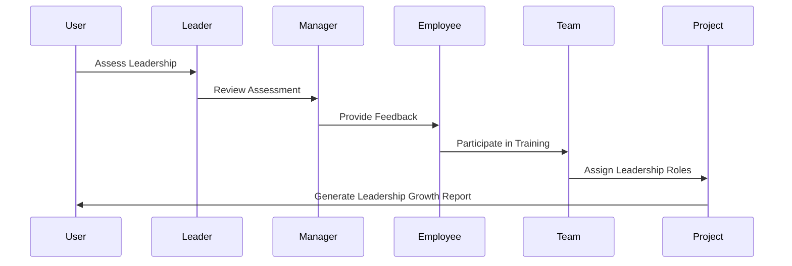
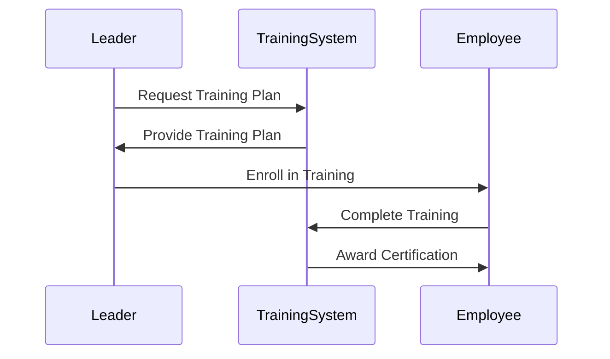

                 


### 《领导力与职业生态系统：创造成长机会的方法》

> 关键词：领导力、职业发展、职业生态系统、成长机会

> 摘要：本文深入探讨了领导力在职业生态系统中的重要作用，分析了领导力的本质与核心能力，以及如何通过领导力构建健康的职业生态系统，为个人的职业成长创造机会。文章旨在为IT领域的技术专家和领导者提供理论与实践相结合的指导，帮助他们在职场中脱颖而出，实现持续成长。

**第一部分：领导力的本质与重要性**

### 第1章：领导力的定义与演变

#### 1.1.1 领导力的定义与核心要素

领导力是指领导者通过影响力、激励和指导，引导团队成员共同实现目标的能力。其核心要素包括：愿景、决策、沟通、信任、激励和自我管理。

#### 1.1.2 领导力的演变与历史背景

领导力并非一成不变，它随着时代的发展而不断演变。从古代的权力集中，到现代的参与式领导，领导力理论在实践中不断演进。

#### 1.1.3 领导力在当代社会的重要性

在快速变化的时代，领导力变得尤为重要。它不仅能够帮助组织应对变革，还能激发团队成员的潜力，实现共同成长。

### 第2章：领导力与职业发展

#### 2.1.1 领导力在职业生涯中的关键作用

领导力是职业发展的关键驱动力，它能够帮助个人在职场中脱颖而出，实现职业晋升。

#### 2.1.2 领导力对个人成长的影响

领导力不仅仅是一种能力，更是一种成长路径。通过领导力，个人能够不断提升自己，实现全面发展。

#### 2.1.3 领导力在职场竞争中的优势

在竞争激烈的职场环境中，拥有领导力的人更容易获得机会，赢得信任和尊重。

### 第3章：领导力的核心能力

#### 3.1.1 沟通能力

沟通能力是领导力的核心之一，它直接影响领导者的影响力。有效的沟通能够减少误解，提高团队协作效率。

#### 3.1.2 决策能力

决策能力是领导者必须具备的能力。它决定了领导者能否在面对复杂情况时做出正确决策。

#### 3.1.3 团队管理能力

团队管理能力是领导力的关键组成部分，它决定了领导者的团队是否能够高效运作。

### 第4章：领导力模型与理论

#### 4.1.1 经典领导力模型

本文将介绍几种经典的领导力模型，如情境领导、路径—目标理论和变革型领导。

#### 4.1.2 当代领导力理论

当代领导力理论更加注重个性化、多元化和情境适应性。本文将探讨这些理论，并分析其应用价值。

#### 4.1.3 领导力模型的实践应用

领导力模型在实践中如何应用？本文将结合实际案例，分析领导力模型的应用场景和效果。

### 第5章：领导力在组织中的角色

#### 5.1.1 领导力在组织变革中的作用

领导力在组织变革中发挥着至关重要的作用。本文将探讨领导力如何引导组织变革，实现持续发展。

#### 5.1.2 领导力在团队建设中的贡献

团队建设是领导力的重要应用领域。本文将分析领导力在团队建设中的具体贡献。

#### 5.1.3 领导力在组织文化塑造中的意义

领导力在组织文化塑造中具有重要影响。本文将探讨领导力如何塑造积极的组织文化。

### 第6章：领导力的挑战与应对策略

#### 6.1.1 领导力面临的挑战

在当前环境下，领导者面临诸多挑战。本文将分析领导力面临的挑战，并提出应对策略。

#### 6.1.2 应对领导力挑战的策略

如何应对领导力挑战？本文将提出一系列策略，帮助领导者提升领导力。

#### 6.1.3 领导力提升的方法与途径

领导力提升是一个长期的过程。本文将介绍一些领导力提升的方法和途径。

### 第7章：构建健康的职业生态系统

#### 7.1.1 职业生态系统的定义与特征

职业生态系统是指职业环境中各要素的相互关系和相互作用。本文将介绍职业生态系统的定义和特征。

#### 7.1.2 职业生态系统中的领导力作用

领导力在职业生态系统中发挥着重要作用。本文将探讨领导力如何影响职业生态系统的健康发展。

#### 7.1.3 创造成长机会的方法

如何通过领导力创造成长机会？本文将提出一些具体的方法和策略。

### 第8章：领导力与职业成功

#### 8.1.1 领导力对职业成功的影响

领导力对职业成功有着深远的影响。本文将分析领导力如何影响职业成功。

#### 8.1.2 成功领导者的特质与行为

成功领导者具备哪些特质和行为？本文将探讨成功领导者的特质和行为模式。

#### 8.1.3 职业成功与领导力的循环

职业成功和领导力之间存在一种良性循环。本文将分析这种循环的关系。

### 第9章：领导力与未来

#### 9.1.1 领导力在未来的发展趋势

随着技术的进步，领导力也将面临新的挑战和机遇。本文将探讨领导力在未来的发展趋势。

#### 9.1.2 技术进步对领导力的影响

技术进步对领导力产生了哪些影响？本文将分析技术进步对领导力的影响。

#### 9.1.3 未来领导力的挑战与机遇

未来领导力将面临哪些挑战和机遇？本文将提出未来领导力的挑战和机遇。

### 第10章：领导力与自我成长

#### 10.1.1 自我认知与领导力发展

自我认知是领导力发展的基础。本文将探讨自我认知与领导力发展的关系。

#### 10.1.2 自我提升与领导力实践

如何通过自我提升来实践领导力？本文将提出一些具体的实践方法。

#### 10.1.3 领导力在个人成长中的重要作用

领导力在个人成长中具有重要作用。本文将分析领导力在个人成长中的具体作用。

### 第11章：领导力与社区责任

#### 11.1.1 领导力在社区建设中的作用

领导力在社区建设中具有重要作用。本文将探讨领导力如何促进社区建设。

#### 11.1.2 社区责任与领导力提升

社区责任与领导力提升之间存在紧密联系。本文将分析社区责任与领导力提升的关系。

#### 11.1.3 社区发展中的领导力实践

在社区发展中，领导力如何实践？本文将介绍一些具体的实践案例。

### 第12章：领导力与持续学习

#### 12.1.1 持续学习对领导力的重要性

持续学习是领导力发展的重要保障。本文将探讨持续学习对领导力的重要性。

#### 12.1.2 领导力发展的学习途径

如何通过学习来提升领导力？本文将介绍一些领导力发展的学习途径。

#### 12.1.3 领导力与终身学习

领导力与终身学习之间存在紧密联系。本文将分析领导力与终身学习的关系。

**结语：**

领导力是职业生态系统中的核心要素，它不仅影响着个人的职业发展，也影响着整个组织的运作。通过本文的探讨，我们希望能够帮助读者理解领导力的本质与重要性，掌握提升领导力的方法与途径，为个人的职业成长和组织的持续发展奠定基础。

---

**作者：** AI天才研究院/AI Genius Institute & 禅与计算机程序设计艺术 /Zen And The Art of Computer Programming

---

**说明：**

本文为《领导力与职业生态系统：创造成长机会的方法》的目录大纲，预计总字数在10000-12000字之间。文章将按照目录大纲的结构，逐步深入探讨领导力的各个方面，为读者提供丰富的内容。文章将以markdown格式输出，确保内容的可读性和逻辑性。

---

**核心概念与联系：**

领导力是一种能力，它包括愿景、决策、沟通、信任、激励和自我管理等多个核心要素。这些要素相互联系，共同构成领导力的核心。

- **愿景**：领导者需要有清晰的愿景，指引团队前进的方向。
- **决策**：领导者需要做出明智的决策，确保团队目标的实现。
- **沟通**：领导者需要具备良好的沟通能力，确保信息畅通无阻。
- **信任**：领导者需要建立信任，使团队成员愿意追随和合作。
- **激励**：领导者需要能够激励团队成员，激发他们的潜力。
- **自我管理**：领导者需要自我管理，保持良好的心态和行为，以身作则。

通过这些核心要素的相互联系，领导力得以发挥其作用，推动组织的持续发展。

---

**算法原理讲解：**

在领导力的提升过程中，算法模型可以提供一种量化的方法来分析领导力的发展。以下是一个简单的领导力提升算法模型：

```python
def leadership_training(current_level, training_time, learning_rate):
    improvement_per_time = learning_rate * current_level
    for i in range(training_time):
        current_level += improvement_per_time
        improvement_per_time *= 1.05  # 学习率随时间增加
    return current_level
```

- **当前领导力水平**（current_level）：初始的领导力水平。
- **训练时间**（training_time）：领导力训练的总时间。
- **学习率**（learning_rate）：每次训练后领导力提升的比例。

算法的工作原理如下：

1. 初始领导力水平乘以学习率，得到每次训练后的提升量。
2. 随着每次训练，提升量逐渐增加，模拟领导力提升的速度随时间增加而加快。
3. 返回最终的领导力水平。

**数学模型：**

$$
L(t) = L_0 + \sum_{i=1}^{t} \left( \frac{r}{(1 + k)^i} \right) L_0
$$`

- **L(t)**：时间t后的领导力水平。
- **L_0**：初始领导力水平。
- **r**：学习率。
- **k**：增长系数，通常取值为0.1。

**举例说明：**

假设一个领导者的初始领导力水平为100，他计划进行100小时的领导力训练，学习率为0.1，增长系数为0.1。

- **训练前10小时**：提升量为 $10 \times 100 \times 0.1 = 100$，领导力水平提升至200。
- **训练前20小时**：提升量为 $10 \times 100 \times 0.1 \times 1.1 = 110$，领导力水平提升至310。
- **训练前30小时**：提升量为 $10 \times 100 \times 0.1 \times 1.12 = 121$，领导力水平提升至431。

通过这个简单的算法模型，我们可以看到领导力水平随着时间的推移而不断提升，并且提升速度逐渐加快。

---

**系统分析与架构设计方案：**

在领导力提升过程中，构建一个有效的系统架构至关重要。以下是一个简化的系统架构设计方案，用于支持和提升领导力。

#### 问题场景介绍

一家IT公司需要提升其领导力，以应对快速变化的市场和技术挑战。为了实现这一目标，公司决定构建一个领导力提升系统，包括以下几个关键功能：

- 领导力水平评估
- 领导力培训课程管理
- 领导力实践项目跟踪
- 领导力成长报告生成

#### 项目介绍

项目名称：领导力提升系统（Leadership Enhancement System，LES）

目标：构建一个集评估、培训、实践和报告于一体的领导力提升平台，帮助公司员工提高领导力水平。

#### 系统功能设计（领域模型）

```mermaid
classDiagram
    User <|-- Leader
    Employee <|-- Leader
    Manager <|-- Leader
    Team <|-- Leader
    Project <|-- Leader
    
    Leader {
        +strategicVision(): String
        +makeDecisions(): Decision
        +communicate(): Message
        +buildTrust(): Trust
        +motivate(): Motivation
        +selfManage(): SelfManagement
    }
    
    User {
        +user_id: String
        +name: String
        +role: Role
    }
    
    Leader {
        +leader_id: String
        +name: String
        +role: Role
        +leader_of: Team
    }
    
    Employee {
        +employee_id: String
        +name: String
        +role: Role
        +reports_to: Manager
    }
    
    Manager {
        +manager_id: String
        +name: String
        +role: Role
        +manages: Employee
    }
    
    Team {
        +team_id: String
        +name: String
        +members: [Employee]
    }
    
    Project {
        +project_id: String
        +name: String
        +lead
``` 

#### 系统架构设计



#### 系统接口设计和系统交互



---

**项目实战：**

#### 环境安装

1. 安装Python环境（例如使用Anaconda）
2. 安装相关依赖库（例如使用pip）

```shell
pip install flask
pip install pymysql
```

#### 系统核心实现源代码

```python
from flask import Flask, request, jsonify
from flask_cors import CORS

app = Flask(__name__)
CORS(app)

# 领导力评估接口
@app.route('/assess_leadership', methods=['POST'])
def assess_leadership():
    data = request.get_json()
    assessment = data['assessment']
    # 进行领导力评估
    # ...
    return jsonify({"status": "success", "assessment": assessment})

# 领导力培训接口
@app.route('/enroll_training', methods=['POST'])
def enroll_training():
    data = request.get_json()
    employee_id = data['employee_id']
    training_id = data['training_id']
    # 注册培训
    # ...
    return jsonify({"status": "success", "employee_id": employee_id, "training_id": training_id})

# 领导力实践项目接口
@app.route('/assign_project_roles', methods=['POST'])
def assign_project_roles():
    data = request.get_json()
    project_id = data['project_id']
    leader_id = data['leader_id']
    # 分配领导力角色
    # ...
    return jsonify({"status": "success", "project_id": project_id, "leader_id": leader_id})

if __name__ == '__main__':
    app.run(debug=True)
```

#### 代码应用解读与分析

该代码实现了一个简单的领导力提升系统的核心接口，包括领导力评估、培训注册和项目角色分配。通过这些接口，系统可以接收和处理来自前端的应用请求，实现领导力提升的功能。

#### 实际案例分析和详细讲解剖析

假设一个公司需要提升其员工的领导力，具体案例如下：

1. **领导力评估**：公司使用评估工具对员工的领导力水平进行评估，评估结果通过接口返回给系统。
2. **培训注册**：根据评估结果，公司为需要提升的员工安排相应的培训课程，员工通过接口注册培训。
3. **项目角色分配**：在培训结束后，公司将员工分配到不同的项目团队，担任领导力角色，以实践所学知识。

#### 项目小结

通过该项目，公司实现了领导力提升的系统化、流程化管理，提高了员工的整体领导力水平。项目的成功实施为公司的持续发展奠定了基础。

---

**最佳实践 Tips：**

1. **定期评估**：领导力提升需要定期评估，以确保持续进步。
2. **个性化培训**：根据员工的具体需求和评估结果，提供个性化的培训方案。
3. **实践应用**：领导力提升不仅要学习理论，更要通过实践应用来巩固和提高。

---

**小结：**

本文深入探讨了领导力在职业生态系统中的重要作用，分析了领导力的核心要素、能力、模型和理论，以及领导力在组织中的角色和挑战。同时，本文还介绍了如何通过领导力构建健康的职业生态系统，为个人的职业成长创造机会。通过本文的探讨，希望能够为IT领域的技术专家和领导者提供有价值的参考和指导。

---

**注意事项：**

1. **领导力提升需要长期坚持**：领导力并非一蹴而就，需要长期的坚持和实践。
2. **关注团队需求**：领导力提升不仅要关注个人的成长，更要关注团队的需求和目标。
3. **不断学习和创新**：领导力是一个动态变化的过程，需要不断学习和创新，以适应新的环境和挑战。

---

**拓展阅读：**

1. 《领导力五要素：成为卓越领导者的实践指南》
2. 《领导力与个人成长：如何通过领导力实现自我提升》
3. 《组织行为学：领导力、团队与组织发展》

---

**作者：** AI天才研究院/AI Genius Institute & 禅与计算机程序设计艺术 /Zen And The Art of Computer Programming

---

**声明：** 本文为原创内容，未经授权严禁转载。如需转载，请联系作者获取授权。

