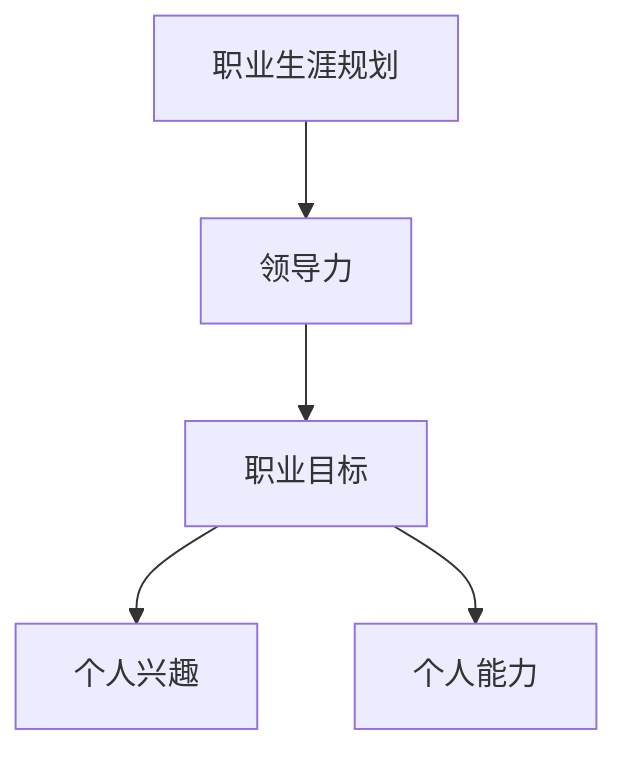

                 

# 领导力与职业生涯规划：帮助员工成长

## 关键词

领导力，职业生涯规划，职业发展，个人成长，团队合作，决策能力，沟通技巧

## 摘要

本文旨在探讨领导力与职业生涯规划在帮助员工成长中的重要作用。通过分析当前职业生涯发展的挑战，本文阐述了领导力的核心要素和类型，并深入探讨了职业生涯规划的方法和技巧。通过实际案例的展示，本文将说明如何通过有效的领导力和职业生涯规划，帮助员工在职场中实现个人价值和职业成功。

## 引言

### 1.1 问题背景

#### 1.1.1 当前职业生涯发展的挑战

在现代社会，职业生涯的发展面临着诸多挑战。首先，职业选择的多样性使得年轻人在选择职业时感到困惑，如何找到适合自己的职业方向成为了一项艰巨的任务。其次，职业发展的不稳定性也是一个重要挑战，随着经济环境的波动，许多行业和职业的稳定性受到了冲击。此外，快速发展的科技为职业发展带来了新的要求，人们需要不断学习新知识、新技能以适应职业发展的需求。

#### 1.1.2 领导力在职业生涯中的作用

领导力在职业生涯中起着至关重要的作用。一个优秀的领导者不仅能够带领团队实现目标，还能够为团队成员提供成长机会，激发他们的潜力。领导力可以帮助员工在职业生涯中建立良好的沟通、协调和团队合作能力，提高工作效率和质量。此外，领导力还可以帮助员工在职业发展中获得更多机会，如晋升、担任管理职位等。

### 1.2 职业生涯规划的意义

职业生涯规划是指个人根据自己的兴趣、能力和职业目标，制定合理的职业发展计划，并采取相应的行动来实现这些目标。职业生涯规划的意义在于：

1. 明确职业目标：通过职业生涯规划，个人可以明确自己的职业目标，从而有针对性地提升自己的能力和技能。
2. 提高职业竞争力：职业生涯规划有助于个人在职场中提高竞争力，为职业发展打下坚实基础。
3. 提升工作满意度：职业生涯规划可以使个人找到适合自己的职业，提高工作满意度，从而提高生活质量。
4. 实现个人价值：通过职业生涯规划，个人可以在职业生涯中实现个人价值，获得成就感和满足感。

### 1.3 本书内容安排

本书将从领导力和职业生涯规划两个方面展开讨论。首先，我们将介绍领导力的基本概念、核心要素及其在职业生涯中的应用。接着，我们将探讨职业生涯规划的方法和技巧，包括如何设定职业目标、评估自己的能力和兴趣、制定职业发展计划等。最后，我们将通过实际案例，展示领导力和职业生涯规划如何帮助员工实现个人价值和职业成功。

### 1.4 核心概念与联系

在本部分，我们将介绍一些核心概念，包括领导力、职业生涯规划、职业目标等。以下是一个简单的概念属性特征对比表格：

| 概念         | 定义                                                         | 属性特征对比                     |
|--------------|--------------------------------------------------------------|---------------------------------|
| 领导力       | 影响他人以实现共同目标的能力                                 | 沟通能力、决策能力、影响力等     |
| 职业生涯规划 | 个人根据自己的兴趣、能力和职业目标，制定合理的职业发展计划 | 职业目标、行动计划、反馈调整等   |
| 职业目标     | 个人在职业生涯中想要实现的成就和地位                         | 清晰性、具体性、可实现性等       |

此外，以下是一个简单的ER实体关系图架构的Mermaid流程图：

## 第一部分: 领导力基础

### 2.1 领导力概述

#### 2.1.1 领导力的定义

领导力是指影响他人以实现共同目标的能力。它不仅包括对团队成员的指导和激励，还包括协调团队成员之间的合作，以及解决团队面临的问题。

#### 2.1.2 领导力的核心要素

领导力的核心要素包括沟通能力、决策能力、影响力等。有效的沟通能力可以确保信息传达准确无误；良好的决策能力可以帮助领导者在面对复杂问题时做出明智的选择；而影响力则是领导者能够影响和激励团队成员的关键。

#### 2.1.3 领导力的重要性

领导力在职业生涯中起着至关重要的作用。首先，领导力可以帮助员工在团队中建立良好的关系，提高团队合作效率。其次，领导力可以帮助员工在职业发展中获得更多的机会，如晋升、担任管理职位等。此外，领导力还可以提升员工的工作满意度和生活质量。

### 2.2 领导力的类型

#### 2.2.1 传统领导力

传统领导力强调权威和控制，领导者通过命令和指导来管理团队。这种方式在某些情况下是有效的，但在现代职场中，这种方式可能不利于团队成员的自主性和创新精神。

#### 2.2.2 参与式领导力

参与式领导力强调团队合作和共同决策，领导者鼓励团队成员参与决策过程，并尊重团队成员的意见。这种领导方式能够激发团队成员的积极性和创造力，提高团队的整体绩效。

#### 2.2.3 情境领导力

情境领导力认为领导方式应根据团队成员的能力和环境的变化而灵活调整。领导者需要根据团队成员的成熟度选择合适的领导风格，以最大化团队的效能。

### 2.3 领导力与职业生涯规划的关系

领导力与职业生涯规划有着密切的关系。有效的领导力可以帮助员工在职业生涯规划中设定合理的目标，并为实现这些目标提供必要的支持。领导力还可以帮助员工在职场中建立人脉，获取更多的职业机会。此外，领导力还可以提升员工的工作满意度，使他们更有动力去追求职业成功。

### 2.4 领导力的核心要素之一：沟通能力

#### 2.4.1 沟通能力的重要性

沟通能力是领导力的核心要素之一。一个优秀的领导者需要具备良好的沟通能力，以确保信息的有效传递和理解。有效的沟通能力可以增强团队协作，减少误解和冲突，提高工作效率。

#### 2.4.2 提高沟通能力的技巧

为了提高沟通能力，领导者可以采取以下技巧：

1. 倾听：倾听是沟通的重要组成部分。领导者需要耐心倾听团队成员的意见和反馈，以便更好地理解他们的需求和期望。
2. 清晰表达：领导者需要用简洁明了的语言表达自己的观点，避免使用模糊的表述和术语。
3. 正面反馈：领导者应该给予团队成员积极的反馈，以鼓励他们的努力和进步。
4. 建立信任：建立信任是有效沟通的基础。领导者需要通过诚信和透明度来赢得团队成员的信任。

### 2.5 领导力的核心要素之二：决策能力

#### 2.5.1 决策能力的重要性

决策能力是领导者必须具备的另一项核心要素。领导者需要能够在面对复杂问题时做出明智的决策，并承担相应的责任。

#### 2.5.2 提高决策能力的技巧

为了提高决策能力，领导者可以采取以下技巧：

1. 收集信息：在做出决策之前，领导者需要收集尽可能多的相关信息，以便做出全面的分析和判断。
2. 制定方案：领导者需要制定多个可能的解决方案，并对每个方案进行评估和比较。
3. 风险评估：领导者需要评估每个方案可能带来的风险和影响，并采取相应的措施来降低风险。
4. 承担责任：领导者需要对自己的决策负责，并在决策失败时勇于承担责任。

## 第二部分: 职业生涯规划

### 3.1 职业生涯规划概述

职业生涯规划是指个人根据自己的兴趣、能力和职业目标，制定合理的职业发展计划，并采取相应的行动来实现这些目标。职业生涯规划的意义在于帮助个人明确职业目标，提高职业竞争力，提升工作满意度和实现个人价值。

### 3.2 职业生涯规划的方法和技巧

#### 3.2.1 设定职业目标

设定职业目标是职业生涯规划的第一步。职业目标应该明确、具体、可实现，并具有时间限制。例如，“在五年内晋升为项目经理”就是一个明确的职业目标。

#### 3.2.2 评估自己的能力和兴趣

评估自己的能力和兴趣是制定职业生涯规划的重要环节。个人需要了解自己的优势和劣势，并找到与自己的兴趣相匹配的职业领域。

#### 3.2.3 制定职业发展计划

在设定职业目标并评估自己的能力和兴趣后，个人需要制定具体的职业发展计划。职业发展计划应包括短期和长期目标，以及为实现这些目标所需的行动步骤。

#### 3.2.4 获取支持和反馈

职业生涯规划需要个人、导师、同事等多方面的支持和反馈。个人需要主动寻求帮助，并及时调整自己的职业发展计划。

### 3.3 职业生涯规划的实际案例

#### 3.3.1 案例一：小明的职业规划

小明是一名软件开发工程师，他设定了以下职业目标：

- 在两年内晋升为高级工程师
- 在五年内成为项目经理

为了实现这些目标，小明采取了以下行动：

1. 学习新技术和编程语言，提高自己的技术能力。
2. 参加项目管理课程，学习项目管理的理论和实践。
3. 积极参与团队讨论，提高自己的沟通和协作能力。

#### 3.3.2 案例二：小李的职业规划

小李是一名市场营销专员，他设定了以下职业目标：

- 在三年内晋升为营销经理
- 在五年内成为市场营销总监

为了实现这些目标，小李采取了以下行动：

1. 学习市场营销相关的理论和实践知识，提高自己的专业素养。
2. 参加营销技能培训课程，提高自己的营销能力。
3. 积极参与公司项目，积累项目管理经验。

### 3.4 职业生涯规划的意义

职业生涯规划不仅有助于个人明确职业目标，提高职业竞争力，还可以提升工作满意度和实现个人价值。通过有效的职业生涯规划，个人可以在职场中更好地发展自己，实现职业成功。

## 结论

领导力和职业生涯规划是帮助员工成长的重要工具。通过有效的领导力，员工可以在职场中建立良好的沟通、协调和团队合作能力，提高工作效率和质量。而通过职业生涯规划，员工可以明确职业目标，提高职业竞争力，实现个人价值和职业成功。因此，领导者和员工都应重视领导力和职业生涯规划，以实现个人和组织的共同发展。

### 4.1 核心结论

本文通过对领导力和职业生涯规划的分析，得出了以下核心结论：

1. 领导力在职业生涯中起着至关重要的作用，有效的领导力可以帮助员工在职场中建立良好的关系，提高工作效率和质量。
2. 职业生涯规划有助于员工明确职业目标，提高职业竞争力，实现个人价值和职业成功。
3. 领导者和员工都应重视领导力和职业生涯规划，以实现个人和组织的共同发展。

### 4.2 小结

本文首先介绍了领导力的基本概念、核心要素及其在职业生涯中的应用。接着，探讨了职业生涯规划的方法和技巧，包括如何设定职业目标、评估自己的能力和兴趣、制定职业发展计划等。最后，通过实际案例展示了领导力和职业生涯规划如何帮助员工实现个人价值和职业成功。

### 4.3 注意事项

1. 在职业生涯规划中，个人需要明确自己的职业目标，并制定具体的行动计划。
2. 领导者在激励员工时，需要注重沟通技巧和团队协作，以提升团队整体绩效。
3. 员工在职业发展中应不断学习新知识、新技能，以提高自身的职业竞争力。

### 4.4 拓展阅读

1. 《领导力：如何赢得人心》（作者：约翰·麦克斯韦尔）
2. 《职业生涯规划：实现个人职业目标》（作者：苏珊·汉普顿）
3. 《高效能人士的七个习惯》（作者：史蒂芬·柯维）

### 作者

作者：AI天才研究院/AI Genius Institute & 禅与计算机程序设计艺术/Zen And The Art of Computer Programming

