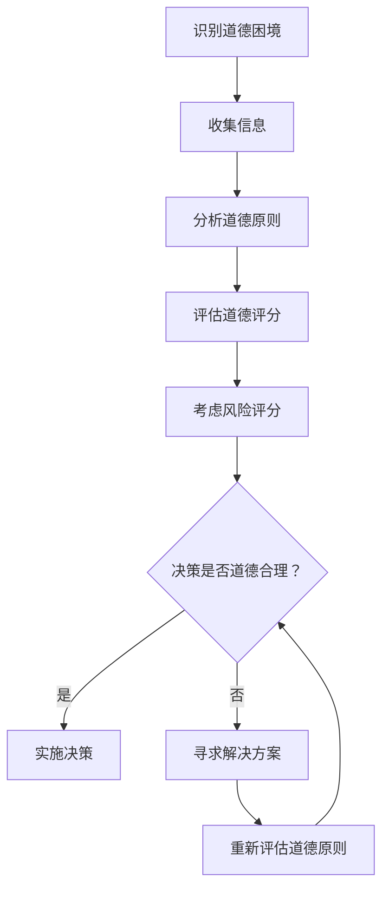

                 


# 领导力与职业道德：在灰色地带做出决策

## 关键词
- 领导力
- 职业道德
- 灰色地带决策
- 道德困境
- 决策框架
- 组织文化

## 摘要
本文旨在探讨领导力与职业道德在灰色地带决策中的重要性。我们将首先介绍领导力和职业道德的基本概念，阐述其在组织中的重要作用。随后，本文将深入探讨灰色地带决策的特点与挑战，并介绍一种实用的决策框架，帮助领导者在复杂的情境中做出符合道德规范的决策。通过实际案例分析和最佳实践，我们将为读者提供实用的指导和建议。

## 第1章 引言

### 1.1 书籍概述

《领导力与职业道德：在灰色地带做出决策》旨在帮助领导者理解和应对在职业生活中可能遇到的道德困境。随着全球化、技术变革和组织复杂性的增加，领导者面临的决策环境变得更加复杂和模糊。在这种灰色地带，传统的道德准则和规则可能不再适用，需要领导者具备更高的道德智慧和决策能力。

### 1.2 书籍目标与重要性

本书的目标是为领导者提供一个系统的框架和方法，以应对灰色地带决策中的道德困境。通过深入分析领导力和职业道德的核心概念，结合实际案例，本书旨在帮助读者：

1. 理解领导力与职业道德的基本原理。
2. 掌握在灰色地带做出道德决策的实用方法。
3. 培养良好的组织文化，促进道德决策的实施。

在当今社会，领导力和职业道德的重要性不言而喻。它们不仅影响着组织的绩效和可持续发展，还关系到员工的福祉和社会的信任。因此，掌握在灰色地带做出道德决策的能力对于每一位领导者来说都至关重要。

## 第2章 领导力与职业道德的背景

### 2.1 领导力的定义与作用

领导力是一种通过激励、引导和影响他人来实现共同目标的能力。它不仅仅关乎权力和地位，更是一种责任和担当。领导力在组织中的作用至关重要，它能够：

1. 激发员工的潜能，提高团队的整体绩效。
2. 促进创新和变革，推动组织持续发展。
3. 建立积极的组织文化，增强员工的归属感和忠诚度。

### 2.2 职业道德的内涵与重要性

职业道德是指在工作环境中，遵循的道德原则和价值观。它包括诚实、公正、责任心、尊重他人等基本要素。职业道德在组织中具有以下重要作用：

1. 建立信任和尊重，促进团队合作。
2. 提高员工满意度和忠诚度，降低离职率。
3. 塑造组织的声誉，增强市场竞争优势。

### 2.3 灰色地带决策的挑战

灰色地带决策是指在道德和法律框架不明确的情境中做出的决策。这种决策的挑战在于：

1. 道德困境：在利益冲突和道德责任之间做出选择。
2. 不确定性：信息不完整，未来结果难以预测。
3. 社会压力：外部利益相关者的期望和组织的价值观可能存在冲突。

在灰色地带决策中，领导者不仅需要遵循道德原则，还要考虑组织的长远发展和员工的福祉。这使得决策过程更加复杂和困难。

## 第3章 领导力的核心概念

### 3.1 领导力的基本理论

领导力的基本理论包括：

1. 权变理论：认为领导力是根据环境变化而调整的。
2. 行为理论：研究领导者如何影响和激励下属。
3. 人格理论：强调领导者个人特质和性格对领导效果的影响。

### 3.2 领导力的关键要素

领导力的关键要素包括：

1. 沟通能力：有效传达信息和愿景，促进团队合作。
2. 决策能力：在复杂情境中做出合理、道德的决策。
3. 情绪智力：理解和管理自己和他人的情绪，提升团队凝聚力。

### 3.3 领导力模型分析

常见的领导力模型包括：

1. 菲德勒模型：根据工作环境和领导者风格匹配度分析领导效果。
2. 戈尔登模型：分析领导者在不同情境下的决策风格。
3. 马克·汉森模型：强调领导力的发展和实践。

通过这些模型，领导者可以更好地理解自己的领导风格，并根据实际情况进行调整，以提高领导效果。

## 第4章 职业道德的基本原则

### 4.1 职业道德的基本概念

职业道德是指在工作环境中，遵循的道德原则和价值观。它包括以下几个方面：

1. 诚实与公正：坚持真实，公平对待他人。
2. 责任心：对自己的行为和决策负责。
3. 尊重他人：尊重他人的权利和尊严。

### 4.2 职业道德的核心原则

职业道德的核心原则包括：

1. 尊重隐私：保护他人的隐私信息。
2. 公平竞争：遵守市场竞争规则，不采取不正当手段。
3. 社会责任：关注社会问题，积极参与社会公益活动。

### 4.3 职业道德的挑战与应对

职业道德面临的挑战包括：

1. 利益冲突：在个人利益和职业道德之间做出选择。
2. 环境压力：来自社会、组织和同事的压力。
3. 信息不对称：缺乏足够的决策信息。

领导者应通过以下方法应对这些挑战：

1. 建立明确的道德准则和价值观。
2. 加强道德教育和培训。
3. 建立有效的监督和激励机制。

## 第5章 领导力与职业道德的结合

### 5.1 领导力与职业道德的相互作用

领导力与职业道德相互作用，共同促进组织的健康发展。领导者的道德行为能够：

1. 塑造组织文化：树立榜样，引导员工遵循职业道德。
2. 提高员工忠诚度：道德领导者能够赢得员工的信任和尊重。
3. 增强组织竞争力：道德行为有助于建立良好的社会声誉。

### 5.2 结合案例分析

以下是一个结合领导力和职业道德的案例分析：

**案例：** 一家大型企业的高管在发现公司存在财务造假行为后，决定举报。尽管这可能导致公司面临重大风险，但他认为诚信是企业发展的基石。最终，高管的行为得到了公司董事会的支持，公司得以纠正错误，恢复了市场信心。

### 5.3 领导力与职业道德的平衡

在领导力和职业道德之间寻找平衡是领导者面临的重要挑战。以下是一些建议：

1. 明确组织的核心价值观，并将其融入决策过程中。
2. 建立有效的沟通机制，确保员工了解组织的道德标准。
3. 鼓励员工提出道德问题，并提供解决方案。

## 第6章 灰色地带决策的实践

### 6.1 灰色地带决策的特点

灰色地带决策具有以下特点：

1. 道德困境：在多个道德选择之间难以取舍。
2. 不确定性：未来结果难以预测。
3. 权威缺失：道德和法律框架不明确。

### 6.2 案例解析

以下是一个灰色地带决策的案例：

**案例：** 一家互联网公司的CEO在面临是否裁员以实现利润最大化的决策时，陷入了道德困境。一方面，裁员有助于降低成本，提高公司竞争力；另一方面，裁员可能导致员工失业，影响家庭和社会稳定。最终，CEO决定通过优化业务流程和重组团队来避免裁员，体现了其对社会责任的关注。

### 6.3 决策过程中的道德考量

在灰色地带决策中，领导者应考虑以下道德因素：

1. 成本与收益：评估决策的短期和长期影响。
2. 公平性：确保决策不损害弱势群体的利益。
3. 道德责任：权衡个人责任和社会责任。

通过综合考虑这些因素，领导者可以做出更加符合道德规范的决策。

## 第7章 最佳实践与反思

### 7.1 最佳实践总结

在处理灰色地带决策时，以下最佳实践值得借鉴：

1. 明确道德准则：建立明确的道德准则，指导决策过程。
2. 加强沟通与协作：鼓励团队成员参与决策，共同探讨解决方案。
3. 考虑长期影响：在决策过程中，充分考虑决策的长期影响。

### 7.2 反思与总结

通过实践，我们可以发现，领导力与职业道德在灰色地带决策中发挥着关键作用。领导者应不断提高自身的道德素养和决策能力，以应对复杂的决策环境。

### 7.3 未来展望

随着全球化、技术变革和伦理问题的日益突出，领导力和职业道德在灰色地带决策中的重要性将越发凸显。未来，领导者需要更加关注道德问题，积极培养道德领导力，以应对不断变化的挑战。

## 第8章 结论

### 8.1 全书总结

本文探讨了领导力与职业道德在灰色地带决策中的重要性，介绍了相关的核心概念和实际应用。通过案例分析和最佳实践，我们为读者提供了实用的指导和建议。

### 8.2 对读者的建议

作为未来的领导者，希望您能够：

1. 重视道德修养，提高决策能力。
2. 建立积极的组织文化，促进道德决策的实施。
3. 关注社会问题，积极参与公益活动。

通过以上努力，您将能够更好地应对灰色地带决策，为组织的长远发展和员工的福祉贡献力量。

## 作者信息

作者：AI天才研究院/AI Genius Institute & 禅与计算机程序设计艺术 /Zen And The Art of Computer Programming

----------------------------------------------------------------

### 补充内容：数学公式、流程图与架构设计

在本文的补充部分，我们将介绍一些重要的数学公式、流程图和架构设计，以帮助读者更好地理解领导力与职业道德在灰色地带决策中的应用。

#### 数学公式

以下是用于描述灰色地带决策中一些关键概念的数学公式：

$$
\text{道德评分} = \frac{\text{道德收益}}{\text{道德成本}}
$$

该公式表示道德评分是通过道德收益和道德成本的比值来计算的。较高的道德评分意味着决策具有较高的道德合理性。

$$
\text{风险评分} = \frac{\text{潜在损失}}{\text{潜在收益}}
$$

该公式表示风险评分是通过潜在损失和潜在收益的比值来计算的。较低的风险评分意味着决策的风险较低。

#### 流程图

以下是一个用于描述灰色地带决策流程的流程图：



该流程图展示了在识别道德困境后，通过收集信息、分析道德原则、评估道德评分和风险评分，最终决定是否实施决策的步骤。

#### 架构设计

以下是一个用于描述组织架构的类图：

```mermaid
classDiagram
  LeaderClass <|-- DecisionMakerClass
  LeaderClass o-- EthicistClass
  LeaderClass o-- TeamMemberClass
  DecisionMakerClass {
    +makeDecision()
    +evaluateRisk()
  }
  EthicistClass {
    +applyEthicalPrinciples()
  }
  TeamMemberClass {
    +suggestSolutions()
  }
```

该类图展示了领导者在决策过程中与伦理学家和团队成员的互动关系。领导者负责做出决策，伦理学家提供道德原则的指导，团队成员则提出解决方案。

通过以上数学公式、流程图和架构设计的介绍，读者可以更好地理解领导力与职业道德在灰色地带决策中的应用。这些工具和方法有助于领导者更有效地识别和处理道德困境，做出符合道德规范的决策。

## 小结

本文通过对领导力与职业道德的核心概念、结合实践、灰色地带决策的挑战以及最佳实践等方面的详细探讨，为读者提供了一套系统的方法论，以帮助领导者在复杂的职业环境中做出符合道德规范的决策。以下是一些关键点：

1. **领导力与职业道德的重要性**：领导者作为组织的关键角色，其道德行为和领导力直接影响到组织的文化、绩效和员工福祉。
2. **灰色地带决策的特点与挑战**：在道德和法律框架不明确的情境中，领导者需要具备更高的道德智慧和决策能力。
3. **决策框架的应用**：通过识别道德困境、收集信息、分析道德原则、评估道德评分和风险评分，领导者可以更有效地处理灰色地带决策。
4. **最佳实践**：建立明确的道德准则、加强沟通与协作、考虑长期影响等最佳实践有助于提升决策的质量和道德合理性。

在未来，随着全球化和技术变革的加速，领导者需要持续关注道德问题，不断提升自身的道德素养和决策能力，以应对不断变化的挑战。

### 注意事项

1. **道德困境的处理**：在遇到道德困境时，领导者应保持冷静，深入分析道德原则，权衡各种因素，做出符合道德规范的决策。
2. **员工参与**：鼓励员工参与决策过程，倾听他们的意见和建议，可以促进团队合作，提高决策的合理性和执行力。
3. **持续学习**：领导力与职业道德是一个不断发展的领域，领导者应持续学习新的理论和实践，以适应不断变化的环境。

### 拓展阅读

1. **《领导力：实践篇》**：斯蒂芬·罗宾斯著，详细介绍了领导力的实践方法和技巧。
2. **《职业道德：理论与实践》**：托马斯·莫斯著，探讨了职业道德的基本原则和应用。
3. **《道德困境：领导者的决策挑战》**：理查德·德特曼著，通过案例研究分析了领导者在道德困境中的决策过程。

通过以上拓展阅读，读者可以进一步深入了解领导力与职业道德的相关理论和实践，提升自己的领导能力和道德素养。

