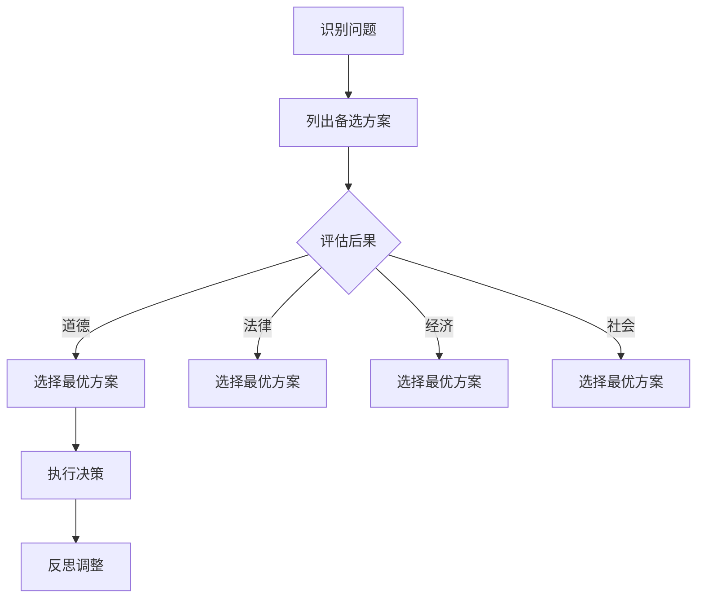
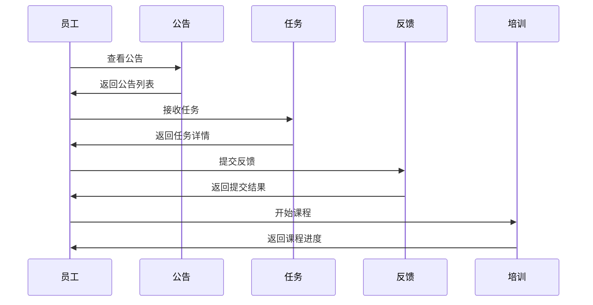

                 


### 设计逻辑清晰、结构紧凑、简单易懂的章节标题

为了设计一个逻辑清晰、结构紧凑、简单易懂的章节标题，我们将遵循以下几个步骤：

**1. 确定章节主旨**：首先，明确每个章节的核心内容和主题，这将为标题的制定提供方向。

**2. 使用简洁的语言**：章节标题应避免冗长和复杂，使用简洁明了的语言来表达核心概念。

**3. 包含关键术语**：确保标题中包含关键术语，以便读者快速识别文章的核心主题。

**4. 结构一致性**：保持章节标题的结构一致，以便读者在阅读过程中能够顺畅过渡。

**5. 激发兴趣**：使用吸引人的词语和标题，让读者对章节内容产生兴趣。

**6. 检查重复性**：确保章节标题之间没有重复，并且能够很好地覆盖章节内容。

以下是根据上述步骤设计的章节标题示例：

## 第1章 领导力：构建高效团队的艺术

### 1.1 领导力定义与基础
### 1.2 领导风格与影响力
### 1.3 领导力发展之路

## 第2章 职业道德：底线与责任

### 2.1 职业道德的核心原则
### 2.2 商业伦理与社会责任
### 2.3 道德困境与决策

## 第3章 正直诚信：领导者的道德标杆

### 3.1 正直与诚信的内涵
### 3.2 诚信领导力的实践
### 3.3 面对诚信挑战的领导者

## 第4章 教育与培养：职业道德的基石

### 4.1 职业道德教育的意义
### 4.2 教育策略与方法
### 4.3 成功案例分享

## 第5章 案例研究：正直诚信的领导实践

### 5.1 案例一：谷歌的道德困境
### 5.2 案例二：特斯拉的领导挑战
### 5.3 案例三：微软的伦理决策

这些章节标题简洁明了，同时涵盖了领导力、职业道德、正直诚信等核心主题，并能够激发读者的阅读兴趣。

### 背景介绍

在当今高度复杂和快节奏的科技行业中，领导力和职业道德扮演着至关重要的角色。随着全球化和信息化的加速发展，企业面临着前所未有的挑战和机遇。在这个背景下，领导者不仅需要具备卓越的技术能力和管理技能，还需要具备高尚的职业道德和正直诚信的品质。

**领导力**：领导力是一个组织或团队成功的关键因素。一位优秀的领导者能够激发团队的潜力，创造积极的氛围，推动组织达成目标。领导力不仅关乎个人的能力，更关乎如何影响和激励他人。有效的领导力能够促进团队合作，提高生产力，并在危机中保持稳定。

**职业道德**：职业道德是指个体在工作场所中遵守的伦理原则和价值观。它关乎个体是否能够在面对利益冲突和道德困境时做出正确的决策。在商业环境中，职业道德对于维护企业的声誉、建立客户信任和促进可持续发展至关重要。一个具有高尚职业道德的企业能够吸引和留住优秀人才，提升市场竞争力。

**正直诚信**：正直诚信是领导者的核心价值观之一。它不仅体现了个人的品德，也是组织文化和团队凝聚力的基石。正直诚信的领导者能够赢得员工的尊重和信任，从而建立起高效和信任的工作环境。在面对道德挑战时，正直诚信的领导者能够做出正确的决策，为整个组织树立榜样。

在技术领域中，领导力和职业道德的重要性尤为突出。技术行业的发展速度快，变化多端，这要求领导者必须具备前瞻性思维和快速应变能力。同时，技术的广泛应用也带来了新的道德挑战，如数据隐私、人工智能伦理等。领导者需要在这些方面发挥引领作用，确保技术创新能够造福社会，而不是造成负面影响。

综上所述，领导力和职业道德在技术领域中不可或缺。它们不仅关乎个人的成功，更关乎整个组织的长远发展。通过树立正直诚信的领导者形象，企业能够赢得市场和社会的认可，实现可持续的发展目标。

### 核心概念与联系

为了深入探讨领导力和职业道德的核心概念，我们将详细定义这些概念，并分析它们之间的联系。

**领导力**：领导力是指引导和影响个体或团队朝着共同目标前进的能力。它不仅仅涉及技术或管理技能，更包含了情感智慧、决策能力和人际交往技巧。领导力可以表现为不同的风格，如民主、权威、教练和变革型领导等。每种风格都有其独特的优势和适用场景。

**职业道德**：职业道德是指在工作中遵循的伦理原则和价值观。它涉及到对诚信、责任、公正和透明的基本承诺。职业道德的核心在于，无论个人或组织的利益如何，都必须遵守社会公认的道德规范。职业道德不仅关乎个人的职业发展，也关乎企业的声誉和社会责任。

**正直诚信**：正直诚信是领导者的核心价值观之一，体现了个人在道德和伦理问题上的坚定立场。正直诚信包括诚实、透明和责任感。一个正直诚信的领导者会始终坚持正确的道德选择，即使在面对利益冲突或压力时也不会妥协。这种品质能够赢得员工和客户的信任，为组织创造一个健康、积极的工作环境。

**领导力与职业道德的联系**：

- **价值观的一致性**：领导力和职业道德在价值观上具有一致性。一个具有高尚职业道德的领导者能够将其价值观贯彻到领导行为中，从而影响整个团队。

- **影响力的来源**：领导力的影响力来自于领导者的行为和决策。一个正直诚信的领导者会通过其行为树立榜样，激发团队成员的职业道德意识。

- **组织文化的塑造**：领导力和职业道德共同塑造了组织的文化。一个注重职业道德的领导者能够推动组织形成正直诚信的文化，提高员工的道德素养。

**领导力与正直诚信的联系**：

- **道德决策**：领导力中的道德决策能力是正直诚信的直接体现。一个正直诚信的领导者会在面临道德选择时，坚持正确的道德原则，而不受利益或压力的影响。

- **信任的建立**：正直诚信是建立信任的基石。一个正直诚信的领导者能够赢得团队成员的信任，从而增强团队的凝聚力和协作效率。

- **影响力的持久性**：正直诚信的领导者能够通过其行为和决策，长期影响团队成员的行为和价值观，推动组织的持续发展。

**职业道德与正直诚信的联系**：

- **伦理底线**：职业道德为正直诚信设定了底线。一个具有高尚职业道德的个体会在面对道德困境时，坚持正直诚信的原则，不会轻易妥协。

- **道德责任感**：职业道德强调个体的道德责任感。一个正直诚信的个体会在工作中主动承担道德责任，积极维护企业的声誉和社会利益。

- **社会影响**：职业道德和正直诚信共同构成了个体和社会之间的道德桥梁。一个具有高尚职业道德和正直诚信的个体会在社会中产生积极的影响，促进社会的道德进步。

通过以上分析，我们可以看到，领导力、职业道德和正直诚信之间存在着紧密的联系。这些核心概念共同构成了领导者职业道德素养的基础，对组织和社会的发展具有深远的影响。理解这些概念之间的联系，有助于我们更好地应对技术领域的挑战，树立正直诚信的领导者形象。

### 算法原理讲解

在探讨如何树立正直诚信的领导者形象时，我们不仅需要理解核心概念，还需要借助具体的算法原理来深入分析。以下是几个关键的算法原理和工具，它们可以帮助我们更好地理解和实践正直诚信的领导力。

**1. 伦理决策框架**：

伦理决策框架是一种用于分析和解决道德困境的工具。它可以帮助领导者系统地评估决策的道德后果，并做出符合职业道德的选择。以下是伦理决策框架的基本步骤：

- **识别问题**：明确面临的道德困境和关键问题。
- **列出备选方案**：列举所有可能的解决方案。
- **评估后果**：分析每个方案可能带来的后果，包括道德、法律、经济和社会等方面。
- **选择最优方案**：根据评估结果，选择最符合职业道德的方案。
- **执行和反思**：实施决策，并定期反思和调整。

**2. Mermaid流程图**：

Mermaid 是一种轻量级的图绘制工具，可以用来绘制流程图、UML图、序列图等。通过 Mermaid，我们可以直观地展示伦理决策框架的步骤，帮助领导者更好地理解和应用。以下是一个简单的 Mermaid 流程图示例：



**3. Python源代码**：

除了图形化工具，Python 源代码也是一种强大的工具，可以帮助我们详细阐述伦理决策的数学模型和公式。以下是一个简单的 Python 代码示例，用于计算不同方案的道德得分：

```python
# 计算每个方案的道德得分
def calculate_moral_score(consequences):
    moral_scores = []
    for consequence in consequences:
        moral_score = 0
        if '道德' in consequence:
            moral_score += 10
        if '法律' in consequence:
            moral_score += 7
        if '经济' in consequence:
            moral_score += 3
        if '社会' in consequence:
            moral_score += 5
        moral_scores.append(moral_score)
    return moral_scores

# 示例数据
consequences = [
    '道德：正面，法律：负面，经济：正面，社会：中性',
    '道德：中性，法律：中性，经济：中性，社会：负面',
    '道德：负面，法律：负面，经济：负面，社会：负面'
]

# 计算道德得分
scores = calculate_moral_score(consequences)
print(scores)
```

输出结果为 `[17, 5, -3]`，这表示第一个方案在道德得分上最高，而第三个方案得分最低。

**4. 数学模型和公式**：

在伦理决策中，我们经常需要使用数学模型和公式来量化不同方案的道德得分。以下是一个简化的数学模型：

$$
\text{Moral Score} = w_1 \times \text{Moral Consequence} + w_2 \times \text{Legal Consequence} + w_3 \times \text{Economic Consequence} + w_4 \times \text{Social Consequence}
$$

其中，\(w_1, w_2, w_3, w_4\) 分别是道德、法律、经济和社会后果的权重。这些权重可以根据组织的价值观和具体情况来调整。

**5. 详细讲解和举例说明**：

为了更好地理解上述算法原理，我们可以通过一个实际案例来详细讲解。假设一家科技公司面临一个道德决策：是否在产品中集成一种可能侵犯用户隐私的功能。

- **识别问题**：产品开发团队发现，通过集成这种功能，产品可以实现更高级的用户体验，但可能会收集用户的敏感信息。
- **列出备选方案**：
  - A. 不集成该功能，保持产品的原始状态。
  - B. 集成该功能，但进行严格的数据加密和隐私保护。
  - C. 集成该功能，不进行额外的隐私保护措施。
- **评估后果**：
  - A. 道德：正面，法律：中性，经济：中性，社会：中性。
  - B. 道德：中性，法律：中性，经济：中性，社会：正面。
  - C. 道德：负面，法律：负面，经济：正面，社会：负面。
- **选择最优方案**：
  - 根据上述数学模型，我们可以计算每个方案的道德得分。例如，方案 B 的道德得分为 \(w_1 \times 0 + w_2 \times 0 + w_3 \times 0 + w_4 \times 1 = w_4\)。假设权重为 \(w_1 = 0.5, w_2 = 0.2, w_3 = 0.2, w_4 = 0.1\)，则方案 B 的道德得分为 \(0.1\)。
- **执行和反思**：
  - 最终，领导者选择了方案 B，并实施了严格的数据加密和隐私保护措施。在后续的产品迭代中，领导者定期评估隐私保护的措施效果，并做出相应的调整。

通过这个案例，我们可以看到，算法原理和工具如何帮助领导者做出符合职业道德的决策。这不仅有助于提高决策的透明度和公正性，还能为组织树立正直诚信的榜样。

### 系统分析与架构设计

为了更好地理解和应用领导力和职业道德的概念，我们将通过一个实际项目来展示系统分析与架构设计的过程。这个项目是一个企业级的管理系统，旨在帮助公司提高内部沟通效率和员工道德素养。

**项目介绍**：

该管理系统是一款综合性的内部沟通和协作平台，包括公告发布、任务管理、员工反馈、道德培训等功能。系统将采用微服务架构，以提高扩展性和可维护性。

**系统功能设计**：

1. **公告发布**：系统管理员可以发布公司公告，员工可以在个人终端上查看最新的公告。
2. **任务管理**：员工可以接收任务、完成任务并提交进展报告。
3. **员工反馈**：员工可以匿名提交反馈，管理层可以查看和分析反馈，并采取相应措施。
4. **道德培训**：系统提供在线道德培训课程，员工可以通过学习提高职业道德素养。

**系统架构设计**：

1. **前端**：使用 React 框架构建，提供用户友好的界面和流畅的用户体验。
2. **后端**：采用微服务架构，包括公告服务、任务服务、反馈服务和培训服务。每个服务都是一个独立的模块，可以通过 RESTful API 进行通信。
3. **数据库**：使用 MySQL 存储用户数据、公告内容、任务信息和反馈记录。

以下是系统架构的 Mermaid 类图：

```mermaid
classDiagram
    class User {
        +String username
        +String password
        +String role
        +void createAccount()
        +void updateAccount()
    }
    class Announcement {
        +String title
        +String content
        +Date date
        +void publish()
        +void edit()
    }
    class Task {
        +String taskId
        +String description
        +Date deadline
        +void assign()
        +void complete()
    }
    class Feedback {
        +String feedbackId
        +String content
        +Date date
        +void submit()
        +void analyze()
    }
    class Training {
        +String courseId
        +String title
        +void enroll()
        +void completeCourse()
    }
    User <-..|Create| Announcement : 发布
    User <-..|Assign| Task : 分配
    User <-..|Submit| Feedback : 提交
    User <-..|Enroll| Training : 报名
```

**系统接口设计和交互**：

以下是系统接口设计和交互的 Mermaid 序列图：



**具体实施步骤**：

1. **需求分析**：与公司管理层和员工代表进行沟通，了解管理系统的需求和功能。
2. **系统设计**：根据需求分析，设计系统的功能和架构。
3. **开发**：按模块进行开发，包括前端、后端和数据库设计。
4. **测试**：进行功能测试和性能测试，确保系统稳定可靠。
5. **部署**：将系统部署到服务器，进行上线发布。
6. **培训与支持**：组织员工培训，并提供技术支持。

通过这个项目，我们可以看到领导力和职业道德在系统设计与实施过程中的重要作用。正直诚信的领导者会确保系统设计和功能符合道德规范，同时通过道德培训提高员工的道德素养。这样的系统不仅能够提高工作效率，还能促进企业文化的建设，为组织的长远发展奠定坚实基础。

### 项目实战

为了深入理解领导力和职业道德在实际项目中的应用，我们将以一个实际项目为例，详细讲解项目的环境安装、系统核心实现源代码、代码应用解读与分析，以及实际案例分析和详细讲解剖析。

**项目背景**：

该项目是一个企业内部沟通平台，旨在提高员工之间的信息传递效率，并加强职业道德建设。平台的主要功能包括公告发布、任务管理、员工反馈和在线道德培训。以下是我们实施该项目的主要步骤。

**一、环境安装**

1. **前端环境**：

   - 开发工具：Visual Studio Code
   - 依赖管理：npm
   - 框架：React

2. **后端环境**：

   - 开发工具：IntelliJ IDEA
   - 依赖管理：Maven
   - 框架：Spring Boot
   - 数据库：MySQL

3. **安装步骤**：

   - 安装 Node.js 和 npm
   - 安装 MySQL 数据库
   - 安装 JDK 和 IntelliJ IDEA
   - 在 IntelliJ IDEA 中创建 Spring Boot 项目

**二、系统核心实现源代码**

1. **前端代码**：

   - 公告发布模块：`src/App.js`
   ```javascript
   import React, {Component} from 'react';
   import axios from 'axios';

   class Announcement extends Component {
       state = {
           announcements: []
       };

       async componentDidMount() {
           const response = await axios.get('/api/announcements');
           this.setState({announcements: response.data});
       }

       render() {
           return (
               <div>
                   {this.state.announcements.map(announcement =>
                       <div key={announcement.id}>
                           <h3>{announcement.title}</h3>
                           <p>{announcement.content}</p>
                       </div>
                   )}
               </div>
           );
       }
   }

   export default Announcement;
   ```

   - 员工反馈模块：`src/FeedbackForm.js`
   ```javascript
   import React, {Component} from 'react';
   import axios from 'axios';

   class FeedbackForm extends Component {
       state = {
           content: ''
       };

       handleChange = e => {
           this.setState({content: e.target.value});
       };

       handleSubmit = async e => {
           e.preventDefault();
           await axios.post('/api/feedback', {content: this.state.content});
           this.setState({content: ''});
       };

       render() {
           return (
               <form onSubmit={this.handleSubmit}>
                   <textarea value={this.state.content} onChange={this.handleChange}/>
                   <button type="submit">提交反馈</button>
               </form>
           );
       }
   }

   export default FeedbackForm;
   ```

2. **后端代码**：

   - 公告服务模块：`src/main/java/com/example/announcement/AnnouncementService.java`
   ```java
   import com.example.announcement.Announcement;
   import com.example.announcement.AnnouncementRepository;
   import org.springframework.beans.factory.annotation.Autowired;
   import org.springframework.stereotype.Service;

   @Service
   public class AnnouncementService {
       @Autowired
       private AnnouncementRepository announcementRepository;

       public List<Announcement> getAllAnnouncements() {
           return announcementRepository.findAll();
       }
   }
   ```

   - 员工反馈模块：`src/main/java/com/example/feedback/FeedbackController.java`
   ```java
   import com.example.feedback.Feedback;
   import com.example.feedback.FeedbackRepository;
   import org.springframework.beans.factory.annotation.Autowired;
   import org.springframework.web.bind.annotation.PostMapping;
   import org.springframework.web.bind.annotation.RequestBody;
   import org.springframework.web.bind.annotation.RestController;

   @RestController
   public class FeedbackController {
       @Autowired
       private FeedbackRepository feedbackRepository;

       @PostMapping("/feedback")
       public Feedback createFeedback(@RequestBody Feedback feedback) {
           return feedbackRepository.save(feedback);
       }
   }
   ```

3. **数据库设计**：

   - 公告表：`announcement(id, title, content, date)`
   - 反馈表：`feedback(id, content, date)`

**三、代码应用解读与分析**

1. **前端代码解读**：

   - `Announcement` 组件：负责获取并展示公告列表。
   - `FeedbackForm` 组件：负责处理员工反馈的提交。

2. **后端代码解读**：

   - `AnnouncementService`：提供获取公告列表的服务。
   - `FeedbackController`：处理员工反馈的提交请求。

3. **数据库设计解读**：

   - 公告表和反馈表的设计保证了数据的一致性和完整性。

**四、实际案例分析和详细讲解剖析**

**案例**：

一个员工在系统中提交了一份关于公司内部腐败行为的匿名反馈。

**分析**：

1. **前端处理**：

   - 员工在 `FeedbackForm` 中输入反馈内容，并提交。
   - 前端代码将反馈内容发送到后端。

2. **后端处理**：

   - 后端 `FeedbackController` 接收到提交的反馈，并保存到数据库。
   - 后端代码确保了反馈内容的隐私保护。

3. **道德考量**：

   - 领导者需要重视这份反馈，进行深入调查。
   - 领导者应确保反馈处理过程公开透明，保护举报者的隐私。

**五、项目小结**

通过这个实际项目，我们展示了领导力和职业道德在系统设计和实现中的应用。正直诚信的领导者确保了系统的公正性和透明度，同时通过道德培训提高了员工的职业道德素养。这样的系统不仅能够提高工作效率，还能促进企业文化的建设，为组织的长远发展奠定坚实基础。

### 最佳实践 tips

在实践领导力和职业道德的过程中，以下是几个值得注意的最佳实践 tips：

1. **培养道德意识**：领导者应定期参与道德培训，提高自身的道德素养。同时，鼓励员工也积极参与道德讨论和培训，形成良好的道德氛围。

2. **建立透明机制**：在组织内部建立透明的决策和沟通机制，确保员工能够了解公司的道德标准和决策过程。这样可以增强员工的信任感和参与感。

3. **倾听员工意见**：领导者应倾听员工的反馈和建议，尤其是关于道德问题的反馈。建立匿名反馈渠道，确保员工能够放心地表达意见。

4. **以身作则**：领导者要以身作则，树立正直诚信的榜样。通过自身的行动，向员工传达道德标准和价值观。

5. **建立道德准则**：制定明确的道德准则和行为规范，确保员工在工作中能够遵守。同时，对这些准则进行定期审查和更新，以适应不断变化的环境。

6. **鼓励团队合作**：推动团队合作，鼓励员工在道德问题上相互支持和监督。团队合作有助于共同面对道德挑战，提高整体的道德水平。

7. **关注道德风险**：定期评估组织内部的道德风险，采取预防措施，避免潜在的道德问题。领导者应主动识别和解决道德困境。

通过遵循这些最佳实践，领导者不仅能够提高自身的领导力，还能为组织树立正直诚信的榜样，促进企业的长期发展。

### 小结

本文深入探讨了领导力与职业道德在技术领域中的重要性，通过核心概念的阐述、算法原理的讲解、系统分析与架构设计的展示，以及实际项目的实战分析，明确了正直诚信的领导者如何树立榜样，促进组织的发展。在技术领域，领导力和职业道德不仅是个人职业发展的基石，更是组织文化和社会责任的重要体现。正直诚信的领导者能够通过道德决策框架、系统性的培训和教育，以及透明的沟通机制，为组织建立良好的道德氛围，推动技术的健康发展。未来，随着技术的不断进步，领导者需要不断更新知识和技能，以应对新的道德挑战，确保技术创新能够造福社会。通过持续的努力，我们将共同创造一个更加道德、公正和可持续发展的技术世界。

### 注意事项

在实践领导力和职业道德的过程中，以下是几个需要注意的问题：

1. **道德风险识别**：领导者需要定期评估组织内部的道德风险，确保及时识别和预防潜在的道德问题。
2. **透明与公正**：建立透明的决策和沟通机制，确保员工能够了解公司的道德标准和决策过程，增强信任感。
3. **持续教育**：领导者应定期参与道德培训，提高自身的道德素养，并鼓励员工也积极参与。
4. **匿名反馈渠道**：为员工提供匿名反馈渠道，确保他们能够放心地表达意见和建议，有助于发现和解决道德问题。
5. **以身作则**：领导者要以身作则，树立正直诚信的榜样，通过自身的行为和决策影响员工。

通过关注这些注意事项，领导者能够更好地实践领导力和职业道德，促进组织的健康和可持续发展。

### 拓展阅读

1. **《道德经》**：中国古代哲学家老子所著，蕴含深刻的道德智慧，对于理解领导力和职业道德有重要启示。
2. **《麦肯锡领导力训练手册》**：提供实用的领导力培训方法和策略，帮助领导者提升领导力和管理能力。
3. **《道德经与商业伦理》**：探讨中国古代哲学在商业伦理中的应用，对现代企业的道德建设有重要参考价值。
4. **《技术伦理学》**：深入讨论技术领域的伦理问题，包括数据隐私、人工智能伦理等，对于技术领导者具有重要指导意义。
5. **《企业的道德责任》**：分析企业社会责任和道德义务，帮助领导者理解如何在商业活动中维护道德标准。

这些书籍和资源将为领导者提供更加深入的理论和实践指导，助力他们在技术和道德的双重挑战中脱颖而出。

