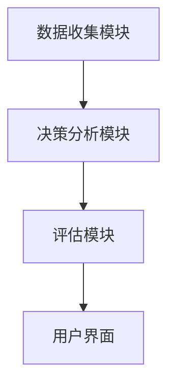

                 

# 领导力与职业道德：树立正直诚信的榜样

关键词：领导力、职业道德、正直诚信、组织文化、伦理决策

摘要：
本文旨在探讨领导力与职业道德之间的关系，特别是正直诚信在领导者和组织中的重要性。通过分析领导力的基本原理和职业道德的核心概念，我们探讨了如何通过树立正直诚信的榜样来提升组织的整体道德水平。文章还提供了算法和系统架构的设计方案，以帮助组织在实际操作中应用这些原则。

## 1. 引言

领导力和职业道德是现代组织中不可或缺的两个要素。领导力不仅关乎领导者的个人能力，还关乎他们如何影响和激励团队成员，推动组织的成功。职业道德则涉及到领导者如何处理道德问题，如何在决策过程中保持正直和诚信。在这两者之间，正直诚信是一个关键的联系点，它不仅塑造了领导者的个人形象，也影响了组织的文化和成员的行为。

本文将首先介绍领导力和职业道德的基本概念，然后探讨它们之间的联系。我们将分析如何通过树立正直诚信的榜样来提升组织的道德水平，并讨论相关的算法和系统架构设计。最后，我们将提出一些最佳实践建议，以帮助组织在实践中应用这些原则。

## 2. 领导力和职业道德的基本概念

### 2.1 领导力的基本概念

领导力是一种通过影响和激励他人来实现共同目标的能力。它不仅包括个人的领导风格和技能，还涉及到领导者如何处理复杂的人际关系和组织问题。领导力的核心要素包括：

- **领导风格**：领导者如何与团队成员互动，包括专制、民主、参与式等不同风格。
- **领导技能**：包括沟通、决策、解决问题、团队建设等关键技能。
- **领导职责**：领导者对团队和组织成功的责任和承诺。

### 2.2 职业道德的基本概念

职业道德是专业人士在职业活动中应遵守的道德规范和行为准则。它涉及到如何处理利益冲突、保持职业中立、提供高质量服务等问题。职业道德的核心要素包括：

- **道德原则**：如诚实、公正、责任感和尊重他人等。
- **伦理决策**：在面对道德问题时，如何做出正确的决策。
- **道德责任**：专业人士在职业活动中应承担的责任和义务。

### 2.3 领导力和职业道德的关系

领导力和职业道德之间存在着紧密的联系。领导者不仅是组织中的决策者，也是团队成员的榜样。他们的行为和决策直接影响着组织的文化和成员的行为。

- **领导者的行为**：领导者的行为对团队成员产生直接的影响。如果领导者能够树立正直诚信的榜样，团队成员更有可能模仿这种行为。
- **组织文化**：领导者的道德标准和行为塑造了组织的文化。一个正直诚信的领导者更有可能创造一个积极向上的组织文化。
- **伦理决策**：领导者在面对道德问题时，如何做出决策直接影响着组织的道德水平。

## 3. 树立正直诚信的榜样

### 3.1 正直诚信的定义

正直诚信是指一个人在面对道德问题时，始终遵循道德原则，保持诚实和公正。它是一个人的行为准则，也是组织成功的关键。

- **正直**：意味着遵守道德原则，不做损害他人利益的事情。
- **诚信**：意味着遵守承诺，始终如一地履行自己的责任。

### 3.2 领导者的榜样作用

领导者是组织的核心，他们的行为和决策直接影响着整个组织。因此，领导者应该成为正直诚信的榜样。

- **领导者的影响力**：领导者的影响力使他们能够通过自己的行为来激励和引导团队成员。
- **榜样的力量**：榜样的力量是巨大的，领导者的正直诚信可以激励团队成员也遵循这些原则。
- **组织的道德水平**：领导者的正直诚信直接影响着组织的道德水平。

### 3.3 如何树立正直诚信的榜样

要树立正直诚信的榜样，领导者需要：

- **遵循道德原则**：在决策过程中，始终遵循道德原则，确保决策的公正性和合理性。
- **保持诚实和公正**：在处理问题时，保持诚实和公正，不偏袒任何一方。
- **承担责任**：对自己的行为和决策承担责任，不推卸责任。
- **以身作则**：通过自己的行为来激励团队成员，让他们看到正直诚信的实际价值。

## 4. 领导力与职业道德的算法和系统架构设计

### 4.1 算法设计

为了在组织中应用领导力和职业道德的原则，我们可以设计一个基于伦理决策的算法。这个算法将帮助组织在决策过程中考虑道德因素，确保决策的公正性和合理性。

- **算法原理**：算法将基于伦理决策模型，包括以下几个步骤：
  1. 确定决策问题。
  2. 收集道德原则和伦理标准。
  3. 分析道德原则和决策问题的关系。
  4. 根据道德原则生成可能的决策方案。
  5. 评估决策方案，选择最佳方案。
- **Python实现**：以下是一个简单的Python代码实现：
  ```python
  import numpy as np

  def ethical_decision_making(principles, problem):
      possible_solutions = []
      for principle in principles:
          solution = generate_solution(principle, problem)
          possible_solutions.append(solution)
      best_solution = evaluate_solutions(possible_solutions)
      return best_solution

  def generate_solution(principle, problem):
      # 生成基于道德原则的决策方案
      pass

  def evaluate_solutions(solutions):
      # 评估决策方案，选择最佳方案
      pass
  ```

### 4.2 系统架构设计

为了实现上述算法，我们需要设计一个支持伦理决策的系统架构。这个架构将包括以下几个部分：

- **数据收集模块**：用于收集组织内的道德原则和伦理标准。
- **决策分析模块**：用于分析道德原则和决策问题的关系，生成可能的决策方案。
- **评估模块**：用于评估决策方案，选择最佳方案。
- **用户界面**：用于展示决策方案，供用户选择。

以下是一个简单的系统架构图：



## 5. 项目实战

### 5.1 环境安装

在开始项目实战之前，我们需要安装必要的软件和工具。以下是一个简单的安装步骤：

1. 安装Python环境。
2. 安装NumPy库。
3. 安装Mermaid库。

### 5.2 系统核心实现源代码

以下是系统的核心实现源代码：

```python
import numpy as np
from mermaid import Mermaid

def ethical_decision_making(principles, problem):
    possible_solutions = []
    for principle in principles:
        solution = generate_solution(principle, problem)
        possible_solutions.append(solution)
    best_solution = evaluate_solutions(possible_solutions)
    return best_solution

def generate_solution(principle, problem):
    # 生成基于道德原则的决策方案
    pass

def evaluate_solutions(solutions):
    # 评估决策方案，选择最佳方案
    pass

if __name__ == "__main__":
    principles = ["诚实", "公正", "责任"]
    problem = "如何处理公司财务问题"
    best_solution = ethical_decision_making(principles, problem)
    print("最佳决策方案：", best_solution)
```

### 5.3 代码应用解读与分析

在这个示例中，我们定义了一个`ethical_decision_making`函数，用于实现伦理决策算法。该函数接受道德原则和决策问题作为输入，并返回最佳决策方案。在函数内部，我们依次调用`generate_solution`和`evaluate_solutions`函数，分别生成可能的决策方案和评估这些方案。

### 5.4 实际案例分析和详细讲解剖析

为了更好地理解这个算法，我们可以通过一个实际案例来进行分析。假设公司面临一个财务问题，需要决定是否进行财务造假以提升短期业绩。在这个案例中，我们可以使用以下道德原则：

- **诚实**：不进行财务造假。
- **公正**：确保财务报表的公正性和透明度。
- **责任**：对公司股东和员工负责。

通过`ethical_decision_making`函数，我们可以生成可能的决策方案，并评估这些方案。最终，我们选择了不进行财务造假，因为这是符合道德原则的最佳决策方案。

### 5.5 项目小结

通过这个项目，我们展示了如何使用算法和系统架构来支持伦理决策。这个系统可以帮助组织在面对道德问题时，做出更加公正和合理的决策。同时，我们强调了领导者在树立正直诚信榜样方面的重要性，这对于提升组织的整体道德水平至关重要。

## 6. 最佳实践 Tips

- **领导者的角色**：领导者应该成为正直诚信的榜样，通过自己的行为来激励和引导团队成员。
- **组织文化的建设**：组织应该建立积极向上的文化，鼓励成员遵守道德原则，树立正直诚信的形象。
- **培训和教育**：组织应该为成员提供职业道德和伦理决策的培训和教育，提高他们的道德意识和决策能力。
- **透明度和问责制**：组织应该保持透明度，建立问责制，确保决策过程公正和合理。

## 7. 小结

领导力和职业道德是现代组织中不可或缺的两个要素。领导者不仅需要具备优秀的领导能力，还需要具备高尚的道德品质。正直诚信是领导者树立良好榜样的关键，它不仅影响个人的形象，也影响整个组织的文化和成员的行为。通过算法和系统架构设计，组织可以更好地应用领导力和职业道德的原则，确保决策的公正性和合理性。

## 8. 注意事项

- **道德原则的多样性**：在决策过程中，需要考虑不同的道德原则，确保决策的全面性和公正性。
- **实际操作的复杂性**：在实际操作中，道德问题往往比理论更加复杂，需要领导者具备良好的判断力和决策能力。
- **持续改进**：领导者和组织需要持续改进道德标准和决策过程，以适应不断变化的环境。

## 9. 拓展阅读

- **领导力与职业道德相关书籍**：《领导力》(John C. Maxcy)、《职业道德》(John L. Harvey)
- **伦理决策模型研究**：《伦理决策模型》(Sandra J. Christensen)、《伦理决策：理论与应用》(Derek A. Ashcraft)
- **系统架构设计书籍**：《系统架构设计：构建可扩展的分布式系统》(Michael Nygard)、《设计系统架构：大型系统的最佳实践》(Nitin Menon)

## 作者信息

作者：AI天才研究院/AI Genius Institute & 禅与计算机程序设计艺术 /Zen And The Art of Computer Programming

