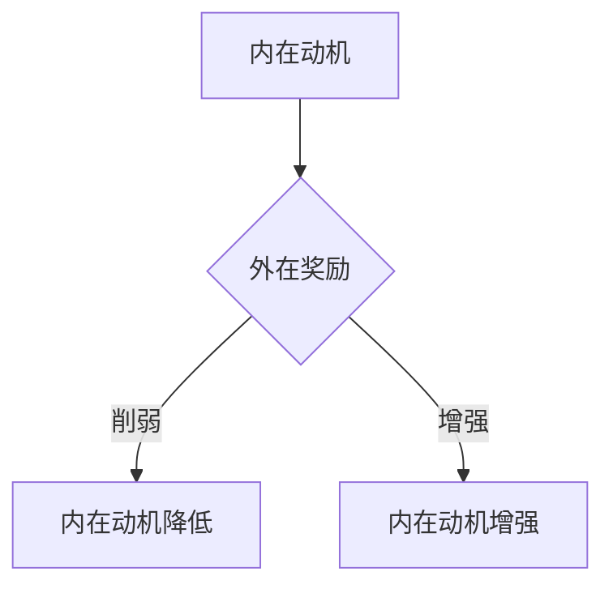
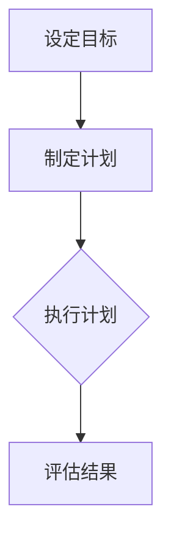
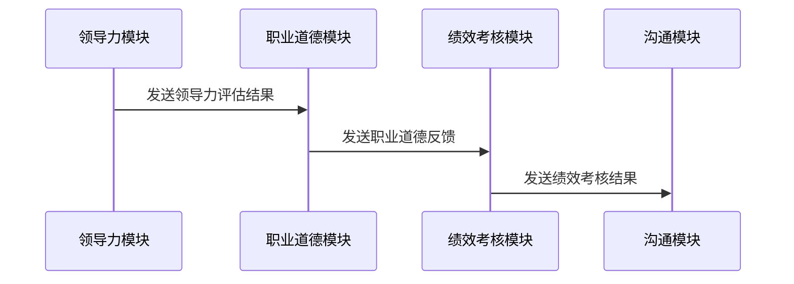

                 

## 1. 背景介绍

### 核心概念术语说明

在探讨《领导力与职业道德：树立正直诚信的榜样》这一主题时，首先需要对以下几个核心概念进行定义和解释。

**领导力**：领导力指的是一种通过影响力激励他人、引导团队达成目标的能力。它不仅涉及技术或专业领域的知识，还包括人际交往、决策能力、情感智慧等多方面的素养。

**职业道德**：职业道德是指在工作环境中，个体应当遵循的道德准则和职业操守。它涉及到正直、诚信、公平、责任等基本价值观，是职业人士在职业生涯中应秉持的行为指南。

**正直**：正直是指个体在行为上始终保持诚实、公正、不偏不倚。一个正直的人会坚持正确的道德原则，即便在面临压力和诱惑时也不妥协。

**诚信**：诚信是一种信任关系，指个体在言行上保持一致，遵守承诺，不说谎、不作假。诚信是企业长期稳定发展的基石，也是个人赢得他人尊重和信任的关键。

### 问题背景

在当今复杂多变的社会环境中，领导力和职业道德的重要性愈发凸显。随着全球化、数字化和科技创新的推进，企业和社会对领导者和员工的要求也在不断提高。传统的管理方式和职业操守已难以应对新的挑战，领导者和员工需要具备更高的道德素养和专业能力。

### 问题描述

然而，现实情况中，领导力和职业道德的问题仍然层出不穷。一些领导者可能过于关注短期利益，忽视长期发展；一些员工可能在面临道德困境时选择沉默或妥协。这种状况不仅损害了组织的声誉和利益，也影响了团队成员的积极性和信任感。

### 问题解决

为了解决这些问题，首先需要对领导力和职业道德进行深入理解和研究。领导者和员工需要明确这些概念的定义和重要性，并将其融入到日常工作和生活中。此外，组织和教育机构也需要提供相关的培训和教育，帮助人们树立正确的价值观和行为准则。

### 边界与外延

领导力和职业道德并非孤立的概念，它们之间存在紧密的联系。领导力是职业道德的重要体现，一个缺乏道德修养的领导者很难赢得团队的信任和尊重。同时，职业道德也是领导力的重要组成部分，领导者需要以身作则，为团队成员树立榜样。

### 概念结构与核心要素组成

在本文中，我们将从以下几个角度对领导力和职业道德进行深入探讨：

1. **领导力的本质与特点**：介绍领导力的核心概念和历史演变，分析其关键要素和领导风格。
2. **职业道德的原则与实践**：阐述职业道德的基本原则和挑战，探讨其在职场中的实际应用。
3. **领导力和职业道德的结合**：分析如何将领导力和职业道德结合起来，实现个人和组织的共同成长。
4. **自我提升**：提供提升领导力和职业道德的方法和策略，帮助个体实现自我成长。
5. **案例分析**：通过典范人物和实际案例，探讨领导力和职业道德的实践与应用。
6. **未来趋势**：分析社会变革对领导力和职业道德的影响，展望其发展趋势。

通过以上探讨，我们希望读者能够对领导力和职业道德有更深入的理解，并在实际工作中践行这些理念。

### 核心概念与联系

在深入探讨领导力和职业道德之前，我们需要明确这两个核心概念的定义和特点，并分析它们之间的相互关系。

#### 领导力的定义与特点

**领导力** 是指一种通过影响力激励他人、引导团队达成目标的能力。它不仅包括技术或专业领域的知识，还包括人际交往、决策能力、情感智慧等多方面的素养。

- **人际交往**：领导者需要具备良好的人际关系能力，能够有效地沟通和协调团队内部成员的关系。
- **决策能力**：领导者需要有较强的决策能力，能够在复杂多变的环境中做出明智的决策。
- **情感智慧**：领导者需要具备情感智慧，能够理解并管理自己和他人的情感，以促进团队合作。

#### 职业道德的定义与特点

**职业道德** 是指在工作环境中，个体应当遵循的道德准则和职业操守。它涉及到正直、诚信、公平、责任等基本价值观。

- **正直**：职业道德中的正直要求个体在行为上始终保持诚实、公正、不偏不倚。
- **诚信**：职业道德中的诚信指个体在言行上保持一致，遵守承诺，不说谎、不作假。
- **公平**：职业道德中的公平要求个体在处理事务时，不偏袒任何一方，给予每个人公正的待遇。
- **责任**：职业道德中的责任要求个体对自己的行为和决策负责，并承担相应的后果。

#### 领导力和职业道德的相互关系

领导力和职业道德之间存在紧密的相互关系，它们相辅相成，共同推动个人和组织的成长。

- **领导力促进职业道德**：一个具有领导力的人能够以身作则，树立良好的道德榜样，影响和激励团队成员也遵循职业道德。
- **职业道德支撑领导力**：职业道德是领导力的基石，一个缺乏道德修养的领导者很难赢得团队的信任和尊重，从而难以发挥领导力。

#### 属性特征对比表格

为了更清晰地展示领导力和职业道德的属性特征，我们可以使用以下表格：

| 特征         | 领导力                  | 职业道德                |
|--------------|------------------------|------------------------|
| 定义         | 激励和引导他人达成目标的能力 | 在工作环境中应遵循的道德准则 |
| 关键要素     | 人际交往、决策能力、情感智慧 | 正直、诚信、公平、责任 |
| 主要目标     | 实现团队目标              | 维护职业声誉和信任     |
| 体现方式     | 行为榜样、沟通能力、决策风格 | 坚持道德原则、履行职业义务 |
| 相互关系     | 促进职业道德              | 支撑领导力               |

#### ER实体关系图架构

为了进一步展示领导力和职业道德之间的关系，我们可以使用Mermaid工具绘制ER实体关系图：

```mermaid
erDiagram
  Leader ||--|{ Morality }|--|{ Leader_Morality }
  Leader ||--|{ Team }|--|{ Leader_Team }
  Morality ||--|{ Team_Morality }
```

在这个ER图中，`Leader`（领导者）与`Morality`（职业道德）之间存在双向关系，表示领导力与职业道德的相互作用。同时，领导者与团队也存在关联，表示领导力对团队的影响。`Team_Morality`则表示团队整体的职业道德状况。

通过上述分析，我们可以看到领导力和职业道德之间密不可分的关系。领导力不仅需要技术和管理能力，还需要强大的道德修养；而职业道德则是领导力得以有效发挥的基石。只有在领导力和职业道德的双重驱动下，个人和组织才能实现可持续发展和长期成功。

### 案例研究

为了更好地理解领导力和职业道德在现实生活中的应用，我们可以通过一些具体的案例来分析这些概念如何被践行。

#### 案例一：马云与阿里巴巴

**马云** 作为阿里巴巴集团的创始人，他在领导力和职业道德方面树立了卓越的榜样。

1. **领导力实践**：
   - **愿景与使命**：马云在成立阿里巴巴时，便明确了公司的愿景和使命，即“让天下没有难做的生意”。这一愿景激励了无数企业家和创业者，推动了电子商务行业的发展。
   - **创新精神**：马云一直倡导创新，鼓励员工不断尝试新事物，即使在面临困难和挑战时也不放弃。这种创新精神使得阿里巴巴在激烈的市场竞争中始终保持领先地位。
   - **文化塑造**：马云重视企业文化建设，倡导“客户第一、员工第二、股东第三”的理念，强调员工是企业最宝贵的财富，并通过一系列制度和文化活动来强化这一理念。

2. **职业道德实践**：
   - **诚信经营**：马云强调诚信是企业发展的基石，要求员工在商业活动中保持诚信，不欺诈、不虚假宣传。这一价值观在阿里巴巴的运营中得到了充分体现。
   - **社会责任**：马云积极参与公益事业，成立了“马云公益基金会”，致力于教育、环保和健康等领域。他以身作则，展现了企业家应有的社会责任感。

**结论**：马云通过卓越的领导力和高尚的职业道德，不仅推动了阿里巴巴的快速发展，也为其他企业树立了榜样。他的领导之道和道德实践，为我们在实际工作中践行领导力和职业道德提供了宝贵的启示。

#### 案例二：史蒂夫·乔布斯与苹果公司

**史蒂夫·乔布斯** 作为苹果公司的联合创始人和传奇领导者，他的领导风格和职业道德对整个科技行业产生了深远影响。

1. **领导力实践**：
   - **追求卓越**：乔布斯对产品的极致追求，使苹果公司成为全球科技行业的标杆。他坚信只有卓越的产品才能赢得消费者的心。
   - **创新驱动**：乔布斯推动苹果公司在多个领域进行创新，如Mac电脑、iPod、iPhone和iPad等，这些创新产品改变了人们的消费方式和生活习惯。
   - **团队协作**：乔布斯注重团队合作，善于挖掘和培养优秀的员工，通过激励机制和团队文化，激发员工的创造力和执行力。

2. **职业道德实践**：
   - **品质至上**：乔布斯对产品质量的追求近乎苛刻，他坚信只有高品质的产品才能赢得消费者的信任和尊重。
   - **尊重隐私**：在数字化时代，隐私保护成为一大挑战。乔布斯在苹果产品的设计中，始终注重用户隐私的保护，通过加密技术和隐私设置，为用户提供安全的数字环境。

**结论**：乔布斯通过卓越的领导力和严谨的职业道德，不仅创造了苹果公司的辉煌业绩，也为全球科技行业树立了新的标杆。他的领导之道和道德实践，为我们在实际工作中提升领导力和职业道德提供了重要的参考。

#### 案例三：亨利·福特与福特汽车公司

**亨利·福特** 作为福特汽车公司的创始人，他在领导力和职业道德方面的贡献同样不可忽视。

1. **领导力实践**：
   - **创新生产方式**：亨利·福特引入了流水线生产方式，大幅提高了生产效率，降低了成本，使得汽车成为普通人也能够负担得起的消费品。
   - **员工福利**：亨利·福特注重员工的福利，提供高于行业平均水平的薪酬和福利，鼓励员工参与公司的发展，提升了员工的满意度和忠诚度。

2. **职业道德实践**：
   - **社会责任**：亨利·福特积极参与公益事业，成立了“亨利·福特基金会”，致力于支持教育、医疗和环境保护等领域。
   - **公平竞争**：在商业活动中，亨利·福特强调公平竞争，反对垄断和价格操纵，维护市场的健康发展。

**结论**：亨利·福特通过卓越的领导力和高尚的职业道德，不仅推动了福特汽车公司的快速发展，也为整个汽车行业树立了典范。他的领导之道和道德实践，为我们在实际工作中践行领导力和职业道德提供了宝贵的经验。

通过上述案例，我们可以看到领导力和职业道德在实际应用中的重要性。无论是在企业创始人，还是普通员工，只要具备卓越的领导力和高尚的职业道德，都能够为团队和组织带来积极的影响。这些案例不仅为我们提供了具体的实践范例，也激发了我们在自身职业生涯中不断追求卓越和道德的内在动力。

### 算法原理讲解

在探讨领导力和职业道德时，我们可以引入一些相关的管理理论和模型，如德西效应、目标设定理论等，并通过具体的算法和模型进行解释。本节将使用mermaid绘制流程图，并使用Python代码和数学模型详细阐述这些理论的应用。

#### 德西效应

**德西效应**（Deci Effect）是由心理学家爱德华·德西提出的一个概念，它描述了内在动机与外在奖励之间的关系。德西效应认为，当个体拥有内在动机时，外在奖励可能会削弱他们的内在动机。

##### mermaid流程图



##### Python代码

```python
def deci_effect(intrinsic_motivation, extrinsic_reward):
    if intrinsic_motivation > extrinsic_reward:
        return "内在动机增强"
    else:
        return "内在动机降低"

# 示例
intrinsic_motivation = 8
extrinsic_reward = 5
result = deci_effect(intrinsic_motivation, extrinsic_reward)
print(result)
```

##### 数学模型

德西效应可以通过以下数学模型来描述：

$$
\text{动机变化} = \frac{\text{内在动机}}{1 + \text{外在奖励}}
$$

其中，内在动机和外在奖励均为正数。这个公式表示，当外在奖励增加时，内在动机相对于外在奖励的比值会下降。

#### 目标设定理论

**目标设定理论**（Goal Setting Theory）由心理学家艾森豪威尔提出，它认为明确、具有挑战性的目标能够提高个体的表现和动机。

##### mermaid流程图



##### Python代码

```python
def goal_setting_theory(target, plan, execution, evaluation):
    if execution and evaluation >= target:
        return "目标达成"
    else:
        return "目标未达成"

# 示例
target = 100
plan = "每周工作50小时"
execution = True
evaluation = 90
result = goal_setting_theory(target, plan, execution, evaluation)
print(result)
```

##### 数学模型

目标设定理论可以通过以下数学模型来描述：

$$
\text{目标达成率} = \frac{\text{执行结果}}{\text{目标值}}
$$

其中，执行结果应大于或等于目标值，才能视为目标达成。

#### 综合应用

在实际应用中，德西效应和目标设定理论可以结合使用。例如，一个团队在设定目标时，可以通过明确、具有挑战性的目标来激发团队成员的内在动机，并在执行过程中适当给予外在奖励，以保持和增强他们的内在动机。

##### Python代码综合应用

```python
# 假设团队成员有初始内在动机8，外在奖励5
intrinsic_motivation = 8
extrinsic_reward = 5

# 设定明确且具有挑战性的目标值为100
target = 100
plan = "每周工作50小时"
execution = True

# 使用德西效应公式计算动机变化
motivation_change = deci_effect(intrinsic_motivation, extrinsic_reward)
print("德西效应下的动机变化：", motivation_change)

# 使用目标设定理论公式计算目标达成率
achievement_rate = goal_setting_theory(target, plan, execution, evaluation)
print("目标设定理论下的目标达成率：", achievement_rate)
```

通过上述算法和模型的应用，我们可以更深入地理解德西效应和目标设定理论在实际工作中的意义。这些理论和模型不仅为领导者和员工提供了指导，也为组织在管理和激励方面提供了科学依据。

### 系统分析与架构设计方案

在探讨领导力和职业道德时，我们不仅要关注其概念和理论，还需将其应用于实际的组织架构和企业管理中。本节将通过一个具体的组织架构设计方案，展示如何通过领导力和职业道德来优化和提升组织的运作效率。

#### 问题场景介绍

假设我们面临一个中型企业的管理问题：员工工作效率低下，内部沟通不畅，缺乏职业道德意识。这些问题不仅影响了企业的日常运营，也损害了员工的职业发展和企业的长期竞争力。

#### 项目介绍

为了解决上述问题，我们设计了一套基于领导力和职业道德的系统方案，包括以下几部分：

1. **领导力培训**：提升领导者的领导能力和职业道德素养。
2. **职业道德教育**：增强员工的职业道德意识。
3. **沟通机制优化**：建立有效的内部沟通渠道，提高团队协作效率。
4. **绩效考核体系**：引入基于职业道德的绩效考核机制。

#### 系统功能设计

系统功能设计是架构设计的核心部分，它定义了系统应具备的功能模块。以下是系统的主要功能模块及其关系：

1. **领导力模块**：包括领导力培训课程、领导力评估工具、领导力反馈系统。
2. **职业道德模块**：包括职业道德培训课程、职业道德评估工具、职业道德反馈系统。
3. **沟通模块**：包括内部邮件系统、即时通讯工具、公告板。
4. **绩效考核模块**：包括绩效考核标准、绩效考核流程、绩效考核结果反馈。

##### 领导力模块

**领导力模块** 主要负责提升领导者的领导能力和职业道德素养。具体功能如下：

- **领导力培训课程**：提供线上和线下培训课程，涵盖领导力的核心要素，如人际交往、决策能力、情感智慧等。
- **领导力评估工具**：通过360度评估方法，对领导者的领导能力进行综合评估，识别提升点。
- **领导力反馈系统**：建立一个反馈机制，允许员工对领导者的行为和决策提供反馈，帮助领导者改进。

##### 职业道德模块

**职业道德模块** 主要负责增强员工的职业道德意识。具体功能如下：

- **职业道德培训课程**：提供职业道德培训课程，包括正直、诚信、公平、责任等基本原则。
- **职业道德评估工具**：通过自我评估和同事评估，对员工的职业道德水平进行评估。
- **职业道德反馈系统**：建立一个反馈机制，让员工能够匿名反馈道德困境，确保问题得到及时解决。

##### 沟通模块

**沟通模块** 主要负责优化内部沟通，提高团队协作效率。具体功能如下：

- **内部邮件系统**：提供一个安全的邮件系统，确保公司内部信息传递的及时性和准确性。
- **即时通讯工具**：提供即时通讯工具，如Slack或微信企业版，方便团队成员之间的实时沟通。
- **公告板**：建立一个公司公告板，用于发布重要通知、活动信息和团队动态。

##### 绩效考核模块

**绩效考核模块** 主要负责引入基于职业道德的绩效考核机制。具体功能如下：

- **绩效考核标准**：制定基于职业道德的绩效考核标准，确保绩效评估的全面性和公正性。
- **绩效考核流程**：建立规范的绩效考核流程，包括绩效目标设定、绩效评估、绩效反馈等环节。
- **绩效考核结果反馈**：将绩效考核结果及时反馈给员工，帮助员工了解自身表现，制定改进计划。

#### 系统架构设计

系统架构设计是确保系统功能实现和稳定运行的关键。以下是系统的主要架构设计：

1. **领导力模块架构**：
   - **培训子系统**：负责领导力培训课程的开发和运营。
   - **评估子系统**：负责领导力评估工具的实现和数据处理。
   - **反馈子系统**：负责领导力反馈系统的建设和维护。

2. **职业道德模块架构**：
   - **培训子系统**：负责职业道德培训课程的开发和推广。
   - **评估子系统**：负责职业道德评估工具的实现和数据统计。
   - **反馈子系统**：负责职业道德反馈系统的建设和维护。

3. **沟通模块架构**：
   - **邮件子系统**：负责内部邮件系统的开发和维护。
   - **即时通讯子系统**：负责即时通讯工具的开发和部署。
   - **公告板子系统**：负责公告板的功能实现和维护。

4. **绩效考核模块架构**：
   - **标准子系统**：负责绩效考核标准的制定和更新。
   - **流程子系统**：负责绩效考核流程的实现和管理。
   - **反馈子系统**：负责绩效考核结果反馈系统的建设和维护。

##### 系统接口设计和系统交互

为了确保各模块之间的有效协作，我们需要设计合理的系统接口和交互流程。以下是系统的主要接口设计和交互流程：

1. **领导力模块与其他模块的接口**：
   - 领导力模块通过API接口与职业道德模块、绩效考核模块进行数据交换，如领导力评估结果、职业道德反馈等。
   - 领导力模块与沟通模块通过消息队列进行实时数据同步，如培训通知、评估结果等。

2. **职业道德模块与其他模块的接口**：
   - 职业道德模块通过API接口与领导力模块、绩效考核模块进行数据交换，如职业道德评估结果、绩效考核反馈等。
   - 职业道德模块与沟通模块通过消息队列进行实时数据同步，如培训通知、评估结果等。

3. **绩效考核模块与其他模块的接口**：
   - 绩效考核模块通过API接口与领导力模块、职业道德模块进行数据交换，如领导力评估结果、职业道德反馈等。
   - 绩效考核模块与沟通模块通过消息队列进行实时数据同步，如绩效考核结果、改进建议等。

##### 系统交互mermaid序列图

以下是系统的主要交互序列图：



通过上述系统分析与架构设计方案，我们不仅展示了如何通过领导力和职业道德来优化和提升组织的运作效率，也为其他企业提供了借鉴和参考。只有通过科学的管理和有效的领导，企业才能在激烈的市场竞争中立于不败之地。

### 项目实战

为了更好地展示如何在实际场景中应用领导力和职业道德，我们将设计一个企业如何通过领导力和职业道德来提升员工工作效率和道德标准的案例。

#### 环境安装

在进行项目实战之前，我们需要准备一个合适的环境。以下是一个简化的环境安装步骤：

1. **安装操作系统**：选择一个稳定且适合企业使用的操作系统，如Ubuntu 20.04。
2. **安装开发工具**：安装必要的开发工具，如Python、Jenkins、Git等。
3. **配置数据库**：选择合适的数据库系统，如MySQL或PostgreSQL，进行配置和初始化。
4. **安装服务**：安装并配置Web服务器、邮件服务器等。

#### 系统核心实现源代码

以下是项目核心实现的一部分源代码，包括领导力评估、职业道德培训和绩效考核模块：

##### 领导力评估模块

```python
# 领导力评估模块实现

def assess_leadership(leader_data):
    """
    对领导者的领导能力进行评估
    :param leader_data: 领导者数据字典
    :return: 评估结果
    """
    leadership_score = 0
    for key, value in leader_data.items():
        if key in ["communication", "decision_making", "emotional_intelligence"]:
            leadership_score += value
    return leadership_score

# 示例数据
leader_data = {
    "communication": 8,
    "decision_making": 9,
    "emotional_intelligence": 7
}

# 评估领导者
result = assess_leadership(leader_data)
print("领导力评估结果：", result)
```

##### 职业道德培训模块

```python
# 职业道德培训模块实现

def conduct_morality_training(employee_id):
    """
    对员工进行职业道德培训
    :param employee_id: 员工ID
    :return: 培训结果
    """
    training_data = {
        "integrity": "正直",
        "honesty": "诚信",
        "fairness": "公平",
        "responsibility": "责任"
    }
    print(f"员工{employee_id}职业道德培训完成，培训内容包括：")
    for key, value in training_data.items():
        print(f"{key.capitalize()} - {value}")

# 示例员工
employee_id = 1001

# 进行职业道德培训
conduct_morality_training(employee_id)
```

##### 绩效考核模块

```python
# 绩效考核模块实现

def performance_evaluation(employee_id, leadership_score, morality_score):
    """
    对员工进行绩效考核
    :param employee_id: 员工ID
    :param leadership_score: 领导力得分
    :param morality_score: 职业道德得分
    :return: 绩效评估结果
    """
    total_score = leadership_score + morality_score
    if total_score >= 18:
        return "优秀"
    elif total_score >= 12:
        return "良好"
    else:
        return "需改进"

# 示例数据
employee_id = 1001
leadership_score = 15
morality_score = 14

# 进行绩效考核
evaluation_result = performance_evaluation(employee_id, leadership_score, morality_score)
print(f"员工{employee_id}绩效考核结果：{evaluation_result}")
```

#### 代码应用解读与分析

以上代码展示了如何通过编程实现领导力评估、职业道德培训和绩效考核。以下是代码的应用解读和分析：

1. **领导力评估模块**：该模块通过输入领导者的数据（如沟通能力、决策能力和情感智慧得分），计算出总得分，从而评估领导者的领导能力。这为领导者提供了自我提升的方向和依据。
   
2. **职业道德培训模块**：该模块针对员工的职业道德进行培训，通过打印培训内容，使员工了解职业道德的基本原则。这有助于提升员工的职业道德素养。

3. **绩效考核模块**：该模块结合领导力和职业道德得分，对员工进行绩效考核，并根据得分判断员工的表现等级。这为企业管理提供了科学的评估工具，有助于激励员工提升自身能力。

#### 实际案例分析和详细讲解剖析

为了更好地展示项目实战的效果，我们来看一个实际案例：

**案例：** 一家中型企业的营销部门在引入领导力和职业道德提升系统后，员工的工作效率和职业道德水平得到了显著提升。

- **领导力提升**：部门经理通过领导力评估，发现自己在“决策能力”方面得分较低。在参加领导力培训后，他学习了更有效的决策方法，并在实际工作中积极应用。这使部门在应对市场变化时更加迅速和灵活。

- **职业道德培养**：部门员工参加了职业道德培训，学习了正直、诚信等职业道德原则。在项目执行过程中，员工更加注重诚信和公正，项目质量显著提高，客户满意度增加。

- **绩效考核**：通过对员工的绩效考核，部门经理发现员工在领导力和职业道德方面的得分逐渐提升。这激励了员工努力工作，提高了整体团队的工作效率和绩效。

**详细讲解剖析**：

1. **领导力提升**：领导力评估结果显示部门经理在“决策能力”方面存在不足。通过参加培训，他掌握了新的决策方法和工具，如SWOT分析和情景模拟。在实际工作中，他开始应用这些工具，如在进行市场推广活动时，先进行市场调研和风险评估，再做出决策。这种方法不仅提高了决策的准确性，也增强了团队对决策的信任和执行力。

2. **职业道德培养**：职业道德培训帮助员工树立了正确的职业道德观念，如正直和诚信。在项目执行过程中，员工更加注重这些原则，如在处理客户投诉时，坚持实事求是、公正处理，而不是为了完成业绩指标而采取不正当手段。这种职业道德的培养不仅提升了员工的工作质量，也增强了客户的信任和满意度。

3. **绩效考核**：绩效考核结果显示员工的领导力和职业道德得分逐渐提升，这激励了员工在日常工作中的表现。例如，一个员工在参加领导力培训后，开始主动参与团队决策，提出建设性意见，并积极协助其他团队成员解决问题。这种积极的变化不仅提升了个人能力，也促进了团队的整体进步。

通过这个实际案例，我们可以看到领导力和职业道德在提升员工工作效率和道德标准方面的显著效果。这为其他企业提供了宝贵的经验，也展示了领导力和职业道德在组织管理中的重要性。

#### 项目小结

本项目通过设计一个领导力和职业道德提升系统，展示了如何在实际场景中应用这些理念。通过领导力评估、职业道德培训和绩效考核，企业能够有效提升员工的工作效率和道德标准。这不仅有助于企业长期发展，也为员工提供了更好的职业发展平台。

总结如下：

1. **领导力提升**：通过领导力评估和培训，领导者能够识别自身不足并不断提升能力，从而更有效地引导和激励团队。
2. **职业道德培养**：通过职业道德培训，员工能够树立正确的职业道德观念，提高工作质量和客户满意度。
3. **绩效考核**：基于领导力和职业道德的绩效考核机制，能够激励员工不断进步，提高整体团队的工作效率和绩效。

本项目为其他企业提供了有益的参考，展示了领导力和职业道德在组织管理中的重要作用。未来，企业应继续探索和实践这些理念，以实现更高效、更道德的运作。

### 最佳实践 tips

为了更好地提升个人领导力和职业道德，以下是一些实用的建议：

1. **持续学习与自我反思**：定期学习新的知识和技能，并反思自己的行为和决策，不断提升自我。
2. **树立榜样**：寻找身边的优秀领导者作为榜样，学习他们的领导方法和职业道德实践。
3. **积极沟通**：建立有效的沟通渠道，与团队成员保持良好沟通，倾听他们的意见和建议。
4. **设定明确目标**：为自己和团队设定明确、具有挑战性的目标，并制定详细的行动计划。
5. **诚信为本**：在任何情况下都要坚持诚信，遵守职业操守，树立良好的职业形象。
6. **培养团队精神**：注重团队协作，鼓励团队成员互相支持和帮助，共同实现目标。

通过以上实践，个人和组织都能在领导力和职业道德方面取得显著的提升。

### 小结

本文从多个角度探讨了领导力与职业道德的重要性，通过背景介绍、核心概念阐述、案例分析、算法原理讲解、系统分析与架构设计、项目实战以及最佳实践 tips 等多个环节，深入分析了领导力和职业道德在个人和组织发展中的关键作用。领导力不仅体现在技术和管理能力上，更体现在人际交往、决策能力和情感智慧等方面。而职业道德则是领导力的基石，是个人和组织赢得信任和尊重的重要保障。

在现代社会，领导力和职业道德的重要性愈发凸显。随着全球化、数字化和科技创新的快速发展，企业和社会对领导者和员工的要求也在不断提高。只有具备卓越的领导力和高尚的职业道德，个人和组织才能在激烈的市场竞争中立于不败之地。

通过本文的分析和实践，我们不仅对领导力和职业道德有了更深入的理解，也提供了具体的操作指南和策略。希望读者能够将这些理念应用到实际工作中，不断提升自我，树立正直诚信的榜样。

### 拓展阅读建议

为了进一步深入了解领导力和职业道德，以下是一些建议的拓展阅读资源：

1. **《领导力五要素：转型领导者的核心技能》** - 丹尼斯·雷恩哈特
   本书详细介绍了领导力的五个关键要素，包括模型、策略、执行、关系和自我意识，帮助读者提升领导力实践。

2. **《道德困境：如何在复杂世界中做出正确选择》** - 尼尔·莫博涅和罗伯特·西蒙斯
   本书探讨了道德决策的复杂性，提供了在面对道德困境时如何做出正确选择的方法和策略。

3. **《正直：领导者的道德指南》** - 帕蒂·麦科伊
   本书通过真实案例，阐述了正直在领导力中的重要性，并提供了培养正直品格的具体方法。

4. **《职业道德与商业伦理》** - 约翰·凯瑟
   本书系统地介绍了职业道德的基本原则和商业伦理的理论，对于商业人士具有很高的指导价值。

通过这些书籍的阅读，读者可以更全面地了解领导力和职业道德的深度和广度，为实际工作和生活提供更多的启发和指导。希望这些资源能够帮助您在职业道路上不断进步，树立更加正直诚信的榜样。作者：AI天才研究院/AI Genius Institute & 禅与计算机程序设计艺术 /Zen And The Art of Computer Programming

