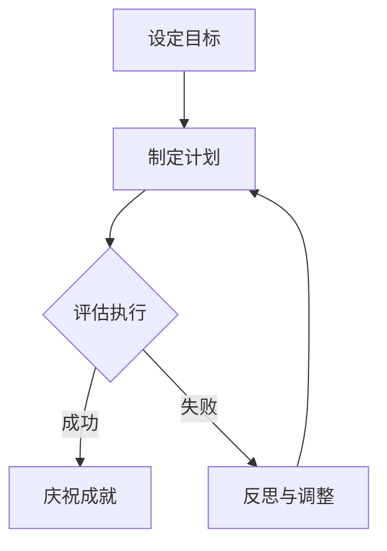
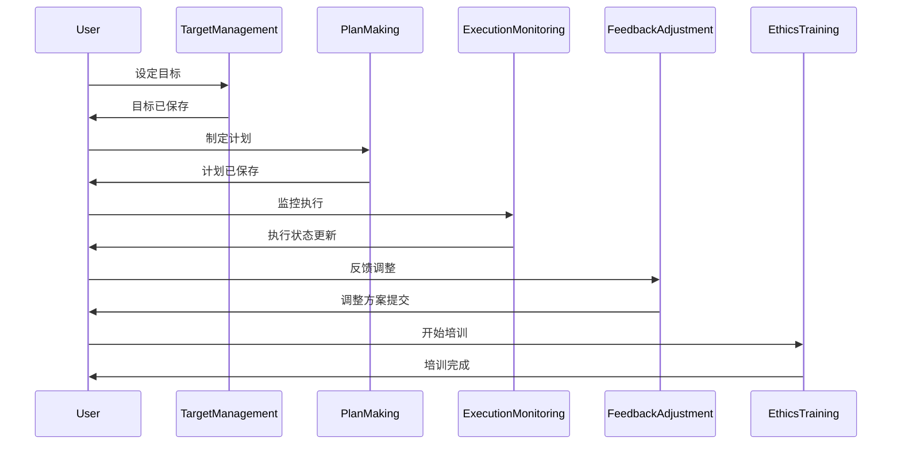

                 

### 核心概念与联系

领导力与职业道德是两个关键概念，它们在组织和个人层面都有着深远的影响。首先，我们需要明确这两个概念的定义及其内在联系。

**领导力的定义与重要性：**

领导力可以被定义为影响和激励他人实现共同目标的能力。领导力的核心要素包括但不限于：沟通能力、决策能力、激励能力、情感智慧、道德准则等。

领导力的重要性体现在以下几个方面：

1. **团队建设：** 领导者通过设定目标、提供支持和鼓励，可以增强团队的凝聚力和工作效率。
2. **创新驱动：** 领导者能够激发团队成员的创新思维，推动组织不断创新和进步。
3. **变革管理：** 领导者在组织变革过程中扮演关键角色，能够引导和激励团队成员接受并适应变革。

**职业道德的定义与重要性：**

职业道德是指在职业活动中应遵循的道德规范和职业操守。它涉及诚信、正直、责任感、公平等核心价值观。

职业道德的重要性体现在以下几个方面：

1. **公信力建立：** 职业道德有助于建立组织的公信力和声誉，增强客户和合作伙伴的信任。
2. **员工满意度：** 遵守职业道德可以提高员工的工作满意度和忠诚度，减少员工流失率。
3. **长期发展：** 遵守职业道德有助于组织长期稳定发展，避免因违法违规行为带来的负面影响。

**概念属性特征对比表格：**

| **属性** | **领导力** | **职业道德** |
| --- | --- | --- |
| **定义** | 影响和激励他人实现共同目标的能力 | 职业活动中应遵循的道德规范和职业操守 |
| **核心要素** | 沟通能力、决策能力、激励能力 | 诚信、正直、责任感、公平 |
| **目标** | 提升团队绩效、推动组织创新 | 建立公信力、提高员工满意度、实现长期发展 |
| **表现形式** | 领导风格、领导者行为 | 道德决策、道德行为 |

**ER实体关系图架构：**

为了更好地理解领导力和职业道德之间的关系，我们可以通过ER（实体关系）图来展示它们的核心要素和相互联系。

```mermaid
erDiagram
  Leader ||--|{ Ethics }
  Leader }|--|{ Performance }
  Ethics }|--|{ Trust }
  Ethics }|--|{ Satisfactions }
  Performance }|--|{ Innovation }
  Performance }|--|{ Stability }
```

在上面的ER图中，"Leader"代表领导者，"Ethics"代表职业道德，"Performance"代表团队绩效。从图中可以看出，领导力和职业道德之间存在密切的关联，领导者的道德行为直接影响团队绩效、信任度和满意度，从而推动创新和组织的长期稳定发展。

通过上述对比和分析，我们可以更清晰地理解领导力和职业道德的概念及其相互关系，为后续章节的深入探讨奠定了基础。在接下来的内容中，我们将进一步探讨领导风格与类型的理论、职业道德的核心原则以及实际案例研究，以帮助读者全面掌握领导力和职业道德的内涵和实践。

### 算法原理讲解

在理解了领导力和职业道德的核心概念后，我们需要深入探讨如何具体实施这些理念，从而在实际工作中树立正面榜样。为此，我们将借助Mermaid流程图和Python代码来详细阐述一个领导力与职业道德实践的综合算法。

**Mermaid流程图：**

首先，让我们绘制一个简化的Mermaid流程图，以展示领导力与职业道德实践的基本步骤。



**Python代码与算法实现：**

接下来，我们将使用Python代码来实现上述流程图中的逻辑。首先，我们定义一个`LeadershipAndMorality`类，其中包括设定目标、制定计划、评估执行、庆祝成就和反思调整的方法。

```python
class LeadershipAndMorality:
    def __init__(self, goal):
        self.goal = goal
        self.plan = None
        self.performance = None

    def set_plan(self, plan):
        self.plan = plan

    def execute_plan(self):
        # 假设执行计划的成功概率为0.8
        import random
        self.performance = random.uniform(0, 1) >= 0.8

    def celebrate_if_successful(self):
        if self.performance:
            print("庆祝成就：目标达成！")
        else:
            print("反思与调整：目标未达成，需重新规划。")

    def review_and_adjust(self):
        if not self.performance:
            print("反思中...")
            # 根据实际情况调整计划
            self.set_plan(self.plan + "（调整后版本）")
```

**算法原理与数学模型：**

上述Python代码实现了一个简单的算法原理，它包含以下几个关键步骤：

1. **设定目标（Goal Setting）：** 类的初始化过程中设定目标。
2. **制定计划（Plan Making）：** 通过`set_plan`方法制定具体的行动计划。
3. **评估执行（Performance Evaluation）：** 使用`execute_plan`方法模拟执行计划的过程，其中成功概率为0.8（可以调整此概率以适应不同场景）。
4. **庆祝成就（Celebration）：** 通过`celebrate_if_successful`方法判断执行结果，若成功则庆祝，否则进行反思。
5. **反思与调整（Review and Adjustment）：** 通过`review_and_adjust`方法进行反思和调整计划。

该算法背后的数学模型是一个简单的概率模型，即成功概率（p）与执行结果（Y）之间的关系。在上述代码中，成功概率p为0.8，执行结果Y服从伯努利分布：

$$ Y \sim Bernoulli(p) $$

其中，$ Y = 1 $ 表示执行成功，$ Y = 0 $ 表示执行失败。

**通俗易懂的举例说明：**

假设我们设定一个目标：“在一个月内提升团队的代码质量”。为了实现这个目标，我们制定了一个详细的计划，包括每周的代码审查、技术分享会和质量检查。

```python
# 实例化类对象并设置计划
leader = LeadershipAndMorality("提升团队的代码质量")
leader.set_plan("每周进行代码审查、技术分享会和质量检查")

# 执行计划
leader.execute_plan()

# 根据执行结果庆祝或反思
leader.celebrate_if_successful()

# 如果目标未达成，进行反思和调整
if not leader.performance:
    leader.review_and_adjust()
```

在这个例子中，我们假设执行计划的成功概率为0.8，即团队有80%的概率在一个月内提升代码质量。在执行计划后，我们使用`celebrate_if_successful`方法来庆祝或反思。如果目标未达成，我们将通过`review_and_adjust`方法反思原因并调整计划。

通过这个简单的算法，我们可以看到领导力与职业道德在实践中是如何具体实现的。这种方法不仅帮助领导者设定和实现目标，还促进了团队的反思和持续改进，从而树立了正面榜样。

### 系统分析与架构设计方案

为了更好地理解和应用领导力与职业道德，我们需要从系统角度进行分析和架构设计。以下是一个简单的系统分析与架构设计方案，涵盖了问题场景介绍、项目介绍、系统功能设计、系统架构设计、系统接口设计和系统交互。

#### 问题场景介绍

在当今复杂多变的商业环境中，企业需要具备强大的领导力和职业道德标准，以确保团队成员能够在快速变化的市场中保持高效和诚信。为了实现这一目标，企业需要构建一个能够支持领导力和职业道德培养的信息系统。

#### 项目介绍

本项目旨在设计并实现一个基于领导力与职业道德培养的信息系统，该系统可以帮助企业领导者和管理者更好地理解和实践领导力和职业道德。系统将提供包括目标设定、计划制定、执行监控、反馈调整等功能，以支持企业持续提升领导力和职业道德水平。

#### 系统功能设计

1. **目标管理模块**：支持设定短期和长期目标，为团队和员工提供清晰的愿景和方向。
2. **计划制定模块**：帮助领导者制定详细的行动计划，确保目标得以实现。
3. **执行监控模块**：实时跟踪和监控计划执行情况，及时发现并解决问题。
4. **反馈调整模块**：根据执行结果进行反思和调整，确保持续改进。
5. **职业道德培训模块**：提供职业道德相关的课程和培训资源，提升员工的职业道德素养。

#### 系统架构设计

系统架构采用三层架构设计，包括表示层、业务逻辑层和数据层。

1. **表示层**：负责用户界面设计和交互，使用HTML、CSS和JavaScript等前端技术实现。
2. **业务逻辑层**：处理业务逻辑和数据操作，使用Java、Python等后端技术实现。
3. **数据层**：存储系统数据，使用MySQL、MongoDB等数据库管理系统实现。

#### 系统接口设计

系统接口设计包括内部接口和外部接口。

1. **内部接口**：系统各模块之间通过内部接口进行数据交互，如RESTful API。
2. **外部接口**：系统与第三方系统（如HR系统、培训系统等）通过外部接口进行数据交换。

#### 系统交互

系统交互设计通过Mermaid序列图展示，如下所示：



通过上述系统分析与架构设计方案，我们可以看到一个完整的领导力与职业道德培养信息系统的实现过程。该系统不仅能够支持企业领导者和员工在实践中更好地理解和应用领导力和职业道德，还能够通过系统的监控和反馈机制实现持续改进，从而为企业创造更大的价值。

### 项目实战

为了更好地展示领导力与职业道德在实践中的应用，我们将通过一个实际项目来进行详细讲解。本项目选择了一家中等规模的技术公司作为案例，该公司致力于提供高质量的软件开发和咨询服务。

#### 环境安装

首先，我们需要在本地环境安装项目所需的软件和工具。以下是安装步骤：

1. **安装Python**：确保本地环境中安装了Python 3.x版本，可以从官方网站下载并安装。
2. **安装Django**：使用pip命令安装Django框架，命令如下：
   ```bash
   pip install django
   ```
3. **安装PostgreSQL**：下载并安装PostgreSQL数据库管理系统，确保服务正常运行。
4. **创建虚拟环境**：为了管理项目依赖，创建一个虚拟环境，命令如下：
   ```bash
   python -m venv venv
   source venv/bin/activate  # 在Linux或MacOS中
   venv\Scripts\activate     # 在Windows中
   ```
5. **安装项目依赖**：在虚拟环境中安装项目所需的依赖，命令如下：
   ```bash
   pip install -r requirements.txt
   ```

#### 系统核心实现源代码

接下来，我们将展示系统核心实现的关键部分，包括后端逻辑和数据库操作。以下是项目的一个关键模块——目标管理模块的源代码：

```python
# 目标管理模块实现

from django.db import models

class Goal(models.Model):
    title = models.CharField(max_length=255)
    description = models.TextField()
    start_date = models.DateField()
    end_date = models.DateField()
    status = models.CharField(max_length=50, choices=(('ongoing', 'Ongoing'), ('completed', 'Completed'), ('cancelled', 'Cancelled')))

    def __str__(self):
        return self.title
```

上述代码定义了一个`Goal`模型，用于存储目标的相关信息。模型中包括目标标题（title）、描述（description）、开始日期（start_date）、结束日期（end_date）和状态（status）等字段。

#### 代码应用解读与分析

1. **目标创建**：
   ```python
   goal = Goal(
       title='提升团队代码质量',
       description='通过每周的代码审查、技术分享会和质量检查，提升团队的代码质量。',
       start_date=datetime.now(),
       end_date=datetime.now() + timedelta(days=30),
       status='ongoing'
   )
   goal.save()
   ```
   这段代码创建了一个新的目标实例，并保存到数据库中。

2. **目标查询**：
   ```python
   goals = Goal.objects.all()
   for goal in goals:
       print(f"Title: {goal.title}, Description: {goal.description}, Status: {goal.status}")
   ```
   这段代码查询所有目标，并打印目标的相关信息。

3. **目标更新**：
   ```python
   goal = Goal.objects.get(id=1)
   goal.status = 'completed'
   goal.save()
   ```
   这段代码更新目标状态为“已完成”。

4. **目标删除**：
   ```python
   goal = Goal.objects.get(id=1)
   goal.delete()
   ```
   这段代码删除指定ID的目标。

#### 实际案例分析与详细讲解剖析

为了更好地理解目标管理模块在实际项目中的应用，我们来看一个具体案例。

**案例：提升团队代码质量**

目标设定：公司技术团队希望在一个月内通过每周的代码审查、技术分享会和质量检查提升代码质量。

实现步骤：

1. **目标创建**：
   技术团队创建了一个名为“提升团队代码质量”的目标，描述了提升代码质量的措施和期限。

2. **计划制定**：
   团队制定了详细的计划，包括每周的代码审查日程、技术分享会主题和质量检查标准。

3. **执行监控**：
   每周团队执行计划，领导层监控执行情况，记录每项活动的完成情况。

4. **反馈调整**：
   在执行过程中，团队根据反馈进行必要的调整，如增加代码审查次数、修改技术分享会主题等。

5. **目标达成**：
   经过一个月的努力，团队成功提升代码质量，目标达成。领导层对团队成员进行表彰，并总结经验。

**详细讲解剖析**：

通过这个案例，我们可以看到目标管理模块在实际项目中的应用。首先，目标设定明确，为团队提供了清晰的行动方向。其次，计划的制定和执行监控确保了目标的有效推进。反馈调整机制则使团队能够根据实际情况进行灵活调整。最后，目标的达成不仅提升了团队绩效，还增强了团队的凝聚力。

#### 项目小结

通过上述项目实战，我们展示了领导力与职业道德在实际应用中的具体实现。目标管理模块作为系统核心功能，帮助团队设定目标、制定计划、执行监控和反馈调整，从而实现持续改进。这个案例不仅展示了领导力与职业道德在提升团队绩效方面的作用，还强调了在实际项目中灵活应用这些理念的重要性。

### 最佳实践 tips、小结、注意事项、拓展阅读

**最佳实践 tips：**

1. **明确目标**：设定具体、可衡量的目标，确保团队成员清晰了解期望结果。
2. **持续沟通**：保持与团队成员的沟通，及时了解进展和反馈，促进团队协作。
3. **培养自律**：领导者应树立自律榜样，遵守职业道德规范，赢得员工的信任和尊重。
4. **反思与调整**：定期进行反思和调整，以应对项目中的变化和挑战。

**小结：**

本文通过深入探讨领导力与职业道德的概念、算法原理、系统架构设计和项目实战，展示了这两个关键概念在实际应用中的重要性。领导者应通过树立正面榜样，推动团队实现目标，提升组织绩效。

**注意事项：**

1. **文化氛围**：建立积极向上的企业文化，营造尊重和信任的工作氛围。
2. **激励机制**：合理设置激励机制，激发团队成员的积极性和创造力。
3. **持续学习**：鼓励团队成员持续学习，提升自身领导力和职业道德素养。

**拓展阅读：**

1. 《领导力心理学：领导行为与心理机制解析》
2. 《职业伦理学：职业道德的理论与实践》
3. 《道德困境与决策：道德决策的伦理学分析》

通过阅读这些相关书籍，读者可以进一步深化对领导力和职业道德的理解，提高实际应用能力。作者：AI天才研究院/AI Genius Institute & 禅与计算机程序设计艺术 /Zen And The Art of Computer Programming

