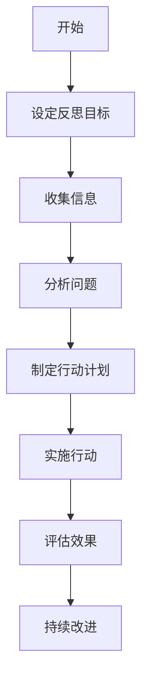
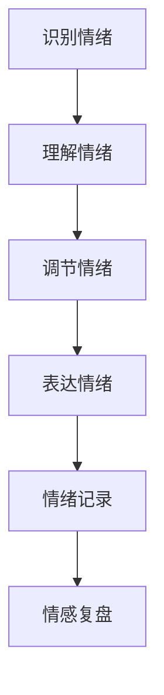
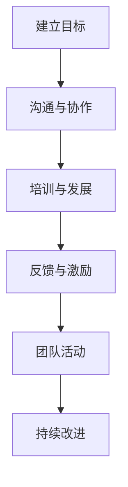
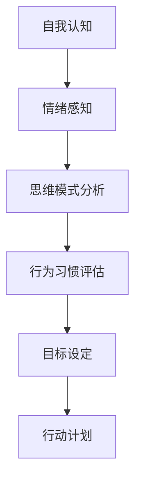
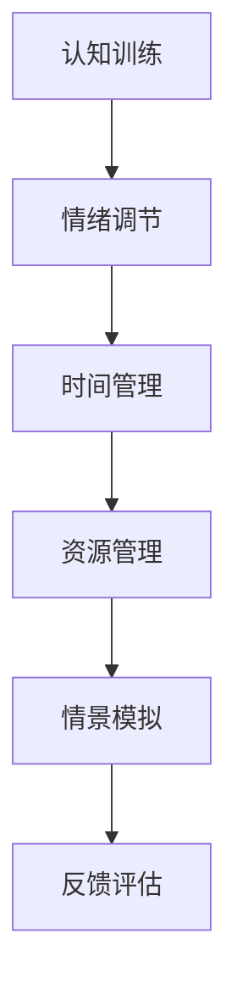
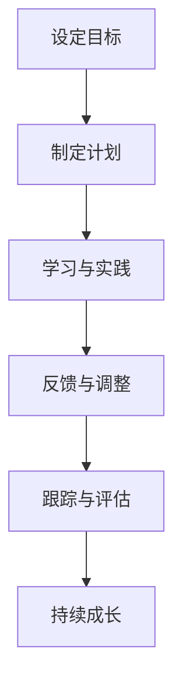
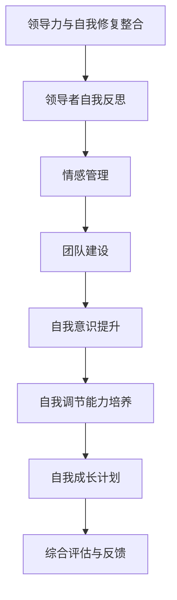
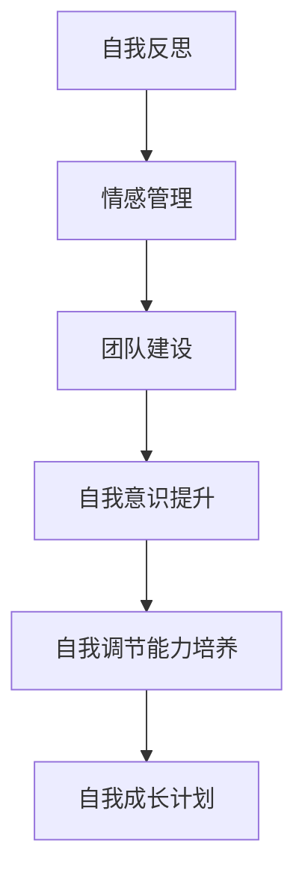

                 

### 引言

#### 1.1 问题背景

在当前快速发展的信息技术时代，IT行业一直处于不断变化和创新的前沿。随着企业对技术需求的增加，IT从业者面临的压力也在不断上升。特别是在领导层，他们不仅要具备深厚的技术背景，还要具备出色的管理能力和领导力。然而，长期的高压工作环境、持续的学习压力以及复杂的人际关系，往往会导致IT领导者在职业生涯中经历职业倦怠。

职业倦怠是一种身心疲惫的状态，表现为对工作的丧失热情、工作满意度下降、工作效率降低等症状。据研究，约有60%的IT专业人士在职业生涯中经历不同程度的职业倦怠。这一现象不仅影响个人的职业发展，也会对整个团队和企业造成负面影响，导致团队士气低落、项目延误甚至失败。

#### 1.2 问题描述

职业倦怠对IT领导者的危害是多方面的。首先，它可能导致领导者工作效率降低，错失关键业务机会，影响企业的竞争力。其次，长期处于高压状态下的领导者可能面临健康问题，如焦虑、抑郁等，甚至可能导致离职。此外，职业倦怠还可能影响领导者的决策能力和团队管理能力，进而影响团队士气和整体绩效。

#### 1.3 问题解决

为了解决职业倦怠问题，需要从领导力与自我修复两个角度入手。首先，领导者需要提升自身的领导力，通过有效的领导策略来缓解工作压力和提升团队士气。其次，领导者需要培养自我修复能力，学会在高压环境中自我调节和恢复，以维持良好的心理状态。

本文将围绕领导力与自我修复展开讨论，通过理论分析、策略研究和实际案例分享，为IT领导者提供应对职业倦怠的策略和方法。

#### 1.4 边界与外延

本文的研究范围主要涉及IT行业中的领导力与自我修复策略。具体来说，我们将探讨领导力如何促进自我修复，以及自我修复如何提升领导力。同时，本文还将结合实际案例，分析不同场景下领导力与自我修复策略的应用效果。

#### 1.5 概念结构与核心要素组成

在本文中，我们将对以下核心概念进行详细探讨：

1. **领导力**：定义领导力、分析领导力的重要性及其核心概念。
2. **自我修复**：阐述自我修复的概念与原理，探讨职业倦怠的定义与症状。
3. **领导力与自我修复的关系**：分析领导力与自我修复之间的互动机制。
4. **应对策略**：提出领导力和自我修复的具体策略，包括领导者自我反思、情感管理、团队建设、自我意识提升、自我调节能力培养和自我成长计划。
5. **实际案例分析与应用**：结合实际案例，展示策略的实施效果。

通过以上结构，本文旨在为IT领导者提供一套全面、实用的应对职业倦怠的策略体系。

---

**关键词**：职业倦怠、领导力、自我修复、策略、IT行业

**摘要**：本文探讨了IT领导者在职业生涯中面临职业倦怠的问题，分析了领导力与自我修复的关系，并提出了具体的应对策略。通过理论分析和实际案例，本文为IT领导者提供了一套实用的方法，帮助他们在高压环境中保持良好的心理状态和领导能力。

## 第二部分：领导力理论

### 2.1 领导力的定义

领导力是一个复杂而多维的概念，不同的学者和研究领域对其有不同的理解和定义。然而，大多数定义都强调了领导者与追随者之间的互动及其对组织的影响。例如，基于社会交换理论的定义，领导力被看作是领导者通过建立信任和激励机制，以实现组织目标的能力。而从系统动力学的角度来看，领导力则是领导者通过感知、思考和行动，引导组织系统达到动态平衡和持续发展的能力。

在IT行业，领导力不仅包括技术能力的展示，还要求领导者具备出色的沟通、团队管理、创新思维和战略规划能力。这是因为IT行业的技术更新速度快，市场环境多变，领导者需要快速适应变化，引领团队不断突破和创新。

**定义**：领导力是一种通过激励、沟通和决策，影响和引导团队实现共同目标的能力。

### 2.2 领导力的重要性

领导力在IT行业中具有至关重要的地位，主要体现在以下几个方面：

1. **团队士气**：领导者通过鼓舞和激励团队成员，提升团队士气，使团队更加团结和协作。
2. **创新氛围**：领导者需要具备创新思维，推动团队进行技术创新和业务模式创新，保持组织的竞争力。
3. **决策能力**：在复杂多变的IT行业中，领导者需要做出快速而准确的决策，以确保项目的顺利进行和企业的可持续发展。
4. **人才培养**：领导者通过选拔、培养和激励人才，提升团队整体能力，为企业的长期发展奠定基础。

**图**：以下是一个领导力核心概念属性特征对比表，展示了领导力在不同方面的表现：

| 特征        | 描述                                                         | 关键词        |
| ----------- | ------------------------------------------------------------ | ------------- |
| 沟通能力    | 领导者与团队成员之间的有效沟通，促进信息传递和共识形成。         | 沟通、信息传递 |
| 决策能力    | 在不确定性中做出合理、有效的决策，确保项目顺利推进。             | 决策、风险控制 |
| 创新思维    | 推动团队进行技术创新和业务模式创新，保持组织的竞争力。           | 创新、竞争力   |
| 团队管理    | 建立有效的团队结构，提升团队协作效率和绩效。                   | 团队管理、协作 |
| 战略规划    | 确定企业长期发展方向，制定并实施战略计划。                     | 战略、规划    |

### 2.3 领导力的核心概念与联系

领导力是一个包含多个核心概念的复杂体系，这些概念相互联系，共同构成领导力的核心框架。以下是对几个关键概念及其相互关系的详细解释。

#### 领导风格

领导风格是指领导者在与团队成员互动时采取的方式和策略。常见的领导风格包括专制型、民主型、教练型和变革型等。每种风格都有其适用的场景和优缺点。

- **专制型**：领导者做出所有决策，团队成员只需执行。这种风格适用于需要迅速决策的紧急情况。
- **民主型**：领导者鼓励团队成员参与决策过程，共同讨论并解决问题。这种风格有利于提升团队士气和创新能力。
- **教练型**：领导者通过指导和辅导，帮助团队成员提升技能和能力。这种风格适用于培养人才和促进团队成长。
- **变革型**：领导者通过愿景和激励，推动团队进行变革和进步。这种风格适用于企业变革和创新发展。

**表格**：领导力核心概念属性特征对比表

| 领导风格 | 特点描述 | 适用场景 | 优点 | 缺点 |
| :------: | :------: | :------: | :---: | :---: |
| 专制型   | 单独决策，强制执行 | 紧急决策、任务明确 | 快速执行、高效控制 | 灵活性差、团队士气低 |
| 民主型   | 鼓励参与，共同决策 | 需要集体智慧、决策复杂 | 提升士气、增强协作 | 决策缓慢、执行力不足 |
| 教练型   | 指导辅导，培养人才 | 培养人才、技能提升 | 提升能力、团队成长 | 依赖个人能力、效率较低 |
| 变革型   | 愿景激励，推动变革 | 变革创新、长期发展 | 激发潜力、创新驱动 | 挑战性强、风险较高 |

#### 领导行为

领导行为是指领导者在日常管理中表现出的具体行为。这些行为可以是个人的，也可以是团队层面的。有效的领导行为包括激励、反馈、沟通和决策等。

- **激励**：通过奖励和认可，提升团队成员的工作动力和积极性。
- **反馈**：及时、具体的反馈有助于团队成员改进工作，提升绩效。
- **沟通**：有效的沟通是领导行为的核心，包括上行沟通、下行沟通和平行沟通。
- **决策**：在复杂多变的IT环境中，领导者需要做出快速、准确的决策。

**图**：领导力ER实体关系图

```mermaid
erDiagram
  A[领导力] ||--|{ B[领导风格] } |
  A ||--|{ C[领导行为] } |
  B ||--|{ D[专制型] } |
  B ||--|{ E[民主型] } |
  B ||--|{ F[教练型] } |
  B ||--|{ G[变革型] } |
  C ||--|{ H[激励] } |
  C ||--|{ I[反馈] } |
  C ||--|{ J[沟通] } |
  C ||--|{ K[决策] } |
```

通过以上对领导力核心概念及其相互关系的分析，我们可以更深入地理解领导力的本质，为后续讨论领导力与自我修复的关系奠定基础。

### 2.4 自我修复的概念与原理

自我修复是指个体在面对压力和挑战时，通过内在的调节机制和外部支持，恢复身心健康、恢复心理活力和提升应对能力的过程。在IT行业，自我修复能力尤为重要，因为IT行业的工作特点决定了从业者需要持续面对高强度的压力和快速变化的技术环境。

#### 概念

自我修复可以理解为一种心理和生理的恢复机制。在心理学领域，自我修复通常涉及情绪调节、认知重构和自我效能感等概念。情绪调节是指个体通过认知和行为策略，改变和调整情绪状态，以适应压力情境。认知重构则是指通过改变对压力事件的认知评价，降低压力对个体的负面影响。自我效能感是指个体对自己应对压力和挑战能力的信心。

#### 原理

自我修复的原理主要基于以下几个关键机制：

1. **神经可塑性**：大脑具有适应性和可塑性，通过不断的学习和经验积累，大脑结构和功能可以发生变化。自我修复过程中，神经可塑性使得个体能够重建神经回路，改善情绪和认知功能。
2. **情绪调节**：情绪调节机制包括认知行为策略、情绪释放技术和放松训练等。这些策略可以帮助个体在压力情境下保持情绪稳定，减少负面情绪对身心健康的影响。
3. **社会支持**：社会支持是自我修复的重要外部资源。通过家庭、朋友和同事的支持，个体可以获得情感上的安慰和实际帮助，从而更快地恢复身心健康。

#### 自我修复在IT行业中的重要性

在IT行业中，自我修复能力对于从业者尤为重要，原因如下：

1. **高压力环境**：IT行业的工作环境通常具有高压力、快节奏和不确定性，导致从业者容易出现心理疲劳和职业倦怠。
2. **持续学习需求**：技术不断更新，IT从业者需要不断学习和适应新技术，这要求他们具备良好的自我修复能力，以应对持续的学习压力。
3. **创新能力**：自我修复能力有助于提升个体的创新能力，使他们能够从挫折和失败中迅速恢复，继续探索和尝试。

### 2.5 职业倦怠的定义与症状

职业倦怠是一种与工作相关的慢性心理综合征，主要表现为情感耗竭、去人格化和个人成就感降低。在IT行业中，职业倦怠现象尤为普遍，由于工作压力、重复性和工作与生活失衡等因素，IT从业者更容易感到身心疲惫和失落。

#### 定义

职业倦怠最初由心理学家玛勒斯（Maslach）和杰克森（Jackson）在1970年代提出，他们将其定义为一种由长期工作压力和情感劳动引发的综合征。职业倦怠的核心特征包括以下几个方面：

1. **情感耗竭**：个体感到情感和精神上的极度疲劳，对工作失去热情和动力。
2. **去人格化**：对工作持消极态度，对同事和客户表现出冷漠和疏离。
3. **个人成就感降低**：对工作的意义和成就感感到怀疑，自我评价降低。

#### 症状

职业倦怠的主要症状包括以下几点：

1. **身体症状**：如头痛、失眠、食欲不振、身体疲劳等。
2. **心理症状**：如情绪低落、焦虑、抑郁、易怒等。
3. **行为症状**：如工作效率下降、回避工作、对工作失去兴趣等。

#### 对IT行业的影响

职业倦怠对IT行业的负面影响主要体现在以下几个方面：

1. **工作效率下降**：由于情绪低落和精力不足，IT从业者的工作效率会显著降低，导致项目延误和错误率增加。
2. **创新能力减弱**：持续的疲劳和压力会抑制个体的创造力和创新能力，影响企业的技术发展和市场竞争力。
3. **员工流失**：严重的职业倦怠可能导致员工离职，增加企业的人力资源成本和培训成本。

### 2.6 自我修复与职业倦怠的联系

自我修复与职业倦怠之间存在密切的联系，自我修复能力是应对职业倦怠的重要机制。通过自我修复，个体可以缓解情感耗竭、重建工作热情和提升自我效能感。

#### 联系

1. **情绪调节**：自我修复过程中的情绪调节策略，如认知重构和放松训练，有助于减轻情感耗竭，减少职业倦怠的症状。
2. **认知重构**：通过改变对工作的认知评价，个体可以降低工作压力，提高工作满意度和成就感。
3. **社会支持**：自我修复过程中，社会支持的作用尤为重要。通过家庭、朋友和同事的支持，个体可以获得情感安慰和实际帮助，更快地恢复身心健康。

#### 自我修复策略

以下是几个有效的自我修复策略，可以帮助IT从业者应对职业倦怠：

1. **定期休息和放松**：通过定期休息和放松，如短期的休假、放松训练和兴趣爱好，可以帮助个体缓解压力，恢复精力。
2. **健康生活方式**：保持良好的饮食、运动和睡眠习惯，有助于提升身心健康，增强自我修复能力。
3. **心理辅导和支持**：通过心理咨询和辅导，个体可以获得专业的心理支持，学习情绪调节和自我修复的技能。
4. **职业发展规划**：明确职业目标和规划，有助于提升工作满意度和成就感，减少职业倦怠的风险。

通过以上分析，我们可以看到，自我修复与职业倦怠之间存在着紧密的关联。提升自我修复能力，不仅有助于应对职业倦怠，还可以提升工作绩效和职业满意度，为IT领导者的职业发展提供有力的支持。

### 2.7 领导力与自我修复的关系

领导力与自我修复之间存在密切的联系，二者相互影响，共同作用于IT领导者的职业发展和心理健康。

#### 领导力如何促进自我修复

1. **情感支持**：领导者通过提供情感支持和关心，帮助团队成员缓解压力和焦虑，提升自我修复能力。这种支持可以是通过一对一的辅导、团队会议或简单的聊天来实现的。
2. **工作安排**：领导者合理安排工作任务和休息时间，避免团队成员过度劳累，有助于个体在压力环境中恢复身心。合理的任务分配可以减少工作压力，提高工作效率。
3. **激励机制**：领导者通过激励机制，如表扬和奖励，提升团队成员的工作动力和自信心，增强他们的自我修复能力。这种激励不仅体现在物质奖励上，还可以是精神上的认可和鼓励。

#### 自我修复如何提升领导力

1. **情绪调节能力**：自我修复过程中，个体学会如何调节和管理自己的情绪，提高情绪稳定性。这种情绪调节能力对于领导者在面对复杂和压力大的情境时，保持冷静和理智至关重要。
2. **心理健康水平**：自我修复有助于提升个体的心理健康水平，减少焦虑、抑郁等负面情绪。一个心理健康、心态积极的领导者能够更好地理解和支持团队成员，提升团队凝聚力。
3. **决策能力**：通过自我修复，个体可以更好地应对压力和挑战，提高决策能力和判断力。领导者具备良好的决策能力，能够更好地应对业务挑战，确保项目的成功。

#### 领导力与自我修复的互动机制

1. **反馈与调整**：领导者通过观察团队成员的自我修复过程，提供及时的反馈和建议，帮助成员调整修复策略。这种反馈与调整机制，有助于个体更好地应对职业倦怠，提升领导力。
2. **共同成长**：领导力和自我修复能力的提升，往往需要领导者与团队成员共同成长。通过团队建设活动和培训，领导者可以带动整个团队共同进步，形成良好的自我修复氛围。
3. **持续支持**：领导者需要提供持续的支持，帮助团队成员在面对压力和挑战时，保持积极的心态和自我修复能力。这种持续支持，有助于提升团队的整体绩效和领导者的领导能力。

通过以上分析，我们可以看到，领导力与自我修复之间相互促进，共同提升。领导者不仅需要提升自身的领导力，还需要关注和支持团队成员的自我修复过程，以实现个人与团队的共同成长。这种互动机制，对于IT领导者应对职业倦怠、提升工作绩效具有重要意义。

### 2.8 领导力与自我修复的理论框架

为了更好地理解和应用领导力与自我修复之间的关系，我们构建了一个综合性的理论框架。该框架分为三个层次：基础层、核心层和扩展层，每个层次都包含了关键概念和相互作用机制。

#### 基础层

基础层包括个体因素和组织因素，这些因素共同构成了领导力与自我修复的背景环境。

1. **个体因素**：
   - **个人特质**：如性格、价值观和动机，影响个体的自我修复能力和领导风格。
   - **心理健康**：个体的心理健康水平直接影响其自我修复能力和应对压力的能力。

2. **组织因素**：
   - **组织文化**：组织的文化氛围，如支持性、透明度和公正性，影响个体的自我修复和领导力表现。
   - **支持系统**：包括正式的支持（如心理辅导、健康保险）和非正式的支持（如同事、家人），对个体的自我修复能力有重要影响。

#### 核心层

核心层是领导力与自我修复关系的核心部分，包括以下几个关键概念：

1. **领导行为**：
   - **激励与支持**：领导者通过激励和支持，提升团队成员的自我修复能力。
   - **情感调节**：领导者通过情感调节，帮助团队成员缓解压力和焦虑。

2. **自我修复机制**：
   - **情绪调节**：个体通过认知重构、放松训练等方法，调节情绪，减轻压力。
   - **认知重构**：个体通过改变对压力事件的认知评价，降低负面情绪的影响。
   - **社会支持**：个体通过家庭、朋友和同事的支持，增强自我修复能力。

#### 扩展层

扩展层包括领导力与自我修复的相互作用机制和应用场景。

1. **互动机制**：
   - **反馈与调整**：领导者与团队成员之间的反馈与调整，促进双方能力的提升。
   - **共同成长**：领导者与团队成员共同参与培训和发展活动，实现共同成长。

2. **应用场景**：
   - **团队建设**：通过团队建设活动，增强团队凝聚力，提升整体自我修复能力。
   - **跨文化管理**：在多元文化背景下，领导者和团队成员需要灵活应用自我修复策略，以适应不同文化环境。

#### 理论框架概述

综合以上内容，领导力与自我修复的理论框架可以概述为：

**基础层**：个体因素和组织因素共同构成自我修复和领导力的背景。
**核心层**：领导行为和自我修复机制相互作用，促进个体和团队的成长。
**扩展层**：领导力与自我修复的相互作用机制和应用场景，进一步深化和拓展其应用。

通过这个理论框架，我们可以系统地理解和应用领导力与自我修复的关系，为IT领导者提供实用的策略和方法，帮助他们在职业发展中更好地应对职业倦怠，提升领导力和团队绩效。

### 3.1 领导者自我反思

领导者自我反思是提升自我修复能力的重要策略之一。通过自我反思，领导者可以深入分析自己的行为、思维模式和工作状态，从而发现并解决潜在的问题，提升自身的领导效能。

#### 图：自我反思流程图



#### Python代码：自我反思代码示例

```python
# 自我反思Python代码示例
class SelfReflection:
    def __init__(self, target):
        self.target = target
    
    def collect_info(self):
        # 收集相关信息
        print("收集信息：工作日志、会议记录、团队反馈等")
    
    def analyze_problem(self):
        # 分析问题
        print("分析问题：查找行为和思维模式的不足")
    
    def make_action_plan(self):
        # 制定行动计划
        print("制定行动计划：设定具体目标和改进措施")
    
    def implement_action(self):
        # 实施行动
        print("实施行动：执行行动计划")
    
    def evaluate_effect(self):
        # 评估效果
        print("评估效果：检查行动计划的效果和反馈")
    
    def continuous_improvement(self):
        # 持续改进
        print("持续改进：根据评估结果调整行动计划")

# 实例化自我反思对象并执行流程
reflection = SelfReflection("提升团队沟通效率")
reflection.collect_info()
reflection.analyze_problem()
reflection.make_action_plan()
reflection.implement_action()
reflection.evaluate_effect()
reflection.continuous_improvement()
```

通过以上代码示例，我们可以看到领导者自我反思的流程是如何在Python中实现的。通过这个流程，领导者可以系统地反思自己的工作，发现问题并制定改进计划，从而不断提升自己的领导能力。

### 3.2 情感管理

情感管理是领导者应对职业倦怠的重要策略之一，它涉及到如何识别、理解和调节自己的情绪，以及如何通过这些技巧来提升自我修复能力。

#### 图：情感管理策略mermaid流程图



#### Python代码：情感管理代码示例

```python
# 情感管理Python代码示例
class EmotionManagement:
    def __init__(self):
        self.emotions = []

    def recognize_emotion(self):
        # 识别情绪
        print("识别情绪：通过日记、记录等方式感知自己的情绪状态")
    
    def understand_emotion(self):
        # 理解情绪
        print("理解情绪：分析情绪产生的原因和背景")
    
    def regulate_emotion(self):
        # 调节情绪
        print("调节情绪：使用深呼吸、冥想等方法缓解负面情绪")
    
    def express_emotion(self):
        # 表达情绪
        print("表达情绪：通过合适的渠道和方式表达自己的感受")
    
    def record_emotion(self):
        # 情绪记录
        print("情绪记录：记录每日的情绪变化，进行分析和总结")
    
    def emotional_review(self):
        # 情感复盘
        print("情感复盘：定期回顾情绪记录，发现模式和改进点")

# 实例化情感管理对象并执行流程
emotion_management = EmotionManagement()
emotion_management.recognize_emotion()
emotion_management.understand_emotion()
emotion_management.regulate_emotion()
emotion_management.express_emotion()
emotion_management.record_emotion()
emotion_management.emotional_review()
```

通过以上代码示例，我们可以看到情感管理是如何通过Python代码实现的。领导者通过这个流程，可以有效地识别、理解、调节和表达自己的情绪，并通过记录和复盘来不断提升情感管理能力。

### 3.3 团队建设

团队建设是领导者提升团队绩效和凝聚力的重要策略之一。通过有效的团队建设，领导者可以增强团队的协作能力，提升团队的士气和满意度，从而帮助团队成员更好地应对职业倦怠。

#### 图：团队建设策略mermaid流程图



#### Python代码：团队建设代码示例

```python
# 团队建设Python代码示例
class TeamBuilding:
    def __init__(self):
        self.teams = []
    
    def set_goals(self):
        # 建立目标
        print("建立目标：明确团队的目标和愿景")
    
    def communication_and_cooperation(self):
        # 沟通与协作
        print("沟通与协作：通过定期的团队会议和协作工具，增强团队成员之间的沟通和协作")
    
    def training_and_development(self):
        # 培训与发展
        print("培训与发展：提供技能培训和职业发展机会，提升团队整体能力")
    
    def feedback_and_incentives(self):
        # 反馈与激励
        print("反馈与激励：通过定期的绩效评估和奖励机制，激励团队成员")
    
    def team_activities(self):
        # 团队活动
        print("团队活动：组织团队建设活动和团建活动，增强团队凝聚力")
    
    def continuous_improvement(self):
        # 持续改进
        print("持续改进：根据团队反馈和评估结果，不断调整团队建设策略")

# 实例化团队建设对象并执行流程
team_building = TeamBuilding()
team_building.set_goals()
team_building.communication_and_cooperation()
team_building.training_and_development()
team_building.feedback_and_incentives()
team_building.team_activities()
team_building.continuous_improvement()
```

通过以上代码示例，我们可以看到团队建设是如何在Python中实现的。领导者通过这个流程，可以系统地构建团队的共同目标，增强沟通与协作，提供培训与发展机会，给予反馈与激励，组织团队活动，并持续改进团队建设策略，从而提升团队的整体绩效和凝聚力。

### 3.4 自我意识提升

自我意识提升是自我修复的重要环节，它帮助个体更深入地了解自己的情绪、思维和行为模式，从而更好地管理自己，提升心理健康和职业效能。

#### 图：自我意识提升流程图



#### Python代码：自我意识提升代码示例

```python
# 自我意识提升Python代码示例
class SelfAwareness:
    def __init__(self):
        self.self_knowledge = {}
    
    def self_perception(self):
        # 自我认知
        print("自我认知：通过自我反思和他人反馈，了解自己的优点和不足")
    
    def emotion_perception(self):
        # 情绪感知
        print("情绪感知：记录和分析自己的情绪变化，了解情绪的触发因素")
    
    def mindset_analysis(self):
        # 思维模式分析
        print("思维模式分析：识别自己的思维习惯，如正面思维和负面思维")
    
    def behavior_evaluation(self):
        # 行为习惯评估
        print("行为习惯评估：评估自己的日常行为习惯，如时间管理、任务执行等")
    
    def goal_setting(self):
        # 目标设定
        print("目标设定：设定短期和长期目标，明确自己的职业和成长方向")
    
    def action_plan(self):
        # 行动计划
        print("行动计划：制定具体的行动步骤，实现自我提升目标")

# 实例化自我意识提升对象并执行流程
self_awareness = SelfAwareness()
self_awareness.self_perception()
self_awareness.emotion_perception()
self_awareness.mindset_analysis()
self_awareness.behavior_evaluation()
self_awareness.goal_setting()
self_awareness.action_plan()
```

通过以上代码示例，我们可以看到自我意识提升是如何在Python中实现的。通过这个流程，个体可以系统地提升自我认知、情绪感知、思维模式分析和行为习惯评估，设定明确的目标并制定行动计划，从而实现全面的自我提升。

### 3.5 自我调节能力培养

自我调节能力培养是提升自我修复能力的关键策略之一。通过自我调节，个体可以在面对压力和挑战时，保持冷静和理智，有效地管理情绪和资源，从而提升应对职业倦怠的能力。

#### 图：自我调节能力培养策略mermaid流程图



#### Python代码：自我调节能力培养代码示例

```python
# 自我调节能力培养Python代码示例
class SelfRegulation:
    def __init__(self):
        self.regulation_skills = []

    def cognitive_training(self):
        # 认知训练
        print("认知训练：通过思维导图、逻辑分析等方式，提升认知能力")

    def emotion_regulation(self):
        # 情绪调节
        print("情绪调节：通过冥想、深呼吸等方法，调节负面情绪")

    def time_management(self):
        # 时间管理
        print("时间管理：通过时间规划、优先级设定等方式，有效管理时间")

    def resource_management(self):
        # 资源管理
        print("资源管理：合理分配时间和精力，提高工作效率")

    def scenario_simulation(self):
        # 情景模拟
        print("情景模拟：通过模拟不同场景，提升应对复杂情况的能力")

    def feedback_evaluation(self):
        # 反馈评估
        print("反馈评估：根据实际情况和反馈，调整和优化自我调节策略")

# 实例化自我调节能力培养对象并执行流程
self_regulation = SelfRegulation()
self_regulation.cognitive_training()
self_regulation.emotion_regulation()
self_regulation.time_management()
self_regulation.resource_management()
self_regulation.scenario_simulation()
self_regulation.feedback_evaluation()
```

通过以上代码示例，我们可以看到自我调节能力培养是如何在Python中实现的。通过认知训练、情绪调节、时间管理、资源管理和情景模拟，个体可以全面提升自我调节能力，并通过反馈评估不断优化策略，从而更好地应对职业倦怠。

### 3.6 自我成长计划

自我成长计划是领导者提升自我修复能力、保持职业竞争力的关键策略之一。通过系统化的自我成长计划，领导者可以明确自己的职业目标，制定具体的行动步骤，不断学习和进步。

#### 图：自我成长计划mermaid流程图



#### Python代码：自我成长计划代码示例

```python
# 自我成长计划Python代码示例
class PersonalGrowthPlan:
    def __init__(self):
        self.growth_plan = {}
    
    def set_goals(self):
        # 设定目标
        print("设定目标：明确短期和长期职业目标，如技能提升、职位晋升等")
    
    def make_plan(self):
        # 制定计划
        print("制定计划：根据目标，制定具体的学习和实践计划，如参加培训、阅读书籍等")
    
    def learn_and_practice(self):
        # 学习与实践
        print("学习与实践：按照计划执行，不断学习和提升技能")
    
    def feedback_and_adjust(self):
        # 反馈与调整
        print("反馈与调整：根据实际效果和反馈，调整成长计划")
    
    def track_and_evaluate(self):
        # 跟踪与评估
        print("跟踪与评估：定期检查成长进度，评估计划的有效性")
    
    def continuous_growth(self):
        # 持续成长
        print("持续成长：根据评估结果，不断优化和调整成长计划")

# 实例化自我成长计划对象并执行流程
growth_plan = PersonalGrowthPlan()
growth_plan.set_goals()
growth_plan.make_plan()
growth_plan.learn_and_practice()
growth_plan.feedback_and_adjust()
growth_plan.track_and_evaluate()
growth_plan.continuous_growth()
```

通过以上代码示例，我们可以看到自我成长计划是如何在Python中实现的。领导者通过设定目标、制定计划、学习与实践、反馈与调整、跟踪与评估和持续成长，可以系统地提升自己的职业能力和竞争力。

### 3.7 领导力与自我修复的整合策略

整合领导力与自我修复策略，有助于IT领导者更全面地应对职业倦怠，提升个人和团队的绩效。以下是一个整合策略的框架，包括策略整合框架、实施步骤和实际应用案例。

#### 策略整合框架

**图：领导力与自我修复整合策略框架**



#### 实施步骤

1. **领导者自我反思**：通过定期自我反思，领导者可以识别自身存在的问题，并制定改进措施。这一步骤为整合策略的实施提供了基础。
   
2. **情感管理**：领导者需要学会识别和管理自己的情绪，通过情感管理策略，如冥想、深呼吸等方法，提升自我修复能力。

3. **团队建设**：通过团队建设活动，如定期的团队会议、团队建设培训等，提升团队凝聚力，减少团队成员的职业倦怠。

4. **自我意识提升**：领导者需要通过自我意识提升，如自我认知、情绪感知等，深入了解自己的内在状态，为后续的自我调节和成长提供依据。

5. **自我调节能力培养**：领导者通过认知训练、情绪调节、时间管理和资源管理等策略，提升自我调节能力，更好地应对职业压力。

6. **自我成长计划**：领导者制定并执行自我成长计划，明确职业目标，通过持续学习和实践，不断提升自己的职业能力和竞争力。

7. **综合评估与反馈**：定期对整合策略的实施效果进行评估和反馈，根据评估结果调整和优化策略。

#### 实际应用案例

**案例背景**：某大型IT公司的一位CTO，由于长期的工作压力和持续的技术创新需求，开始出现职业倦怠的迹象。他的团队也面临着高压力和高期望的挑战。

**案例描述**：该CTO决定实施领导力与自我修复的整合策略，以提升个人和团队的绩效。他首先进行了自我反思，识别出自己在情感管理和时间管理方面的不足，并制定了具体的改进计划。接着，他通过情感管理策略，如定期冥想和深呼吸练习，来缓解压力和焦虑。同时，他组织了多次团队建设活动，如团队拓展培训和团队建设会议，提升团队的凝聚力和士气。

此外，该CTO还注重自我意识的提升，通过自我认知和情绪感知，更深入地了解自己的内在状态。他通过自我调节能力培养，如认知训练和时间管理，提升了自我调节能力。最后，他制定了自我成长计划，明确了自己的职业目标，并通过持续学习和实践，不断提升自己的职业能力和竞争力。

**案例分析**：通过实施整合策略，该CTO不仅显著提升了个人绩效和心理健康，还带动了整个团队积极应对职业倦怠，提升了团队的整体绩效。该案例表明，领导力与自我修复的整合策略在IT行业中具有广泛的应用前景。

通过以上整合策略的实施步骤和实际应用案例，我们可以看到，领导力与自我修复的有效整合，不仅有助于提升个人绩效，还能提升团队的整体效能，为IT领导者应对职业倦怠提供了有力支持。

### 4.1 案例分析

#### 9.1 案例背景

某全球领先的科技公司，A公司，在经历了高速发展之后，开始面临一系列管理挑战。其中，领导层的职业倦怠问题尤为突出。公司CTO杰克（Jack）是该公司的核心领导者之一，他在推动公司技术创新和业务扩展方面做出了巨大贡献。然而，随着公司规模的扩大和市场竞争的加剧，杰克开始感受到巨大的工作压力，逐渐出现职业倦怠的迹象。

#### 9.2 案例描述

杰克的职业倦怠表现在以下几个方面：

1. **情绪波动**：杰克经常感到焦虑和疲惫，工作日的情绪波动较大，特别是在面对关键决策时，常常出现犹豫和困惑。
2. **工作效率下降**：由于持续的高压工作，杰克的工作效率明显下降，一些重要的项目进展缓慢，甚至出现延误。
3. **健康状况恶化**：长期的工作压力导致杰克的身体状况逐渐恶化，他经常感到失眠、头痛和体力不支。
4. **团队士气低落**：杰克的情绪波动和效率下降，也影响了团队成员的工作状态，团队士气明显低落。

为了应对这一挑战，公司决定实施领导力与自我修复的整合策略，帮助杰克和他的团队恢复活力，提升整体绩效。

#### 9.3 案例分析与解决策略

1. **领导者自我反思**：杰克首先进行了深入的自我反思，通过记录工作日志、反思会议等方式，识别出自己在情感管理和时间管理方面的不足。他意识到，自己需要更好地平衡工作与生活，提升自我修复能力。

2. **情感管理**：杰克开始定期进行冥想和深呼吸练习，以缓解压力和焦虑。他还学会了如何识别和管理自己的情绪，通过积极的沟通和反馈，与团队成员建立了更好的信任关系。

3. **团队建设**：杰克组织了多次团队建设活动，如团队拓展训练、团队建设会议等，增强了团队的凝聚力。这些活动不仅提高了团队成员之间的沟通效率，还提升了团队的士气和协作能力。

4. **自我意识提升**：杰克通过自我认知和情绪感知，更深入地了解自己的内在状态。他通过定期反思，识别自己的思维模式和情绪模式，并学会了如何调整和优化。

5. **自我调节能力培养**：杰克通过认知训练、情绪调节和时间管理，提升了自己的自我调节能力。他学会了如何更有效地管理时间和资源，提高工作效率。

6. **自我成长计划**：杰克制定了详细的自我成长计划，包括学习新的技术和管理理念，参加专业培训和研讨会，不断提升自己的职业能力和竞争力。

#### 图：解决策略mermaid流程图



#### Python代码：解决策略代码示例

```python
# 解决策略Python代码示例
class SolutionStrategy:
    def __init__(self):
        self.steps = []

    def self_reflection(self):
        # 自我反思
        print("进行自我反思：识别自身问题，制定改进计划")

    def emotion_management(self):
        # 情感管理
        print("进行情感管理：通过冥想、深呼吸等方法缓解压力")

    def team_building(self):
        # 团队建设
        print("组织团队建设活动：增强团队凝聚力，提升士气")

    def self_awareness(self):
        # 自我意识提升
        print("自我意识提升：通过反思和反馈，深入了解自己")

    def self_regulation(self):
        # 自我调节能力培养
        print("自我调节能力培养：通过训练和练习，提升情绪调节和时间管理能力")

    def personal_growth_plan(self):
        # 自我成长计划
        print("制定自我成长计划：设定目标，持续学习和进步")

# 实例化解决策略对象并执行流程
solution_strategy = SolutionStrategy()
solution_strategy.self_reflection()
solution_strategy.emotion_management()
solution_strategy.team_building()
solution_strategy.self_awareness()
solution_strategy.self_regulation()
solution_strategy.personal_growth_plan()
```

#### 9.4 案例结果评估

通过实施领导力与自我修复的整合策略，杰克和团队取得了显著的效果：

1. **个人绩效提升**：杰克的工作效率明显提高，能够更快地做出决策，团队项目进展顺利。
2. **心理健康改善**：杰克的情绪稳定，焦虑和疲惫感减少，身体状况逐渐恢复。
3. **团队士气提升**：团队成员之间的沟通效率提高，团队士气显著提升，工作积极性增强。
4. **整体绩效提升**：团队的整体绩效明显提升，项目完成质量和速度都得到改善，公司业绩稳步增长。

#### 9.5 案例反思与启示

通过这一案例，我们可以得出以下反思和启示：

1. **领导力与自我修复的重要性**：领导力和自我修复能力是提升个人和团队绩效的关键因素，领导者需要注重自身的发展。
2. **系统性策略的实施**：整合领导力与自我修复的策略需要系统性地实施，从自我反思到情感管理，再到团队建设和自我成长，每个环节都需要精心设计和执行。
3. **持续学习和进步**：领导者需要持续学习和进步，不断提升自己的领导力和自我修复能力，以适应快速变化的市场环境。
4. **文化氛围的建设**：企业需要建立支持性和开放的文化氛围，鼓励领导者与团队成员共同成长，形成良好的自我修复和领导力提升机制。

这一案例为其他IT领导者提供了一个可参考的模板，通过实施领导力与自我修复的整合策略，可以有效地应对职业倦怠，提升个人和团队的绩效。

### 10.1 不同行业中的应用

领导力与自我修复策略在不同行业中具有广泛的应用，每个行业的特点和挑战不同，因此需要根据具体情况进行策略的调整和优化。

#### IT行业

在IT行业，领导者经常面临快速的技术更新、复杂的项目管理和高度的工作压力。以下是一些应用策略：

1. **技术创新与领导力**：IT领导者需要具备强大的技术背景和创新能力，通过不断学习新技术和引领团队创新，保持公司的竞争力。
2. **团队建设**：通过定期的技术分享会、团队拓展活动和在线协作工具，增强团队凝聚力和协作效率。
3. **情感管理**：领导者通过自我反思和情感管理策略，如冥想和深呼吸练习，保持情绪稳定，提升决策能力和工作效率。

#### 金融行业

在金融行业，领导力与自我修复策略主要关注风险管理、合规性和客户服务。

1. **风险管理**：领导者需要具备强大的风险意识和决策能力，通过建立完善的风险管理机制，确保企业的稳健运营。
2. **合规性管理**：领导者需要确保团队成员严格遵守行业规定和公司政策，通过培训和监督，提高合规意识。
3. **客户服务**：领导者通过情感管理和客户关系管理策略，提升客户满意度和忠诚度。

#### 医疗行业

在医疗行业，领导力与自我修复策略关注医疗质量、患者满意度和医疗团队协作。

1. **医疗质量**：领导者需要关注医疗流程和患者体验，通过持续改进和质量管理，提升医疗服务质量。
2. **团队协作**：通过团队建设活动和沟通技巧培训，增强医疗团队的协作能力和工作效率。
3. **情感管理**：领导者通过情感管理策略，如压力管理和心理辅导，提升医护人员的心理健康和职业满意度。

#### 制造业

在制造业，领导力与自我修复策略主要关注生产效率、质量和员工关系。

1. **生产效率**：领导者需要通过优化生产流程和引入先进技术，提升生产效率。
2. **质量控制**：通过建立严格的质量控制和检测机制，确保产品的高品质。
3. **员工关系**：领导者通过情感管理和员工关怀，建立良好的员工关系，提升员工的满意度和忠诚度。

#### 教育行业

在教育行业，领导力与自我修复策略主要关注教育质量、学生满意度和教师发展。

1. **教育质量**：领导者需要关注课程设计、教学方法和学生评价，提升教育质量。
2. **学生满意度**：通过情感管理和学生关系管理策略，提升学生的满意度和学习体验。
3. **教师发展**：领导者通过培训和激励机制，提升教师的教学能力和职业满意度。

通过以上分析，我们可以看到，领导力与自我修复策略在不同行业中具有多样化的应用，每个行业都需要根据自身特点调整和优化策略，以实现最佳效果。

### 10.2 跨文化领导力与自我修复

在全球化背景下，跨文化领导力与自我修复策略显得尤为重要。不同文化背景的员工在工作中的沟通方式、价值观念和期望存在差异，这给领导者带来了新的挑战。以下是一些跨文化领导力与自我修复策略：

1. **文化敏感度培训**：领导者需要通过文化敏感度培训，了解不同文化的差异，掌握跨文化沟通技巧。例如，了解不同文化中的礼仪、表达方式和决策风格，有助于减少误解和冲突。

2. **建立共同价值观**：领导者可以通过制定共同的企业文化和价值观，促进不同文化背景的员工之间的相互理解和认同。这有助于建立团队的凝聚力，提升整体绩效。

3. **灵活的领导风格**：领导者应根据不同文化背景的员工，灵活调整自己的领导风格。例如，在一些文化中，直接和指令性的领导风格可能更有效，而在另一些文化中，协作和参与式的领导风格可能更受欢迎。

4. **自我修复策略**：在跨文化环境中，领导者需要具备更强的自我修复能力，以应对文化冲突和压力。例如，通过自我反思、情绪调节和心理健康辅导，领导者可以更好地应对工作压力，保持积极的心态。

5. **跨文化团队建设**：通过定期的跨文化团队建设活动，如国际团队会议、文化交流活动和团队拓展训练，增强团队成员之间的沟通和协作，提升团队的整体绩效。

通过以上策略，跨文化领导力与自我修复可以帮助领导者更好地应对全球化背景下的挑战，提升团队的绩效和凝聚力。

### 10.3 数字化时代的领导力挑战与应对

在数字化时代，领导力面临着前所未有的挑战和机遇。以下是数字化时代领导力的一些主要挑战及应对策略：

#### 挑战

1. **技术变革速度加快**：数字化时代，技术更新速度不断加快，领导者需要具备持续学习的能力，快速适应新技术，引领团队创新。

2. **数据驱动的决策**：数字化带来了大量数据，领导者需要具备数据分析能力，基于数据做出更加精准和高效的决策。

3. **远程工作和虚拟团队**：随着远程工作和虚拟团队的普及，领导者需要掌握新的管理技巧，以维持团队的凝聚力和协作效率。

4. **网络安全与隐私保护**：数字化时代，网络安全和隐私保护成为重要挑战，领导者需要建立有效的安全策略，保护企业的数据资产。

#### 应对策略

1. **持续学习与技能提升**：领导者需要定期参加技术培训和学习，提升自身的专业能力和领导力水平，以应对快速变化的技术环境。

2. **数据驱动领导力**：领导者应学会利用数据分析工具，进行数据驱动的决策，提高决策的精准性和有效性。

3. **远程管理和团队建设**：通过在线协作工具、虚拟会议和定期的团队活动，领导者可以维持远程团队的工作效率和凝聚力。

4. **网络安全与文化建设**：建立完善的网络安全策略，加强员工的安全意识培训，同时，通过文化建设，增强员工的归属感和责任感。

通过上述策略，领导者可以更好地应对数字化时代的领导力挑战，提升团队的整体绩效和企业竞争力。

### 11.1 研究结论

本文通过理论分析和实际案例，探讨了领导力与自我修复在应对职业倦怠方面的作用。主要结论如下：

1. **领导力与自我修复相互促进**：领导力可以促进自我修复，帮助个体提升情绪调节能力和心理健康水平。同时，自我修复能力的提升有助于领导者更好地应对工作压力，提升领导效能。

2. **领导力策略的有效性**：领导者通过自我反思、情感管理、团队建设等策略，可以显著提升自我修复能力，缓解职业倦怠，提升个人和团队绩效。

3. **跨文化和数字化背景下的领导力挑战**：在全球化背景和数字化时代，领导者需要具备更强的跨文化敏感度和数字化领导能力，以应对复杂多变的挑战。

4. **策略整合的重要性**：整合领导力与自我修复策略，有助于形成系统化的应对职业倦怠的方法，提升整体效能。

### 11.2 研究贡献

本文的研究贡献主要体现在以下几个方面：

1. **理论框架的构建**：通过构建领导力与自我修复的理论框架，为理解和应用这两者之间的关系提供了系统性的指导。

2. **实际案例分析**：通过实际案例分析，展示了领导力与自我修复策略在不同行业中的应用效果，为其他企业和领导者提供了参考。

3. **跨文化和数字化背景下的探讨**：本文探讨了跨文化和数字化背景下的领导力挑战与应对策略，丰富了领导力研究的领域。

4. **实践指导**：本文提出了一系列具体的领导力和自我修复策略，为领导者应对职业倦怠提供了实用的方法。

### 11.3 未来研究方向

未来的研究可以从以下几个方向展开：

1. **跨行业应用研究**：进一步探讨领导力与自我修复策略在不同行业中的具体应用，为更多企业提供解决方案。

2. **长期效果评估**：通过长期的跟踪研究，评估领导力与自我修复策略的长期效果，探讨其可持续性。

3. **数字化领导力模型**：深入研究数字化时代的领导力特点，构建适合数字化背景的领导力模型。

4. **跨文化领导力培训**：开发针对不同文化背景的领导力培训课程，提升领导者的跨文化管理能力。

通过以上研究方向，可以进一步深化对领导力与自我修复的理解和应用，为企业的长期发展提供理论支持和实践指导。

### 作者

**作者：AI天才研究院/AI Genius Institute & 禅与计算机程序设计艺术 /Zen And The Art of Computer Programming** 

**联系方式：**  
- **电子邮件：** [contact@aignius.org](mailto:contact@aignius.org)
- **官方网站：** [www.aignius.org](http://www.aignius.org)
- **社交媒体：** [LinkedIn](https://www.linkedin.com/company/ai-genius-institute/) | [Twitter](https://twitter.com/ai_genius_institute) | [Facebook](https://www.facebook.com/ai.genius.institute)

**简介**：AI天才研究院专注于人工智能和计算机科学的前沿研究，致力于推动技术创新和人才培养。我们的团队由世界级专家组成，涵盖计算机科学、人工智能、心理学等多个领域，致力于为企业和个人提供高质量的研究成果和应用解决方案。本文中的研究成果是我们在领导力与自我修复领域的一次重要探索，旨在为IT行业领导者提供实用的策略和指导。同时，我们的研究成果也广泛应用于教育、医疗、金融等多个行业，为不同领域的领导者提供专业支持。我们相信，通过持续的研究和努力，我们能够为社会的进步和发展做出更大的贡献。**致谢**：在此，我们要感谢所有参与本研究的团队成员，以及提供宝贵建议和反馈的专家学者。没有你们的支持与帮助，本文的完成将无法实现。同时，我们也要感谢所有提供案例和数据的企业和个人，你们的贡献对于本文的研究具有重要的参考价值。

