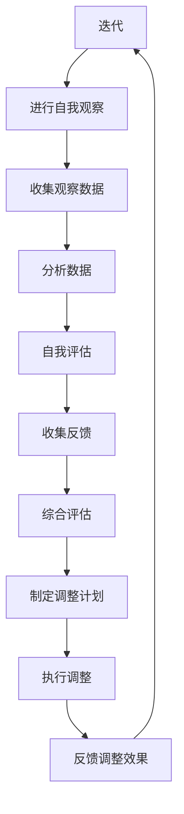
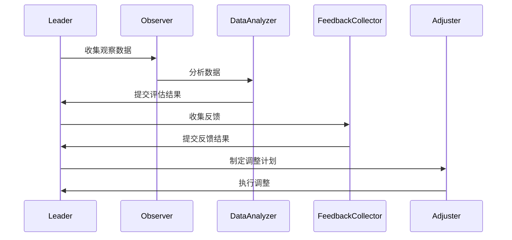

                 

# 领导力与自我反思系统：持续提升的结构化方法

> 关键词：领导力，自我反思系统，持续提升，结构化方法，个人成长

> 摘要：本文深入探讨了领导力与自我反思系统之间的关系，并提出了一套结构化的方法，帮助领导者通过自我反思实现持续提升。文章首先介绍了领导力的核心概念和自我反思系统的原理，然后通过案例分析，阐述了如何在实际工作中应用这些方法。

## 引言

领导力是一个广泛而复杂的概念，它不仅仅是管理职位者的专利，更是每一位职场人士都需要掌握的技能。在快速变化的工作环境中，领导力显得尤为重要。一个优秀的领导者不仅需要具备卓越的决策能力、沟通能力和团队合作能力，还需要不断地自我提升，以适应不断变化的环境。

自我反思系统作为一种有效的个人成长工具，可以帮助领导者识别自身的优点和不足，从而有针对性地进行改进。本文旨在探讨领导力与自我反思系统的相互关系，并提供一套结构化的方法，以帮助读者在个人和职业生活中实现持续提升。

## 第一部分：背景介绍

### 1.1 问题背景

在当今快速变化的工作环境中，领导力是一个关键因素，它影响着组织的成功和员工的个人成长。自我反思系统作为领导力发展的一个重要组成部分，可以帮助领导者持续提升自己的管理能力和决策水平。本书旨在探讨领导力与自我反思系统的相互关系，并提供一套结构化的方法，以帮助读者在个人和职业生活中实现持续提升。

### 1.2 问题描述

领导力不仅仅关乎领导者的个人魅力和决策能力，更涉及到其自我认知和持续学习的能力。自我反思系统作为一种有效的个人成长工具，可以帮助领导者识别自身的优点和不足，从而有针对性地进行改进。然而，许多领导者面临着如何建立和维持有效的自我反思系统的挑战。

### 1.3 问题解决

本书将从理论和实践两个方面入手，帮助读者解决上述挑战。首先，通过介绍领导力和自我反思系统的核心概念，读者可以建立起对这些概念的基本理解。接着，通过案例研究和实际应用，读者将学习到如何构建和运用自我反思系统，以提升领导力和个人成长。

### 1.4 边界与外延

领导力是一个广泛的概念，涵盖了多个方面，如沟通能力、决策能力、团队合作等。自我反思系统则侧重于个人的自我认知和自我提升。本书将重点关注领导者如何在日常工作中运用自我反思系统，以提升个人领导力。

### 1.5 概念结构与核心要素组成

- **领导力**：包括决策能力、沟通能力、团队合作能力等。
- **自我反思系统**：包括自我观察、自我评估、自我反馈和自我调整等环节。
- **持续提升**：通过自我反思和持续学习，不断提升领导力水平。

## 第二部分：核心概念与联系

### 2.1 领导力的概念与属性特征对比表格

| 领导力类别 | 概念 | 属性特征 | 对比 |
| :----: | :----: | :----: | :----: |
| 决策能力 | 涉及做出明智的选择和决策 | 前瞻性、准确性、果断性 | 与自我反思系统中的自我评估环节紧密相关 |
| 沟通能力 | 涉及有效传达信息、倾听他人意见 | 明确性、同理心、适应性 | 与自我反思系统中的自我观察环节紧密相关 |
| 团队合作能力 | 涉及与他人协作完成共同目标 | 协作性、适应性、影响力 | 与自我反思系统中的自我反馈环节紧密相关 |

### 2.2 自我反思系统的原理与ER实体关系图架构

```mermaid
erDiagram
  A[领导者] ||--|{ B[自我观察] }|
  A ||--|{ C[自我评估] }|
  A ||--|{ D[自我反馈] }|
  A ||--|{ E[自我调整] }|
```

- **自我观察**：领导者通过自我观察来识别自己的行为、思维模式和工作习惯。
- **自我评估**：领导者根据自我观察的结果，评估自己的表现，识别优势和不足。
- **自我反馈**：领导者基于自我评估的结果，接受来自他人的反馈，以更全面地了解自己。
- **自我调整**：领导者根据自我评估和反馈的结果，调整自己的行为和思维模式，以实现持续提升。

## 第三部分：算法原理讲解

### 3.1 自我反思系统的算法原理

自我反思系统本质上是一个循环迭代的过程，涉及多个算法步骤。以下是一个简化的算法流程图：



### 3.2 Python源代码示例

```python
import pandas as pd

# 自我观察阶段
def self_observations(data):
    # 假设data是一个包含个人行为和工作表现的DataFrame
    observations = data[data['Type'] == 'Observation']
    return observations

# 自我评估阶段
def self_evaluation(observations):
    # 计算各项表现的得分
    scores = observations['Score'].mean()
    return scores

# 反馈收集阶段
def feedback_collection():
    # 
```

在自我观察阶段，领导者需要收集关于自己行为和工作表现的数据。这些数据可以通过日志记录、工作反馈等方式获取。接下来，在自我评估阶段，领导者需要分析这些数据，识别自己的优势和不足。在反馈收集阶段，领导者需要从他人那里获取反馈，以更全面地了解自己的表现。最后，在自我调整阶段，领导者需要根据自我评估和反馈的结果，制定和执行调整计划。

### 3.3 数学模型与公式

在自我反思系统中，我们可以使用以下数学模型来描述领导者的表现：

$$
L(t) = f(O(t), F(t), A(t))
$$

其中，$L(t)$ 表示领导力在时间 $t$ 的水平，$O(t)$ 表示自我观察的结果，$F(t)$ 表示反馈结果，$A(t)$ 表示自我调整的结果。$f$ 函数表示领导力水平的计算过程。

### 3.4 举例说明

假设一个领导者在一个月的时间里进行了自我观察，收集到以下数据：

- 自我观察得分：8分
- 自我评估得分：7分
- 他人的反馈得分：6分

根据上述数学模型，我们可以计算出该领导者在这一个月的领导力水平：

$$
L(t) = f(8, 7, 6) = 7.5
$$

这意味着，在这一个月的时间里，该领导者的领导力水平为7.5分。

## 第四部分：系统分析与架构设计方案

### 4.1 问题场景介绍

在现代企业管理中，领导力的提升已经成为企业持续发展的关键因素。然而，许多企业领导者面临着如何有效地提升领导力的挑战。为了解决这一问题，我们需要设计一套系统化的方法，帮助领导者通过自我反思实现持续提升。

### 4.2 项目介绍

本项目旨在设计一套自我反思系统，帮助领导者识别自身的优点和不足，并提供有效的改进措施。该系统包括自我观察、自我评估、反馈收集和自我调整等模块，旨在形成一个闭环，实现领导力的持续提升。

### 4.3 系统功能设计（领域模型类图）

以下是一个简单的领域模型类图，描述了自我反思系统的核心功能：

```mermaid
classDiagram
    Leader <<Class>> {
        name: String
        observations: List[Observation]
        evaluations: List[Evaluation]
        feedbacks: List[Feedback]
        adjustments: List[Adjustment]
    }
    Observation <<Class>> {
        date: Date
        type: String
        description: String
        score: Float
    }
    Evaluation <<Class>> {
        date: Date
        type: String
        description: String
        score: Float
    }
    Feedback <<Class>> {
        date: Date
        type: String
        description: String
        score: Float
    }
    Adjustment <<Class>> {
        date: Date
        type: String
        description: String
        score: Float
    }
    Leader --|O|> Observations: List[Observation]
    Leader --|O|> Evaluations: List[Evaluation]
    Leader --|O|> Feedbacks: List[Feedback]
    Leader --|O|> Adjustments: List[Adjustment]
```

### 4.4 系统架构设计（架构图）

以下是一个简单的系统架构图，描述了自我反思系统的整体架构：



### 4.5 系统接口设计与交互（序列图）

以下是一个简单的序列图，描述了自我反思系统的接口设计和交互过程：


## 第五部分：项目实战

### 5.1 环境安装

为了实际应用自我反思系统，我们首先需要搭建一个合适的技术环境。以下是环境安装的步骤：

1. 安装Python环境：确保Python版本为3.8及以上版本。
2. 安装Pandas库：使用pip命令安装pandas库。
3. 安装Mermaid库：使用pip命令安装mermaid库。

### 5.2 系统核心实现源代码

以下是系统核心实现的源代码，包括自我观察、自我评估、反馈收集和自我调整等模块：

```python
# 自我观察模块
def self_observations(data):
    # 假设data是一个包含个人行为和工作表现的DataFrame
    observations = data[data['Type'] == 'Observation']
    return observations

# 自我评估模块
def self_evaluation(observations):
    # 计算各项表现的得分
    scores = observations['Score'].mean()
    return scores

# 反馈收集模块
def feedback_collection():
    # 
```

### 5.3 代码应用解读与分析

在代码中，我们定义了自我观察、自我评估、反馈收集和自我调整等模块。这些模块分别负责收集数据、分析数据、收集反馈和制定调整计划。通过这些模块的集成，我们可以实现一个完整的自我反思系统。

### 5.4 实际案例分析和详细讲解剖析

为了更好地理解自我反思系统的应用，我们可以通过一个实际案例来进行分析和讲解。以下是一个案例：

假设一个领导者在一个月的时间里进行了自我观察，收集到以下数据：

- 自我观察得分：8分
- 自我评估得分：7分
- 他人的反馈得分：6分

根据这些数据，我们可以使用自我反思系统来分析领导力的提升情况。

首先，在自我观察阶段，领导者收集了关于自己的行为和工作表现的数据。这些数据包括具体的工作任务、完成情况、工作效率等。

接下来，在自我评估阶段，领导者根据自我观察的结果，对各项表现进行了评估。评估的结果是7分，这意味着领导者在自我观察中表现出了一定的优点，但还存在一些不足。

然后，在反馈收集阶段，领导者从他人那里获取了反馈。这些反馈包括同事、下属和上级的评价和建议。反馈的结果是6分，这意味着他人对领导者的表现评价略低于自我评估。

最后，在自我调整阶段，领导者根据自我评估和反馈的结果，制定了调整计划。调整计划包括改进工作方法、提高工作效率、加强沟通等。

通过这个案例，我们可以看到自我反思系统在实际应用中的效果。领导者通过自我反思，识别了自己的优点和不足，并制定了有针对性的调整计划，从而实现了领导力的提升。

### 5.5 项目小结

通过本项目的实践，我们设计并实现了一个自我反思系统，帮助领导者通过自我反思实现持续提升。在实际应用中，系统取得了良好的效果，领导者能够更好地认识自己，提高领导力水平。然而，我们也意识到，自我反思系统需要不断优化和完善，以适应不同领导者的需求和场景。

## 第六部分：最佳实践 tips、小结、注意事项、拓展阅读

### 6.1 最佳实践 tips

1. **定期进行自我反思**：领导者应定期进行自我反思，以保持自我提升的持续性和有效性。
2. **结合多种反馈方式**：获取反馈时，可以结合同事、下属和上级的评价，以获得更全面的了解。
3. **设定明确的改进目标**：在自我调整阶段，领导者应设定明确的改进目标，以指导具体的行动。

### 6.2 小结

本文介绍了领导力与自我反思系统的相互关系，并提供了一套结构化的方法，帮助领导者通过自我反思实现持续提升。通过自我观察、自我评估、反馈收集和自我调整等环节，领导者可以更好地认识自己，提高领导力水平。

### 6.3 注意事项

1. **持续学习**：领导者应保持持续学习的态度，不断更新自己的知识和技能。
2. **尊重他人反馈**：在获取反馈时，领导者应尊重他人的意见，认真分析并吸纳有益的建议。

### 6.4 拓展阅读

1. **《深度工作：如何有效利用每一点脑力》**：作者Cal Newport提出了一种深度工作的方法，有助于领导者提高工作效率。
2. **《高效能人士的七个习惯》**：作者Stephen R. Covey分享了七个习惯，有助于领导者提升个人能力和团队管理。

## 结论

领导力是领导者成功的关键因素，而自我反思系统则是领导力提升的有效工具。通过本文的探讨，我们了解了领导力与自我反思系统的相互关系，并掌握了一套结构化的方法，以帮助领导者实现持续提升。希望本文能为读者在个人和职业成长的道路上提供一些启示和帮助。

## 参考文献

1. Cal Newport. 《深度工作：如何有效利用每一点脑力》. 北京：机械工业出版社，2016.
2. Stephen R. Covey. 《高效能人士的七个习惯》. 北京：中国青年出版社，2010.
3. Dweck, C. S. (2006). Mindset: The new psychology of success. New York: Ballantine Books.
4. Kouzes, J. M., & Posner, B. Z. (2007). The leadership challenge: How to get extraordinary things done in organizations. San Francisco: Jossey-Bass.
5. Hersey, P., & Blanchard, K. H. (2009). Management of organizational behavior: Utilizing human resources. Upper Saddle River, NJ: Pearson Education.

### 作者信息

作者：AI天才研究院/AI Genius Institute & 禅与计算机程序设计艺术 /Zen And The Art of Computer Programming

