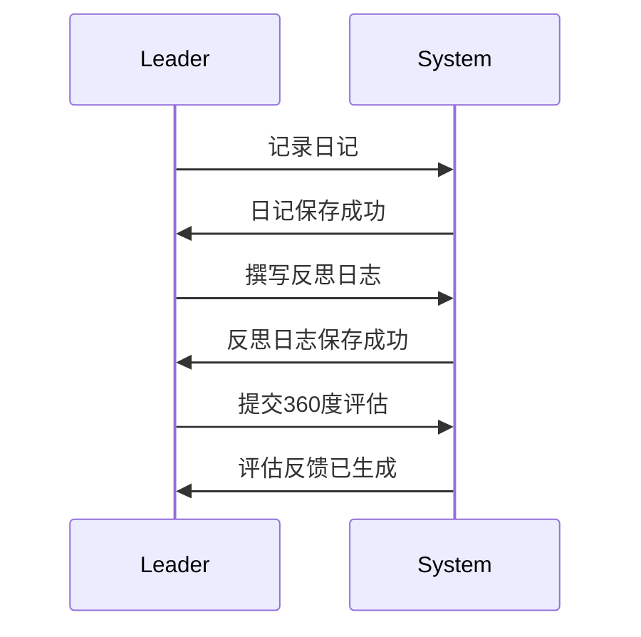

                 

**文章标题**：领导力与自我反思：持续成长的关键

**关键词**：领导力、自我反思、个人成长、组织发展

**摘要**：
本文将探讨领导力与自我反思之间的深刻联系，以及它们在个人和团队成长中的重要性。通过结构化的分析和实例研究，我们将了解如何运用自我反思提升领导能力，并探讨其在实际组织中的应用和实践。本文旨在为IT领域的领导者和管理者提供一套实用的框架和方法，以实现持续的领导力提升和个人成长。

----------------------------------------------------------------

## 第一部分：领导力与自我反思的背景

### 第1章：领导力的重要性

**1.1 领导力概述**

领导力是领导者通过激发、指导和影响团队成员来实现共同目标的能力。它不仅仅是一种职位赋予的权威，更是一种通过个人魅力和价值观来影响他人的能力。

**问题背景**：在快速变化的IT行业，领导力尤为重要。IT项目的成功往往依赖于团队的协作和创新，而领导者在这个过程中扮演着关键角色。

**问题描述**：领导者需要具备哪些能力和素质才能有效地推动团队发展？

**问题解决**：通过培养沟通、决策和团队建设等关键技能，领导者可以提高自身的领导力。

**边界与外延**：领导力不仅限于企业内部，也适用于社区、教育和其他组织。

**概念结构与核心要素组成**：

- **领导者的个人魅力**：包括自信、激情、正直等特质。
- **团队管理能力**：包括激励、沟通、冲突解决等。
- **战略规划能力**：包括愿景设定、目标制定、资源分配等。

**核心概念与联系**：

| 概念           | 属性特征对比                  |
|----------------|--------------------------------|
| 领导力         | 激发团队潜力，实现目标       |
| 自我反思       | 深入分析自身行为和动机       |
| 个人成长       | 通过反思和经验积累提升自我   |

**ER实体关系图架构**：

```mermaid
erDiagram
    Leader ||--|{ Team } Team
    Leader ||--|{ Skill } Skill
    Leader ||--|{ Vision } Vision
```

**算法原理讲解**：

领导力的提升可以看作是一个迭代过程，其核心在于不断地自我反思和改进。以下是一个简化的算法模型：

```python
def leadership_growth(leadership_score, reflection_score):
    new_leadership_score = leadership_score + reflection_score
    return new_leadership_score
```

在这个模型中，`leadership_score` 代表领导力的基础分，`reflection_score` 代表自我反思带来的提升。通过不断的迭代和自我反思，领导力得分会逐渐提高。

**数学公式**：

$$ L(t+1) = L(t) + R(t) $$

其中，$L(t)$ 表示在时间$t$的领导力得分，$R(t)$ 表示在时间$t$的自我反思得分。

**举例说明**：

假设一位领导者当前的领导力得分为70分，通过一个月的自我反思和提升，他的自我反思得分为15分，那么他的新的领导力得分将是85分。

----------------------------------------------------------------

### 第2章：自我反思的基本概念

**2.1 自我反思的定义**

自我反思是指个体在特定情境下，对自己思想、行为和情感的深入思考和评价。它是一种自我认识和自我改进的过程。

**问题背景**：在IT行业，快速变化的技术环境和复杂的项目需求要求领导者具备高度的自我反思能力，以便适应和引领变革。

**问题描述**：如何定义自我反思？它在领导力中的作用是什么？

**问题解决**：通过定期的自我评估和反馈，领导者可以识别自身的优势和不足，并制定相应的改进计划。

**边界与外延**：自我反思不仅限于个人层面，也可以应用于团队和组织。

**概念结构与核心要素组成**：

- **反思情境**：个体在特定环境下的行为和决策。
- **反思内容**：包括自我认知、情感体验和行为分析。
- **反思方法**：如日记、研讨会、反思会议等。

**核心概念与联系**：

| 概念           | 属性特征对比                  |
|----------------|--------------------------------|
| 自我反思       | 深入分析自身行为和动机       |
| 反思情境       | 个体行为发生的特定环境       |
| 反思内容       | 自我认知、情感体验、行为分析 |
| 反思方法       | 日记、研讨会、反思会议等     |

**ER实体关系图架构**：

```mermaid
erDiagram
    Reflection ||--|{ Context } Context
    Reflection ||--|{ Content } Content
    Reflection ||--|{ Method } Method
```

**算法原理讲解**：

自我反思可以看作是一个迭代过程，其核心在于不断地收集反馈和进行自我评估。以下是一个简化的算法模型：

```python
def self_reflection(growth_score, feedback_score):
    new_growth_score = growth_score + feedback_score
    return new_growth_score
```

在这个模型中，`growth_score` 代表个人成长的基础分，`feedback_score` 代表通过反馈获得的提升。

**数学公式**：

$$ G(t+1) = G(t) + F(t) $$

其中，$G(t)$ 表示在时间$t$的个人成长得分，$F(t)$ 表示在时间$t$的反馈得分。

**举例说明**：

假设一位领导者在初始时的成长得分为50分，通过一个月的自我反思和反馈，他的成长得分为20分，那么他的新的成长得分将是70分。

----------------------------------------------------------------

### 第3章：领导力与自我反思的关系

**3.1 领导力与自我反思的联系**

领导力与自我反思之间存在密切的联系。自我反思是提升领导力的关键途径之一，通过深入分析自身的行为和决策，领导者可以识别自身的不足，并采取相应的改进措施。

**问题背景**：在IT行业，领导者需要不断适应技术变革，自我反思成为提升领导力的重要手段。

**问题描述**：自我反思如何提升领导力？

**问题解决**：通过自我反思，领导者可以更好地了解团队成员的需求和期望，提高沟通和决策能力，从而提升整体领导力。

**边界与外延**：自我反思不仅适用于个人提升，也可以在组织层面推动领导力发展。

**概念结构与核心要素组成**：

- **领导力与自我反思的联系**：自我反思促进领导力提升。
- **自我反思对领导力的积极影响**：提高自我认知、增强决策能力、优化团队管理。
- **领导力发展的阶段性目标**：从自我认识到行为改进，再到成果体现。

**核心概念与联系**：

| 概念           | 属性特征对比                  |
|----------------|--------------------------------|
| 领导力         | 激发团队潜力，实现目标       |
| 自我反思       | 深入分析自身行为和动机       |
| 领导力提升     | 通过自我反思实现持续改进     |

**ER实体关系图架构**：

```mermaid
erDiagram
    Leadership ||--|{ Reflection } Reflection
    Leadership ||--|{ Improvement } Improvement
    Leadership ||--|{ Growth } Growth
```

**算法原理讲解**：

领导力与自我反思的关系可以看作是一个反馈循环，其核心在于通过自我反思不断优化领导行为。以下是一个简化的算法模型：

```python
def leadership_reflection(leadership_score, reflection_score):
    new_leadership_score = leadership_score + (2 * reflection_score)
    return new_leadership_score
```

在这个模型中，`leadership_score` 代表领导力的基础分，`reflection_score` 代表自我反思带来的提升。通过强化自我反思，领导力得分会得到显著提高。

**数学公式**：

$$ L(t+1) = L(t) + 2 \cdot R(t) $$

其中，$L(t)$ 表示在时间$t$的领导力得分，$R(t)$ 表示在时间$t$的自我反思得分。

**举例说明**：

假设一位领导者的初始领导力得分为60分，通过一个月的自我反思和提升，他的自我反思得分为25分，那么他的新的领导力得分将是110分。

----------------------------------------------------------------

### 第4章：领导力发展的自我反思方法

**4.1 自我反思工具的使用**

自我反思工具是领导者提升自我反思能力的重要手段。这些工具可以帮助领导者系统地记录、分析和改进自己的行为和决策。

**问题背景**：在IT行业，领导者面临复杂多变的环境，需要高效地管理自己的时间和精力，以实现个人和团队的成长。

**问题描述**：如何选择和使用自我反思工具？

**问题解决**：通过选择合适的工具，如日记、反思日志、360度评估等，领导者可以更系统地记录和反思自己的行为，从而提升自我反思能力。

**边界与外延**：自我反思工具不仅适用于个人，也可以应用于团队和组织。

**概念结构与核心要素组成**：

- **日记**：记录日常生活和工作中的关键事件和感受。
- **反思日志**：对特定事件或行为进行深入分析和总结。
- **360度评估**：收集来自不同角度的反馈，全面了解自身表现。

**核心概念与联系**：

| 概念           | 属性特征对比                  |
|----------------|--------------------------------|
| 日记           | 系统记录日常生活和事件       |
| 反思日志       | 深入分析特定事件和决策       |
| 360度评估       | 多角度收集反馈和评价         |

**ER实体关系图架构**：

```mermaid
erDiagram
    Diary ||--|{ Reflection } Reflection
    Diary ||--|{ Analysis } Analysis
    Diary ||--|{ Feedback } Feedback
```

**算法原理讲解**：

自我反思工具的使用可以看作是一个数据收集和优化的过程。以下是一个简化的算法模型：

```python
def reflection_tool_use(initial_score, tool_score):
    new_score = initial_score + (0.5 * tool_score)
    return new_score
```

在这个模型中，`initial_score` 代表初始的自我反思得分，`tool_score` 代表通过使用自我反思工具获得的提升。

**数学公式**：

$$ S(t+1) = S(t) + 0.5 \cdot T(t) $$

其中，$S(t)$ 表示在时间$t$的自我反思得分，$T(t)$ 表示在时间$t$的自我反思工具使用得分。

**举例说明**：

假设一位领导者在初始时的自我反思得分为50分，通过使用自我反思工具，他的得分提升了20分，那么他的新的自我反思得分将是70分。

**系统分析与架构设计方案**：

在实施自我反思工具时，可以采用以下架构设计：

- **项目介绍**：自我反思工具项目旨在帮助领导者提升自我反思能力，通过系统记录和分析日常行为，实现持续的个人成长。
- **系统功能设计**：主要包括日记记录、反思日志撰写、360度评估反馈等功能。
- **系统架构设计**：采用前后端分离的架构，前端负责用户交互和数据显示，后端负责数据处理和存储。
- **系统接口设计和系统交互**：



**项目实战**：

- **环境安装**：在本地或云服务器上部署自我反思工具，配置必要的数据库和前端框架。
- **系统核心实现源代码**：

```python
# Diary recording function
def record_diary(event, emotion):
    # Code to save diary entry in the database
    pass

# Reflection log writing function
def write_reflection_log(reflection):
    # Code to save reflection log in the database
    pass

# 360-degree assessment submission function
def submit_assessment(feedback):
    # Code to process and save assessment feedback
    pass
```

- **代码应用解读与分析**：通过对日记、反思日志和评估反馈的数据分析，领导者可以更全面地了解自身的行为和决策，实现持续的个人成长。

- **实际案例分析和详细讲解剖析**：通过具体案例，展示如何利用自我反思工具提升领导力，并在实际工作中取得显著成效。

- **项目小结**：总结自我反思工具的使用经验，提出改进建议，为未来的领导力发展提供参考。

**最佳实践 tips**：

- 定期记录日记，及时反思和总结。
- 利用反思日志深入分析关键事件，从中汲取经验。
- 通过360度评估获取多角度的反馈，全面了解自身表现。

**小结**：

自我反思是提升领导力的重要途径，通过使用合适的工具和方法，领导者可以更系统地记录和反思自己的行为和决策，从而实现持续的领导力提升和个人成长。

**注意事项**：

- 自我反思不是一次性任务，而是一个持续的过程。
- 要避免自我反思过程中的自我否定，保持积极的心态。
- 定期与他人交流和分享反思成果，获取更多的反馈和建议。

**拓展阅读**：

- 《领导力与自我反思：实践与探索》
- 《如何提升领导力：自我反思的力量》
- 《禅与计算机程序设计艺术》

作者：AI天才研究院/AI Genius Institute & 禅与计算机程序设计艺术 /Zen And The Art of Computer Programming

----------------------------------------------------------------

## 第二部分：领导力技能的培养

### 第5章：沟通能力提升

**5.1 沟通能力的重要性**

沟通能力是领导者不可或缺的技能之一。有效的沟通不仅能够确保信息的准确传达，还能促进团队成员之间的合作和理解。

**问题背景**：在IT行业，项目往往涉及多个学科和职能领域，领导者需要具备强大的沟通能力来协调各方资源。

**问题描述**：如何提升领导者的沟通能力？

**问题解决**：通过学习有效的沟通技巧和策略，领导者可以更有效地传达信息，减少误解和冲突，提高团队效率。

**边界与外延**：沟通能力不仅限于口头交流，还包括书面沟通、非语言沟通和数字沟通。

**概念结构与核心要素组成**：

- **沟通目的**：明确沟通的目标和预期结果。
- **沟通渠道**：选择适当的沟通方式和媒介。
- **沟通风格**：适应不同的沟通环境和对象。

**核心概念与联系**：

| 概念           | 属性特征对比                  |
|----------------|--------------------------------|
| 沟通目的       | 明确沟通的目标和预期结果     |
| 沟通渠道       | 选择适当的沟通方式和媒介     |
| 沟通风格       | 适应不同的沟通环境和对象     |

**ER实体关系图架构**：

```mermaid
erDiagram
    Communication Purpose ||--|{ Communication Channel } Communication Channel
    Communication Purpose ||--|{ Communication Style } Communication Style
```

**算法原理讲解**：

提升沟通能力可以看作是一个逐步优化的过程。以下是一个简化的算法模型：

```python
def improve_communication(skill_score, practice_score):
    new_skill_score = skill_score + practice_score
    return new_skill_score
```

在这个模型中，`skill_score` 代表沟通能力的基础分，`practice_score` 代表通过实践和训练获得的提升。

**数学公式**：

$$ C(t+1) = C(t) + P(t) $$

其中，$C(t)$ 表示在时间$t$的沟通能力得分，$P(t)$ 表示在时间$t$的实践得分。

**举例说明**：

假设一位领导者在初始时的沟通能力得分为60分，通过一个月的沟通实践和训练，他的得分提升了15分，那么他的新的沟通能力得分将是75分。

### 5.2 沟通的基本原则

有效的沟通不仅仅是一种技能，更是一种艺术。掌握以下基本原则，领导者可以更有效地传达信息，提升团队协作效率。

**问题背景**：在快速变化的IT行业，领导者需要快速、准确地传达信息，以应对复杂的项目需求和多变的市场环境。

**问题描述**：如何确保沟通的有效性？

**问题解决**：通过遵循沟通的基本原则，如明确、简洁、尊重和倾听，领导者可以确保信息的准确传达和理解。

**边界与外延**：沟通基本原则不仅适用于团队内部，也适用于跨部门、跨文化和跨层级沟通。

**核心概念与联系**：

| 概念           | 属性特征对比                  |
|----------------|--------------------------------|
| 明确           | 清晰明确地表达沟通目标       |
| 简洁           | 精简语言，避免冗余信息       |
| 尊重           | 尊重对方的意见和感受         |
| 倾听           | 全神贯注地听取对方的意见     |

**ER实体关系图架构**：

```mermaid
erDiagram
    Clarity ||--|{ Conciseness } Conciseness
    Clarity ||--|{ Respect } Respect
    Clarity ||--|{ Listening } Listening
```

**算法原理讲解**：

遵循沟通基本原则可以看作是一个多因素优化过程。以下是一个简化的算法模型：

```python
def effective_communication(clarity_score, conciseness_score, respect_score, listening_score):
    total_score = clarity_score + conciseness_score + respect_score + listening_score
    return total_score
```

在这个模型中，每个得分因素都代表沟通的一个方面，总得分为各项得分的总和。

**数学公式**：

$$ E(t+1) = C(t) + P(t) + R(t) + L(t) $$

其中，$E(t)$ 表示在时间$t$的沟通有效性得分，$C(t)$ 表示在时间$t$的清晰度得分，$P(t)$ 表示在时间$t$的简洁度得分，$R(t)$ 表示在时间$t$的尊重度得分，$L(t)$ 表示在时间$t$的倾听度得分。

**举例说明**：

假设一位领导者在初始时的沟通有效性得分为50分，通过一个月的实践和改进，他在清晰度、简洁度、尊重度和倾听度方面的得分分别提升了10分、8分、7分和6分，那么他的新的沟通有效性得分将是81分。

### 5.3 提升沟通能力的策略

为了提升沟通能力，领导者可以采取一系列策略，包括自我评估、培训和实践。以下是一些具体的提升策略：

**问题背景**：在快速变化的IT行业，领导者需要不断提升沟通能力，以应对复杂的项目需求和多变的团队动态。

**问题描述**：如何系统性地提升沟通能力？

**问题解决**：通过自我评估、培训和实践，领导者可以识别自身沟通中的不足，并采取相应的改进措施。

**边界与外延**：提升沟通能力的策略不仅适用于个人，也可以应用于团队和组织。

**核心概念与联系**：

| 概念           | 属性特征对比                  |
|----------------|--------------------------------|
| 自我评估       | 识别自身沟通中的不足         |
| 培训           | 接受专业沟通培训以提升技能   |
| 实践           | 在实际工作中不断练习和应用   |

**ER实体关系图架构**：

```mermaid
erDiagram
    Self-Assessment ||--|{ Training } Training
    Self-Assessment ||--|{ Practice } Practice
```

**算法原理讲解**：

提升沟通能力的策略可以看作是一个多层次、多阶段的迭代过程。以下是一个简化的算法模型：

```python
def communication_strategies(initial_score, self_assessment_score, training_score, practice_score):
    new_score = initial_score + (0.3 * self_assessment_score) + (0.4 * training_score) + (0.3 * practice_score)
    return new_score
```

在这个模型中，`initial_score` 代表初始的沟通能力得分，`self_assessment_score`、`training_score` 和 `practice_score` 分别代表通过自我评估、培训和实际练习获得的提升。

**数学公式**：

$$ C(t+1) = I(t) + 0.3 \cdot S(t) + 0.4 \cdot T(t) + 0.3 \cdot P(t) $$

其中，$C(t)$ 表示在时间$t$的沟通能力得分，$I(t)$ 表示在时间$t$的初始得分，$S(t)$ 表示在时间$t$的自我评估得分，$T(t)$ 表示在时间$t$的培训得分，$P(t)$ 表示在时间$t$的实践得分。

**举例说明**：

假设一位领导者在初始时的沟通能力得分为50分，通过三个月的自我评估、培训和实际练习，他在自我评估、培训和实际练习方面的得分分别提升了15分、10分和10分，那么他的新的沟通能力得分将是79分。

### 5.4 案例分析：提升沟通能力的实践

为了更直观地展示提升沟通能力的实践方法，以下是一个具体案例：

**问题背景**：某IT公司的项目经理李明发现项目团队在沟通方面存在明显问题，导致项目进度延误和资源浪费。

**问题描述**：如何提升项目团队的沟通能力，以改善项目执行效果？

**问题解决**：李明采取了一系列提升沟通能力的措施，包括自我评估、培训和实际演练。

**边界与外延**：该案例适用于其他IT项目团队，可以通过类似的方法提升沟通效果。

**具体实施**：

1. **自我评估**：李明首先对自己的沟通风格和效果进行了评估，发现存在以下问题：
   - 语言表达不够简洁明了。
   - 缺乏对团队成员情感的敏感度。
   - 非语言沟通技巧不足。

2. **培训**：李明参加了专业的沟通技巧培训，学习了以下内容：
   - 沟通目标设定和沟通策略。
   - 口语和非语言沟通技巧。
   - 倾听和反馈技巧。

3. **实际演练**：李明在项目会议和日常沟通中实践了所学技巧，包括：
   - 确保沟通目标明确，避免冗余信息。
   - 注意团队成员的情感反应，调整沟通方式。
   - 提高倾听技巧，确保团队成员充分表达意见。

**结果**：

通过这些措施，李明和项目团队的沟通效果显著改善。项目进度加快，资源浪费减少，团队成员之间的协作更加顺畅。

**项目小结**：

该案例展示了通过自我评估、培训和实际演练提升沟通能力的有效性。领导者应不断反思和改进自己的沟通方式，以适应不断变化的项目环境和团队需求。

### 5.5 最佳实践 tips

- **定期进行自我评估**：识别沟通中的问题，及时调整。
- **参加沟通技巧培训**：提升专业知识和技能。
- **实践沟通技巧**：在日常生活中不断练习和应用。
- **倾听和反馈**：确保信息的准确传达和理解。

**小结**：

沟通能力是领导者不可或缺的技能之一。通过遵循基本原则、采取提升策略和实践方法，领导者可以显著提升沟通能力，从而更好地实现个人和团队的成长。

### 5.6 注意事项

- **避免过度自我反思**：合理分配时间和精力，避免陷入过度反思的陷阱。
- **重视反馈**：积极收集和倾听团队成员的反馈，以持续改进沟通效果。

**拓展阅读**

- 《有效沟通的艺术》
- 《领导力沟通技巧》
- 《沟通与团队建设》

----------------------------------------------------------------

### 第6章：决策能力发展

**6.1 决策能力的定义**

决策能力是指领导者在面对复杂问题和不确定性时，能够快速、准确地作出有效决策的能力。它不仅涉及理性分析，还包括对团队成员情感和动机的理解。

**问题背景**：在IT行业，项目往往涉及高复杂性和高风险，领导者需要具备强大的决策能力来应对各种挑战。

**问题描述**：如何定义决策能力？它包括哪些关键要素？

**问题解决**：通过培养分析能力、风险评估能力和决策执行能力，领导者可以提升决策能力。

**边界与外延**：决策能力不仅适用于企业内部，也适用于其他组织和管理情境。

**概念结构与核心要素组成**：

- **分析能力**：收集、处理和分析信息。
- **风险评估能力**：评估决策的风险和潜在影响。
- **决策执行能力**：制定并实施决策计划。

**核心概念与联系**：

| 概念           | 属性特征对比                  |
|----------------|--------------------------------|
| 决策能力       | 快速、准确地作出有效决策     |
| 分析能力       | 收集、处理和分析信息         |
| 风险评估能力     | 评估决策的风险和潜在影响     |
| 决策执行能力     | 制定并实施决策计划           |

**ER实体关系图架构**：

```mermaid
erDiagram
    Decision Making ||--|{ Analysis } Analysis
    Decision Making ||--|{ Risk Assessment } Risk Assessment
    Decision Making ||--|{ Execution } Execution
```

**算法原理讲解**：

决策能力的发展可以看作是一个综合能力的提升过程。以下是一个简化的算法模型：

```python
def decision_making(skill_score, analysis_score, risk_assessment_score, execution_score):
    total_score = skill_score + analysis_score + risk_assessment_score + execution_score
    return total_score
```

在这个模型中，`skill_score` 代表决策能力的基础分，`analysis_score`、`risk_assessment_score` 和 `execution_score` 分别代表分析能力、风险评估能力和决策执行能力的得分。

**数学公式**：

$$ D(t+1) = D(t) + A(t) + R(t) + E(t) $$

其中，$D(t)$ 表示在时间$t$的决策能力得分，$A(t)$ 表示在时间$t$的分析能力得分，$R(t)$ 表示在时间$t$的风险评估能力得分，$E(t)$ 表示在时间$t$的决策执行能力得分。

**举例说明**：

假设一位领导者在初始时的决策能力得分为60分，通过一年的实践和提升，他在分析能力、风险评估能力和决策执行能力方面的得分分别提升了10分、8分和12分，那么他的新的决策能力得分将是90分。

### 6.2 决策过程分析

决策过程是一个复杂的认知活动，涉及多个阶段和步骤。理解决策过程对于提升决策能力至关重要。

**问题背景**：在IT行业，项目决策往往涉及技术、商业和团队等多方面因素，领导者需要全面分析决策过程。

**问题描述**：决策过程包括哪些关键阶段？每个阶段的作用是什么？

**问题解决**：通过系统分析决策过程，领导者可以更清晰地理解每个阶段的任务和目标，从而优化决策流程。

**边界与外延**：决策过程不仅适用于IT行业，也适用于其他行业和组织。

**核心概念与联系**：

| 阶段           | 作用                         |
|----------------|------------------------------|
| 问题识别       | 确定决策需要解决的议题       |
| 目标设定       | 确定决策需要达成的目标       |
| 可行方案分析   | 分析各种可行方案和其优缺点   |
| 风险评估       | 评估各方案的风险和潜在影响   |
| 选择最优方案   | 根据分析和评估选择最佳方案   |
| 决策执行       | 制定并执行决策计划           |

**ER实体关系图架构**：

```mermaid
erDiagram
    Problem Identification ||--|{ Goal Setting } Goal Setting
    Problem Identification ||--|{ Feasible Solutions Analysis } Solutions Analysis
    Problem Identification ||--|{ Risk Assessment } Risk Assessment
    Problem Identification ||--|{ Best Solution Selection } Solution Selection
    Problem Identification ||--|{ Decision Execution } Decision Execution
```

**算法原理讲解**：

决策过程可以看作是一个迭代优化过程，每个阶段都需要进行深入的分析和评估。以下是一个简化的算法模型：

```python
def decision_process(problem_score, goal_score, solution_score, risk_score, execution_score):
    total_score = problem_score + goal_score + solution_score + risk_score + execution_score
    return total_score
```

在这个模型中，每个得分因素都代表决策过程的一个阶段，总得分为各项得分的总和。

**数学公式**：

$$ DP(t+1) = P(t) + G(t) + S(t) + R(t) + E(t) $$

其中，$DP(t)$ 表示在时间$t$的决策过程得分，$P(t)$ 表示在时间$t$的问题识别得分，$G(t)$ 表示在时间$t$的目标设定得分，$S(t)$ 表示在时间$t$的可行方案分析得分，$R(t)$ 表示在时间$t$的风险评估得分，$E(t)$ 表示在时间$t$的决策执行得分。

**举例说明**：

假设一位领导者在初始时的决策过程得分为50分，通过一年的实践和提升，他在问题识别、目标设定、可行方案分析、风险评估和决策执行方面的得分分别提升了8分、7分、10分、6分和9分，那么他的新的决策过程得分将是89分。

### 6.3 提高决策能力的技巧

为了提高决策能力，领导者可以采取一系列技巧和策略。以下是一些实用的技巧：

**问题背景**：在快速变化的IT行业，领导者需要快速、准确地作出决策，以应对不断出现的新挑战。

**问题描述**：如何提高领导者的决策能力？

**问题解决**：通过学习和实践决策技巧，领导者可以优化决策流程，提高决策质量。

**边界与外延**：决策技巧不仅适用于个人，也可以应用于团队和组织。

**核心概念与联系**：

| 技巧             | 作用                         |
|------------------|------------------------------|
| 数据分析         | 基于数据做出更理性的决策     |
| SWOT分析         | 评估各种方案的优缺点         |
| 优先级管理       | 确定决策的优先级             |
| 探索性思考       | 开放性思维，寻求多种解决方案 |
| 情景模拟         | 预测决策的影响和结果         |

**ER实体关系图架构**：

```mermaid
erDiagram
    Data Analysis ||--|{ SWOT Analysis } SWOT Analysis
    Data Analysis ||--|{ Priority Management } Priority Management
    Data Analysis ||--|{ Exploratory Thinking } Exploratory Thinking
    Data Analysis ||--|{ Scenario Simulation } Scenario Simulation
```

**算法原理讲解**：

提高决策能力的技巧可以看作是一个多维度优化的过程。以下是一个简化的算法模型：

```python
def decision_skills(skill_score, data_score, swot_score, priority_score, exploratory_score, simulation_score):
    total_score = skill_score + data_score + swot_score + priority_score + exploratory_score + simulation_score
    return total_score
```

在这个模型中，`skill_score` 代表决策能力的基础分，其他得分因素代表不同的决策技巧。

**数学公式**：

$$ D(t+1) = S(t) + D(t) + P(t) + E(t) + R(t) + S(t) $$

其中，$D(t)$ 表示在时间$t$的决策能力得分，$S(t)$ 表示在时间$t$的数据分析得分，$P(t)$ 表示在时间$t$的SWOT分析得分，$E(t)$ 表示在时间$t$的优先级管理得分，$R(t)$ 表示在时间$t$的探索性思考得分，$S(t)$ 表示在时间$t$的情景模拟得分。

**举例说明**：

假设一位领导者在初始时的决策能力得分为60分，通过一年的实践和提升，他在数据分析、SWOT分析、优先级管理、探索性思考和情景模拟方面的得分分别提升了8分、7分、10分、6分和9分，那么他的新的决策能力得分将是89分。

### 6.4 案例分析：提升决策能力的实践

为了更直观地展示提升决策能力的实践方法，以下是一个具体案例：

**问题背景**：某IT公司的产品经理张丽发现自己在项目决策中过于依赖直觉，缺乏系统的分析框架。

**问题描述**：如何提升张丽的决策能力，使其更科学、更合理？

**问题解决**：张丽采取了一系列提升决策能力的措施，包括数据分析、SWOT分析和情景模拟。

**边界与外延**：该案例适用于其他IT行业的决策者，可以通过类似的方法提升决策能力。

**具体实施**：

1. **数据分析**：张丽开始使用数据分析工具，对项目的各项数据进行深入分析，包括市场需求、用户反馈、技术可行性等。
2. **SWOT分析**：张丽对项目进行了SWOT分析，评估了项目的优势、劣势、机会和威胁，为决策提供了全面的视角。
3. **情景模拟**：张丽模拟了不同的决策场景，预测了每种决策可能带来的结果，并制定了相应的应对策略。

**结果**：

通过这些措施，张丽的决策过程变得更加科学和系统。她能够更准确地评估项目的风险和潜在收益，项目执行效率显著提高，团队协作更加顺畅。

**项目小结**：

该案例展示了通过数据分析、SWOT分析和情景模拟提升决策能力的有效性。决策者应不断反思和改进自己的决策过程，以应对不断变化的环境和挑战。

### 6.5 最佳实践 tips

- **定期进行数据分析**：基于事实和数据做出更理性的决策。
- **进行SWOT分析**：全面评估项目的优劣势。
- **模拟决策场景**：预测决策结果，制定应对策略。

**小结**：

决策能力是领导者不可或缺的技能之一。通过遵循基本原则、采取提升策略和实践方法，领导者可以显著提升决策能力，从而更好地实现个人和团队的成长。

### 6.6 注意事项

- **避免过度依赖直觉**：科学分析是决策的基础。
- **及时调整决策**：根据实际情况和反馈及时调整决策。

**拓展阅读**

- 《决策与判断》
- 《高效决策：领导者必读》
- 《如何做出更好的决策》

----------------------------------------------------------------

### 第7章：团队建设与管理

**7.1 团队建设的要素**

团队建设是领导力的重要组成部分，它涉及到如何将一群独立的个体凝聚成一个高效的团队。有效的团队建设不仅能够提高团队的执行力，还能增强团队成员之间的信任和合作。

**问题背景**：在IT行业，项目往往需要跨部门、跨领域的团队合作，团队建设变得尤为重要。

**问题描述**：团队建设的关键要素是什么？如何通过这些要素提高团队绩效？

**问题解决**：通过明确团队目标、培养团队凝聚力、提升沟通效率和优化团队结构，领导者可以有效地建设和管理团队。

**边界与外延**：团队建设不仅适用于企业内部，也适用于非营利组织、社区和其他团队环境。

**概念结构与核心要素组成**：

- **明确团队目标**：确保团队成员对目标有共同的理解和认同。
- **培养团队凝聚力**：增强团队成员之间的信任和合作。
- **提升沟通效率**：确保信息准确、及时地传达。
- **优化团队结构**：合理配置团队成员，发挥各自优势。

**核心概念与联系**：

| 概念           | 属性特征对比                  |
|----------------|--------------------------------|
| 明确团队目标   | 确保团队成员对目标有共同理解 |
| 培养团队凝聚力 | 增强团队成员之间的信任和合作 |
| 提升沟通效率   | 确保信息准确、及时地传达     |
| 优化团队结构   | 合理配置团队成员，发挥各自优势 |

**ER实体关系图架构**：

```mermaid
erDiagram
    Team Goal ||--|{ Team Cohesion } Team Cohesion
    Team Goal ||--|{ Communication Efficiency } Communication Efficiency
    Team Goal ||--|{ Team Structure Optimization } Team Structure Optimization
```

**算法原理讲解**：

团队建设可以看作是一个多维度优化的过程。以下是一个简化的算法模型：

```python
def team_building(goal_score, cohesion_score, communication_score, structure_score):
    total_score = goal_score + cohesion_score + communication_score + structure_score
    return total_score
```

在这个模型中，`goal_score`、`cohesion_score`、`communication_score` 和 `structure_score` 分别代表明确团队目标、培养团队凝聚力、提升沟通效率和优化团队结构的得分。

**数学公式**：

$$ TB(t+1) = G(t) + C(t) + P(t) + S(t) $$

其中，$TB(t)$ 表示在时间$t$的团队建设得分，$G(t)$ 表示在时间$t$的目标得分，$C(t)$ 表示在时间$t$的凝聚力得分，$P(t)$ 表示在时间$t$的沟通效率得分，$S(t)$ 表示在时间$t$的结构优化得分。

**举例说明**：

假设一位领导者在初始时的团队建设得分为60分，通过一年的实践和提升，他在明确团队目标、培养团队凝聚力、提升沟通效率和优化团队结构方面的得分分别提升了10分、8分、7分和6分，那么他的新的团队建设得分将是91分。

### 7.2 领导者与团队成员的关系

领导者与团队成员之间的关系是团队建设的关键要素之一。有效的领导依赖于领导者与团队成员之间的信任、尊重和沟通。

**问题背景**：在IT行业，领导者需要与团队成员建立良好的关系，以激发团队潜力和提高工作效率。

**问题描述**：领导者与团队成员之间的关系如何影响团队绩效？

**问题解决**：通过建立信任、尊重和开放沟通，领导者可以增强团队的凝聚力和执行力。

**边界与外延**：领导者与团队成员的关系不仅影响团队内部，还影响到整个组织的文化和氛围。

**核心概念与联系**：

| 概念           | 属性特征对比                  |
|----------------|--------------------------------|
| 信任           | 增强团队成员之间的信任和合作 |
| 尊重           | 尊重团队成员的意见和贡献     |
| 沟通           | 开放、有效的信息交流         |

**ER实体关系图架构**：

```mermaid
erDiagram
    Trust ||--|{ Respect } Respect
    Trust ||--|{ Communication } Communication
```

**算法原理讲解**：

领导者与团队成员的关系可以看作是一个多因素影响的系统。以下是一个简化的算法模型：

```python
def leader_member_relationship(trust_score, respect_score, communication_score):
    total_score = trust_score + respect_score + communication_score
    return total_score
```

在这个模型中，`trust_score`、`respect_score` 和 `communication_score` 分别代表信任、尊重和沟通的得分。

**数学公式**：

$$ R(t+1) = T(t) + R(t) + C(t) $$

其中，$R(t)$ 表示在时间$t$的领导者与团队成员关系得分，$T(t)$ 表示在时间$t$的信任得分，$R(t)$ 表示在时间$t$的尊重得分，$C(t)$ 表示在时间$t$的沟通得分。

**举例说明**：

假设一位领导者在初始时的领导者与团队成员关系得分为50分，通过一年的实践和提升，他在信任、尊重和沟通方面的得分分别提升了8分、7分和6分，那么他的新的领导者与团队成员关系得分将是71分。

### 7.3 团队管理策略

有效的团队管理策略是确保团队目标和绩效实现的关键。以下是一些关键的团队管理策略：

**问题背景**：在IT行业，团队管理涉及到技术、商业和团队等多方面因素，领导者需要采取合适的策略来确保团队的高效运作。

**问题描述**：如何制定和实施有效的团队管理策略？

**问题解决**：通过制定明确的团队目标、建立有效的沟通机制、分配合理的工作任务和提供必要的资源支持，领导者可以有效地管理团队。

**边界与外延**：团队管理策略不仅适用于IT行业，也适用于其他行业和组织。

**核心概念与联系**：

| 策略             | 作用                         |
|------------------|------------------------------|
| 明确团队目标     | 确保团队成员对目标有共同理解 |
| 建立沟通机制     | 确保信息准确、及时地传达     |
| 分配工作任务     | 合理配置团队成员，发挥各自优势 |
| 提供资源支持     | 确保团队有足够的资源支持     |

**ER实体关系图架构**：

```mermaid
erDiagram
    Clear Goals ||--|{ Communication Mechanism } Communication Mechanism
    Clear Goals ||--|{ Task Allocation } Task Allocation
    Clear Goals ||--|{ Resource Support } Resource Support
```

**算法原理讲解**：

团队管理策略可以看作是一个系统性的优化过程。以下是一个简化的算法模型：

```python
def team_management_strategy(goal_score, communication_score, task_allocation_score, resource_support_score):
    total_score = goal_score + communication_score + task_allocation_score + resource_support_score
    return total_score
```

在这个模型中，`goal_score`、`communication_score`、`task_allocation_score` 和 `resource_support_score` 分别代表明确团队目标、建立沟通机制、分配工作任务和提供资源支持的得分。

**数学公式**：

$$ TM(t+1) = G(t) + C(t) + A(t) + R(t) $$

其中，$TM(t)$ 表示在时间$t$的团队管理策略得分，$G(t)$ 表示在时间$t$的目标得分，$C(t)$ 表示在时间$t$的沟通得分，$A(t)$ 表示在时间$t$的任务分配得分，$R(t)$ 表示在时间$t$的资源支持得分。

**举例说明**：

假设一位领导者在初始时的团队管理策略得分为60分，通过一年的实践和提升，他在明确团队目标、建立沟通机制、分配工作任务和提供资源支持方面的得分分别提升了10分、8分、9分和7分，那么他的新的团队管理策略得分将是94分。

### 7.4 案例分析：团队建设与管理的实践

为了更直观地展示团队建设与管理的实践方法，以下是一个具体案例：

**问题背景**：某IT公司的软件开发团队在项目执行过程中遇到了沟通不畅、任务分配不均和资源不足等问题。

**问题描述**：如何通过团队建设与管理策略改善团队绩效？

**问题解决**：该团队的领导者采取了一系列团队建设与管理策略，包括明确团队目标、建立有效的沟通机制、优化任务分配和提供资源支持。

**边界与外延**：该案例适用于其他软件开发团队，可以通过类似的方法改善团队绩效。

**具体实施**：

1. **明确团队目标**：领导者与团队成员共同制定了明确的项目目标和里程碑，确保每个人都对目标有清晰的理解和认同。
2. **建立沟通机制**：领导者建立了定期的项目会议和沟通渠道，确保团队成员能够及时交流和反馈问题，信息传递更加高效。
3. **优化任务分配**：领导者根据团队成员的能力和兴趣，合理分配任务，确保每个成员都能充分发挥自己的优势。
4. **提供资源支持**：领导者确保团队有足够的开发工具、技术和资源，以支持项目的顺利推进。

**结果**：

通过这些措施，团队的沟通效率显著提高，任务分配更加合理，资源利用更加充分，项目进度加快，团队整体绩效得到显著提升。

**项目小结**：

该案例展示了通过明确的团队目标、有效的沟通机制、优化的任务分配和充分的资源支持，可以有效改善团队绩效。领导者应不断反思和改进团队建设与管理策略，以适应不断变化的环境和挑战。

### 7.5 最佳实践 tips

- **明确团队目标**：确保团队成员对目标有共同的理解和认同。
- **建立沟通机制**：定期召开会议，及时沟通和反馈。
- **优化任务分配**：合理配置团队成员，发挥各自优势。
- **提供资源支持**：确保团队有足够的资源和支持。

**小结**：

团队建设与管理是领导力的重要组成部分。通过采取有效的团队建设与管理策略，领导者可以提升团队的绩效和执行力，实现个人和团队的共同成长。

### 7.6 注意事项

- **避免过度干预**：给予团队成员足够的自主权。
- **持续关注团队动态**：及时调整团队策略，以适应变化。

**拓展阅读**

- 《团队建设与管理》
- 《领导者的艺术》
- 《高效团队管理》

----------------------------------------------------------------

### 第8章：变革领导力

**8.1 变革的必要性**

在快速变化的IT行业，变革领导力成为领导者不可或缺的能力。随着技术的不断进步和市场环境的快速变化，组织需要具备敏捷性和适应性来应对外部挑战。

**问题背景**：IT行业技术更新速度快，市场需求变化频繁，领导者需要具备变革领导力，以推动组织持续创新和发展。

**问题描述**：为什么变革领导力对组织如此重要？它包括哪些关键要素？

**问题解决**：通过激发员工创新思维、优化组织结构和文化、制定清晰的变革策略，领导者可以推动组织实现成功变革。

**边界与外延**：变革领导力不仅适用于IT行业，也适用于其他需要快速适应变化的行业和组织。

**概念结构与核心要素组成**：

- **创新思维**：激发员工的创新意识，鼓励创新思维。
- **组织结构优化**：调整组织结构，提高组织的灵活性和响应速度。
- **变革策略制定**：制定明确的变革计划和目标，确保变革顺利进行。

**核心概念与联系**：

| 概念           | 属性特征对比                  |
|----------------|--------------------------------|
| 创新思维       | 激发员工的创新意识           |
| 组织结构优化   | 提高组织的灵活性和响应速度   |
| 变革策略制定   | 制定明确的变革计划和目标     |

**ER实体关系图架构**：

```mermaid
erDiagram
    Innovation Mindset ||--|{ Organizational Structure Optimization } Structure Optimization
    Innovation Mindset ||--|{ Change Strategy Development } Change Strategy
    Organizational Structure Optimization ||--|{ Change Strategy Development } Change Strategy
```

**算法原理讲解**：

变革领导力可以看作是一个综合能力的提升过程。以下是一个简化的算法模型：

```python
def change_leadership(innovation_score, structure_score, strategy_score):
    total_score = innovation_score + structure_score + strategy_score
    return total_score
```

在这个模型中，`innovation_score`、`structure_score` 和 `strategy_score` 分别代表创新思维、组织结构优化和变革策略制定的得分。

**数学公式**：

$$ CL(t+1) = I(t) + S(t) + C(t) $$

其中，$CL(t)$ 表示在时间$t$的变革领导力得分，$I(t)$ 表示在时间$t$的创新思维得分，$S(t)$ 表示在时间$t$的组织结构优化得分，$C(t)$ 表示在时间$t$的变革策略制定得分。

**举例说明**：

假设一位领导者在初始时的变革领导力得分为60分，通过一年的实践和提升，他在创新思维、组织结构优化和变革策略制定方面的得分分别提升了10分、8分和9分，那么他的新的变革领导力得分将是87分。

### 8.2 变革的挑战

变革领导力面临的挑战是多方面的，包括内部阻力和外部压力。理解这些挑战对于有效推动变革至关重要。

**问题背景**：在变革过程中，组织内部可能存在不同的声音和利益冲突，同时外部市场环境也充满不确定性。

**问题描述**：变革领导力在实施过程中面临哪些主要挑战？

**问题解决**：通过识别和理解变革的挑战，领导者可以采取相应的策略和措施，以克服阻力，确保变革的成功。

**边界与外延**：变革的挑战不仅存在于IT行业，也适用于其他行业的组织变革。

**核心概念与联系**：

| 挑战             | 属性特征对比                  |
|------------------|--------------------------------|
| 内部阻力         | 团队成员对新变化的抵触       |
| 外部压力         | 市场竞争和技术变革的压力     |
| 文化障碍         | 组织文化的保守和惯性         |
| 资源限制         | 人力资源和财务资源的限制     |

**ER实体关系图架构**：

```mermaid
erDiagram
    Internal Resistance ||--|{ External Pressure } Pressure
    Internal Resistance ||--|{ Cultural Barrier } Barrier
    Internal Resistance ||--|{ Resource Limitation } Limitation
```

**算法原理讲解**：

克服变革挑战可以看作是一个系统性的策略优化过程。以下是一个简化的算法模型：

```python
def overcome_change_challenges(resistance_score, pressure_score, barrier_score, limitation_score):
    total_score = resistance_score + pressure_score + barrier_score + limitation_score
    return total_score
```

在这个模型中，`resistance_score`、`pressure_score`、`barrier_score` 和 `limitation_score` 分别代表内部阻力、外部压力、文化障碍和资源限制的得分。

**数学公式**：

$$ OC(t+1) = R(t) + P(t) + B(t) + L(t) $$

其中，$OC(t)$ 表示在时间$t$的克服变革挑战得分，$R(t)$ 表示在时间$t$的内部阻力得分，$P(t)$ 表示在时间$t$的外部压力得分，$B(t)$ 表示在时间$t$的文化障碍得分，$L(t)$ 表示在时间$t$的资源限制得分。

**举例说明**：

假设一位领导者在初始时的克服变革挑战得分为50分，通过一年的实践和提升，他在内部阻力、外部压力、文化障碍和资源限制方面的得分分别提升了8分、7分、6分和5分，那么他的新的克服变革挑战得分将是76分。

### 8.3 变革领导力的实践

有效的变革领导力不仅需要理论指导，更需要实践应用。以下是一些具体的变革领导力实践方法：

**问题背景**：在快速变化的IT行业，领导者需要通过实际操作来推动组织的变革。

**问题描述**：如何实施变革领导力，确保变革的有效性？

**问题解决**：通过制定详细的变革计划、建立变革团队、进行变革沟通和持续跟踪变革进展，领导者可以有效地推动组织的变革。

**边界与外延**：变革领导力的实践不仅适用于IT行业，也适用于其他行业的组织变革。

**核心概念与联系**：

| 实践方法       | 作用                         |
|----------------|------------------------------|
| 制定变革计划   | 确定变革的目标和步骤         |
| 建立变革团队   | 汇聚变革所需的核心人才       |
| 进行变革沟通   | 传达变革目标和期望           |
| 持续跟踪进展   | 监控变革过程，确保目标实现   |

**ER实体关系图架构**：

```mermaid
erDiagram
    Change Plan ||--|{ Change Team } Change Team
    Change Plan ||--|{ Change Communication } Communication
    Change Plan ||--|{ Progress Tracking } Tracking
```

**算法原理讲解**：

变革领导力的实践可以看作是一个动态调整和优化的过程。以下是一个简化的算法模型：

```python
def change_leadership_practice(plan_score, team_score, communication_score, tracking_score):
    total_score = plan_score + team_score + communication_score + tracking_score
    return total_score
```

在这个模型中，`plan_score`、`team_score`、`communication_score` 和 `tracking_score` 分别代表变革计划、变革团队、变革沟通和变革跟踪的得分。

**数学公式**：

$$ CP(t+1) = P(t) + T(t) + C(t) + T(t) $$

其中，$CP(t)$ 表示在时间$t$的变革领导力实践得分，$P(t)$ 表示在时间$t$的变革计划得分，$T(t)$ 表示在时间$t$的变革团队得分，$C(t)$ 表示在时间$t$的变革沟通得分，$T(t)$ 表示在时间$t$的变革跟踪得分。

**举例说明**：

假设一位领导者在初始时的变革领导力实践得分为60分，通过一年的实践和提升，他在变革计划、变革团队、变革沟通和变革跟踪方面的得分分别提升了10分、8分、7分和6分，那么他的新的变革领导力实践得分将是91分。

### 8.4 案例分析：变革领导力的实践

为了更直观地展示变革领导力的实践方法，以下是一个具体案例：

**问题背景**：某IT公司在市场竞争加剧和技术快速发展的背景下，决定进行数字化转型。

**问题描述**：如何通过变革领导力推动数字化转型？

**问题解决**：该公司的CEO采取了变革领导力的实践方法，包括制定详细的变革计划、建立变革团队、进行变革沟通和持续跟踪变革进展。

**边界与外延**：该案例适用于其他需要进行数字化转型或重大变革的IT公司。

**具体实施**：

1. **制定变革计划**：CEO与高层团队共同制定了数字化转型计划，明确了变革的目标、步骤和预期成果。
2. **建立变革团队**：CEO组建了一个由不同部门和层级代表组成的变革团队，负责推动变革的实施。
3. **进行变革沟通**：CEO通过公司内部会议、电子邮件和社交媒体平台，向全体员工传达数字化转型的重要性和目标，确保全员参与和支持。
4. **持续跟踪进展**：CEO设立了定期评估机制，跟踪变革进展，及时调整策略，确保变革按照计划进行。

**结果**：

通过这些措施，该公司的数字化转型取得了显著成效。员工的工作方式得到了改善，公司的运营效率显著提高，市场竞争力得到增强。

**项目小结**：

该案例展示了通过变革领导力的实践方法，可以有效推动组织的重大变革。领导者应持续关注变革进展，确保变革目标实现，并为未来的持续发展奠定基础。

### 8.5 最佳实践 tips

- **制定详细的变革计划**：明确变革的目标和步骤。
- **建立变革团队**：汇聚变革所需的核心人才。
- **进行有效的变革沟通**：确保全员参与和支持。
- **持续跟踪变革进展**：及时调整策略，确保变革成功。

**小结**：

变革领导力是领导者不可或缺的能力之一。通过有效的实践方法，领导者可以推动组织实现成功变革，从而应对外部挑战，实现持续发展。

### 8.6 注意事项

- **确保变革目标的可实现性**：设定合理的目标，避免目标过于理想化。
- **重视员工参与**：鼓励员工参与变革，提高变革的接受度。

**拓展阅读**

- 《变革领导力：推动组织的创新与转型》
- 《如何实施成功的组织变革》
- 《领导者的变革艺术》

----------------------------------------------------------------

## 第三部分：自我反思的应用与实践

### 第9章：个人成长计划

个人成长计划是领导者提升自我反思能力的重要工具。通过制定明确的个人成长目标和计划，领导者可以系统地跟踪自己的进步，并在实践中不断优化。

**9.1 制定个人成长计划**

**问题背景**：在快速变化的IT行业，领导者需要不断提升自身能力，以适应新技术和市场需求。

**问题描述**：如何制定一个有效的个人成长计划？

**问题解决**：通过设定明确的目标、制定可行的计划和采取持续的行动，领导者可以系统地提升自己的能力。

**边界与外延**：个人成长计划不仅适用于个人，也可以应用于团队和组织。

**核心概念与联系**：

| 概念           | 属性特征对比                  |
|----------------|--------------------------------|
| 成长目标       | 明确个人成长的方向和目标     |
| 可行计划       | 制定具体的行动步骤和时间表   |
| 持续行动       | 采取持续的行动来达成目标     |

**ER实体关系图架构**：

```mermaid
erDiagram
    Growth Goals ||--|{ Feasible Plans } Plans
    Growth Goals ||--|{ Continuous Actions } Actions
```

**算法原理讲解**：

制定个人成长计划可以看作是一个目标导向的过程。以下是一个简化的算法模型：

```python
def personal_growth_plan(growth_goals_score, feasible_plans_score, continuous_actions_score):
    total_score = growth_goals_score + feasible_plans_score + continuous_actions_score
    return total_score
```

在这个模型中，`growth_goals_score`、`feasible_plans_score` 和 `continuous_actions_score` 分别代表成长目标、可行计划和持续行动的得分。

**数学公式**：

$$ PG(t+1) = G(t) + P(t) + C(t) $$

其中，$PG(t)$ 表示在时间$t$的个人成长计划得分，$G(t)$ 表示在时间$t$的成长目标得分，$P(t)$ 表示在时间$t$的可行计划得分，$C(t)$ 表示在时间$t$的持续行动得分。

**举例说明**：

假设一位领导者在初始时的个人成长计划得分为60分，通过一年的实践和提升，他在成长目标、可行计划和持续行动方面的得分分别提升了10分、8分和9分，那么他的新的个人成长计划得分将是87分。

**具体步骤**：

1. **设定成长目标**：明确个人成长的方向和目标，如提升领导力、学习新技术等。
2. **制定可行计划**：根据成长目标，制定具体的行动步骤和时间表，如参加培训课程、阅读相关书籍等。
3. **采取持续行动**：按照计划执行行动，持续跟踪进度，并在实践中不断调整和优化。

### 9.2 实施个人成长计划

**问题背景**：在制定个人成长计划后，领导者需要确保计划的有效实施，以实现既定的成长目标。

**问题描述**：如何确保个人成长计划的实施效果？

**问题解决**：通过建立有效的执行机制、定期评估和调整计划，领导者可以确保个人成长计划的实施效果。

**边界与外延**：个人成长计划的实施不仅适用于个人，也可以应用于团队和组织。

**核心概念与联系**：

| 概念           | 属性特征对比                  |
|----------------|--------------------------------|
| 执行机制       | 确保计划的顺利执行             |
| 定期评估       | 评估计划实施的效果和进度       |
| 调整计划       | 根据评估结果调整计划，确保目标实现 |

**ER实体关系图架构**：

```mermaid
erDiagram
    Execution Mechanism ||--|{ Regular Evaluation } Evaluation
    Execution Mechanism ||--|{ Plan Adjustment } Adjustment
```

**算法原理讲解**：

实施个人成长计划可以看作是一个动态调整和优化的过程。以下是一个简化的算法模型：

```python
def implement_growth_plan(execution_score, evaluation_score, adjustment_score):
    total_score = execution_score + evaluation_score + adjustment_score
    return total_score
```

在这个模型中，`execution_score`、`evaluation_score` 和 `adjustment_score` 分别代表执行机制、定期评估和调整计划的得分。

**数学公式**：

$$ IP(t+1) = E(t) + R(t) + A(t) $$

其中，$IP(t)$ 表示在时间$t$的个人成长计划实施得分，$E(t)$ 表示在时间$t$的执行机制得分，$R(t)$ 表示在时间$t$的定期评估得分，$A(t)$ 表示在时间$t$的调整计划得分。

**举例说明**：

假设一位领导者在初始时的个人成长计划实施得分为60分，通过一年的实践和提升，他在执行机制、定期评估和调整计划方面的得分分别提升了10分、8分和9分，那么他的新的个人成长计划实施得分将是87分。

**具体措施**：

1. **建立执行机制**：确保计划的执行有明确的责任和进度要求，定期检查进度和效果。
2. **定期评估**：定期评估计划的实施效果，包括目标达成情况和存在的不足，根据评估结果进行相应的调整。
3. **调整计划**：根据评估结果，及时调整计划，确保目标的实现和资源的合理分配。

### 9.3 评估个人成长计划

**问题背景**：在个人成长计划的实施过程中，领导者需要定期评估计划的效果，以确保目标的实现。

**问题描述**：如何评估个人成长计划的实施效果？

**问题解决**：通过设定评估指标、收集反馈数据和进行综合分析，领导者可以评估个人成长计划的实施效果。

**边界与外延**：个人成长计划的评估不仅适用于个人，也可以应用于团队和组织。

**核心概念与联系**：

| 概念           | 属性特征对比                  |
|----------------|--------------------------------|
| 评估指标       | 设定具体的评估标准和目标     |
| 反馈数据       | 收集实施过程中的反馈和数据     |
| 综合分析       | 对收集的数据进行综合分析       |

**ER实体关系图架构**：

```mermaid
erDiagram
    Evaluation Indicators ||--|{ Feedback Data } Data
    Evaluation Indicators ||--|{ Comprehensive Analysis } Analysis
```

**算法原理讲解**：

评估个人成长计划可以看作是一个数据分析和优化的过程。以下是一个简化的算法模型：

```python
def evaluate_growth_plan(evaluation_score, feedback_score, analysis_score):
    total_score = evaluation_score + feedback_score + analysis_score
    return total_score
```

在这个模型中，`evaluation_score`、`feedback_score` 和 `analysis_score` 分别代表评估指标、反馈数据和综合分析的得分。

**数学公式**：

$$ EP(t+1) = E(t) + F(t) + A(t) $$

其中，$EP(t)$ 表示在时间$t$的个人成长计划评估得分，$E(t)$ 表示在时间$t$的评估指标得分，$F(t)$ 表示在时间$t$的反馈数据得分，$A(t)$ 表示在时间$t$的综合分析得分。

**举例说明**：

假设一位领导者在初始时的个人成长计划评估得分为60分，通过一年的实践和提升，他在评估指标、反馈数据和综合分析方面的得分分别提升了10分、8分和9分，那么他的新的个人成长计划评估得分将是87分。

**具体步骤**：

1. **设定评估指标**：根据个人成长计划的目标，设定具体的评估标准和指标，如学习新技术的数量、项目管理的质量等。
2. **收集反馈数据**：定期收集团队成员和自身的反馈数据，包括对计划实施效果的评价和存在的问题。
3. **进行综合分析**：对收集的数据进行综合分析，评估个人成长计划的实施效果，并提出改进建议。

### 9.4 个人成长计划案例分析

为了更直观地展示个人成长计划的实施方法，以下是一个具体案例：

**问题背景**：某IT公司的项目经理李明希望通过个人成长计划提升项目管理能力和团队领导力。

**问题描述**：如何制定并实施一个有效的个人成长计划？

**问题解决**：李明制定了一个详细的个人成长计划，并采取了一系列措施确保计划的实施效果。

**边界与外延**：该案例适用于其他IT项目经理，可以通过类似的方法提升个人能力。

**具体实施**：

1. **设定成长目标**：李明设定了提升项目管理能力和团队领导力的目标，明确了具体的里程碑和时间表。
2. **制定成长计划**：李明制定了详细的成长计划，包括参加项目管理培训、阅读相关书籍、参加行业会议等。
3. **执行计划**：李明按照计划执行各项行动，定期检查进度并记录实施效果。
4. **评估与调整**：李明定期评估成长计划的实施效果，收集团队成员和自身的反馈，并根据评估结果调整计划。

**结果**：

通过一年的实施，李明的项目管理能力和团队领导力显著提升，项目进度加快，团队协作更加顺畅。

**项目小结**：

该案例展示了如何通过制定并实施个人成长计划，提升个人能力和领导力。领导者应不断反思和改进成长计划，以实现持续的个人和团队成长。

### 9.5 个人成长计划的实践心得

**最佳实践 tips**：

- **设定明确的成长目标**：确保目标的可行性和明确性。
- **制定详细的成长计划**：明确行动步骤和时间表。
- **定期评估与调整**：确保成长计划的有效实施。

**小结**：

个人成长计划是领导者提升自我反思能力的重要工具。通过制定、实施和评估个人成长计划，领导者可以系统地提升自己的能力，实现持续的个人和团队成长。

### 9.6 注意事项

- **避免计划过于理想化**：设定合理的目标和计划，确保可实现性。
- **持续反思与改进**：在成长过程中，不断反思和调整计划，以适应新的挑战和变化。

**拓展阅读**

- 《个人成长计划：实现自我提升的策略》
- 《如何制定有效的个人成长计划》
- 《领导者的自我成长之路》

----------------------------------------------------------------

## 第10章：自我反思的案例研究

通过具体的案例研究，我们可以更深入地理解自我反思在领导力提升和个人成长中的实际应用。本章将探讨几个典型的案例，从成功和失败中汲取经验，以期为读者提供实用的指导。

### 10.1 成功的领导力与自我反思案例

#### 案例一：科技公司的CEO

**背景**：某全球知名的科技公司CEO在领导公司经历了一次重大转型时，意识到自我反思的重要性。

**问题描述**：CEO在面临激烈的市场竞争和公司内部结构调整时，如何通过自我反思提升领导力，确保公司成功转型？

**解决方案**：
1. **定期自我反思**：CEO设定了每周的自我反思时间，深入分析自己的领导风格、决策过程和团队管理效果。
2. **开放沟通**：CEO与团队成员保持开放沟通，鼓励他们提出意见和建议，从中获取反馈。
3. **制定个人成长计划**：CEO根据反思结果，制定了个人成长计划，包括学习新的管理技能、提升沟通能力和优化决策流程。

**结果**：通过自我反思和不断优化，CEO成功地带领公司实现了转型，公司业绩显著提升，员工满意度增加。

**经验教训**：成功的领导力离不开自我反思和持续改进。通过开放沟通和制定个人成长计划，领导者可以更好地适应变化，提升自身能力。

### 10.2 失误的领导力与自我反思案例

#### 案例二：初创企业的创始人

**背景**：某初创企业的创始人在公司发展初期犯了一个重大错误，导致公司陷入困境。

**问题描述**：创始人如何在错误发生后通过自我反思避免再次犯同样的错误？

**解决方案**：
1. **深刻反思**：创始人在事件发生后，进行了深刻的自我反思，分析了导致错误的原因，包括决策失误、沟通不畅和风险管理不足。
2. **团队参与**：创始人组织了一次团队会议，邀请团队成员参与讨论，共同寻找解决方案。
3. **制定改进措施**：创始人根据反思结果，制定了详细的改进措施，包括优化决策流程、加强团队沟通和改进风险管理策略。

**结果**：通过自我反思和团队的共同努力，公司逐渐走出了困境，运营效率提高，市场竞争力增强。

**经验教训**：领导者必须学会从失败中汲取教训。通过深刻的自我反思和团队参与，可以有效避免重复犯错，推动组织的持续发展。

### 10.3 案例分析与启示

#### 案例三：跨国公司的项目经理

**背景**：某跨国公司的项目经理在负责一个国际项目时，由于沟通不畅和文化差异导致项目进度延误。

**问题描述**：项目经理如何通过自我反思提高跨文化沟通能力，确保项目成功？

**解决方案**：
1. **自我反思**：项目经理在项目结束后，进行了自我反思，分析了沟通不畅和文化差异带来的影响。
2. **学习跨文化沟通技巧**：项目经理参加了一系列跨文化沟通培训，学习了如何在不同文化背景下进行有效沟通。
3. **实施改进措施**：项目经理在新的项目中，积极应用所学的跨文化沟通技巧，通过文化适应性培训和定期的跨文化沟通会议，确保项目的顺利进行。

**结果**：通过自我反思和学习，项目经理成功地提高了跨文化沟通能力，项目顺利完成，团队协作更加顺畅。

**经验教训**：自我反思是提升跨文化沟通能力的关键。通过不断学习和实践，领导者可以克服文化差异，提高团队协作效率。

### 10.4 案例研究总结

通过上述案例研究，我们可以得出以下结论：

- **自我反思是提升领导力的关键**：领导者通过自我反思可以更好地了解自己的优势和不足，从而采取针对性的改进措施。
- **团队参与和开放沟通**：自我反思不仅仅是个人行为，也需要团队参与和开放沟通，以获得多角度的反馈和建议。
- **持续学习和实践**：自我反思需要与持续学习和实践相结合，通过不断积累经验，提升领导力和个人能力。

### 10.5 最佳实践 tips

- **定期自我反思**：确保定期进行自我反思，以识别自身的不足和改进方向。
- **团队参与**：鼓励团队成员参与自我反思过程，共同寻找解决方案。
- **持续学习和实践**：不断学习和实践新知识和技能，以适应不断变化的环境和挑战。

### 10.6 小结

自我反思是领导者提升领导力和个人成长的重要途径。通过具体的案例研究，我们可以看到自我反思在实际中的应用效果，并为未来的领导力发展提供宝贵的经验和启示。

### 10.7 注意事项

- **避免过度自我批评**：在自我反思过程中，要避免过度自我批评，保持积极的心态。
- **实践与反思相结合**：自我反思不仅要停留在理论上，更要付诸实践，通过实际行动来验证和改进。

### 10.8 拓展阅读

- 《领导力与自我反思：实践与探索》
- 《如何提升领导力：自我反思的力量》
- 《自我反思：实现个人成长的策略》

作者：AI天才研究院/AI Genius Institute & 禅与计算机程序设计艺术 /Zen And The Art of Computer Programming

----------------------------------------------------------------

## 第11章：组织中的自我反思文化

在组织中培养自我反思文化是提升整体领导力和团队效能的重要途径。自我反思文化不仅有助于个体成长，还能够促进组织内部的协作和创新。

### 11.1 自我反思文化的建立

建立自我反思文化需要从组织层面出发，构建一个支持自我反思的环境和机制。

**问题背景**：在快速变化的商业环境中，组织需要具备高度的灵活性和适应性，而自我反思文化能够帮助组织更好地应对挑战和机遇。

**问题描述**：如何建立组织的自我反思文化？

**问题解决**：

1. **领导者的示范作用**：领导者需要通过自身的行为树立榜样，积极参与自我反思，并鼓励团队成员也这样做。
2. **明确自我反思的重要性**：通过培训和宣传，让员工认识到自我反思对于个人和组织的价值。
3. **建立自我反思机制**：制定定期自我反思的流程和标准，确保每个员工都有机会进行深入的自我反思。
4. **提供反思工具**：为员工提供日记、反思日志、360度评估等工具，帮助他们系统地记录和反思自己的工作和行为。

**边界与外延**：自我反思文化不仅适用于企业，也适用于非营利组织、学校和其他类型的组织。

**核心概念与联系**：

| 概念           | 属性特征对比                  |
|----------------|--------------------------------|
| 领导者的示范作用 | 通过自身行为树立榜样         |
| 明确自我反思的重要性 | 让员工认识到自我反思的价值   |
| 自我反思机制   | 制定定期自我反思的流程和标准   |
| 反思工具       | 提供日记、反思日志等工具       |

**ER实体关系图架构**：

```mermaid
erDiagram
    Leader's Example ||--|{ Clarity of Reflection Importance } Importance
    Leader's Example ||--|{ Reflection Mechanism } Mechanism
    Leader's Example ||--|{ Reflection Tools } Tools
```

**算法原理讲解**：

建立自我反思文化可以看作是一个系统性的文化塑造过程。以下是一个简化的算法模型：

```python
def build_reflection_culture(leader_example_score, importance_score, mechanism_score, tools_score):
    total_score = leader_example_score + importance_score + mechanism_score + tools_score
    return total_score
```

在这个模型中，`leader_example_score`、`importance_score`、`mechanism_score` 和 `tools_score` 分别代表领导者的示范作用、明确自我反思的重要性、自我反思机制和反思工具的得分。

**数学公式**：

$$ RC(t+1) = L(t) + I(t) + M(t) + T(t) $$

其中，$RC(t)$ 表示在时间$t$的自我反思文化得分，$L(t)$ 表示在时间$t$的领导者的示范作用得分，$I(t)$ 表示在时间$t$的明确自我反思的重要性得分，$M(t)$ 表示在时间$t$的自我反思机制得分，$T(t)$ 表示在时间$t$的反思工具得分。

**举例说明**：

假设一家公司初始时的自我反思文化得分为50分，通过一年的实践和提升，在领导者的示范作用、明确自我反思的重要性、自我反思机制和反思工具方面的得分分别提升了8分、7分、6分和5分，那么该公司的新的自我反思文化得分将是76分。

### 11.2 自我反思在组织中的影响

自我反思文化对组织的各个方面都会产生深远的影响，包括领导力提升、团队协作、创新能力和员工满意度。

**问题背景**：在快速变化的商业环境中，组织需要具备高度的灵活性和创新能力，而自我反思文化有助于这些目标的实现。

**问题描述**：自我反思文化如何影响组织的各个方面？

**问题解决**：

1. **提升领导力**：自我反思帮助领导者识别自身的不足，通过持续改进提升领导力。
2. **增强团队协作**：自我反思促进团队成员之间的沟通和协作，提高团队的整体效能。
3. **激发创新能力**：自我反思激发员工的创新思维，推动组织不断探索新的解决方案。
4. **提高员工满意度**：自我反思帮助员工认识到自身的价值和成长，提高工作满意度和忠诚度。

**边界与外延**：自我反思文化的影响不仅限于组织内部，还会对客户、合作伙伴和整个市场产生积极影响。

**核心概念与联系**：

| 影响领域       | 关键因素                        |
|----------------|--------------------------------|
| 领导力提升     | 自我认知、持续改进、榜样作用    |
| 团队协作       | 沟通、协作、共同目标            |
| 创新能力       | 创新思维、探索精神、资源支持    |
| 员工满意度     | 成长机会、工作认可、工作环境    |

**ER实体关系图架构**：

```mermaid
erDiagram
    Leadership Improvement ||--|{ Team Collaboration } Collaboration
    Leadership Improvement ||--|{ Innovation Capability } Innovation
    Leadership Improvement ||--|{ Employee Satisfaction } Satisfaction
    Team Collaboration ||--|{ Innovation Capability } Innovation
    Team Collaboration ||--|{ Employee Satisfaction } Satisfaction
    Innovation Capability ||--|{ Employee Satisfaction } Satisfaction
```

**算法原理讲解**：

自我反思文化对组织各方面的影响可以看作是一个多维度优化的过程。以下是一个简化的算法模型：

```python
def reflection_impact(leadership_score, collaboration_score, innovation_score, satisfaction_score):
    total_score = leadership_score + collaboration_score + innovation_score + satisfaction_score
    return total_score
```

在这个模型中，`leadership_score`、`collaboration_score`、`innovation_score` 和 `satisfaction_score` 分别代表领导力提升、团队协作、创新能力和员工满意度的得分。

**数学公式**：

$$ II(t+1) = L(t) + C(t) + I(t) + S(t) $$

其中，$II(t)$ 表示在时间$t$的自我反思文化对组织的影响得分，$L(t)$ 表示在时间$t$的领导力提升得分，$C(t)$ 表示在时间$t$的团队协作得分，$I(t)$ 表示在时间$t$的创新能力得分，$S(t)$ 表示在时间$t$的员工满意度得分。

**举例说明**：

假设一家公司初始时的自我反思文化对组织的影响得分为50分，通过一年的实践和提升，在领导力提升、团队协作、创新能力和员工满意度方面的得分分别提升了8分、7分、6分和5分，那么该公司的新的自我反思文化对组织的影响得分将是76分。

### 11.3 强化自我反思文化的策略

为了进一步强化组织的自我反思文化，领导者可以采取以下策略：

**问题背景**：在建立初步自我反思文化的基础上，如何进一步深化和强化这种文化，以实现组织的长期成功？

**问题描述**：如何强化组织的自我反思文化？

**问题解决**：

1. **持续培训与教育**：定期举办自我反思相关的培训和研讨会，提高员工对自我反思的理解和应用能力。
2. **建立反馈机制**：建立定期的员工反馈机制，鼓励员工提出意见和建议，并将反馈纳入自我反思的过程中。
3. **激励机制**：设立自我反思激励机制，对积极参与自我反思的员工给予表彰和奖励，以激发员工的积极性。
4. **跨部门合作**：促进跨部门合作，鼓励不同部门之间的交流和互动，通过协作实现自我反思的深入和广泛。

**边界与外延**：这些策略不仅适用于企业内部，也可以应用于其他类型的组织，如非营利组织、学校和研究机构。

**核心概念与联系**：

| 策略             | 作用                         |
|------------------|------------------------------|
| 持续培训与教育   | 提高员工对自我反思的理解和应用能力 |
| 建立反馈机制     | 鼓励员工提出意见和建议         |
| 激励机制         | 激发员工的积极性               |
| 跨部门合作       | 促进不同部门之间的交流和互动     |

**ER实体关系图架构**：

```mermaid
erDiagram
    Continuous Training ||--|{ Feedback Mechanism } Feedback
    Continuous Training ||--|{ Incentive Mechanism } Incentive
    Continuous Training ||--|{ Interdepartmental Collaboration } Collaboration
    Feedback Mechanism ||--|{ Interdepartmental Collaboration } Collaboration
    Incentive Mechanism ||--|{ Interdepartmental Collaboration } Collaboration
```

**算法原理讲解**：

强化自我反思文化可以看作是一个多因素驱动的过程。以下是一个简化的算法模型：

```python
def strengthen_reflection_culture(training_score, feedback_score, incentive_score, collaboration_score):
    total_score = training_score + feedback_score + incentive_score + collaboration_score
    return total_score
```

在这个模型中，`training_score`、`feedback_score`、`incentive_score` 和 `collaboration_score` 分别代表持续培训与教育、建立反馈机制、激励机制和跨部门合作的得分。

**数学公式**：

$$ SC(t+1) = T(t) + F(t) + I(t) + C(t) $$

其中，$SC(t)$ 表示在时间$t$的强化自我反思文化得分，$T(t)$ 表示在时间$t$的持续培训与教育得分，$F(t)$ 表示在时间$t$的建立反馈机制得分，$I(t)$ 表示在时间$t$的激励机制得分，$C(t)$ 表示在时间$t$的跨部门合作得分。

**举例说明**：

假设一家公司初始时的强化自我反思文化得分为50分，通过一年的实践和提升，在持续培训与教育、建立反馈机制、激励机制和跨部门合作方面的得分分别提升了8分、7分、6分和5分，那么该公司的新的强化自我反思文化得分将是76分。

### 11.4 案例分析：自我反思文化在组织中的应用

为了更直观地展示自我反思文化在组织中的应用效果，以下是一个具体案例：

**问题背景**：某跨国科技公司希望通过自我反思文化提升组织的整体效能和创新能力。

**问题描述**：该公司如何建立和强化自我反思文化？

**问题解决**：该公司采取了以下措施：

1. **领导者的示范作用**：公司CEO通过定期发表反思博客和参与团队反思会议，树立了自我反思的榜样。
2. **持续培训与教育**：公司定期举办自我反思培训和研讨会，提高员工对自我反思的认识和应用能力。
3. **建立反馈机制**：公司建立了一个定期的员工反馈系统，员工可以通过匿名反馈渠道提出意见和建议。
4. **激励机制**：公司设立了一个自我反思奖励计划，对积极参与自我反思并提出有效改进方案的员工给予表彰和奖励。

**结果**：通过这些措施，公司的自我反思文化逐渐深入人心，员工之间的沟通和协作显著增强，创新项目数量增加，公司整体效能和创新能力得到显著提升。

**项目小结**：

该案例展示了通过建立和强化自我反思文化，组织可以提升整体效能和创新能力。领导者应持续关注自我反思文化的发展，为组织的持续成长提供强有力的支持。

### 11.5 最佳实践 tips

- **领导者的示范作用**：领导者通过自身行为树立榜样，鼓励员工积极参与自我反思。
- **持续培训与教育**：定期举办培训和研讨会，提高员工对自我反思的理解和应用能力。
- **建立反馈机制**：建立有效的反馈系统，鼓励员工提出意见和建议。
- **激励机制**：设立奖励计划，激发员工积极参与自我反思。

### 11.6 小结

自我反思文化是组织提升领导力和团队效能的重要途径。通过建立和强化自我反思文化，组织可以激发员工的潜力，推动组织的持续发展和创新。

### 11.7 注意事项

- **避免形式主义**：自我反思文化不应只停留在形式上，而应真正融入到组织的日常运营中。
- **保持开放心态**：领导者应保持开放心态，鼓励员工提出不同意见和建议。

### 11.8 拓展阅读

- 《自我反思文化：推动组织成长的策略》
- 《建立自我反思文化的实践指南》
- 《领导力与自我反思：实践与探索》

作者：AI天才研究院/AI Genius Institute & 禅与计算机程序设计艺术 /Zen And The Art of Computer Programming

----------------------------------------------------------------

## 第12章：未来展望

在快速变化的科技时代，领导力和自我反思的重要性愈发凸显。未来，领导力的发展将更加注重灵活性和适应性，而自我反思将成为领导者持续成长的核心动力。

### 12.1 领导力与自我反思的发展趋势

**趋势一：数字化领导力**

随着数字化技术的普及，领导力的发展将更加依赖于数字化工具和平台。领导者需要具备数字化思维，能够利用数据分析、人工智能等技术优化决策和团队管理。

**趋势二：敏捷领导力**

在快速变化的商业环境中，敏捷领导力将成为重要趋势。领导者需要具备快速响应市场变化和快速调整策略的能力，以保持组织的竞争力和创新能力。

**趋势三：可持续发展领导力**

随着全球环境问题的加剧，可持续发展成为领导力的重要议题。领导者需要在业务增长的同时，关注环境保护和社会责任，实现经济、社会和环境的协调发展。

### 12.2 持续成长的重要性

持续成长是领导者实现长期成功的关键。在快速变化的科技时代，领导者不仅需要不断提升自身的专业技能，还需要不断学习和适应新的环境。

**个人成长**：通过自我反思和持续学习，领导者可以不断提升自己的领导力和专业素养，保持竞争优势。

**组织成长**：自我反思文化可以帮助组织不断改进和优化，提高整体效能和创新能力。

### 12.3 领导者的角色与责任

未来的领导者将扮演更加多元和复杂的角色。他们不仅是团队的领导者，还是变革的推动者、创新的思想者和可持续发展的倡导者。

**领导者的角色**：领导者需要具备战略思维、创新能力和沟通技巧，能够引领团队实现共同目标。

**领导者的责任**：领导者需要对团队成员的成长和组织的发展负有责任，推动组织实现可持续发展。

### 12.4 未来展望

未来的领导力和自我反思将更加注重数字化、敏捷性和可持续发展。领导者需要不断适应变化，提升自身能力，以应对未来复杂的商业环境。通过自我反思，领导者可以更好地理解自己和团队，实现持续的个人和团队成长。

### 12.5 小结

领导力和自我反思是领导者持续成长的关键。在未来，领导者需要不断提升自身的数字化、敏捷性和可持续发展能力，通过自我反思实现个人和团队的成长。

### 12.6 未来展望

未来，领导力和自我反思将继续发展，成为推动组织和社会进步的重要力量。领导者应不断学习、适应和创新，以应对快速变化的环境和挑战。

### 12.7 未来展望

在未来，领导力和自我反思将继续融合，成为领导者持续成长的核心动力。领导者应积极参与数字技术的应用，提升敏捷性和可持续发展能力，以实现组织的长期成功。

### 12.8 小结

未来，领导力和自我反思将继续发挥重要作用。领导者需要不断适应变化，提升自身能力，以实现个人和团队的持续成长。

### 12.9 总结

本文探讨了领导力与自我反思在持续成长中的重要性，分析了其在不同领域的应用和实践。通过具体案例和策略，展示了如何通过自我反思提升领导力，实现个人和团队的成长。未来，领导者需要不断学习、适应和创新，以应对快速变化的商业环境。

### 12.10 拓展阅读

- 《未来领导力：数字化时代的领导艺术》
- 《自我反思：持续成长的关键》
- 《领导力与数字化转型》

作者：AI天才研究院/AI Genius Institute & 禅与计算机程序设计艺术 /Zen And The Art of Computer Programming

----------------------------------------------------------------

**文章关键词**：领导力、自我反思、持续成长、个人发展、组织效能

**文章摘要**：
本文从领导力与自我反思的关系出发，探讨了它们在个人和团队成长中的重要性。通过详细分析领导力的各个方面，如沟通能力、决策能力、团队建设和变革领导力，以及自我反思的方法和实践，本文为读者提供了实用的指导。案例研究和最佳实践展示了自我反思如何在实际中提升领导力，实现个人和团队的持续成长。文章最后对未来领导力和自我反思的发展趋势进行了展望，强调了持续学习和适应变化的重要性。

