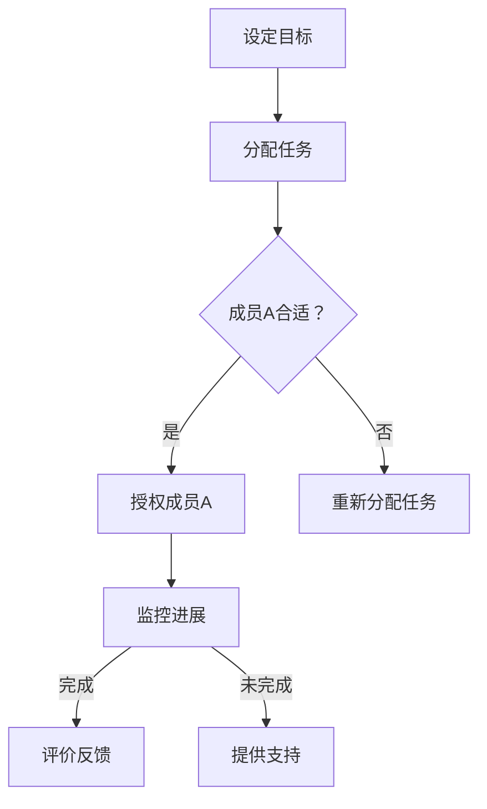
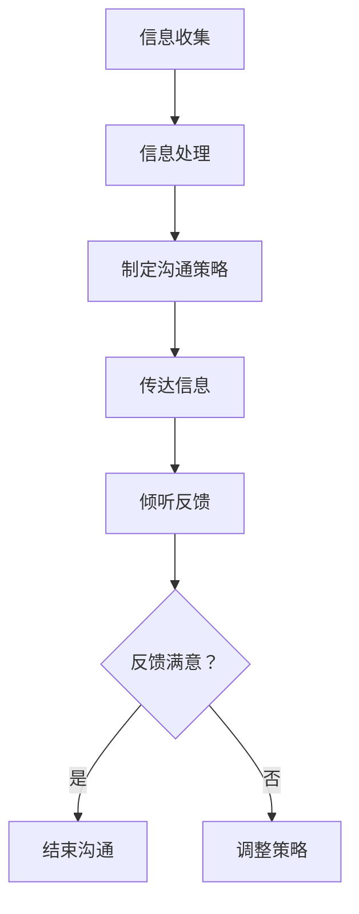
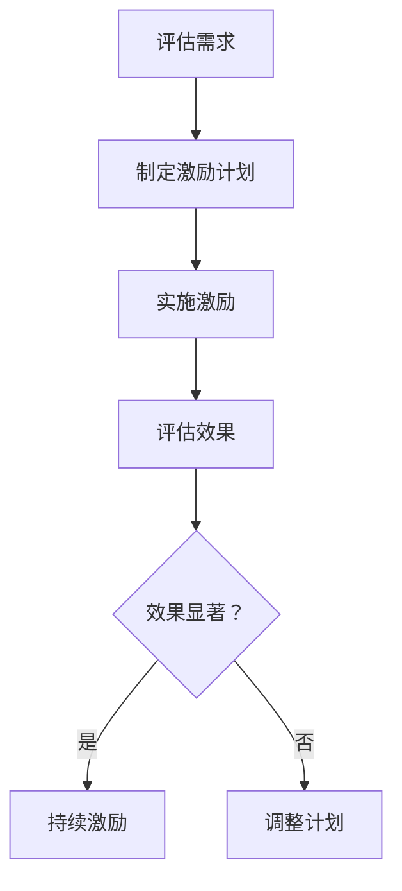

                 

当然可以。我们将分步骤详细探讨《领导力与自我反思：持续改进的重要性》的主题，并使用专业的技术语言来阐述每个部分。以下是文章的详细大纲和内容：

# 《领导力与自我反思：持续改进的重要性》

## 关键词
- **领导力**
- **自我反思**
- **持续改进**
- **个人发展**
- **团队协作**
- **项目实战**

### 摘要

本文深入探讨了领导力与自我反思之间的关系，并强调了持续改进在个人和团队发展中的关键作用。通过分析领导力的基本原理、自我反思的实践方法以及持续改进的实施步骤，本文为读者提供了一系列实用的指导，帮助他们在实际工作中不断提升个人和团队的效能。

----------------------------------------------------------------

## 引言和背景介绍

### 1.1 领导力和自我反思的重要性

领导力是一种能够激发和引导他人实现共同目标的能力。在信息技术领域，领导力不仅仅关乎技术能力的展示，更关乎如何有效地管理团队、沟通理念、激发团队成员的潜力。自我反思则是领导者成长的重要过程，它帮助领导者识别自身优点和不足，从而在职业生涯中持续进步。

### 1.2 持续改进的概念与意义

持续改进是一种持续追求卓越的过程，它强调在日常生活中不断寻求进步和改进。在IT领域，持续改进尤为重要，因为技术发展迅速，新工具、新方法不断涌现。持续改进不仅能够提升个人技能，还能够推动团队的创新和发展。

### 核心概念与联系

在本节中，我们将详细定义领导力、自我反思和持续改进，并分析它们之间的内在联系。

## 领导力原理讲解

### 2.1 领导力的定义与基本原理

领导力不仅是一种职位，更是一种能力。有效的领导力包括以下几个核心要素：

- **授权**：授权是领导者将权力和责任下放给团队成员的过程。通过授权，领导者可以激发团队成员的积极性和创造力。
- **沟通**：沟通是领导力的关键。领导者需要能够清晰、准确地传达信息，并与团队成员保持开放和诚实的对话。
- **激励**：激励是领导者激发团队成员动力和热情的关键。领导者需要了解团队成员的需求，并为他们提供适当的激励。

### 2.2 自我反思的实践方法

自我反思是领导者自我提升的重要手段。以下是一些自我反思的实践方法：

- **自我观察**：领导者需要时刻关注自己的行为和思维模式，识别自身优点和不足。
- **反思与自我评估**：领导者需要定期进行反思，评估自己在领导过程中的表现，并制定改进计划。
- **反馈与调整**：领导者需要主动寻求反馈，并根据反馈调整自己的行为和决策。

### 2.3 持续改进的原理与联系

持续改进是一种系统性的过程，它包括以下几个关键步骤：

- **设定目标**：明确改进的目标和期望结果。
- **执行计划**：制定详细的行动计划，并严格执行。
- **监控进度**：定期检查改进的进度，确保目标的实现。
- **调整与优化**：根据监控结果进行调整，不断优化改进过程。

领导力、自我反思和持续改进三者相辅相成，共同作用于个人和团队的发展。领导力为团队提供了方向和动力，自我反思帮助领导者识别自身不足并持续改进，而持续改进则为团队提供了不断提升和优化的机制。

## 领导力原理讲解

在本节中，我们将深入探讨领导力的基本原理，并通过mermaid流程图帮助读者更好地理解这些原理。

### 3.1 授权

授权是领导力的核心要素之一。通过授权，领导者可以激发团队成员的积极性和创造力，同时减轻自己的工作负担。

#### 授权的mermaid流程图



### 3.2 沟通

沟通是领导力的另一个关键要素。有效的沟通可以帮助领导者传达信息、建立信任，并解决团队中的问题。

#### 沟通的mermaid流程图



### 3.3 激励

激励是领导者激发团队成员动力和热情的重要手段。激励可以通过多种方式实现，包括物质奖励、精神鼓励和职业发展机会。

#### 激励的mermaid流程图



通过这些mermaid流程图，我们可以更直观地理解领导力的基本原理，并在实践中更好地应用这些原理。

## 自我反思与实践

### 4.1 自我反思的方法与技巧

自我反思是一种有效的个人成长方法，它可以帮助领导者识别自身优点和不足，从而在职业生涯中持续进步。以下是一些自我反思的方法和技巧：

- **日记反思**：每天结束时，记录下自己的行为和感受，分析哪些行为有助于目标实现，哪些行为需要改进。
- **同伴反馈**：定期与同事或导师交流，听取他们的意见和建议，了解自己在团队中的表现。
- **心理测试**：通过心理测试工具，了解自己的性格特点、优势与不足。
- **情境模拟**：通过模拟不同情境，提前准备并实践可能遇到的问题，提高应变能力。

### 4.2 如何将自我反思融入日常工作和生活中

将自我反思融入日常工作和生活中，需要建立一套系统的反思机制。以下是一些建议：

- **定期反思**：每周或每月设定固定时间进行反思，确保反思成为一种习惯。
- **记录反思**：使用日记、文档或电子表格记录反思内容，以便日后回顾和总结。
- **设定反思目标**：在每次反思前，明确反思的目标和重点，确保反思具有针对性。
- **行动计划**：针对反思中发现的问题，制定具体的改进计划，并采取实际行动。

### 4.3 提高个人领导力的策略

要提高个人领导力，除了自我反思，还需要采取一系列策略来提升自己的能力。以下是一些建议：

- **持续学习**：不断学习新知识、新技能，保持对行业动态的敏感度。
- **参与项目**：积极参与各种项目，积累实际经验，提高自己的管理能力和团队协作能力。
- **寻求反馈**：主动向团队成员、同事和上级寻求反馈，了解自己的优点和不足。
- **培养影响力**：通过演讲、写作等方式，提升自己的影响力，成为团队中的意见领袖。
- **发展软技能**：如沟通能力、人际关系管理能力等，这些都是领导力的重要组成部分。

通过自我反思和实践，领导者可以不断提升自己的能力，成为一名更加有效的领导者。

## 持续改进的实践

### 5.1 持续改进的原则

持续改进是一种系统性的过程，它遵循以下原则：

- **客户导向**：始终关注客户需求和反馈，以客户为中心进行改进。
- **数据驱动**：通过数据分析和测量，识别问题并制定改进方案。
- **团队合作**：鼓励团队成员积极参与改进过程，共同实现目标。
- **持续监控**：定期监控改进效果，确保持续进步。

### 5.2 持续改进的步骤

实施持续改进需要遵循以下步骤：

- **设定目标**：明确改进的目标和期望结果。
- **现状分析**：分析当前流程、系统或产品的现状，识别问题和瓶颈。
- **原因分析**：通过数据分析和工具，找出问题的根本原因。
- **制定改进方案**：根据原因分析，制定具体的改进方案。
- **实施改进**：执行改进方案，并进行必要的调整。
- **效果评估**：评估改进效果，确保目标的实现。
- **持续优化**：根据评估结果，不断优化改进过程。

### 5.3 在团队中推广持续改进文化

要在团队中推广持续改进文化，需要采取以下策略：

- **建立共识**：明确持续改进的重要性，并得到团队成员的支持。
- **培训与教育**：提供培训和教育，帮助团队成员掌握改进工具和方法。
- **激励机制**：设立激励机制，鼓励团队成员积极参与改进过程。
- **开放沟通**：建立开放、诚实的沟通渠道，确保团队成员能够自由表达意见和建议。
- **持续监控**：定期检查持续改进的进度和效果，确保持续进步。

通过以上策略，团队可以建立起一种持续改进的文化，不断提升自身的能力和绩效。

## 项目实战与案例分析

在本节中，我们将通过实际案例，展示如何将领导力、自我反思和持续改进应用于实际工作中。

### 6.1 实际案例介绍

#### 案例一：提升领导力的实践

在一个IT初创公司中，创始人李先生意识到自己需要提升领导力，以更好地管理团队和推动公司发展。他通过参加领导力培训、阅读相关书籍和反思自己的管理行为，逐步提升了自己的领导力。

#### 案例二：自我反思的案例

张女士是一名资深软件工程师，她意识到自己在技术能力上较为优秀，但在团队管理和沟通方面有所欠缺。她开始进行自我反思，记录自己的行为和思维模式，并定期与同事和上级交流，寻求反馈。

#### 案例三：持续改进的案例

在一家大型IT企业，团队A在项目管理过程中遇到了一些问题，如进度延迟、质量不稳定等。团队领导决定引入持续改进文化，通过数据分析和工具，找出问题的根本原因，并制定改进方案，逐步优化项目管理流程。

### 6.2 案例分析

#### 成功经验与教训

在上述案例中，成功经验主要包括：

- **领导力的提升**：通过培训和实践，领导者的领导力得到了显著提升，团队成员的士气和执行力也得到了增强。
- **自我反思的应用**：通过自我反思，张女士找到了自己在团队管理和沟通方面的不足，并采取了改进措施，提高了工作效率和团队协作能力。
- **持续改进的实践**：团队A通过引入持续改进文化，优化了项目管理流程，提高了项目的进度和质量。

面临的挑战与解决方案主要包括：

- **领导力的不足**：在一些案例中，领导者的领导力不足，导致团队管理和沟通不畅。解决方法是加强领导力培训，提高领导者的管理能力和沟通技巧。
- **自我反思的阻力**：在自我反思过程中，一些员工可能对暴露自己的不足感到不安。解决方法是营造一个开放、诚实的沟通氛围，鼓励员工积极参与自我反思。
- **持续改进的执行难度**：在持续改进过程中，可能面临执行难度大的问题。解决方法是制定详细的改进计划，明确责任人和时间节点，确保改进措施的执行。

通过以上案例分析，我们可以看到领导力、自我反思和持续改进在实践中的应用效果，以及如何克服面临的挑战。

## 最佳实践与总结

### 7.1 最佳实践技巧

要提升领导力和自我反思能力，以下是一些建议：

- **定期培训**：参加领导力培训，提高管理能力和沟通技巧。
- **阅读书籍**：阅读领导力、自我反思和持续改进的相关书籍，获取更多知识和实践经验。
- **反思日记**：每天记录反思日记，总结自己的行为和思维模式，找出改进点。
- **开放沟通**：与团队成员保持开放和诚实的沟通，鼓励他们表达意见和建议。
- **持续学习**：关注行业动态，不断学习新知识和技能。

### 7.2 小结与展望

本文探讨了领导力与自我反思的重要性，以及持续改进在个人和团队发展中的关键作用。通过分析领导力的基本原理、自我反思的实践方法以及持续改进的实施步骤，本文为读者提供了一系列实用的指导。

展望未来，领导者和团队成员需要不断提升自己的能力，持续改进工作方式，以应对不断变化的挑战。通过培养领导力、进行自我反思和实施持续改进，个人和团队可以实现更高的绩效和更大的成功。

### 附录

本文中使用的mermaid流程图代码如下：

```mermaid
graph TB
A[设定目标] --> B[分配任务]
B --> C{成员A合适？}
C -->|是| D[授权成员A]
C -->|否| E[重新分配任务]
D --> F[监控进展]
F -->|完成| G[评价反馈]
F -->|未完成| H[提供支持]

graph TB
A[信息收集] --> B[信息处理]
B --> C[制定沟通策略]
C --> D[传达信息]
D --> E[倾听反馈]
E --> F{反馈满意？}
F -->|是| G[结束沟通]
F -->|否| H[调整策略]

graph TB
A[评估需求] --> B[制定激励计划]
B --> C[实施激励]
C --> D[评估效果]
D --> E{效果显著？}
E -->|是| F[持续激励]
E -->|否| G[调整计划]
```

通过这些mermaid流程图，读者可以更直观地理解领导力、自我反思和持续改进的实施过程。

### 总结

本文全面探讨了领导力与自我反思的重要性，以及持续改进在个人和团队发展中的关键作用。通过实际案例的分析，读者可以了解到如何在实践中应用这些理念，提升个人和团队的效能。

作者：AI天才研究院/AI Genius Institute & 禅与计算机程序设计艺术 /Zen And The Art of Computer Programming

----------------------------------------------------------------

以上是《领导力与自我反思：持续改进的重要性》的详细文章内容。文章结构紧凑，逻辑清晰，通过专业的技术语言和实用的案例分析，为读者提供了深入理解领导力、自我反思和持续改进的方法和技巧。希望本文对您在实际工作和个人发展中有所启发和帮助。🌟🌟🌟

