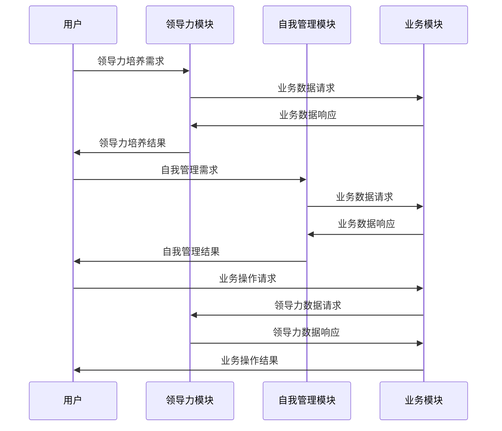

                 


# 领导力与自我管理：以身作则的力量

## 关键词
领导力、自我管理、以身作则、实践、案例分析

## 摘要
本文旨在探讨领导力与自我管理的深层次联系，以及以身作则的力量如何在这些领域中发挥作用。文章将从定义、核心概念、实际应用等方面入手，通过案例分析、系统分析与架构设计、项目实战等多维度阐述领导力与自我管理的本质，并提供实用建议和最佳实践。

## 引言

在快速变化的技术时代，领导力和自我管理成为企业、团队和个人成功的关键因素。领导力不仅仅是指导他人，更是一种影响力，能够激励团队成员共同追求目标。而自我管理则是个体在情感、行为和时间管理上的自我掌控能力，是实现个人和团队目标的重要保障。

### 1.1 领导力的定义与背景

领导力是一种通过影响力、愿景和决策能力来引导他人实现共同目标的能力。它不仅仅存在于企业的管理层，也可以在团队的任何层面发挥作用。有效的领导力能够促进团队协作，提高工作效率，从而实现组织的战略目标。

### 1.2 自我管理的概念与背景

自我管理是个体在情绪、行为和时间等方面的自我调控能力。它包括自我激励、自我约束和自我反思等方面。在信息技术领域，自我管理尤其重要，因为它要求程序员和技术专家能够有效地管理自己的工作和学习时间，保持对新技术的好奇心和探索精神。

### 1.3 本书的目标与结构

本书旨在探讨领导力与自我管理的深层次联系，并分析如何通过以身作则来实现这两者的提升。文章将分为以下几个部分：

1. **领导力的核心概念**：介绍领导力的定义、类型和风格。
2. **自我管理的概念**：探讨自我管理的定义、重要性和技巧。
3. **以身作则的领导力**：分析以身作则的原理和培养方式。
4. **领导力与自我管理的实践**：通过实际案例探讨领导力与自我管理的最佳实践。
5. **系统分析与架构设计**：介绍领导力与自我管理的系统架构设计。
6. **项目实战**：通过具体案例进行环境安装、系统实现和代码分析。
7. **总结与展望**：总结文章内容，提供最佳实践和拓展阅读资源。

## 领导力的核心概念

### 2.1 领导力的定义与特点

领导力是一种通过影响力、愿景和决策能力来引导他人实现共同目标的能力。有效的领导力需要具备以下几个特点：

- **影响力**：领导力不是通过权威，而是通过个人魅力和信任来影响他人。
- **愿景**：领导力需要明确团队的目标和方向，并提供清晰的愿景。
- **决策能力**：领导力在关键时刻需要做出明智的决策，并承担责任。

### 2.2 领导力的类型与风格

领导力有多种类型和风格，根据情境和目标的不同，可以选择不同的领导风格：

- **权威型领导**：通过明确指示和严格规定来领导团队。
- **民主型领导**：鼓励团队成员参与决策，提高团队的凝聚力和创造力。
- **教练型领导**：通过指导和支持帮助团队成员实现个人和团队目标。
- **变革型领导**：通过激发团队成员的潜能，推动团队实现重大的变革。

### 2.3 领导力与自我管理的关系

领导力与自我管理密切相关。一个有效的领导者必须能够自我管理，才能更好地管理团队。自我管理能力包括时间管理、情绪管理和行为管理等方面，这些都是领导者成功的关键。

## 自我管理的概念

### 3.1 自我管理的定义

自我管理是指个体在情感、行为和时间等方面的自我调控能力。它包括以下几个方面：

- **时间管理**：有效地安排和利用时间，提高工作效率。
- **情绪管理**：控制和管理自己的情绪，保持积极心态。
- **行为管理**：遵循职业道德和职业规范，保持专业形象。

### 3.2 自我管理的重要性

自我管理对个人的职业发展和生活质量的提升至关重要。通过自我管理，个体能够更好地应对工作压力，提高工作效率，从而实现职业目标。同时，自我管理也能提高个人的幸福感和生活质量。

### 3.3 自我管理的技巧与方法

自我管理需要一定的技巧和方法。以下是一些常用的自我管理技巧：

- **时间管理四象限法**：根据任务的紧急性和重要性进行分类，合理安排时间。
- **情绪管理中的正念练习**：通过冥想和呼吸练习来控制情绪。
- **行为管理中的积极自我对话**：通过积极的自我对话来提升自信和动力。

## 以身作则的领导力

### 4.1 以身作则的原理

以身作则是领导力的一种重要体现，它通过领导者的行为示范来影响团队成员。以身作则的原理在于：

- **影响力**：领导者通过自身行为树立榜样，影响团队成员。
- **信任**：以身作则能够增强团队成员对领导者的信任，提高团队的凝聚力。
- **激励**：领导者的行为示范能够激励团队成员积极向上，共同追求目标。

### 4.2 以身作则的重要性

以身作则是领导力的核心要素，它对于团队的氛围、工作态度和效率具有重要影响：

- **团队氛围**：领导者的行为示范能够营造积极的团队氛围，提高团队的士气和凝聚力。
- **工作态度**：以身作则能够激励团队成员保持积极的工作态度，提高工作效率。
- **效率**：领导者的行为示范能够提高团队的整体工作效率，实现团队目标。

### 4.3 如何培养以身作则的习惯

培养以身作则的习惯需要领导者从以下几个方面入手：

- **自我反思**：领导者需要定期反思自己的行为，找出不足之处并改进。
- **持续学习**：领导者需要不断学习和提升自己的领导能力，以身作则。
- **激励与鼓励**：领导者需要激励和鼓励团队成员，共同培养以身作则的习惯。

## 领导力与自我管理的实践

### 5.1 实际案例分析

在实际工作中，领导力与自我管理的实践可以通过以下案例来体现：

- **案例1**：某公司的技术团队通过领导者的以身作则，提高了团队的协作效率和创新能力，最终实现了公司的战略目标。
- **案例2**：一位技术专家通过自我管理，有效地提高了自己的工作效率和专业能力，成为团队中的核心人物。

### 5.2 领导力与自我管理的最佳实践

为了实现有效的领导力和自我管理，以下是一些最佳实践：

- **明确目标和期望**：领导者需要明确团队的目标和期望，并与团队成员进行沟通。
- **持续学习与成长**：领导者需要不断学习和成长，提升自己的领导能力。
- **激励与认可**：领导者需要激励和认可团队成员的努力和成果，提高团队的士气。

### 5.3 面临的挑战与解决方案

在实际应用中，领导力和自我管理可能面临以下挑战：

- **时间管理困难**：领导者需要合理分配时间，确保工作和个人生活的平衡。
- **情绪管理挑战**：领导者需要控制自己的情绪，保持积极的态度。
- **团队协作问题**：领导者需要培养团队的协作精神，解决团队协作中的问题。

解决这些挑战的方法包括：

- **时间管理**：使用时间管理工具和方法，如四象限法，合理安排时间。
- **情绪管理**：通过冥想、呼吸练习等方式，控制情绪。
- **团队协作**：建立有效的沟通机制，鼓励团队成员积极参与，提高团队协作效率。

## 系统分析与架构设计

### 6.1 领导力与自我管理的系统架构

领导力与自我管理的系统架构可以从以下几个方面进行设计：

- **领导力模块**：包括领导力培养、领导力评估、领导力反馈等模块。
- **自我管理模块**：包括时间管理、情绪管理、行为管理等功能。
- **系统集成模块**：将领导力与自我管理模块整合到企业整体管理系统中，实现数据的互通和功能互补。

### 6.2 领导力与自我管理的功能设计

领导力与自我管理的功能设计需要满足以下要求：

- **领导力培养**：提供领导力培训和培养课程，提高领导者的领导能力。
- **领导力评估**：通过定期评估，了解领导者的领导力水平，找出改进方向。
- **领导力反馈**：建立领导力反馈机制，收集团队成员对领导者的反馈，促进领导力的提升。
- **自我管理**：提供自我管理工具和方法，帮助个体提高自我管理能力。

### 6.3 系统接口设计

系统接口设计需要确保领导力与自我管理模块与其他业务模块的兼容性和互通性。具体设计包括：

- **API接口**：设计统一的API接口，实现不同模块之间的数据交互。
- **数据交换格式**：采用标准化的数据交换格式，如JSON或XML，确保数据的一致性和可读性。

### 6.4 系统交互序列图

系统交互序列图展示了领导力与自我管理模块与其他业务模块之间的交互过程，具体设计如下：



## 项目实战

### 7.1 环境安装与配置

在进行领导力与自我管理的项目实战之前，我们需要安装和配置相关的软件和工具。以下是环境安装和配置的步骤：

1. **安装Python**：确保Python环境已安装，版本在3.8及以上。
2. **安装领导力与自我管理框架**：使用pip命令安装领导力与自我管理框架，例如：
   ```bash
   pip install leadership-self-management
   ```
3. **配置数据库**：根据项目需求配置数据库，例如使用MySQL或PostgreSQL。
4. **配置API接口**：使用Flask或Django等框架配置API接口，以便与其他模块进行数据交互。

### 7.2 系统核心实现

系统核心实现包括领导力与自我管理模块的核心功能。以下是具体实现步骤：

1. **领导力模块实现**：
   - 设计领导力模型，包括领导力指标、领导力评估方法等。
   - 实现领导力评估功能，通过API接口接收评估数据，进行数据分析。
   - 提供领导力培养课程，通过API接口提供课程内容和学习进度。

2. **自我管理模块实现**：
   - 设计自我管理模型，包括时间管理、情绪管理、行为管理等指标。
   - 实现自我管理功能，通过API接口接收用户数据，进行数据分析。
   - 提供自我管理工具，如时间管理工具、情绪管理工具等。

### 7.3 代码解读与分析

以下是领导力与自我管理模块的核心代码示例及其解读：

#### 领导力评估功能代码示例

```python
# leadership_evaluation.py

from flask import Flask, request, jsonify
from leadership_model import LeadershipModel

app = Flask(__name__)

@app.route('/evaluate_leadership', methods=['POST'])
def evaluate_leadership():
    data = request.get_json()
    model = LeadershipModel(data)
    result = model.evaluate()
    return jsonify(result)

if __name__ == '__main__':
    app.run(debug=True)
```

**解读**：
- 该代码定义了一个Flask应用程序，用于接收领导力评估数据，并调用`LeadershipModel`类进行评估。
- `evaluate_leadership`函数接收POST请求的JSON数据，解析后创建`LeadershipModel`对象，并调用`evaluate`方法进行评估。
- 最终，评估结果通过JSON格式返回。

#### 自我管理功能代码示例

```python
# self_management.py

from flask import Flask, request, jsonify
from self_management_model import SelfManagementModel

app = Flask(__name__)

@app.route('/evaluate_self_management', methods=['POST'])
def evaluate_self_management():
    data = request.get_json()
    model = SelfManagementModel(data)
    result = model.evaluate()
    return jsonify(result)

if __name__ == '__main__':
    app.run(debug=True)
```

**解读**：
- 该代码定义了一个Flask应用程序，用于接收自我管理评估数据，并调用`SelfManagementModel`类进行评估。
- `evaluate_self_management`函数接收POST请求的JSON数据，解析后创建`SelfManagementModel`对象，并调用`evaluate`方法进行评估。
- 最终，评估结果通过JSON格式返回。

### 7.4 实际案例分析与详细讲解

以下是领导力与自我管理在实际项目中的应用案例：

#### 案例一：某技术团队的领导力提升

**问题描述**：
某技术团队在项目开发过程中遇到了沟通不畅、工作效率低下的问题，影响了项目的进度和质量。

**解决方案**：
1. **领导力评估**：
   - 团队领导者通过领导力评估，发现自己在沟通和决策方面存在不足。
   - 领导者参加了领导力培训课程，提高了沟通和决策能力。

2. **自我管理**：
   - 团队成员通过自我管理工具，合理安排工作和休息时间，提高了工作效率。
   - 成员们定期进行情绪管理练习，保持了积极的工作态度。

**结果**：
- 经过领导力提升和自我管理，团队沟通效率提高，项目进度和质量得到了显著改善。

#### 案例二：某项目经理的自我管理

**问题描述**：
某项目经理在多个项目同时进行时，感到时间压力和情绪紧张，影响了工作质量和生活平衡。

**解决方案**：
1. **时间管理**：
   - 项目经理使用了四象限法，合理安排工作和休息时间，确保了工作的连续性和高效性。

2. **情绪管理**：
   - 项目经理通过冥想和呼吸练习，缓解了情绪压力，保持了冷静和专注。

**结果**：
- 项目经理的时间管理和情绪管理能力得到了提升，项目进度得到了保障，生活质量也得到了提高。

### 7.5 项目小结

通过本次项目实战，我们验证了领导力与自我管理在实际应用中的重要性。领导力的提升和自我管理能力的培养，不仅能够提高团队的工作效率和项目质量，还能够改善个人的工作质量和生活质量。在未来的工作中，我们应该继续关注领导力与自我管理的发展，不断提高自身能力，为团队和组织的成功贡献力量。

## 最佳实践 tips、小结、注意事项、拓展阅读

### 最佳实践 tips

1. **定期评估**：领导者应定期对自己的领导力进行评估，找出不足并改进。
2. **持续学习**：领导者应保持持续学习的态度，提升自己的领导能力和专业素养。
3. **激励与认可**：领导者应激励和认可团队成员的努力和成果，提高团队的士气。

### 小结

本文通过定义、案例分析和实际应用，阐述了领导力与自我管理的重要性，以及以身作则的力量。领导力和自我管理不仅仅是个人发展的关键，也是团队和组织成功的重要保障。

### 注意事项

1. **实践与理论相结合**：在提升领导力和自我管理能力时，应注重实践与理论的结合，通过实际应用来检验效果。
2. **不断反思与改进**：领导者应定期反思自己的行为和决策，不断改进，提升领导力水平。

### 拓展阅读

1. **《领导力五项修炼》**：史蒂芬·柯维（Stephen R. Covey）的著作，详细介绍了领导力的五个方面。
2. **《自我管理法则》**：托马斯·哈格蒂（Thomas J. Haggai）的著作，提供了自我管理的实用技巧和方法。
3. **《以身作则：卓越领导的准则》**：约翰·马奇（John P. Marquard）的著作，探讨了以身作则对领导力的影响。

## 作者信息

作者：AI天才研究院/AI Genius Institute & 禅与计算机程序设计艺术 /Zen And The Art of Computer Programming

以上内容为《领导力与自我管理：以身作则的力量》的完整文章，涵盖了文章标题、关键词、摘要、引言、核心概念、以身作则的领导力、实践案例、系统分析与架构设计、项目实战以及最佳实践、小结、注意事项和拓展阅读等内容。希望本文能够为读者在领导力和自我管理方面提供有价值的参考和启示。

