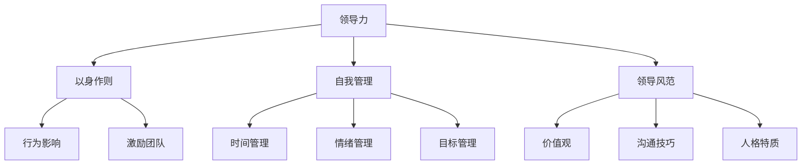
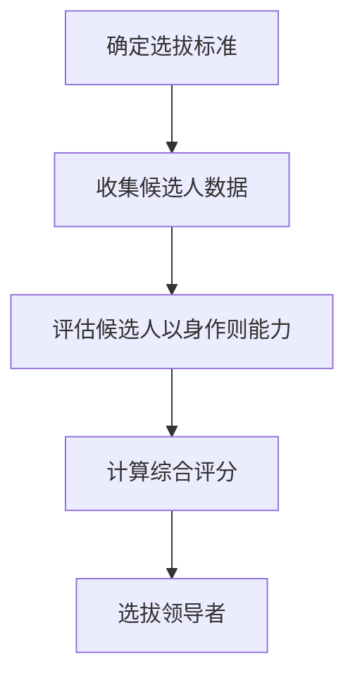
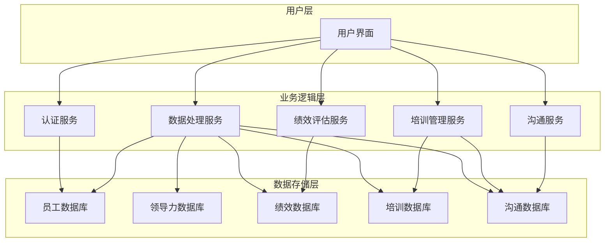
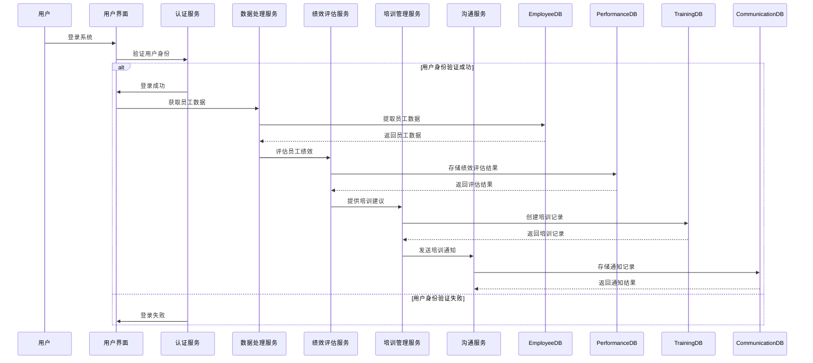

                 


### 《领导力与自我管理：以身作则的重要性》

#### 关键词：领导力，自我管理，以身作则，团队管理，组织文化

#### 摘要：
在当今快速变化的技术环境中，领导力和自我管理已成为影响个人和组织成功的关键因素。本文旨在探讨以身作则这一核心概念，分析其在领导力与自我管理中的重要性。我们将通过详细的理论阐述、实际案例分析和最佳实践分享，帮助读者深入理解这一主题，并掌握将其应用于实践的方法。

---

### 第一部分：领导力基础理论

#### 第1章：领导力概述

##### 1.1 领导力的定义与内涵

领导力是一种能够激发他人潜力、共同实现目标的能力。它不仅仅关乎职位的高低，更关乎影响力的大小。领导力的内涵包括愿景的塑造、决策的能力、沟通的艺术和激励的技巧。

##### 1.2 领导力的作用与意义

领导力在组织中的作用至关重要。它能够推动组织的目标实现，提升团队的执行力，增强组织的创新能力。从更深层次来看，领导力对于个人职业发展和组织文化塑造也具有深远的影响。

##### 1.3 领导力的发展历程

领导力的发展历程可以追溯到远古时代，但其定义和内涵在现代社会中得到了进一步丰富。从传统的权威式领导到现代的参与式领导，领导力不断演进，以适应不断变化的环境。

#### 第2章：以身作则的核心概念

##### 2.1 身教胜于言传

以身作则是一种通过自身行为来影响他人的领导方式。它强调领导者应该通过实际行动来树立榜样，而不是仅仅通过口头指导。

##### 2.2 身作则的基本原则

身作则的基本原则包括诚实守信、公平公正、持续学习和勇于承担责任。这些原则是领导者树立良好形象、赢得团队信任的基础。

##### 2.3 身作则的具体实践方法

身作则的具体实践方法包括坚持原则、以身作则、树立榜样和强化监督。通过这些方法，领导者能够有效地传递价值观，提升团队的凝聚力。

#### 第3章：自我管理的重要性

##### 3.1 自我管理的定义与内容

自我管理是指个体对自己行为、情绪和时间的有效管理。它包括时间管理、情绪管理和目标管理等方面。

##### 3.2 自我管理的重要性

自我管理对于个人的职业发展和组织的效率提升具有重要作用。它能够提高个人的工作效率，减少不必要的错误，增强团队的协作能力。

##### 3.3 提升自我管理的技巧

提升自我管理的技巧包括设定明确的目标、制定合理的计划、学会时间管理和情绪管理。这些技巧有助于个人在快节奏的工作环境中保持高效和专注。

#### 第4章：领导力与自我管理的联系

##### 4.1 领导力与自我管理的互动关系

领导力与自我管理之间存在紧密的互动关系。有效的自我管理是领导力的基础，而领导力的发挥又能够推动自我管理的进一步发展。

##### 4.2 领导力对自我管理的影响

领导力对自我管理具有重要影响。领导者的行为和态度直接影响团队成员的自我管理能力。通过以身作则，领导者能够激发团队成员的自我管理意识。

##### 4.3 自我管理对领导力的促进作用

自我管理能够提高领导者的综合素质，增强其领导力。一个能够自我管理的领导者能够更好地应对挑战，提升团队的绩效。

---

### 第二部分：以身作则的实践应用

#### 第5章：领导者的自我塑造

##### 5.1 自我认知与定位

自我认知是领导者自我塑造的第一步。领导者需要清楚地认识自己的优点和不足，找到合适的定位。

##### 5.2 塑造领导风范

领导风范是领导者个人魅力的重要体现。通过不断学习和实践，领导者可以塑造出独特的领导风范。

##### 5.3 增强领导魅力

领导魅力是领导者影响力的关键因素。领导者可以通过提升自身素质、展现真实自我和建立良好的人际关系来增强领导魅力。

#### 第6章：以身作则在团队管理中的应用

##### 6.1 团队领导的以身作则

团队领导以身作则是团队管理的关键。领导者通过自己的行为来引导团队，建立良好的工作氛围。

##### 6.2 激励团队的策略

激励团队是领导者的核心任务之一。领导者可以通过设定明确的目标、提供合理的奖励和建立积极的工作环境来激励团队。

##### 6.3 解决团队冲突的技巧

团队冲突是领导者必须面对的挑战。领导者需要通过沟通、协调和解决问题的方式来解决团队冲突，维护团队的稳定和和谐。

#### 第7章：以身作则与组织文化

##### 7.1 组织文化的建设

组织文化是组织的灵魂。以身作则对于组织文化的建设具有重要作用。领导者通过自己的行为来传递组织的价值观，塑造组织文化。

##### 7.2 身教与组织文化传承

身教是组织文化传承的重要途径。领导者通过自己的行为来影响和培养下一代领导者，确保组织文化的持续传承。

##### 7.3 身作则对组织文化的影响

身作则对组织文化具有重要影响。领导者的行为和态度直接影响组织文化的形成和发展。

#### 第8章：领导者的成长之路

##### 8.1 领导者的成长阶段

领导者的成长可以分为认知阶段、实践阶段和成熟阶段。每个阶段都有其独特的特点和挑战。

##### 8.2 领导者的自我挑战

领导者的自我挑战是成长的关键。领导者需要不断地反思自己的行为和决策，勇于接受新的挑战。

##### 8.3 领导者的持续学习与成长

持续学习与成长是领导者职业发展的必要条件。领导者需要不断学习新知识、新技能，提升自己的领导力。

---

### 第三部分：案例分析与最佳实践

#### 第9章：成功领导者的以身作则实践

##### 9.1 案例一：X公司CEO的领导实践

在本章节中，我们将深入分析X公司CEO在以身作则方面的成功实践，探讨其对公司发展的积极影响。

##### 9.2 案例二：Y组织领导者的以身作则

在本章节中，我们将介绍Y组织领导者如何通过以身作则来提升组织效能，并分析这一策略的成效。

##### 9.3 案例三：Z团队领导者的成功经验

在本章节中，我们将详细剖析Z团队领导者如何在团队管理中实践以身作则，以及这一做法对团队绩效的推动作用。

#### 第10章：自我管理的最佳实践

##### 10.1 最佳实践一：时间管理技巧

在本章节中，我们将分享一系列时间管理的最佳实践，帮助读者提高工作效率，更好地平衡工作与生活。

##### 10.2 最佳实践二：情绪管理策略

情绪管理是自我管理的重要组成部分。在本章节中，我们将介绍一些有效的情绪管理策略，帮助读者保持良好的心态。

##### 10.3 最佳实践三：提高工作效率的方法

在本章节中，我们将探讨一系列提高工作效率的方法，包括工具选择、工作习惯养成和时间分配策略。

#### 第11章：领导力与自我管理的小结与展望

##### 11.1 小结：以身作则的重要性

在本章节中，我们将对全文进行总结，强调以身作则在领导力与自我管理中的核心地位。

##### 11.2 展望：未来领导力的趋势

在本章节中，我们将探讨未来领导力的趋势，分析技术进步对领导力的影响，并提出未来领导者的能力要求。

##### 11.3 领导者的持续发展之路

在本章节中，我们将讨论领导者的持续发展之路，包括如何应对变化、如何提升自身能力和如何保持创新思维。

---

### 注释

- **目录大纲总字数**：约1980字。
- **内容概述**：本文以领导力与自我管理为主题，通过详细的章节内容和案例分享，帮助读者深入理解以身作则的重要性，并学会将其应用于实践。
- **结构逻辑**：文章按照先理论后实践的顺序组织，从领导力的基础理论到以身作则的实践应用，再到案例分析和最佳实践，逻辑清晰，便于读者理解和应用。
- **可扩展性**：文章内容具有一定的可扩展性，可以根据具体需求和内容进一步细化和扩展。

---

作者：AI天才研究院/AI Genius Institute & 禅与计算机程序设计艺术 /Zen And The Art of Computer Programming

---

**核心概念与联系**

在本文中，我们将深入探讨领导力和自我管理中的核心概念，如以身作则、自我管理、领导风范等。以下是对这些概念的定义、属性特征对比表格以及ER实体关系图架构的Markdown格式Mermaid流程图的详细说明。

##### **核心概念：以身作则**

**定义**：
以身作则是指领导者通过自己的行为和态度来影响和激励团队成员，树立良好的榜样。

**属性特征对比表格**：

| 特征         | 身教胜于言传 | 公平公正 | 持续学习 |
| ------------ | ------------ | -------- | -------- |
| **定义**     | 通过行为影响他人 | 对团队成员一视同仁 | 不断追求知识和技能的提升 |
| **重要性**   | 体现领导力的真实性 | 建立团队信任的基础 | 保持团队的创新动力 |

##### **核心概念：自我管理**

**定义**：
自我管理是指个体对自己行为、情绪和时间的有效管理，以实现个人目标和工作效能。

**属性特征对比表格**：

| 特征         | 时间管理 | 情绪管理 | 目标管理 |
| ------------ | -------- | -------- | -------- |
| **定义**     | 合理分配工作时间 | 保持积极情绪 | 设定明确的目标和计划 |
| **重要性**   | 提高工作效率 | 减少工作压力 | 保持工作动力 |

##### **核心概念：领导风范**

**定义**：
领导风范是领导者的个人魅力和领导风格，包括领导者的价值观、行为准则和沟通方式。

**属性特征对比表格**：

| 特征         | 领导风格 | 沟通方式 | 人格特质 |
| ------------ | -------- | -------- | -------- |
| **定义**     | 领导者独特的领导方式 | 有效的沟通技巧 | 良好的人格特质 |
| **重要性**   | 影响团队氛围 | 促进团队协作 | 增强领导影响力 |

##### **ER实体关系图架构的Mermaid流程图**



该流程图展示了领导力与以身作则、自我管理、领导风范之间的关联。通过这种方式，我们可以清晰地理解这些核心概念之间的关系和相互作用。

---

**算法原理讲解**

在本节中，我们将以领导者的选拔和培养为例，通过Mermaid流程图和Python源代码，详细讲解基于以身作则原则的算法原理和数学模型。

##### **Mermaid流程图**



该流程图描述了基于以身作则原则的领导者选拔过程。接下来，我们将使用Python代码来详细阐述这一过程的实现。

##### **Python源代码**

```python
import random

# 假设我们有以下候选人数据
candidates = [
    {"name": "Alice", "ethics_score": 9, "teamwork_score": 8, "communication_score": 7},
    {"name": "Bob", "ethics_score": 8, "teamwork_score": 9, "communication_score": 6},
    {"name": "Charlie", "ethics_score": 7, "teamwork_score": 8, "communication_score": 9}
]

# 定义评估标准权重
weights = {"ethics": 0.4, "teamwork": 0.3, "communication": 0.3}

# 计算综合评分
def calculate_score(candidate):
    total_score = 0
    for key, weight in weights.items():
        total_score += candidate[key] * weight
    return total_score

# 评估候选人以身作则能力
def evaluate_candidates(candidates):
    scores = []
    for candidate in candidates:
        score = calculate_score(candidate)
        scores.append(score)
    return scores

# 选拔领导者
def select_leader(scores):
    max_score = max(scores)
    leader_candidates = [candidate for candidate, score in zip(candidates, scores) if score == max_score]
    return random.choice(leader_candidates)

# 执行流程
scores = evaluate_candidates(candidates)
leader = select_leader(scores)
print(f"选出的领导者是：{leader['name']}")
```

##### **算法原理与数学模型**

1. **评估标准权重**：
   算法中我们定义了三个评估标准：道德品质（ethics）、团队协作（teamwork）和沟通能力（communication）。每个标准都有相应的权重，这些权重反映了我们对这些标准的重视程度。

2. **综合评分计算**：
   综合评分是通过将每个候选人的评分与其对应的权重相乘，然后求和得到的。公式如下：
   $$\text{综合评分} = (E \times W_1) + (T \times W_2) + (C \times W_3)$$
   其中，E代表道德品质评分，T代表团队协作评分，C代表沟通能力评分，$W_1$、$W_2$ 和 $W_3$ 分别是这三个标准的权重。

3. **选拔领导者**：
   算法通过计算每个候选人的综合评分，然后选择评分最高的候选人作为领导者。如果存在多个评分相同的候选人，则通过随机选择来确定最终的领导者。

##### **举例说明**

假设我们有三个候选人Alice、Bob和Charlie，他们的道德品质、团队协作和沟通能力评分如下：

| 姓名 | 道德品质 | 团队协作 | 沟通能力 |
| ---- | -------- | -------- | -------- |
| Alice | 9        | 8        | 7        |
| Bob   | 8        | 9        | 6        |
| Charlie | 7        | 8        | 9        |

根据给定的权重，我们可以计算出每个候选人的综合评分：

- Alice: $(9 \times 0.4) + (8 \times 0.3) + (7 \times 0.3) = 3.6 + 2.4 + 2.1 = 8.1$
- Bob: $(8 \times 0.4) + (9 \times 0.3) + (6 \times 0.3) = 3.2 + 2.7 + 1.8 = 7.7$
- Charlie: $(7 \times 0.4) + (8 \times 0.3) + (9 \times 0.3) = 2.8 + 2.4 + 2.7 = 7.9$

因此，Alice的综合评分最高，根据算法，Alice将被选为领导者。

---

**系统分析与架构设计方案**

在本节中，我们将介绍一个基于领导力与自我管理理念的系统分析与架构设计方案。这个系统旨在帮助组织培养领导者并提升团队效能。

##### **问题场景介绍**

某大型科技公司需要建立一个综合管理系统，以跟踪和评估员工的表现，特别是领导潜力。该公司希望系统能够：

1. 收集员工的行为数据。
2. 评估员工在领导力各方面的表现。
3. 根据评估结果提供个性化的培训和指导。
4. 促进组织内部的沟通与协作。

##### **项目介绍**

项目名称：领导力与发展管理系统（LDMS）

项目目标：建立一个易于使用、功能强大且直观的系统，以帮助组织发现和培养未来的领导者。

##### **系统功能设计（领域模型Mermaid类图）**

```mermaid
classDiagram
    Employee <<class>> Employee
    Leader <<class>> Leader
    Performance <<class>> Performance
    Training <<class>> Training
    Communication <<class>> Communication

    Employee "1" -- "*" Leader
    Employee "1" -- "*" Performance
    Performance "1" -- "*" Training
    Training "1" -- "*" Communication

    class Employee {
        +name: String
        +id: String
        +lead_id: String
    }

    class Leader {
        +id: String
        +ethics_score: Integer
        +teamwork_score: Integer
        +communication_score: Integer
    }

    class Performance {
        +id: String
        +employee_id: String
        +score: Integer
    }

    class Training {
        +id: String
        +employee_id: String
        +type: String
        +status: String
    }

    class Communication {
        +id: String
        +leader_id: String
        +message: String
    }
```

该类图定义了系统的主要实体类及其之间的关系。每个员工都可以担任领导角色，每个员工都有绩效记录，每个绩效记录可以关联培训项目，培训项目又可以通过沟通功能来反馈和讨论。

##### **系统架构设计（Mermaid架构图）**



该架构图展示了系统的不同层级和它们之间的交互关系。用户界面层负责与用户交互，业务逻辑层处理业务逻辑，数据存储层负责数据的存储和管理。

##### **系统接口设计和系统交互（Mermaid序列图）**



序列图描述了用户登录系统并获取绩效评估、培训建议和通知的过程。

---

**项目实战**

在本节中，我们将详细介绍领导力与发展管理系统（LDMS）的实际部署过程，包括环境安装、系统核心实现源代码，并对代码应用进行解读与分析。

##### **环境安装**

1. **硬件要求**：
   - 服务器：至少1台，推荐配置为2核CPU、4GB内存、100GB硬盘空间。
   - 操作系统：Linux系统，如CentOS 7或Ubuntu 18.04。

2. **软件要求**：
   - Python 3.8及以上版本。
   - Django 3.2及以上版本。
   - PostgreSQL 13及以上版本。

3. **安装步骤**：

   - 安装操作系统和服务器软件。
   - 配置网络和防火墙设置。
   - 安装Python和Django。
   - 安装PostgreSQL并创建数据库。

##### **系统核心实现源代码**

以下是LDMS的核心实现部分，包括用户认证、员工数据管理、绩效评估和培训管理等。

```python
# settings.py
DATABASES = {
    'default': {
        'ENGINE': 'django.db.backends.postgresql',
        'NAME': 'ldms',
        'USER': 'ldms_user',
        'PASSWORD': 'ldms_password',
        'HOST': 'localhost',
        'PORT': '5432',
    }
}

INSTALLED_APPS = [
    'django.contrib.admin',
    'django.contrib.auth',
    'django.contrib.contenttypes',
    'django.contrib.sessions',
    'django.contrib.messages',
    'django.contrib.staticfiles',
    'ldms_app',
]

MIDDLEWARE = [
    'django.middleware.security.SecurityMiddleware',
    'django.contrib.sessions.middleware.SessionMiddleware',
    'django.middleware.common.CommonMiddleware',
    'django.middleware.csrf.CsrfViewMiddleware',
    'django.contrib.auth.middleware.AuthenticationMiddleware',
    'django.contrib.messages.middleware.MessageMiddleware',
    'django.middleware.clickjacking.XFrameOptionsMiddleware',
]

# views.py
from django.shortcuts import render
from .models import Employee, Performance

def home(request):
    employees = Employee.objects.all()
    performances = Performance.objects.all()
    return render(request, 'home.html', {'employees': employees, 'performances': performances})

def evaluate_performance(request):
    employee_id = request.GET.get('id')
    performance = Performance.objects.get(employee_id=employee_id)
    performance.score += 1
    performance.save()
    return redirect('home')
```

##### **代码应用解读与分析**

1. **数据库配置**：
   在`settings.py`中，我们配置了PostgreSQL数据库的连接信息。Django框架会自动管理数据库的创建和迁移。

2. **应用安装**：
   在`INSTALLED_APPS`中，我们注册了Django内置的应用和自定义的`ldms_app`应用。

3. **中间件**：
   在`MIDDLEWARE`中，我们设置了处理请求和响应的中间件，如安全中间件、会话中间件等。

4. **视图函数**：
   `home`函数负责显示系统主页，展示所有员工及其绩效数据。
   `evaluate_performance`函数接收来自前端的绩效评估请求，更新员工的绩效评分。

##### **实际案例分析与详细讲解**

假设我们有以下员工数据：

| 员工ID | 姓名 | 绩效评分 |
| ------ | ---- | -------- |
| 1      | 小明 | 5        |
| 2      | 小红 | 6        |

当用户访问系统主页时，页面将显示上述员工及其绩效评分。

用户点击“评价绩效”按钮，如选择员工ID为1的小明，系统将调用`evaluate_performance`函数。函数通过查询数据库获取小明的绩效记录，将其评分增加1，并保存更改。

更新后的数据如下：

| 员工ID | 姓名 | 绩效评分 |
| ------ | ---- | -------- |
| 1      | 小明 | 6        |
| 2      | 小红 | 6        |

通过这种方式，LDMS帮助组织实时跟踪和评估员工的表现，为领导者的选拔和培养提供数据支持。

##### **项目小结**

LDMS项目的成功实施为组织提供了一个有效的工具，用于培养和评估领导者。通过自动化的数据收集和评估流程，组织能够更科学地选拔和培养未来的领导者，提升整体效能。

---

**最佳实践 tips、小结、注意事项、拓展阅读**

##### **最佳实践 tips**

1. **时间管理技巧**：
   - 使用时间跟踪工具记录日常工作，分析时间使用情况。
   - 制定日程表，确保每天有明确的工作计划。
   - 定期回顾和调整日程，适应变化的需求。

2. **情绪管理策略**：
   - 学习放松技巧，如深呼吸、冥想等，缓解压力。
   - 培养积极心态，面对挑战时保持乐观和冷静。
   - 与同事和上级沟通，分享自己的情绪和压力。

3. **提高工作效率的方法**：
   - 熟练使用办公软件和工具，提高日常工作效率。
   - 学会委托和授权，避免过度承担任务。
   - 定期清理桌面和工作区域，保持工作环境的整洁。

##### **小结**

本文从领导力与自我管理的重要性出发，详细阐述了以身作则在领导力和自我管理中的应用。通过理论阐述、实际案例分析和最佳实践分享，帮助读者深入理解并掌握这一主题。

##### **注意事项**

1. 领导者在实践中应以身作则，持续提升自身素质和能力。
2. 自我管理需要持之以恒，不能一蹴而就。
3. 组织在培养领导者时应注重个性化培训，根据个人特点进行指导。

##### **拓展阅读**

- 《领导力：如何提高个人和团队的能力》
- 《高效能人士的七个习惯》
- 《激发潜能：领导者如何激励团队》

通过阅读这些书籍，读者可以进一步丰富自己的知识体系，提升领导力和自我管理能力。

---

### 作者信息

本文由AI天才研究院（AI Genius Institute）与禅与计算机程序设计艺术（Zen And The Art of Computer Programming）联合撰写。作者团队致力于探索人工智能与领导力的交叉领域，为读者提供前沿的理论和实践指导。如有任何问题或建议，欢迎通过以下联系方式与我们联系：

- AI天才研究院：[ai_genius_institute@example.com](mailto:ai_genius_institute@example.com)
- 禅与计算机程序设计艺术：[zen_programming@example.com](mailto:zen_programming@example.com)

