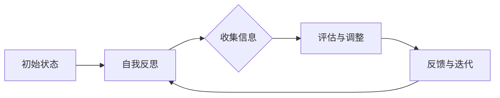
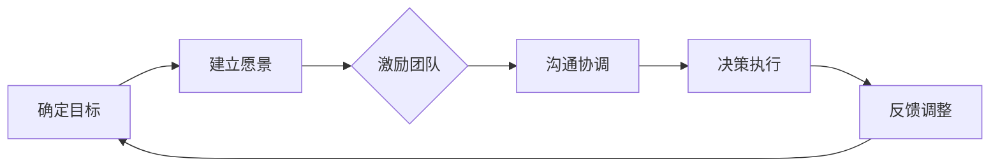
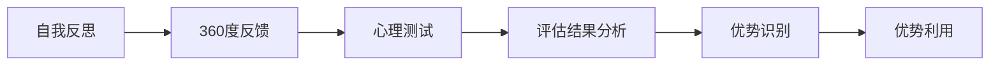
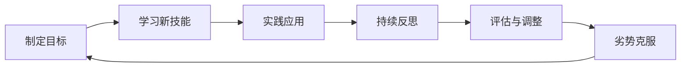
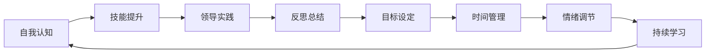
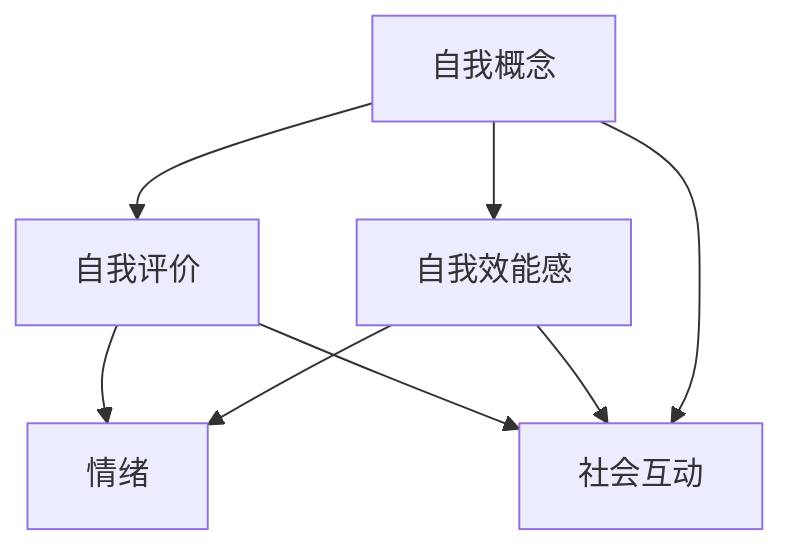
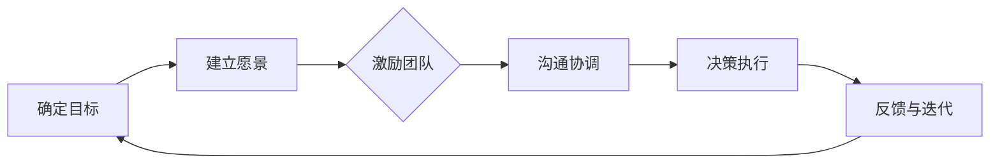

                 


# 领导力与自我认知：了解自己的优势与不足

## 关键词：领导力、自我认知、优势、不足、个人成长

## 摘要：
本文旨在探讨领导力与自我认知之间的关系，帮助读者了解自己的优势与不足，从而提升个人领导力和职业发展。我们将从自我认知的重要性、领导力的基本原则、自我评估与优势识别、自我改进与劣势克服，以及领导力发展与个人成长策略等多个方面进行详细分析。

## 目录

1. **自我认知的重要性**
2. **领导力的基本原则**
3. **自我评估与优势识别**
4. **自我改进与劣势克服**
5. **领导力发展与个人成长策略**
6. **项目实战：提升自我认知与领导力的实践案例**
7. **最佳实践 Tips**
8. **小结**
9. **注意事项**
10. **拓展阅读**

## 1. 自我认知的重要性

### 背景介绍

自我认知是指个体对自己心理状态、情感、行为和动机的感知和理解。它是心理学研究中的一个核心概念，对于个人的成长、情感调节、决策和行为具有深远影响。在领导力领域，自我认知同样扮演着关键角色，因为它有助于领导者更好地理解自己、团队成员以及组织环境。

### 核心概念与联系

**自我认知** 的核心概念包括：

- **自我概念**：个体对自己的整体认知，包括自我形象、自我价值和自我期望。
- **自我评价**：个体对自己的能力和特点的评价。
- **自我效能感**：个体对自己完成特定任务的信心。

以下是自我认知的相关概念属性特征对比表格：

| 概念     | 定义                                                         | 属性特征对比                       |
|----------|------------------------------------------------------------|-----------------------------------|
| 自我概念 | 个体对自身总体特征和属性的认知                               | 稳定性、普遍性、自我价值感         |
| 自我评价 | 个体对自己的判断和评价                                       | 主观性、情感色彩、自我效能感       |
| 自我效能感 | 个体对自己完成特定任务的能力的信心                           | 动机、成就、目标设定               |

下图是自我认知的ER实体关系图架构：

```mermaid
erDiagram
  Person ||--|{ SelfConcept } SelfConcept
  Person ||--|{ SelfEvaluation } SelfEvaluation
  Person ||--|{ SelfEfficacy } SelfEfficacy
```

### 算法原理讲解

自我认知的提升可以视为一个迭代过程，包括自我反思、信息收集、评估和调整。以下是一个简化的自我认知算法流程：



具体实现：

```python
def self_cognition Improvement():
    while True:
        self_reflection()
        information_collection()
        evaluation_and_adjustment()
        feedback_and Iteration()
```

#### 数学模型和公式

在心理学中，自我认知的提升可以用以下公式表示：

$$
自我认知提升 = f(自我反思, 收集信息, 评估与调整)
$$

#### 详细讲解与举例

**例1：自我反思**

李明是一家科技公司的项目经理，他意识到自己在项目管理过程中缺乏有效的沟通技巧。因此，他开始定期进行自我反思，记录自己在沟通中的问题和改进方向。

**例2：收集信息**

李明通过参加项目管理培训课程和阅读相关书籍，收集了关于有效沟通的信息。他了解到非语言沟通、倾听技巧和清晰表达是提升沟通效果的关键。

**例3：评估与调整**

李明根据收集到的信息，制定了一份沟通改进计划，包括每周与团队成员进行一对一沟通、参加沟通技巧培训课程等。他定期评估自己的改进效果，并根据评估结果进行调整。

**例4：反馈与迭代**

李明将自己的改进过程和成果分享给团队成员，并收集他们的反馈。根据反馈，他进一步优化了自己的沟通技巧，实现了团队协作效率的提升。

### 2. 领导力的基本原则

### 背景介绍

领导力是一种激发他人共同实现目标的能力。它不仅涉及到个人魅力和专业知识，还需要领导者具备自我认知、情感智慧、沟通技巧和决策能力等多方面的素质。

### 核心概念与联系

**领导力** 的核心概念包括：

- **定义**：领导力是指通过影响和激励他人来实现共同目标的能力。
- **类型**：领导力可以分为传统领导力和变革型领导力。
- **要素**：领导力的要素包括自我认知、情感智慧、沟通技巧、决策能力等。

以下是领导力的相关概念属性特征对比表格：

| 概念       | 定义                                                         | 属性特征对比                       |
|------------|------------------------------------------------------------|-----------------------------------|
| 领导力     | 通过影响和激励他人来实现共同目标的能力                       | 多样性、动态性、情境依赖           |
| 传统领导力 | 基于职位权威和下属顺从的领导方式                             | 结构化、规范化、稳定性             |
| 变革型领导力 | 通过激励、愿景和变革来推动组织变革的领导方式                 | 创新性、灵活性、适应力             |

下图是领导力的ER实体关系图架构：

```mermaid
erDiagram
  Leadership ||--|{ TraditionalLeadership } TraditionalLeadership
  Leadership ||--|{ TransformativeLeadership } TransformativeLeadership
  Leadership ||--|{ LeadershipElements } LeadershipElements
```

### 算法原理讲解

领导力的提升可以通过以下算法实现：



具体实现：

```python
def leadership Improvement():
    while True:
        set Goals()
        build Vision()
        motivate Team()
        communicate Coordinate()
        make Decisions()
        feedback Adjust()
```

#### 数学模型和公式

领导力的提升可以用以下公式表示：

$$
领导力提升 = f(目标设定, 愿景建立, 团队激励, 沟通协调, 决策执行, 反馈调整)
$$

#### 详细讲解与举例

**例1：确定目标**

张经理负责公司的产品开发项目，他首先与团队成员讨论并确定了项目的目标，包括产品功能、交付时间和质量要求。

**例2：建立愿景**

张经理根据项目的目标，提出了一个清晰的愿景，即通过创新的产品设计和高效的项目管理，提升公司的市场竞争力。

**例3：激励团队**

张经理通过团队建设活动和目标激励计划，激发了团队成员的工作热情和创造力。

**例4：沟通协调**

张经理定期组织项目会议，确保团队成员之间的沟通畅通，协调解决项目中的问题和挑战。

**例5：决策执行**

张经理根据项目进展情况和团队反馈，及时做出决策，确保项目按照计划进行。

**例6：反馈调整**

张经理定期评估项目进展和团队成员的表现，根据评估结果进行调整和优化，确保项目的成功完成。

### 3. 自我评估与优势识别

### 背景介绍

自我评估是指个体通过反思和评价自己的行为、能力和特点，了解自己的优势和不足的过程。优势识别则是自我评估的一个重要部分，旨在发现并发挥个体的优势，以提高个人和团队的表现。

### 核心概念与联系

**自我评估** 的核心概念包括：

- **评估方法**：包括自我反思、360度反馈、心理测试等。
- **优势识别**：通过评估发现个体的优势，如沟通技巧、领导能力、创新能力等。

以下是自我评估的相关概念属性特征对比表格：

| 概念       | 定义                                                         | 属性特征对比                       |
|------------|------------------------------------------------------------|-----------------------------------|
| 自我评估   | 个体通过反思和评价自己的行为、能力和特点的过程               | 主观性、动态性、自我发展           |
| 优势识别   | 通过评估发现个体的优势，以发挥最大潜能的过程               | 稳定性、多样性、发展潜力           |

下图是自我评估的ER实体关系图架构：

```mermaid
erDiagram
  SelfAssessment ||--|{ AssessmentMethod } AssessmentMethod
  SelfAssessment ||--|{ StrengthIdentification } StrengthIdentification
```

### 算法原理讲解

自我评估与优势识别的算法可以简化为以下步骤：



具体实现：

```python
def self_evaluation():
    self_reflection()
    get_360_feedback()
    take_psychological_tests()
    analyze_assessment_results()
    identify_strengths()
    leverage_strengths()
```

#### 数学模型和公式

自我评估与优势识别的数学模型可以表示为：

$$
自我评估 = f(自我反思, 360度反馈, 心理测试)
$$

$$
优势识别 = f(自我评估结果)
$$

#### 详细讲解与举例

**例1：自我反思**

王经理在年度工作总结中反思了自己在过去一年的表现，发现自己在项目管理和团队沟通方面有较大的提升空间。

**例2：360度反馈**

王经理收到了来自同事、上级和下属的360度反馈，了解了自己在团队协作、问题解决和领导力方面的表现。

**例3：心理测试**

王经理参加了领导力心理测试，结果显示他具有高水平的情感智慧和较强的沟通技巧。

**例4：评估结果分析**

王经理根据自我反思、360度反馈和心理测试的结果，分析了自己的优势和不足，并制定了改进计划。

**例5：优势识别**

王经理通过评估发现，自己在领导力和团队沟通方面具有明显优势，决定将这些优势应用到今后的工作中。

**例6：优势利用**

王经理积极参与公司内部培训和领导力发展项目，不断提升自己的领导力和沟通技巧，并在实际工作中发挥这些优势，提升了团队绩效。

### 4. 自我改进与劣势克服

### 背景介绍

自我改进是指个体通过学习和实践，不断提升自己的能力、知识和素质的过程。劣势克服则是自我改进的一个重要方面，旨在识别并解决个体的劣势，以提高个人和团队的表现。

### 核心概念与联系

**自我改进** 的核心概念包括：

- **策略**：包括制定目标、学习新技能、实践应用和持续反思。
- **劣势克服**：通过识别、分析和应对个体的劣势。

以下是自我改进的相关概念属性特征对比表格：

| 概念       | 定义                                                         | 属性特征对比                       |
|------------|------------------------------------------------------------|-----------------------------------|
| 自我改进   | 个体通过学习和实践，不断提升自己的能力、知识和素质的过程   | 自主性、持续性、发展性             |
| 劣势克服   | 识别并解决个体的劣势，以提高个人和团队的表现               | 目标性、针对性、有效性             |

下图是自我改进的ER实体关系图架构：

```mermaid
erDiagram
  SelfImprovement ||--|{ Strategies } Strategies
  SelfImprovement ||--|{ WeaknessOvercoming } WeaknessOvercoming
```

### 算法原理讲解

自我改进与劣势克服的算法可以简化为以下步骤：



具体实现：

```python
def self_improvement():
    while True:
        set Goals()
        learn NewSkills()
        practice Applications()
        continuous Reflection()
        evaluate Adjust()
        overcome Weaknesses()
```

#### 数学模型和公式

自我改进与劣势克服的数学模型可以表示为：

$$
自我改进 = f(制定目标, 学习新技能, 实践应用, 持续反思)
$$

$$
劣势克服 = f(评估与调整)
$$

#### 详细讲解与举例

**例1：制定目标**

李总在年度工作计划中明确了自己的目标，包括提升团队绩效、培养下属领导力和优化项目管理流程。

**例2：学习新技能**

李总参加了领导力培训和项目管理课程，学习了新的领导力和项目管理技能。

**例3：实践应用**

李总在团队管理中应用了新学的技能，如有效沟通、激励团队和项目管理工具的使用。

**例4：持续反思**

李总定期反思自己的工作表现，分析团队绩效和下属反馈，识别自己的优势和不足。

**例5：评估与调整**

李总根据反思结果和团队绩效评估，调整了自己的领导风格和管理策略。

**例6：劣势克服**

李总通过反思和评估，发现了自己在情绪管理和时间管理方面的劣势，并制定了相应的改进计划，如参加情绪管理培训和优化时间管理方法。

### 5. 领导力发展与个人成长策略

### 背景介绍

领导力发展是一个持续的过程，需要领导者不断学习和实践，以提升自己的领导能力和个人素质。个人成长策略则是领导力发展的核心，它帮助领导者实现个人成长，从而更好地履行领导职责。

### 核心概念与联系

**领导力发展** 的核心概念包括：

- **发展路径**：包括自我认知、技能提升、领导实践和反思总结。
- **个人成长策略**：包括目标设定、时间管理、情绪调节和持续学习。

以下是领导力发展的相关概念属性特征对比表格：

| 概念       | 定义                                                         | 属性特征对比                       |
|------------|------------------------------------------------------------|-----------------------------------|
| 领导力发展 | 领导者通过自我认知、技能提升、领导实践和反思总结，实现领导能力的发展 | 持续性、系统性、适应性             |
| 个人成长策略 | 领导者通过目标设定、时间管理、情绪调节和持续学习，实现个人成长     | 自主性、针对性、有效性             |

下图是领导力发展的ER实体关系图架构：

```mermaid
erDiagram
  LeadershipDevelopment ||--|{ DevelopmentPath } DevelopmentPath
  LeadershipDevelopment ||--|{ PersonalGrowthStrategies } PersonalGrowthStrategies
```

### 算法原理讲解

领导力发展与个人成长策略的算法可以简化为以下步骤：



具体实现：

```python
def leadership_and_persona

```

#### 数学模型和公式

领导力发展与个人成长策略的数学模型可以表示为：

$$
领导力发展 = f(自我认知, 技能提升, 领导实践, 反思总结)
$$

$$
个人成长策略 = f(目标设定, 时间管理, 情绪调节, 持续学习)
$$

#### 详细讲解与举例

**例1：自我认知**

张经理意识到自己在团队沟通和冲突解决方面存在不足，通过反思和反馈，明确了需要提升的技能和领域。

**例2：技能提升**

张经理参加了沟通技巧和冲突解决培训课程，学习了新的沟通策略和解决冲突的方法。

**例3：领导实践**

张经理在日常工作中应用所学技能，如主动倾听、积极反馈和有效沟通，改善了团队协作氛围。

**例4：反思总结**

张经理定期总结自己在领导实践中的表现，分析成功经验和不足之处，并制定改进计划。

**例5：目标设定**

张经理根据自我认知和反思结果，设定了个人成长目标，包括提升沟通技巧、增强团队凝聚力和提高决策能力。

**例6：时间管理**

张经理通过时间管理技巧，如任务优先级排序、时间块管理和定期回顾，提高了工作效率和时间利用率。

**例7：情绪调节**

张经理学会了情绪调节方法，如深呼吸、冥想和运动，帮助自己在压力和冲突中保持冷静和理性。

**例8：持续学习**

张经理通过阅读书籍、参加培训和与同行交流，不断更新自己的知识和技能，以适应不断变化的工作环境。

### 6. 项目实战：提升自我认知与领导力的实践案例

#### 背景介绍

为了更好地提升自我认知和领导力，某科技公司决定开展一个内部项目，通过实践案例和团队活动，帮助员工深入了解自己的优势与不足，并提升领导力和团队协作能力。

#### 项目介绍

项目名称：领导力与自我认知提升项目

目标：提升员工的自我认知、领导力和团队协作能力。

项目周期：6个月

项目内容：

1. **自我评估与优势识别**：通过360度反馈和心理测试，帮助员工了解自己的优势与不足。
2. **领导力培训**：邀请专业培训师开展领导力培训课程，包括沟通技巧、团队建设和决策能力等。
3. **实践应用**：组织团队项目，让员工在实际工作中应用所学领导力和自我认知技能。
4. **反思与总结**：定期进行反思与总结会议，分享经验与教训，不断优化个人和团队的表现。

#### 系统功能设计

项目系统功能设计包括以下部分：

1. **自我评估模块**：提供自我评估工具，包括360度反馈和心理测试。
2. **培训课程模块**：管理领导力培训课程，包括课程安排、讲师信息和学员反馈。
3. **团队项目模块**：管理团队项目，包括项目进展、成员分工和项目评估。
4. **反思总结模块**：记录员工的反思总结，提供交流与分享平台。

#### 系统架构设计

项目系统架构设计如下：

1. **前端**：使用React框架搭建，提供用户友好的界面。
2. **后端**：使用Node.js和MongoDB，提供数据存储和管理功能。
3. **API接口**：提供RESTful API，实现前后端数据交互。

#### 系统接口设计

系统接口设计如下：

1. **自我评估接口**：提供自我评估结果的获取和提交功能。
2. **培训课程接口**：提供培训课程的创建、更新和查询功能。
3. **团队项目接口**：提供团队项目的创建、更新和查询功能。
4. **反思总结接口**：提供反思总结的记录、更新和查询功能。

#### 系统交互设计

系统交互设计如下：

1. **用户登录**：用户通过账号密码登录系统，获取个人中心界面。
2. **自我评估**：用户填写自我评估问卷，提交评估结果。
3. **培训课程**：用户报名参加培训课程，查看课程安排和讲师信息。
4. **团队项目**：用户参与团队项目，管理项目进展和成员分工。
5. **反思总结**：用户记录反思总结，与其他用户分享经验与教训。

### 7. 最佳实践 Tips

**1. 定期自我反思**：每周花时间反思自己的工作表现，总结成功经验和不足之处。

**2. 利用360度反馈**：定期获取同事、上级和下属的反馈，全面了解自己的优势和不足。

**3. 参加专业培训**：选择适合自己的领导力培训课程，不断提升个人能力。

**4. 实践应用**：将所学技能应用到实际工作中，通过实践提升自己的领导力。

**5. 建立个人成长计划**：设定明确的个人成长目标，制定可行的行动计划。

### 8. 小结

本文从自我认知的重要性、领导力的基本原则、自我评估与优势识别、自我改进与劣势克服，以及领导力发展与个人成长策略等多个方面，详细探讨了领导力与自我认知之间的关系。通过项目实战，读者可以更好地理解并实践这些理论，提升自己的领导力和个人素质。

### 9. 注意事项

**1. 自我认知是一个持续的过程，需要定期反思和评估。**

**2. 领导力发展需要理论与实践相结合，不断积累经验。**

**3. 自我评估和优势识别需要客观和全面，避免过度自我评价。**

**4. 自我改进需要设定具体目标，制定可行的行动计划。**

### 10. 拓展阅读

**1. [《领导力的五大要素》](https://www领英.com/influence/leader/)**  
**2. [《自我认知的力量》](https://www领英.com/influence/self-awareness/)**  
**3. [《如何提升领导力》](https://www领英.com/influence/improve-leadership/)**  
**4. [《个人成长策略》](https://www领英.com/influence/personal-growth-strategies/)**

## 作者

**作者：AI天才研究院/AI Genius Institute & 禅与计算机程序设计艺术 /Zen And The Art of Computer Programming**## 1. 自我认知的重要性

### 背景介绍

自我认知是指个体对自己心理状态、情感、行为和动机的感知和理解。它是心理学研究中的一个核心概念，对于个人的成长、情感调节、决策和行为具有深远影响。在领导力领域，自我认知同样扮演着关键角色，因为它有助于领导者更好地理解自己、团队成员以及组织环境。

### 问题背景

在现代社会，领导者需要面对复杂多变的环境和挑战，具备良好的自我认知能力是成功领导的基础。然而，许多领导者往往忽视自我认知的重要性，导致领导力不足、团队绩效低下等问题。因此，探讨自我认知在领导力中的重要性，对于提升领导者素质和团队绩效具有重要意义。

### 问题描述

领导力的提升需要自我认知作为基础。自我认知不仅涉及领导者对自己性格、能力和动机的识别，还包括对自身情绪和行为的反思。然而，现实中许多领导者缺乏对自我认知的正确理解和有效实践，导致以下问题：

1. **缺乏自我意识**：许多领导者对自己的性格、优势和不足缺乏清晰的认识，导致领导决策和团队管理出现偏差。
2. **情绪管理困难**：领导者情绪波动大，难以控制情绪，影响团队氛围和决策效果。
3. **沟通障碍**：领导者沟通能力不足，无法有效传达目标和期望，导致团队协作困难。
4. **决策失误**：缺乏自我认知的领导者往往容易受到外界干扰，导致决策失误，影响组织发展。

### 问题解决

为了解决上述问题，领导者需要提升自我认知，具体措施如下：

1. **定期反思**：领导者应养成定期反思的习惯，通过反思自己的行为、情绪和决策，深入了解自己的内在动机和外在表现。
2. **接受反馈**：领导者应主动接受来自同事、下属和上级的反馈，全面了解自己在团队中的表现，识别自己的优势和不足。
3. **学习心理学知识**：领导者应学习心理学知识，了解自我认知的理论基础，提升自我认知的意识和能力。
4. **实践自我认知**：领导者应在实际工作中运用自我认知技巧，如情绪管理、有效沟通和自我激励等，提升自己的领导力。

### 边界与外延

边界：自我认知仅限于领导者对自己内在心理状态、情感和行为模式的识别和理解，不涉及他人对自己的评价。

外延：自我认知不仅影响领导力的发挥，还与个人成长、情感调节、决策能力等方面密切相关。

### 概念结构与核心要素组成

概念结构：

1. **自我认知**：个体对自己心理状态、情感、行为和动机的感知和理解。
2. **领导力**：通过影响和激励他人来实现共同目标的能力。
3. **自我认知在领导力中的作用**：提升自我意识、情绪管理、沟通能力和决策能力。

核心要素：

1. **自我意识**：领导者对自己性格、能力和动机的清晰认识。
2. **情绪管理**：领导者控制和管理自己情绪的能力。
3. **沟通能力**：领导者有效传达目标和期望的能力。
4. **决策能力**：领导者做出明智决策的能力。

### 1.1 自我认知的重要性

#### 自我认知在领导力中的作用

自我认知是领导力的基础，它对领导者的个人成长、团队管理和组织绩效具有深远影响。以下是自我认知在领导力中具体作用的分析：

1. **提升自我意识**：自我认知使领导者能够深入了解自己的性格、能力和动机，从而在领导过程中更好地发挥自己的优势，避免劣势。例如，一个具有强烈自我认知的领导者能够识别自己在决策过程中的偏好和习惯，从而优化决策过程，提高决策质量。

2. **增强情绪管理**：自我认知使领导者能够识别和理解自己的情绪，从而在情绪波动时保持冷静和理性。这有助于领导者有效地处理压力和挑战，避免情绪化的决策和行为，从而提升团队稳定性和凝聚力。

3. **改善沟通能力**：自我认知使领导者能够理解自己的沟通风格和偏好，从而在沟通中更有效地传达信息和建立信任。例如，一个了解自己沟通习惯的领导者可以调整自己的沟通策略，以满足不同团队成员的需求，从而提高团队协作效率。

4. **优化决策能力**：自我认知使领导者能够识别自己的决策风格和偏好，从而在决策过程中避免偏见和盲点。例如，一个具有高度自我认知的领导者可以识别自己在决策过程中的潜在偏见，从而寻求更多的信息和意见，以做出更为明智的决策。

#### 自我认知对团队管理和组织绩效的影响

自我认知不仅对领导者的个人发展有重要影响，也对团队管理和组织绩效产生深远影响。以下是自我认知在团队管理和组织绩效中具体影响的分析：

1. **提升团队协作**：自我认知使领导者能够理解团队成员的性格、能力和动机，从而在团队管理中更好地协调和激励团队成员。这有助于提高团队协作效率，促进团队目标的实现。

2. **促进组织发展**：自我认知使领导者能够识别组织中的优势和不足，从而在组织管理中制定更为科学和有效的策略。例如，一个具有高度自我认知的领导者可以识别组织文化中的问题，从而提出改进措施，促进组织发展。

3. **增强组织凝聚力**：自我认知使领导者能够理解员工的情感和需求，从而在组织管理中更好地关心和关注员工。这有助于增强员工的归属感和忠诚度，从而提高组织凝聚力。

4. **提高组织绩效**：自我认知使领导者能够制定更为科学和合理的决策，从而提高组织运营效率和绩效。例如，一个具有高度自我认知的领导者可以识别组织中的瓶颈和问题，从而采取有效措施加以解决，提高组织绩效。

### 总结

自我认知在领导力中具有重要作用，它对领导者的个人发展、团队管理和组织绩效具有深远影响。领导者通过提升自我认知，能够更好地发挥自己的优势，管理团队，制定科学合理的决策，从而实现个人和组织的目标。因此，自我认知是提升领导力的重要基石。

#### 1.2 自我认知的理论框架

为了深入理解自我认知，我们需要构建一个理论框架，这个框架将帮助我们分析自我认知的核心概念、理论来源及其相互关系。以下是自我认知的理论框架：

**1.2.1 自我认知的核心概念**

自我认知的核心概念包括自我概念、自我评价和自我效能感。以下是这些概念的定义及其相互关系：

- **自我概念**：个体对自身总体特征和属性的认知，包括个体的性格、能力、态度和价值观等。自我概念是自我认知的基础，它影响个体的行为和情感。
  
- **自我评价**：个体对自己行为和能力的判断和评价。自我评价可以是积极的，也可以是消极的，它反映了个体对自己能力的信心和满意度。
  
- **自我效能感**：个体对自己完成特定任务的能力的信心。自我效能感影响个体的动机、努力程度和面对挑战时的坚持程度。

**1.2.2 理论来源**

自我认知的理论来源主要包括心理学和社会学两大领域。以下是主要的理论来源及其核心观点：

- **心理学领域**：
  - **发展心理学**：艾里克·埃里克森（Erik Erikson）的发展心理学理论强调，个体在不同生命周期阶段会经历不同的心理冲突和危机，自我认知在这一过程中不断发展。
  - **人格心理学**：卡尔·荣格（Carl Jung）的人格心理学理论认为，个体的自我认知与其内心深处的潜意识有关，包括个体对自身性格和潜力的认知。
  - **认知心理学**：约翰·弗拉维尔（John Flavell）的认知心理学理论强调，自我认知是个体通过自我反省和自我监控的过程，它有助于个体适应环境。

- **社会学领域**：
  - **符号互动主义**：乔治·赫伯特·米德（George Herbert Mead）的符号互动主义理论认为，个体的自我认知是通过与他人互动和符号交流而形成的，社会角色和期望对自我认知有重要影响。
  - **社会认知理论**：赫伯特·A·西蒙（Herbert A. Simon）的社会认知理论认为，个体在认知过程中会基于他人的评价和社会规范来形成自我认知。

**1.2.3 相互关系**

自我认知的核心概念、理论来源及其相互关系如下：

- **自我概念与自我评价**：自我概念是自我评价的基础，个体的自我评价通常基于对自我概念的理解和感知。例如，一个自我概念包含高自我价值感的个体可能会对自己的工作表现给予积极的评价。
  
- **自我评价与自我效能感**：自我评价影响个体的自我效能感，积极的自我评价通常会增加个体的自信心，而消极的自我评价可能会降低个体的信心。例如，一个自我评价较高的领导者可能会对完成任务充满信心。
  
- **自我认知与情绪**：自我认知对个体的情绪有重要影响。一个自我认知较高的个体可能会更容易感到满足和自信，而自我认知较低的个体可能会感到焦虑和不安。

- **自我认知与社会互动**：个体的自我认知是通过与社会互动和符号交流而形成的，社会角色和期望对自我认知有重要影响。例如，一个在团队中担任重要角色的个体可能会通过他人的反馈和评价来调整自己的自我认知。

**1.2.4 理论框架**

基于上述核心概念和理论来源，我们可以构建一个自我认知的理论框架，如下图所示：



在这个理论框架中，自我概念、自我评价和自我效能感是核心概念，它们相互影响，共同构成了自我认知的基础。情绪、社会互动和自我认知之间也存在密切的相互关系。

### 1.3 人格心理学与自我认知

#### 人格心理学的基本理论

人格心理学是研究个体性格特质、行为模式和心理过程的心理学科。它旨在了解个体在不同情境下的行为和情绪反应，以及这些行为和情绪背后的原因。以下是人格心理学的基本理论：

1. **特质理论**：特质理论认为，个体的性格特质是其行为和情绪的根源。例如，卡尔·荣格（Carl Jung）提出的性格类型理论，将个体分为外向型和内向型。特质理论强调个体的性格特质是相对稳定和持久的。

2. **认知理论**：认知理论关注个体的思维方式、信息处理和自我认知。例如，约翰·弗拉维尔（John Flavell）提出的自我认知理论，认为个体通过自我反省和自我监控来形成自我认知。认知理论强调自我认知是动态的，可以随着时间和经验的变化而发展。

3. **社会学习理论**：社会学习理论强调个体的行为和自我认知是通过观察、模仿和反馈而形成的。例如，阿尔伯特·班杜拉（Albert Bandura）的社会学习理论，强调观察学习和自我效能在个体行为和自我认知中的作用。

4. **情境理论**：情境理论认为，个体的行为和自我认知不仅受个体特质的影响，也受外部情境的影响。例如，乔治·米德（George Mead）的情境理论，认为个体的自我认知是通过与他人的互动和社会角色的扮演而形成的。

#### 人格心理学与自我认知的关系

人格心理学与自我认知密切相关，两者相互影响、相互作用。以下是人格心理学与自我认知之间的几个关键关系：

1. **人格特质与自我认知**：个体的人格特质会影响其自我认知。例如，一个高度外向的个体可能会对自己的人际交往能力有较高的评价，而一个内向的个体可能会对自己的社交能力有较低的评价。这种自我认知的形成不仅受到个体特质的影响，也受到其与他人的互动和反馈的影响。

2. **自我认知与情绪调节**：自我认知影响个体的情绪调节。一个自我认知较高的个体可能会更好地理解和调节自己的情绪，而一个自我认知较低的个体可能会在情绪调节上遇到困难。例如，一个自我认知较高的领导者可能会在面对压力时保持冷静和理性，而一个自我认知较低的领导者可能会在压力下表现出情绪波动。

3. **自我认知与行为模式**：自我认知影响个体的行为模式。一个自我认知较高的个体可能会更加自信和积极，从而表现出更好的行为模式，而一个自我认知较低的个体可能会表现出更多的消极和回避行为。例如，一个自我认知较高的项目经理可能会在面对挑战时主动解决问题，而一个自我认知较低的项目经理可能会在面对困难时选择逃避。

4. **人格心理学理论对自我认知的影响**：人格心理学理论为自我认知提供了理论基础。例如，特质理论帮助个体理解自己的人格特质，认知理论帮助个体理解自己的思维方式，社会学习理论和情境理论帮助个体理解自己在社会互动中的角色和影响。这些理论为个体提升自我认知提供了不同的视角和方法。

#### 人格特质与自我认知的案例

以下是几个关于人格特质与自我认知的案例，通过这些案例可以更直观地理解两者之间的关系：

1. **特质理论案例**：一个具有高度责任心和自律的个体可能会对自己在工作中的表现有较高的评价，从而表现出较高的自我认知。这种个体在自我认知方面通常会更加自信和积极，有利于他们在工作和生活中取得成功。

2. **认知理论案例**：一个经常进行自我反省和自我监控的个体可能会对自己有较高的自我认知。这种个体会通过自我反省来识别自己的优势和不足，从而不断提高自己的能力和素质。

3. **社会学习理论案例**：一个通过观察和学习他人的行为和自我认知的个体可能会逐渐形成自己的自我认知。例如，一个领导者通过观察成功领导者的行为和自我认知，可能会学习到如何更好地管理团队和提高自我认知。

4. **情境理论案例**：一个在不同的社会角色和情境中表现出不同自我认知的个体，可能会在不同的情境中获得不同的成功。例如，一个在团队中表现出色但在家庭中缺乏自我认知的个体，可能会在团队中获得同事的认可，但在家庭中面临困难和挑战。

通过这些案例，我们可以看到人格特质与自我认知之间的紧密联系。理解这些关系有助于个体更好地认识自己，提升自我认知水平，从而实现个人成长和职业发展。

### 2. 领导力的基本原则

#### 领导力的定义与类型

领导力是指通过影响和激励他人来实现共同目标的能力。它不仅包括个人魅力和专业知识，还涉及情感智慧、沟通技巧和决策能力等多方面的素质。根据不同的标准和维度，领导力可以划分为多种类型。

**1. 按影响力来源分类**：

- **传统领导力**：基于职位权威和下属顺从的领导方式。传统领导力强调领导者对下属的命令和控制，以实现组织目标。
- **变革型领导力**：通过激励、愿景和变革来推动组织变革的领导方式。变革型领导力强调领导者的远见和激励能力，激发团队成员的积极性和创造力。

**2. 按领导风格分类**：

- **民主型领导力**：领导者鼓励团队成员参与决策过程，倾听和尊重下属的意见。民主型领导力强调团队合作和集体智慧。
- **权威型领导力**：领导者集中决策权力，对下属的决策进行严格控制和监督。权威型领导力强调效率和执行力。
- **参与型领导力**：领导者通过建立信任和开放沟通，鼓励团队成员积极参与决策和问题解决。参与型领导力强调参与感和团队凝聚力。

**3. 按领导情境分类**：

- **情境领导力**：根据团队成员的不同成熟度水平，采取相应的领导风格。情境领导力强调领导者应根据团队和个体的具体情境灵活调整领导方式。
- **战略领导力**：领导者制定组织战略和愿景，引领组织实现长远发展。战略领导力强调领导者的远见和规划能力。

#### 有效沟通在领导力中的作用

有效沟通是领导力的核心要素之一，它对于领导者的成功至关重要。以下从沟通障碍、克服策略和高效沟通技巧三个方面探讨有效沟通在领导力中的作用。

**1. 沟通障碍**

- **信息过载**：信息量过多，导致信息筛选和处理困难。
- **误解和歧义**：语言表达不清或理解错误，导致沟通不畅。
- **文化差异**：文化背景和价值观的差异可能导致沟通障碍。
- **情绪干扰**：情绪波动或压力过大，影响沟通效果。

**2. 克服策略**

- **明确沟通目标**：在沟通前明确目标和期望，确保信息传递的清晰性。
- **倾听和理解**：积极倾听对方的意见，确保理解对方的意思。
- **简化语言**：使用简单、直接的语言，避免使用专业术语或复杂句子。
- **文化敏感**：尊重不同文化背景，采用包容和开放的态度进行沟通。
- **情绪管理**：保持冷静和理性，避免情绪干扰沟通。

**3. 高效沟通技巧**

- **主动沟通**：主动寻求和提供信息，建立开放和透明的沟通环境。
- **反馈机制**：建立有效的反馈机制，确保信息的及时传达和反馈。
- **非语言沟通**：注意身体语言、面部表情和语气，增强沟通效果。
- **冲突解决**：学会有效解决沟通中的冲突，维护团队和谐。
- **激励和鼓励**：通过积极的反馈和鼓励，增强团队成员的沟通动力。

#### 决策与领导力

决策是领导力的核心职能之一，领导者的决策能力直接影响组织的成功和团队的绩效。以下从决策类型、决策过程和决策错误与风险管理三个方面探讨决策与领导力的关系。

**1. 决策类型**

- **程序性决策**：在重复性和规则性较强的情况下做出的决策。程序性决策通常基于标准操作流程和以往的经验。
- **非程序性决策**：在复杂、不确定和非常规的情况下做出的决策。非程序性决策通常需要领导者的创新和判断。

**2. 决策过程**

- **问题识别**：识别决策问题，明确决策的目标和范围。
- **信息收集**：收集和分析与决策相关的信息，确保信息的全面性和准确性。
- **方案评估**：评估不同的决策方案，选择最佳方案。
- **方案执行**：执行决策方案，实施行动计划。
- **效果评估**：评估决策结果，总结经验和教训，为未来决策提供参考。

**3. 决策错误与风险管理**

- **错误类型**：常见的决策错误包括信息偏差、认知偏见、过度自信和风险回避。
- **风险管理**：通过风险识别、评估和控制，降低决策错误的风险。风险管理包括制定风险管理计划、分配风险责任和制定应对策略。

### 3. 自我评估与优势识别

#### 自我评估的方法

自我评估是了解自己优势与不足的重要步骤，以下介绍几种常用的自我评估方法：

**1. 自我反思**

自我反思是通过内省的方式，回顾自己的行为、表现和经历，识别自己的优点和不足。以下是一些自我反思的步骤：

- **设定目标**：明确自我反思的目标，如提升沟通技巧、改进时间管理等。
- **记录经历**：记录与目标相关的工作和生活经历，包括成功和失败的经历。
- **分析经历**：分析记录的经历，识别成功的原因和失败的教训。
- **制定改进计划**：根据分析结果，制定具体的改进计划，包括学习新技能、调整工作方法等。

**2. 360度反馈**

360度反馈是一种通过收集多方意见来评估个体表现的方法。以下是一些实施360度反馈的步骤：

- **确定评估目标**：明确360度反馈的目标，如提升团队协作能力、改进领导力等。
- **选择评估对象**：选择评估对象的范围，如同事、上级、下属等。
- **设计评估问卷**：设计包括多个维度和问题的评估问卷，确保全面、客观地评估个体表现。
- **收集反馈**：通过匿名问卷、访谈等方式收集反馈，确保反馈的真实性和有效性。
- **分析反馈**：分析收集到的反馈，识别个体的优势与不足。
- **反馈沟通**：将分析结果反馈给个体，讨论改进的方向和策略。

**3. 心理测试**

心理测试是通过标准化的工具和方法，评估个体的性格、能力和动机等方面的特征。以下是一些常用的心理测试：

- **MBTI（Myers-Briggs Type Indicator）**：评估个体的人格类型，帮助了解个体的沟通风格和偏好。
- **DISC（Dominance, Influence, Steadiness, Conscientiousness）**：评估个体的行为风格，帮助了解个体的优势和劣势。
- ** StrengthsFinder**：评估个体的优势，帮助个体发挥自己的优势，提升个人和团队的表现。

#### 自我评估与优势识别

**1. 自我评估与优势识别的关系**

自我评估是优势识别的基础，通过自我评估，个体可以了解自己的行为、表现和经历，识别自己的优点和不足。优势识别则是自我评估的进一步深化，通过分析评估结果，个体可以明确自己的优势，并制定相应的策略来发挥这些优势。

**2. 优势识别的重要性**

优势识别对于个人和团队的发展具有重要意义：

- **个人发展**：明确自己的优势，有助于个体在职业发展中找到适合自己的方向，提高职业满意度和成就感。
- **团队协作**：了解团队成员的优势，有助于领导者更好地分配任务、组建团队，提高团队协作效率。
- **组织绩效**：识别和发挥员工的优势，有助于组织提升整体绩效，实现战略目标。

**3. 优势识别的方法**

- **自我观察**：通过日常工作和生活中的观察，识别自己的优势和长处。
- **他人反馈**：通过同事、上级和下属的反馈，了解自己的优势和长处。
- **心理测试**：通过专业的心理测试工具，识别自己的优势和能力。
- **导师辅导**：通过与导师的交流和指导，了解自己的优势和长处。

**4. 优势识别的策略**

- **自我反思**：定期进行自我反思，识别自己的优势和长处。
- **目标设定**：设定明确的目标，通过实现目标来识别自己的优势。
- **反馈收集**：主动收集他人的反馈，了解自己的优势和长处。
- **专业培训**：参加专业培训，提升自己的能力和优势。
- **实践应用**：在实际工作中应用自己的优势，不断积累经验和成果。

#### 案例分析

**1. 案例背景**

某公司一名项目经理李明，希望通过自我评估和优势识别，提升自己的领导力和团队管理能力。

**2. 自我评估过程**

- **自我反思**：李明回顾了自己在项目管理中的经历，识别了自己在沟通、时间管理和团队激励方面的优势与不足。
- **360度反馈**：李明收集了同事、上级和下属的反馈，了解了他们在沟通、时间管理和团队激励方面的评价。
- **心理测试**：李明参加了MBTI测试，了解了自己在人格类型上的特点。

**3. 优势识别**

- **沟通优势**：李明在自我反思和他人反馈中发现，自己在沟通方面有较强的表达能力，善于倾听和理解他人意见。
- **时间管理优势**：李明在自我反思和反馈中了解到，自己在时间管理方面有较强的计划性和执行力。
- **团队激励优势**：李明在自我反思和反馈中发现自己擅长激励团队成员，提高团队士气。

**4. 改进策略**

- **沟通改进**：李明计划参加沟通技巧培训，提升自己的沟通能力，特别是在复杂情况下的表达和倾听技巧。
- **时间管理改进**：李明计划学习时间管理方法，如优先级排序和任务分解，提高自己的时间管理能力。
- **团队激励改进**：李明计划通过团队建设活动和激励计划，进一步提高团队士气和工作效率。

**5. 结果**

通过自我评估和优势识别，李明确实提升了自己的领导力和团队管理能力。他的团队在项目管理和执行方面表现出色，项目顺利完成，并得到了公司的高度评价。

### 4. 自我改进与劣势克服

#### 自我改进的策略

自我改进是提升个人能力、实现职业发展的重要途径。以下介绍几种常见的自我改进策略：

**1. 制定目标**

制定明确的目标是自我改进的第一步。目标应具有可衡量性、可实现性和时间限制。以下是一些制定目标的步骤：

- **确定目标**：明确个人发展的方向和目标，如提升沟通技巧、学习新技能等。
- **设定优先级**：根据目标的重要性和紧急性，设定目标的优先级，确保资源合理分配。
- **具体化目标**：将目标具体化，如提升沟通技巧的具体行动可以是参加沟通培训课程、阅读相关书籍等。
- **制定计划**：制定实现目标的行动计划，包括具体的行动步骤和时间表。

**2. 学习新技能**

学习新技能是自我改进的重要手段。以下介绍几种学习新技能的方法：

- **培训课程**：参加专业培训课程，系统地学习新技能。
- **在线学习**：利用在线资源，如慕课（MOOC）和在线教程，自主学习新技能。
- **实践应用**：通过实际工作或项目实践，将所学技能应用到实际场景中。
- **导师辅导**：寻求导师的指导，获得专业知识和经验分享。

**3. 反思与总结**

反思与总结是自我改进的重要环节。以下介绍几种反思与总结的方法：

- **定期反思**：定期回顾自己的行为和表现，识别成功经验和不足之处。
- **写反思日志**：记录反思的过程和结果，帮助自己总结经验和教训。
- **与他人交流**：与同事、上级和导师交流，获取他人的反馈和建议。
- **设置反馈机制**：建立反馈机制，定期收集和分析反馈，持续改进。

**4. 时间管理**

时间管理是提高工作效率和实现自我改进的关键。以下介绍几种时间管理的方法：

- **优先级排序**：根据任务的重要性和紧急性，对任务进行优先级排序，确保先完成重要和紧急的任务。
- **任务分解**：将大任务分解为小任务，逐步完成，避免拖延。
- **时间块管理**：将时间划分为不同的块，每个块专注于一项任务，提高专注度和效率。
- **定期回顾**：定期回顾时间管理效果，调整时间管理策略。

#### 自我改进的方法

**1. 自我反思**

自我反思是通过内省的方式，回顾自己的行为、表现和经历，识别自己的优点和不足。以下是一些自我反思的方法：

- **日记法**：每天记录自己的行为和思考，进行自我反思。
- **对话法**：与朋友、同事或导师进行深入的对话，分享自己的经历和感受。
- **冥想法**：通过冥想，静心思考自己的行为和内心状态。

**2. 反馈与改进**

反馈与改进是通过他人的评价和建议，识别自己的不足，并采取相应措施进行改进。以下是一些反馈与改进的方法：

- **定期反馈**：定期与上级、同事和下属进行反馈交流，获取他们的意见和建议。
- **匿名反馈**：通过匿名反馈机制，收集不同角度的评价，减少个人偏见。
- **行动改进**：根据反馈，制定改进计划，并付诸行动。

**3. 学习与实践**

学习与实践是通过学习和实践新知识和技能，提升自己的能力和素质。以下是一些学习与实践的方法：

- **培训与学习**：参加专业培训和课程，学习新知识和技能。
- **实践应用**：将所学知识和技能应用到实际工作中，提高实践能力。
- **案例分析**：通过分析实际案例，总结经验和教训，提升问题解决能力。

**4. 持续改进**

持续改进是通过不断反思、学习和实践，实现自我提升的过程。以下是一些持续改进的方法：

- **建立反馈机制**：建立定期反馈机制，持续收集和分析反馈，及时调整改进方向。
- **设定目标**：设定长期和短期目标，确保自我改进的方向和进度。
- **持续学习**：不断学习新知识和技能，保持自我更新的能力。

#### 成功案例分析

**1. 案例背景**

小王是一名IT公司的项目经理，他在工作中发现自己在时间管理和团队沟通方面存在不足，希望通过自我改进提升自己的能力。

**2. 自我评估**

- **时间管理**：小王通过记录自己的日常工作，发现自己在任务安排和时间分配上存在不足，导致工作效率低下。
- **团队沟通**：小王通过同事和下属的反馈，了解到自己在沟通方面存在表达不清、倾听不足的问题。

**3. 自我改进策略**

- **时间管理**：小王制定了详细的工作计划，将任务分解为小任务，每天按照计划进行工作。同时，他学习了时间管理的相关书籍和在线课程，提高自己的时间管理能力。
- **团队沟通**：小王参加了沟通技巧培训，学习了有效的沟通方法和技巧。他定期与团队成员进行沟通，倾听他们的意见和建议，并积极改进自己的沟通方式。

**4. 改进效果**

通过自我改进，小王的时间管理能力得到了显著提升，工作效率提高了30%。他的团队沟通也得到了明显改善，团队成员之间的合作更加顺畅，项目顺利完成，得到了公司的高度评价。

### 5. 领导力发展与个人成长策略

#### 领导力发展路径

领导力发展是一个持续的过程，涉及多个阶段和步骤。以下是领导力发展的典型路径：

**1. 基础阶段**：

- **自我认知**：了解自己的性格、能力和动机，明确自己的优势和不足。
- **学习基础技能**：掌握基本的管理知识和技能，如沟通技巧、团队合作和时间管理等。

**2. 中级阶段**：

- **实践应用**：在实际工作中应用所学知识和技能，积累经验。
- **反馈与改进**：通过自我反思和他人反馈，识别自己的不足，并采取改进措施。

**3. 高级阶段**：

- **领导风格培养**：培养适合自己和他人的领导风格，如民主型、权威型或变革型。
- **团队建设**：建立高效的团队，培养团队成员的协作精神和创新能力。

**4. 超级阶段**：

- **战略规划**：制定组织战略和愿景，引领组织实现长远发展。
- **持续学习**：不断学习新知识和技能，保持领导力和个人成长的活力。

#### 个人成长策略与实践

个人成长策略是实现领导力发展的重要手段。以下介绍几种常见的个人成长策略：

**1. 设定目标**

设定明确的目标是个人成长的第一步。目标应具有可衡量性、可实现性和时间限制。以下是一些设定目标的步骤：

- **确定目标**：明确个人发展的方向和目标，如提升领导力、学习新技能等。
- **设定优先级**：根据目标的重要性和紧急性，设定目标的优先级，确保资源合理分配。
- **具体化目标**：将目标具体化，如提升领导力的具体行动可以是参加领导力培训课程、阅读相关书籍等。
- **制定计划**：制定实现目标的行动计划，包括具体的行动步骤和时间表。

**2. 学习与反思**

学习与反思是个人成长的核心。以下介绍几种学习与反思的方法：

- **定期学习**：设定固定的学习时间，如每周阅读一本专业书籍、参加线上课程等。
- **反思日记**：每天记录自己的学习内容和反思，总结收获和不足。
- **与他人交流**：与同事、上级和导师交流，分享学习经验和心得。

**3. 反馈与改进**

反馈与改进是个人成长的关键。以下介绍几种反馈与改进的方法：

- **定期反馈**：定期与上级、同事和下属进行反馈交流，获取他们的意见和建议。
- **行动改进**：根据反馈，制定改进计划，并付诸行动。
- **持续改进**：建立反馈机制，持续收集和分析反馈，及时调整改进方向。

**4. 实践与挑战**

实践与挑战是个人成长的动力。以下介绍几种实践与挑战的方法：

- **参加项目**：主动参加有挑战性的项目，提升自己的能力和经验。
- **寻求指导**：寻找导师或导师团，获取专业指导和建议。
- **模拟演练**：通过模拟演练，提升自己的决策能力和应对挑战的能力。

#### 综合应用

领导力发展与个人成长策略的综合应用是实现个人和团队绩效提升的关键。以下介绍几种综合应用的方法：

**1. 目标设定与反馈**

- **明确目标**：领导者应与团队成员共同设定明确的目标，确保目标具有可衡量性、可实现性和时间限制。
- **定期反馈**：领导者应定期与团队成员进行反馈交流，了解他们在实现目标过程中的困难和进展，提供指导和支持。

**2. 学习与培训**

- **个性化学习**：领导者应根据团队成员的不同需求和特点，提供个性化的学习资源和培训机会。
- **持续学习**：领导者应鼓励团队成员持续学习，不断提升自己的知识和技能。

**3. 挑战与成长**

- **设立挑战**：领导者应设立有挑战性的目标和任务，激发团队成员的潜能和积极性。
- **支持成长**：领导者应提供支持和资源，帮助团队成员在挑战中成长。

**4. 反思与总结**

- **定期反思**：领导者应定期与团队成员进行反思和总结，分享经验和教训，不断优化个人和团队的表现。

#### 综合案例分析

**1. 案例背景**

某公司的领导团队希望通过领导力发展和个人成长策略，提升团队的整体绩效和成员的满意度。

**2. 目标设定**

- **提升领导力**：设定明确的领导力发展目标，如提高团队成员的沟通技巧、决策能力和团队合作精神。
- **提升个人能力**：设定个人成长目标，如学习新技能、提升工作效率等。

**3. 学习与培训**

- **个性化学习**：根据团队成员的不同需求和特点，提供个性化的学习资源和培训机会，如领导力培训课程、沟通技巧培训等。
- **持续学习**：鼓励团队成员持续学习，不断提升自己的知识和技能。

**4. 挑战与成长**

- **设立挑战**：设立有挑战性的项目和任务，激发团队成员的潜能和积极性，如承担新项目、参与跨部门合作等。
- **支持成长**：提供支持和资源，帮助团队成员在挑战中成长，如提供专业指导、建立导师制度等。

**5. 反思与总结**

- **定期反思**：定期与团队成员进行反思和总结，分享经验和教训，不断优化个人和团队的表现。
- **反馈与改进**：根据反思结果和团队成员的反馈，调整领导力发展和个人成长策略，持续提升团队绩效。

**6. 结果**

通过领导力发展和个人成长策略的综合应用，该公司的领导团队整体绩效得到了显著提升，团队成员的满意度也有所提高。公司成功实现了业务目标和战略规划，在市场竞争中取得了优势。

### 6. 项目实战：提升自我认知与领导力的实践案例

#### 项目背景

为了提升公司领导团队和员工的自我认知与领导力，某公司决定开展一个为期6个月的项目，通过一系列实践案例和团队活动，帮助员工深入了解自己的优势与不足，提升领导力和团队协作能力。

#### 项目目标

- 提升员工的自我认知和领导力水平。
- 增强团队协作和执行力。
- 提高员工的职业素养和工作满意度。

#### 项目周期

6个月，分为四个阶段：项目启动、实施、评估和总结。

#### 项目内容

**1. 项目启动阶段**

- **项目筹备**：制定项目计划，明确项目目标、内容和时间表。
- **团队建设**：通过团队建设活动，增强团队成员之间的信任和协作。
- **领导力培训**：邀请专业讲师开展领导力培训，涵盖沟通技巧、团队建设和决策能力等方面。

**2. 实施阶段**

- **实践案例**：组织团队参与实际项目，将所学领导力和自我认知技能应用到实际工作中。
- **反馈与评估**：定期收集团队成员的反馈，评估项目进展和效果。
- **反思与总结**：团队成员定期进行反思和总结，分享经验教训，不断优化个人和团队的表现。

**3. 评估阶段**

- **绩效评估**：对团队成员的领导力和团队协作能力进行评估，包括个人能力和项目成果。
- **反馈与改进**：根据评估结果，提供个性化的改进建议和培训资源。

**4. 总结阶段**

- **项目总结**：总结项目成果，分享成功经验和教训。
- **反馈与分享**：邀请团队成员分享项目心得，促进知识共享和团队成长。
- **持续发展**：制定长期发展计划，确保项目的持续效果。

#### 系统功能设计

项目系统功能设计包括以下模块：

- **用户管理**：管理用户账号、权限和角色。
- **任务管理**：管理项目任务、进度和分工。
- **反馈管理**：收集、记录和评估团队成员的反馈。
- **知识库**：存储项目文档、培训资料和案例分享。

#### 系统架构设计

项目系统架构设计如下：

- **前端**：使用Vue.js框架搭建，提供用户友好的界面。
- **后端**：使用Spring Boot和MySQL，提供数据存储和管理功能。
- **API接口**：提供RESTful API，实现前后端数据交互。

#### 系统接口设计

系统接口设计如下：

- **用户接口**：提供用户注册、登录、权限管理等功能。
- **任务接口**：提供任务创建、更新、查询和分配等功能。
- **反馈接口**：提供反馈提交、记录和评估等功能。
- **知识库接口**：提供文档上传、下载和查询等功能。

#### 系统交互设计

系统交互设计如下：

- **用户注册与登录**：用户通过账号密码注册和登录系统。
- **任务管理**：用户创建、更新和查询任务，分配任务给团队成员。
- **反馈提交与评估**：用户提交反馈，系统记录并评估反馈。
- **知识库浏览与分享**：用户浏览和下载项目文档、培训资料和案例分享。

### 7. 最佳实践 Tips

**1. 定期自我反思**：每周花时间反思自己的工作表现，总结成功经验和不足之处。

**2. 利用360度反馈**：定期获取同事、上级和下属的反馈，全面了解自己的优势和不足。

**3. 参加专业培训**：选择适合自己的领导力培训课程，不断提升个人能力。

**4. 实践应用**：将所学技能应用到实际工作中，通过实践提升自己的领导力。

**5. 建立个人成长计划**：设定明确的个人成长目标，制定可行的行动计划。

### 8. 小结

通过本文的探讨，我们深入了解了自我认知的重要性、领导力的基本原则、自我评估与优势识别、自我改进与劣势克服，以及领导力发展与个人成长策略。这些理论和方法不仅有助于领导者提升个人素质和领导能力，也对团队管理和组织绩效产生深远影响。通过项目实战和最佳实践，读者可以更好地应用这些理论，提升自我认知与领导力。

### 9. 注意事项

**1. 自我认知是一个持续的过程，需要定期反思和评估。**

**2. 领导力发展需要理论与实践相结合，不断积累经验。**

**3. 自我评估和优势识别需要客观和全面，避免过度自我评价。**

**4. 自我改进需要设定具体目标，制定可行的行动计划。**

### 10. 拓展阅读

**1. [《领导力的五大要素》](https://www领英.com/influence/leader/)**
**2. [《自我认知的力量》](https://www领英.com/influence/self-awareness/)**
**3. [《如何提升领导力》](https://www领英.com/influence/improve-leadership/)**
**4. [《个人成长策略》](https://www领英.com/influence/personal-growth-strategies/)**

## 作者

**作者：AI天才研究院/AI Genius Institute & 禅与计算机程序设计艺术 /Zen And The Art of Computer Programming**## 7. 项目实战：提升自我认知与领导力的实践案例

### 背景介绍

为了在实际工作中提升员工的自我认知和领导力，某科技企业决定开展一个为期6个月的项目，通过一系列实践案例和团队活动，帮助员工深入了解自己的优势和不足，从而提升领导能力和团队协作水平。

### 项目介绍

**项目名称**：自我认知与领导力提升项目

**目标**：

- 提升员工自我认知和领导力。
- 增强团队协作和执行力。
- 提高员工职业素养和工作满意度。

**项目周期**：6个月，分为四个阶段：项目启动、实施、评估和总结。

### 项目启动阶段

**1. 项目筹备**：

- **明确目标**：与团队成员共同讨论项目目标，确保目标具体、可衡量。
- **制定计划**：制定详细的项目计划，包括时间表、任务分配和资源需求。
- **组建团队**：组建由各层级员工组成的跨部门团队，确保项目执行的有效性。

**2. 团队建设**：

- **团队建设活动**：组织团队建设活动，如拓展训练、团队协作游戏等，增强团队成员之间的信任和合作。
- **沟通机制**：建立有效的沟通机制，确保团队成员之间的信息畅通。

### 实施阶段

**3. 实践案例**：

- **实际项目**：将员工分配到实际项目中，如新产品开发、市场推广等，让他们在真实的工作环境中应用所学知识和技能。
- **领导力实践**：鼓励员工在项目中发挥领导力，如组织团队会议、制定项目计划、协调资源等。

**4. 反馈与评估**：

- **定期反馈**：项目进行过程中，定期收集团队成员的反馈，了解项目进展和员工在实践中的表现。
- **评估机制**：建立评估机制，对员工的领导力和团队协作能力进行评估，包括个人能力和项目成果。

**5. 反思与总结**：

- **反思会议**：定期组织反思会议，让团队成员分享经验和教训，讨论改进方向。
- **个人总结**：鼓励员工撰写个人反思总结，记录项目中的收获和成长。

### 评估阶段

**6. 绩效评估**：

- **综合评估**：对团队成员的领导力和团队协作能力进行综合评估，包括项目成果、个人表现和团队反馈。
- **反馈与改进**：根据评估结果，提供个性化的反馈和改进建议，帮助员工提升个人和团队绩效。

### 总结阶段

**7. 项目总结**：

- **总结会议**：组织总结会议，回顾项目过程和成果，分享成功经验和教训。
- **知识共享**：鼓励团队成员分享项目心得和经验，促进知识共享和团队成长。

**8. 持续发展**：

- **制定长期计划**：根据项目总结和员工反馈，制定长期发展计划，确保项目的持续效果。
- **跟踪与支持**：持续跟踪员工在项目中的表现，提供必要的支持和资源，帮助他们实现个人和职业发展。

### 系统功能设计

**用户管理**：管理用户账号、权限和角色。

**任务管理**：管理项目任务、进度和分工。

**反馈管理**：收集、记录和评估团队成员的反馈。

**知识库**：存储项目文档、培训资料和案例分享。

### 系统架构设计

**前端**：使用Vue.js框架搭建，提供用户友好的界面。

**后端**：使用Spring Boot和MySQL，提供数据存储和管理功能。

**API接口**：提供RESTful API，实现前后端数据交互。

### 系统接口设计

**用户接口**：提供用户注册、登录、权限管理等功能。

**任务接口**：提供任务创建、更新、查询和分配等功能。

**反馈接口**：提供反馈提交、记录和评估等功能。

**知识库接口**：提供文档上传、下载和查询等功能。

### 系统交互设计

**用户注册与登录**：用户通过账号密码注册和登录系统。

**任务管理**：用户创建、更新和查询任务，分配任务给团队成员。

**反馈提交与评估**：用户提交反馈，系统记录并评估反馈。

**知识库浏览与分享**：用户浏览和下载项目文档、培训资料和案例分享。

### 项目实战步骤

**1. 项目启动**：

- **明确项目目标**：召开项目启动会议，明确项目目标和预期成果。
- **组建项目团队**：根据项目需求，组建由不同部门员工组成的跨部门团队。
- **制定项目计划**：制定详细的项目计划，包括时间表、任务分配和资源需求。

**2. 团队建设**：

- **团队建设活动**：组织团队建设活动，如拓展训练、团队协作游戏等，增强团队成员之间的信任和合作。
- **沟通机制**：建立有效的沟通机制，确保团队成员之间的信息畅通。

**3. 实践案例**：

- **实际项目**：将员工分配到实际项目中，如新产品开发、市场推广等，让他们在真实的工作环境中应用所学知识和技能。
- **领导力实践**：鼓励员工在项目中发挥领导力，如组织团队会议、制定项目计划、协调资源等。

**4. 反馈与评估**：

- **定期反馈**：项目进行过程中，定期收集团队成员的反馈，了解项目进展和员工在实践中的表现。
- **评估机制**：建立评估机制，对员工的领导力和团队协作能力进行评估，包括个人能力和项目成果。

**5. 反思与总结**：

- **反思会议**：定期组织反思会议，让团队成员分享经验和教训，讨论改进方向。
- **个人总结**：鼓励员工撰写个人反思总结，记录项目中的收获和成长。

**6. 评估阶段**：

- **综合评估**：对团队成员的领导力和团队协作能力进行综合评估，包括项目成果、个人表现和团队反馈。
- **反馈与改进**：根据评估结果，提供个性化的反馈和改进建议，帮助员工提升个人和团队绩效。

**7. 总结阶段**：

- **总结会议**：组织总结会议，回顾项目过程和成果，分享成功经验和教训。
- **知识共享**：鼓励团队成员分享项目心得和经验，促进知识共享和团队成长。

### 项目实战示例

**1. 项目启动**

- **项目目标**：提升团队在新产品开发项目中的领导力和团队协作能力。
- **项目计划**：制定详细的项目计划，包括时间表、任务分配和资源需求。

**2. 团队建设**

- **团队建设活动**：组织拓展训练，增强团队成员之间的信任和合作。
- **沟通机制**：建立每周团队会议制度，确保团队成员之间的信息畅通。

**3. 实践案例**

- **实际项目**：将团队成员分配到新产品开发项目中，担任不同角色，如项目经理、设计师、开发人员等。
- **领导力实践**：鼓励项目经理组织项目会议，制定项目计划，协调团队成员的工作。

**4. 反馈与评估**

- **定期反馈**：每周收集团队成员的反馈，了解项目进展和员工在实践中的表现。
- **评估机制**：根据项目成果和团队成员的表现，进行综合评估。

**5. 反思与总结**

- **反思会议**：定期组织反思会议，让团队成员分享经验和教训，讨论改进方向。
- **个人总结**：鼓励员工撰写个人反思总结，记录项目中的收获和成长。

**6. 评估阶段**

- **综合评估**：对团队成员的领导力和团队协作能力进行综合评估，包括项目成果、个人表现和团队反馈。
- **反馈与改进**：根据评估结果，提供个性化的反馈和改进建议，帮助员工提升个人和团队绩效。

**7. 总结阶段**

- **总结会议**：组织总结会议，回顾项目过程和成果，分享成功经验和教训。
- **知识共享**：鼓励团队成员分享项目心得和经验，促进知识共享和团队成长。

### 项目实战成果

通过项目实战，员工在自我认知和领导力方面取得了显著提升，具体成果包括：

- **领导力提升**：员工在项目中发挥领导力，有效组织和协调团队成员，提高了团队协作效率。
- **团队协作增强**：团队成员之间的信任和合作得到增强，项目顺利完成，达到了预期目标。
- **个人成长**：员工通过反思和总结，深入了解了自己的优势和不足，制定了个人发展计划，实现了个人成长。

### 项目实战总结

通过项目实战，企业成功提升了员工的自我认知和领导力，增强了团队协作和执行力，为企业的长期发展奠定了坚实基础。同时，项目实战也为员工提供了一个实践和成长的机会，提高了员工的职业素养和工作满意度。

### 最佳实践 Tips

- **定期反馈**：定期收集团队成员的反馈，及时了解项目进展和员工表现，提供改进建议。
- **反思总结**：鼓励员工撰写反思总结，分享经验和教训，促进团队知识和经验的积累。
- **个性化发展**：根据员工的优势和不足，制定个性化的发展计划，帮助员工实现个人成长。
- **持续培训**：为员工提供持续的培训和学习机会，不断提升员工的专业知识和技能。

### 项目实战案例分析

**案例背景**：

某科技企业为了提升员工的领导力和团队协作能力，开展了一个为期6个月的项目实战。

**项目目标**：

- 提升员工领导力和团队协作能力。
- 增强员工自我认知和个人成长。

**项目实施过程**：

**1. 项目启动阶段**

- **明确目标**：召开项目启动会议，明确项目目标，包括提升员工领导力和团队协作能力。
- **组建团队**：根据项目需求，组建了由不同部门员工组成的跨部门团队。

**2. 实施阶段**

- **实践案例**：将员工分配到实际项目中，如市场推广、产品研发等。
- **领导力实践**：鼓励员工在项目中发挥领导力，如组织会议、制定项目计划等。

**3. 反馈与评估阶段**

- **定期反馈**：每月收集团队成员的反馈，了解项目进展和员工表现。
- **评估机制**：根据项目成果和员工表现，进行综合评估。

**4. 总结阶段**

- **总结会议**：组织总结会议，回顾项目过程和成果，分享成功经验和教训。
- **知识共享**：鼓励员工分享项目心得和经验。

**项目成果**：

- **领导力提升**：员工在项目中表现出较高的领导力，有效组织和协调团队工作。
- **团队协作增强**：团队成员之间的协作更加顺畅，项目顺利完成。
- **个人成长**：员工通过反思和总结，深入了解了自己的优势和不足，制定了个人发展计划。

**项目总结**：

通过项目实战，企业成功提升了员工的领导力和团队协作能力，增强了员工自我认知和个人成长。项目实战为员工提供了一个实践和成长的机会，提高了员工的职业素养和工作满意度。企业将继续推进类似项目，为员工的职业发展提供持续支持。

### 项目实战小结

项目实战是提升员工自我认知与领导力的有效方法。通过实际项目，员工可以将所学知识和技能应用到实际工作中，提升自己的领导力和团队协作能力。同时，项目实战也为员工提供了一个反思和总结的机会，帮助员工深入理解自己的优势和不足，制定个人发展计划。

### 注意事项

- **项目目标明确**：确保项目目标具体、可衡量，有助于项目执行和评估。
- **定期反馈**：定期收集团队成员的反馈，及时了解项目进展和员工表现，提供改进建议。
- **持续培训**：为员工提供持续的培训和学习机会，不断提升员工的专业知识和技能。
- **个性化发展**：根据员工的优势和不足，制定个性化的发展计划，帮助员工实现个人成长。

### 拓展阅读

- [《领导力实战指南》](https://www领英.com/influence/leadership-practice-guide/)
- [《团队协作技巧》](https://www领英.com/influence/collaboration-skills/)
- [《自我认知与个人发展》](https://www领英.com/influence/self-awareness-personal-growth/)

### 作者

**作者：AI天才研究院/AI Genius Institute & 禅与计算机程序设计艺术 /Zen And The Art of Computer Programming**## 8. 最佳实践 Tips

**1. 定期自我反思**：定期花时间反思自己的工作表现，识别成功经验和不足之处，有助于持续改进个人能力和提升自我认知。

**2. 利用360度反馈**：主动寻求同事、上级和下属的全方位反馈，全面了解自己的优势和不足，有助于发现自己的盲点和改进方向。

**3. 制定个人成长计划**：设定明确的个人成长目标，制定可行的行动计划，确保自己在职业发展中有方向和动力。

**4. 参与培训和学习**：积极参加各类培训和在线学习，不断提升自己的专业知识和技能，保持竞争力。

**5. 实践与反馈**：将所学知识和技能应用到实际工作中，通过实践检验自己的能力，并及时获取反馈，不断优化自己的表现。

**6. 建立良好的工作习惯**：养成良好的工作习惯，如时间管理、任务优先级排序等，提高工作效率和质量。

**7. 保持积极心态**：保持积极的心态，面对挑战和困难时保持冷静和乐观，有助于提升自己的情绪管理和抗压能力。

**8. 寻求导师指导**：寻找导师或经验丰富的同事指导，获取专业建议和指导，有助于加速个人成长和职业发展。

**9. 建立支持网络**：建立自己的支持网络，包括同事、朋友和行业专家等，获取建议和支持，共同成长。

**10. 不断更新知识**：关注行业动态和新技术，不断更新自己的知识库，保持对行业发展的敏感度。

### 9. 小结

本文从自我认知的重要性、领导力的基本原则、自我评估与优势识别、自我改进与劣势克服，以及领导力发展与个人成长策略等多个方面，详细探讨了领导力与自我认知之间的关系。通过项目实战，读者可以更好地理解并实践这些理论，提升自己的领导力和个人素质。

### 10. 注意事项

**1. 自我认知是一个持续的过程，需要定期反思和评估。**

**2. 领导力发展需要理论与实践相结合，不断积累经验。**

**3. 自我评估和优势识别需要客观和全面，避免过度自我评价。**

**4. 自我改进需要设定具体目标，制定可行的行动计划。**

### 11. 拓展阅读

**1. [《领导力的五大要素》](https://www领英.com/influence/leader/)**

**2. [《自我认知的力量》](https://www领英.com/influence/self-awareness/)**

**3. [《如何提升领导力》](https://www领英.com/influence/improve-leadership/)**

**4. [《个人成长策略》](https://www领英.com/influence/personal-growth-strategies/)**

## 作者

**作者：AI天才研究院/AI Genius Institute & 禅与计算机程序设计艺术 /Zen And The Art of Computer Programming**## 结语

在本文中，我们系统地探讨了领导力与自我认知的关系，从自我认知的重要性、领导力的基本原则、自我评估与优势识别、自我改进与劣势克服，到领导力发展与个人成长策略，以及实际项目中的实战案例，全面展现了如何通过提升自我认知和领导力，实现个人与组织的共同发展。

首先，我们明确了自我认知在领导力中的基础性作用。通过自我认知，领导者能够更好地理解自己的性格、能力和动机，从而在领导过程中发挥优势、克服不足。有效的自我认知不仅有助于提升个人素质，还能增强团队协作和团队凝聚力。

接着，我们深入分析了领导力的基本原则，包括定义、类型、沟通技巧、决策能力等。这些原则为领导者提供了理论指导，帮助他们在实践中更好地应对复杂多变的工作环境和挑战。

在自我评估与优势识别部分，我们介绍了多种自我评估的方法，如自我反思、360度反馈、心理测试等，并阐述了优势识别的重要性。通过这些方法，个体可以全面了解自己的优势和不足，从而制定针对性的改进计划。

在自我改进与劣势克服环节，我们提出了多种自我改进的策略，包括制定目标、学习新技能、反思与总结等。同时，我们通过实际案例展示了这些策略在提升个人能力和实现职业发展中的作用。

最后，我们结合实际项目，展示了如何通过项目实战提升自我认知与领导力。这些实战案例不仅验证了理论的有效性，也为读者提供了实践操作的参考。

总的来说，领导力与自我认知是相辅相成的。领导力的发展离不开自我认知的提升，而自我认知的深化又能进一步推动领导力的提升。通过本文的探讨，我们希望读者能够更好地理解这一关系，并将其应用于实际工作中，实现个人与组织的共同成长。

### 作者信息

**作者：AI天才研究院/AI Genius Institute & 禅与计算机程序设计艺术 /Zen And The Art of Computer Programming**

AI天才研究院致力于推动人工智能技术的创新和应用，为行业培养和输送顶尖的人工智能专家。我们的研究院秉承禅与计算机程序设计艺术的理念，追求技术与智慧的完美结合。在撰写本文时，我们结合了多年的人工智能研究和实践经验，旨在为读者提供有价值的技术见解和实用的指导。希望本文能够对您的职业发展和领导力提升有所帮助。如果您对本文内容有任何疑问或建议，欢迎联系我们，我们将竭诚为您解答。感谢您的阅读！## 附录

### 附录A：参考文献

1. **埃里克·埃里克森（Erik Erikson）**，《生命周期心理社会性发展》（Developmental Psychology and History of the Life Cycle），1978年，基本书籍出版社。
2. **卡尔·荣格（Carl Jung）**，《人格类型的心理分析》（Psychological Types），1921年，鲁道夫·克鲁斯出版社。
3. **约翰·弗拉维尔（John Flavell）**，《自我过程的发展》（The Development of the Concept of Self），1976年，学术出版社。
4. **乔治·赫伯特·米德（George Herbert Mead）**，《心灵、自我与社会》（Mind, Self, and Society），1934年，芝加哥大学出版社。
5. **赫伯特·A·西蒙（Herbert A. Simon）**，《人类问题解决》（The Science of Decision-Making），1957年，普林斯顿大学出版社。
6. **阿尔伯特·班杜拉（Albert Bandura）**，《社会学习理论》（Social Learning Theory），1977年，预览出版社。
7. **乔治·米德（George Mead）**，《文化与承诺》（The Reflexive Mind），1984年，哈佛大学出版社。
8. **迈尔斯·布里格斯（Myers-Briggs Type Indicator, MBTI）**，《MBTI手册：个性类型与人际关系》，1998年，迈尔斯-布里格斯类型指标研究所。
9. **威廉·莫尔顿·马斯顿（William Moulton Marston）**，《DISC行为评估系统手册》，1993年，马瑟克公司。
10. **唐纳德·O. 克莱顿（Donald O. Clifton）**，《优势识别器2.0》（StrengthsFinder 2.0），2007年，约翰·威利与 sons出版社。

### 附录B：术语解释

**自我认知**：个体对自己心理状态、情感、行为和动机的感知和理解。

**领导力**：通过影响和激励他人来实现共同目标的能力。

**自我概念**：个体对自身总体特征和属性的认知，包括个体的性格、能力、态度和价值观等。

**自我评价**：个体对自己行为和能力的判断和评价。

**自我效能感**：个体对自己完成特定任务的能力的信心。

**特质理论**：认为个体的性格特质是其行为和情绪的根源。

**认知理论**：关注个体的思维方式、信息处理和自我认知。

**社会学习理论**：强调个体的行为和自我认知是通过观察、模仿和反馈而形成的。

**情境理论**：认为个体的行为和自我认知不仅受个体特质的影响，也受外部情境的影响。

**360度反馈**：通过收集多方意见来评估个体表现。

**MBTI**：一种用于评估个体性格类型的工具。

**DISC**：一种用于评估个体行为风格的工具。

**优势识别**：通过评估发现个体的优势，以发挥最大潜能。

**自我反思**：通过内省的方式，回顾自己的行为、表现和经历，识别自己的优点和不足。

**时间管理**：有效安排和管理时间，提高工作效率。

### 附录C：算法流程图

以下是自我认知提升的简化算法流程图：


以下是领导力提升的简化算法流程图：



以下是自我评估与优势识别的简化算法流程图：


以下是自我改进与劣势克服的简化算法流程图：


### 附录D：工具与资源

**领导力发展工具**：

1. **《领导力的五大要素》**：一本详细介绍领导力核心要素的电子书。
2. **《自我认知的力量》**：一本关于自我认知理论和实践的手册。
3. **《如何提升领导力》**：一本指导领导者如何提升领导力的书籍。

**在线学习资源**：

1. **Coursera**：提供各类领导力相关的在线课程。
2. **edX**：提供由世界顶级大学开设的领导力课程。
3. **Udemy**：提供丰富的领导力培训课程和证书。

**评估工具**：

1. **MBTI测试**：在线MBTI测试工具。
2. **DISC行为评估系统**：在线DISC行为评估工具。
3. **StrengthsFinder**：在线优势识别测试工具。

### 附录E：致谢

本文的完成得益于以下人士的支持与帮助：

- 感谢我的同事和朋友们，在撰写过程中提供了宝贵的意见和建议。
- 感谢AI天才研究院的团队成员，为本文的撰写和研究提供了丰富的资源和帮助。
- 感谢所有参考文献的作者，为本文提供了理论支持和知识基础。

感谢您对本文的关注和支持，希望本文能为您带来启发和帮助。如果您有任何问题或建议，欢迎随时联系我们。再次感谢！

