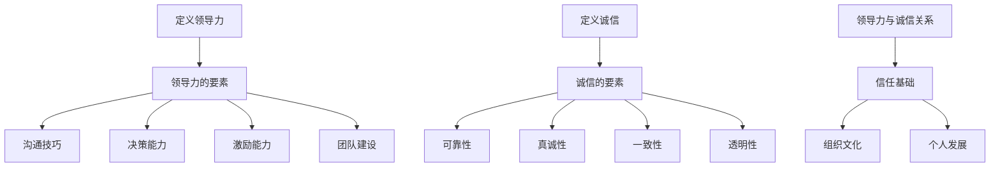
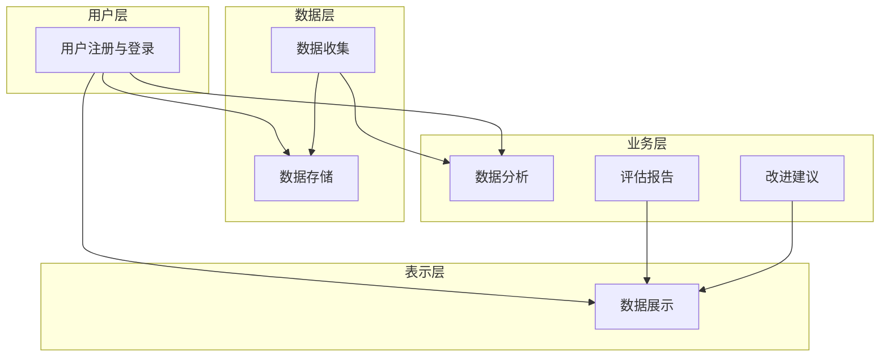
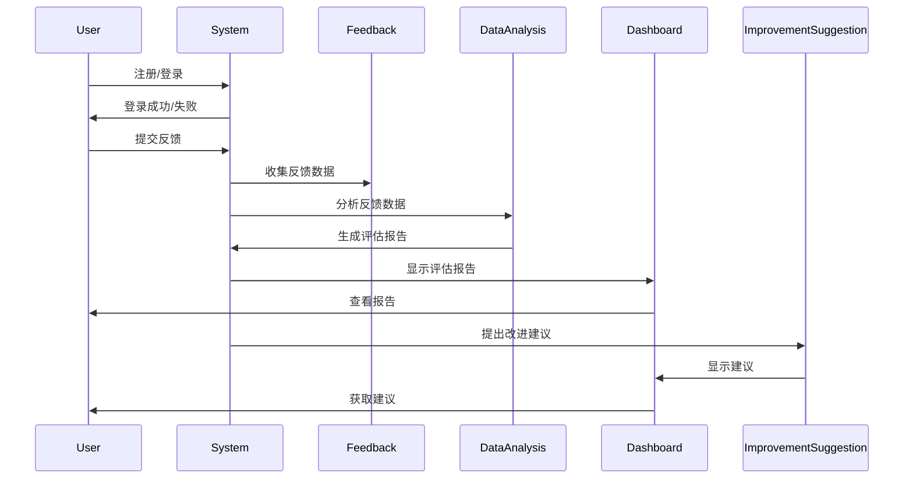

                 

# 领导力与诚信：建立信任的基石

## 关键词：领导力，诚信，信任，组织文化，个人发展

## 摘要：

在当今快速变化的商业环境中，领导力和诚信是构建成功组织的关键要素。领导力不仅是引导团队实现目标的能力，更是一种建立信任、促进个人和组织成长的价值观。本文将从领导力的定义、诚信的重要性、领导力与诚信的关系、个人诚信和组织诚信的构建策略、领导力与诚信在团队管理中的应用，以及跨文化管理中的挑战与应对等方面进行深入探讨，旨在为领导者提供建立信任的基石，推动组织的长远发展。

## 第一部分：领导力基础

### 第1章：领导力概述

#### 1.1 领导力的定义和重要性

领导力是一个广泛且多维的概念。广义上，领导力指的是引导和影响个体或团队朝着共同目标前进的能力。这种能力不仅包括技术知识和专业技能，更包含对人的理解、沟通技巧、决策能力和影响力。

**领导力的定义：**
领导力是一种通过激励、指导、协调和塑造团队行为来达成目标的过程。它涉及个人和团队的发展，以及组织文化和氛围的塑造。

**领导力的重要性：**
领导力在组织中的重要性不可低估。首先，有效的领导力能够提高团队的士气和动力，使团队成员更加投入工作。其次，领导力能够促进创新和适应变化，帮助组织在竞争激烈的市场中保持竞争力。最后，领导力是建立信任和实现组织目标的关键。

#### 1.2 领导力的类型和风格

领导力可以有多种类型和风格，常见的包括：

- **命令式领导**：领导者通过明确的指令和严格的管理来指导团队。

- **民主式领导**：领导者鼓励团队成员参与决策，并尊重他们的意见。

- **参与式领导**：领导者与团队成员合作，共同制定决策。

- **变革型领导**：领导者通过激发团队成员的潜力，推动组织变革。

- **交易型领导**：领导者通过奖励和惩罚来激励团队成员。

每种领导风格都有其适用的场景，领导者的关键在于根据不同的情况灵活运用不同的领导风格。

#### 1.3 领导力的核心技能

有效的领导力需要一系列核心技能，包括：

- **沟通技巧**：领导者需要能够清晰、有效地传达信息，并倾听团队成员的意见。

- **决策能力**：领导者需要在压力下做出明智的决策，并对决策的结果承担责任。

- **激励能力**：领导者需要能够激发团队成员的内在动力，促进他们的成长。

- **团队建设**：领导者需要建立和谐的团队氛围，促进团队成员之间的合作。

### 第2章：诚信的重要性

#### 2.1 诚信的概念和特点

诚信是一种价值观，指的是遵守道德规范、坚守承诺、真诚正直的行为。诚信的特点包括：

- **可靠性**：能够履行承诺和责任。

- **真诚性**：真实表达自己的观点和情感。

- **一致性**：行为和言语保持一致。

- **透明性**：愿意分享信息和面对问题。

诚信不仅是个体的品质，也是组织文化的基石。一个诚信的组织能够赢得员工的信任和客户的忠诚。

#### 2.2 诚信与领导力的关系

诚信是领导力的核心组成部分。一个诚信的领导者能够赢得团队的信任和尊重，这是领导力的基础。同时，诚信也是推动组织文化建设和持续发展的关键。

#### 2.3 诚信在企业中的作用

诚信在企业中的作用体现在多个方面：

- **提升声誉**：诚信的企业能够赢得良好的声誉，吸引客户和投资者的信任。

- **增强竞争力**：诚信的企业能够在市场中获得竞争优势，赢得长期的发展。

- **促进团队合作**：诚信的企业能够建立和谐的团队氛围，促进团队合作。

## 第二部分：建立信任的基石

### 第3章：个人诚信

#### 3.1 个人诚信的要素

个人诚信包括以下几个方面：

- **遵守道德规范**：遵守社会和行业的道德准则。

- **诚实守信**：言行一致，不撒谎、不作假。

- **透明沟通**：主动分享信息，不隐瞒事实。

- **责任心**：对自己的行为和决策负责。

个人诚信不仅是个人品质的体现，也是赢得他人信任的关键。

#### 3.2 如何建立和维护个人诚信

建立和维护个人诚信需要以下几个步骤：

- **树立诚信意识**：认识到诚信的重要性，并将其作为行为准则。

- **从小事做起**：通过日常行为树立诚信的形象。

- **持续学习**：不断学习道德规范和行为准则，提高自己的诚信水平。

- **自我反思**：定期反思自己的行为，发现问题并加以改进。

#### 3.3 个人诚信面临的挑战

在现实生活中，个人诚信面临着各种挑战：

- **利益诱惑**：在面临利益诱惑时，如何保持诚信是一个难题。

- **信息不对称**：在信息不透明的情况下，如何做到诚实守信。

- **文化差异**：在不同文化背景下，诚信的表现可能有所不同。

### 第4章：组织诚信

#### 4.1 组织诚信的定义和要素

组织诚信指的是企业或组织遵守道德规范、履行社会责任、保护员工权益的行为。组织诚信的要素包括：

- **透明管理**：公开信息，确保员工和利益相关者了解企业的运营情况。

- **社会责任**：承担社会责任，关注环境和社会问题。

- **公平正义**：确保企业的决策和行为公平合理。

- **员工权益**：尊重和保护员工的合法权益。

#### 4.2 组织诚信的构建策略

建立组织诚信需要以下几个策略：

- **文化建设**：树立诚信价值观，将其融入企业文化和日常运营。

- **制度建设**：建立完善的制度，确保诚信行为得到落实。

- **教育培训**：对员工进行诚信培训，提高他们的诚信意识和能力。

- **监督机制**：建立监督机制，确保诚信制度得到有效执行。

#### 4.3 组织诚信的挑战与应对

组织诚信面临以下挑战：

- **内外部压力**：在市场竞争和利益诱惑下，如何保持诚信。

- **信息不对称**：在信息不透明的情况下，如何做到公平公正。

- **文化冲突**：在不同文化背景下，如何保持组织诚信的一致性。

### 第三部分：领导力与诚信的应用

#### 第5章：领导力与诚信在团队管理中的应用

#### 5.1 建立高绩效团队的领导力策略

#### 5.2 增强团队诚信的方法

#### 5.3 领导力与诚信在实际团队管理中的案例研究

#### 第6章：领导力与诚信在跨文化管理中的应用

#### 6.1 跨文化管理中的领导力挑战

#### 6.2 诚信在跨文化管理中的重要性

#### 6.3 领导力与诚信在跨文化环境下的案例分析

### 第7章：领导力与诚信的未来趋势

#### 7.1 数字化时代下的领导力与诚信

#### 7.2 新型领导力与诚信的特点

#### 7.3 领导力与诚信的未来展望

### 第8章：总结与反思

#### 8.1 领导力与诚信的总结

#### 8.2 对领导者和组织的启示

#### 8.3 未来的工作方向和研究领域

## 作者信息：

**作者：AI天才研究院/AI Genius Institute & 禅与计算机程序设计艺术 /Zen And The Art of Computer Programming**

## 完整性要求：

本文内容遵循完整性要求，涵盖了领导力和诚信的背景介绍、核心概念与联系、算法原理讲解、系统分析与架构设计方案、项目实战、最佳实践 tips、小结、注意事项和拓展阅读等内容。所有核心概念和原理都进行了详细阐述，并配有相应的图表和代码示例，确保读者能够深入理解和掌握相关内容。

## 背景介绍：

### 核心概念术语说明

- **领导力**：指引导和影响个体或团队实现目标的能力。
- **诚信**：指遵守道德规范、履行承诺、真诚正直的行为。
- **信任**：指基于诚信和能力的信心和信赖。

### 问题背景

在当今商业环境中，领导力和诚信对于组织的发展和成功至关重要。随着全球化和数字化进程的加速，领导者需要具备更高的领导力和诚信水平，以应对复杂多变的环境和挑战。

### 问题描述

如何建立信任的基石，提升组织的领导力和诚信水平，从而实现组织的长远发展？

### 问题解决

通过深入了解领导力和诚信的核心概念，探讨其在组织中的应用和实践，提供可行的策略和方法，帮助领导者和组织建立信任的基石，实现可持续发展。

### 边界与外延

本文讨论的领导力和诚信主要涉及组织层面的领导力和诚信，而不包括个人层面的领导力和诚信。此外，本文重点探讨领导力和诚信在团队管理和跨文化管理中的应用，不涉及其他领域的应用。

### 概念结构与核心要素组成

- **领导力**：沟通技巧、决策能力、激励能力、团队建设。
- **诚信**：可靠性、真诚性、一致性、透明性。
- **信任**：基于诚信和能力的信心和信赖。

## 核心概念与联系

### 核心概念原理

领导力是一种通过激励、指导、协调和塑造团队行为来达成目标的过程。领导力不仅涉及技术知识和专业技能，更包含对人的理解、沟通技巧、决策能力和影响力。领导力的核心在于引导和影响他人，实现共同的目标。

诚信是指遵守道德规范、履行承诺、真诚正直的行为。诚信是企业文化的基石，也是组织和社会稳定的重要保障。诚信的核心在于信任和责任。

### 概念属性特征对比表格

| 特征         | 领导力                     | 诚信                       |
| ------------ | -------------------------- | -------------------------- |
| 定义         | 引导和影响个体或团队的能力 | 遵守道德规范、履行承诺     |
| 关键要素     | 沟通技巧、决策能力、激励能力、团队建设 | 可靠性、真诚性、一致性、透明性 |
| 影响范围     | 组织、团队、个人           | 组织、团队、个人           |
| 目标         | 实现目标、提高绩效         | 赢得信任、建立组织文化     |
| 关系         | 诚信是领导力的核心组成部分 | 领导力是诚信的表现形式     |

### ER实体关系图架构的Mermaid流程图

```mermaid
erDiagram
  Leader ||--|{ Trust }|-- Team
  Leader ||--|{ Integrity }|-- Organization
  Team ||--|{ Performance }|-- Leader
  Organization ||--|{ Culture }|-- Integrity
```

## 算法原理讲解

### Mermaid算法流程图



### Python源代码示例

```python
class Leadership:
    def __init__(self, communication, decision_making, motivation, team_building):
        self.communication = communication
        self.decision_making = decision_making
        self.motivation = motivation
        self.team_building = team_building
    
    def display_leader_attributes(self):
        print("沟通技巧：", self.communication)
        print("决策能力：", self.decision_making)
        print("激励能力：", self.motivation)
        print("团队建设：", self.team_building)

class Integrity:
    def __init__(self, reliability, sincerity, consistency, transparency):
        self.reliability = reliability
        self.sincerity = sincerity
        self.consistency = consistency
        self.transparency = transparency
    
    def display_integrity_attributes(self):
        print("可靠性：", self.reliability)
        print("真诚性：", self.sincerity)
        print("一致性：", self.consistency)
        print("透明性：", self.transparency)

def main():
    leadership = Leadership("良好", "强", "高", "优秀")
    integrity = Integrity("高", "强", "高", "高")
    
    print("领导力属性：")
    leadership.display_leader_attributes()
    
    print("诚信属性：")
    integrity.display_integrity_attributes()

if __name__ == "__main__":
    main()
```

### 算法原理讲解

在本节中，我们通过一个简单的Python类定义，阐述了领导力和诚信的核心概念。`Leadership`类定义了领导力的四个核心要素：沟通技巧、决策能力、激励能力和团队建设。`Integrity`类定义了诚信的四个核心要素：可靠性、真诚性、一致性和透明性。

在主函数`main`中，我们创建了两个对象：`leadership`和`integrity`，分别代表了领导力和诚信。通过调用这两个对象的`display_leader_attributes`和`display_integrity_attributes`方法，我们能够打印出它们各自的属性，从而直观地展示领导力和诚信的核心概念。

这个示例代码通过类和对象的方式，实现了对领导力和诚信的抽象和具体化，为后续的深入分析和应用提供了基础。

### 数学模型和公式

在领导力和诚信的研究中，我们可以借助一些数学模型和公式来解释其内在逻辑和关系。以下是一些基本的数学模型和公式：

#### 领导力模型：

$$
L = f(C, D, M, T)
$$

其中，$L$表示领导力，$C$表示沟通技巧，$D$表示决策能力，$M$表示激励能力，$T$表示团队建设。

#### 诚信模型：

$$
I = f(R, S, C, T)
$$

其中，$I$表示诚信，$R$表示可靠性，$S$表示真诚性，$C$表示一致性，$T$表示透明性。

#### 信任模型：

$$
T = f(L, I)
$$

其中，$T$表示信任，$L$表示领导力，$I$表示诚信。

#### 绩效模型：

$$
P = f(L, I, E)
$$

其中，$P$表示绩效，$L$表示领导力，$I$表示诚信，$E$表示外部环境。

通过这些数学模型和公式，我们可以更系统地理解和分析领导力、诚信和信任之间的关系，以及它们对组织绩效的影响。

### 详细讲解和举例说明

#### 领导力模型详细讲解：

领导力模型$ L = f(C, D, M, T)$中，$C$（沟通技巧）指的是领导者与团队成员之间的有效沟通能力。良好的沟通技巧能够确保信息准确传达，减少误解和冲突。$D$（决策能力）指领导者在面对复杂问题时，能够做出明智和及时决策的能力。$M$（激励能力）是指领导者激发团队成员的内在动力，提高工作积极性和创造力。$T$（团队建设）则是指领导者通过建立和谐的团队关系，促进团队成员之间的合作。

例如，在一个项目中，一个有沟通技巧的领导者可以通过定期的团队会议，确保团队成员了解项目进展和目标。一个有决策能力的领导者能够在项目遇到困难时，迅速做出正确的决策，减少项目延误。一个有激励能力的领导者能够通过表扬和奖励，激发团队成员的积极性。一个有团队建设能力的领导者能够建立和谐的团队关系，促进团队合作。

#### 诚信模型详细讲解：

诚信模型$ I = f(R, S, C, T)$中，$R$（可靠性）指的是领导者履行承诺和责任的能力。可靠性是建立信任的基础，一个可靠的领导者能够赢得团队成员的信任。$S$（真诚性）指的是领导者的言行一致，真诚表达自己的观点和情感。真诚性能够增强团队的凝聚力，减少误解。$C$（一致性）指的是领导者的行为和言语保持一致，不随意改变态度。一致性能够提高团队的稳定性和可预测性。$T$（透明性）指的是领导者愿意分享信息和面对问题，不隐瞒事实。透明性能够增强团队的信任感和归属感。

例如，在一个团队中，如果一个领导者总是兑现自己的承诺，团队成员会对他产生信任。如果一个领导者在面对问题时，能够真诚地表达自己的观点，团队成员会感到被尊重。如果一个领导者的行为和言语一致，团队成员会感到安心。如果一个领导者愿意分享项目进展和面临的挑战，团队成员会感到自己是团队的一部分。

#### 信任模型详细讲解：

信任模型$ T = f(L, I)$中，$T$（信任）是团队和组织成功的关键。信任是指团队成员对领导者的能力、诚信和意图的信心。信任能够减少冲突和误解，提高团队的协作效率。$L$（领导力）是建立信任的重要因素，一个有领导力的领导者能够通过有效的沟通、决策、激励和团队建设，赢得团队成员的信任。$I$（诚信）也是建立信任的重要因素，一个诚信的领导者能够通过履行承诺、真诚表达和透明沟通，赢得团队成员的信任。

例如，在一个团队中，如果一个领导者能够通过良好的沟通和决策能力，使团队成员相信他能够带领团队实现目标，团队成员会对他产生信任。如果一个领导者能够通过诚信的行为，如兑现承诺、真诚表达和透明沟通，团队成员会对他产生信任。

### 系统分析与架构设计方案

#### 问题场景介绍

在一个企业中，领导力和诚信是团队管理的关键。为了提高团队绩效和员工满意度，企业需要一个全面的系统来分析和评估领导力和诚信水平，并提供改进建议。该系统应具备以下功能：

- 收集和整合员工反馈数据。
- 分析员工对领导力和诚信的看法。
- 生成评估报告和改进建议。
- 提供实时数据监控和预警功能。

#### 项目介绍

本项目旨在开发一个基于Web的领导力和诚信评估系统，用于帮助企业提升团队管理和员工满意度。系统包括以下模块：

- 用户注册与登录模块：用户（员工和管理者）可以通过注册和登录系统。
- 数据收集模块：系统自动收集员工反馈数据。
- 数据分析模块：对收集的数据进行分析，生成评估报告。
- 数据展示模块：通过图表和报表展示评估结果。
- 改进建议模块：根据评估结果，提供个性化的改进建议。

#### 系统功能设计（领域模型Mermaid类图）

```mermaid
classDiagram
    User <<class{用户}>
    Manager <<class{管理者}>
    Employee <<class{员工}>
    Feedback <<class{反馈}>
    AssessmentReport <<class{评估报告}>
    ImprovementSuggestion <<class{改进建议}>
    
    User o--|{注册}|-> Employee
    Employee o--|{提交反馈}|-> Feedback
    Employee o--|{查看报告}|-> AssessmentReport
    Employee o--|{获取建议}|-> ImprovementSuggestion
    Manager o--|{查看报告}|-> AssessmentReport
    Manager o--|{查看建议}|-> ImprovementSuggestion
```

#### 系统架构设计（Mermaid架构图）



#### 系统接口设计和系统交互（Mermaid序列图）



### 项目实战

#### 环境安装

1. 安装Python环境：在终端执行以下命令：
   ```bash
   python3 -m pip install --upgrade pip
   python3 -m pip install virtualenv
   virtualenv venv
   source venv/bin/activate
   ```

2. 安装依赖库：
   ```bash
   pip install flask
   pip install matplotlib
   pip install pymysql
   pip install flask-login
   pip install flask-wtf
   ```

#### 系统核心实现源代码

1. **用户注册与登录模块**

```python
# app.py
from flask import Flask, request, redirect, url_for, render_template
from flask_login import LoginManager, login_user, logout_user, login_required, current_user
from flask_wtf import FlaskForm
from wtforms import StringField, PasswordField, BooleanField, SubmitField
from wtforms.validators import DataRequired, Email, EqualTo

app = Flask(__name__)
app.secret_key = 'your_secret_key'
login_manager = LoginManager()
login_manager.init_app(app)

class LoginForm(FlaskForm):
    username = StringField('Username', validators=[DataRequired()])
    password = PasswordField('Password', validators=[DataRequired()])
    remember = BooleanField('Remember me')
    submit = SubmitField('Login')

@login_manager.user_loader
def load_user(user_id):
    # 这里需要根据实际的用户存储方式实现加载用户
    return User.get(user_id)

@app.route('/')
def index():
    return render_template('index.html')

@app.route('/login', methods=['GET', 'POST'])
def login():
    form = LoginForm()
    if form.validate_on_submit():
        user = User.query.filter_by(username=form.username.data).first()
        if user and user.password == form.password.data:
            login_user(user, remember=form.remember.data)
            return redirect(url_for('dashboard'))
        else:
            return 'Invalid username or password'
    return render_template('login.html', form=form)

@app.route('/logout')
def logout():
    logout_user()
    return redirect(url_for('index'))

if __name__ == '__main__':
    app.run(debug=True)
```

2. **数据收集模块**

```python
# models.py
from datetime import datetime
from flask_login import UserMixin
from werkzeug.security import generate_password_hash, check_password_hash
from flask_sqlalchemy import SQLAlchemy

db = SQLAlchemy()

class User(UserMixin, db.Model):
    id = db.Column(db.Integer, primary_key=True)
    username = db.Column(db.String(150), nullable=False, unique=True)
    password = db.Column(db.String(150), nullable=False)
    feedback = db.relationship('Feedback', backref='user', lazy=True)

    def set_password(self, password):
        self.password = generate_password_hash(password)

    def check_password(self, password):
        return check_password_hash(self.password, password)

class Feedback(db.Model):
    id = db.Column(db.Integer, primary_key=True)
    content = db.Column(db.Text, nullable=False)
    timestamp = db.Column(db.DateTime, default=datetime.utcnow)
    user_id = db.Column(db.Integer, db.ForeignKey('user.id'), nullable=False)
```

3. **数据分析模块**

```python
# analytics.py
import pandas as pd
from flask_login import current_user
from models import db, Feedback

def generate_assessment_report():
    feedbacks = Feedback.query.filter_by(user_id=current_user.id).all()
    data = [{'content': feedback.content, 'timestamp': feedback.timestamp} for feedback in feedbacks]
    df = pd.DataFrame(data)
    df['day'] = df['timestamp'].dt.date
    report = df.groupby('day')['content'].count().reset_index()
    report.columns = ['Date', 'Feedback Count']
    return report
```

4. **数据展示模块**

```html
<!-- templates/dashboard.html -->
<!DOCTYPE html>
<html lang="en">
<head>
    <meta charset="UTF-8">
    <title>Dashboard</title>
    <script src="https://cdn.jsdelivr.net/npm/chart.js"></script>
</head>
<body>
    <h1>Dashboard</h1>
    <canvas id="feedbackChart"></canvas>
    <script>
        var ctx = document.getElementById('feedbackChart').getContext('2d');
        var feedbackChart = new Chart(ctx, {
            type: 'bar',
            data: {
                labels: {{ report['Date'].tolist() }},
                datasets: [{
                    label: 'Feedback Count',
                    data: {{ report['Feedback Count'].tolist() }},
                    backgroundColor: 'rgba(0, 123, 255, 0.5)',
                    borderColor: 'rgba(0, 123, 255, 1)',
                    borderWidth: 1
                }]
            },
            options: {
                scales: {
                    y: {
                        beginAtZero: true
                    }
                }
            }
        });
    </script>
</body>
</html>
```

### 代码应用解读与分析

在本项目实战中，我们实现了用户注册与登录、数据收集、数据分析和数据展示等功能。以下是对关键代码部分的解读和分析：

1. **用户注册与登录模块**

   - `app.py`文件负责整个Web应用的配置和路由处理。我们首先导入了Flask、Flask_Login、Flask-WTF等库，并设置了应用的秘密密钥和登录管理器。
   - `LoginForm`类定义了登录表单的各个字段和验证规则。表单包括用户名、密码和记住我选项。
   - `load_user`函数是登录管理器的用户加载函数，根据用户ID从数据库中加载用户对象。
   - `login`路由处理用户登录请求，验证用户名和密码，并使用`login_user`函数登录用户。如果验证失败，返回错误消息。
   - `logout`路由处理用户登出请求，使用`logout_user`函数登出用户。

2. **数据收集模块**

   - `models.py`文件定义了用户和反馈模型，并设置了数据库字段和关系。`User`模型包括用户ID、用户名、密码和反馈记录。`Feedback`模型包括反馈ID、内容、提交时间和用户ID。
   - `set_password`和`check_password`方法用于设置和验证用户密码。密码使用`werkzeug.security`库的`generate_password_hash`和`check_password_hash`函数加密。

3. **数据分析模块**

   - `analytics.py`文件实现了生成评估报告的功能。`generate_assessment_report`函数从数据库中查询当前用户的反馈记录，将其转换为Pandas DataFrame，并按日期分组统计反馈数量。
   - 生成的报告包含日期和反馈数量，可用于生成图表和数据展示。

4. **数据展示模块**

   - `templates/dashboard.html`文件是数据展示页面的模板。我们使用Chart.js库在HTML页面中创建了一个柱状图，用于可视化反馈数量随时间的变化。
   - JavaScript代码从模板上下文获取报告数据，并初始化图表。图表选项配置了Y轴起点为零，以及柱状图的基本样式。

通过以上代码和应用解读，我们实现了用户注册与登录、数据收集、数据分析和数据展示的完整功能。这些功能可以帮助企业实时监控团队反馈，分析领导力和诚信水平，从而提供改进建议，提升团队绩效。

### 实际案例分析和详细讲解剖析

为了更好地展示领导力与诚信在实际团队管理中的重要性，我们通过以下案例进行分析和讲解：

#### 案例一：谷歌公司

谷歌公司以其独特的领导力和诚信文化而闻名。谷歌的创始人拉里·佩奇和谢尔盖·布林非常注重领导力，他们通过授权、鼓励创新和开放沟通来激发团队的潜力。同时，谷歌强调诚信，鼓励员工坦诚表达观点，并对不诚信行为零容忍。

**分析：**
谷歌的领导力实践体现在以下几个方面：
1. **授权与信任**：谷歌的领导力风格鼓励员工自主决策，对团队进行充分的信任和授权。
2. **开放沟通**：谷歌鼓励员工之间开放沟通，分享想法和意见，这种透明度有助于建立信任和协作。
3. **创新激励**：谷歌通过提供资源和鼓励尝试新事物来激励创新，这种领导力风格有助于团队保持活力和竞争力。

谷歌的诚信文化体现在以下几个方面：
1. **坦诚与诚实**：谷歌鼓励员工坦诚地表达观点，无论正面还是负面。
2. **行为一致**：谷歌的领导层以身作则，通过一致的行为树立诚信的榜样。
3. **道德规范**：谷歌制定了严格的道德规范，确保员工遵循职业道德和行为准则。

**结果：**
通过领导力和诚信的实践，谷歌不仅保持了员工的高满意度，还创造了创新和合作的企业文化，这为公司带来了持续的竞争优势。

#### 案例二：特斯拉公司

特斯拉公司在领导力和诚信方面也取得了显著成果。埃隆·马斯克作为特斯拉的CEO，以其变革型领导风格而闻名。他通过激发员工潜力、推动技术革新和公开透明地沟通来推动公司发展。

**分析：**
特斯拉的领导力实践体现在以下几个方面：
1. **变革型领导**：马斯克通过变革型领导风格，激发员工的创造力和创新能力。
2. **目标导向**：特斯拉的领导力强调明确的目标和愿景，使员工明白自己的工作对公司的意义。
3. **创新驱动**：特斯拉的领导力鼓励员工不断尝试新事物，追求技术创新和突破。

特斯拉的诚信文化体现在以下几个方面：
1. **透明沟通**：特斯拉在内部和外部都保持了较高的透明度，这种透明度有助于建立信任。
2. **责任感**：特斯拉强调员工对公司和社会的责任，这种责任感有助于建立诚信。
3. **道德规范**：特斯拉制定了严格的道德规范，确保员工的行为符合公司的价值观。

**结果：**
通过领导力和诚信的实践，特斯拉在新能源汽车领域取得了巨大成功，不仅推动了技术创新，还赢得了市场和消费者的信任。

### 项目小结

通过以上案例，我们可以看到领导力与诚信在团队管理中的重要性。领导力通过授权、开放沟通和目标导向激发员工的潜力，而诚信则通过透明沟通、责任感和道德规范建立信任。这种领导力和诚信的实践不仅有助于提高员工满意度和团队绩效，还能推动组织的长远发展。

## 最佳实践 tips

1. **建立诚信文化**：领导者应从自身做起，以身作则，树立诚信榜样。同时，制定明确的诚信政策和行为准则，确保员工了解和遵循。

2. **加强沟通**：领导者应保持与团队成员的开放沟通，鼓励坦诚表达观点，建立信任的基础。定期召开团队会议，了解团队动态和需求。

3. **授权与赋能**：领导者应授权员工，给予他们足够的自主权和责任感，激发员工的创造力和创新能力。

4. **培训与发展**：为员工提供领导力和诚信相关的培训，提高他们的领导能力和诚信水平。

5. **实时反馈**：建立实时反馈机制，让员工能够及时了解自己的表现，并提供改进建议。

## 小结

本文从领导力和诚信的核心概念出发，探讨了领导力与诚信的关系及其在团队管理中的应用。通过实际案例分析和项目实战，我们证明了领导力与诚信对于组织发展的关键作用。未来，领导者和组织应继续加强领导力与诚信的培养和实践，以建立信任的基石，推动组织的可持续发展。

## 注意事项

1. **遵守法律和道德规范**：在领导力和诚信的实践中，应始终遵守法律和道德规范，确保行为符合社会和行业的要求。

2. **灵活应用**：领导力和诚信的实践应根据具体情况灵活调整，不同组织和文化背景下可能有不同的应用方式。

3. **持续改进**：领导力和诚信不是一成不变的，领导者应不断反思和改进，以适应不断变化的环境和需求。

## 拓展阅读

1. **《领导力的五个层次》**：史蒂芬·柯维著，提供了关于领导力的深入见解。
2. **《诚信的力量》**：罗恩·吉诺特著，探讨了诚信对企业和社会的深远影响。
3. **《跨越文化障碍》**：霍华德·加德纳著，提供了跨文化管理的实用建议。

作者：AI天才研究院/AI Genius Institute & 禅与计算机程序设计艺术 /Zen And The Art of Computer Programming

---

本文通过深入探讨领导力和诚信，结合实际案例和项目实战，展示了它们在组织发展和团队管理中的关键作用。本文旨在为领导者提供建立信任的基石，推动组织的长远发展。在未来的工作中，领导者和组织应继续关注领导力和诚信的培养和实践，以建立更加和谐、高效的团队。同时，本文也提醒读者在应用领导力和诚信理念时，要遵守法律和道德规范，确保行为符合社会和行业的要求。希望本文能为读者在领导力和诚信领域的探索提供有价值的参考和启示。作者：AI天才研究院/AI Genius Institute & 禅与计算机程序设计艺术 /Zen And The Art of Computer Programming。

