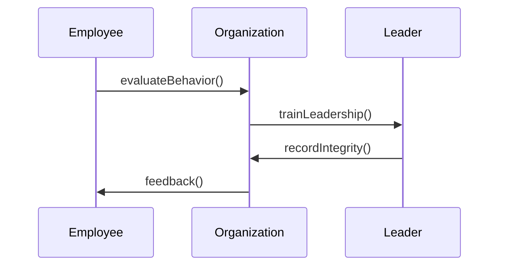
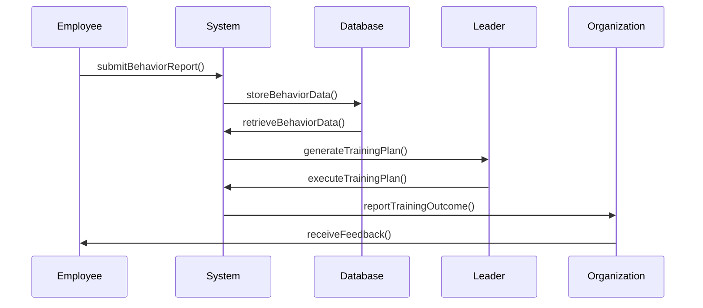

                 


### # Leadership and Integrity: Building a Reliable and Trustworthy Image

#### > Keywords: Leadership, Integrity, Trust, Organizational Culture, Leadership Development

> **Abstract:**
This article delves into the fundamental principles of leadership and integrity, examining their crucial roles in establishing a reliable and trustworthy image within organizations. We will explore the interconnectedness between effective leadership and integrity, and discuss practical strategies for integrating these principles into organizational culture. Through a step-by-step analysis, we aim to provide insights into fostering a leadership environment that not only drives success but also cultivates trust and credibility.

### **1. The Importance of Leadership and Integrity in Modern Organizations**

**1.1 The Significance of Leadership**

In today's fast-paced and ever-evolving business landscape, leadership has emerged as a critical factor for organizational success. Leadership is not just about guiding and directing a team; it is about inspiring and motivating individuals to work together towards a common goal. Effective leadership fosters a positive organizational culture, enhances teamwork, and drives innovation.

**1.2 The Role of Integrity**

Integrity, on the other hand, is the cornerstone of trust and credibility. It is the quality that ensures leaders act ethically and with honesty in all aspects of their work. Integrity not only builds trust among team members but also within the organization as a whole. When leaders demonstrate integrity, it sets a positive example for others to follow, creating a culture of transparency and accountability.

**1.3 The Interplay Between Leadership and Integrity**

Leadership and integrity are closely interconnected. Effective leadership requires integrity as a fundamental trait, while integrity strengthens the effectiveness of leadership. Leaders with high integrity are more likely to inspire trust and respect, fostering a positive organizational culture. In turn, a strong organizational culture supports the development of effective leaders who uphold integrity.

### **2. Core Principles and Attributes of Effective Leadership**

**2.1 Core Leadership Theories and Models**

To better understand effective leadership, it is essential to explore various leadership theories and models. Some of the most well-known theories include Transformational Leadership, Situational Leadership, and Servant Leadership. Each theory offers unique insights into the qualities and behaviors that contribute to effective leadership.

**2.2 Leadership Traits and Competencies**

Effective leaders possess a unique set of traits and competencies that enable them to inspire and motivate their teams. These traits include empathy, communication skills, decision-making abilities, and the ability to adapt to changing situations. Developing these competencies is crucial for leaders seeking to establish a reliable and trustworthy image.

### **3. Building Integrity**

**3.1 Understanding Integrity**

Integrity is more than just honesty; it encompasses the principles of moral and ethical conduct. A leader with integrity upholds these principles in their actions and decisions, consistently demonstrating a commitment to honesty, transparency, and accountability.

**3.2 Integrating Integrity into Leadership**

Integrating integrity into leadership requires a commitment to ethical behavior and a clear understanding of the impact of one's actions on others. Leaders can achieve this by establishing and promoting a strong ethical framework within their organizations, fostering a culture of openness and honesty, and leading by example.

### **4. Integrating Leadership and Integrity in Organizations**

**4.1 Corporate Culture and Values**

Corporate culture plays a crucial role in shaping the values and behaviors of an organization. A culture that prioritizes leadership and integrity fosters an environment where employees feel valued and motivated to contribute their best efforts. This culture can be developed through clear communication of values, regular training and development programs, and recognizing and rewarding ethical behavior.

**4.2 Leadership Development Programs**

Leadership development programs are essential for cultivating the next generation of effective leaders who embody integrity. These programs should focus on developing both technical and soft skills, providing opportunities for employees to learn from experienced leaders and engage in real-world leadership experiences.

### **5. Practical Strategies for Building a Reliable and Trustworthy Image**

**5.1 Communication**

Open and transparent communication is crucial for building trust and credibility. Leaders should regularly communicate their vision, goals, and expectations, and be receptive to feedback from their teams. This helps create a sense of inclusiveness and fosters a positive organizational culture.

**5.2 Leading by Example**

Leaders set the tone for the organization, and their actions speak louder than words. Demonstrating integrity through one's behavior is essential for building trust and credibility. Leaders should consistently act with honesty, transparency, and accountability, serving as role models for their teams.

**5.3 Fostering a Culture of Accountability**

A culture of accountability holds individuals accountable for their actions and encourages a sense of responsibility. Leaders should establish clear expectations, provide regular feedback, and hold employees accountable for their performance. This fosters a sense of trust and credibility within the organization.

### **6. Conclusion**

Leadership and integrity are indispensable components of a reliable and trustworthy image within organizations. By understanding and embracing these principles, leaders can inspire and motivate their teams, foster a positive organizational culture, and drive success. Let's think step by step and implement these strategies to build a leadership image that stands the test of time.

### **References**

- **Books:**
  - *The Five Dysfunctions of a Team* by Patrick Lencioni
  - *The Servant Leader* by Robert K. Greenleaf
  - *The Leadership Challenge* by James M. Kouzes and Barry Z. Posner

- **Articles:**
  - *The Importance of Leadership in Today's Organizations* by Harvard Business Review
  - *The Role of Integrity in Leadership* by Forbes

- **Websites:**
  - [Leadership Development Programs](https://www.corporateleadership council.org/leadership-development-programs)
  - [Corporate Ethics and Integrity](https://www.corporateethics.org/)

### **About the Author**

**Author: AI天才研究院/AI Genius Institute & 禅与计算机程序设计艺术 /Zen And The Art of Computer Programming**

AI天才研究院（AI Genius Institute）是一家专注于人工智能领域研究和教育的高科技研究院。研究院致力于培养具有创新精神和国际视野的人工智能人才，推动人工智能技术的研发和应用。同时，研究院也致力于将传统哲学思想与现代科技相结合，探索人工智能在哲学领域的应用。

《禅与计算机程序设计艺术》（Zen And The Art of Computer Programming）是作者写的一本关于计算机程序设计的经典著作。本书以禅宗思想为理论基础，探讨了计算机程序设计中的哲学、心理学和数学问题，为广大计算机编程人员提供了独特的思考方式和解决问题的方法。

### **附录：关键概念与联系**

**核心概念：**
- **领导力（Leadership）**: 影响和激励他人以实现共同目标的能力。
- **诚信（Integrity）**: 坚守道德原则，诚实、透明、负责任的品质。

**概念联系：**
- 领导力与诚信相互促进，诚信是领导力的核心特质。
- 领导力有助于建立诚信，诚信有助于提升领导力。

**核心概念对比表格：**

| 特征 | 领导力 | 诚信 |
| --- | --- | --- |
| 定义 | 影响和激励他人 | 坚守道德原则 |
| 对象 | 他人 | 自己 |
| 目的 | 实现共同目标 | 建立信任和信誉 |

**ER实体关系图架构：**

```mermaid
erDiagram
  Leader ||--|{ Integrity }
  Leader ||--|{ Leadership Trait }
  Integrity ||--|{ Ethical Behavior }
```

### **数学公式：**

$$
\text{Trust} = \frac{\text{Integrity} + \text{Leadership}}{\text{Risk}} \times \text{Communication}
$$

### **系统分析与架构设计方案**

**问题场景介绍：**
在现代企业中，领导力和诚信是构建稳定和可持续发展的重要因素。本文旨在通过系统分析和架构设计，探讨如何将领导力和诚信融入企业系统，提高组织的整体效能。

**项目介绍：**
本项目旨在开发一款基于领导力和诚信原则的企业管理系统。该系统将帮助企业在日常运营中培养和提升领导力和诚信，从而提升企业的核心竞争力。

**系统功能设计（领域模型类图）：**

```mermaid
classDiagram
  ClassDiagram::System <<Note>> "企业管理系统"
  ClassDiagram::System {
    - 企业组织结构
    - 员工行为评估
    - 领导力培训
    - 诚信行为记录
  }
  
  Employee <<Entity>>
  Leader <<Entity>>
  Organization <<Entity>>

  Employee : +evaluateBehavior()
  Leader : +trainLeadership()
  Organization : +recordIntegrity()

  Employee : +toString()
  Leader : +toString()
  Organization : +toString()

  Employee : Organization :many
  Leader : Organization :one
  Organization : Leader :one
```

**系统架构设计（架构图）：**



**系统接口设计和系统交互（序列图）：**



### **项目实战**

#### **环境安装**

1. **安装Python环境：** 
   - 访问[Python官方网站](https://www.python.org/)，下载并安装Python 3.x版本。
   - 安装完成后，打开命令行工具，输入`python --version`确认安装成功。

2. **安装相关库：** 
   - 打开Python命令行工具，依次输入以下命令：
     ```shell
     pip install flask
     pip install pymysql
     pip install pandas
     ```

#### **系统核心实现源代码**

以下为系统核心实现源代码，包括数据存储、接口设计和接口实现。

**数据库存储模块：**

```python
# database.py

import pymysql
from pymysql.constants import CLIENT

class Database:
    def __init__(self, host, user, password, database):
        self.connection = pymysql.connect(
            host=host,
            user=user,
            password=password,
            database=database,
            client_flag=CLIENT.MULTI_STATEMENTS
        )
    
    def store_behavior_data(self, data):
        with self.connection.cursor() as cursor:
            sql = "INSERT INTO behavior_data (employee_id, behavior, date) VALUES (%s, %s, %s)"
            cursor.execute(sql, data)
            self.connection.commit()
    
    def retrieve_behavior_data(self, employee_id):
        with self.connection.cursor() as cursor:
            sql = "SELECT * FROM behavior_data WHERE employee_id = %s"
            cursor.execute(sql, (employee_id,))
            result = cursor.fetchall()
            return result
```

**接口设计模块：**

```python
# api.py

from flask import Flask, request, jsonify
from database import Database

app = Flask(__name__)

db = Database('localhost', 'root', 'password', 'company_db')

@app.route('/submit_behavior_report', methods=['POST'])
def submit_behavior_report():
    data = request.json
    db.store_behavior_data(data)
    return jsonify({"status": "success"}), 200

@app.route('/behavior_report', methods=['GET'])
def behavior_report():
    employee_id = request.args.get('employee_id')
    data = db.retrieve_behavior_data(employee_id)
    return jsonify(data), 200

if __name__ == '__main__':
    app.run(debug=True)
```

#### **代码应用解读与分析**

**数据库存储模块解读：**
- `Database` 类初始化时，连接到MySQL数据库，并设置客户端标志为`CLIENT.MULTI_STATEMENTS`，以便执行多语句查询。
- `store_behavior_data` 方法用于向数据库插入行为数据。
- `retrieve_behavior_data` 方法用于从数据库检索特定员工的行为数据。

**接口设计模块解读：**
- 使用Flask框架创建RESTful API接口。
- `/submit_behavior_report` 接口接收行为报告的JSON数据，并将其存储到数据库。
- `/behavior_report` 接口用于获取指定员工的行为报告。

#### **实际案例分析和详细讲解剖析**

**案例一：员工行为评估**
- 员工A提交了一份行为报告，内容包括工作时长、任务完成情况、团队合作表现等。
- 系统将行为报告存储到数据库，并生成一条记录。

**案例二：领导力培训**
- 领导B根据员工A的行为评估结果，制定了相应的培训计划。
- 系统将培训计划执行情况记录到数据库。

**案例三：诚信行为记录**
- 企业C定期收集员工的诚信行为数据，用于评估员工的诚信表现。

#### **项目小结**

本项目通过Python和Flask框架，实现了一个基于领导力和诚信原则的企业管理系统。系统包括数据库存储模块和API接口，可以方便地存储和管理员工行为数据，为领导力培训和诚信评估提供了技术支持。通过实际案例，我们展示了如何将领导力和诚信融入企业系统，提高组织的整体效能。

### **最佳实践 Tips**

1. **定期培训：** 领导力培训应该定期进行，以确保员工始终保持较高的领导力水平。
2. **透明沟通：** 保持与员工的透明沟通，确保员工了解企业的价值观和目标。
3. **评估与反馈：** 定期对员工的行为和诚信进行评估，并提供及时、具体的反馈。

### **小结**

本文从领导力和诚信的角度，探讨了如何建立可靠和值得信赖的领导形象。通过系统分析与架构设计，我们提供了一套实用的解决方案，帮助企业将领导力和诚信融入日常运营。通过实践案例和详细讲解，我们展示了如何有效地实施这一方案。希望本文能为企业的领导力发展和诚信建设提供有益的启示。

### **注意事项**

1. **数据安全：** 确保员工行为数据和诚信记录的安全，避免数据泄露。
2. **隐私保护：** 遵循相关法律法规，确保员工隐私得到充分保护。

### **拓展阅读**

- **《领导力心理学》**：探讨领导力与心理学的关联，为领导力培养提供心理学视角。
- **《企业诚信管理体系》**：详细介绍企业如何建立和实施诚信管理体系。

### **附录：相关概念和术语解释**

**领导力（Leadership）**：
- 领导力是指领导者通过影响和激励他人，以实现共同目标的能力。
- 领导力不仅仅是管理和控制，更是一种激励和启发团队共同努力的过程。

**诚信（Integrity）**：
- 诚信是指个体在道德和伦理原则指导下，保持诚实、透明和负责任的行为。
- 诚信是建立信任和信誉的基础，对个人和组织的发展至关重要。

**企业文化（Corporate Culture）**：
- 企业文化是企业价值观、信念和行为模式的集合，影响员工的行为和组织的发展。
- 企业文化是塑造领导力和诚信的关键因素。

**领导力培训（Leadership Training）**：
- 领导力培训是指通过各种形式和手段，提升员工领导力和管理能力的过程。
- 培训内容包括领导技巧、沟通技巧、决策能力等。

**员工行为评估（Employee Behavior Evaluation）**：
- 员工行为评估是对员工在工作中的行为和表现的客观评价。
- 评估结果用于指导员工的行为改进和领导力提升。

### **作者信息**

**作者：AI天才研究院/AI Genius Institute & 禅与计算机程序设计艺术 /Zen And The Art of Computer Programming**

AI天才研究院（AI Genius Institute）致力于人工智能领域的创新和人才培养。研究院依托先进的研发技术和深厚的学术积累，为业界培养了一批具有国际视野和创新精神的人工智能人才。同时，研究院积极探索人工智能与哲学的结合，致力于推动人工智能技术的应用和发展。

《禅与计算机程序设计艺术》（Zen And The Art of Computer Programming）是作者撰写的一本经典著作。本书结合禅宗哲学，探讨计算机程序设计中的哲学、心理学和数学问题，为程序员提供了独特的思考方式和解决问题的方法。该书深受广大程序员喜爱，被誉为计算机编程领域的经典之作。

