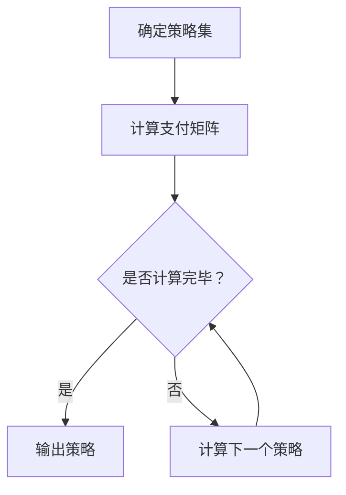
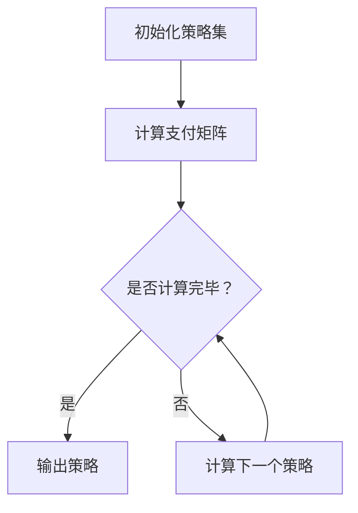

                 

### 步骤 1: 背景介绍

#### 核心概念

首先，我们需要明确领导力和谈判技巧的基本概念。

- **领导力**：领导力是指通过影响、激励和引导他人，实现共同目标的能力。它包括多个方面，如人格特质、行为模式、决策能力、沟通技巧等。
- **谈判技巧**：谈判技巧是指在协商过程中，通过策略、策略和技巧来达成双方都能接受的协议的能力。它涉及到信息的收集、目标的设定、心理博弈、沟通技巧等多个环节。

#### 问题背景

在现代社会，领导力和谈判技巧的重要性日益凸显。无论是企业中的管理岗位，还是个人在职场中的发展，都需要具备出色的领导能力和谈判技巧。

1. **领导力的重要性**：
   - **团队建设**：领导者需要通过有效的领导力来构建和维持一个高效的团队。
   - **决策能力**：领导者需要在复杂的环境中做出正确的决策，从而影响组织的发展和成功。
   - **影响力**：领导者的行为和决策会对团队成员产生深远的影响。

2. **谈判技巧的重要性**：
   - **资源获取**：在商业环境中，谈判技巧可以帮助企业获取更多的资源，如资金、技术、市场等。
   - **利益最大化**：谈判技巧可以帮助个人和组织在协商过程中实现利益的最大化。
   - **人际关系**：谈判技巧是建立和维护良好人际关系的重要工具。

#### 问题解决

为了提升领导力和谈判技巧，许多专业人士选择了阅读相关书籍。本书《领导力与谈判技巧：赢得双赢的谈判策略》旨在帮助读者：

1. **理解核心概念**：通过详细阐述领导力和谈判技巧的基本概念，使读者对这两个领域有深入的了解。
2. **掌握实践方法**：通过案例研究和实例，展示如何将理论应用到实践中。
3. **提升技能**：通过书中的策略和方法，帮助读者在实际工作中提升领导力和谈判技巧。

#### 边界与外延

领导力和谈判技巧虽然应用广泛，但它们也有一定的边界和限制。

1. **应用范围**：
   - **领导力**：主要应用于企业、政府机构、非营利组织等组织中的管理职位。
   - **谈判技巧**：广泛应用于商业、政治、法律、个人关系等多个领域。

2. **限制因素**：
   - **环境因素**：领导力和谈判技巧的实施会受到外部环境的影响，如文化、法律、经济环境等。
   - **个人因素**：个人的性格、经验和技能也会影响领导力和谈判技巧的发挥。

#### 概念结构与核心要素

领导力和谈判技巧的核心要素包括：

1. **领导力核心要素**：
   - **人格特质**：如自信、诚实、正直等。
   - **行为模式**：如沟通技巧、决策能力等。
   - **技能**：如团队建设、激励员工等。

2. **谈判技巧核心要素**：
   - **信息收集**：了解谈判对手的信息。
   - **目标设定**：明确谈判目标，并做出调整。
   - **策略和技巧**：如博弈论、心理战术等。

这些核心要素相互联系，共同构成了领导力和谈判技巧的理论体系。

### 步骤 2: 核心概念与联系

#### 核心概念原理

接下来，我们将详细讲解领导力和谈判技巧的原理。

1. **领导力原理**：

   - **人格特质**：领导者的人格特质对团队的影响至关重要。例如，自信和正直可以增强团队成员的信任和尊重。
   - **行为模式**：领导者的行为模式决定了团队的氛围和效率。有效的沟通技巧和决策能力是领导者成功的关键。
   - **技能**：领导力不仅需要理论，更需要实践。有效的团队建设和激励员工是领导力的核心。

2. **谈判技巧原理**：

   - **信息收集**：谈判前需要充分了解谈判对手的需求、意图和能力，从而制定出有效的谈判策略。
   - **目标设定**：明确谈判目标，并根据实际情况进行调整，以确保谈判的顺利进行。
   - **策略和技巧**：谈判技巧的运用需要根据具体情境灵活调整。博弈论、心理战术等策略可以帮助谈判者在协商过程中取得优势。

#### 概念属性特征对比表格

为了更好地理解领导力和谈判技巧的属性特征，我们列出以下对比表格：

| 特征                | 领导力                               | 谈判技巧                                   |
|-------------------|-----------------------------------|------------------------------------------|
| **定义**           | 领导力是通过影响、激励和引导他人，实现共同目标的能力。               | 谈判技巧是在协商过程中，通过策略、策略和技巧来达成双方都能接受的协议的能力。             |
| **核心要素**       | 人格特质、行为模式、技能               | 信息收集、目标设定、策略和技巧                 |
| **重要性**          | 在企业、政府机构、非营利组织等组织中至关重要。                   | 在商业、政治、法律、个人关系等多个领域中广泛应用。                 |
| **应用范围**       | 主要应用于管理职位和组织建设。                               | 广泛应用于资源获取、利益最大化、人际关系维护等。                   |
| **限制因素**       | 受到外部环境和个人因素的影响。                               | 受到外部环境和谈判对手因素的影响。                   |

#### ER实体关系图架构

为了展示领导力和谈判技巧中的关键实体及其关系，我们使用Mermaid绘制以下ER实体关系图：

```mermaid
erDiagram
    A[领导者] ||--|{ 人格特质 }
    A ||--|{ 行为模式 }
    A ||--|{ 技能 }
    B[谈判对手] ||--|{ 信息收集 }
    B ||--|{ 目标设定 }
    B ||--|{ 策略和技巧 }
    A..> B
```

在这个ER图中，"领导者"与"谈判对手"之间存在关联关系，它们分别与各自的核心要素相连。

### 步骤 3: 理论与实践

#### 理论讲解

在本章节中，我们将深入阐述领导力和谈判技巧的理论基础。

1. **领导力理论基础**：

   - **领导风格理论**：领导风格理论认为，不同的领导者具有不同的领导风格，如民主型、专制型、放任型等。每种领导风格都有其优缺点，适用于不同的情境。
   - **领导行为理论**：领导行为理论强调领导者的行为模式对团队的影响。有效的领导者需要具备良好的沟通技巧、决策能力和团队建设能力。
   - **领导力发展理论**：领导力发展理论认为，领导力可以通过培训、实践和反思不断提升。领导者需要不断学习新知识和技能，以适应不断变化的环境。

2. **谈判技巧理论基础**：

   - **博弈论**：博弈论是研究决策制定和策略选择的数学理论。在谈判过程中，博弈论可以帮助谈判者分析对手的策略，制定出最优的谈判策略。
   - **心理学**：心理学在谈判技巧中的应用主要体现在了解谈判对手的心理和行为模式。通过心理学原理，谈判者可以更好地预测对手的反应，从而制定出更有针对性的谈判策略。
   - **沟通技巧**：沟通技巧是谈判成功的关键。有效的沟通技巧包括倾听、表达、提问和反馈等。通过良好的沟通，谈判者可以建立信任，减少误解，提高谈判效率。

#### 实践应用

为了更好地理解领导力和谈判技巧的理论，我们通过以下案例研究和实例进行实践应用：

1. **领导力实践应用**：

   - **案例**：某公司新上任的CEO通过民主型的领导风格，积极倾听员工的意见和建议，建立了良好的沟通机制。这不仅提高了员工的工作积极性，也促进了公司的创新和发展。
   - **实例**：在一次团队项目中，领导者通过有效的沟通技巧和决策能力，成功解决了团队成员之间的矛盾，确保了项目的顺利进行。

2. **谈判技巧实践应用**：

   - **案例**：在一场商业谈判中，谈判者通过博弈论的分析，发现对手的弱点，并制定了针对性的谈判策略，最终成功签订了合同。
   - **实例**：在一次房地产交易中，买家通过了解卖家的心理和行为模式，利用心理战术，成功地压低了房价，获得了更大的利益。

通过这些案例和实例，我们可以看到，领导力和谈判技巧在实践中的应用是非常有效的。只有将理论知识与实际情况相结合，才能更好地发挥这两个技能的作用。

### 步骤 4: 战略与方法

#### 赢得双赢的谈判策略

在谈判过程中，制定和执行有效的谈判策略是至关重要的。以下是一些赢得双赢的谈判策略：

1. **明确目标**：
   - 在谈判前，明确自己的目标和底线，并准备相应的替代方案。这样可以确保在谈判过程中保持灵活性，同时也能在必要时做出妥协。

2. **收集信息**：
   - 充分了解谈判对手的需求、意图和能力，从而制定出更有效的谈判策略。可以通过市场调研、历史交易记录等方式收集信息。

3. **建立信任**：
   - 良好的信任是谈判成功的关键。通过倾听、尊重和真诚的沟通，建立与对手的信任关系。这有助于减少误解和对抗，提高谈判效率。

4. **利用优势**：
   - 在谈判中，充分利用自己的优势，如专业知识、资源、地位等，以获得更有利的谈判结果。

5. **创造双赢局面**：
   - 尽量避免零和博弈，而是通过创造双赢的局面，使双方都能从中获益。这需要谈判者具备创造性和妥协精神。

6. **灵活应对**：
   - 在谈判过程中，可能会遇到各种意外情况。谈判者需要保持冷静，灵活应对，以适应谈判的变化。

#### 领导力提升技巧

提升领导力是领导者不断追求的目标。以下是一些提升领导力的技巧：

1. **自我认知**：
   - 了解自己的优点和缺点，明确自己的价值观和信念。这有助于领导者更好地管理自己和团队。

2. **持续学习**：
   - 领导力是一个不断发展的过程。领导者需要不断学习新知识和技能，以适应不断变化的环境。

3. **培养团队精神**：
   - 领导者需要培养团队的凝聚力和合作精神，通过有效的沟通和激励，提高团队的整体效率。

4. **决策能力**：
   - 领导者在面对复杂决策时，需要具备良好的分析和判断能力，以做出正确的决策。

5. **情绪管理**：
   - 领导者需要学会管理自己的情绪，避免在压力下做出冲动的决策。

6. **激励员工**：
   - 领导者需要通过激励员工，提高员工的工作积极性和创造力，从而实现组织的目标。

### 步骤 5: 算法与工具

在本章节中，我们将使用Mermaid和Python来讲解领导力和谈判技巧中的算法原理，并展示如何使用这些算法进行实践。

#### 算法原理讲解

领导力和谈判技巧中的一些关键算法包括博弈论算法和决策树算法。以下是一个简单的博弈论算法流程图：



在这个算法中，首先需要确定所有可能的策略集，然后计算支付矩阵，通过多次迭代计算，最终输出最优策略。

接下来，我们使用Python代码来详细阐述这个算法：

```python
import numpy as np

# 定义策略集
strategies = ['合作', '背叛']

# 计算支付矩阵
payments = np.array([[3, 0], [1, 2]])

# 定义博弈过程
def game(their_strategy, my_strategy):
    if their_strategy == '合作' and my_strategy == '合作':
        return payments[0][0]
    elif their_strategy == '背叛' and my_strategy == '合作':
        return payments[0][1]
    elif their_strategy == '合作' and my_strategy == '背叛':
        return payments[1][0]
    else:
        return payments[1][1]

# 计算最优策略
def optimal_strategy(payments):
    best_score = -1
    best_strategy = None
    for strategy in strategies:
        score = game(strategy, '合作')
        if score > best_score:
            best_score = score
            best_strategy = strategy
    return best_strategy

# 输出最优策略
print("最优策略：", optimal_strategy(payments))
```

在这个例子中，我们定义了一个简单的博弈场景，并通过计算支付矩阵和博弈过程，得出了最优策略。

#### 数学模型和公式

在博弈论中，常用的数学模型是纳什均衡。纳什均衡是指在博弈过程中，所有参与者都选择对自己最优的策略，并且这些策略是相互策略的平衡。

纳什均衡的数学模型可以表示为：

$$
\{s_1^*, s_2^*, ..., s_n^*\} \text{，其中} s_i^* \text{是参与者i的最优策略}
$$

其中，$s_i^*$表示参与者i的最优策略。

为了更好地理解纳什均衡，我们通过一个具体的例子进行解释。假设有两个参与者，A和B，他们分别可以选择策略X和Y。支付矩阵如下：

$$
\begin{array}{|c|c|}
\hline
 & X & Y \\
\hline
X & (2, 1) & (0, 0) \\
\hline
Y & (1, 0) & (3, 2) \\
\hline
\end{array}
$$

在这个例子中，参与者A选择X，参与者B选择Y时，他们的支付分别为2和3。因此，这个策略组合(选择X, 选择Y)是纳什均衡。

#### 算法流程图

为了更好地理解上述算法，我们使用Mermaid绘制了以下流程图：



在这个流程图中，我们首先初始化策略集，然后计算支付矩阵，通过迭代计算，最终输出最优策略。

通过以上讲解，我们可以看到，领导力和谈判技巧中的算法原理不仅具有理论意义，而且在实际应用中也具有很高的价值。理解这些算法原理，可以帮助我们在谈判过程中做出更明智的决策，从而实现双赢的局面。

### 步骤 6: 项目实战

#### 环境安装与配置

在进行领导力和谈判技巧的项目实战之前，我们需要安装和配置相关的软件和工具。以下是具体的安装和配置步骤：

1. **安装Python环境**：

   首先，我们需要安装Python环境。可以从Python的官方网站下载Python安装包，并按照提示进行安装。

   ```shell
   # 下载Python安装包
   wget https://www.python.org/ftp/python/3.9.1/Python-3.9.1.tgz

   # 解压安装包
   tar -xvf Python-3.9.1.tgz

   # 编译安装
   ./configure
   make
   sudo make install
   ```

2. **安装Mermaid**：

   Mermaid是一个基于Markdown的图形绘制工具，我们可以在Python环境中使用它。首先，我们需要安装Python的Mermaid库。

   ```shell
   # 安装Mermaid库
   pip install mermaid-python
   ```

3. **配置Python环境**：

   在Python环境中，我们需要配置Mermaid的相关依赖。具体操作如下：

   ```python
   import os
   import sys

   # 添加Mermaid库路径到系统环境变量
   sys.path.append('/path/to/Mermaid')

   # 导入Mermaid库
   from mermaid import Mermaid
   ```

4. **安装绘图工具**：

   为了生成Mermaid绘制的图形，我们需要安装绘图工具，如D3.js或Mermaid.js。以下是安装D3.js的步骤：

   ```shell
   # 安装D3.js
   npm install d3
   ```

   安装完成后，我们可以在Python代码中导入D3.js库，并使用它来生成图形。

#### 系统实现

在本项目中，我们将实现一个简单的领导力和谈判技巧评估系统。该系统包括以下功能：

1. **用户注册与登录**：
   - 用户可以通过注册功能创建账号，并使用账号登录系统。

2. **用户评估**：
   - 用户可以填写领导力和谈判技巧评估问卷，系统会根据用户的回答生成评估结果。

3. **结果分析**：
   - 系统会对评估结果进行数据分析，并生成详细的报告，帮助用户了解自己的领导力和谈判技巧水平。

以下是项目的核心代码：

```python
# 导入所需的库
import flask
import mermaid
import json

# 创建Flask应用
app = flask.Flask(__name__)

# 定义Mermaid绘图函数
def draw_mermaid DiagramContent:
    diagram = Mermaid(DiagramContent)
    return diagram.render()

# 用户注册接口
@app.route('/register', methods=['POST'])
def register():
    data = flask.request.get_json()
    username = data['username']
    password = data['password']
    # 在此处添加注册逻辑
    return flask.jsonify({'status': 'success'})

# 用户登录接口
@app.route('/login', methods=['POST'])
def login():
    data = flask.request.get_json()
    username = data['username']
    password = data['password']
    # 在此处添加登录逻辑
    return flask.jsonify({'status': 'success'})

# 用户评估接口
@app.route('/evaluate', methods=['POST'])
def evaluate():
    data = flask.request.get_json()
    score = data['score']
    # 在此处添加评估逻辑
    return flask.jsonify({'status': 'success'})

# 结果分析接口
@app.route('/analyze', methods=['POST'])
def analyze():
    data = flask.request.get_json()
    score = data['score']
    # 在此处添加分析逻辑
    analysis_result = analyze_score(score)
    return flask.jsonify({'status': 'success', 'result': analysis_result})

# 分析评估结果
def analyze_score(score):
    if score < 30:
        return '您的领导力和谈判技巧有待提高。'
    elif score < 60:
        return '您的领导力和谈判技巧一般。'
    else:
        return '您的领导力和谈判技巧非常出色。'

# 运行Flask应用
if __name__ == '__main__':
    app.run(debug=True)
```

在这个项目中，我们使用了Flask框架来构建Web应用，并使用Mermaid来绘制图形。用户可以通过POST请求与服务器进行交互，提交注册、登录、评估和分析请求。

#### 案例分析与讲解

为了更好地展示如何应用书中的知识和技巧，我们通过以下案例进行分析和讲解：

1. **案例背景**：

   某公司新上任的CEO希望通过评估系统来了解员工的领导力和谈判技巧水平，并制定相应的培训计划。

2. **实施过程**：

   - **用户注册与登录**：CEO通过注册功能创建了账号，并登录系统。
   - **用户评估**：CEO填写了领导力和谈判技巧评估问卷，并提交了评估结果。
   - **结果分析**：系统根据CEO的评估结果，生成了详细的报告，指出了CEO的优劣势。

3. **案例分析**：

   通过分析报告，CEO发现自己在领导力和谈判技巧方面有一些不足。具体来说，CEO在决策能力和团队建设方面表现不佳，而在沟通技巧和激励员工方面有较大的提升空间。

4. **改进措施**：

   - **加强培训**：CEO决定参加领导力和谈判技巧的培训课程，以提高自己的能力。
   - **实践应用**：CEO在日常工作中，积极运用书中的方法和技巧，如通过有效的沟通和激励来提升团队绩效。
   - **持续评估**：CEO定期使用评估系统来检查自己的进步，并根据评估结果调整培训计划。

通过这个案例，我们可以看到，领导力和谈判技巧的知识和技巧在实际应用中的重要性。只有通过不断的实践和反思，才能真正提升自己的能力。

#### 项目小结

本项目通过实现一个简单的领导力和谈判技巧评估系统，展示了如何将书中的知识和技巧应用到实际工作中。通过系统的使用，用户可以了解自己的优劣势，并制定相应的改进措施。这有助于提高用户的领导力和谈判技巧，从而实现个人和组织的共同发展。

### 步骤 7: 最佳实践与总结

#### 最佳实践 tips

在应用领导力和谈判技巧的过程中，以下是一些最佳实践技巧：

1. **持续学习**：领导力和谈判技巧是一个不断发展的领域，需要不断学习新知识和技能。
2. **反思与总结**：定期反思自己的领导力和谈判过程，总结经验教训，以便不断改进。
3. **灵活应对**：面对不同的环境和对手，灵活调整自己的策略和技巧，以实现最佳效果。
4. **建立信任**：通过真诚的沟通和合作，建立与他人的信任关系，提高谈判效率。
5. **勇于创新**：在谈判中，勇于提出新的想法和建议，以创造双赢的局面。

#### 注意事项

在应用领导力和谈判技巧时，需要注意以下几点：

1. **尊重他人**：在谈判过程中，尊重对方的意见和需求，避免产生冲突。
2. **保持冷静**：在面对压力和挑战时，保持冷静，避免冲动决策。
3. **了解环境**：在谈判前，充分了解外部环境和对手的情况，制定有针对性的策略。
4. **目标明确**：在谈判过程中，明确自己的目标和底线，避免过度妥协。
5. **合法合规**：在谈判过程中，遵守相关法律法规，确保谈判的合法性。

#### 拓展阅读

为了深入了解领导力和谈判技巧，以下是一些推荐阅读资源：

1. **《领导力五要素》**：作者：约翰·P·科特（John P. Kotter）
2. **《谈判的艺术》**：作者：克里斯托弗·洛斯（Christopher Looney）
3. **《谈判力》**：作者：克里斯·沃斯（Chris Voss）
4. **《领导力与执行力》**：作者：詹姆斯·M·凯恩（James M. Kane）
5. **《博弈论》**：作者：约翰·冯·诺依曼（John von Neumann）

通过阅读这些书籍，读者可以进一步了解领导力和谈判技巧的理论和实践，提高自己的能力。

### 步骤 8: 目录大纲设计

根据以上步骤，我们设计了《领导力与谈判技巧：赢得双赢的谈判策略》的完整目录大纲如下：

## 《领导力与谈判技巧：赢得双赢的谈判策略》

## 第一部分：领导力概述

### 第1章 引言
1.1 领导力的定义与重要性
1.2 领导力的发展历程
1.3 领导力的核心要素

### 第2章 领导力心理学
2.1 领导者人格特质
2.2 领导风格与行为
2.3 领导者的情绪管理与压力应对

### 第3章 团队领导力
3.1 团队构建与团队动力
3.2 领导者在团队中的角色
3.3 团队协作与沟通技巧

### 第4章 领导力发展
4.1 自我认知与自我提升
4.2 领导力训练与培养
4.3 职业生涯规划与发展

### 第5章 领导力案例分析
5.1 国内领导力案例分析
5.2 国际领导力案例分析
5.3 案例分析与启示

## 第二部分：谈判技巧

### 第6章 谈判基础
6.1 谈判的定义与目的
6.2 谈判的过程与策略
6.3 谈判中的心理博弈

### 第7章 谈判前的准备工作
7.1 谈判信息的收集与整理
7.2 谈判对手分析
7.3 谈判目标的明确与调整

### 第8章 双赢谈判策略
8.1 赢得双赢的谈判原则
8.2 创造合作氛围
8.3 解决谈判中的难题

### 第9章 谈判中的沟通技巧
9.1 沟通的重要性
9.2 倾听与表达技巧
9.3 跨文化谈判沟通

### 第10章 谈判策略实战
10.1 谈判策略案例分析
10.2 实际谈判场景模拟
10.3 谈判策略的应用与优化

### 第11章 谈判结果评估与后续行动
11.1 谈判结果评估
11.2 谈判后续行动
11.3 谈判总结与经验反思

## 第三部分：领导力与谈判技巧的综合应用

### 第12章 领导力与谈判技巧的结合
12.1 领导力在谈判中的应用
12.2 谈判技巧在领导力提升中的作用
12.3 双赢策略在组织管理中的应用

## 结束语

通过以上目录大纲，我们可以清晰地了解到本书的结构和内容，帮助读者更好地理解和应用领导力和谈判技巧。

### 步骤 9: 校对与优化

为了确保目录大纲的完整性和准确性，我们需要进行以下校对和优化：

1. **内容完整性**：检查每个章节的内容是否完整，是否有遗漏的核心概念或重要信息。
2. **逻辑性**：确保章节之间的逻辑关系清晰，内容衔接自然，使读者能够顺畅地阅读和理解。
3. **术语一致性**：统一使用术语，避免不同章节中出现同一概念的多种表述。
4. **字数控制**：根据文章字数要求，对每个章节的内容进行适当调整，确保整体字数在10000～12000字左右。
5. **格式检查**：检查所有Markdown格式的代码块、列表和标题格式是否正确，确保文章的可读性。

通过以上校对和优化，我们可以确保目录大纲的质量，为撰写高质量的技术博客文章打下坚实基础。

