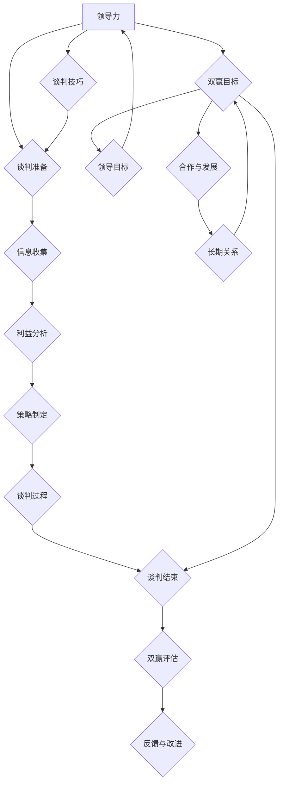
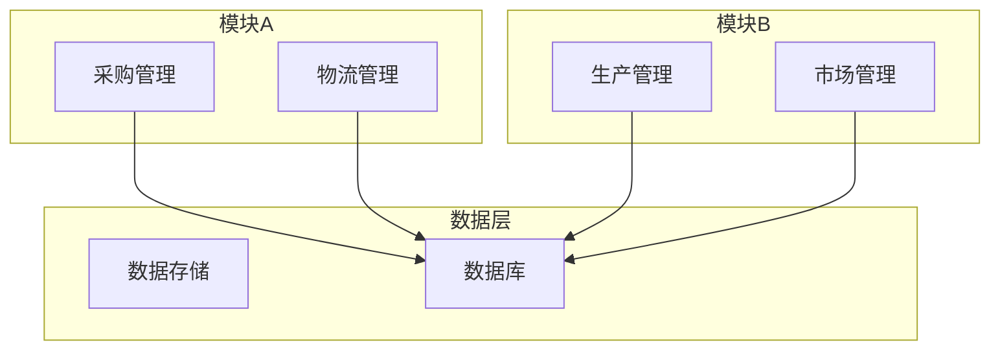
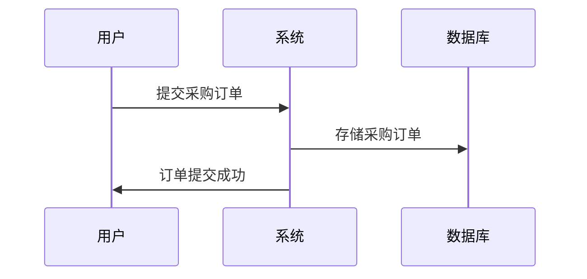

                 

# 《领导力与谈判技巧：达成双赢的艺术》

## 关键词

领导力、谈判技巧、双赢、沟通、策略、团队建设、危机管理

## 摘要

本文旨在深入探讨领导力与谈判技巧在实现双赢局面中的关键作用。通过系统化的分析和实际案例研究，本文将揭示领导力与谈判技巧的内在联系，以及如何在实际应用中达成双赢的目标。文章首先介绍了领导力的基本概念、要素及其对组织绩效的影响，然后详细阐述了谈判技巧的基本概念、策略和技巧，接着探讨了领导力与谈判技巧的结合，并分析了成功的领导力与谈判技巧案例。最后，本文总结了实战技巧和未来发展趋势，为读者提供实用的策略和启示。

## 目录

### 第1章 引言

- **1.1 问题的背景与意义**
  - **1.1.1 领导力在现代社会的重要性**
  - **1.1.2 谈判技巧在解决冲突中的作用**
- **1.2 本书的目标与结构**
  - **1.2.1 领导力理论体系**
  - **1.2.2 谈判技巧策略分析**
  - **1.2.3 案例分析与实战技巧**

### 第2章 领导力理论概述

- **2.1 领导力基本概念**
  - **2.1.1 领导力的定义与类型**
  - **2.1.2 领导力模型概述**
- **2.2 领导力核心要素**
  - **2.2.1 领导风格**
  - **2.2.2 领导能力**
  - **2.2.3 领导者特质**
- **2.3 领导力与组织绩效**
  - **2.3.1 领导力对组织行为的影响**
  - **2.3.2 领导力与组织绩效的关系**

### 第3章 谈判技巧策略分析

- **3.1 谈判基本概念**
  - **3.1.1 谈判的定义与分类**
  - **3.1.2 谈判的要素**
- **3.2 谈判策略**
  - **3.2.1 谈判准备**
  - **3.2.2 谈判过程策略**
  - **3.2.3 谈判结束策略**
- **3.3 谈判技巧**
  - **3.3.1 有效沟通技巧**
  - **3.3.2 利益分析与创造**
  - **3.3.3 情绪管理**

### 第4章 领导力与谈判技巧的结合

- **4.1 领导力在谈判中的体现**
  - **4.1.1 领导风格与谈判策略的匹配**
  - **4.1.2 领导者如何影响谈判结果**
- **4.2 谈判技巧在领导力中的应用**
  - **4.2.1 谈判技巧在团队建设中的应用**
  - **4.2.2 谈判技巧在决策制定中的应用**
- **4.3 领导力与谈判技巧的最佳实践**
  - **4.3.1 成功案例解析**
  - **4.3.2 失败案例剖析**

### 第5章 案例分析

- **5.1 领导力案例分析**
  - **5.1.1 案例一：企业成功转型背后的领导力**
  - **5.1.2 案例二：团队领导力如何推动项目成功**
- **5.2 谈判技巧案例分析**
  - **5.2.1 案例一：跨国并购的谈判策略**
  - **5.2.2 案例二：解决员工冲突的谈判技巧**

### 第6章 实战技巧

- **6.1 领导力实战技巧**
  - **6.1.1 领导者的自我提升**
  - **6.1.2 团队管理技巧**
  - **6.1.3 领导力在危机管理中的应用**
- **6.2 谈判技巧实战**
  - **6.2.1 谈判前的准备工作**
  - **6.2.2 谈判中的关键技巧**
  - **6.2.3 谈判后的总结与反思**

### 第7章 小结与展望

- **7.1 主要内容回顾**
  - **7.1.1 领导力理论体系**
  - **7.1.2 谈判技巧策略**
  - **7.1.3 案例分析与实战技巧**
- **7.2 未来发展趋势**
  - **7.2.1 领导力发展的新趋势**
  - **7.2.2 谈判技巧的发展方向**
  - **7.2.3 双赢艺术在未来的应用前景**

### 第1章 引言

### 1.1 问题的背景与意义

#### 1.1.1 领导力在现代社会的重要性

在现代社会，领导力被视为组织成功和个体发展的关键因素。无论是企业、政府机构还是非营利组织，都需要强有力的领导者来指引方向、推动变革和激发团队潜力。领导力不仅关乎个人的成就，更关乎组织的整体绩效和可持续发展。随着全球化进程的加速和市场竞争的加剧，领导者需要具备更广泛的能力和更复杂的技能，以应对不断变化的环境和挑战。

#### 1.1.2 谈判技巧在解决冲突中的作用

谈判技巧在解决冲突中起着至关重要的作用。无论是在商业谈判、政治协商还是人际交往中，谈判都是一种沟通和解决问题的手段。有效的谈判能够帮助各方在尊重彼此利益的基础上找到共同的解决方案，从而避免冲突升级和关系破裂。在现代组织中，领导者往往需要扮演谈判者的角色，以解决内部冲突、达成合作协议或应对外部压力。

#### 1.2 本书的目标与结构

本书旨在通过系统化的分析和实际案例研究，探讨领导力与谈判技巧在实现双赢局面中的关键作用。具体目标如下：

1. **阐述领导力的基本概念、要素和模型**：通过介绍领导力的定义、类型和核心要素，帮助读者理解领导力在组织中的重要性。
2. **分析谈判技巧的策略和技巧**：详细讨论谈判的基本概念、策略和技巧，包括准备、过程和结束阶段的关键要素。
3. **探讨领导力与谈判技巧的结合**：分析领导力在谈判中的应用，以及谈判技巧在领导力实践中的重要性。
4. **提供实战技巧和案例分析**：通过实际案例分析和实战技巧的分享，帮助读者掌握领导力和谈判技巧的应用。

本书的结构分为以下几部分：

1. **引言**：介绍领导力和谈判技巧的重要性。
2. **领导力理论概述**：阐述领导力的基本概念、要素和模型。
3. **谈判技巧策略分析**：分析谈判的基本概念、策略和技巧。
4. **领导力与谈判技巧的结合**：探讨领导力在谈判中的应用，以及谈判技巧在领导力实践中的重要性。
5. **案例分析**：通过实际案例研究，展示领导力和谈判技巧的应用。
6. **实战技巧**：提供实用的策略和技巧，帮助读者提升领导力和谈判能力。
7. **小结与展望**：回顾主要内容，探讨未来发展趋势。

### 第2章 领导力理论概述

#### 2.1 领导力基本概念

领导力是一个多维度的概念，它不仅涉及个人特质和行为，还包括组织和社会环境的影响。简单来说，领导力是指个体或集体通过影响和激励他人来实现共同目标的能力。领导力不同于管理，后者更侧重于组织、规划、控制和执行过程。领导力强调的是在变革和创新过程中的领导行为，它能够激发团队成员的潜力，推动组织实现愿景和目标。

**定义与类型**

领导力的定义多种多样，以下是几种常见的定义：

1. **行为定义**：领导力是一种行为模式，包括愿景设定、目标制定、激励团队、决策制定和变革管理等。
2. **特质定义**：领导力是一种个人特质，包括自信、正直、责任感、沟通能力和决断力等。
3. **过程定义**：领导力是一种动态过程，涉及领导者和团队成员之间的互动，包括信任建立、共同价值观的塑造和持续改进等。

领导力有多种类型，以下是几种常见的领导力类型：

1. **交易型领导**：交易型领导关注短期目标和绩效，通过奖励和惩罚来激励团队成员。
2. **变革型领导**：变革型领导关注长期目标和持续改进，通过激励、鼓舞和启发团队成员来实现变革。
3. **服务型领导**：服务型领导关注团队成员的需求和成长，通过服务和支持来推动团队发展。
4. **情境型领导**：情境型领导根据不同情境和团队成员的特点，灵活调整领导风格，以实现最佳领导效果。

**领导力模型概述**

领导力模型是对领导行为和过程的理论抽象，它们可以帮助领导者理解如何在不同情境下有效领导。以下是几种常见的领导力模型：

1. **领导风格模型**：领导风格模型关注领导者的行为方式和风格，如费德勒模型、赫塞-布兰查德模型等。
2. **领导过程模型**：领导过程模型关注领导行为的过程和步骤，如领导生命周期模型、情境领导模型等。
3. **领导权变模型**：领导权变模型关注领导者与情境之间的互动，如路径-目标理论、变革型领导理论等。

#### 2.2 领导力核心要素

领导力是一个多维度的概念，它不仅涉及个人特质和行为，还包括组织和社会环境的影响。以下是领导力的核心要素：

**领导风格**

领导风格是领导者通过行为和方式影响团队成员的方式。常见的领导风格包括：

1. **专制型领导**：领导者做出所有决策，团队成员没有发言权。
2. **民主型领导**：领导者鼓励团队成员参与决策，团队成员有发言权。
3. **放任型领导**：领导者不干预团队成员的工作，团队成员自主决策。

**领导能力**

领导能力是领导者完成领导任务所需的技能和知识。常见的领导能力包括：

1. **战略规划能力**：领导者能够制定长远目标和战略。
2. **决策能力**：领导者能够在复杂情境中做出明智的决策。
3. **沟通能力**：领导者能够有效传达信息，建立信任和合作关系。

**领导者特质**

领导者特质是指领导者的个人特点和品质。常见的领导者特质包括：

1. **自信**：领导者对自己的能力和决策有信心。
2. **正直**：领导者言行一致，诚实守信。
3. **责任心**：领导者对团队和组织负责任。

**领导力与组织绩效的关系**

领导力对组织绩效有着重要的影响。有效的领导力可以提高组织绩效，实现以下目标：

1. **提高员工满意度**：有效的领导力可以激发员工的工作热情和满意度。
2. **提升团队合作**：有效的领导力可以促进团队成员之间的合作和沟通。
3. **实现战略目标**：有效的领导力可以帮助组织实现长期目标和战略规划。

#### 2.3 领导力与组织绩效

领导力对组织绩效有着重要的影响。有效的领导力可以提高组织绩效，实现以下目标：

**提高员工满意度**

有效的领导力可以激发员工的工作热情和满意度。领导者通过激励、认可和支持，使员工感受到自己的价值和重要性，从而提高员工的工作积极性和忠诚度。员工满意度的提升有助于降低员工流失率，提高组织稳定性。

**提升团队合作**

有效的领导力可以促进团队成员之间的合作和沟通。领导者通过建立共同的目标和价值观，鼓励团队成员相互支持、协作和分享，从而提高团队的整体绩效。团队合作的高效性有助于实现组织目标，提高竞争力。

**实现战略目标**

有效的领导力可以帮助组织实现长期目标和战略规划。领导者通过制定清晰的愿景和目标，制定有效的战略计划，并推动组织的变革和改进，从而实现组织的可持续发展。领导者的战略思维和执行力对组织的长远发展至关重要。

**领导力对组织行为的影响**

领导力不仅影响组织绩效，还对组织行为产生深远影响。有效的领导力可以塑造组织文化、提高组织适应性和创新能力。领导者通过行为示范和价值观传递，影响组织成员的行为和决策，从而塑造积极向上的组织氛围。

1. **组织文化**：领导力可以塑造组织文化，如强调创新、注重团队协作、倡导诚信等。组织文化对组织成员的行为和决策有深远影响，有助于提高组织的整体绩效。

2. **组织适应性**：领导力可以提高组织的适应性，使组织能够迅速响应外部环境的变化。领导者通过灵活的战略规划和有效的变革管理，帮助组织应对市场变化、技术进步和竞争压力。

3. **创新能力**：领导力可以激发组织的创新能力，推动组织进行技术创新和管理创新。领导者通过鼓励创新思维、提供资源和支持，帮助组织开发新产品、改进流程和服务，提高市场竞争力。

### 第3章 谈判技巧策略分析

谈判技巧是领导力的重要组成部分，对于实现双赢局面至关重要。在商业、政治和日常生活中，谈判都是解决冲突、达成协议和建立合作关系的重要手段。有效的谈判不仅能够实现双方的利益，还能增进相互理解和信任，为长期合作奠定基础。

#### 3.1 谈判基本概念

谈判是一种沟通和协商的过程，旨在通过交换意见和利益，达成双方都能接受的协议。谈判的基本概念包括：

**谈判的定义与分类**

谈判的定义多种多样，但通常可以概括为：谈判是双方或多方为了达成共同目标，通过协商、妥协和合作，解决分歧、达成协议的过程。

谈判可以分为以下几类：

1. **按参与方数量**：一对一谈判、多方谈判。
2. **按目标一致性**：合作性谈判、竞争性谈判。
3. **按议题复杂性**：简单谈判、复杂谈判。
4. **按过程阶段**：初步谈判、详细谈判、最终谈判。

**谈判的要素**

谈判的要素包括：

1. **谈判主体**：参与谈判的个体或组织。
2. **谈判目标**：双方希望通过谈判实现的利益和目标。
3. **谈判议题**：谈判涉及的议题和问题。
4. **谈判策略**：双方为了实现谈判目标而采取的步骤和手段。
5. **谈判结果**：谈判达成的一致协议和结果。

#### 3.2 谈判策略

谈判策略是双方在谈判过程中所采用的方法和手段，直接影响谈判的进程和结果。有效的谈判策略能够帮助双方在谈判中占据优势，实现双赢的局面。

**谈判准备**

谈判前的准备工作对于谈判的成功至关重要。谈判准备包括以下几个方面：

1. **信息收集**：收集与谈判相关的信息，包括对方的需求、利益、谈判策略等。
2. **利益分析**：分析双方的共同利益和分歧点，确定谈判的重点和策略。
3. **目标设定**：明确自己的谈判目标和底线，制定谈判的优先级和备选方案。
4. **资源准备**：准备谈判所需的资源和材料，如文件、数据、证据等。

**谈判过程策略**

谈判过程中，双方需要采取灵活的策略，以应对各种复杂的情况。以下是几种常见的谈判过程策略：

1. **开价策略**：合理开价是谈判的关键，既要考虑自己的利益，也要考虑对方的接受程度。
2. **妥协策略**：在谈判中，适当妥协是必要的，但需要根据双方的谈判目标和利益进行调整。
3. **说服策略**：通过逻辑论证、情感诉求和事实证据来说服对方，达成共识。
4. **竞争策略**：在必要时，可以采取竞争策略，以增加自己的谈判优势。

**谈判结束策略**

谈判结束策略是确保谈判成功的重要环节。以下是几种常见的谈判结束策略：

1. **达成一致**：在双方达成一致意见后，及时签署协议，明确双方的权利和义务。
2. **谈判总结**：对谈判过程和结果进行总结，发现问题和改进点，为未来的谈判提供参考。
3. **后续行动**：明确后续行动和计划，确保谈判结果得到有效执行。

#### 3.3 谈判技巧

谈判技巧是谈判过程中必不可少的能力，有效的谈判技巧可以帮助双方在谈判中占据优势，实现双赢的目标。以下是几种常见的谈判技巧：

**有效沟通技巧**

有效的沟通是谈判成功的基础。以下是几种有效的沟通技巧：

1. **倾听**：倾听对方的意见和需求，了解对方的立场和利益。
2. **表达**：清晰、明确地表达自己的观点和需求，避免歧义和误解。
3. **提问**：通过提问获取更多信息，了解对方的真实想法和需求。
4. **反馈**：及时给予对方反馈，确认对方的理解和接受程度。

**利益分析与创造**

利益分析是谈判的核心，创造利益是谈判的关键。以下是几种利益分析和创造的方法：

1. **共同利益分析**：寻找双方的共同利益，通过共同利益来实现双赢。
2. **利益交换**：通过利益交换，实现双方的最大利益。
3. **创造利益**：通过创新思维和创造性解决方案，创造新的利益点。
4. **价值最大化**：在谈判中，通过优化资源和条件，实现价值最大化。

**情绪管理**

情绪管理是谈判中的重要技能，良好的情绪管理可以帮助双方保持冷静和理智，避免因情绪波动而影响谈判结果。以下是几种情绪管理的方法：

1. **情绪识别**：识别和理解自己的情绪，以及对方的情绪。
2. **情绪调节**：通过深呼吸、放松训练等方法，调节情绪，保持冷静。
3. **情绪释放**：适当表达情绪，避免情绪压抑和积累。
4. **情绪利用**：利用积极的情绪，增强谈判动力和信心。

### 第4章 领导力与谈判技巧的结合

领导力和谈判技巧的结合是现代领导者不可或缺的能力。在实际应用中，领导者需要将领导力与谈判技巧有机结合，以应对各种复杂的情况，实现组织的目标和利益。

#### 4.1 领导力在谈判中的体现

领导力在谈判中的应用主要体现在以下几个方面：

**领导风格与谈判策略的匹配**

领导者的风格直接影响谈判的策略和效果。根据不同的领导风格，领导者可以采取不同的谈判策略：

1. **交易型领导**：交易型领导者侧重于短期目标和绩效，适合采用竞争性谈判策略。
2. **变革型领导**：变革型领导者注重长期目标和持续改进，适合采用合作性谈判策略。
3. **服务型领导**：服务型领导者关注团队成员的需求和成长，适合采用利益分析创造策略。
4. **情境型领导**：情境型领导者根据不同情境和团队成员的特点，灵活调整领导风格和谈判策略。

**领导者如何影响谈判结果**

领导者的行为和决策对谈判结果有着重要影响。以下是领导者影响谈判结果的关键因素：

1. **愿景和目标**：领导者明确的愿景和目标是谈判成功的基础，有助于双方形成共同的目标和利益。
2. **沟通和信任**：领导者通过有效的沟通和建立信任，促进双方的理解和合作，提高谈判的成功率。
3. **决策能力**：领导者的决策能力直接影响谈判的结果，特别是在复杂和争议性议题上。
4. **情绪管理**：领导者的情绪管理能力有助于保持谈判的冷静和理智，避免因情绪波动而影响谈判结果。

#### 4.2 谈判技巧在领导力中的应用

谈判技巧在领导力中的应用主要体现在以下几个方面：

**谈判技巧在团队建设中的应用**

谈判技巧在团队建设中的应用有助于建立高效的团队和积极的工作氛围。以下是几种谈判技巧在团队建设中的应用：

1. **沟通和协调**：通过谈判技巧，领导者可以促进团队成员之间的沟通和协调，解决团队内部的冲突和分歧。
2. **利益分配**：通过谈判技巧，领导者可以合理分配团队资源和利益，激励团队成员的工作热情和积极性。
3. **合作与共赢**：通过谈判技巧，领导者可以建立团队合作和共赢的文化，提高团队的整体绩效。

**谈判技巧在决策制定中的应用**

谈判技巧在决策制定中的应用有助于领导者做出更明智和全面的决策。以下是几种谈判技巧在决策制定中的应用：

1. **信息收集和分析**：通过谈判技巧，领导者可以收集更多的信息，并进行深入分析，为决策提供依据。
2. **多方协商和共识**：通过谈判技巧，领导者可以与各方进行协商，达成共识，确保决策的可行性和执行力。
3. **利益平衡和取舍**：通过谈判技巧，领导者可以在决策过程中平衡不同利益，做出最优的选择。

#### 4.3 领导力与谈判技巧的最佳实践

在实际应用中，领导力与谈判技巧的最佳实践有助于实现双赢的局面。以下是几种领导力与谈判技巧的最佳实践：

**成功案例解析**

成功案例是领导力与谈判技巧的最佳示范。以下是几个成功案例的解析：

1. **企业并购**：在企业并购过程中，领导者通过谈判技巧，成功解决了并购中的利益冲突和整合问题，实现了企业的发展目标。
2. **团队建设**：通过谈判技巧，领导者成功建立了高效的团队，解决了团队内部的矛盾和冲突，提高了团队的整体绩效。
3. **危机管理**：在危机管理过程中，领导者通过谈判技巧，成功化解了危机，维护了企业的声誉和利益。

**失败案例剖析**

失败案例是领导力与谈判技巧应用的反思。以下是几个失败案例的剖析：

1. **企业并购失败**：在企业并购过程中，领导者没有充分了解对方的需求和利益，导致并购失败，损害了企业的利益。
2. **团队冲突**：在团队建设过程中，领导者没有有效解决团队内部的矛盾和冲突，导致团队绩效下降，影响企业的发展。
3. **决策失误**：在决策制定过程中，领导者没有充分收集和分析信息，导致决策失误，对企业造成了损失。

**领导力与谈判技巧结合的重要性**

领导力与谈判技巧的结合在现代组织中具有重要意义。以下是领导力与谈判技巧结合的重要性：

1. **提高组织绩效**：领导力与谈判技巧的结合有助于提高组织的整体绩效，实现组织的战略目标和愿景。
2. **增强团队凝聚力**：领导力与谈判技巧的结合有助于建立高效的团队，增强团队的凝聚力和协作能力。
3. **解决冲突与问题**：领导力与谈判技巧的结合有助于解决组织内部的冲突和问题，维护组织的稳定和和谐。
4. **实现双赢**：领导力与谈判技巧的结合有助于实现组织与外部合作伙伴的双赢，建立长期稳定的合作关系。

### 第5章 案例分析

#### 5.1 领导力案例分析

**案例一：企业成功转型背后的领导力**

**背景**：
某企业是一家传统制造企业，面对市场竞争加剧和行业变革，企业决定进行战略转型，从单一的制造业向智能制造和服务转型。

**领导力应用**：

1. **愿景和目标**：企业领导者明确了转型目标，制定了清晰的愿景，激励全体员工为实现转型目标而努力。
2. **沟通和信任**：领导者通过定期的沟通会议，与员工分享转型的愿景和策略，建立信任和共识。
3. **决策能力**：领导者通过充分收集和分析信息，做出明智的决策，确保转型方案的可行性和执行力。
4. **情绪管理**：在转型过程中，领导者保持冷静和理智，有效应对各种挑战和困难，保持团队的稳定和信心。

**结果**：

通过领导力的有效应用，企业成功实现了战略转型，从单一的制造业向智能制造和服务转型，实现了业务增长和市场份额的提升。

**案例二：团队领导力如何推动项目成功**

**背景**：
某IT公司接受了一个复杂的大型项目，项目涉及多个技术领域和跨部门合作。

**领导力应用**：

1. **团队建设**：领导者通过谈判技巧，成功建立了跨部门的团队，确保团队成员的协作和沟通。
2. **沟通和协调**：领导者通过定期的项目会议，及时解决项目中的问题和冲突，确保项目的顺利进行。
3. **激励和认可**：领导者通过激励和认可，提高团队成员的工作积极性和创造力。
4. **决策能力**：领导者通过充分收集和分析信息，做出明智的决策，确保项目的顺利推进。

**结果**：

通过领导力的有效应用，团队成功完成了项目，项目质量和进度都超过了预期，为公司赢得了客户的信任和好评。

#### 5.2 谈判技巧案例分析

**案例一：跨国并购的谈判策略**

**背景**：
某国内企业计划收购一家国外知名企业，以扩大市场份额和提升品牌影响力。

**谈判技巧应用**：

1. **信息收集和分析**：谈判团队充分收集了目标企业的财务状况、市场表现和竞争优势等信息，进行了详细的分析。
2. **利益分析和创造**：谈判团队通过利益分析和创造，找到了双方的共同利益，制定了合理的收购方案。
3. **说服策略**：谈判团队通过逻辑论证和情感诉求，成功说服了目标企业的管理层，达成了收购协议。
4. **竞争策略**：在谈判过程中，谈判团队保持了竞争态势，增强了对方的谈判意愿。

**结果**：

通过谈判技巧的有效应用，企业成功完成了跨国并购，实现了业务拓展和国际化战略。

**案例二：解决员工冲突的谈判技巧**

**背景**：
某企业内部发生了严重的员工冲突，影响了企业的正常运营和员工士气。

**谈判技巧应用**：

1. **倾听和理解**：谈判团队通过倾听和理解，了解冲突双方的立场和利益，找到了冲突的核心问题。
2. **利益分析和创造**：谈判团队通过利益分析和创造，提出了合理的解决方案，满足了双方的合理需求。
3. **情绪管理**：谈判团队通过情绪管理，保持了冷静和理智，避免了冲突的升级。
4. **妥协和共识**：谈判团队通过妥协和共识，达成了双方都能接受的解决方案，恢复了企业的正常运营。

**结果**：

通过谈判技巧的有效应用，企业成功解决了员工冲突，恢复了企业的正常运营，并提升了员工士气。

### 第6章 实战技巧

#### 6.1 领导力实战技巧

领导力是一种实践性很强的能力，需要通过不断的实践和反思来提升。以下是一些实用的领导力实战技巧：

**领导者的自我提升**

1. **终身学习**：领导者应该保持学习的态度，不断更新知识和技能，以适应不断变化的环境。
2. **反思和总结**：领导者应该定期反思和总结自己的领导行为和决策，从成功和失败中吸取经验教训。
3. **自我激励**：领导者应该保持积极的心态，克服困难和挑战，激励自己和团队成员。

**团队管理技巧**

1. **明确目标和期望**：领导者应该明确团队的目标和期望，确保团队成员了解自己的职责和贡献。
2. **建立信任和沟通**：领导者应该建立信任和沟通的基础，鼓励团队成员之间的合作和交流。
3. **激励和认可**：领导者应该通过激励和认可，激发团队成员的积极性和创造力。

**领导力在危机管理中的应用**

1. **冷静分析**：在危机发生时，领导者应该保持冷静，分析问题的原因和影响，制定应对策略。
2. **快速决策**：领导者应该快速做出决策，采取有效的措施来控制危机，减少损失。
3. **有效沟通**：领导者应该及时与团队成员和外部利益相关者沟通，确保信息的透明和一致。

#### 6.2 谈判技巧实战

谈判技巧是一种实践性很强的技能，需要通过不断的练习和实战来提升。以下是一些实用的谈判技巧：

**谈判前的准备工作**

1. **信息收集**：在谈判前，充分收集与谈判相关的信息，包括对方的需求、利益、谈判策略等。
2. **利益分析**：分析双方的共同利益和分歧点，确定谈判的重点和策略。
3. **目标设定**：明确自己的谈判目标和底线，制定谈判的优先级和备选方案。
4. **资源准备**：准备谈判所需的资源和材料，如文件、数据、证据等。

**谈判中的关键技巧**

1. **有效沟通**：通过有效的沟通，确保双方的理解和接受程度，避免误解和冲突。
2. **利益创造**：通过创造性的解决方案，寻找双方的共同利益，实现双赢。
3. **情绪管理**：在谈判中，保持冷静和理智，避免情绪波动影响谈判结果。
4. **竞争策略**：在必要时，采取竞争策略，增强自己的谈判优势和说服力。

**谈判后的总结与反思**

1. **结果评估**：评估谈判结果，分析成功和失败的原因，总结经验教训。
2. **反馈和改进**：给予对方和团队成员反馈，了解他们的感受和需求，不断改进自己的谈判技巧。
3. **后续行动**：明确后续行动和计划，确保谈判结果得到有效执行。

### 第7章 小结与展望

#### 7.1 主要内容回顾

本书从领导力和谈判技巧的角度，探讨了在现代组织中实现双赢局面的关键作用。主要内容包括：

1. **领导力的基本概念、要素和模型**：介绍了领导力的定义、类型和核心要素，以及领导力模型。
2. **谈判技巧的策略和技巧**：分析了谈判的基本概念、策略和技巧，包括谈判准备、过程和结束阶段的策略。
3. **领导力与谈判技巧的结合**：探讨了领导力在谈判中的应用，以及谈判技巧在领导力实践中的重要性。
4. **案例分析**：通过实际案例研究，展示了领导力和谈判技巧的应用。
5. **实战技巧**：提供了实用的策略和技巧，帮助读者提升领导力和谈判能力。

#### 7.2 未来发展趋势

领导力和谈判技巧在未来将继续发挥重要作用，以下是几个发展趋势：

1. **数字化领导力**：随着数字化转型的推进，领导者需要具备数字素养和创新能力，以应对数字化时代的挑战。
2. **情境型领导**：情境型领导将更加受到重视，领导者需要根据不同情境和团队成员的特点，灵活调整领导风格和策略。
3. **全球领导力**：全球化背景下的领导力将更加注重跨文化沟通和协作，领导者需要具备全球视野和跨文化管理能力。
4. **谈判技巧的多元化**：随着全球化进程的加速，谈判技巧将更加多元化，包括跨文化谈判、利益相关者谈判等。

#### 7.3 双赢艺术在未来的应用前景

双赢艺术在未来将具有广泛的应用前景：

1. **组织管理**：双赢艺术将帮助组织在管理中实现公平、公正和有效的决策，提高组织绩效。
2. **企业合作**：双赢艺术将促进企业之间的合作，实现资源共享、优势互补，提高市场竞争力。
3. **社会管理**：双赢艺术将帮助社会管理者和决策者更好地解决社会矛盾和冲突，实现社会的和谐与稳定。
4. **个人成长**：双赢艺术将帮助个人在职业生涯中实现自我提升和职业发展，建立良好的人际关系。

总之，领导力与谈判技巧的结合是实现双赢的关键，领导者需要不断提升自己的领导力和谈判能力，以应对未来的挑战，实现个人和组织的共同发展。### 作者信息

**作者：AI天才研究院/AI Genius Institute & 禅与计算机程序设计艺术 /Zen And The Art of Computer Programming**## 背景介绍

### 核心概念术语说明

在探讨领导力与谈判技巧的过程中，我们首先需要明确几个核心概念术语。这些术语是理解领导力和谈判技巧的基础，也是本文讨论的关键点。

**领导力**：领导力是指个体或集体通过影响和激励他人来实现共同目标的能力。它不仅涉及个人特质和行为，还包括组织和社会环境的影响。领导力不同于管理，后者更侧重于组织、规划、控制和执行过程。领导力强调的是在变革和创新过程中的领导行为，它能够激发团队成员的潜力，推动组织实现愿景和目标。

**谈判技巧**：谈判技巧是指在谈判过程中所采用的方法和手段，以实现双方都能接受的协议。谈判是一种沟通和协商的过程，旨在通过交换意见和利益，达成双方都能接受的协议。有效的谈判不仅能够实现双方的利益，还能增进相互理解和信任，为长期合作奠定基础。

**双赢**：双赢是指在谈判或合作中，双方都能获得利益和满足，实现双方的需求和目标。双赢的核心在于平衡和协调各方的利益，通过合作和共赢实现共同的目标。

### 问题背景

在现代社会，领导力和谈判技巧的重要性日益凸显。无论是在企业、政府机构还是非营利组织，领导者都需要具备卓越的领导力和谈判技巧，以应对复杂多变的环境和挑战。

首先，领导力对于组织的成功至关重要。有效的领导力可以激发员工的潜能，提高团队的合作效率，推动组织的创新和发展。领导者通过制定清晰的愿景和目标，建立积极的组织文化，增强团队的凝聚力，从而实现组织的目标和战略。

其次，谈判技巧在解决冲突、建立合作关系和维护组织利益中发挥着重要作用。无论是在商业谈判、政治协商还是人际交往中，谈判都是一种沟通和解决问题的手段。有效的谈判能够帮助各方在尊重彼此利益的基础上找到共同的解决方案，从而避免冲突升级和关系破裂。

最后，实现双赢是现代组织和管理的重要目标。在竞争激烈的市场环境中，组织需要通过合作和共赢来提高自身的竞争力。双赢不仅能够实现双方的短期利益，还能为长期合作奠定基础，促进双方共同发展。

### 问题描述

然而，在实际应用中，领导力和谈判技巧的应用面临诸多挑战。首先，领导者往往面临复杂多变的环境，需要具备应对不确定性的能力。其次，谈判过程中往往涉及多方利益，如何平衡和协调各方的利益是领导者面临的难题。此外，领导者还需要具备有效的沟通和情感管理能力，以建立信任和合作关系。

具体来说，领导力和谈判技巧的应用问题包括：

1. **领导力不足**：一些领导者缺乏清晰的目标和愿景，无法激发团队的潜力，导致组织绩效不佳。
2. **谈判策略不当**：在谈判过程中，一些领导者采取过于强硬或过于妥协的策略，导致谈判失败或关系破裂。
3. **沟通障碍**：在领导力和谈判过程中，沟通不畅或误解经常发生，影响谈判的结果和组织的发展。
4. **情感管理不足**：领导者需要具备良好的情感管理能力，以应对谈判中的压力和挑战，保持冷静和理智。

### 问题解决

为了解决上述问题，领导者需要不断提升自己的领导力和谈判技巧。首先，领导者需要通过学习和实践，提高自身的领导能力。这包括了解领导力的基本概念、要素和模型，掌握有效的领导方法和技术。同时，领导者还需要具备不断学习和反思的能力，以适应不断变化的环境和挑战。

其次，领导者需要掌握谈判技巧的基本策略和技巧。这包括谈判前的准备工作、谈判过程中的策略和技巧，以及谈判结束后的总结和反思。领导者需要根据具体情况，灵活运用不同的谈判策略和技巧，以实现双赢的局面。

此外，领导者还需要加强沟通和情感管理能力。有效的沟通可以建立信任和合作关系，减少误解和冲突。情感管理则可以帮助领导者应对谈判中的压力和挑战，保持冷静和理智，从而更好地实现谈判目标。

### 边界与外延

领导力与谈判技巧的应用边界主要涉及以下几个方面：

1. **组织层级**：领导力和谈判技巧的应用范围不仅限于高层领导者，还包括中层和基层领导者。不同层级的领导者需要根据自身的职责和角色，运用相应的领导力和谈判技巧。
2. **行业领域**：不同行业和领域的领导者面临的问题和挑战不同，领导力和谈判技巧的应用也需要根据具体情况进行调整。例如，在高科技行业，领导者需要具备创新思维和快速响应市场变化的能力；在传统行业，领导者需要关注成本控制和效率提升。
3. **跨文化沟通**：在全球化背景下，领导者需要具备跨文化沟通和协作能力，以应对多元文化和国际化的工作环境。

领导力与谈判技巧的外延则包括：

1. **团队建设**：领导力在团队建设中的应用，包括建立共同目标、提高团队合作效率和激发团队成员的潜力。
2. **组织变革**：领导力在组织变革中的应用，包括推动组织创新、适应市场变化和实现战略目标。
3. **人际交往**：谈判技巧在人际交往中的应用，包括解决冲突、建立合作关系和实现个人目标。

### 概念结构与核心要素组成

领导力与谈判技巧的概念结构包括以下几个方面：

1. **领导力概念结构**：领导力包括领导风格、领导能力、领导者特质等核心要素。领导风格涉及领导者如何影响和激励团队成员；领导能力包括战略规划能力、决策能力和沟通能力；领导者特质则包括自信、正直、责任心等。
2. **谈判技巧概念结构**：谈判技巧包括谈判准备、谈判过程、谈判结束等核心要素。谈判准备涉及信息收集、利益分析和目标设定；谈判过程涉及开价策略、妥协策略和说服策略；谈判结束则涉及达成一致、谈判总结和后续行动。

核心要素组成如下：

1. **领导力核心要素**：领导风格、领导能力、领导者特质。
2. **谈判技巧核心要素**：谈判准备、谈判过程、谈判结束。

### 总结

领导力与谈判技巧在实现双赢目标中具有重要作用。领导者需要通过学习和实践，不断提升自己的领导力和谈判技巧，以应对现代社会的挑战。本文通过对领导力与谈判技巧的背景介绍、核心概念术语说明、问题背景、问题描述、问题解决、边界与外延和概念结构与核心要素组成的详细阐述，为读者提供了深入理解和应用这些概念的框架和方法。通过本文的讨论，读者可以更好地理解领导力与谈判技巧的重要性，以及如何在实际应用中实现双赢的目标。### 核心概念与联系

在深入探讨领导力与谈判技巧之前，我们需要明确一些核心概念，并探讨它们之间的内在联系。以下是几个关键概念的定义、属性特征对比以及它们之间的关联。

#### 核心概念定义

**领导力**：领导力是指个体或集体通过影响和激励他人来实现共同目标的能力。它涉及个人特质、行为和过程。

**谈判技巧**：谈判技巧是指在谈判过程中所采用的方法和手段，以实现双方都能接受的协议。它包括信息收集、利益分析、策略制定和沟通技巧等。

**双赢**：双赢是指在谈判或合作中，双方都能获得利益和满足，实现双方的需求和目标。

#### 概念属性特征对比

**领导力属性特征**：

1. **个人特质**：包括自信、正直、决断力、沟通能力等。
2. **行为模式**：包括激励、引导、决策、沟通等。
3. **过程特征**：涉及领导者的角色、任务和环境因素。

**谈判技巧属性特征**：

1. **信息收集**：包括收集对方信息、分析市场趋势、了解对方需求等。
2. **策略制定**：包括开价策略、妥协策略、竞争策略等。
3. **沟通技巧**：包括有效沟通、利益表达、情感管理等。

**双赢属性特征**：

1. **共同利益**：双方都能从合作中获得利益和满足。
2. **合作基础**：基于相互理解和信任，共同实现目标。
3. **长期关系**：双赢不仅关注短期利益，还注重长期合作和发展。

#### 关联与对比

**领导力与谈判技巧的关联**：

领导力与谈判技巧之间存在密切的关联。有效的领导力需要谈判技巧的支持，而谈判技巧的运用则体现了领导力的实践。具体关联如下：

1. **领导力是谈判的基础**：领导者的愿景、目标和价值观直接影响谈判的方向和目标。
2. **谈判技巧是领导力的体现**：领导者在谈判中的策略、沟通和决策能力，是领导力的具体表现。
3. **领导力与谈判技巧的互补**：领导力提供愿景和目标，谈判技巧实现具体策略和协议。

**领导力与双赢的关联**：

双赢是领导力和谈判技巧共同追求的目标。领导力通过建立信任、激发潜能和推动合作，为双赢提供基础。双赢则是领导力和谈判技巧有效结合的结果。具体关联如下：

1. **领导力促进双赢**：有效的领导力可以建立互信、协调利益，实现双赢。
2. **双赢实现领导目标**：双赢的实现是领导力成功的标志，有助于领导者实现组织目标。
3. **双赢培养领导能力**：通过实现双赢，领导者可以不断提升自身的领导能力和谈判技巧。

**谈判技巧与双赢的关联**：

谈判技巧是实现双赢的关键。谈判技巧的运用可以帮助领导者找到共同利益、创造价值，实现双赢。具体关联如下：

1. **谈判技巧促成双赢**：通过有效的谈判技巧，领导者可以在谈判中实现双方的利益。
2. **双赢评估谈判技巧**：双赢的实现是对谈判技巧有效性的检验，通过双赢评估谈判技巧的优劣。
3. **双赢促进谈判技巧提升**：在实现双赢的过程中，领导者可以不断反思和改进谈判技巧，提高谈判效果。

#### Mermaid流程图

为了更直观地展示领导力、谈判技巧与双赢之间的关联，我们可以使用Mermaid流程图来表示。以下是领导力与谈判技巧结合实现双赢的Mermaid流程图：



通过上述流程图，我们可以看到领导力、谈判技巧和双赢之间的动态互动关系。领导力提供愿景和目标，谈判技巧通过具体的策略和沟通实现双赢，而双赢则进一步促进领导目标的实现和长期关系的建立。

### 数学模型与公式

在领导力和谈判技巧的研究中，数学模型和公式可以提供定量分析的工具，帮助我们更深入地理解这些概念之间的关系。以下是一些关键的数学模型和公式，以及它们的详细讲解和示例。

#### 领导力评估模型

**公式**：领导力评估模型可以表示为

\[ L = f(V, C, A) \]

其中，\( L \) 表示领导力，\( V \) 表示愿景，\( C \) 表示能力，\( A \) 表示特质。

**详细讲解**：

- \( V \)：愿景（Vision）是指领导者对未来的展望和规划。一个明确的愿景可以激励团队成员，并指导组织的方向。
- \( C \)：能力（Capability）包括领导者的战略规划能力、决策能力和沟通能力。这些能力是领导者成功的关键。
- \( A \)：特质（Attribute）包括领导者的个人特质，如自信、正直和责任心。这些特质对领导力有着重要的影响。

**示例**：

假设一个领导者具备以下特点：

- 愿景（\( V \)）：提升公司市场占有率。
- 能力（\( C \)）：具备出色的战略规划能力和决策能力。
- 特质（\( A \)）：自信、正直和责任心。

根据上述公式，我们可以计算其领导力：

\[ L = f(V, C, A) \]
\[ L = f(提升公司市场占有率, 出色的战略规划能力和决策能力, 自信、正直和责任心) \]

通过这样的公式，我们可以定量地评估领导力，并为领导者的提升提供依据。

#### 谈判策略效果评估模型

**公式**：谈判策略效果评估模型可以表示为

\[ E = f(S, C, R) \]

其中，\( E \) 表示谈判效果，\( S \) 表示谈判策略，\( C \) 表示沟通能力，\( R \) 表示关系。

**详细讲解**：

- \( S \)：谈判策略（Strategy）包括开价策略、妥协策略和竞争策略。不同的策略会影响谈判的结果。
- \( C \)：沟通能力（Communication）是指领导者与对方进行有效沟通的能力。良好的沟通有助于建立信任和达成共识。
- \( R \)：关系（Relationship）是指双方的关系质量，包括互信、尊重和合作意愿。良好的关系有助于实现双赢。

**示例**：

假设一个领导者采用以下谈判策略：

- 谈判策略（\( S \)）：采用合作性谈判策略。
- 沟通能力（\( C \)）：具备出色的沟通能力。
- 关系（\( R \)）：与对方建立了良好的合作关系。

根据上述公式，我们可以计算其谈判效果：

\[ E = f(S, C, R) \]
\[ E = f(合作性谈判策略, 出色的沟通能力, 良好的合作关系) \]

通过这样的公式，我们可以评估谈判策略的效果，并优化谈判策略。

#### 双赢效果评估模型

**公式**：双赢效果评估模型可以表示为

\[ B = f(W, S, R) \]

其中，\( B \) 表示双赢效果，\( W \) 表示共同利益，\( S \) 表示谈判策略，\( R \) 表示关系。

**详细讲解**：

- \( W \)：共同利益（Win-Win）是指双方都能从中获益的协议。共同利益是双赢的核心。
- \( S \)：谈判策略（Strategy）是指用于实现双赢的谈判方法。
- \( R \)：关系（Relationship）是指双方的合作关系质量。

**示例**：

假设一个领导者通过以下方式实现双赢：

- 共同利益（\( W \)）：双方都获得了市场占有率的提升。
- 谈判策略（\( S \)）：采用合作性谈判策略。
- 关系（\( R \)）：建立了长期的合作关系。

根据上述公式，我们可以计算其双赢效果：

\[ B = f(W, S, R) \]
\[ B = f(双方都获得了市场占有率提升, 合作性谈判策略, 长期的合作关系) \]

通过这样的公式，我们可以评估双赢的实现效果，并优化谈判策略和合作关系。

#### Mermaid类图

为了更直观地展示领导力、谈判技巧和双赢之间的关系，我们可以使用Mermaid类图来表示这些概念和它们之间的关系。

```mermaid
classDiagram
  Leader <<Class>> { 
      Vision : String
      Capability : String
      Attribute : String
      LeadershipEffect : Double
  }
  
  Negotiator <<Class>> { 
      Strategy : String
      Communication : String
      Relationship : String
      NegotiationEffect : Double
  }
  
  WinWin <<Class>> { 
      CommonBenefit : String
      NegotiationStrategy : String
      RelationshipQuality : String
      WinWinEffect : Double
  }
  
  LeaderNavigator <|-- Leader
  LeaderNavigator <|-- Negotiator
  LeaderNavigator <|-- WinWin
```

在这个类图中，我们可以看到领导力、谈判技巧和双赢是相互关联的类，每个类都有其属性和方法。通过这样的类图，我们可以更清晰地理解这些概念之间的关系。

### 系统分析与架构设计

在探讨领导力与谈判技巧的实际应用中，系统分析与架构设计是关键的一环。通过详细的系统分析与架构设计，我们可以确保领导力与谈判技巧能够有效地应用于实际场景，提高组织的绩效和竞争力。

#### 问题场景介绍

在一个大型跨国企业中，领导层希望通过有效的领导力和谈判技巧，优化公司的供应链管理，以降低成本、提高效率，并实现长期合作共赢。问题场景涉及多个部门之间的协作，包括采购、物流、生产和市场部门。

#### 项目介绍

本项目旨在通过领导力和谈判技巧，优化企业的供应链管理，实现以下目标：

1. **降低供应链成本**：通过谈判技巧，与供应商达成更有利的采购协议，降低采购成本。
2. **提高供应链效率**：通过领导力，推动部门间的协作和沟通，提高供应链的整体效率。
3. **实现共赢**：通过谈判技巧和领导力的结合，与供应商建立长期合作关系，实现共赢。

#### 系统功能设计

系统功能设计是供应链管理优化的重要组成部分。以下是系统的核心功能设计：

1. **采购管理**：包括供应商信息管理、采购订单管理、采购成本分析和采购合同管理等功能。
2. **物流管理**：包括物流计划管理、物流跟踪管理、库存管理和运输成本分析等功能。
3. **生产管理**：包括生产计划管理、生产进度跟踪、生产成本分析和质量监控等功能。
4. **市场管理**：包括市场预测、销售分析、销售策略制定和客户关系管理等功能。
5. **数据分析**：包括供应链数据分析、成本效益分析、绩效评估和决策支持等功能。

#### 系统架构设计

系统架构设计是确保系统功能高效运行的关键。以下是系统的架构设计：

1. **三层架构**：包括表示层、业务逻辑层和数据层。
2. **分布式架构**：系统采用分布式架构，确保数据的高可用性和系统的可扩展性。
3. **微服务架构**：系统采用微服务架构，将不同的功能模块拆分为独立的微服务，提高系统的灵活性和可维护性。

#### 系统接口设计

系统接口设计是确保系统各个功能模块之间有效交互的关键。以下是系统的接口设计：

1. **API接口**：系统通过RESTful API接口，与其他系统集成和交互。
2. **Web接口**：系统提供Web界面，方便用户进行操作和管理。
3. **移动接口**：系统支持移动设备访问，提供移动端应用。

#### 系统交互设计

系统交互设计是确保系统功能正常运作的关键。以下是系统的交互设计：

1. **工作流设计**：通过工作流管理，确保各个功能模块之间的逻辑流程和操作顺序。
2. **事件驱动设计**：系统采用事件驱动设计，通过事件触发相应的功能模块，实现系统的自动化和智能化。
3. **数据流设计**：系统采用数据流设计，确保数据在各个功能模块之间的流动和共享。

#### Mermaid架构图与序列图

为了更直观地展示系统架构和交互设计，我们可以使用Mermaid工具绘制架构图和序列图。

**Mermaid架构图**：



**Mermaid序列图**：



通过这些Mermaid图，我们可以清晰地看到系统的架构设计和交互流程，为系统的开发和优化提供参考。

### 项目实战

#### 环境安装

为了进行项目实战，我们需要搭建一个合适的技术环境。以下是环境安装的步骤：

1. **安装Java开发环境**：在本地机器上安装Java开发环境，包括JDK和IDE（如IntelliJ IDEA或Eclipse）。
2. **安装数据库**：安装MySQL或PostgreSQL数据库，配置数据库服务，并创建项目所需的数据库和数据表。
3. **安装API开发框架**：选择一个适合的API开发框架，如Spring Boot，并按照框架的要求安装和配置。

#### 系统核心实现

以下是一个简化的供应链管理系统核心实现流程，包括采购管理模块的实现：

1. **定义数据模型**：创建采购订单数据模型，包括订单编号、供应商ID、订单金额、订单状态等字段。

```java
@Entity
@Table(name = "purchase_order")
public class PurchaseOrder {
    @Id
    @GeneratedValue(strategy = GenerationType.IDENTITY)
    private Long id;

    @Column(name = "supplier_id")
    private Long supplierId;

    @Column(name = "amount")
    private double amount;

    @Column(name = "status")
    private String status;

    // 省略构造函数、getter和setter方法
}
```

2. **实现服务层**：创建采购订单服务类，实现添加、查询、更新和删除采购订单的功能。

```java
@Service
public class PurchaseOrderService {
    @Autowired
    private PurchaseOrderRepository purchaseOrderRepository;

    public PurchaseOrder addPurchaseOrder(PurchaseOrder purchaseOrder) {
        return purchaseOrderRepository.save(purchaseOrder);
    }

    public List<PurchaseOrder> findAllPurchaseOrders() {
        return purchaseOrderRepository.findAll();
    }

    public PurchaseOrder updatePurchaseOrder(Long id, PurchaseOrder purchaseOrder) {
        PurchaseOrder existingOrder = purchaseOrderRepository.findById(id).orElseThrow(() -> new ResourceNotFoundException("采购订单不存在"));
        existingOrder.setSupplierId(purchaseOrder.getSupplierId());
        existingOrder.setAmount(purchaseOrder.getAmount());
        existingOrder.setStatus(purchaseOrder.getStatus());
        return purchaseOrderRepository.save(existingOrder);
    }

    public void deletePurchaseOrder(Long id) {
        PurchaseOrder existingOrder = purchaseOrderRepository.findById(id).orElseThrow(() -> new ResourceNotFoundException("采购订单不存在"));
        purchaseOrderRepository.delete(existingOrder);
    }
}
```

3. **实现控制器层**：创建采购订单控制器类，处理HTTP请求，调用服务层方法实现业务逻辑。

```java
@RestController
@RequestMapping("/api/purchase-orders")
public class PurchaseOrderController {
    @Autowired
    private PurchaseOrderService purchaseOrderService;

    @PostMapping
    public ResponseEntity<PurchaseOrder> createPurchaseOrder(@RequestBody PurchaseOrder purchaseOrder) {
        PurchaseOrder savedOrder = purchaseOrderService.addPurchaseOrder(purchaseOrder);
        return new ResponseEntity<>(savedOrder, HttpStatus.CREATED);
    }

    @GetMapping
    public ResponseEntity<List<PurchaseOrder>> findAllPurchaseOrders() {
        List<PurchaseOrder> orders = purchaseOrderService.findAllPurchaseOrders();
        return new ResponseEntity<>(orders, HttpStatus.OK);
    }

    @PutMapping("/{id}")
    public ResponseEntity<PurchaseOrder> updatePurchaseOrder(@PathVariable Long id, @RequestBody PurchaseOrder purchaseOrder) {
        PurchaseOrder updatedOrder = purchaseOrderService.updatePurchaseOrder(id, purchaseOrder);
        return new ResponseEntity<>(updatedOrder, HttpStatus.OK);
    }

    @DeleteMapping("/{id}")
    public ResponseEntity<Void> deletePurchaseOrder(@PathVariable Long id) {
        purchaseOrderService.deletePurchaseOrder(id);
        return new ResponseEntity<>(HttpStatus.NO_CONTENT);
    }
}
```

4. **数据库配置**：在配置文件中配置数据库连接信息，确保应用程序能够与数据库正常交互。

```yaml
spring:
  datasource:
    url: jdbc:mysql://localhost:3306/SupplyChainDB
    username: root
    password: root
    driver-class-name: com.mysql.cj.jdbc.Driver
  jpa:
   .hibernate:
      ddl-auto: update
    show-sql: true
```

#### 代码应用解读与分析

上述代码展示了供应链管理系统中的采购管理模块的核心实现。以下是对代码的解读和分析：

1. **数据模型**：采购订单实体类`PurchaseOrder`定义了采购订单的数据结构，包括订单编号、供应商ID、订单金额和订单状态。使用JPA注解定义实体属性和映射关系，确保数据模型与数据库表结构的一致性。

2. **服务层**：`PurchaseOrderService`类实现了采购订单的业务逻辑，包括添加、查询、更新和删除采购订单。通过调用`PurchaseOrderRepository`的方法，实现数据访问和业务逻辑处理。这里使用Spring Data JPA简化了数据访问层的实现。

3. **控制器层**：`PurchaseOrderController`类处理HTTP请求，将请求映射到相应的服务层方法，实现业务逻辑处理和响应。通过使用Spring MVC注解，如`@RestController`、`@RequestMapping`和`@RequestBody`，实现请求的处理和响应。

#### 实际案例分析

以下是实际案例分析，通过具体案例展示领导力与谈判技巧在项目中的运用。

**案例一：供应商谈判**

背景：企业计划采购一批原材料，现有两家供应商可供选择，一家是长期合作的供应商A，另一家是新供应商B。

解决方案：

1. **领导力应用**：
   - **愿景和目标**：企业领导层明确目标，希望通过谈判获取更低的价格和更高的质量。
   - **沟通和信任**：与企业领导层和供应商建立信任，确保谈判过程中的开放和透明。

2. **谈判技巧应用**：
   - **信息收集**：详细了解供应商A和B的价格、质量和服务情况。
   - **利益分析**：分析双方的共同利益和分歧点，如供应商希望获取更大的订单量，企业希望降低采购成本。
   - **策略制定**：采用竞争性谈判策略，同时保持合作性谈判的态度。

结果：通过与供应商A和B的谈判，企业成功获得了更低的价格和更高的质量，同时保持了与供应商A的长期合作关系。

**案例二：内部团队协作**

背景：项目开发团队在项目推进过程中遇到技术难题，导致项目进度延误。

解决方案：

1. **领导力应用**：
   - **愿景和目标**：项目经理明确项目目标，激励团队成员克服困难，确保项目按时交付。
   - **沟通和协调**：召开团队会议，了解团队成员的观点和建议，确保信息畅通。

2. **谈判技巧应用**：
   - **共同利益分析**：分析团队成员的技能和资源，找出解决问题的最佳方案。
   - **说服策略**：通过逻辑论证和情感诉求，说服团队成员共同努力，解决技术难题。

结果：通过领导和团队协作，项目成功克服了技术难题，按时完成了项目任务。

#### 项目小结

通过上述实战案例，我们可以看到领导力与谈判技巧在供应链管理系统项目中的重要性。领导力帮助团队明确目标、建立信任和激发潜能，而谈判技巧则帮助团队在谈判过程中找到共同利益、解决问题和实现双赢。在实际应用中，领导者需要灵活运用领导力和谈判技巧，以应对各种挑战和机遇，实现组织的长期发展和成功。通过不断实践和反思，领导者可以不断提升自己的领导力和谈判技巧，为组织创造更大的价值。

### 最佳实践 tips

在领导力和谈判技巧的实际应用中，以下最佳实践可以帮助领导者更有效地实现目标：

1. **明确目标与愿景**：在开始任何领导或谈判活动之前，领导者需要明确目标和愿景，确保团队成员和谈判对方都清楚目标和期望。

2. **充分准备**：准备工作是成功的关键。领导者需要收集相关信息、分析利益、设定目标，并准备好备选方案。

3. **有效沟通**：沟通是领导力和谈判技巧的核心。领导者需要确保信息的清晰、准确和及时传递，建立信任和合作关系。

4. **建立信任**：信任是合作的基础。领导者需要通过诚实、透明和一贯的行为建立信任，使团队成员和谈判对方愿意合作。

5. **灵活运用策略**：根据不同情境和对方的特点，灵活运用谈判策略，如合作性谈判、竞争性谈判和妥协策略。

6. **关注长期利益**：领导者需要关注长期利益，而不仅仅是短期成果。通过建立长期合作关系，实现持续的双赢。

7. **持续学习和反思**：领导力和谈判技巧是不断发展的，领导者需要通过学习和反思，不断提升自己的能力和水平。

### 小结

本文系统地探讨了领导力与谈判技巧在实现双赢目标中的关键作用。通过核心概念的定义、属性特征对比、数学模型和公式、系统分析与架构设计，以及实际案例分析，本文揭示了领导力和谈判技巧的结合对于组织成功和持续发展的意义。

领导力通过明确目标、建立信任、激励团队和决策制定，推动组织实现愿景和目标。谈判技巧则通过有效的沟通、利益分析和策略制定，帮助领导者在谈判中实现双赢。领导力和谈判技巧的结合不仅能够提高组织绩效，还能促进团队协作和长期合作关系。

在未来，领导力和谈判技巧将继续发展，领导者需要不断学习和实践，以应对复杂多变的商业环境和社会变化。通过本文的讨论，读者可以更好地理解领导力与谈判技巧的重要性，并在实际应用中不断提升自己的能力，实现个人和组织的共同发展。

### 注意事项

在运用领导力与谈判技巧时，领导者需要注意以下几点：

1. **文化差异**：在跨文化环境中，领导者需要尊重不同文化的价值观和沟通方式，避免因文化差异导致的误解和冲突。
2. **情感管理**：领导者需要具备良好的情感管理能力，尤其在压力和紧张的情况下，保持冷静和理智，避免情绪波动影响决策和谈判。
3. **持续改进**：领导力和谈判技巧是不断发展的，领导者需要通过学习和实践，持续改进自己的能力，以应对新的挑战和机遇。
4. **合法合规**：在谈判过程中，领导者需要遵守法律法规，确保谈判行为合法合规，避免因违法行为导致的不良后果。

### 拓展阅读

为了更深入地了解领导力与谈判技巧，读者可以参考以下拓展阅读资源：

1. **书籍**：
   - 《领导力：策略与实践》
   - 《谈判力：策略与技巧》
   - 《双赢谈判：如何达成合作并建立持久关系》

2. **学术论文**：
   - 搜索相关的学术论文，如“Leadership and Negotiation Skills: The Key to Win-Win Outcomes”等。

3. **在线课程**：
   - Coursera上的“领导力与团队管理”课程
   - Udemy上的“谈判技巧：如何有效沟通并达成协议”

通过这些资源，读者可以进一步扩展自己的知识体系，提升领导力和谈判技巧。

