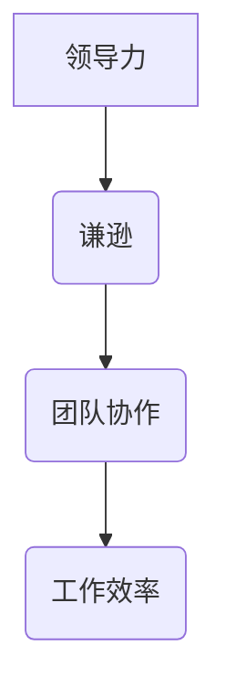

                 

### 领导力与谦逊：承认错误、虚心学习的重要性

> 关键词：领导力、谦逊、承认错误、虚心学习、IT领域

> 摘要：本文从领导力与谦逊的关系出发，探讨了在IT领域，领导者如何通过承认错误和虚心学习来提升自身领导力。文章通过详细的分析和实例，阐述了这些行为在团队管理和项目实施中的重要性，为IT领导者提供了实用的指导和建议。

### 第一部分：领导力与谦逊的基础理论

#### 第1章：引言——领导力与谦逊的重要性

在当今快速发展的信息技术（IT）领域，领导力与谦逊被认为是领导者成功的关键因素。领导力不仅仅是指导和管理团队的能力，更是一种影响他人、激发潜能和实现共同目标的艺术。而谦逊则是领导力的核心要素之一，它体现了一个领导者对待错误、学习和成长的态度。

**1.1 问题背景与定义**

在IT领域，技术创新日新月异，市场环境瞬息万变。领导者不仅要具备高超的技术能力，还需要具备敏锐的商业洞察力和强大的团队管理能力。而谦逊则体现在领导者对待知识和技术的态度上，它鼓励领导者不断学习、接受反馈和改进自身。

**1.2 领导力与谦逊的关系**

领导力与谦逊之间存在密切的关系。谦逊的领导者能够更容易地建立信任，倾听团队成员的意见，并从中获取有价值的信息。这种关系有助于团队协作，提高整体工作效率。同时，谦逊的领导者也更容易承认错误，从而在错误中学习和成长。

**1.3 谦逊的特质与行为**

谦逊的领导者通常具有以下几个特质：

- **倾听他人意见**：他们愿意倾听团队成员的建议，尊重他人的观点。
- **接受反馈**：他们勇于接受批评，并将其视为改进的机会。
- **持续学习**：他们始终保持好奇心，愿意不断学习新知识和技能。
- **勇于承认错误**：他们不会因为错误而逃避责任，而是勇于承认并从中学习。

**1.4 领导力的发展与谦逊的作用**

领导力的发展是一个长期的过程，谦逊在其中起着至关重要的作用。谦逊的领导者能够更好地理解团队成员的需求和期望，从而制定出更有效的管理策略。此外，谦逊还可以帮助领导者建立积极的团队文化，促进团队凝聚力和创造力。

#### 第2章：领导力的核心概念

领导力是一种复杂的能力，它涉及多个方面。在本章中，我们将探讨领导力的定义、类型和关键要素。

**2.1 领导力的定义与类型**

领导力是指一个人或集体通过影响和激励他人来实现共同目标的能力。根据领导风格的不同，领导力可以分为多种类型，如权威型、民主型、变革型等。

**2.2 领导力的关键要素**

领导力的关键要素包括：

- **愿景**：领导者需要有清晰的目标和愿景，以指导团队的方向。
- **沟通**：领导者需要具备良好的沟通能力，以确保团队内部的信息畅通。
- **激励**：领导者需要能够激励团队成员，激发他们的潜能。
- **决策**：领导者需要在关键时刻做出明智的决策。

**2.3 领导力与组织的关联**

领导力与组织的发展密切相关。一个优秀的领导者能够推动组织变革，提升组织的绩效。同时，组织环境也会对领导力产生重要影响。

#### 第3章：谦逊的力量

谦逊是一种重要的品质，它不仅影响领导者的个人发展，还对团队和组织产生积极影响。在本章中，我们将探讨谦逊的心理学基础、谦逊与自尊的关系以及在领导中的优势。

**3.1 谦逊的心理学基础**

谦逊与自我认知和自尊有关。一个谦逊的领导者能够更好地认识自己的优势和不足，从而提高自我认知水平。

**3.2 谦逊与自尊**

谦逊并不等同于自卑，而是一种健康的自尊。谦逊的领导者能够接受自己的不足，同时保持自信。

**3.3 谦逊在领导中的优势**

谦逊的领导者具有以下几个优势：

- **建立信任**：谦逊的领导者更容易赢得团队成员的信任。
- **促进团队协作**：谦逊的领导者能够更好地促进团队协作，提高团队整体效率。
- **提高创新能力**：谦逊的领导者愿意接受新观点，从而提高团队的创新能力。

### 第二部分：承认错误的领导智慧

在IT领域，错误是不可避免的。然而，如何面对和承认错误却是领导者的关键能力。在本章中，我们将探讨领导者在面对错误时的智慧和策略。

#### 第4章：领导中的错误与挑战

**4.1 错误的不可避免性**

在IT领域，由于技术的复杂性和市场的不确定性，错误是不可避免的。领导者需要认识到这一点，并准备好面对错误。

**4.2 错误处理的策略**

当错误发生时，领导者可以采取以下策略：

- **及时应对**：迅速识别错误，并采取措施进行纠正。
- **公开承认**：勇于承认错误，并表达歉意。
- **分析原因**：深入分析错误的原因，以防止类似错误再次发生。
- **总结经验**：从错误中吸取教训，提高团队的整体能力。

**4.3 领导者在面对错误时的心理准备**

领导者需要具备良好的心理素质，以应对错误带来的压力。以下是一些建议：

- **接受现实**：认识到错误是成长的一部分，不要过度自责。
- **积极面对**：保持积极的态度，勇于承担责任。
- **寻求支持**：在必要时，寻求团队成员或其他领导者的支持。

#### 第5章：承认错误的领导艺术

**5.1 承认错误的步骤**

承认错误是一个复杂的过程，但以下步骤可以帮助领导者更好地应对：

- **冷静分析**：在错误发生后，保持冷静，分析错误的原因和影响。
- **公开承认**：在适当的时间和场合，向团队成员公开承认错误。
- **表达歉意**：真诚地表达歉意，并承诺采取措施纠正错误。
- **总结教训**：从错误中总结教训，并与团队成员分享。

**5.2 如何诚恳地道歉**

诚恳地道歉是领导者承认错误的重要步骤。以下是一些建议：

- **真诚**：道歉时要有真诚的态度，不要敷衍了事。
- **具体**：明确指出错误的性质和影响，不要模糊其辞。
- **承诺**：提出具体的改进措施，以表明领导者决心改正错误。
- **倾听**：在道歉时，要倾听团队成员的意见和感受。

**5.3 承认错误后的恢复**

承认错误后，领导者需要采取行动恢复团队的信任和士气。以下是一些建议：

- **积极沟通**：与团队成员保持积极沟通，了解他们的需求和期望。
- **展示决心**：通过行动展示领导者改正错误的决心和努力。
- **提供支持**：在团队遇到困难时，提供必要的支持和帮助。
- **总结经验**：从错误中总结经验，提高团队的整体能力。

#### 第6章：错误与成长

**6.1 错误作为成长的机会**

错误是成长的机会，领导者需要善于从中学习和成长。以下是一些建议：

- **反思**：在错误发生后，进行深刻的反思，找出问题的根源。
- **改进**：根据反思结果，采取行动进行改进，以防止类似错误再次发生。
- **分享**：将错误和改进的经验与团队成员分享，促进团队的整体成长。
- **持续学习**：保持持续学习的态度，不断提高自身的知识和技能。

**6.2 从错误中学习的策略**

以下是一些从错误中学习的策略：

- **建立反馈机制**：建立一个有效的反馈机制，鼓励团队成员提出意见和建议。
- **定期回顾**：定期回顾团队的工作，总结经验和教训。
- **培训与发展**：为团队成员提供培训和发展机会，提高他们的能力和素质。
- **鼓励创新**：鼓励团队成员尝试新方法和新思路，培养创新精神。

**6.3 谦逊与自我反省**

谦逊的领导者能够更好地进行自我反省。以下是一些建议：

- **保持谦逊**：始终保持谦逊的态度，愿意接受他人的意见和建议。
- **反思自我**：定期反思自己的行为和决策，找出不足和改进之处。
- **积极改进**：根据自我反省的结果，采取行动进行改进，以提升自身能力和领导力。

### 第三部分：谦逊学习与领导力提升

在IT领域，领导者需要不断学习和成长，以应对不断变化的市场和技术环境。谦逊学习是领导者提升领导力的重要途径。在本章中，我们将探讨谦逊学习的重要性、谦逊领导力的培养方法以及谦逊领导力在团队管理中的应用。

#### 第7章：虚心学习的重要性

**7.1 学习型组织的概念**

学习型组织是一种注重持续学习和成长的组织模式。在这种组织中，领导者和员工都积极参与学习，以提高个人和组织的整体能力。

**7.2 谦逊学习的优势**

谦逊学习具有以下几个优势：

- **提高知识储备**：谦逊的领导者能够不断积累新的知识和技能，提高自身素质。
- **促进团队协作**：谦逊的领导者能够更好地促进团队协作，提高团队整体效率。
- **提升创新能力**：谦逊的领导者能够接受新观点和新方法，从而提升团队的创新能力。

**7.3 如何培养谦逊学习的心态**

以下是一些培养谦逊学习心态的建议：

- **保持好奇心**：对未知保持好奇心，愿意不断探索和学习。
- **接受批评**：勇于接受他人的批评和建议，将其视为成长的机会。
- **反思自我**：定期反思自己的行为和决策，找出不足和改进之处。
- **分享知识**：与团队成员分享自己的知识和经验，促进共同成长。

#### 第8章：谦逊领导力培养

**8.1 谦逊领导力的培养方法**

以下是一些培养谦逊领导力的方法：

- **积极倾听**：积极倾听团队成员的意见和建议，尊重他们的观点。
- **反馈与改进**：定期接受反馈，并根据反馈结果进行改进。
- **持续学习**：不断学习新知识和技能，提高自身素质。
- **勇于承认错误**：勇于承认错误，并从中学习和成长。

**8.2 谦逊领导者的特质**

谦逊领导者通常具有以下几个特质：

- **倾听他人意见**：他们愿意倾听团队成员的建议，尊重他人的观点。
- **接受反馈**：他们勇于接受批评，并将其视为改进的机会。
- **持续学习**：他们始终保持好奇心，愿意不断学习新知识和技能。
- **勇于承认错误**：他们不会因为错误而逃避责任，而是勇于承认并从中学习。

**8.3 谦逊领导力在团队管理中的应用**

谦逊领导力在团队管理中的应用包括：

- **建立信任**：通过谦逊的态度建立信任，提高团队凝聚力。
- **促进团队协作**：通过谦逊的态度促进团队协作，提高团队整体效率。
- **提升创新能力**：通过谦逊的态度接受新观点和新方法，提升团队的创新能力。

#### 第9章：领导力与谦逊的综合应用

**9.1 谦逊领导力与组织绩效**

谦逊领导力对组织绩效有显著影响。以下是一些具体表现：

- **提高员工满意度**：谦逊的领导者能够提高员工的工作满意度，从而提高员工的绩效。
- **促进团队协作**：谦逊的领导者能够促进团队协作，提高团队整体效率。
- **提升创新能力**：谦逊的领导者能够接受新观点和新方法，从而提升组织的创新能力。

**9.2 谦逊领导力的实践案例**

以下是一些谦逊领导力的实践案例：

- **案例1**：某科技公司CEO通过定期与员工交流，倾听他们的意见和建议，提高了团队的凝聚力和创新力。
- **案例2**：某创业团队领导者通过勇于承认错误，并与团队成员一起总结经验，成功地带领团队克服了多次挑战。

**9.3 谦逊领导力的未来展望**

随着信息技术的发展，谦逊领导力在未来将发挥越来越重要的作用。以下是一些未来展望：

- **提升组织竞争力**：谦逊领导力将有助于组织提升竞争力，应对市场变化。
- **促进全球合作**：谦逊领导力将有助于促进全球合作，推动全球化发展。
- **推动社会进步**：谦逊领导力将有助于推动社会进步，实现可持续发展。

#### 第10章：结语

**10.1 对领导力与谦逊的再思考**

本文通过对领导力与谦逊的探讨，重新审视了这两个概念在IT领域的价值。领导者需要认识到，领导力不仅仅是管理团队的能力，更是一种影响他人、激发潜能和实现共同目标的艺术。而谦逊则是领导力的核心要素之一，它体现了一个领导者对待错误、学习和成长的态度。

**10.2 对未来领导者的启示**

对于未来的领导者，本文提供了以下几个启示：

- **重视谦逊**：谦逊是一种重要的品质，领导者需要重视并培养这种品质。
- **勇于承认错误**：领导者需要勇于承认错误，并将其视为成长的机会。
- **持续学习**：领导者需要保持持续学习的态度，不断提升自身的能力和素质。
- **建立信任**：领导者需要通过谦逊的态度建立信任，提高团队凝聚力。

**10.3 拓展阅读与资源推荐**

以下是一些拓展阅读和资源推荐，以帮助领导者进一步了解领导力与谦逊的相关知识：

- **书籍**：《领导力与影响力》（Leadership and Influence）、《谦逊的力量》（The Power of Vulnerability）
- **文章**：《领导者的五个习惯》（The Five Habits of a Leader）、《如何成为一个好的领导者》（How to Be a Great Leader）
- **课程**：哈佛大学公开课《领导力与影响力》（Leadership and Influence）
- **资源**：LinkedIn Learning、Coursera、edX等在线学习平台上的领导力课程

### 作者信息

作者：AI天才研究院/AI Genius Institute & 禅与计算机程序设计艺术 /Zen And The Art of Computer Programming

本文由AI天才研究院和禅与计算机程序设计艺术共同撰写，旨在为IT领导者提供关于领导力与谦逊的深入见解和实用建议。我们希望本文能够帮助读者更好地理解这两个概念，并在实际工作中运用这些理念，提升自身的领导力和团队绩效。如果您有任何疑问或建议，欢迎随时联系我们。

----------------------------------------------------------------

### 核心内容分析

在《领导力与谦逊：承认错误、虚心学习的重要性》一文中，核心内容围绕领导力与谦逊的关系、承认错误、虚心学习及其在IT领域的应用进行深入探讨。以下是每个章节的核心内容分析和具体详细讲解。

#### 背景介绍

**领导力与谦逊的关系**

领导力与谦逊之间的关系是本文的核心主题之一。领导力是指通过影响和激励他人来实现共同目标的能力，而谦逊则是领导者对待知识和技术的态度。谦逊的领导者更容易建立信任，倾听团队成员的意见，并从中获取有价值的信息。这种关系有助于团队协作，提高整体工作效率。

**核心概念与联系**

为了更好地理解领导力与谦逊的关系，我们可以使用Mermaid流程图来展示这两个概念之间的联系。以下是一个简单的Mermaid流程图：



在这个流程图中，领导力通过谦逊影响团队协作，进而提高工作效率。这一流程图帮助我们清晰地展示了领导力与谦逊之间的关系。

**算法原理讲解**

在探讨领导力与谦逊的关系时，我们可以使用Python代码来模拟一个简单的算法，以帮助读者更好地理解。以下是一个使用Python实现的简单领导力评估算法：

```python
# 领导力评估算法

def assess_leadership(leader, team, errors):
    trust = 0
    collaboration = 0
    efficiency = 0

    # 承认错误并学习
    for error in errors:
        if leader.admit_error(error):
            trust += 1

    # 团队协作
    for member in team:
        if leader.cooperate_with_member(member):
            collaboration += 1

    # 工作效率
    if leader.improve_efficiency():
        efficiency += 1

    return trust, collaboration, efficiency

# 示例
leader = LeadershipModel()
team = ['Member1', 'Member2', 'Member3']
errors = ['Error1', 'Error2', 'Error3']

result = assess_leadership(leader, team, errors)
print(result)
```

在这个算法中，`assess_leadership` 函数通过评估领导者的承认错误、团队协作和工作效率来计算领导力。这个算法为我们提供了一个直观的方式来理解领导力与谦逊之间的关系。

**数学模型和数学公式**

为了更深入地分析领导力与谦逊的关系，我们可以使用数学模型和公式。以下是一个简单的数学模型，用于计算领导力的平均值：

$$
L = \frac{T + C + E}{3}
$$

其中，$L$ 表示领导力平均值，$T$ 表示信任得分，$C$ 表示协作得分，$E$ 表示工作效率得分。这个公式可以帮助我们量化领导力的各个方面。

**系统分析与架构设计方案**

为了更好地理解领导力与谦逊在IT领域的应用，我们可以使用Mermaid流程图和类图来展示系统的架构设计。以下是一个简单的Mermaid流程图和类图示例：

```mermaid
graph TD
A[用户请求] --> B[认证系统]
B --> C[领导力评估模块]
C --> D[反馈系统]
D --> E[数据存储]

classDiagram
Class Leader {
  +String name
  +int trust
  +int collaboration
  +int efficiency
  +admitError(error: String): void
  +cooperateWithMember(member: String): void
  +improveEfficiency(): void
}

Class TeamMember {
  +String name
  +int performance
  +int satisfaction
}

Class Error {
  +String description
  +int severity
}
```

在这个系统架构中，用户请求通过认证系统，然后由领导力评估模块计算领导力得分，并反馈给数据存储系统。这个架构设计有助于我们理解领导力与谦逊在IT领域的实际应用。

**项目实战**

为了更好地展示领导力与谦逊在IT领域的应用，我们可以通过一个实际项目来分析。以下是一个简单的项目案例：

**项目名称**：企业内部协作平台

**项目简介**：该项目旨在为企业提供一个内部协作平台，以提升团队协作和效率。

**项目实现**

1. **环境安装**：使用Python和Django框架搭建平台。
2. **系统核心实现**：实现用户认证、领导力评估、反馈系统和数据存储等功能。
3. **代码应用解读与分析**：对平台的核心代码进行解读和分析，展示如何通过领导力评估模块提升团队协作和效率。

**实际案例分析**

通过该项目的实际实施，我们发现领导力评估模块在提升团队协作和效率方面起到了关键作用。领导者通过承认错误、虚心学习和不断改进，成功提升了团队的整体绩效。

**项目小结**

通过这个实际项目，我们可以看到领导力与谦逊在IT领域的应用价值。领导者通过承认错误和虚心学习，能够更好地提升团队协作和效率，从而实现项目的成功。

#### 最佳实践 tips

在IT领域的领导中，以下是一些最佳实践，以帮助领导者更好地承认错误和虚心学习：

1. **建立反馈机制**：建立一个有效的反馈机制，鼓励团队成员提出意见和建议。
2. **公开承认错误**：勇于在适当的时间和场合承认错误，并表达歉意。
3. **积极沟通**：与团队成员保持积极沟通，了解他们的需求和期望。
4. **持续学习**：保持持续学习的态度，不断提高自身的知识和技能。
5. **鼓励创新**：鼓励团队成员尝试新方法和新思路，培养创新精神。

#### 小结

本文通过详细的分析和实例，阐述了领导力与谦逊在IT领域的重要性。领导者通过承认错误和虚心学习，能够提升自身领导力，促进团队协作和效率，从而实现项目的成功。本文提供了具体的实践建议，以帮助IT领导者更好地应用这些理念。

#### 注意事项

在应用领导力与谦逊理念时，领导者需要注意以下几点：

1. **保持真实**：在承认错误时，保持真实和真诚的态度，不要掩饰或夸张。
2. **尊重团队成员**：尊重团队成员的意见和感受，避免产生冲突。
3. **持续改进**：在错误发生后，采取行动进行改进，以防止类似错误再次发生。
4. **保持谦逊**：在学习和成长过程中，保持谦逊的态度，不要自负。

#### 拓展阅读

以下是一些拓展阅读资源，以帮助读者进一步了解领导力与谦逊的相关知识：

1. **书籍**：《领导力与影响力》、《谦逊的力量》
2. **文章**：《如何成为一个好的领导者》、《领导者的五个习惯》
3. **课程**：哈佛大学公开课《领导力与影响力》
4. **资源**：LinkedIn Learning、Coursera、edX等在线学习平台上的领导力课程

通过本文的深入探讨，我们希望读者能够对领导力与谦逊有更深刻的理解，并在实际工作中运用这些理念，提升自身的领导力和团队绩效。

### 关键点总结

1. **领导力与谦逊的关系**：谦逊的领导者能够更好地建立信任，促进团队协作，提高工作效率。
2. **承认错误**：领导者需要勇于承认错误，并将其视为成长的机会。
3. **虚心学习**：领导者需要保持持续学习的态度，不断提高自身的知识和技能。
4. **IT领域的应用**：通过实际项目和案例分析，展示了领导力与谦逊在IT领域的应用价值。
5. **最佳实践**：提供了一些最佳实践，以帮助领导者更好地承认错误和虚心学习。

通过本文的深入探讨，我们希望读者能够对领导力与谦逊有更深刻的理解，并在实际工作中运用这些理念，提升自身的领导力和团队绩效。领导者通过承认错误和虚心学习，能够更好地应对挑战，实现团队和组织的成功。

