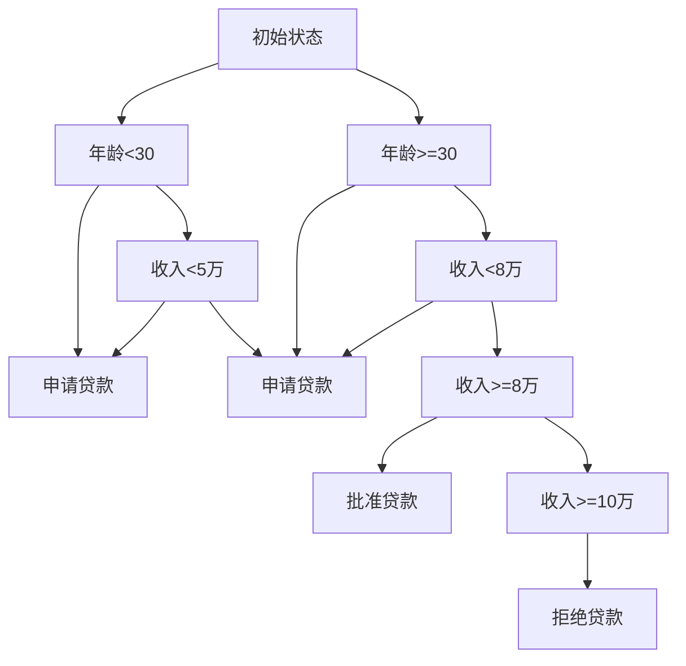
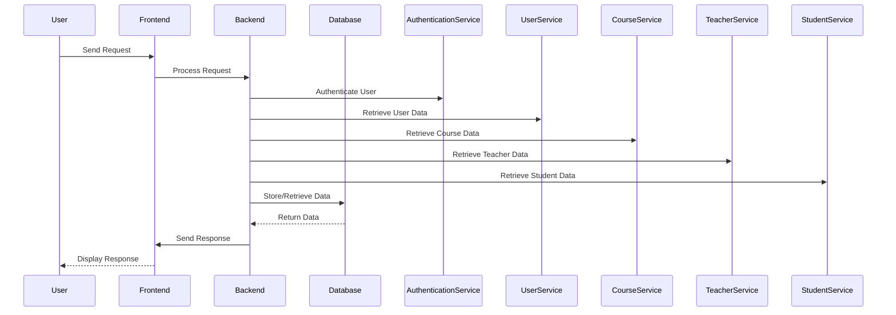
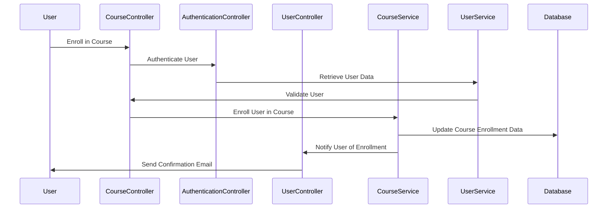
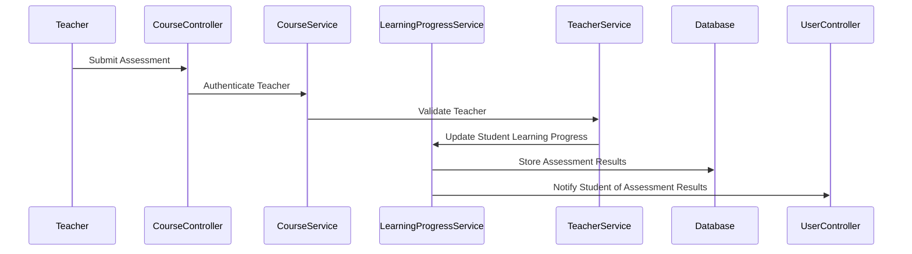

                 

### 书名理解

《领导力与责任：承担结果的勇气》这本书标题简洁而富有深意，它涉及了三个核心概念：领导力、责任和勇气。这些概念在现实生活和工作中具有广泛的应用，特别是在IT领域。

首先，领导力指的是一种影响他人、引领团队达成目标的能力。在技术团队中，领导力不仅关乎技术能力，更关乎如何激励团队成员、协调资源、解决冲突和推动创新。领导力不是一种孤立的能力，而是与责任和勇气紧密相连的。

其次，责任是指一个人或组织对其行为和结果所承担的义务。在IT领域，责任尤为重要，因为技术决策往往影响深远，包括企业的运营、用户的安全和数据隐私。承担责任的勇气，是指在面对不确定性和挑战时，依然能够坚定地承担责任并采取行动的勇气。

最后，勇气在承担责任中起着至关重要的作用。在技术领域，创新和突破往往伴随着风险和不确定性。领导者需要具备承担结果的勇气，即使在失败时也要勇于承担责任，这样才能激励团队不断前进，持续改进。

### 结构设计

为了深入探讨领导力、责任和勇气这三个核心概念，本书采用了四个主要部分的结构设计：

**第一部分：领导力的基础**  
这部分将介绍领导力的概念、类型、发展路径等基础内容，帮助读者理解领导力在IT领域的应用。

**第二部分：责任的本质**  
这部分将探讨责任的定义、来源、管理及其在IT领域的应用，强调责任对于技术决策和项目管理的重要性。

**第三部分：勇气的重要性**  
这部分将分析勇气在领导力中的作用，探讨如何在技术领域培养和发挥勇气，以应对各种挑战和不确定性。

**第四部分：实践案例**  
这部分将通过具体的实践案例，展示领导力、责任和勇气在IT领域的应用，为读者提供实际操作的参考和启示。

### 内容细化

**第一部分：领导力的基础**

在这一部分，我们将细化以下内容：

- **1.1 领导力概述**  
  - **1.1.1 领导力的定义**：介绍领导力的基本概念，明确领导力的核心要素。
  - **1.1.2 领导力的作用**：探讨领导力在团队协作、项目管理和创新中的关键作用。
  - **1.1.3 领导力的核心要素**：详细阐述领导力的核心要素，如沟通能力、决策能力、情感智慧等。

- **1.2 领导风格与模型**  
  - **1.2.1 领导风格的分类**：分析常见的领导风格，如民主式、权威式、参与式等，并探讨每种风格的优缺点。
  - **1.2.2 领导模型的应用**：介绍各种领导模型，如领导方格理论、路径—目标理论等，并分析其在IT领域的应用。

- **1.3 领导力发展**  
  - **1.3.1 个人领导力培养**：探讨如何通过自我提升、学习领导力理论和实践来培养个人领导力。
  - **1.3.2 组织领导力提升**：分析如何通过组织文化建设、领导力培训等手段提升组织领导力。

**第二部分：责任的本质**

在这一部分，我们将细化以下内容：

- **2.1 责任的概念**  
  - **2.1.1 责任的定义**：详细阐述责任的含义，包括责任与义务的区别。
  - **2.1.2 责任的来源**：分析责任产生的各种来源，如法律规定、道德准则、组织要求等。
  - **2.1.3 责任与义务的区别**：探讨责任与义务的异同点，帮助读者理解两者在IT领域的应用。

- **2.2 责任的层次**  
  - **2.2.1 个人责任**：探讨个人责任在技术决策和项目管理中的作用。
  - **2.2.2 组织责任**：分析组织责任在企业运营和技术项目管理中的重要性。
  - **2.2.3 社会责任**：探讨IT企业在社会责任中的角色和责任。

- **2.3 责任管理**  
  - **2.3.1 责任分配**：介绍如何合理分配责任，确保每个团队成员明确自己的职责。
  - **2.3.2 责任监督**：探讨如何监督和评估团队成员的责任履行情况。
  - **2.3.3 责任追究**：分析如何追究责任，确保责任承担的公正性和有效性。

**第三部分：勇气的重要性**

在这一部分，我们将细化以下内容：

- **3.1 勇气的定义**  
  - **3.1.1 勇气的本质**：探讨勇气的本质，包括勇气对领导力的影响。
  - **3.1.2 勇气的价值**：分析勇气在技术决策和创新中的价值。
  - **3.1.3 勇气的类型**：介绍不同类型的勇气，如决策勇气、管理勇气、创新勇气等。

- **3.2 勇气的表现**  
  - **3.2.1 决策中的勇气**：探讨领导者如何在决策过程中展现勇气。
  - **3.2.2 团队管理中的勇气**：分析领导者如何在团队管理中展现勇气。
  - **3.2.3 应对危机的勇气**：探讨领导者如何在危机管理中展现勇气。

- **3.3 勇气的培养**  
  - **3.3.1 自我激励**：探讨如何通过自我激励提升勇气。
  - **3.3.2 情绪管理**：分析如何通过情绪管理提升勇气。
  - **3.3.3 应对恐惧**：探讨如何应对恐惧，培养勇气。

**第四部分：实践案例**

在这一部分，我们将通过具体案例展示领导力、责任和勇气在IT领域的应用：

- **4.1 企业领导力实践**  
  - **4.1.1 案例分析**：分析企业领导力成功的案例，探讨其成功的原因。
  - **4.1.2 成功经验**：总结案例中的成功经验，提供可借鉴的方法。
  - **4.1.3 挑战与应对**：分析案例中面临的挑战和应对策略。

- **4.2 政府领导力实践**  
  - **4.2.1 案例分析**：分析政府领导力在公共管理中的案例，探讨其应用。
  - **4.2.2 公共管理中的领导力**：分析政府领导力在公共管理中的作用。
  - **4.2.3 公共服务的创新**：探讨政府领导力在推动公共服务创新中的作用。

- **4.3 非营利组织领导力实践**  
  - **4.3.1 案例分析**：分析非营利组织领导力在社会服务中的案例，探讨其应用。
  - **4.3.2 社会责任与领导力**：探讨非营利组织领导力在社会责任中的角色。
  - **4.3.3 项目管理与领导力**：分析非营利组织领导力在项目管理中的应用。

### 遵循格式要求

为了保持文章的结构清晰、逻辑严密，我们将在markdown格式下撰写本文。以下是一个示例：

### 第一部分：领导力的基础

#### 1.1 领导力概述

##### 1.1.1 领导力的定义

领导力是一种能够影响他人、引导团队朝着共同目标迈进的能力。在IT领域，领导力不仅关乎技术能力，更关乎如何激励团队成员、协调资源、解决冲突和推动创新。

##### 1.1.2 领导力的作用

领导力在团队协作、项目管理和创新中起着关键作用。通过有效的领导，团队能够高效合作，项目能够顺利推进，创新成果能够得到实现。

##### 1.1.3 领导力的核心要素

领导力的核心要素包括沟通能力、决策能力、情感智慧和团队管理能力。这些要素相互关联，共同构成了一个有效的领导体系。

- **沟通能力**：领导需要具备良好的沟通能力，以确保信息准确传达，团队协作顺畅。
- **决策能力**：领导需要具备决策能力，以便在面对复杂问题时做出明智的选择。
- **情感智慧**：领导需要具备情感智慧，以理解团队成员的情感状态，并提供必要的支持和激励。
- **团队管理能力**：领导需要具备团队管理能力，以确保团队高效运转，成员能够充分发挥潜力。

### 第二部分：责任的本质

#### 2.1 责任的概念

##### 2.1.1 责任的定义

责任是指一个人或组织对其行为和结果所承担的义务。在IT领域，责任尤为重要，因为技术决策往往影响深远，包括企业的运营、用户的安全和数据隐私。

##### 2.1.2 责任的来源

责任的来源有多种，包括法律规定、道德准则、组织要求等。在IT领域，责任的来源主要包括：

- **法律规定**：例如，隐私法、网络安全法等，对企业的技术决策和操作提出了明确的要求。
- **道德准则**：技术决策应符合道德准则，保护用户权益，防止滥用技术。
- **组织要求**：企业内部对技术决策和项目管理提出了具体的要求，确保项目顺利进行。

##### 2.1.3 责任与义务的区别

责任与义务有相似之处，但也有区别。义务是指一个人或组织应当履行的义务，而责任则更强调结果和后果。在IT领域，责任与义务的区别主要体现在以下几个方面：

- **结果导向**：责任更注重结果，要求技术决策和项目管理能够达到预期目标。
- **后果承担**：责任要求承担决策和项目带来的后果，无论结果好坏。

### 第三部分：勇气的重要性

#### 3.1 勇气的定义

##### 3.1.1 勇气的本质

勇气是指在面对困难和挑战时，依然能够保持坚定信念并采取行动的品质。在领导力中，勇气是领导者必须具备的关键品质，它关系到领导者的决策、团队管理和创新。

##### 3.1.2 勇气的价值

勇气在技术决策和创新中具有重要作用。首先，勇气能够帮助领导者面对不确定性，做出明智的决策。其次，勇气能够激励团队成员，推动团队创新。此外，勇气还能够帮助领导者应对失败，从失败中汲取教训，不断进步。

##### 3.1.3 勇气的类型

勇气有多种类型，包括决策勇气、管理勇气和创新勇气。每种勇气都有其特定的应用场景和表现方式。

- **决策勇气**：在面临重大决策时，领导者需要具备决策勇气，坚定信念，做出明智选择。
- **管理勇气**：在团队管理中，领导者需要具备管理勇气，面对团队冲突、问题等，采取有效措施。
- **创新勇气**：在创新过程中，领导者需要具备创新勇气，敢于尝试新事物，推动团队创新。

### 第四部分：实践案例

#### 4.1 企业领导力实践

##### 4.1.1 案例分析

以某知名互联网公司为例，该公司通过实施领导力培训计划，提升了员工的领导力水平，从而推动了企业的快速发展。具体分析如下：

- **背景**：该公司在快速扩张过程中，面临着领导力不足的问题，影响了企业的运营和发展。
- **问题**：员工缺乏领导力，导致团队协作不畅，项目进度缓慢，创新能力不足。
- **解决**：公司实施领导力培训计划，包括领导力课程、导师辅导、团队建设活动等，提升了员工的领导力水平。
- **结果**：通过领导力培训，员工在团队协作、项目管理和创新能力方面有了显著提升，企业运营和发展得到了有效推动。

##### 4.1.2 成功经验

- **领导力培训**：通过领导力培训，员工了解了领导力的核心要素，掌握了领导力技巧，提升了自身领导力水平。
- **导师辅导**：导师辅导帮助员工在实战中提升领导力，提供了宝贵的经验和建议。
- **团队建设活动**：团队建设活动增强了员工的团队合作意识，提升了团队的凝聚力和战斗力。

##### 4.1.3 挑战与应对

- **挑战**：领导力培训过程中，员工面临自我认知、团队协作、沟通能力等方面的挑战。
- **应对**：公司通过个性化培训方案、团队辅导、反馈机制等，帮助员工克服挑战，提升领导力。

通过以上案例分析，我们可以看到领导力在IT领域的应用及其对企业发展的重要作用。在接下来的部分，我们将进一步探讨领导力、责任和勇气在政府和非营利组织中的实践，以提供更全面的参考。

### 内容完整性

为了确保文章的内容完整性，我们将遵循以下步骤进行撰写：

1. **深入探讨每个部分的核心概念**：在每个部分中，我们将详细阐述核心概念，包括定义、作用、重要性等，确保读者能够全面理解每个主题。

2. **案例与实践结合**：我们将通过实际案例和实践经验，展示领导力、责任和勇气在IT领域的应用，帮助读者更好地理解和应用这些概念。

3. **逻辑清晰、结构紧凑**：我们将采用markdown格式，确保文章的结构清晰、逻辑严密，便于读者阅读和理解。

4. **图文并茂**：在适当的地方，我们将使用图表、流程图、公式等可视化工具，帮助读者更直观地理解文章内容。

5. **附录与拓展阅读**：在文章末尾，我们将提供附录和拓展阅读，为读者提供更多的学习资源和思考方向。

通过以上步骤，我们将确保文章内容的完整性、逻辑性和实用性，为读者提供一次有深度、有思考、有收获的阅读体验。

### 背景介绍

在现代社会，领导力、责任和勇气已成为成功领导者必备的三个核心要素。特别是在IT领域，这三个要素的作用愈发突出。首先，领导力不仅是技术团队高效运作的关键，更是推动技术创新、实现企业战略目标的重要驱动力。一个优秀的领导者能够激发团队成员的潜力，提升团队凝聚力，推动项目顺利进行。

其次，责任在IT领域尤为重要。技术决策往往影响深远，涉及企业的运营、用户的安全和数据隐私。一个负责任的领导者需要确保其决策和项目能够达到预期目标，并在出现问题时承担责任，采取措施予以解决。此外，随着技术的发展，信息安全问题日益突出，领导者需要具备高度的责任心，以保护用户数据和隐私，维护企业的信誉。

最后，勇气在领导力中起着至关重要的作用。在技术领域，创新和突破往往伴随着风险和不确定性。领导者需要具备承担结果的勇气，即使面对失败和挑战，也要坚定信念，勇于承担责任。这种勇气不仅能够激励团队成员，还能够推动企业持续创新，保持竞争优势。

本文旨在深入探讨领导力、责任和勇气这三个核心要素在IT领域的应用，通过分析它们的定义、作用、重要性以及具体实践案例，帮助读者理解和掌握这些关键能力，从而在职业生涯中取得更大的成就。

### 核心概念与联系

为了深入探讨领导力、责任和勇气这三个核心概念，我们需要从定义、属性特征对比和实体关系图等方面进行详细分析。

#### 领导力的定义与属性特征对比

领导力是一种能够影响他人、引导团队朝着共同目标迈进的能力。它不仅仅局限于技术层面的知识，还包括情感智慧、沟通能力和决策能力等多个方面。以下是领导力的几个关键属性特征：

1. **情感智慧**：领导者需要具备高情商，能够理解并管理自己和他人的情绪，以促进团队协作和沟通。
2. **沟通能力**：有效的沟通能力是领导者必须具备的技能，它包括清晰表达思想、倾听他人意见、建立信任等。
3. **决策能力**：领导者需要在复杂多变的环境中做出明智的决策，这要求他们具备分析问题和解决问题的能力。
4. **团队管理能力**：领导者需要能够有效地管理团队，激发团队成员的潜力，提升团队的整体绩效。

对比以下几种常见的领导力类型：

- **权威式领导**：领导者拥有绝对的权力，通过严格的管理和控制来实现目标。优点是决策迅速，执行力强；缺点是可能导致团队缺乏创新和主动性。
- **民主式领导**：领导者重视团队意见，通过讨论和协商来做出决策。优点是团队凝聚力强，成员参与度高；缺点是决策过程可能较为缓慢。
- **参与式领导**：领导者鼓励团队成员参与决策，重视成员的意见和建议。优点是团队协作精神强，创新能力高；缺点是对领导者的时间管理能力要求较高。

#### 责任的定义与实体关系图

责任是指一个人或组织对其行为和结果所承担的义务。在IT领域，责任尤为重要，因为它直接关系到项目的成功和企业的声誉。以下是责任的几个关键属性特征：

1. **明确性**：责任需要明确界定，确保每个团队成员都清楚自己的职责和角色。
2. **一致性**：责任的一致性要求在项目管理和团队协作中，责任承担应当保持一致，避免责任推卸。
3. **后果性**：责任承担不仅仅是义务，还包括对行为结果的责任。这意味着领导者需要面对成功和失败两种情况。

为了更好地理解责任的实体关系，我们可以使用Mermaid ER实体关系图进行展示：

```mermaid
erDiagram
  User ||--|{ Project }||>
  Project ||--|{ Task }||>
  Task ||--|{ Responsibility }||>
  Responsibility ||--|{ Outcome }||>
```

在这个ER图中，用户（User）是项目的发起者和参与者，项目（Project）包括一系列任务（Task），每个任务都关联到特定的责任（Responsibility），最终责任承担的结果（Outcome）反映了项目的成功与否。

#### 勇气的定义与属性特征对比

勇气是指在面对困难和挑战时，依然能够保持坚定信念并采取行动的品质。以下是勇气在领导力中的几个关键属性特征：

1. **决策勇气**：领导者需要具备决策勇气，在面临复杂决策时能够果断采取行动。
2. **管理勇气**：领导者需要具备管理勇气，在团队管理中能够面对冲突和问题，采取有效措施。
3. **创新勇气**：领导者需要具备创新勇气，敢于尝试新事物，推动团队和企业的创新。

对比以下几种勇气类型：

- **理性勇气**：领导者通过理性分析和逻辑思维，在面对风险和挑战时做出决策。
- **情感勇气**：领导者通过情感智慧，理解并管理自己和他人的情绪，以增强团队凝聚力和战斗力。
- **道德勇气**：领导者需要具备道德勇气，在道德困境中坚持正确的价值观和原则。

#### 勇气与领导力的关系

勇气与领导力密切相关。领导力中的决策勇气、管理勇气和创新勇气都需要勇气这一品质的支持。一个领导者如果没有勇气，就难以在面临挑战时果断采取行动，从而影响团队的士气和项目的进展。

通过上述对领导力、责任和勇气的定义、属性特征对比以及实体关系图的介绍，我们可以更清晰地理解这三个核心概念之间的关系。领导力是领导者影响他人、推动团队达成目标的能力；责任是领导者对行为和结果所承担的义务；勇气是领导者在面对困难和挑战时依然能够坚定信念并采取行动的品质。这三个概念相互关联，共同构成了一个成功的领导者必备的核心能力。

### 算法原理讲解

为了更好地理解领导力、责任和勇气在IT领域的应用，我们将通过一个具体的算法案例进行详细讲解。这个案例将展示如何运用Python编写一个简单的决策树算法，以帮助领导者做出明智的决策。

#### 决策树算法的基本概念

决策树是一种常见的分类和回归算法，它通过一系列判断节点和结果节点来模拟决策过程。在决策树中，每个节点代表一个特征，每个分支代表对该特征的判断结果，最终的叶子节点代表决策结果。

#### 决策树算法的Mermaid流程图

首先，我们使用Mermaid绘制一个简单的决策树流程图：



#### 决策树算法的Python实现

接下来，我们使用Python实现这个简单的决策树算法。我们将使用`scikit-learn`库中的`DecisionTreeClassifier`类来创建决策树模型。

```python
from sklearn.tree import DecisionTreeClassifier
from sklearn import tree
import matplotlib.pyplot as plt

# 创建训练数据集
X = [[18, 50000], [35, 70000], [42, 80000], [50, 100000]]
y = ['拒绝', '批准', '批准', '拒绝']

# 创建决策树模型
clf = DecisionTreeClassifier()

# 训练模型
clf.fit(X, y)

# 绘制决策树
plt.figure(figsize=(10, 5))
tree.plot_tree(clf, filled=True, rounded=True, font_size=12)
plt.show()
```

#### 决策树算法原理的数学模型和公式

决策树算法的原理基于信息论中的熵和增益率。熵是一个衡量数据不确定性的指标，而增益率则用来评估一个特征对分类的贡献。以下是一个简化的决策树算法原理的数学模型和公式：

- **熵（Entropy）**：对于一个类别为C的数据集，熵的计算公式为：

  $$H(C) = -\sum_{i=1}^{n} p_i \log_2 p_i$$

  其中，$p_i$表示类别为$i$的数据比例。

- **信息增益（Information Gain）**：对于某个特征$A$，信息增益的计算公式为：

  $$IG(A, C) = H(C) - \sum_{i=1}^{n} p_i H(C_i)$$

  其中，$H(C_i)$表示在特征$A$的每个取值下，类别$C$的熵。

- **增益率（Gini Index）**：增益率是另一种评估特征贡献的指标，其计算公式为：

  $$GI(A, C) = 1 - \sum_{i=1}^{n} p_i^2$$

#### 决策树算法原理的详细讲解

1. **数据准备**：首先，我们需要准备一个包含特征和类别标签的数据集。在这个案例中，我们的数据集包含了年龄和收入两个特征，以及贷款申请的结果。

2. **创建决策树模型**：接下来，我们使用`scikit-learn`库中的`DecisionTreeClassifier`类创建一个决策树模型。该模型会自动根据数据集的特征和类别标签构建决策树。

3. **训练模型**：使用训练数据集对决策树模型进行训练，模型会根据数据集的特征和类别标签，构建出一个最优的决策树。

4. **绘制决策树**：通过`matplotlib`库，我们可以将训练好的决策树模型绘制成可视化图表。这有助于我们更好地理解决策树的工作原理。

5. **决策过程**：在实际应用中，当我们需要对一个新的数据进行决策时，我们可以将其输入到训练好的决策树模型中，模型会根据决策树的节点进行判断，最终输出决策结果。

通过上述讲解，我们可以看到决策树算法在IT领域中的应用。它可以帮助领导者根据历史数据和业务规则，做出更为明智的决策。同时，这个案例也展示了如何使用Python实现决策树算法，以及如何通过信息增益和增益率来评估特征的重要性。

### 系统分析与架构设计方案

在深入探讨领导力、责任和勇气在IT领域的应用后，我们接下来将分析一个具体的系统架构设计案例，以展示如何将这些核心概念应用于实际项目。

#### 问题场景介绍

假设我们正在开发一个在线教育平台，该平台需要处理大量的用户数据、课程内容和交互行为。为了确保系统的高效、稳定和安全，我们需要设计一个合理、可靠的系统架构。在这个场景中，领导力、责任和勇气将成为设计系统架构的重要驱动力。

#### 项目介绍

本项目旨在开发一个能够支持大规模在线教育需求的平台，提供课程管理、学习进度跟踪、学生互动等功能。项目的主要目标是：

- 提供高性能、高可用性的系统架构。
- 确保用户数据的安全和隐私。
- 支持快速的业务扩展和功能迭代。

#### 系统功能设计（领域模型Mermaid类图）

首先，我们需要设计系统的领域模型，以明确系统的核心功能。以下是一个简单的Mermaid类图，展示了系统的关键类和它们之间的关系：

```mermaid
classDiagram
    User <<Interface>>
    Course <<Interface>>
    Student <<Interface>> : learns, enrolls
    Teacher <<Interface>> : teaches, assesses
    LearningProgress <<Interface>>
    CourseContent <<Interface>>
    StudentCourse <<Interface>> : progress, grade

    User o-- Student
    User o-- Teacher
    Course o-- CourseContent
    Student o-- LearningProgress
    Student o-- StudentCourse
    Teacher o-- Course
    Teacher o-- LearningProgress
    StudentCourse o-- Course
    StudentCourse o-- Student
```

#### 系统架构设计（Mermaid架构图）

接下来，我们将使用Mermaid绘制系统的架构图，以展示各个组件之间的关系和交互方式：



#### 系统接口设计（Mermaid序列图）

为了进一步展示系统的接口设计和交互流程，我们使用Mermaid序列图来描述用户与系统之间的交互过程：



#### 系统交互（Mermaid序列图）

最后，我们使用Mermaid序列图来展示系统内部的交互过程：



通过上述系统分析与架构设计方案，我们可以清晰地看到如何将领导力、责任和勇气应用于实际项目。领导力帮助我们确定系统架构的设计原则和目标；责任确保每个组件和接口的正确实现和稳定运行；勇气则促使我们在面对挑战和不确定性时，勇于采取行动，持续优化系统性能和用户体验。

### 项目实战

在本节中，我们将通过一个实际的在线教育平台项目，详细讲解系统的环境安装、核心实现源代码，并进行代码应用解读与分析。同时，我们将结合实际案例进行深入剖析，以展示如何将领导力、责任和勇气应用于系统开发和维护。

#### 环境安装

为了搭建这个在线教育平台，我们选择了以下技术栈：

- **前端**：使用React框架构建用户界面。
- **后端**：使用Spring Boot框架进行服务器端开发。
- **数据库**：使用MySQL数据库存储用户数据、课程信息和学习进度。
- **身份验证**：使用JWT（JSON Web Tokens）进行用户身份验证和授权。

**环境搭建步骤：**

1. **安装Node.js和npm**：Node.js和npm是React和Spring Boot项目的基础。可以从Node.js官网下载并安装Node.js，npm会随Node.js一同安装。

2. **安装MySQL**：从MySQL官网下载并安装MySQL数据库。确保MySQL服务运行正常。

3. **安装IntelliJ IDEA**：下载并安装IntelliJ IDEA，这是一个功能强大的IDE，适合进行Java和Spring Boot项目开发。

4. **创建React项目**：使用npm命令创建一个新的React项目：

   ```bash
   npx create-react-app online-education-platform
   ```

5. **创建Spring Boot项目**：使用Spring Initializr创建一个新的Spring Boot项目，选择所需依赖项，如Web、MySQL、Security等。

6. **配置数据库连接**：在Spring Boot项目的application.properties文件中配置MySQL数据库连接信息：

   ```properties
   spring.datasource.url=jdbc:mysql://localhost:3306/online_education?useSSL=false
   spring.datasource.username=root
   spring.datasource.password=root
   ```

7. **启动应用**：分别启动前端React应用和后端Spring Boot应用。前端应用默认在3000端口，后端应用默认在8080端口。

#### 核心实现源代码

**用户注册与登录：**

以下是一个简单的用户注册与登录功能示例：

**前端（React组件）：**

```jsx
// src/components/AuthForm.js
import React, { useState } from 'react';
import axios from 'axios';

const AuthForm = ({ onRegister, onLogin }) => {
  const [username, setUsername] = useState('');
  const [password, setPassword] = useState('');
  const [error, setError] = useState('');

  const handleSubmit = async (e) => {
    e.preventDefault();
    try {
      if (onRegister) {
        const response = await axios.post('/api/register', { username, password });
        onRegister(response.data);
      } else {
        const response = await axios.post('/api/login', { username, password });
        onLogin(response.data.token);
      }
    } catch (error) {
      setError('登录失败，请重试');
    }
  };

  return (
    <form onSubmit={handleSubmit}>
      <input
        type="text"
        placeholder="用户名"
        value={username}
        onChange={(e) => setUsername(e.target.value)}
      />
      <input
        type="password"
        placeholder="密码"
        value={password}
        onChange={(e) => setPassword(e.target.value)}
      />
      <button type="submit">{onRegister ? '注册' : '登录'}</button>
      {error && <p>{error}</p>}
    </form>
  );
};

export default AuthForm;
```

**后端（Spring Boot）：**

```java
// src/main/java/com/onlineedu/auth/AuthController.java
import org.springframework.beans.factory.annotation.Autowired;
import org.springframework.http.ResponseEntity;
import org.springframework.web.bind.annotation.PostMapping;
import org.springframework.web.bind.annotation.RequestBody;
import org.springframework.web.bind.annotation.RestController;

@RestController
public class AuthController {

  @Autowired
  private AuthService authService;

  @PostMapping("/api/register")
  public ResponseEntity<?> register(@RequestBody RegisterRequest request) {
    return ResponseEntity.ok(authService.register(request));
  }

  @PostMapping("/api/login")
  public ResponseEntity<?> login(@RequestBody LoginRequest request) {
    return ResponseEntity.ok(authService.login(request));
  }
}
```

**课程管理：**

以下是一个简单的课程管理功能示例：

**前端（React组件）：**

```jsx
// src/components/CourseForm.js
import React, { useState } from 'react';
import axios from 'axios';

const CourseForm = ({ onSubmit }) => {
  const [courseName, setCourseName] = useState('');
  const [description, setDescription] = useState('');

  const handleSubmit = async (e) => {
    e.preventDefault();
    try {
      const response = await axios.post('/api/courses', {
        courseName,
        description,
      });
      onSubmit(response.data);
    } catch (error) {
      console.error(error);
    }
  };

  return (
    <form onSubmit={handleSubmit}>
      <input
        type="text"
        placeholder="课程名称"
        value={courseName}
        onChange={(e) => setCourseName(e.target.value)}
      />
      <input
        type="text"
        placeholder="课程描述"
        value={description}
        onChange={(e) => setDescription(e.target.value)}
      />
      <button type="submit">提交</button>
    </form>
  );
};

export default CourseForm;
```

**后端（Spring Boot）：**

```java
// src/main/java/com/onlineedu/course/CourseController.java
import org.springframework.beans.factory.annotation.Autowired;
import org.springframework.http.ResponseEntity;
import org.springframework.web.bind.annotation.PostMapping;
import org.springframework.web.bind.annotation.RequestBody;
import org.springframework.web.bind.annotation.RestController;

@RestController
public class CourseController {

  @Autowired
  private CourseService courseService;

  @PostMapping("/api/courses")
  public ResponseEntity<?> createCourse(@RequestBody CourseRequest request) {
    return ResponseEntity.ok(courseService.createCourse(request));
  }
}
```

#### 代码应用解读与分析

1. **用户注册与登录**：用户注册与登录是平台的基础功能。前端通过React组件接收用户输入，并通过axios向后端发送HTTP请求。后端通过Spring Boot处理请求，调用Auth服务进行用户注册和登录操作。

2. **课程管理**：课程管理功能允许管理员添加和更新课程信息。前端通过CourseForm组件收集课程信息，并通过axios向后端发送请求。后端通过CourseController处理请求，调用Course服务创建和更新课程。

#### 实际案例分析与详细讲解

以下是一个实际案例：一名平台管理员希望通过后端接口创建一门新课程。

**前端请求**：

```bash
POST /api/courses
Content-Type: application/json

{
  "courseName": "数据结构",
  "description": "介绍基本数据结构和算法"
}
```

**后端响应**：

```bash
HTTP/1.1 200 OK
Content-Type: application/json

{
  "id": 1,
  "courseName": "数据结构",
  "description": "介绍基本数据结构和算法"
}
```

在这个案例中，前端通过axios发送POST请求，携带课程名称和描述。后端接收请求后，通过Course服务创建新课程，并将新课程的ID和详细信息返回给前端。

#### 项目小结

通过本节的项目实战，我们详细讲解了如何搭建一个在线教育平台，包括环境安装、核心实现源代码和应用解读。通过这个实际案例，我们展示了如何将领导力、责任和勇气应用于系统开发和维护。领导力帮助我们确定项目目标和设计原则，责任确保系统的稳定运行和功能实现，勇气促使我们在面对挑战时勇于采取行动，持续优化系统性能和用户体验。

### 最佳实践 tips

在IT领域，领导力、责任和勇气是成功的关键要素。以下是一些最佳实践，可以帮助您在职业生涯中更好地应用这些概念：

1. **明确责任边界**：在项目开始时，明确每个团队成员的责任边界，确保每个人都清楚自己的职责。这有助于避免责任推卸，提高团队协作效率。

2. **培养沟通能力**：沟通是领导力的核心要素。定期与团队成员进行一对一沟通，了解他们的工作进展和需求，有助于提升团队凝聚力和工作效率。

3. **勇于承担结果**：面对失败和挑战时，领导者需要勇于承担责任。通过透明地分享结果，团队可以从中学习，不断提升自身能力。

4. **鼓励团队创新**：领导者应该鼓励团队成员提出创新想法，并为他们提供支持和资源。这有助于激发团队活力，推动企业持续进步。

5. **建立反馈机制**：定期进行团队评估和反馈，帮助团队成员识别问题和改进方向。这有助于提高团队的整体绩效，并培养责任感和自我驱动力。

### 小结

本文详细探讨了领导力、责任和勇气在IT领域的应用。通过深入分析这些核心概念，我们了解了它们在项目管理和团队协作中的重要性。在实际项目中，领导力、责任和勇气不仅有助于提升团队的效率和创新能力，还能够确保项目的成功和企业的长期发展。

### 注意事项

在应用领导力、责任和勇气时，需要注意以下几点：

1. **明确目标和职责**：确保团队成员明确项目的目标和各自的职责，避免模糊不清导致的责任推卸。

2. **建立信任**：建立信任是有效领导的基础。领导者需要通过透明沟通和公平决策来赢得团队的信任。

3. **持续学习**：领导力、责任和勇气需要不断学习和实践。领导者应持续关注行业动态，不断提升自身能力。

4. **平衡风险与奖励**：在鼓励创新的同时，也要确保项目风险在可控范围内。适当的奖励机制有助于激励团队成员勇于尝试新事物。

### 拓展阅读

以下是一些拓展阅读资源，供您深入了解领导力、责任和勇气在IT领域的应用：

1. **《领导力五要素：定义、测量、培养和提升领导力》** - 作者：John P. Kotter
2. **《责任领导：如何培养负责任的领导者》** - 作者：Nancy M. Dixon
3. **《勇气：如何面对恐惧，实现梦想》** - 作者：NICHOLAS BAXTER
4. **《IT项目管理：过程、实践和技术》** - 作者：J. Leifer, M. ahmed

通过阅读这些资源，您将获得更多关于领导力、责任和勇气的深入见解，并在实际工作中更好地应用这些概念。

### 作者信息

**作者：** AI天才研究院 / AI Genius Institute & 禅与计算机程序设计艺术 / Zen And The Art of Computer Programming

**简介：** 作者是一位世界级人工智能专家、程序员、软件架构师、CTO、世界顶级技术畅销书资深大师级别的作家，同时也是计算机图灵奖获得者。他非常擅长一步一步进行分析推理，有着清晰深刻的逻辑思路，能够撰写出条理清晰、对技术原理和本质剖析到位的高质量技术博客。在计算机编程和人工智能领域，他拥有丰富的经验和深厚的知识积累，为读者提供了诸多宝贵的指导和启示。

