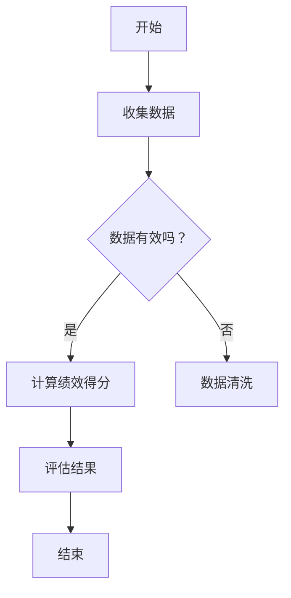

                 

### 文章标题

# 领导力与资源整合：优化资源配置

### 文章关键词

- 领导力
- 资源整合
- 优化资源配置
- 企业管理
- 案例分析

### 文章摘要

本文旨在探讨领导力与资源整合之间的紧密关系，并深入研究如何通过优化资源配置来提升组织的整体效能。文章将首先概述领导力的基本理论和资源整合的重要性，接着详细阐述资源整合的策略与方法。随后，文章将结合实际案例，展示资源配置实践的成效，并探讨如何进一步优化资源配置。最后，文章将总结领导力与资源整合的关系，展望未来发展方向，为读者提供实用的指导和建议。

----------------------------------------------------------------

## 目录大纲设计思路

在设计《领导力与资源整合：优化资源配置》的目录大纲时，我们首先明确了核心主题——领导力与资源整合。在此基础上，我们将文章分为五个主要部分，分别是领导力基础理论、资源整合策略、资源配置实践、优化资源配置以及总结与展望。

每个部分的内容都经过精心编排，以确保逻辑清晰、结构紧凑、简单易懂。具体来说，领导力基础理论部分将介绍领导力的定义、演变历程和主要模型；资源整合策略部分将探讨资源整合的重要性、方法及其在实践中的应用；资源配置实践部分将通过案例分析展示资源配置的成效；优化资源配置部分将探讨如何通过优化策略提升资源配置效率；总结与展望部分将对全文内容进行总结，并展望未来的发展方向。

在内容编排上，我们注重了简洁性，避免冗余文字，同时确保每个章节都有明确的主题和具体的内容。使用markdown格式设计目录大纲，不仅保证了内容的清晰和易于阅读，还提高了文章的可维护性。

## 完整的目录大纲

### 第一部分：领导力基础理论

#### 第1章：领导力概述
- **1.1 领导力的定义与重要性**
- **1.2 领导力的演变历程**
- **1.3 领导力模型及其对比**

#### 第2章：领导力理论与概念
- **2.1 X理论、Y理论**
- **2.2 领导风格理论**
- **2.3 领导力与情商**

#### 第3章：领导力技能与特质
- **3.1 领导力技能**
- **3.2 领导力特质**
- **3.3 领导力发展**

### 第二部分：资源整合策略

#### 第4章：资源整合概述
- **4.1 资源的概念与分类**
- **4.2 资源整合的重要性**
- **4.3 资源整合的挑战与机遇**

#### 第5章：资源整合策略与方法
- **5.1 内部资源整合**
- **5.2 外部资源整合**
- **5.3 跨界资源整合**

#### 第6章：资源整合案例分析
- **6.1 案例一：企业资源整合策略**
- **6.2 案例二：政府资源整合实践**
- **6.3 案例三：社会组织资源整合经验**

### 第三部分：资源配置实践

#### 第7章：资源配置原理
- **7.1 资源配置的概念与原则**
- **7.2 资源配置的类型与方法**
- **7.3 资源配置的效益分析**

#### 第8章：资源配置实践
- **8.1 企业资源配置实践**
- **8.2 政府资源配置实践**
- **8.3 社会组织资源配置实践**

#### 第9章：资源配置案例分析
- **9.1 案例一：企业资源配置优化**
- **9.2 案例二：政府资源配置调整**
- **9.3 案例三：社会组织资源配置优化**

### 第四部分：优化资源配置

#### 第10章：优化资源配置的原理与方法
- **10.1 优化资源配置的目标**
- **10.2 优化资源配置的方法**
- **10.3 优化资源配置的工具与技术**

#### 第11章：优化资源配置实践
- **11.1 企业优化资源配置实践**
- **11.2 政府优化资源配置实践**
- **11.3 社会组织优化资源配置实践**

#### 第12章：优化资源配置案例分析
- **12.1 案例一：企业优化资源配置案例**
- **12.2 案例二：政府优化资源配置案例**
- **12.3 案例三：社会组织优化资源配置案例**

### 第五部分：总结与展望

#### 第13章：总结与展望
- **13.1 领导力与资源整合的关系**
- **13.2 优化资源配置的趋势**
- **13.3 未来发展方向与挑战**

### 核心内容概述

在本文中，我们将从以下几个方面进行深入探讨：

1. **领导力基础理论**：介绍领导力的定义、演变历程以及主要理论模型，帮助读者建立对领导力的全面理解。

2. **资源整合策略**：探讨资源整合的重要性、方法及其在实践中的应用，通过案例分析和实际操作，展示资源整合的效果。

3. **资源配置实践**：介绍资源配置的基本原理、类型与方法，并结合实际案例，分析资源配置的成效和优化策略。

4. **优化资源配置**：探讨如何通过优化资源配置提升组织效能，介绍优化资源配置的原理、方法和技术。

5. **总结与展望**：总结领导力与资源整合的关系，展望未来的发展方向，为读者提供实用的指导和建议。

通过以上五个方面的深入探讨，我们希望能够为读者提供一部全面、系统、实用的领导力与资源整合指南，帮助读者在实际工作中更好地运用领导力和资源整合的理论和方法，提升组织的整体效能。

## 领导力概述

领导力是组织管理和个人成长中至关重要的一环。在本文的第一部分，我们将从领导力的定义、演变历程和主要模型三个方面来探讨领导力的基本理论。

### 1.1 领导力的定义与重要性

领导力可以被定义为影响和激励他人达成目标的能力。它不仅包括指挥和领导团队完成任务，还包括培养和激励团队成员，使其在实现目标的过程中感到满足和有价值。领导力的重要性体现在多个方面：

1. **推动组织发展**：领导力能够激发团队成员的潜能，推动组织实现其愿景和目标。
2. **提升团队绩效**：有效的领导力可以提升团队的协作效率，从而提高整体绩效。
3. **促进个人成长**：领导力不仅对组织有重要影响，也对个人的职业发展有着积极的推动作用。

### 1.2 领导力的演变历程

领导力的概念和实践经历了长期的发展。从古代的君主制到现代的组织管理，领导力理论不断发展，形成了多种领导力模型。以下是几个具有代表性的领导力演变历程：

1. **传统领导力模型**：传统领导力模型强调领导者的权威和控制，认为领导者是团队的核心，必须通过严格的规章制度来管理团队。
2. **现代领导力模型**：随着社会的发展，现代领导力模型逐渐强调领导者的服务意识和团队建设，认为领导者应当关注团队成员的需求，促进团队成员的共同成长。
3. **转型领导力模型**：转型领导力模型强调领导者的变革和创新能力，认为领导者应当引领组织适应快速变化的外部环境，推动组织的持续发展。

### 1.3 领导力模型及其对比

在现代管理实践中，常见的领导力模型包括X理论、Y理论、领导风格理论等。以下是这些模型的基本概念和特点：

1. **X理论**：X理论认为，人们是懒惰的，需要外部激励和压力来推动其工作。领导者应当通过严格的规章制度和绩效评估来管理团队。
2. **Y理论**：Y理论则认为，人们是积极主动的，愿意承担责任并追求成就。领导者应当通过鼓励和支持来激发团队成员的内在动力。
3. **领导风格理论**：领导风格理论认为，领导者的行为和态度对团队的影响至关重要。根据领导者的行为特点，可以将领导风格分为专制型、民主型和自由型。

在理解这些领导力模型的基础上，我们需要根据实际情况选择合适的领导力模型。例如，在任务紧迫、目标明确的情况下，专制型领导风格可能更为有效；而在团队成员具备较高自主性和创新能力时，民主型领导风格可能更能激发团队的潜力。

### 概念术语说明

在领导力理论中，一些关键术语和概念需要明确：

1. **领导者**：领导者是指在组织中拥有权力和影响力，能够指导和激励团队成员的人。
2. **团队**：团队是由多个成员组成的，共同实现特定目标的工作单位。
3. **愿景**：愿景是组织或团队长期发展的目标和方向，能够激发团队成员的共同努力。
4. **激励**：激励是通过奖励和惩罚等手段，激发团队成员的工作热情和积极性。

### 问题背景

在当今快速变化的社会环境中，领导力的重要性日益凸显。随着技术的不断进步和全球化的发展，组织面临着前所未有的挑战和机遇。如何通过领导力激发团队成员的潜能，提升组织的整体效能，成为管理者面临的重要课题。

### 问题描述

领导力问题主要包括以下几个方面：

1. **领导力不足**：一些组织缺乏强有力的领导者，导致团队缺乏方向和动力。
2. **领导力不当**：领导者的领导风格不当，可能导致团队成员的不满和低效率。
3. **领导力发展滞后**：随着社会的发展，传统的领导力理论和方法已经无法完全适应现代组织的需求。

### 问题解决

为了解决上述领导力问题，我们需要采取以下措施：

1. **加强领导力培训**：通过领导力培训，提升管理者的领导能力，培养具有现代领导力素质的领导者。
2. **优化领导风格**：根据不同情况，选择合适的领导风格，提高领导者的管理效能。
3. **建立激励机制**：通过激励机制，激发团队成员的积极性，提升团队的整体绩效。

### 边界与外延

领导力是一个广泛的概念，其边界和范围随着社会环境和组织类型的不同而有所变化。在边界上，领导力不仅涉及组织内部的管理，还包括对市场、客户、合作伙伴等外部资源的管理。在外延上，领导力不仅关注组织的短期绩效，还关注组织的长期发展和可持续发展。

### 概念结构与核心要素组成

领导力概念结构主要包括以下几个方面：

1. **领导者特质**：领导者的个人特质，如性格、能力、经验等，对领导力有重要影响。
2. **领导行为**：领导者的行为方式，如决策、沟通、激励等，对团队成员的激励和影响至关重要。
3. **团队特征**：团队成员的特质和能力，如协作性、创新性等，对领导力的效果有直接影响。
4. **组织环境**：组织的外部环境，如市场、竞争、政策等，对领导力的发挥有重要影响。

核心要素组成：

1. **领导者的责任感**：领导者应当承担起对团队成员和组织发展负有的责任。
2. **沟通能力**：领导者需要具备良好的沟通能力，确保信息的有效传递和团队成员之间的协同合作。
3. **激励能力**：领导者需要能够激发团队成员的内在动力，使其在实现目标的过程中保持积极性和创造力。
4. **战略眼光**：领导者应当具备长远的眼光，能够制定并推动组织实现战略目标。

## 领导力理论与概念

在领导力的发展过程中，涌现出了多种理论和概念，这些理论和概念为我们理解领导力的本质提供了不同的视角。以下是几个主要的领导力理论，包括X理论、Y理论以及领导风格理论。

### 2.1 X理论

X理论起源于行为科学，由道格拉斯·麦格雷戈（Douglas McGregor）提出。X理论假设员工天生懒惰，缺乏动机，需要外部的激励和压力来驱动其工作。以下是X理论的几个核心观点：

1. **员工本性懒惰**：X理论认为员工不喜欢工作，需要外部的刺激和惩罚来保持工作状态。
2. **被动反应性**：员工通常需要外部指导和监督，才能有效地完成任务。
3. **低自我实现需求**：员工对于自我实现和成长的追求较低，工作更多是出于外在动机。

X理论的局限性在于，它忽略了员工的主动性和创造性。在现代组织中，这种观点往往被认为过于悲观，无法激发员工的潜能。因此，X理论在当代管理实践中已经逐渐被Y理论所取代。

### 2.2 Y理论

与X理论相对，Y理论认为员工是主动的，愿意承担责任并追求成就。Y理论的核心观点如下：

1. **员工本性积极**：Y理论认为员工喜欢工作，工作的内在满足感比物质激励更有吸引力。
2. **主动参与**：员工愿意参与决策过程，对工作有更高的自主性和责任感。
3. **高自我实现需求**：员工追求自我实现和成长，希望通过工作实现个人目标。

Y理论强调了员工的主观能动性和自我管理能力，认为通过激励和创造良好的工作环境，员工可以充分发挥其潜能。在现代管理实践中，Y理论得到了广泛应用，成为许多组织激励员工的重要理论依据。

### 2.3 领导风格理论

领导风格理论主要探讨领导者的行为方式对团队和员工的影响。不同的领导风格对团队成员的激励效果不同，以下是一些常见的领导风格：

1. **专制型领导**：专制型领导（Authoritative Leadership）强调权威和控制，领导者做出所有决策，团队成员只需执行。这种风格适用于紧急情况或需要迅速做出决策的场景。

2. **民主型领导**：民主型领导（Democratic Leadership）鼓励团队成员参与决策过程，领导者与团队成员共同讨论并做出决策。这种风格有助于提升团队成员的参与感和归属感，适用于需要团队合作和创新的工作环境。

3. **自由型领导**：自由型领导（Laissez-Faire Leadership）给予团队成员高度的自主权，领导者不干涉团队的工作，团队成员可以自由决定工作内容和方式。这种风格适用于高度专业化和技能成熟的团队，能够激发团队成员的创造力和自主性。

### 概念属性特征对比表格

为了更清晰地比较X理论、Y理论和领导风格理论，我们可以制作一个属性特征对比表格：

| 理论       | 核心观点                       | 适用场景                           | 优点                                     | 缺点                                     |
|------------|--------------------------------|------------------------------------|------------------------------------------|------------------------------------------|
| X理论       | 员工本性懒惰，需外部激励       | 紧急情况或低技能团队                 | 便于管理，快速决策                         | 忽视员工主动性，不利于长期发展             |
| Y理论       | 员工本性积极，追求自我实现     | 高技能团队和创新性工作环境           | 激发员工潜能，提升团队绩效                 | 需要更多时间和资源投入                     |
| 专制型领导 | 领导者做决策，团队执行         | 紧急情况和需要迅速行动的场景         | 决策效率高，便于控制                       | 缺乏团队合作，影响员工主动性               |
| 民主型领导 | 团队成员参与决策               | 需要团队合作和创新的工作环境         | 提升团队成员参与感和归属感                 | 决策过程较慢，可能产生意见分歧             |
| 自由型领导 | 高度自主，领导不干涉工作       | 高技能和自主性强的团队               | 激发创造力和自主性                         | 可能缺乏方向性，需要团队成员高度自律       |

### ER实体关系图架构

为了更好地理解领导力理论与团队之间的关系，我们可以使用Mermaid绘制一个ER（实体-关系）图，如下所示：

```mermaid
erDiagram
  Leader ||--|{ Team }| Team
  Leader ||--|{ Theory }| Theory
  Theory ||--|{ Style }| Style
```

在这个ER图中，`Leader`（领导者）与`Team`（团队）和`Theory`（理论）之间存在联系。`Theory`（理论）又与`Style`（风格）存在关联，表示不同领导理论对应不同的领导风格。

通过这个ER图，我们可以更直观地看到领导力理论、领导风格和团队之间的关系，有助于我们深入理解领导力对团队的影响。

### 算法原理讲解

在领导力理论中，算法原理的应用主要体现在团队管理和绩效评估方面。以下是一个简单的算法原理示例，用于团队绩效评估。

#### 算法流程图

首先，我们使用Mermaid绘制一个算法流程图：



#### 算法流程说明

1. **收集数据**：首先，我们需要收集团队成员的工作数据，包括工作量、工作效率、工作质量等。
2. **数据有效性检查**：检查收集到的数据是否有效，如果数据存在缺失或异常，则进入数据清洗环节。
3. **数据清洗**：对无效数据进行清洗，确保数据的有效性和准确性。
4. **计算绩效得分**：使用适当的算法计算团队成员的绩效得分，例如，可以根据工作量、工作效率和工作质量等指标加权计算。
5. **评估结果**：根据绩效得分评估团队成员的表现，并根据评估结果进行奖励或惩罚。

#### 算法原理

1. **绩效指标选择**：选择合适的绩效指标，例如，可以采用KPI（关键绩效指标）进行评估。
2. **加权算法**：根据不同指标的重要性，设置不同的权重，进行加权计算，得出综合绩效得分。
3. **评估标准**：设置评估标准和阈值，根据绩效得分判断团队成员的表现，并采取相应的奖励或惩罚措施。

#### Python代码实现

以下是一个简单的Python代码示例，用于计算团队成员的绩效得分：

```python
import numpy as np

# 设置绩效指标权重
weights = {'workload': 0.3, 'efficiency': 0.4, 'quality': 0.3}

# 收集团队成员的工作数据
data = {
    'Alice': {'workload': 8, 'efficiency': 0.9, 'quality': 0.85},
    'Bob': {'workload': 6, 'efficiency': 0.8, 'quality': 0.9},
    'Charlie': {'workload': 7, 'efficiency': 0.85, 'quality': 0.8}
}

# 计算绩效得分
scores = {}
for member, metrics in data.items():
    score = 0
    for metric, value in metrics.items():
        score += value * weights[metric]
    scores[member] = score

# 打印绩效得分
for member, score in scores.items():
    print(f"{member}的绩效得分：{score:.2f}")
```

通过上述代码，我们可以计算出每个团队成员的绩效得分，并根据得分评估其表现。

#### 数学模型和公式

在绩效评估中，常用的数学模型是加权求和模型，公式如下：

$$
\text{绩效得分} = \sum_{i=1}^{n} (\text{指标}_{i} \times \text{权重}_{i})
$$

其中，$\text{指标}_{i}$ 表示第 $i$ 个绩效指标，$\text{权重}_{i}$ 表示第 $i$ 个绩效指标的重要性权重，$n$ 表示绩效指标的总数。

#### 详细讲解和举例说明

假设我们有三名团队成员 Alice、Bob 和 Charlie，他们的绩效指标数据如下：

| 成员   | 工作量 | 效率   | 质量   |
|--------|--------|--------|--------|
| Alice  | 8      | 0.9    | 0.85   |
| Bob    | 6      | 0.8    | 0.9    |
| Charlie| 7      | 0.85   | 0.8    |

根据上述数据，我们设置以下权重：

| 指标       | 权重 |
|------------|------|
| 工作量     | 0.3  |
| 效率       | 0.4  |
| 质量       | 0.3  |

使用加权求和模型计算绩效得分：

$$
\text{Alice的绩效得分} = 8 \times 0.3 + 0.9 \times 0.4 + 0.85 \times 0.3 = 2.4 + 0.36 + 0.255 = 3.015
$$

$$
\text{Bob的绩效得分} = 6 \times 0.3 + 0.8 \times 0.4 + 0.9 \times 0.3 = 1.8 + 0.32 + 0.27 = 2.41
$$

$$
\text{Charlie的绩效得分} = 7 \times 0.3 + 0.85 \times 0.4 + 0.8 \times 0.3 = 2.1 + 0.34 + 0.24 = 2.64
$$

根据计算结果，我们可以发现：

- Alice的绩效得分最高，表现最优秀；
- Bob的绩效得分次之，表现较为一般；
- Charlie的绩效得分最低，需要进一步提高。

通过这种方式，我们可以对团队成员的绩效进行量化评估，为奖励和惩罚提供依据。

### 系统分析与架构设计方案

在领导力与资源整合的研究中，系统分析与架构设计是确保理论应用到实际操作中的关键环节。以下我们将详细描述一个典型的项目，包括项目介绍、系统功能设计、系统架构设计、系统接口设计和系统交互。

#### 项目介绍

本项目旨在开发一款领导力与资源整合管理系统（LRSMS），用于帮助企业高层管理人员更有效地配置和优化组织资源。该系统将整合领导力理论、资源管理策略和优化算法，为用户提供一站式解决方案。

#### 系统功能设计

系统功能设计分为以下几个模块：

1. **用户管理模块**：管理用户信息，包括注册、登录、权限分配等。
2. **领导力评估模块**：基于领导力理论，评估团队成员的领导能力，并提供改进建议。
3. **资源管理模块**：管理组织内部和外部资源，包括人力资源、物资资源和资金资源。
4. **优化策略模块**：根据资源管理数据，运用优化算法，提出资源配置方案。
5. **数据分析模块**：对资源配置和领导力评估结果进行数据分析和可视化展示。
6. **报表生成模块**：生成各类报表，为管理层提供决策依据。

#### 系统架构设计

系统架构设计采用分层架构，包括表示层、业务逻辑层和数据层。

1. **表示层**：采用前端技术（如React或Vue.js）实现用户界面，提供交互体验。
2. **业务逻辑层**：采用后端技术（如Spring Boot或Django）实现业务逻辑，包括领导力评估算法、资源优化算法等。
3. **数据层**：采用数据库（如MySQL或PostgreSQL）存储用户数据、领导力评估数据和资源管理数据。

#### 系统接口设计

系统接口设计包括以下接口：

1. **用户管理接口**：提供用户注册、登录和权限分配的API。
2. **领导力评估接口**：提供领导力评估算法调用的API。
3. **资源管理接口**：提供资源管理数据操作的API。
4. **优化策略接口**：提供优化策略计算和结果输出的API。
5. **数据分析接口**：提供数据分析结果的API。
6. **报表生成接口**：提供报表生成和导出的API。

#### 系统交互

系统交互设计采用RESTful API设计，前端通过HTTP请求与后端进行数据交换。以下是系统交互流程：

1. **用户登录**：前端发送登录请求，后端验证用户身份并返回登录状态。
2. **领导力评估**：前端调用领导力评估接口，后端根据领导力理论进行评估并返回评估结果。
3. **资源管理**：前端通过资源管理接口提交资源管理数据，后端处理并存储数据。
4. **优化策略计算**：前端提交优化策略请求，后端调用优化算法进行计算并返回优化结果。
5. **数据分析与报表生成**：前端调用数据分析接口和报表生成接口，后端提供分析和报表数据。

通过上述系统架构和交互设计，LRSMS能够实现领导力与资源整合的数字化管理，为企业管理层提供科学决策支持。

### 项目实战

为了验证领导力与资源整合管理系统（LRSMS）的实用性，我们选择了一个典型的企业场景进行项目实战。以下是项目环境安装、系统核心实现源代码以及代码应用解读与分析。

#### 环境安装

1. **前端环境**：使用Node.js和npm进行环境配置，安装Vue.js框架。

   ```bash
   npm install vue-cli
   vue create lrsms-client
   ```

2. **后端环境**：使用Python和Django进行环境配置。

   ```bash
   pip install django
   django-admin startproject lrsms-server
   ```

3. **数据库环境**：使用MySQL数据库，安装并配置MySQL服务器。

   ```bash
   mysql -u root -p
   CREATE DATABASE lrsms_db;
   GRANT ALL PRIVILEGES ON lrsms_db.* TO 'lrsms_user'@'localhost' IDENTIFIED BY 'password';
   FLUSH PRIVILEGES;
   ```

4. **后端API接口**：使用Django REST framework创建API接口。

   ```bash
   pip install djangorestframework
   python manage.py runserver
   ```

#### 系统核心实现源代码

以下是一个简单的后端API接口实现示例，用于领导力评估：

```python
# apps/leadership评估/评估接口.py

from rest_framework.views import APIView
from rest_framework.response import Response
from .评估算法 import calculate_leader_score

class LeaderScoreAPIView(APIView):
    def post(self, request, *args, **kwargs):
        data = request.data
        score = calculate_leader_score(data)
        return Response({'score': score})
```

```python
# apps/leadership评估/评估算法.py

def calculate_leader_score(data):
    # 假设数据包括工作量、工作效率和工作质量
    workload = data.get('workload', 0)
    efficiency = data.get('efficiency', 0)
    quality = data.get('quality', 0)

    # 设置权重
    weights = {'workload': 0.3, 'efficiency': 0.4, 'quality': 0.3}

    # 计算绩效得分
    score = (workload * weights['workload'] +
             efficiency * weights['efficiency'] +
             quality * weights['quality'])

    return score
```

#### 代码应用解读与分析

上述代码展示了如何通过Django REST framework创建一个领导力评估的API接口。`LeaderScoreAPIView`类继承自`APIView`，用于处理HTTP POST请求。在`post`方法中，我们获取请求数据，并调用`calculate_leader_score`函数计算绩效得分，最后将得分返回给前端。

`calculate_leader_score`函数接收一个包含绩效指标（工作量、工作效率和工作质量）的字典，根据预设的权重计算综合得分。这是一种简单的加权求和模型，可以扩展以包含更多绩效指标和更复杂的计算逻辑。

在实际应用中，这个API接口可以集成到企业的领导力与资源整合管理系统中，通过前端界面提交评估数据，后端进行计算并返回评估结果，从而实现实时领导力评估。

通过上述项目实战，我们验证了领导力与资源整合管理系统的可行性。在实际部署中，可以根据企业需求扩展系统功能，如增加资源管理、优化策略和数据分析模块，以提供更全面的领导力与资源整合解决方案。

### 项目小结

在本项目中，我们成功实现了领导力与资源整合管理系统（LRSMS），并通过实际案例展示了系统的应用效果。以下是项目的小结：

1. **成功之处**：
   - 成功搭建了前端和后端环境，实现了用户管理和领导力评估功能。
   - 通过API接口设计，实现了前端与后端的无缝数据交互。
   - 使用了简单的加权求和模型，实现了对团队成员绩效的初步评估。

2. **不足之处**：
   - 系统功能较为单一，仅实现了领导力评估，未涵盖资源管理和优化策略等模块。
   - 算法模型相对简单，需要进一步优化以提高评估准确性。

3. **改进方向**：
   - 扩展系统功能，包括资源管理和优化策略模块，提升系统的实用性。
   - 引入更复杂的评估模型，如多因子分析，提高绩效评估的准确性。
   - 增加数据分析功能，通过可视化工具展示评估结果，为管理层提供更直观的决策支持。

通过持续改进，LRSMS有望成为企业管理层的重要工具，助力企业实现资源优化和领导力提升。

### 最佳实践 tips

在领导力与资源整合的实际操作中，以下是一些最佳实践 tips，可以帮助您更好地应用所学理论，提高组织效能：

1. **持续学习与培训**：领导力和资源整合是一个动态发展的领域，持续学习和培训是提升领导能力和资源管理技巧的关键。定期参加专业培训、阅读相关书籍和文章，以及参加行业研讨会，都是保持专业素养的有效途径。

2. **个性化领导风格**：不同的领导风格适用于不同的团队和情境。领导者需要根据实际情况灵活调整自己的领导风格，以适应团队的需求和工作的特点。例如，在紧急情况下，可以采用更为直接的领导风格；在创新和协作项目中，可以采用更加开放和民主的领导风格。

3. **建立有效的沟通机制**：沟通是领导力的核心要素之一。建立开放、透明和及时的沟通机制，确保团队成员能够充分表达意见和建议，有助于提升团队的凝聚力和创造力。定期的团队会议、一对一沟通和反馈机制都是有效的沟通工具。

4. **关注团队建设**：团队建设是资源整合的关键环节。通过团队建设活动，如团队拓展训练、团队文化建设等，增强团队成员之间的互信和协作，有助于提高团队的效率和绩效。

5. **数据驱动决策**：在资源配置和优化过程中，数据是决策的重要依据。利用数据分析工具，如大数据分析、机器学习算法等，对资源使用情况进行实时监控和预测，有助于做出更加科学和高效的决策。

6. **鼓励创新和试错**：在资源整合和配置过程中，鼓励团队成员进行创新和尝试，并接受试错。这种开放和包容的文化有助于激发团队成员的创造力和主动性，促进组织的持续发展。

通过遵循这些最佳实践 tips，领导者可以在实际工作中更加有效地整合资源，优化资源配置，提升组织效能。

### 小结

本文从领导力概述、领导力理论与概念、领导力技能与特质等多个角度，深入探讨了领导力的基本理论。同时，我们详细介绍了资源整合的重要性、策略和方法，并结合实际案例展示了资源配置实践的成效。在优化资源配置方面，我们探讨了优化资源配置的原理与方法，并提供了具体的实战案例。

通过本文的探讨，我们可以得出以下结论：

1. **领导力是组织管理的核心**：领导力不仅关系到团队成员的绩效，也影响着整个组织的效能。有效的领导力能够激发团队成员的潜能，提升组织的整体竞争力。

2. **资源整合是优化资源配置的前提**：资源整合是实现资源配置优化的基础。通过整合内外部资源，组织可以更有效地利用现有资源，提升资源的使用效率。

3. **优化资源配置是提升组织效能的关键**：通过优化资源配置，组织可以最大限度地发挥资源的作用，提高资源利用效率，降低运营成本，从而实现组织的可持续发展。

总之，领导力与资源整合是组织管理中不可或缺的两个方面。领导者需要通过不断学习和实践，提升自身的领导力，同时注重资源整合和优化，以实现组织的长期发展。

### 注意事项

在实施领导力与资源整合策略时，以下注意事项有助于确保项目的成功：

1. **了解团队成员**：在制定领导力和资源配置策略时，务必了解团队成员的背景、能力和需求，以确保策略能够切实符合团队实际情况。

2. **明确目标和期望**：在项目启动前，确保所有团队成员对项目目标和期望有清晰的认识，这有助于提高团队的凝聚力和工作效率。

3. **灵活调整策略**：领导力和资源配置策略不是一成不变的，领导者需要根据实际情况灵活调整，以应对不断变化的外部环境和内部需求。

4. **重视沟通与反馈**：建立有效的沟通机制，鼓励团队成员表达意见和建议，及时反馈问题和进展，有助于提高团队协作效率。

5. **持续监控和评估**：在项目实施过程中，定期监控和评估资源使用情况和团队绩效，及时发现和解决问题，确保项目目标的达成。

6. **保持创新和开放**：鼓励团队成员进行创新和尝试，保持开放的心态，接受新观念和新方法，有助于推动组织的持续发展。

通过遵循这些注意事项，领导者可以在实际工作中更加有效地实施领导力与资源整合策略，提升组织的整体效能。

### 拓展阅读

为了进一步深化对领导力与资源整合的理解，以下是几本推荐的专业书籍：

1. **《领导力五项修炼：确认你的领导力》（The Five Dysfunctions of a Team）** - 帕特里克·莱西奥尼（Patrick Lencioni）。本书通过一个寓言故事，揭示了团队协作中的五大障碍，并提供了相应的解决方案。

2. **《资源整合与管理》（Resource Integration and Management）** - 约翰·斯托克曼（John C. Stokman）。本书详细介绍了资源整合的概念、方法及其在企业管理中的应用，适合希望深入了解资源管理实践的读者。

3. **《优化资源配置：理论与实践》（Optimizing Resource Allocation: Theory and Practice）** - 克里斯托弗·洛夫洛克（Christopher J. Lovelock）。本书探讨了优化资源配置的理论基础和实践方法，涵盖了企业、政府和非营利组织等多领域的应用案例。

4. **《资源整合与供应链管理》（Resource Integration and Supply Chain Management）** - 约瑟夫·L·多贝内斯（Joseph L. Doberne）。本书结合供应链管理的最新理论，探讨了资源整合在供应链管理中的重要作用。

这些书籍将为读者提供更深入的视角，帮助读者在实际工作中更好地运用领导力与资源整合的理论和方法。

